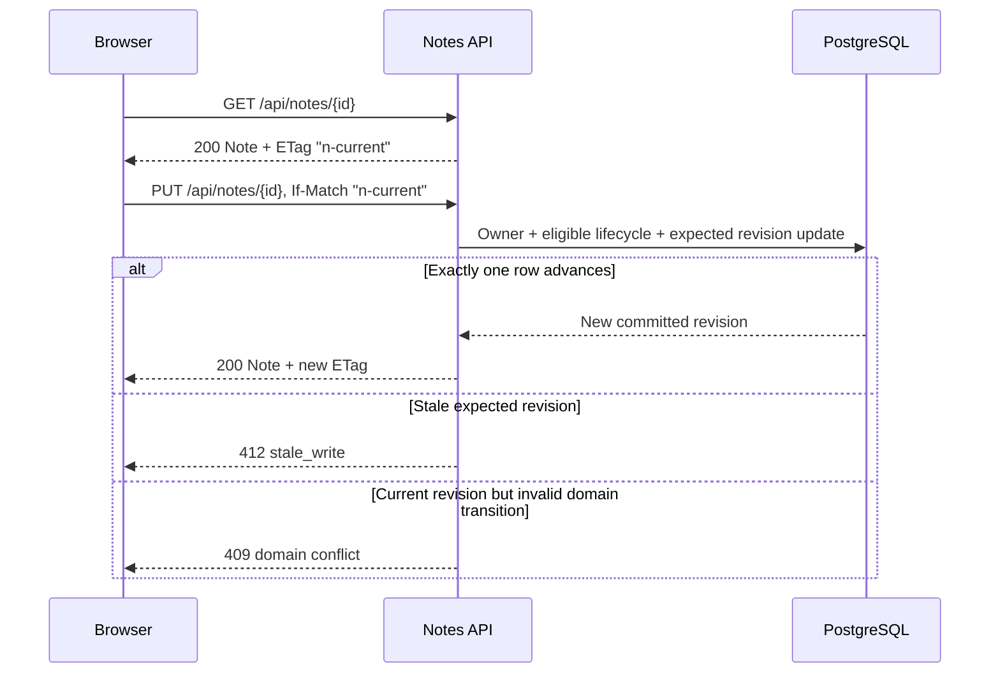
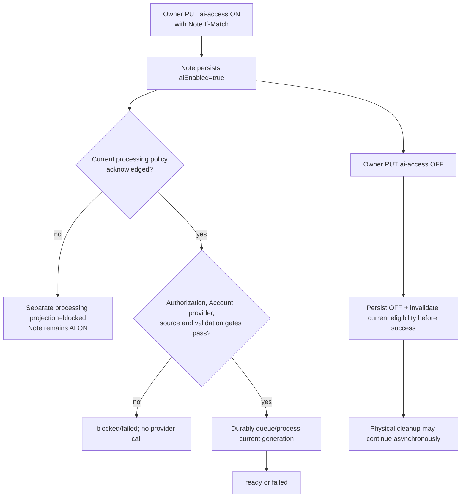
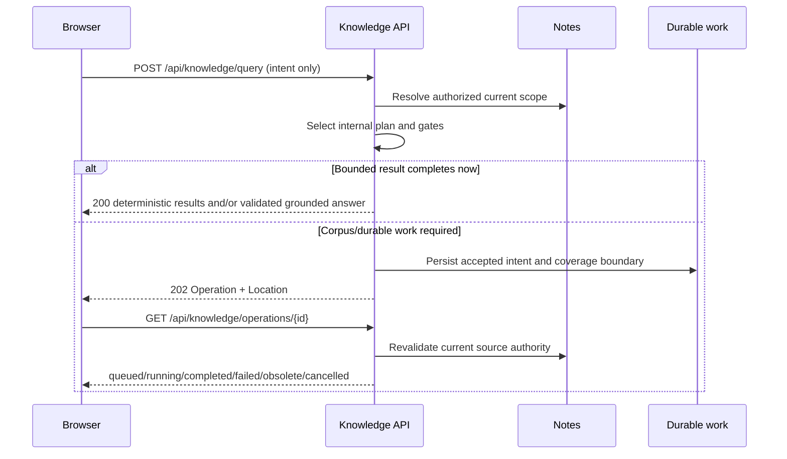
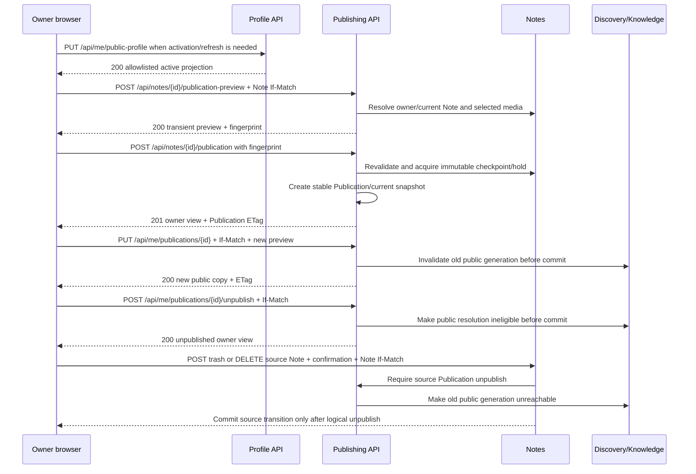

# Notes & Knowledge Workspace

# API Design

Status: Approved Baseline  
Date: 2026-09-13  
Baseline approval date: 2026-09-13  
Baseline amendment review date: 2026-09-13  
Baseline amendment approval date: 2026-09-13

## 1. Purpose, authority, and boundaries

This document defines the external HTTP/JSON contract for the approved Notes & Knowledge Workspace product. It consumes and does not supersede the nine Approved Baselines: Product Vision and Target Flagship Requirements, ADR-001, High-Level Architecture, Technology Stack and Compatibility, Security Architecture, Threat Model, Domain Model, Schema & Migration Design, and Search / AI / Retrieval Design. `PROJECT_CONTEXT_HANDOFF.md` remains durable project context.

This document owns resource paths, HTTP methods and statuses, browser-session and CSRF interaction, public and private representations, optimistic-concurrency preconditions, pagination, errors, synchronous/asynchronous response behavior, and API-visible authorization boundaries. It does not define controller or service classes, JPA entities, repository SQL, migrations, OpenAPI files, frontend code, deployment configuration, provider credentials, exact quotas, or implementation.

The API preserves exactly seven owning modules inside one Spring Boot modular monolith. A path is an external contract, not a new service boundary. Internal module interfaces, retrieval query classes, vector mechanics, provider/model routing, generation counters, database keys, object-storage keys, and Spring Session identifiers are not public API controls.

No Approved Baseline conflict or additional persistent concept is required by this design. Asynchronous Knowledge operations use the approved Knowledge work-intent and explicitly deferred retrieval-operation metadata. The current approved relational catalog contains 38 relations; its added Identity security-email relation comes from the separately approved Schema amendment, not this API design.

## 2. Contract principles

1. `/api` is the backend namespace. API evolution is coordinated between the first-party React client and Spring Boot backend; URL path versioning is not preselected.
2. Resources are JSON with `camelCase` properties, UUIDs encoded as canonical strings, and absolute timestamps encoded as RFC 3339 UTC strings.
3. The authenticated principal and authoritative owner `UserId` come only from the server-side session. Private requests never accept `ownerUserId`.
4. Browser authentication uses an opaque cookie backed by Spring Session JDBC/PostgreSQL. No browser access/refresh JWT is introduced.
5. Every unsafe cookie-authenticated operation requires the current CSRF proof. SameSite is defense in depth, not a CSRF substitute.
6. Private resource lookup is owner-scoped before load. A missing resource and another user's resource normally produce the same `404` response.
7. Note, Attachment, and Publication core aggregate representations use strong ETags as their approved mutation `If-Match` tokens. Volatile processing/source-status projections are separate no-store reads and do not participate in aggregate mutation concurrency. Absence is `428`; a stale validator is `412`; a current-state domain conflict is `409`.
8. Collection traversal uses opaque cursor pagination. Clients cannot submit SQL expressions, provider controls, model names, vector operators, internal query classes, or ANN choices.
9. Private, authentication, token-bearing, and initially all public API responses use conservative `Cache-Control: no-store`.
10. AI output, citations emitted by a model, resource IDs supplied by a client, and storage locators never confer authority.

## 3. Media types, representations, and status conventions

### 3.1 Request and response formats

- JSON requests use `Content-Type: application/json`; JSON responses use `application/json`.
- Errors use `application/problem+json` and RFC 9457 Problem Details.
- Attachment upload uses `multipart/form-data` in the initial backend-mediated flow.
- Private Attachment bytes and approved public-media bytes use the server-validated media type and support byte ranges where the stored representation permits them.
- Authored Note and Publication content is Markdown text, never trusted pre-rendered HTML.
- Empty successful commands use `204 No Content`. New resources normally use `201 Created` with `Location`. `202 Accepted` means: "Request accepted for processing. Tracked asynchronous operations expose a Location/status resource; security-sensitive enumeration-resistant acceptance may intentionally expose no polling resource."

Collection responses have this shape:

```json
{
  "items": [],
  "nextCursor": null
}
```

Exact totals are not returned by default. A cursor is opaque, scope-bound, query-bound, sort-bound, and tamper resistant; possessing one does not authorize the next page.

### 3.2 Status semantics

| Status | Contract meaning |
|---|---|
| `200` | Successful read, replacement, or synchronous query result. |
| `201` | Resource created; `Location` identifies the new resource. |
| `202` | Request accepted for processing. Tracked work exposes a safe `Location`/status resource; enumeration-resistant security delivery may deliberately expose none. |
| `204` | Successful command with no representation. |
| `206` | Successful byte-range response for a supported private or public media representation. |
| `304` | Optional validated safe read; current authorization and activity must be checked before responding. Not used by the initial `no-store` policy. |
| `400` | Malformed JSON, syntax, cursor, header, or request framing. |
| `401` | No valid fully authenticated session for a protected resource. Authentication continuation endpoints are explicit exceptions. |
| `403` | The authenticated principal is known but lacks a required capability or recent-auth/MFA condition when disclosing that fact is safe. |
| `404` | Resource absent or deliberately concealed by owner/public-scope policy. |
| `409` | Current-state/domain conflict, such as a required publication consequence, duplicate public relationship, or invalid lifecycle transition. |
| `412` | Supplied `If-Match` is valid in form but stale. |
| `413` | Request, upload, or bounded input exceeds configured limits. |
| `415` | Unsupported request or attachment media type. |
| `416` | Requested byte range is invalid or outside the current representation; the response reveals no storage layout or other/stale private or public object existence. |
| `422` | Syntactically valid input violates field or command semantics. |
| `428` | A required `If-Match` precondition is missing. |
| `429` | Rate limit reached; include `Retry-After` when meaningful. |
| `503` | A required authority, policy, provider, or dependency is temporarily unavailable and no safe fallback exists. |

### 3.3 Problem Details

Every error contains standard `type`, `title`, `status`, and `instance` fields plus a stable `code` and a safe `traceId`. Validation errors may include an allowlisted `errors` array of `{field, code, message}`. Error bodies never disclose another user's resource, SQL, stack traces, storage keys, provider internals, tokens, private text, or raw model output.

Authentication, registration, verification, reset, and private-resource responses deliberately avoid account/resource enumeration. `traceId` is diagnostic correlation only and is not authorization.

## 4. Browser session, CSRF, OIDC, MFA, and recent authentication

### 4.1 Session and CSRF browser contract

The browser sends an opaque authentication cookie managed by Spring Session JDBC. The production cookie remains `HttpOnly` and `Secure`; its exact name, path/domain, idle/absolute lifetimes, and deployment-specific SameSite setting remain downstream. JavaScript never reads the authentication cookie.

The SPA obtains CSRF material from `GET /api/auth/csrf`, which returns `{ "csrfToken": "..." }` with `Cache-Control: no-store`. Every unsafe method sends the current value in `X-CSRF-TOKEN`. The backend validates it through a Spring Security-supported `CsrfTokenRepository`. This contract does not select `HttpSessionCsrfTokenRepository` or `CookieCsrfTokenRepository`, nor does it freeze token persistence, cookie/header names other than the API proof header, masking, or bootstrap implementation. If a future selected CSRF-token cookie must be readable by JavaScript, only that token cookie may be readable; the authentication cookie remains HttpOnly.

The client refreshes CSRF state after authentication, MFA elevation, logout, session replacement, and any framework-required token rotation. Missing or invalid proof rejects the unsafe request; CSRF is never disabled for login, logout, recovery, MFA, OIDC-link, Note, AI, upload, publication, report, moderation, session-revocation, or deletion transitions.

SameSite alone is insufficient because browser behavior, top-level navigations, deployment topology, and future browser changes do not prove request intent. CSRF validates a separate server-expected proof.

### 4.2 Authentication state machine

`GET /api/auth/session` is intentionally readable in anonymous, pre-MFA, and fully authenticated browser states and returns only the current bounded state: `anonymous`, `mfaRequired`, or `authenticated`. A password or OIDC primary login returns `200` when no MFA is required, or `202` with a short-lived opaque MFA challenge when the second factor is required. The pre-MFA state has authority only for the matching MFA continuation and logout; all ordinary private APIs reject it.

Registration, verification/resend, and password-reset initiation use blind enumeration-resistant `202` responses where applicable. They expose no `Location`, polling resource, Account existence, verification/recovery eligibility, or delivery state; an eligible internal delivery remains reliably handled. By contrast, the pre-MFA `202` exposes only its bounded continuation challenge, not ordinary application authority.

The session identifier rotates after successful primary authentication and again after MFA establishes full authority. Logout and security transitions invalidate or rotate sessions according to the approved policy. Password reset revokes all existing sessions and does not silently sign the user in.

Google OIDC uses backend Authorization Code with PKCE S256, `state`, and `nonce`. The callback is the protocol-required safe-method endpoint; it does not create arbitrary product state and accepts only a matching single-use server transaction. Provider issuer plus subject identifies the external principal. A matching email never silently links an OIDC identity. Linking requires a fully authenticated session, recent authentication, MFA where enabled, a new validated OIDC transaction, and a remaining usable login path on unlink.

Recent authentication is a server-side session fact. Sensitive endpoints may return `403` with code `recent_authentication_required` and safe available continuation methods. Exact duration is downstream.

## 5. Authorization, identifiers, and capabilities

- Private owner authorization is always derived as `session -> immutable UserId -> owner-scoped module operation`. A UUID or cursor is only a locator.
- Private Note, NoteVersion, Attachment, citation, Knowledge operation, session-management handle, and suggestion references are resolved within the authenticated owner scope before any representation is returned.
- Public APIs expose stable Publication identity and Public Handle but never private Note IDs, NoteVersion IDs, owner UserIds, private Attachment IDs, internal source revisions, processing generations, provider lineage, or object-storage keys.
- Moderators receive only report, public Publication, bounded public evidence, decision, and consequence representations. No moderator endpoint reads private Notes, private attachments, private search, private vectors, or private AI context.
- A narrow privileged operational assignment mechanism remains downstream; no generic administrator/private-browse API is defined here.
- Capability checks are server-owned. `moderation.review` and `moderation.enforce` are narrow capabilities; moderators cannot self-assign them, and the Moderation API cannot grant or revoke them.
- The initial `/api` surface exposes no generic `ROLE_ADMIN` or privilege-assignment endpoint. Initial moderator provisioning, grant, and revocation are Identity-owned, separately protected operational/bootstrap mechanisms for Backend/Deployment design. They must be attributable, audited, least-privilege, and protected by operational authorization plus recent authentication/MFA where appropriate. No assignable capability may grant generic private-Note reading. A later HTTP privilege-management surface requires an explicit API-baseline amendment.

## 6. Concurrency and command semantics

### 6.1 ETags and preconditions

`GET`/create/update responses for the authoritative Note and Publication core representations, and the approved Attachment core metadata response, include a strong opaque `ETag`. Every operation that mutates an existing corresponding aggregate echoes that value in `If-Match`. The selected core representation contains only externally visible authoritative values controlled by that aggregate revision. Its validator is server-generated, resource-bound, revision-backed, and changes whenever that selected authoritative core representation changes; its encoding is server-owned and clients do not construct or increment it.

Knowledge-owned Note/Attachment AI-processing state and Publishing's live owner-only private-source comparison are separate no-store projection resources. They can change asynchronously without changing the corresponding aggregate revision or strong core-representation ETag. They have no mutation ETag/`If-Match` contract and cannot create unrelated Note, Attachment, or Publication write conflicts.

- No `If-Match` where required: `428 Precondition Required`, code `precondition_required`.
- Stale `If-Match`: `412 Precondition Failed`, code `stale_write`, with the current ETag only when the caller is still authorized.
- Current ETag but invalid lifecycle/domain rule: `409 Conflict`, with a specific safe code such as `publication_consequence_required` or `invalid_lifecycle_transition`.

`updatedAt` is not a concurrency token: timestamps can collide, have precision differences, and change for unrelated reasons. Core-representation ETags carry the server's exact revision-backed concurrency contract.

Attachment deletion uses the Attachment core ETag because every API-visible authoritative Attachment core-state change advances its revision before becoming observable. NoteVersion is immutable and therefore has no update contract. Security commands use server-side one-time, session, and recent-auth state rather than exposing row versions.

### 6.2 Method choices and idempotency

- `PUT` replaces a known mutable representation or establishes a naturally idempotent state such as pin, tags, AI access, password, profile, or Like.
- `DELETE` removes or disables a known relationship/resource and is idempotent where the domain permits.
- `POST` expresses creation, an explicit lifecycle command, a query with a sensitive/structured body, or work whose result may be synchronous or asynchronous.
- Generic `PATCH` is rejected because it encourages mass assignment and obscures command invariants.

No generic persistent `Idempotency-Key` subsystem is selected. Safety comes from naturally idempotent PUT/DELETE, ETags, domain uniqueness, one-time capability consumption, and approved durable-work deduplication. A tracked asynchronous `202` is returned only after reliable acceptance and exposes a safe polling/status resource. A blind security-sensitive `202` may intentionally expose no operation, Account-existence, eligibility, or delivery-state signal while eligible internal work remains reliably handled.

Backward compatibility is considered deliberately for deployed first-party clients, but no version query parameter, Accept-header media-type versioning, moving "latest" path alias, or response-wide version field is selected. If a future externally consumed developer API needs simultaneous incompatible versions, its versioning strategy requires an explicit design at that time.

## 7. Pagination, filters, sorting, and validation

Owner collections and public/moderation collections use `limit` plus opaque `cursor`. The server exposes only product filters and sort values:

- Notes: `state=active|archived|trashed`, `pinned`, tag values, and `sort=updatedDesc|createdDesc|titleAsc`.
- Note versions: `sort=createdDesc`.
- Owner publications: `state=active|unpublished|removed`, `sort=updatedDesc|publishedDesc`.
- Public Explore: `sort=latest|trending`.
- Public search: optional bounded, validated `q` and/or public-scope `tag`; a tag-only request is allowed. The tag matches only copied approved tags on current active Publication projections, never private Note tags, and creates no global taxonomy or hierarchy.
- Moderation reports: bounded report state/category and `sort=submittedAsc|submittedDesc`.

The server allowlists every field and maps it to owner-module logic. Arbitrary field paths, SQL expressions, provider/model/lineage values, vector operators, internal rankings, and storage fields are rejected.

Request DTOs allowlist mutable fields and reject or ignore nothing silently. They never accept `ownerUserId`, authoritative revision/generation, Account/Publication state, capability assignment, derived eligibility, storage key, or internal job state. Numeric limits for text, files, media duration/pages, result size, and rate controls remain configured downstream where the baselines deliberately deferred them; the API still returns `413`, `422`, or `429` consistently.

## 8. Comprehensive endpoint catalog

Catalog abbreviations: **Anon** = anonymous or any browser state explicitly stated; **Auth** = fully authenticated session; **MFA-C** = limited pre-MFA continuation; **Mod** = moderator capability. `CSRF: yes` applies to browser unsafe methods. `ETag N`, `ETag P`, and `ETag A` mean current Note, Publication, and Attachment `If-Match` respectively. Every private `404` is enumeration-safe. Cache is `no-store` throughout the initial contract.

### 8.1 Identity: authentication, account, MFA, OIDC, sessions, and security

| # | Method and path | Purpose | Auth / capability | CSRF / recent auth | Concurrency | Success | Notable failures | Cache | Owner |
|---:|---|---|---|---|---|---|---|---|---|
| 1 | `GET /api/auth/csrf` | Bootstrap/refresh SPA CSRF proof | Anon, MFA-C, Auth | no / no | none | `200` | `503` | no-store | Identity |
| 2 | `GET /api/auth/session` | Read bounded browser auth state | Anon, MFA-C, Auth | no / no | none | `200` | `503` | no-store | Identity |
| 3 | `POST /api/auth/registrations` | Begin email/password registration | Anon | yes / no | uniqueness | `202` | `400,422,429,503` | no-store | Identity |
| 4 | `POST /api/auth/email-verification/requests` | Request/resend generic verification delivery | Anon | yes / no | one-time/supersession | `202` | `400,422,429,503` | no-store | Identity |
| 5 | `POST /api/auth/email-verification/confirmations` | Consume verification token | Anon | yes / no | single-use | `204` | `400,409,422,429` | no-store | Identity |
| 6 | `POST /api/auth/login/password` | Password primary authentication | Anon | yes / no | session rotation | `200/202` | `400,401,429,503` | no-store | Identity |
| 7 | `POST /api/auth/mfa/challenges/{challengeId}/totp` | Complete pre-MFA login with TOTP | MFA-C | yes / no | replay-safe single use | `200` | `400,401,404,409,429,503` | no-store | Identity |
| 8 | `POST /api/auth/mfa/challenges/{challengeId}/recovery-code` | Complete pre-MFA login with one recovery code | MFA-C | yes / no | atomic single use | `200` | `400,401,404,409,429,503` | no-store | Identity |
| 9 | `POST /api/auth/logout` | Invalidate current browser session | Anon, MFA-C, Auth | yes / no | session state | `204` | `400,403,503` | no-store | Identity |
| 10 | `POST /api/auth/oidc/google/authorizations` | Start OIDC login transaction | Anon | yes / no | single-use transaction | `200` | `400,409,429,503` | no-store | Identity |
| 11 | `GET /api/auth/oidc/google/callback` | Validate code/state/nonce/PKCE and continue login | matching OIDC transaction | protocol state / no | single-use transaction, session rotation | `200/202` or safe redirect | `400,401,409,429,503` | no-store | Identity |
| 12 | `POST /api/auth/password-reset/requests` | Send generic reset delivery | Anon | yes / no | one-time/supersession | `202` | `400,422,429,503` | no-store | Identity |
| 13 | `POST /api/auth/password-reset/confirmations` | Consume reset token, set password, revoke sessions | Anon | yes / no | atomic single use | `204` | `400,409,422,429,503` | no-store | Identity |
| 14 | `POST /api/auth/reauth/password` | Establish recent-auth fact using password | Auth | yes / no | session security state | `204` | `400,401,409,429` | no-store | Identity |
| 15 | `POST /api/auth/reauth/oidc/google/authorizations` | Start OIDC recent-auth transaction | Auth | yes / no | single-use transaction | `200` | `400,409,429,503` | no-store | Identity |
| 16 | `GET /api/auth/reauth/oidc/google/callback` | Complete OIDC recent authentication | matching Auth transaction | protocol state / no | single-use transaction | `204` or safe redirect | `400,401,409,429,503` | no-store | Identity |
| 17 | `GET /api/me/security` | Read safe credential/MFA/link/security summary | Auth | no / no | none | `200` | `401,503` | no-store | Identity |
| 18 | `PUT /api/me/security/password` | Set/change application password | Auth | yes / yes; MFA if enabled | session consequence | `204` | `400,401,403,409,422,429` | no-store | Identity |
| 19 | `POST /api/me/security/email-change/requests` | Begin verified email change | Auth | yes / yes; MFA if enabled | one-time/supersession | `202` | `400,401,403,409,422,429,503` | no-store | Identity |
| 20 | `POST /api/me/security/email-change/confirmations` | Confirm new address and apply security consequences | Auth | yes / yes; MFA if enabled | atomic single use | `204` | `400,401,403,409,422,429` | no-store | Identity |
| 21 | `POST /api/me/security/mfa/totp/enrollments` | Begin TOTP enrollment and return protected setup data | Auth | yes / yes; current MFA if any | one pending enrollment | `201` | `400,401,403,409,429,503` | no-store | Identity |
| 22 | `POST /api/me/security/mfa/totp/enrollments/{enrollmentId}/confirmation` | Prove TOTP, activate MFA, return recovery codes once | Auth | yes / yes | atomic enrollment/recovery issue | `200` | `400,401,403,404,409,422,429` | no-store | Identity |
| 23 | `DELETE /api/me/security/mfa/totp` | Disable TOTP under protected recovery policy | Auth | yes / yes; MFA/proof as policy requires | session consequence | `204` | `400,401,403,409,429` | no-store | Identity |
| 24 | `POST /api/me/security/mfa/recovery-codes` | Regenerate and display a new recovery-code set once | Auth | yes / yes; MFA if enabled | atomic generation | `200` | `400,401,403,409,429` | no-store | Identity |
| 25 | `POST /api/me/security/oidc/google/link-authorizations` | Begin deliberate Google identity linking | Auth | yes / yes; MFA if enabled | single-use transaction | `200` | `400,401,403,409,429,503` | no-store | Identity |
| 26 | `GET /api/auth/oidc/google/link-callback` | Complete validated link transaction | matching Auth transaction | protocol state / yes established before start | uniqueness/single use | `204` or safe redirect | `400,401,403,409,429,503` | no-store | Identity |
| 27 | `DELETE /api/me/security/oidc-links/{linkId}` | Unlink while retaining a usable primary method | Auth | yes / yes; MFA if enabled | current link/uniqueness | `204` | `400,401,403,404,409,429` | no-store | Identity |
| 28 | `GET /api/me/security/sessions` | List safe session descriptors and current marker | Auth | no / no | none | `200` | `401,503` | no-store | Identity |
| 29 | `DELETE /api/me/security/sessions/{sessionHandle}` | Revoke one session by opaque safe handle | Auth | yes / yes for noncurrent/high-risk policy | current session state | `204` | `400,401,403,404,409,429,503` | no-store | Identity |
| 30 | `POST /api/me/security/sessions/revoke-others` | Revoke every session except current | Auth | yes / yes; MFA if enabled | session set | `204` | `401,403,409,429,503` | no-store | Identity |
| 31 | `POST /api/me/security/sessions/revoke-all` | Revoke all sessions, including current | Auth | yes / yes; MFA if enabled | session set | `204` | `401,403,409,429,503` | no-store | Identity |
| 32 | `DELETE /api/me/account` | Confirm logical account deletion and durable cleanup | Auth | yes / yes; MFA if enabled | account/public/AI state | `204` | `400,401,403,409,422,429,503` | no-store | Identity |

### 8.2 Profile and Public Profile

| # | Method and path | Purpose | Auth / capability | CSRF / recent auth | Concurrency | Success | Notable failures | Cache | Owner |
|---:|---|---|---|---|---|---|---|---|---|
| 33 | `GET /api/me/profile` | Read private presentation profile | Auth | no / no | current profile state | `200` | `401,503` | no-store | Profile |
| 34 | `PUT /api/me/profile` | Replace mutable profile presentation fields/handle | Auth | yes / recent auth if handle/security policy requires | uniqueness/current-state transaction | `200` | `400,401,403,409,422` | no-store | Profile |
| 35 | `PUT /api/me/profile/avatar` | Upload/replace validated avatar through backend | Auth | yes / no | current-state transaction | `200` | `400,401,409,413,415,422,503` | no-store | Profile |
| 36 | `DELETE /api/me/profile/avatar` | Remove current avatar | Auth | yes / no | current-state transaction | `204` | `401,409,503` | no-store | Profile |
| 37 | `PUT /api/me/public-profile` | Explicitly activate or refresh the allowlisted Public Profile Projection | Auth owner | yes / explicit user action | eligible Account, unique handle, current validated avatar | `200` | `400,401,409,422,503` | no-store | Profile |
| 38 | `GET /api/public/profiles/{handle}` | Read allowlisted active public profile projection | Anon | no / no | active projection | `200` | `400,404,429,503` | no-store | Profile |
| 39 | `GET /api/public/profiles/{handle}/publications` | Cursor-page this profile's active public Publications | Anon | no / no | active profile/publication scope; cursor | `200` | `400,404,422,429,503` | no-store | Profile/Publishing/Discovery |

### 8.3 Notes, lifecycle, tags, versions, AI state, and attachments

| # | Method and path | Purpose | Auth / capability | CSRF / recent auth | Concurrency | Success | Notable failures | Cache | Owner |
|---:|---|---|---|---|---|---|---|---|---|
| 40 | `GET /api/me/note-preferences` | Read future-Note AI initializer | Auth owner | no / no | none | `200` | `401,503` | no-store | Notes |
| 41 | `PUT /api/me/note-preferences` | Set future-Note default only | Auth owner | yes / no | preference replacement | `200` | `400,401,422,503` | no-store | Notes |
| 42 | `POST /api/notes` | Create private Note; optional `aiEnabled` overrides the current future-Note preference | Auth owner | yes / no | creation uniqueness | `201` | `400,401,409,413,422,503` | no-store | Notes |
| 43 | `GET /api/notes` | Page owner Notes by lifecycle/filter/sort | Auth owner | no / no | cursor scope | `200` | `400,401,422,503` | no-store | Notes |
| 44 | `POST /api/notes/search` | Ordinary owner-scoped lexical/fuzzy search | Auth owner | yes / no | captured current results | `200` | `400,401,413,422,429,503` | no-store | Notes |
| 45 | `GET /api/notes/{noteId}` | Read current private Note and ETag | Auth owner | no / no | returns ETag N | `200` | `400,401,404,503` | no-store | Notes |
| 46 | `PUT /api/notes/{noteId}` | Explicitly Save title/Markdown current state | Auth owner | yes / no | ETag N required | `200` | `400,401,404,409,412,413,422,428,503` | no-store | Notes |
| 47 | `PUT /api/notes/{noteId}/pin` | Make pin state ON idempotently | Auth owner | yes / no | ETag N required | `200` | `400,401,404,409,412,428` | no-store | Notes |
| 48 | `DELETE /api/notes/{noteId}/pin` | Make pin state OFF idempotently | Auth owner | yes / no | ETag N required | `200` | `400,401,404,409,412,428` | no-store | Notes |
| 49 | `POST /api/notes/{noteId}/archive` | Explicit Active to Archived command | Auth owner | yes / no | ETag N required | `200` | `400,401,404,409,412,428` | no-store | Notes |
| 50 | `POST /api/notes/{noteId}/return-from-archive` | Explicit Archived to Active command | Auth owner | yes / no | ETag N required | `200` | `400,401,404,409,412,428` | no-store | Notes |
| 51 | `POST /api/notes/{noteId}/trash` | Trash; an active source Publication requires explicit confirmation and synchronous unpublish | Auth owner | yes / explicit unpublish confirmation when published | ETag N required | `200` | `400,401,404,409,412,422,428,503` | no-store | Notes |
| 52 | `POST /api/notes/{noteId}/restore` | Restore recoverable Trashed Note using server policy | Auth owner | yes / no | ETag N required | `200` | `400,401,404,409,412,428` | no-store | Notes |
| 53 | `DELETE /api/notes/{noteId}` | Permanently logically delete; an active source Publication requires confirmation and synchronous unpublish | Auth owner | yes / explicit confirmation; recent auth by risk policy | ETag N required | `204` | `400,401,403,404,409,412,422,428,503` | no-store | Notes |
| 54 | `PUT /api/notes/{noteId}/tags` | Replace normalized Note-scoped tag set; may confirm a current suggestion | Auth owner | yes / no | ETag N required; suggestion source revision checked | `200` | `400,401,404,409,412,422,428` | no-store | Notes |
| 55 | `PUT /api/notes/{noteId}/ai-access` | Set this Note independently AI ON/OFF | Auth owner | yes / no | ETag N required; AI generation server-owned | `200` | `400,401,404,409,412,422,428,503` | no-store | Notes |
| 56 | `POST /api/notes/ai-access-bulk` | Deliberately enable/disable applicable existing owned Notes | Auth owner | yes / explicit scope confirmation | atomic/current per-Note state | `200` | `400,401,409,413,422,429,503` | no-store | Notes |
| 57 | `GET /api/notes/{noteId}/versions` | Page retained immutable checkpoints | Auth owner | no / no | cursor scope | `200` | `400,401,404,503` | no-store | Notes |
| 58 | `GET /api/notes/{noteId}/versions/{versionId}` | Read one immutable checkpoint | Auth owner | no / no | immutable | `200` | `400,401,404,503` | no-store | Notes |
| 59 | `POST /api/notes/{noteId}/versions/{versionId}/restore` | Restore checkpoint into new current Note revision | Auth owner | yes / explicit confirmation | ETag N required | `200` | `400,401,404,409,412,422,428,503` | no-store | Notes |
| 60 | `POST /api/notes/{noteId}/attachments` | Backend-mediated upload for image/audio/video/PDF | Auth owner | yes / no | Note ownership/current lifecycle checked | `201/202` | `400,401,404,409,413,415,422,429,503` | no-store | Notes |
| 61 | `GET /api/notes/{noteId}/attachments` | List owner-authorized Attachment metadata | Auth owner | no / no | cursor scope | `200` | `400,401,404,503` | no-store | Notes |
| 62 | `GET /api/notes/{noteId}/attachments/{attachmentId}` | Read authoritative Attachment metadata and validation/lifecycle state | Auth owner | no / no | returns strong core ETag A | `200` | `400,401,404,503` | no-store | Notes |
| 63 | `GET /api/notes/{noteId}/attachments/{attachmentId}/content` | Stream authorized stored bytes; support Range when available | Auth owner | no / no | current Attachment state rechecked | `200/206` | `400,401,404,416,503` | no-store | Notes |
| 64 | `DELETE /api/notes/{noteId}/attachments/{attachmentId}` | Logically remove the private Attachment and invalidate private eligibility; existing public snapshot media is unchanged | Auth owner | yes / no | ETag A required | `204` | `400,401,404,409,412,422,428,503` | no-store | Notes |
| 65 | `GET /api/notes/{noteId}/ai-processing` | Read volatile product-level AI-processing projection for the Note and its Attachments | Auth owner | no / no | owner/current processing state; no mutation ETag | `200` | `400,401,404,429,503` | no-store | Knowledge composed with Notes |

### 8.4 Knowledge: processing policy, query, related Notes, and proposals

| # | Method and path | Purpose | Auth / capability | CSRF / recent auth | Concurrency | Success | Notable failures | Cache | Owner |
|---:|---|---|---|---|---|---|---|---|---|
| 66 | `GET /api/ai/processing-policy` | Read current provider/processing disclosure identity and acknowledgement need | Auth | no / no | current policy version | `200` | `401,503` | no-store | Knowledge |
| 67 | `POST /api/ai/processing-policy/acknowledgements` | Idempotently acknowledge the exact displayed current policy | Auth | yes / explicit user action | unique user/policy evidence | `204` | `400,401,409,422,503` | no-store | Knowledge |
| 68 | `POST /api/knowledge/query` | Ask/search/extract using server-routed authorized plan | Auth owner | yes / no | declared operation boundary when applicable | `200/202` | `400,401,409,413,422,429,503` | no-store | Knowledge |
| 69 | `GET /api/knowledge/operations/{operationId}` | Poll an owner-scoped asynchronous Knowledge result | Auth owner | no / no | current work/source state revalidated | `200` | `400,401,404,409,503` | no-store | Knowledge |
| 70 | `DELETE /api/knowledge/operations/{operationId}` | Request cancellation when the accepted work supports it | Auth owner | yes / no | current work state | `202/204` | `400,401,404,409,503` | no-store | Knowledge |
| 71 | `POST /api/notes/{noteId}/related` | Return current owner-scoped semantic related Notes | Auth owner | yes / no | ETag N required; source/candidate revision and lineage rechecked | `200` | `400,401,404,409,412,422,428,429,503` | no-store | Knowledge |
| 72 | `POST /api/notes/{noteId}/organization-suggestions` | Request untrusted organization proposals | Auth owner | yes / no | ETag N required; source revision/generation captured | `200/202` | `400,401,404,409,412,422,428,429,503` | no-store | Knowledge |

Suggestion responses are proposals tied to the current Note revision. They never mutate Notes. The user applies a desired tag set through endpoint 54 with the current Note ETag; an optional `acceptedSuggestionId` is owner-resolved and stale-checked for attribution, but the authoritative command remains the explicit Notes update.

### 8.5 Publishing and public Discovery/Moderation entry points

| # | Method and path | Purpose | Auth / capability | CSRF / recent auth | Concurrency | Success | Notable failures | Cache | Owner |
|---:|---|---|---|---|---|---|---|---|---|
| 73 | `POST /api/notes/{noteId}/publication-preview` | Build a transient, non-public preview from current authorized content/media selection | Auth owner | yes / yes when policy requires | ETag N required; returns fingerprint | `200` | `400,401,403,404,409,412,413,422,428,503` | no-store | Publishing |
| 74 | `POST /api/notes/{noteId}/publication` | Create stable Publication from exact previewed checkpoint; requires active usable Public Profile Projection | Auth owner | yes / yes when policy requires | ETag N + preview fingerprint | `201` | `400,401,403,404,409,412,422,428,503` | no-store | Publishing |
| 75 | `GET /api/me/publications` | Page owner Publication summaries | Auth owner | no / no | cursor scope | `200` | `400,401,503` | no-store | Publishing |
| 76 | `GET /api/me/publications/{publicationId}` | Read authoritative owner Publication aggregate/current-snapshot state and ETag | Auth owner | no / no | returns strong core ETag P | `200` | `400,401,404,503` | no-store | Publishing |
| 77 | `GET /api/me/publications/{publicationId}/source-status` | Read volatile owner-only private-source existence, drift, and update-readiness projection | Auth owner | no / no | owner/current source composition; no mutation ETag | `200` | `400,401,404,503` | no-store | Publishing composed with Notes |
| 78 | `PUT /api/me/publications/{publicationId}` | Explicitly update public copy from exact previewed checkpoint/media | Auth owner | yes / yes when policy requires | ETag P + preview fingerprint required | `200` | `400,401,403,404,409,412,422,428,503` | no-store | Publishing |
| 79 | `POST /api/me/publications/{publicationId}/unpublish` | Make public identity immediately unavailable | Auth owner | yes / yes when policy requires | ETag P required | `200` | `400,401,403,404,409,412,428,503` | no-store | Publishing |
| 80 | `POST /api/me/publications/{publicationId}/republish` | Explicitly reactivate with an approved current preview/checkpoint | Auth owner | yes / yes when policy requires | ETag P + preview fingerprint required | `200` | `400,401,403,404,409,412,422,428,503` | no-store | Publishing |
| 81 | `GET /api/public/publications/{publicationId}` | Read one active allowlisted public snapshot; record view internally best-effort | Anon | no / no | active generation checked | `200` | `400,404,429,503` | no-store | Publishing/Discovery |
| 82 | `GET /api/public/publications/{publicationId}/media/{publicMediaId}/content` | Stream one approved public-media representation from the current active snapshot | Anon | no / no | active Publication/current generation/media eligibility rechecked | `200/206` | `400,404,416,429,503` | no-store | Publishing |
| 83 | `GET /api/public/explore` | Browse active public snapshots by `latest` or `trending` | Anon | no / no | cursor bound to sort | `200` | `400,422,429,503` | no-store | Discovery |
| 84 | `GET /api/public/search` | Search or tag-browse active public-only projections using bounded `q` and/or `tag` | Anon | no / no | cursor bound to query/filter | `200` | `400,413,422,429,503` | no-store | Discovery/Knowledge |
| 85 | `PUT /api/public/publications/{publicationId}/like` | Idempotently establish current user's Like, including already-liked/concurrent duplicate intent | Auth | yes / no | one relation by domain uniqueness | `204` | `400,401,404,429,503` | no-store | Discovery |
| 86 | `DELETE /api/public/publications/{publicationId}/like` | Idempotently remove current user's Like, including already-unliked intent | Auth | yes / no | domain uniqueness | `204` | `400,401,404,429,503` | no-store | Discovery |
| 87 | `POST /api/public/publications/{publicationId}/reports` | Submit bounded Report about the public representation seen | Anon or Auth per policy | yes for browser / no | duplicate/abuse policy | `201` | `400,404,409,413,422,429,503` | no-store | Moderation |

Public search query text may appear in its public GET URL because it contains no private corpus query. It still receives length, abuse, and logging controls. There is no client-visible view-increment endpoint; eligible public reads trigger a privacy-conscious internal best-effort signal whose failure cannot block the read.

### 8.6 Moderation

| # | Method and path | Purpose | Auth / capability | CSRF / recent auth | Concurrency | Success | Notable failures | Cache | Owner |
|---:|---|---|---|---|---|---|---|---|---|
| 88 | `GET /api/moderation/reports` | Page bounded public-report queue | Mod `moderation.review` | no / recent auth/MFA by policy | cursor scope | `200` | `400,401,403,422,429,503` | no-store | Moderation |
| 89 | `GET /api/moderation/reports/{reportId}` | Read Report, public snapshot evidence, and safe audit context | Mod `moderation.review` | no / recent auth/MFA by policy | current public/report state | `200` | `400,401,403,404,429,503` | no-store | Moderation |
| 90 | `POST /api/moderation/reports/{reportId}/begin-review` | Idempotently move an Open Report to UnderReview and record attributable review evidence | Mod `moderation.review` | yes / yes; MFA as protected moderation policy requires | Open -> UnderReview; already UnderReview is effective success | `200` | `400,401,403,404,409,422,429,503` | no-store | Moderation |
| 91 | `POST /api/moderation/reports/{reportId}/decisions` | Commit immutable terminal decision only with every required logical public/account consequence | Mod `moderation.enforce` | yes / yes; MFA as policy requires | UnderReview + one terminal decision + owner-module consistency boundary | `201` | `400,401,403,404,409,413,422,429,503` | no-store | Moderation |

Endpoint 90 preserves the approved `Open -> UnderReview` transition. Repeating it while already UnderReview returns the same effective current Report/review representation; a terminal Report cannot be reopened and returns `409`. Beginning review records safe attributable evidence and grants no private-resource access.

Endpoint 91 remains one coherent terminal decision command. Its allowlisted consequence is one of `none`, `removePublication`, or `removePublicationAndSuspendResponsibleAccount`. A successful `201` means the immutable terminal decision and every mandatory logical consequence have been established through owner-module interfaces inside the required local consistency boundary. Publishing makes the reported Publication immediately ineligible; when selected, Identity makes the responsible Account immediately ineligible so existing sessions cannot authorize new protected operations after the committed suspension boundary. If a required removal or suspension cannot be established, terminal success is not committed or reported: the operation rolls back or remains safely nonterminal/retryable and returns truthful `409` or `503`. Suspension grants no private Note access and does not remove the Account's other Publications unless a future approved policy explicitly requires it.

`none` records the reasoned terminal `Dismissed` outcome. Either removal consequence records `Actioned` only when its required owner-module effects succeed.

**Catalog total: 91 endpoints.**

## 9. Core resource contracts

### 9.1 Note and Note preferences

`Note` contains the authoritative Note-owned core fields `id`, `title`, `markdown`, `lifecycle`, `pinned`, `tags`, `aiEnabled`, `createdAt`, and `updatedAt`. It does not contain Knowledge-owned AI-processing state. The strong HTTP `ETag`, not `updatedAt`, is the mutation precondition and changes whenever the selected authoritative Note core representation changes. Background embedding, indexing, transcription, captioning, cleanup, retry, or provider failure does not change that ETag unless it also changes authoritative Note state/revision. Note mutation responses return this core representation plus its new strong ETag.

`aiEnabled` remains exactly one independent boolean owned by the Note. A missing acknowledgement may make the separate AI-processing projection report `status = "blocked"` while `aiEnabled` remains `true`; this is not a third AI state. AI OFF remains fully usable for Save, lifecycle, tags, versions, attachments, and ordinary deterministic search.

`NotePreferences` has only `defaultAiEnabledForNewNotes`. A new account resolves it to `false`. In `POST /api/notes`, `aiEnabled` is optional. If omitted, Notes reads the current user-scoped preference and initializes the new Note from it; when present, the boolean overrides that creation choice. After creation, the Note owns the resulting independent state. Changing the preference never changes existing Notes; bulk AI access is a separate command and never changes the preference.

Lifecycle command bodies are narrow. Permanent deletion always requires `confirmPermanentDelete: true`. If a Note with an active Publication is trashed or permanently deleted, omission of `confirmPublicationUnpublish: true` returns `409 publication_consequence_required`; the safe owner-only Problem explains that continuing will unpublish the current public copy. The server neither unpublishes silently nor offers a keep-active alternative.

After confirmation, Notes and Publishing coordinate through supported module interfaces in the required local consistency boundary: Publishing becomes publicly ineligible, Discovery and Knowledge make the old public generation unreachable, and only then does the Note trash or permanent logical-deletion transition commit. The trash command returns its updated Note representation; permanent deletion returns `204` after logical Note, AI/private/public denial and required durable cleanup intent are established. Physical private/public cleanup may continue asynchronously without a deletion polling resource. Account deletion likewise makes every active Publication unavailable under its approved logical-denial-first rule.

### 9.2 NoteVersion and Attachment

`NoteVersion` exposes an immutable owner-scoped checkpoint ID, captured title/Markdown, source revision label, checkpoint reason, and creation time. Restore is a Note mutation against the current Note ETag; the checkpoint itself is never edited.

`Attachment` exposes the authoritative Notes-owned core metadata: private API ID, parent Note ID, one of exactly `image`, `audio`, `video`, or `pdf`, sanitized display filename, server-validated media type, size, bounded duration/page/dimension metadata where applicable, storage state, validation state, cleanup/lifecycle state, and timestamps. It does not contain Knowledge-owned AI-processing state and exposes no object key, bucket, provider URL, AI permission, or public-derivative locator. Every API-visible authoritative Attachment core-state change advances the Attachment revision before the changed core representation is observable, so the same strong Attachment ETag identifies the same selected authoritative core representation. AI eligibility remains inherited from the current parent Note plus all current processing gates, and stored media remains owner-accessible when AI processing fails.

The initial upload is backend-mediated multipart. The implementation may stream rather than buffer bytes. Successful storage and validation can produce `201`; work requiring durable validation may produce `202` with `Location` pointing to the already-created Attachment whose metadata exposes validation status. Byte responses use validated `Content-Type`, safe encoded `Content-Disposition`, `X-Content-Type-Options: nosniff`, `Content-Length` when known, and `Accept-Ranges: bytes` when supported. Range requests can return `206`; unsupported or invalid ranges return `416` without revealing storage layout.

Deleting an Attachment authorizes it through the owning Note, applies its ETag/current-state rule, logically removes only the private Attachment, synchronously invalidates private Attachment/Knowledge eligibility, and records required private object/derived cleanup. It does not unpublish, require a public-copy consequence, remove public media, or mutate an existing Publication snapshot. A separately copied/selected public media representation may remain in the immutable current snapshot; removing it publicly requires Update Public Copy or Unpublish. Future publish/update still requires explicit media selection and validation.

### 9.3 Volatile Note and Attachment AI-processing projection

`GET /api/notes/{noteId}/ai-processing` is externally owned by Knowledge and returns the owner's current product-level processing projection for the Note and its Attachments, composed through the supported Knowledge/Notes interfaces. The request requires a fully authenticated eligible owner, and owner authorization is established before any processing data is composed. It is a safe GET, requires no CSRF proof, returns `Cache-Control: no-store`, and has no aggregate mutation ETag or `If-Match` contract.

The response may expose Note-level and Attachment-level `status`, a bounded safe `reason`, and an optional already-approved opaque Knowledge operation link. Allowed product-level statuses remain `blocked`, `queued`, `processing`, `ready`, `failed`, `obsolete`, `reprocessing`, and `excluded`. AI OFF is represented truthfully through the existing excluded/blocked semantics. The response exposes no raw work-row ID, generation, vector, object key, provider payload, provider credential, or internal provider state. A changing projection never advances the Note or Attachment revision and never creates an aggregate write conflict.

### 9.4 Processing policy and AI access

`ProcessingPolicy` exposes a stable policy ID/version, disclosure content/summary, provider-processing categories relevant to the deployment, effective time, and whether this user has acknowledged that exact policy. It does not expose provider credentials or internal routing.

`POST /api/ai/processing-policy/acknowledgements` identifies the exact displayed policy ID/version. It returns `204` whether that currently applicable policy is newly acknowledged or was already acknowledged by the user; retries do not create duplicate acknowledgement facts. If the submitted policy is no longer currently acknowledgeable because the policy changed after display, it returns `409 processing_policy_changed`, and the client reloads `GET /api/ai/processing-policy`. Acknowledgement remains Knowledge-owned and neither mutates Note AI state nor enables any Note.

Acknowledgement is explicit and precedes the first actual processing under the applicable policy. Enabling a Note may persist AI ON before acknowledgement; no embedding, transcription, caption, semantic retrieval, reranking, generation, or source-bearing provider dispatch occurs until every gate passes. Disabling AI takes logical effect synchronously, makes existing representations ineligible, and may return `200` while the separate volatile processing projection reports `status = "excluded"` or `"obsolete"` and physical cleanup continues.

Bulk enable/disable accepts an explicit allowlisted scope or selected Note IDs plus `aiEnabled` and confirmation. It is not a default change. The command returns `200` only after the selected Notes' authoritative logical states have been applied consistently and reports the affected count; any resulting derivation or cleanup uses existing Knowledge work intents. Current per-Note ownership/state is revalidated before each mutation and processing effect.

### 9.5 Private ordinary search

`POST /api/notes/search` accepts a private query body so sensitive text is not placed in URLs, intermediary logs, browser history, or referrers by default. The request may include query text, allowlisted Note lifecycle/tag filters, sort, cursor, and limit. It cannot request semantic retrieval, a provider, vector operator, ANN, internal query class, or another owner.

This endpoint uses Notes-owned current owner-scoped full-text and `pg_trgm` behavior and works when AI is unavailable and for AI-OFF Notes. Results contain safe Note summary, snippets, match labels, and ETag where useful; ranks are not calibrated confidence.

### 9.6 Knowledge query and operations

`POST /api/knowledge/query` accepts only user intent, allowlisted product scope, and bounded presentation preferences. The server internally chooses ranked relevance, focused fact retrieval, corpus-wide semantic aggregation, or corpus-wide deterministic extraction. The browser cannot name the class, provider, model, embedding lineage, vector dimension/operator, reranker, ANN strategy, context size, or work implementation.

A fast bounded query returns `200`. A complete-corpus or otherwise durable operation returns `202` only after reliable acceptance and includes an opaque `operationId`, `status`, `submittedAt`, and `Location`. Polling reports `accepted`, `queued`, `running`, `completed`, `failed`, `obsolete`, or `cancelled` where supported. Obsolete work never masquerades as completed. Cancellation is best effort after authoritative state changes and cannot undo a provider disclosure already made.

The result separates:

- `deterministicResults`: authorized non-AI results that may include AI-OFF Notes;
- `aiAnswer`: grounded synthesis from currently AI-eligible evidence only, or `null`;
- `citations`: backend-validated, owner-authorized provenance used by `aiAnswer` only;
- `coverage`: truthful boundary, inspected-source progress, completion, truncation, corpus-changed, and retry/restart state;
- `degraded`: safe reason and available deterministic behavior; and
- `insufficientEvidence`: a first-class outcome, not a fabricated answer.

Deterministic AI-OFF results never enter model context, reranking, `aiAnswer`, or its citations. A citation is resolved from backend provenance and reauthorized; a model-emitted ID or URL is discarded unless it exactly maps to supplied evidence. Saved URLs remain inert text and are never fetched.

No token-by-token answer streaming is selected initially. A complete structured response is validated before exposure, simplifying citation integrity, unsafe-output handling, cancellation truth, and failure semantics. This does not preclude ordinary HTTP streaming of attachment bytes.

### 9.7 Related Notes and organization suggestions

Related Notes is AI-dependent and returns only current owner-scoped, AI-enabled, policy-eligible Notes in a compatible current lineage. It excludes the source Note and does not claim exhaustive completeness.

Organization suggestions may be synchronous or an asynchronous Knowledge result. An asynchronous `202` includes `Location` for the owner-scoped Knowledge operation. Every proposal is untrusted, tied to a source revision/generation, and includes a safe explanation. Applying tags requires the normal Notes tag command, explicit user selection, and current Note ETag. There is no autonomous apply, generic agent/tool endpoint, hidden taxonomy, or model authority.

### 9.8 Profile and public profile

The owner Profile representation includes only private presentation fields and safe avatar state; it excludes Account email/credentials/MFA/session internals. A private-only Account may have no Public Handle.

`PUT /api/me/public-profile` is the deliberate activation/refresh command for the existing Profile-owned PublicProfileProjection. It requires an eligible Account, CSRF, explicit owner action, a valid unique Public Handle, and a validated public avatar when one is selected. It idempotently copies only approved public fields from the current Profile and returns no internal UserId or Account/security/session data. Editing the private Profile does not automatically publish or refresh private fields.

The Public Profile representation is a strict allowlist: `handle`, display name, short biography, sanitized avatar URL/reference, and a link to `/api/public/profiles/{handle}/publications`. That collection uses an opaque cursor and returns only active public Publication DTOs through public-only Profile/Publishing/Discovery interfaces; it never looks up private Notes or exposes private provenance. Public Handle is routing metadata, never authorization. First Publication creation requires an active usable projection and unique handle; otherwise the owner receives `409 public_profile_required` and may explicitly activate the projection. No follower, social graph, or personalized profile feed is introduced.

### 9.9 Publication and public Discovery

Publication preview is a POST because it validates structured selected content/media and creates an exact server-computed preview without making anything public. It returns the would-be public Markdown/media projection, source revision, warnings, and an opaque `previewFingerprint`. The fingerprint is not authorization or durable public state. Publish/update/republish re-resolve ownership, revalidate selected media and current revision, recompute the preview contract, and create/acquire the authorized immutable NoteVersion checkpoint in the owning transaction. A changed Note or selection rejects the stale preview.

`PublicationOwnerView` exposes only the authoritative Publishing-owned core: Publication ID, active/unpublished/removed state, current immutable public content/media, public URL, publication timestamps, and the strong Publication ETag. The ETag changes whenever this selected authoritative Publication core representation changes. Live private-source existence, drift, or update readiness is not part of that core representation and cannot advance its revision. `PublicPublicationView` contains only stable Publication ID, copied public Markdown, selected public media, approved author projection, public tags/timestamps, safe engagement aggregates, and the current user's Like state only when authenticated. Each selected-media item exposes only its opaque public media locator, approved media kind, safe display metadata, and a `contentUrl` under the Publication. It contains no Note ID, NoteVersion ID, private Attachment ID, owner UserId, source revision, holds, generations, moderation internals, private object key, bucket, or private presigned URL.

`GET /api/me/publications/{publicationId}/source-status` returns the current owner-only private-source existence, drift, and Update Public Copy readiness projection. Publishing establishes owner authorization before composing the response through its supported Notes interface. The safe GET requires no CSRF proof, returns `Cache-Control: no-store`, and has no aggregate mutation ETag or `If-Match` contract. It exposes no private source ID, checkpoint ID, generation, work row, storage locator, provider detail, or other internal state. Projection changes do not advance the Publication revision and cannot create a Publication write conflict.

Public media delivery is initially backend-mediated through `GET /api/public/publications/{publicationId}/media/{publicMediaId}/content`. Before serving bytes, Publishing verifies that the Publication exists and is Active, `publicMediaId` belongs to it, the media belongs to the current snapshot revision/generation, and current public-media, moderation, and Account eligibility all permit access. Any failed predicate—including an unpublished or removed Publication, a wrong Publication/media pair, a stale row, or media from an older snapshot—returns the same public-safe `404`. The `public_media_id` already held by `publishing.publication_public_media` is an opaque locator scoped beneath the Publication, never authorization. Exposing it creates neither a new Domain Entity nor an independent media lifecycle: the media remains a child/value representation of the current `PublicationSnapshot`.

Successful public byte responses use server-validated `Content-Type`, safe `Content-Disposition`, `X-Content-Type-Options: nosniff`, `Content-Length` when known, and `Accept-Ranges` where supported; they return `200` or `206`, with `416` for an invalid or unsatisfiable range without disclosing physical storage state. The initial response policy is `Cache-Control: no-store`. Publication update, unpublish, moderation removal, and Account/publication denial make old content URLs return `404` immediately after the authoritative transition commits even when old bytes remain physically stored. The API exposes no durable direct public object-storage URL or long-lived presigned capability. A future CDN/direct/presigned design requires an explicit decision proving revocation and cache behavior against immediate public denial.

Private Save never calls publication update. Update Public Copy is the separate ETag-protected endpoint 78. Trashing or permanently deleting a published source Note requires explicit confirmation and synchronous unpublish before the source transition commits. By contrast, ordinary private Attachment changes do not mutate the current public snapshot. Unpublish, moderation removal, or account deletion makes public reads/search/caches ineligible before success; asynchronous index/object cleanup cannot preserve reachability. Republish is explicit and uses a newly approved preview/checkpoint.

Explore accepts only `latest` or `trending`; it is not a personalized social feed. Public search uses only public projections and optional public Knowledge structures. It accepts bounded validated `q` and/or `tag`, including tag-only navigation such as `GET /api/public/search?tag=films`. The `tag` filter addresses only copied approved tags on current active Publication/Discovery projections; it cannot query private Note tags and creates no global taxonomy or hierarchy. Like is naturally idempotent through PUT/DELETE plus domain uniqueness: PUT when already liked, including concurrent duplicate PUTs resolving to one relation, returns `204`; DELETE when already unliked also returns `204`. An inactive Publication remains `404`. View recording is internal, approximate, privacy-conscious, and nonblocking.

### 9.10 Reports and moderation decisions

A Report targets only the active public Publication representation the reporter can see. It contains a bounded category, safe explanation, submission time, and restricted lifecycle. It never contains or unlocks private-source identity.

Moderation report detail contains public snapshot evidence plus safe Report/review/decision audit metadata only. Begin Review performs the attributable `Open -> UnderReview` transition, is effectively idempotent while already UnderReview, and cannot reopen a terminal Report. It creates no private-source access.

The terminal decision command creates an immutable reasoned decision and coordinates bounded consequences through Publishing and, only when explicitly selected and authorized, Identity. `201` is returned only after every mandatory logical consequence has succeeded within the required same-deployable/local-ACID consistency boundary. If public removal or selected Account suspension cannot be established, the terminal success is rolled back or kept safely nonterminal/retryable and the API returns `409` or `503`. Suspension immediately makes the Account and its existing sessions ineligible for new protected operations, exposes no internal UserId or security data, grants no moderator private access, and does not automatically remove unrelated Publications. There is no appeal/restoration API because that product policy is not approved.

### 9.11 Account deletion

Account deletion requires a full session, recent authentication, MFA where enabled, and explicit confirmation. The initial command logically disables Account/session and AI eligibility, unpublishes all active Publications through supported owner-module interfaces, and returns `204` only after those denial boundaries are established; policy-bound physical cleanup continues internally. The operation does not expose a generic global job, and the now-invalid session can no longer access private APIs. No deletion duration or backup promise is invented here.

## 10. Security access matrix

| API family | Anonymous public | Pre-MFA session | Authenticated owner | Moderator | Operationally privileged actor (no `/api` assignment surface) | Internal module-only capability |
|---|---:|---:|---:|---:|---:|---:|
| CSRF/session bootstrap | Yes | Yes | Yes | Yes | Yes | No |
| Registration/login/OIDC/recovery | Yes, flow-specific | MFA continuation/logout only | Reauth/link/logout as specified | Same as authenticated principal | Same as authenticated principal | Identity internals only |
| Private Profile/security/sessions | No | No | Own only | Own only; role adds nothing | Own only; no generic private browse | Owner-module interfaces |
| Private Notes/tags/versions/attachments | No | No | Own only | Own only; no role-based expansion | Own only; no generic private browse | Notes-authorized purpose interface only |
| Private search/Knowledge/related/suggestions | No | No | Own authorized corpus only | Own corpus only; no moderation pivot | Own corpus only | Scope-bound Knowledge/Notes ports |
| Owner Publishing | No | No | Own only | Own only unless a public consequence uses Moderation API | Own only | Publishing owner interface |
| Public profile/publication/media/explore/search | Yes | Yes as public | Yes as public | Yes as public | Yes as public | Public-only projections and Publishing-mediated bytes |
| Like | Read public only | No mutation | Own Like relationship | Own Like relationship | Own Like relationship | Discovery interface |
| Submit Report | As policy permits | As public policy permits | Yes | Yes | Yes | Moderation intake only |
| Review Reports | No | No | No unless separately assigned | `moderation.review` only | Only explicitly assigned same narrow capability | Moderation-owned public/report data |
| Decide/remove/suspend consequence | No | No | No unless separately assigned | `moderation.enforce`, recent auth/MFA | Only explicitly assigned narrow capability | Moderation -> Publishing/Identity interfaces |
| Private-note administration | No | No | Own Notes only | **Never** | **Not defined** | No unrestricted interface |

## 11. Required interaction diagrams

### 11.1 Authentication, MFA, and session rotation

```mermaid
sequenceDiagram
    participant B as Browser
    participant I as Identity API
    participant S as Spring Session JDBC
    B->>I: GET /api/auth/csrf
    I-->>B: CSRF proof (no-store)
    B->>I: POST /api/auth/login/password + X-CSRF-TOKEN
    I->>S: Rotate primary-auth session
    alt MFA disabled
        I->>S: Establish full authority
        I-->>B: 200 authenticated; refresh CSRF
    else MFA enabled
        I-->>B: 202 bounded MFA challenge
        B->>I: POST /api/auth/mfa/challenges/{id}/... + CSRF
        I->>S: Atomically verify and rotate to full authority
        I-->>B: 200 authenticated; refresh CSRF
    end
    Note over B,S: Pre-MFA state cannot access Profile, Notes, Knowledge, Publishing, or Moderation APIs
```

### 11.2 Explicit Note Save and optimistic concurrency



### 11.3 Note AI state, acknowledgement, and processing



### 11.4 Knowledge query synchronous or asynchronous



### 11.5 Publication preview, publish, update, and unpublish



### 11.6 Report, moderation decision, and owner-module consequence

```mermaid
sequenceDiagram
    participant R as Reporter
    participant O as Moderator
    participant M as Moderation API
    participant P as Publishing
    participant I as Identity
    R->>M: POST /api/public/publications/{id}/reports
    M-->>R: 201 safe Report receipt
    Note over M: Moderator sees public/report evidence only
    O->>M: POST /api/moderation/reports/{id}/begin-review
    M->>M: Open -> UnderReview + attributable audit
    M-->>O: 200 UnderReview representation
    O->>M: POST /api/moderation/reports/{id}/decisions
    M->>M: Begin required local consistency boundary
    alt removePublication
        M->>M: Prepare Actioned outcome
        M->>P: Request immediate public removal
    else removePublicationAndSuspendResponsibleAccount
        M->>M: Prepare Actioned outcome
        M->>P: Request immediate public removal
        M->>I: Suspend Account and invalidate protected authority
    else none
        M->>M: Prepare Dismissed outcome; no owner-module consequence
    end
    alt Every mandatory consequence established
        M->>M: Commit immutable decision + safe audit
        M-->>O: 201 terminal success
    else Required consequence failed
        M->>M: Roll back or retain safely nonterminal/retryable
        M-->>O: 409/503 truthful failure
    end
```

## 12. Synthetic contract examples

All examples are fictional and use safe reserved domains.

### 12.1 Note

This Create Note request omits the optional AI override, so Notes initializes the new Note from the current user-scoped future-Note preference:

```json
{
  "title": "Films to watch",
  "markdown": "- Arrival\n- Moon"
}
```

```http
HTTP/1.1 201 Created
Location: /api/notes/01990a10-7c2a-7d31-8f21-7e43d4a1c901
ETag: "n-018fc0c4"
Cache-Control: no-store
Content-Type: application/json
```

```json
{
  "id": "01990a10-7c2a-7d31-8f21-7e43d4a1c901",
  "title": "Films to watch",
  "markdown": "- Arrival\n- Moon\n- [Trailer](https://video.example/watch/42)",
  "lifecycle": "active",
  "pinned": true,
  "tags": ["films", "watch-later"],
  "aiEnabled": false,
  "createdAt": "2026-09-13T08:00:00Z",
  "updatedAt": "2026-09-13T08:05:00Z"
}
```

### 12.2 Stale Note Save

```json
{
  "type": "https://api.example.invalid/problems/stale-write",
  "title": "The note changed since it was loaded",
  "status": 412,
  "code": "stale_write",
  "detail": "Reload or compare the current note before saving again.",
  "instance": "/api/notes/01990a10-7c2a-7d31-8f21-7e43d4a1c901",
  "currentEtag": "\"n-018fc0d9\"",
  "traceId": "tr_8f9b6a21"
}
```

### 12.3 Published-source lifecycle confirmation

Trashing or permanently deleting a published source without confirmation returns:

```json
{
  "type": "https://api.example.invalid/problems/publication-consequence-required",
  "title": "Publication unpublish confirmation required",
  "status": 409,
  "code": "publication_consequence_required",
  "detail": "Continuing will unpublish the current public copy.",
  "instance": "/api/notes/01990a10-7c2a-7d31-8f21-7e43d4a1c901",
  "requiredAction": "confirmUnpublish",
  "traceId": "tr_718dfa20"
}
```

### 12.4 Attachment metadata

```json
{
  "id": "01990a22-91fd-7eb5-91fe-59af7a10d112",
  "noteId": "01990a10-7c2a-7d31-8f21-7e43d4a1c901",
  "mediaKind": "pdf",
  "displayFilename": "festival-notes.pdf",
  "mediaType": "application/pdf",
  "sizeBytes": 48219,
  "storageState": "stored",
  "validationState": "accepted",
  "createdAt": "2026-09-13T08:10:00Z"
}
```

### 12.5 Note and Attachment AI-processing projection

The separate owner-only volatile projection for the Note above is:

```json
{
  "note": {
    "status": "excluded",
    "reason": "aiDisabled"
  },
  "attachments": [
    {
      "attachmentId": "01990a22-91fd-7eb5-91fe-59af7a10d112",
      "status": "excluded",
      "reason": "parentNoteAiDisabled"
    }
  ]
}
```

This projection has `Cache-Control: no-store`, carries no aggregate mutation ETag, and does not change the Note or Attachment revision.

### 12.6 Processing policy

```json
{
  "id": "01990a30-e254-70b3-a1d7-0763c4de2201",
  "version": "2026-09-a",
  "title": "AI processing disclosure",
  "summary": "Explains when eligible note content may be processed by the configured AI service.",
  "effectiveAt": "2026-09-13T00:00:00Z",
  "acknowledged": false
}
```

### 12.7 Knowledge query

```json
{
  "query": "Show every saved URL in my notes",
  "scope": {"noteLifecycle": ["active", "archived"]},
  "presentation": {"deduplicate": true, "includeOccurrences": true}
}
```

The request deliberately contains no `queryClass`, provider, model, vector, ANN, lineage, owner, or generation field.

### 12.8 Asynchronous Knowledge operation

```http
HTTP/1.1 202 Accepted
Location: /api/knowledge/operations/op_A7n4zj2P
Cache-Control: no-store
```

```json
{
  "operationId": "op_A7n4zj2P",
  "status": "queued",
  "submittedAt": "2026-09-13T08:15:00Z",
  "coverage": {
    "kind": "declaredCorpus",
    "completed": false,
    "inspectedSources": 0,
    "corpusChanged": false
  }
}
```

### 12.9 Grounded Knowledge answer with separated deterministic results

```json
{
  "status": "completed",
  "deterministicResults": [
    {
      "kind": "urlOccurrence",
      "value": "https://video.example/watch/42",
      "source": {"noteId": "01990a10-7c2a-7d31-8f21-7e43d4a1c901", "location": {"line": 3}},
      "aiEnabled": false
    }
  ],
  "aiAnswer": {
    "text": "Two films are explicitly listed for later: Arrival and Moon.",
    "citations": [
      {
        "citationId": "c1",
        "sourceType": "note",
        "noteId": "01990a40-7f57-7485-84f4-257df3a5d601",
        "title": "Weekend list",
        "location": {"heading": "Watch later", "start": 0, "end": 18}
      }
    ]
  },
  "coverage": {"kind": "boundedEvidence", "completed": true, "corpusChanged": false},
  "insufficientEvidence": false,
  "degraded": null
}
```

The AI-disabled URL occurrence is returned only in `deterministicResults`; it is not evidence for `aiAnswer`.

### 12.10 Activated Public Profile

The explicit `PUT /api/me/public-profile` activation/refresh response and anonymous Profile projection share the same allowlisted public fields:

```json
{
  "handle": "sample-writer",
  "displayName": "Sample Writer",
  "biography": "Short public introduction.",
  "avatarUrl": null,
  "links": {
    "publications": "/api/public/profiles/sample-writer/publications"
  }
}
```

The linked collection contains only active public Publication views and opaque cursor metadata. No internal UserId, Account field, private Profile field, or private source provenance is exposed.

### 12.11 Publication owner view

```json
{
  "id": "01990a50-2a4b-7c70-b5f6-6a29c0fb6301",
  "availability": "active",
  "publicUrl": "/p/01990a50-2a4b-7c70-b5f6-6a29c0fb6301",
  "title": "A small film list",
  "markdown": "Arrival and Moon.",
  "tags": ["films"],
  "media": [],
  "publishedAt": "2026-09-13T08:20:00Z",
  "updatedAt": "2026-09-13T08:20:00Z"
}
```

### 12.12 Publication source-status projection

The separate owner-only volatile source-status projection for that Publication is:

```json
{
  "sourceExists": true,
  "sourceUsable": true,
  "driftedSincePublication": true,
  "updatePublicCopyReady": true
}
```

It exposes no private source identifier or internal generation and carries no aggregate mutation ETag.

### 12.13 Public Publication view

```json
{
  "id": "01990a50-2a4b-7c70-b5f6-6a29c0fb6301",
  "title": "A small film list",
  "markdown": "Arrival and Moon.",
  "tags": ["films"],
  "author": {"handle": "sample-writer", "displayName": "Sample Writer", "avatarUrl": null},
  "media": [
    {
      "id": "01990a55-9e12-7ac4-8f5b-31aa4a91d401",
      "mediaKind": "image",
      "mediaType": "image/jpeg",
      "displayName": "film-list.jpg",
      "contentUrl": "/api/public/publications/01990a50-2a4b-7c70-b5f6-6a29c0fb6301/media/01990a55-9e12-7ac4-8f5b-31aa4a91d401/content"
    }
  ],
  "engagement": {"likeCount": 3, "approximateViewCount": 20},
  "publishedAt": "2026-09-13T08:20:00Z"
}
```

No private Note, checkpoint, owner, Attachment, generation, or storage identifier is present. The public media ID is an opaque current-snapshot locator only; the content endpoint rechecks all current public predicates before serving bytes.

### 12.14 Report

```json
{
  "id": "01990a60-6be4-75ef-9098-56d2c1340201",
  "publicationId": "01990a50-2a4b-7c70-b5f6-6a29c0fb6301",
  "category": "harmfulContent",
  "description": "This public post appears to violate the published-content rules.",
  "status": "open",
  "submittedAt": "2026-09-13T08:30:00Z"
}
```

### 12.15 Moderation decision

```json
{
  "id": "01990a70-daf8-7b30-a5f3-928b19d4a201",
  "reportId": "01990a60-6be4-75ef-9098-56d2c1340201",
  "consequence": "removePublication",
  "reasonCode": "confirmedPolicyViolation",
  "outcomes": {"publication": "removed", "account": "unchanged"},
  "decidedAt": "2026-09-13T08:40:00Z"
}
```

### 12.16 Validation Problem Details

```json
{
  "type": "https://api.example.invalid/problems/validation",
  "title": "Request validation failed",
  "status": 422,
  "code": "validation_failed",
  "instance": "/api/notes",
  "errors": [
    {"field": "title", "code": "required", "message": "Title is required."},
    {"field": "tags[0]", "code": "invalid_tag", "message": "Tag value is invalid."}
  ],
  "traceId": "tr_c7134ee8"
}
```

## 13. Cache, headers, rate classes, logging, and degradation

### 13.1 Cache and conditional reads

The initial policy is `Cache-Control: no-store` for authentication, private, moderator, token-bearing, and public responses. This intentionally favors privacy and immediate unpublish/removal correctness over caching. Strong Note, Attachment, and Publication core-representation ETags are still used for their applicable write preconditions; volatile processing and source-status projections carry no aggregate mutation ETag.

Future safe GET revalidation may use `ETag`/`If-None-Match`, but only after current authorization and resource activity are evaluated. A stale validator cannot yield `304` for an unauthorized Note or an inactive Publication. Any later public cache/CDN policy must preserve synchronous logical invalidation and cannot be introduced by API implementation alone.

Security-sensitive responses also receive `X-Content-Type-Options: nosniff`; TLS is mandatory in production. Frame, referrer, CSP, HSTS, permissions, proxy, and CORS values remain coordinated application/deployment controls rather than duplicated in every resource definition. Credentialed cross-origin deployment, if selected, uses an explicit origin allowlist and never wildcard credentials.

### 13.2 Rate-limit classes

Conceptual rate classes are: authentication/login; verification/reset; MFA/recovery; ordinary private API; AI/Knowledge query and polling; media upload/content; anonymous public read/search; Like; Report; and moderation/high-risk actions. Exact values and backing are downstream and topology-dependent. `429` includes `Retry-After` where meaningful. Rate limiting supplements but never replaces authentication, ownership, capability, source eligibility, or provider budgets; sensitive control failure falls back safely or returns `503` rather than becoming unlimited.

### 13.3 Privacy-safe logging

API logging may record method template, result class, duration, safe correlation ID, actor pseudonym/reference, rate class, and bounded operation outcome. It never records passwords, TOTP, recovery codes, reset/verification tokens, cookies, CSRF proofs, full private Note bodies, private query bodies, prompts/responses, Attachment bytes, object keys, signed URLs, provider secrets, or raw sensitive headers. Query strings and bodies are not logged by default. Control characters are neutralized.

### 13.4 Degraded behavior

- AI/provider failure leaves Notes, Save, lifecycle, tags, versions, attachments, lexical/fuzzy search, deterministic extraction, Profile, and eligible Publication behavior available.
- A Knowledge response identifies unavailable semantic/generative portions and never silently changes provider/model/tier/region/lineage.
- If PostgreSQL/session/authorization state cannot be established, protected work fails closed.
- Object-storage failure never reveals keys or bypasses authorization.
- Public invalidation failure prevents update/unpublish/removal success from being acknowledged until old public reachability is logically denied.
- An asynchronous operation that becomes stale reports `obsolete`, not `completed`.

## 14. Product-family traceability

| Product family | API contract |
|---|---|
| Authentication and Account | Endpoints 1–32: registration, verification, password/OIDC login, MFA continuation, recovery, reauth, credential/link/MFA/session management, deletion. |
| Profile/Public Profile | Endpoints 33–39: separate private profile, validated avatar, explicit public-projection activation/refresh, allowlisted public profile, and active author Publications. |
| Notes | Endpoints 40–56: future-note preference, optional creation override, create/list/read/explicit Save, lifecycle, tags, independent AI state and explicit bulk action. |
| Versions | Endpoints 57–59: immutable history read and ETag-protected restoration. |
| Attachments | Endpoints 60–64: exactly image/audio/video/PDF, backend upload, safe metadata/content, Range, private removal without public-snapshot mutation. |
| AI-processing status | Endpoint 65: owner-authorized volatile Note and Attachment processing projection, separate from aggregate core representations and ETags. |
| Processing disclosure | Endpoints 66–67: current policy and explicit versioned acknowledgement before processing. |
| Private search | Endpoint 44: owner-scoped lexical/fuzzy POST, independent of AI. |
| Ask My Knowledge / multimodal status | Endpoints 68–72 plus endpoint 65: server routing, sync/async work, grounded evidence, related Notes, proposals, and separated volatile processing status. |
| Publishing | Endpoints 73–82: transient preview, public-profile prerequisite, stable create, explicit public-copy update, separated owner source-status projection, unpublish/republish, separate public DTO, and current-snapshot backend-mediated public media. |
| Public Discovery | Endpoints 83–86: Latest/Trending, public text/tag search, idempotent Like, and internal approximate views. |
| Reports/Moderation | Endpoints 87–91: public target only, begin review, immutable terminal decision, required Publishing removal and narrow Identity suspension. |
| Suspension/deletion/security management | Endpoint 91 applies approved abusive-account suspension through Identity; endpoints 17–32 cover owner security and deletion. |

All Product functional/non-functional requirements and 40 canonical acceptance scenarios remain owned by the Product Baseline; this table forward-traces families without copying or renumbering them.

## 15. Domain invariant traceability

| Invariants | API enforcement / owner-module behavior |
|---|---|
| `DM-INV-001..004` | Session resolves immutable internal UserId; email/handle/IDs are not authority; private APIs require eligible Account and full session. |
| `DM-INV-005` | Account deletion returns only after session/public/AI eligibility is logically removed; physical cleanup remains internal. |
| `DM-INV-006..009` | MFA follows password or OIDC; one-time proofs are atomically consumed; sessions are rotatable/revocable; sensitive commands require recent auth/MFA and audit. |
| `DM-INV-010` | Only narrow moderation capabilities exist; no unrestricted private-note/admin endpoint. |
| `DM-INV-011..012` | New-account default resolves OFF; Create Note's optional override otherwise uses the future-Note preference, and later preference changes never mutate the Note. |
| `DM-INV-013..014` | Notes have one server-derived owner; request DTOs never accept authoritative owner identity. |
| `DM-INV-015..016` | Explicit PUT Save plus strong ETag/If-Match over the authoritative Note core; failed/stale Save cannot advance state, and volatile Knowledge status cannot create a Note write conflict. |
| `DM-INV-017..018` | Pin, archive, restore, trash, tags, AI and publication commands are explicit; published-source trash/delete requires confirmed unpublish, and logical deletion precedes internal cleanup. |
| `DM-INV-019..020` | NoteVersion reads are immutable; restore creates new current Note state with current Note precondition. |
| `DM-INV-021..023` | Per-Note AI boolean is independent; bulk AI differs from preference; tag changes require explicit owner PUT and suggestions are proposals. |
| `DM-INV-024..027` | Attachment contract admits exactly four kinds, is Note/owner scoped, has no AI flag, separates authoritative Attachment core from volatile Knowledge processing, and deletes private state without mutating copied public snapshot media. |
| `DM-INV-028..031` | AI OFF preserves deterministic/private behavior; excludes all AI stages; acknowledgement is a separate gate; disable invalidates logical eligibility before response. |
| `DM-INV-032..034` | Responses expose only backend-validated typed provenance; private/public evidence and DTOs remain separate and no locator broadens access. |
| `DM-INV-035..036` | `202` work is intent, not authority; polling/processing revalidates source, scope, revision, generation, AI/public/account state and supersession. |
| `DM-INV-037` | Model output/suggestions cannot mutate any resource; explicit owner commands with current preconditions are required. |
| `DM-INV-038..040` | Publication has stable public identity and immutable current snapshot from an authorized checkpoint; private Save has no public side effect; update is explicit and previewed; live source drift is a separate owner-only projection. |
| `DM-INV-041..043` | Unpublish/deletion/moderation denies public access immediately; media is explicitly selected; explicit Profile projection activation and public DTOs expose only allowlisted data. |
| `DM-INV-044..046` | Public read/search/Latest/Trending/Like/view use active Publications only; Like is idempotent/unique and views remain approximate/nonblocking. |
| `DM-INV-047` | Report endpoint targets only public Publication identity and grants no private-source navigation. |
| `DM-INV-048..049` | Moderator endpoints contain public/report evidence only; begin-review and terminal decisions are attributable, bounded, audited, recent-auth/MFA protected, and mandatory consequences commit consistently through owner interfaces. |
| `DM-INV-050` | Endpoint ownership maps to seven modules; cross-module consequences use application interfaces, not repositories or client orchestration. |

All `DM-INV-001` through `DM-INV-050` remain binding.

## 16. Threat Model traceability

| Threat area | API-visible control |
|---|---|
| `TM-AUTH-01..04` | Generic enumeration-resistant auth/recovery behavior, rate classes, session rotation/revocation, no browser JWT or exposed session ID. |
| `TM-OIDC-01..04` | Backend Code+PKCE/state/nonce, issuer+subject, single-use transactions, no email auto-link, no provider token in React, application MFA continuation. |
| `TM-MFA-01..03`, `TM-OPS-05` | Pre-MFA route restriction, throttled TOTP, atomic one-time recovery/verification/reset, recent-auth and protected factor changes. |
| `TM-AUTHZ-01..04` | Owner derived from session, enumeration-safe private `404`, indirect ID reauthorization, capability checks, module-owned consequences, and authorization before composing volatile projections. |
| `TM-RETR-01..04` | Client cannot broaden owner/public scope or select retrieval mechanics; separated deterministic/AI response; operations, citations, and processing projections revalidate current provenance. |
| `TM-AI-01..06` | Independent AI state, processing acknowledgement, server-owned provider/routing, source-bearing gates, structured untrusted output, no autonomous mutations. |
| `TM-FILE-01..04` | Four-kind allowlist, multipart bounds, validation/quarantine state, backend authorization, safe headers/ranges, no storage keys, and backend-mediated current-snapshot public media. |
| `TM-WEB-01..03` | Markdown as text, Problem Details, mandatory CSRF, explicit CORS direction, no-store, nosniff, TLS/security-header coordination. |
| `TM-PUB-01..03` | Transient preview, exact checkpoint/fingerprint, ETag-protected core update, owner-only no-store source-status projection, separate public DTO, confirmed source-Note unpublish, private Attachment/public snapshot separation, synchronous logical removal, and bounded public abuse controls. |
| `TM-MOD-01..02` | Public/report-only evidence, no self-assignment, narrow capabilities, begin-review, recent-auth/MFA, immutable terminal reason/audit, atomic required consequences, and no private Note API. |
| `TM-JOB-01..03` | Tracked durable `202`, owner-scoped opaque polling/status resources, explicit obsolete/cancelled states, no payload/provider internals, and rate/backpressure semantics; blind security `202` exposes no enumeration signal. |
| `TM-DATA-01..04`, `TM-OPS-01..04` | Allowlists, no generic domain deserialization, no query internals, no cache authority, safe errors/logs, no operational secrets. |
| `TM-DOS-01..03` | Body/page/query/upload bounds, separate rate classes, `413/429/503`, cancellable bounded work and honest partial/failed outcomes. |
| `TM-PRIV-01..02` | AI disclosure before processing, clear AI OFF semantics, no-store/private logging controls, minimal public DTOs. |
| `TM-SSRF-01` | No URL-fetch, preview, crawl, browser-tool, or arbitrary outbound-fetch endpoint; found URLs are inert text. |

Every Threat Model release blocker remains binary and binding. In particular, cross-user, authentication/MFA, private/public, AI-OFF, and authorization-before-retrieval failures block release regardless of average success.

## 17. Search/AI and Schema baseline traceability

The four retrieval query classes remain internal. The API exposes intent and truthful coverage, not a mode selector. Exact private owner/current-eligibility-filtered vector execution remains internal; the client cannot request ANN, HNSW, IVFFlat, distance operators, lineages, providers, models, rerankers, or context sizes. Query-only versus source-bearing dispatch is also internal and every applicable source-bearing gate remains mandatory.

AI-OFF Notes can appear only in ordinary lexical/fuzzy results or `deterministicResults`. They cannot enter semantic candidates, model reranking/context, an AI answer, or AI citations. Corpus operations expose declared-boundary progress, corpus-change/truncation/retry state, and do not equate complete traversal with perfect semantic recall. Focused facts can return conflicts or `insufficientEvidence`. Citations are backend-validated provenance, never raw model authority. No agent/tool or URL-fetch contract exists.

The API uses the approved 38 relations. Public Profile activation/refresh uses the existing `profile.public_profile_projection`; author Publication navigation uses existing public Profile/Publishing/Discovery state. Public media delivery uses the existing `publishing.publication_public_media.public_media_id` as a technical current-snapshot locator and introduces no relation or Domain Entity. Strong Note, Attachment, and Publication core-representation ETags are revision-backed; volatile AI-processing and source-status projections compose existing Knowledge, Notes, and Publishing state without joining the aggregate mutation contract. Relationship idempotency uses approved uniqueness; asynchronous Knowledge polling maps to approved Knowledge work intent and deferred operation metadata without inventing a new Domain Entity. Opaque operation, session, preview, challenge, cursor, and public-media handles are transport locators/capabilities/references, not additional domain concepts or authorization. The API strong-ETag/volatile-projection amendment itself required no Schema amendment; the separately approved Identity durable security-email amendment accounts for relation 38 and changes no API contract.

## 18. Project-specific API explainability

- **Authentication versus authorization:** authentication establishes who controls the session; authorization decides whether that immutable UserId and current state may perform this exact operation on this exact resource.
- **Cookie session versus browser JWT:** one backend and strong server-controlled rotation/revocation/recent-auth/MFA transitions are directly supported by Spring Session JDBC. JWT is not inherently insecure; it is simply unnecessary browser complexity here.
- **CSRF:** the browser automatically attaches cookies, so unsafe requests need a second server-expected proof. CORS and SameSite do not replace it.
- **`401`, `403`, and private `404`:** `401` means no full authenticated session, `403` means a known caller lacks a safely disclosable capability/reauth condition, and `404` conceals whether someone else's private resource exists.
- **PUT, DELETE, and POST:** PUT/DELETE express known idempotent state/relationships; POST creates or performs an explicit command/query whose semantics do not fit replacement. Generic PATCH would weaken allowlisting and invariants.
- **ETag and `If-Match`:** the server returns an opaque committed version of the selected authoritative core representation and the client must prove it edited that version. Volatile processing or source-status projections are separate and cannot churn that strong ETag. `412` is stale transport precondition; `409` means the current version still cannot satisfy a domain rule.
- **Why not `updatedAt`:** clock precision and unrelated timestamp updates cannot safely serialize concurrent edits.
- **Cursor versus offset:** an opaque cursor preserves a stable continuation contract better under inserts/deletes and hides internal ordering. It still requires authorization on every page.
- **Why private search is POST:** private query text stays out of the URL by default and the structured filter body can evolve without exposing internal query controls.
- **`200` versus `202`:** `200` contains a completed synchronous result. A tracked `202` means reliable acceptance plus a safe status resource; a blind enumeration-resistant security `202` deliberately provides no target-existence or delivery-status oracle.
- **Request idempotency versus domain uniqueness:** replaying an HTTP request and ensuring one Like/OIDC link are different problems. The first is handled only when needed; the latter is already a domain/database invariant.
- **Why IDs are not authorization:** IDs locate candidates. Session identity, ownership, lifecycle, capability, AI/public state, and currentness decide access.
- **API DTO versus JPA entity:** DTOs expose an allowlisted contract; persistence entities contain internal ownership, generations, keys, and relationships that clients must never control.
- **Why public Publication DTO omits provenance:** the public snapshot is deliberate copied content. Private Note/checkpoint/owner references would create an unauthorized pivot and leak internal structure.
- **Why model output is not authorization:** a model can hallucinate IDs or follow injected instructions. Only server-created provenance and owner-module policy authorize reads or actions.
- **Why processing differs from AI ON:** `aiEnabled=true` is the Note owner's participation choice; processing still requires acknowledgement, provider policy, source validity, current generation, availability, and authorization.

## 19. Explicitly rejected API patterns

- Browser JWT/localStorage authentication or exposing raw Spring Session IDs.
- Browser-supplied `ownerUserId`, private authorization by UUID obscurity, or global mixed-user search.
- Generic PATCH/domain-object deserialization, directly exposed JPA entities, or client-controlled lifecycle/generation fields.
- Object-storage keys, reusable signed URLs, vector rows, provider payloads, internal jobs, lineages, or generations exposed without an approved user need.
- Private search query text in a URL by default or globally cacheable private responses.
- Public cache behavior that can serve an unpublished/removed old snapshot.
- State-changing GET endpoints, except the strictly bound OIDC protocol callback which completes only its matching transaction.
- A client-visible view increment endpoint or client-selected ranking/provider/model/vector/index/ANN behavior.
- Moderator/private-Note, moderator/private-search, or generic super-admin private-browsing APIs.
- Moderator self-provisioning or capability grant/revoke through the Moderation API or a generic `/api` role-management endpoint.
- Redis-only authoritative idempotency or generic persistent Idempotency-Key state without an approved need.
- Silent provider fallback, unvalidated token-streamed model text, raw model citation authority, arbitrary agents/tools, or URL fetching.
- Preselected URL path, query-parameter, media-type-header, moving "latest" alias, or response-field versioning for this first-party API; any future simultaneous external versions require an explicit design.

## 20. Deferred implementation details

Backend LLD owns controllers/services, Java records/DTOs, Bean Validation annotations, Spring Security matcher rules, transactions, repository SQL, ETag encoding, cursor signing/encoding, session-handle mapping, async execution mapping, exception handlers, and the later generated OpenAPI integration. Frontend LLD owns React Query hooks, forms/routes, CSRF retention/refresh, optimistic UI, conflict dialogs, upload UX, and processing-state rendering.

Testing Strategy owns contract, authorization, CSRF, ETag race, enumeration, one-time token, provider-capture, public-invalidation, moderation, logging, media, and degraded-mode tests. Deployment owns origins, cookie domain/settings, TLS/proxy/header values, rate thresholds/backing, provider credentials/policies, object/email infrastructure, and protected API-doc exposure.

The later implementation should generate an OpenAPI description from the finalized contract using the recommended springdoc baseline after implementation is authorized. It must exclude internal module interfaces, persistence entities, private provider controls, and operational internals. No OpenAPI artifact is created here.

## 21. Review checklist

- Exactly one API Design document exists: this Approved Baseline incorporating the human-approved strong-ETag/volatile-projection amendment.
- Status is Approved Baseline; original date, baseline approval date, baseline amendment review date, and baseline amendment approval date are all 2026-09-13.
- `/api`, JSON, RFC 9457 Problem Details, cursor pagination, and owner-derived authorization are explicit; no URL path or substitute versioning scheme is preselected.
- Server-side sessions, mandatory CSRF, OIDC Code+PKCE/state/nonce, application MFA, rotation/revocation, and no browser JWT are preserved.
- Strong Note, Attachment, and Publication core-representation ETags use `428` for missing and `412` for stale preconditions where mutation preconditions apply; `409` remains domain conflict. Volatile AI-processing and source-status projections are separate no-store reads without aggregate mutation ETags.
- Tracked asynchronous `202` responses expose a safe Location/status resource; blind enumeration-resistant security acceptance deliberately exposes none.
- Explicit Save, immutable NoteVersion, optional Create Note AI override, future-note default fallback, independent per-Note AI boolean, separate acknowledgement, and no Global AI are preserved.
- Published-source trash/delete requires explicit confirmation and synchronous unpublish; permanent logical Note deletion returns `204` after logical denial and required cleanup intent.
- Attachment contract admits exactly image, audio/voice, bounded video, and PDF; deleting private media does not mutate copied public snapshot media, and storage access/AI processing remain separate.
- Ordinary private search is an AI-independent POST. Knowledge routing/provider/model/lineage/ANN choices remain internal.
- Synchronous/asynchronous and coverage semantics are truthful; no unvalidated initial answer streaming is selected.
- AI-OFF deterministic results remain separate from AI evidence and synthesis.
- Public Profile activation/refresh is explicit, requires a unique usable handle, and author navigation returns only active Publications without private data.
- Publication preview is transient/non-public; create/update/unpublish/republish are explicit; private Save cannot update public content.
- Public responses omit private provenance; public tag navigation uses only copied tags on active current projections.
- Public media is backend-mediated and current-snapshot checked; its locator is not authorization, private Attachment/storage identifiers never appear, and initial no-store caching ensures logical revocation makes stale content URLs return `404` even while bytes await cleanup.
- Like/Unlike repeats return `204`, views are internal/non-authoritative, Reports target public Publication only, Begin Review preserves Open-to-UnderReview, terminal success requires all mandatory consequences, and moderation has no private Note path.
- Moderator capabilities cannot be self-assigned or granted through this API; Identity-owned audited operational provisioning remains downstream.
- Generic persistent idempotency state is not invented; the current approved relation count is 38 because of the separate Identity durable security-email Schema amendment, not this API amendment.
- Processing-policy acknowledgement returns idempotent `204` for the same current policy and `409 processing_policy_changed` for a genuinely superseded submission.
- Global status conventions define `206` and privacy-safe `416` media behavior.
- The endpoint catalog contains exactly 91 sequential endpoints and six Mermaid diagrams.
- All 50 Domain invariants and all Threat Model release blockers remain binding.
- No Backend/Frontend LLD, OpenAPI artifact, migration, schema, source, configuration, test, Docker, CI, or Git repository is created.

## 22. Review gate

This document is an Approved Baseline incorporating the human-approved strong-ETag/volatile-projection amendment. Its approval does not authorize any Backend LLD change, Schema amendment work, Frontend LLD, implementation, scaffolding, migrations, OpenAPI generation, configuration, tests, or deployment work.
