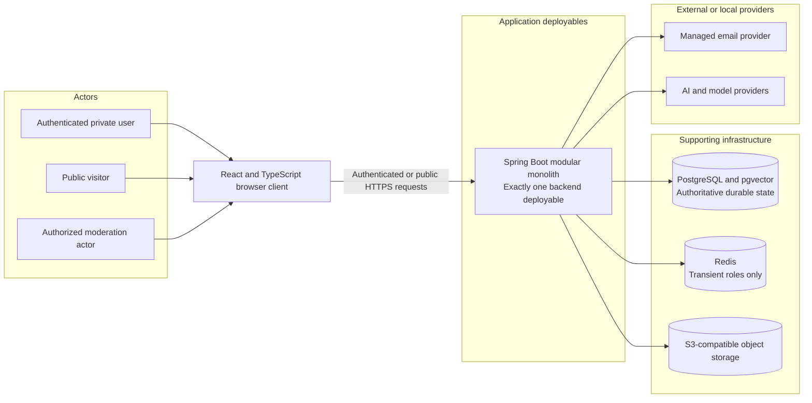
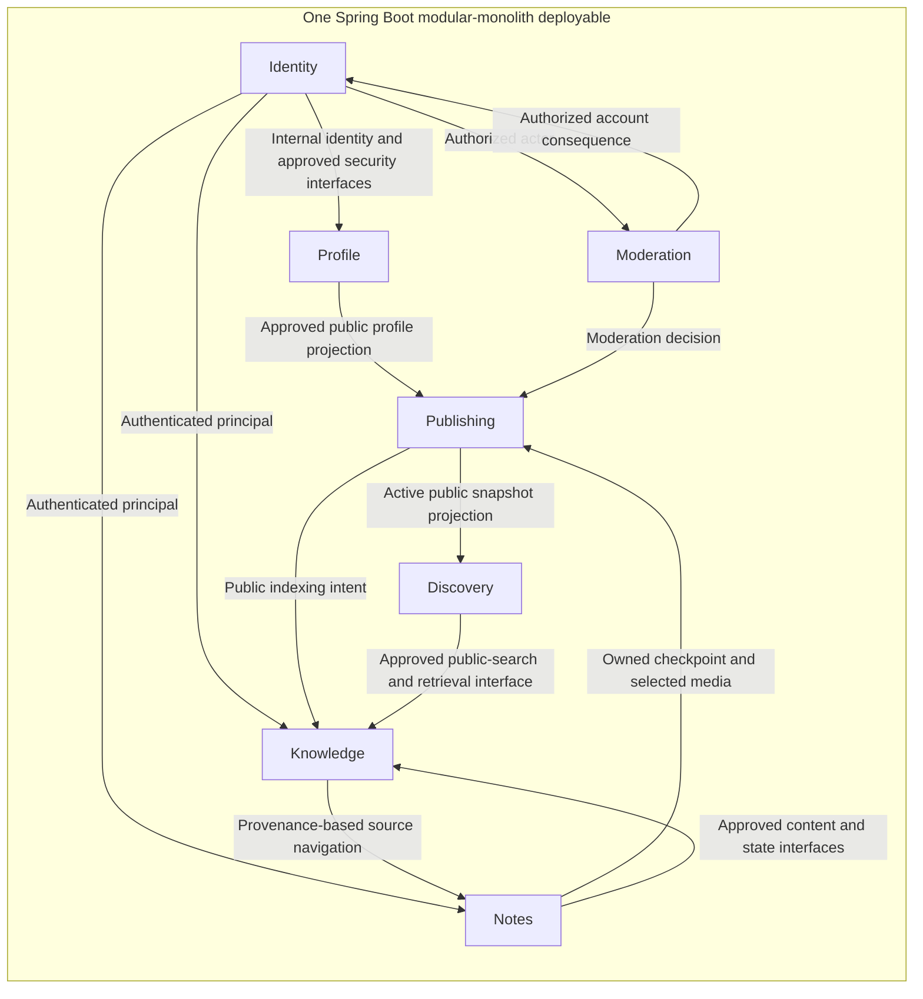
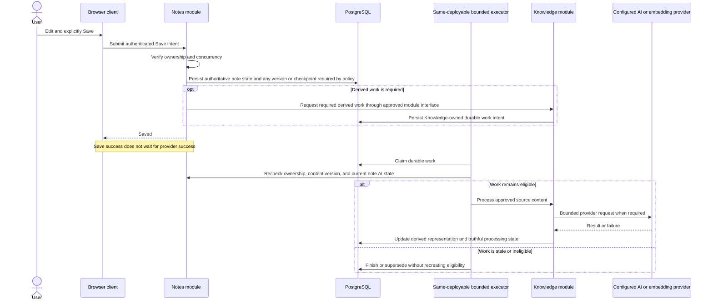
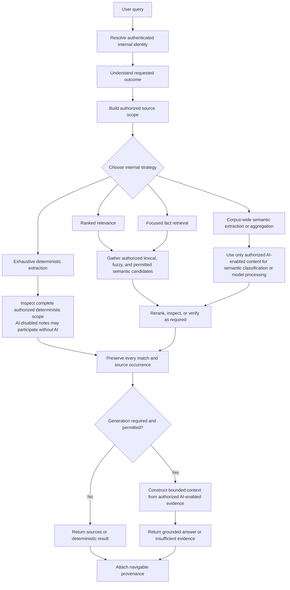
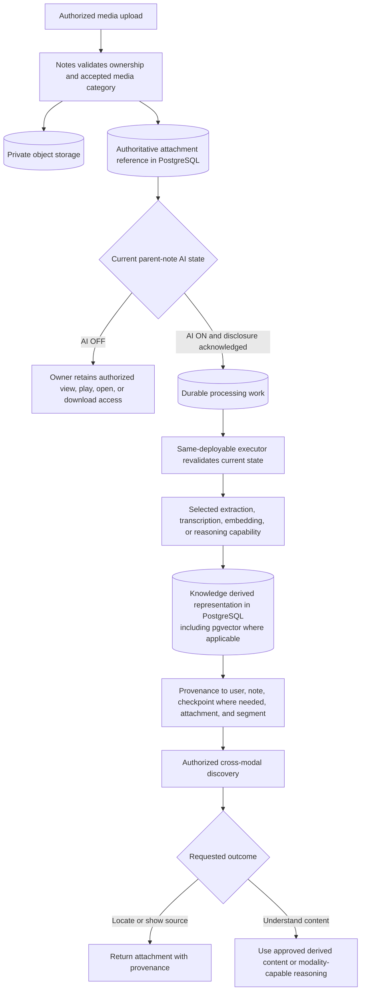
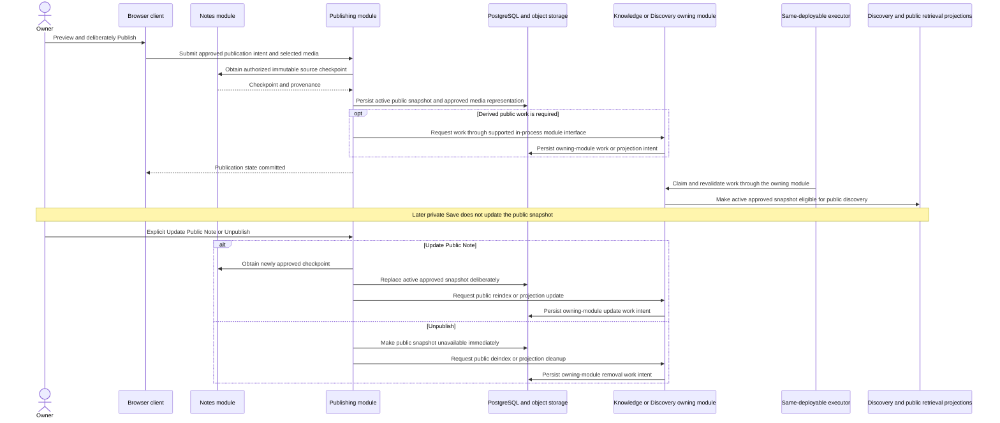

# High-Level Architecture

## Status and Authority

Status: Approved Baseline  
Date: 2026-09-10  
Baseline approval date: 2026-09-10  
Document role: Third approved authoritative design document  
Inputs: Approved Product Vision and Target Flagship Requirements, approved ADR-001, and Project Context Handoff

This document describes how the approved product is divided into major logical parts and how those parts interact. It preserves the product behavior and architecture-style decisions already approved. It does not authorize implementation or redefine requirements.

## Architectural Goals

- Keep private note truth, ownership, and authorization explicit.
- Apply authorization before any private candidate retrieval, not as a result post-filter.
- Preserve an excellent non-AI notes product and truthful degraded behavior.
- Support deliberate Save, bounded versions, attachments, and publication snapshots consistently.
- Keep each note's independent AI ON/OFF state authoritative for AI-dependent processing.
- Support ordinary, semantic, hybrid, focused, aggregated, exhaustive, and multimodal retrieval without collapsing them into one algorithm.
- Make durable derived work recoverable without requiring another application deployable.
- Maintain clear module ownership and testable interaction boundaries inside one backend.
- Keep public projections separate from private note state and representations.
- Leave detailed technology compatibility, domain, schema, API, security, operations, and implementation choices to their authorized downstream documents.

## Architectural Baseline

This HLD inherits and does not reopen ADR-001:

- Exactly one initial Spring Boot backend deployable.
- A domain-oriented modular monolith.
- Spring Modulith support for boundary verification, module testing, and structural documentation.
- One PostgreSQL physical database initially.
- No cross-module repository access.
- Knowledge/AI remains an internal module initially.
- A bounded background executor remains inside the same deployable initially.
- Durable asynchronous work is PostgreSQL-backed.
- No initial RabbitMQ, API gateway, Kubernetes requirement, dedicated AI service, or separately deployed worker.

The React and TypeScript frontend is compiled browser client software and static assets. Whether those assets are served by the backend or hosted separately remains a downstream deployment decision and does not alter the single-backend-deployable decision.

## System Context

The system serves authenticated private users, anonymous or authenticated public visitors, and narrowly authorized moderation actors. Application authorization and security-sensitive control decisions are mediated by the backend, which remains authoritative for ownership and access. Supporting data systems and providers are dependencies, not Notes & Knowledge Workspace application microservices.

The browser client is not a backend service boundary. PostgreSQL, Redis, object storage, email delivery, and AI/model providers are supporting systems. Their physical hosting, network placement, and vendor selection are not decided here. Knowing an object identifier never authorizes arbitrary private-object access. The exact bounded attachment byte-transfer path is also downstream: later design may choose backend-proxied transfer or an appropriately backend-authorized direct browser/object-storage transfer. The diagram intentionally shows logical authority and dependency relationships and does not commit that data-transfer path or a particular storage delivery mechanism.

## Logical Backend Architecture

The backend is one process boundary containing seven domain-oriented logical modules. Arrows below show meaningful conceptual collaboration, not frozen package dependencies or call direction for every use case.

Modules collaborate through deliberate application interfaces, purpose-built projections, and selected internal events. Direct synchronous interaction is appropriate where an operation is immediate and transactional. Events are appropriate for genuinely decoupled reactions. No module may reach into another module's repository as an integration shortcut, and not every interaction is event-driven. One physical PostgreSQL database allows approved module interactions to participate in a local ACID transaction where a business invariant requires it, while each module continues to own its repositories and durable state: a shared transaction does not imply shared repository ownership. Discovery owns the public-facing discovery capability and uses an approved in-process interface or projection relationship with Knowledge for public search; this is not an HTTP service call or repository shortcut. Knowledge may coordinate derived public-search representations, but retrieval is limited to active approved publication representations and never queries private note or vector structures as a shortcut. Exact public-search mechanics remain downstream.

Spring Modulith is used to verify allowed dependencies, support module-oriented tests, and document the module graph. It does not create distributed services inside the JVM.

## Backend Module Responsibilities

| Module | High-level responsibility | Conceptually owned durable state |
|---|---|---|
| Identity | Internal application identity; email/password and Google OIDC authentication; verification; server-side sessions; MFA; recovery; revocation; security-sensitive account changes | Identity, credential, verification/recovery, MFA, and authoritative session concerns |
| Profile | Private account-facing profile metadata; public handle and profile projection; avatar lifecycle/reference ownership | Profile metadata and avatar references |
| Notes | Private Markdown note lifecycle; explicit Save; versions/checkpoints; tags; pin/archive/trash/restore; attachment lifecycle; per-note AI state; future-note default behavior | Authoritative note content, state, checkpoints, attachment references, and note AI participation |
| Publishing | Previewed and deliberate publication; active snapshot lifecycle; source-checkpoint provenance; update-public-copy; unpublish; selected public media; private/public drift | Active public snapshot and its approved publication state |
| Discovery | Small public surface comprising Latest, Trending, public search, likes, approximate views, and suitable public read projections | Durable engagement state and public discovery projections where applicable |
| Knowledge | Derived lexical/semantic representations; indexing/deindexing coordination; knowledge-query routing; grounded-answer orchestration; provenance; related notes; AI suggestions; multimodal retrieval/reasoning coordination; provider abstraction; evaluation hooks | Derived search/AI representations, processing status, and durable knowledge-work intent |
| Moderation | Reason-coded reports, authorized review, hide/remove decisions, authorized abusive-account consequences, and auditability | Reports and moderation decision evidence |

These responsibility contours are architectural ownership, not a frozen domain model. Exact aggregates, entities, repository boundaries, and persistence layout remain downstream.

Immutable internal application identity is the ownership key throughout the backend. Public handles are display and routing metadata, never authorization identity.

## Data and Infrastructure Responsibilities

### PostgreSQL and pgvector

PostgreSQL is the authoritative durable system for relational product state, server-side sessions, durable background work, full-text and fuzzy-supporting search facilities, semantic vector storage through pgvector, and durable engagement state where applicable. One physical database does not imply shared ownership: module boundaries still govern access.

Knowledge representations are derived from authoritative source state. Their presence never grants authorization, overrides current note AI state, or turns private data public.

### Object storage

S3-compatible object storage holds sanitized avatar assets, authorized private note attachments, and deliberately approved public attachment representations. The owning module retains lifecycle and authorization decisions; an object location alone is never sufficient authorization.

### Redis

Redis may support transient rate limiting, short-lived deduplication, and measured caching. It is not authoritative for notes, sessions, durable jobs, vectors, publications, likes, or permanent counts. Redis loss must not destroy durable product state.

### Managed email and AI/model providers

Email delivery is an external dependency for verification, recovery, and security communications. AI/model providers sit behind internal provider boundaries and may be local or remote. A remote provider call does not create an application microservice.

No exact provider, model, deployment, or data-routing choice is frozen here. Before private content crosses an external AI-provider boundary, the product's approved informed disclosure and note-level AI rules apply.

## Synchronous and Asynchronous Interaction Model

Synchronous interactions establish authoritative outcomes the caller must know immediately. Examples include authentication, reading an authorized note, persisting an explicit Save, changing a note's lifecycle or AI state, and committing a publication state change where the immediate invariant matters.

Asynchronous interactions perform durable follow-up work whose completion may be pending, retried, or failed without invalidating the authoritative mutation. Examples include embeddings, reindexing/deindexing, media extraction or transcription, retryable email delivery, cleanup, selected public projections, and bounded view-count persistence.

The originating synchronous operation records durable follow-up intent consistently where required. It does not wait for a live AI, embedding, email, or media-processing provider to succeed.

## Representative Save and Indexing Flow

A provider failure changes derived processing state to pending, retryable, degraded, or failed as appropriate. It does not roll back or invalidate a successfully persisted note. When atomic scheduling is required, the approved in-process Notes-to-Knowledge interaction may participate in the same local transaction while Knowledge remains responsible for its own durable work state; this does not authorize Notes to access a Knowledge repository. This flow does not decide that every explicit Save creates a retained immutable version; version/checkpoint creation and retention follow the later approved versioning policy. Publication still obtains an approved immutable checkpoint where its provenance requires one.

## Note AI-State Transitions

### AI ON to AI OFF

1. The authenticated owner requests the note-level change.
2. Notes verifies ownership and persists AI OFF as authoritative state.
3. Existing derived representations become logically ineligible immediately.
4. Durable deindex/removal work is recorded.
5. Retrieval paths exclude those representations even if physical cleanup is pending.
6. Stale jobs recheck current state and cannot recreate or use them.
7. Editing, Save, lexical/fuzzy search, tags, lifecycle operations, deterministic non-AI extraction, and authorized attachment access continue.

Logical ineligibility takes precedence over delayed physical cleanup. The exact cleanup objective is a downstream decision.

### AI OFF to AI ON

1. The authenticated owner requests the note-level change, individually or through an explicit bulk operation.
2. Required AI/provider disclosure must already have been acknowledged before actual AI processing.
3. Notes persists AI ON independently of the account default for future notes.
4. Durable Knowledge processing is queued for eligible text and supported media.
5. The same-deployable executor rechecks current state and processes the work.
6. User-visible processing state may be pending, indexed, or failed.

New accounts begin with **Default AI access for new notes** set to OFF. That preference initializes only future note creation. Create Note may override it, existing notes retain their own state, and later account-default changes do not mutate them. There is no account-wide AI master gate or pause switch.

## Private Search and Knowledge-Query Architecture

Ordinary private search and Ask My Knowledge share authorization and provenance rules but may choose different internal strategies. The visible surface does not determine whether AI is used.

The four strategy classes are internal behaviors, not separate user products and not hard-coded URL, movie, restaurant, or other category subsystems.

Private candidate selection follows this order:

`authenticated internal identity -> authorized scope -> note AI state when AI-dependent -> candidate retrieval -> evidence -> result or grounded answer`

The rejected order is mixed-user retrieval followed by an authorization filter. Authorization applies to lexical, fuzzy, vector, hybrid, related-note, deterministic, media, cache, job, and provenance paths.

AI-disabled notes remain eligible for lexical/fuzzy search, filters, navigation, and deterministic extraction. They contribute no embeddings, semantic/vector candidates, AI reranking or classification, generative context, semantic category extraction, multimodal reasoning, AI organization, or semantic related-note results.

## AI and Provider Architecture

Knowledge coordinates requested-outcome routing, derived representations, provenance, grounded answering, related-note discovery, AI-assisted organizational proposals, multimodal processing, and evaluation hooks. Notes remains authoritative for private content, ownership, lifecycle, and independent AI state.

Provider calls are made through internal capability boundaries that may represent text generation, embeddings, transcription/extraction, or multimodal reasoning. The boundaries permit later provider selection and deterministic test substitutes without creating a generic AI microservice.

Provider routing should occur after evidence is known where practical, so locating an attachment need not invoke an expensive reasoning capability. Generated answers receive only bounded authorized evidence and must retain provenance or report insufficient evidence. Provider failure must be isolated from healthy note behavior.

## Multimodal Architecture

The committed modalities are images, audio/voice recordings, bounded video clips, and PDFs. Upload durability and AI-derived processing are separate concerns.

Locating media and understanding it are distinct. A text query may retrieve an authorized relevant attachment without a generative multimodal call. A detailed media-grounded question may use transcription, extraction, another approved derived representation, or a modality-capable provider. Exact codecs, limits, libraries, chunking, transcription, embeddings, and providers remain deferred.

An AI-processing failure never destroys a successfully stored attachment or revokes its owner's normal access. Attachment AI participation follows the parent note; there is no separate per-attachment AI permission in the Target Flagship.

## Publication Architecture

Publication is a deliberate copy/projection workflow, not a visibility flag that turns private note truth into public data.

Publishing owns the committed publication snapshot and lifecycle. When publication changes require derived public indexing, search, or projection work coordinated by Knowledge or Discovery, Publishing requests that work through the appropriate supported in-process module interface and the owning module persists its own intent. The exact division of individual public-work types remains downstream. Sharing PostgreSQL or a local transaction never authorizes Publishing to manipulate another module's repository. Public retrieval uses active publication snapshots, approved public metadata, and approved public media representations only. It must not query private note or private vector structures directly. Unpublishing removes public availability and eligibility synchronously where the invariant requires it; slower physical cleanup may continue asynchronously.

## Private and Public Retrieval Separation

| Private retrieval | Public retrieval |
|---|---|
| Requires authenticated internal identity | May serve anonymous or authenticated visitors |
| Starts from authorized owner scope | Starts from active publication scope |
| Uses private note-derived representations subject to note AI state | Uses only approved public snapshot representations |
| May include AI-disabled notes in deterministic non-AI paths | Cannot infer unpublished private source state |
| Provenance navigates only to resources the principal may open | Provenance exposes only approved public information |

Publication does not flip a private note row into a public resource. Private source truth and public snapshot truth remain distinct, and public indexing or object storage never makes unapproved private content public.

## Durable Background Processing

PostgreSQL stores durable work; the bounded executor runs in the same backend deployable. Conceptually, processing follows:

`durable intent -> bounded claim -> current-state revalidation -> processing -> retry/backoff when appropriate -> terminal success or visible failure`

Architectural guarantees are:

- Work intent survives application restart.
- Processing is idempotent or retry-safe by design direction.
- Claims and concurrency are bounded.
- Stale work cannot bypass current ownership, authorization, publication, or note AI state.
- Provider failure does not lose authoritative note or attachment data.
- Pending, retrying, stale, and failed processing are not presented as valid-empty, complete, or indexed outcomes.
- Spring Modulith events may assist internal notification but do not replace durable work state for critical processing.

Exact job records, state transitions, leases, backoff rules, coalescing, and recovery controls belong to downstream design.

## Authorization and Trust Boundaries

### Trust boundaries

- **Browser to backend:** untrusted client input crosses the public application boundary; authentication, CSRF protection, validation, authorization, and output safety apply.
- **Backend to PostgreSQL:** authoritative state and derived data cross a protected persistence boundary; database access does not replace module or user authorization.
- **Backend to object storage:** private binary content crosses a storage boundary; application ownership and lifecycle rules govern access.
- **Backend to Redis:** transient data crosses a non-authoritative dependency boundary; loss or corruption cannot redefine durable truth.
- **Backend to email provider:** delivery data crosses an external-provider boundary and must be minimized and protected.
- **Backend to AI/model providers:** authorized AI-enabled content may cross a local or external processing boundary only after required disclosure; AI-disabled content never crosses for AI processing.
- **Private state to public projections:** only explicit publication transforms approved snapshot content and selected media into public representations.

This is not a complete threat model. The Security Architecture and Threat Model will define controls, threats, and mitigations in detail.

### Authorization invariants

- Immutable internal identity is resolved before private scope construction.
- Authorization constrains candidates before ranking or evidence construction.
- Public handles, object locations, vector similarity, cache hits, or job identifiers never grant access.
- Jobs revalidate current state before processing or exposing results.
- Provenance never bypasses authorization and cannot reveal another user's resource existence.
- Logical ineligibility after AI disablement or unpublish applies before delayed cleanup finishes.

### Provenance

Derived Knowledge records must retain enough conceptual provenance to trace authorized output to the owning user, source note, relevant note checkpoint when needed, attachment where applicable, and relevant segment or location where practical. Provenance is evidence metadata, not an authorization bypass.

## Failure and Degraded Modes

| Failure or delay | High-level behavior |
|---|---|
| AI reasoning provider unavailable | Core note editing, Save, lifecycle, attachment access, and ordinary lexical/fuzzy search continue when their dependencies are healthy; AI outcomes show degraded or retryable state |
| Embedding provider unavailable | New semantic processing is pending or failed; existing results are used only if current and eligible; lexical/fuzzy retrieval remains available |
| Redis unavailable | Authoritative state remains intact; transient cache/deduplication features degrade, and security-sensitive operations use a safe downstream-defined failure policy rather than silently bypassing controls |
| Object storage unavailable | Attachment upload/access may fail or retry; PostgreSQL-backed note text and metadata behavior may continue where independent and healthy; the system does not claim unavailable media is accessible |
| Email provider unavailable | Delivery-dependent verification, recovery, or notification work remains pending/retryable; existing authenticated functionality continues where policy permits |
| Background executor delayed | Authoritative mutations remain durable; derived work stays visibly pending/stale and is not reported as completed or valid-empty |
| Indexing stale or pending | The product communicates processing state and does not claim semantic completeness or freshness it cannot prove |
| PostgreSQL unavailable | Authoritative application functionality is substantially unavailable and fails safely; Redis, object storage, or providers cannot substitute for the source of truth |

## Scalability and Evolution

The initial topology has one backend deployable type. Hosting may later run multiple identical instances of that deployable for availability or capacity; this does not create microservices or change module ownership. Exact instance topology and coordination mechanisms remain downstream.

The same-deployable executor is bounded so background work cannot grow without control. Queue depth, work age, processing duration, resource contention, provider failures, and interactive latency must become observable enough to test ADR-001's extraction criteria.

Knowledge/AI or the executor role may be considered for independent deployment only after measured evidence supports a superseding ADR. Explicit module interfaces, conceptual data ownership, constrained dependencies, and observable workload profiles provide seams for evaluation. This HLD does not design a future microservice topology.

## Architectural Invariants

1. There is exactly one initial Spring Boot backend deployable.
2. Domain modules have explicit ownership boundaries verified with Spring Modulith support.
3. Cross-module repository access is prohibited.
4. PostgreSQL is authoritative for durable application state and durable work.
5. Redis is non-authoritative and restricted to approved transient roles.
6. Authorization constrains private candidates before retrieval, ranking, or context construction.
7. Current per-note AI state is checked before every AI-dependent processing and retrieval path.
8. AI-disabled notes remain available to authorized lexical/fuzzy and deterministic non-AI retrieval.
9. The future-note AI default initializes new notes only and never governs existing-note processing.
10. Public snapshots and public retrieval structures remain separate from private note state and representations.
11. AI/provider failure cannot invalidate successfully persisted authoritative notes or attachments.
12. Durable work survives process restart and revalidates current state before effects become visible.
13. Supported media remains normally accessible to its owner independently of AI-processing success.
14. Storage, indexing, or derived representation never makes private data public.
15. Knowledge/AI and the background executor remain inside the initial backend deployable.
16. No new application service or separate worker may be introduced without a superseding approved ADR.

## Deferred Decisions

This HLD deliberately does not decide:

- Exact versions or compatibility combinations for Spring Boot, Spring Modulith, PostgreSQL, pgvector, Redis, React, TypeScript, or other dependencies.
- Exact Java package structure, module declaration mechanism, or class organization.
- Domain aggregates, entities, value objects, repositories, or detailed ownership boundaries.
- Database schemas, tables, indexes, constraints, vector dimensions, or migrations.
- API routes, operations, DTOs, error contracts, or versioning.
- Exact authentication, OIDC, MFA, session, recovery, CSRF, and authorization implementation flows.
- Durable-job schema, states, claims, leases, retries, backoff, coalescing, or executor implementation.
- Full-text, fuzzy, vector, hybrid-fusion, reranking, classification, and stopping algorithms.
- AI/provider/model selection, capability routing, prompts, embeddings, context limits, or evaluation thresholds.
- Media codecs, type detection, extraction/transcription tooling, chunking, size/duration/page limits, or quotas.
- Object-storage layout, keys, URLs, delivery mechanism, and lifecycle configuration.
- Redis keys, TTLs, rate-limit algorithms, deduplication windows, and cache policy.
- Exact hosting, network, instance, frontend delivery, CDN, reverse-proxy, domain, or cloud topology.
- CI/CD design, observability tooling, operational procedures, and implementation sequencing.

Exact technology versions and compatibility are primarily the responsibility of the next **Technology Stack and Compatibility** document. Other decisions remain with their designated downstream documents.

## Relationship to Approved Requirements and ADR-001

| Approved concern | HLD response |
|---|---|
| Notes and explicit Save requirements | Notes owns authoritative editing/checkpoint behavior; Save completes independently of live derived processing |
| Attachment requirements | Notes owns private lifecycle; object storage holds bytes; Knowledge owns only derived processing; access survives AI-processing failure |
| AI access controls | Per-note state is authoritative; future-note default is initialization only; jobs and retrieval recheck current state |
| Ask My Knowledge | Knowledge routes among evidence strategies, applies bounded authorized context, provenance, and insufficient-evidence behavior |
| Multimodal requirements | Image, audio/voice, bounded video, and PDF flows preserve source ownership, processing separation, and provenance |
| Retrieval requirements | Ranked, focused, semantic aggregation, and exhaustive deterministic strategies remain distinct behind one authorized query workflow |
| Security and isolation requirements | Internal identity establishes scope before every direct or derived candidate path; public and private structures are separated |
| Publication requirements | Publishing creates a deliberate active snapshot from an immutable checkpoint; private Save is not public update |
| Degraded-mode NFRs | Provider, Redis, storage, executor, indexing, email, and database failure boundaries have truthful outcomes |
| Maintainability and testability NFRs | Module interfaces, Spring Modulith verification, no repository shortcuts, durable work, and explicit invariants provide testable seams |

ADR-001 remains authoritative for architecture style, deployable count, internal Knowledge/AI placement, same-deployable executor, physical database count, and extraction governance. This HLD refines logical responsibilities and interactions without changing those decisions.

## Review Checklist and Decision Summary

- Status is Approved Baseline and human review is complete.
- The system contains exactly one initial Spring Boot backend deployable.
- Identity, Profile, Notes, Publishing, Discovery, Knowledge, and Moderation have high-level responsibilities only.
- PostgreSQL is authoritative; Redis is transient; object storage and providers are supporting dependencies.
- Synchronous authoritative outcomes and asynchronous derived work are distinct.
- Save/indexing, AI-state transitions, knowledge routing, multimodal processing, and publication flows preserve approved behavior.
- Authorization occurs before candidate retrieval across every private path.
- AI-disabled deterministic retrieval remains possible without sending that content to AI.
- Images, audio/voice recordings, bounded video clips, and PDFs remain the committed modalities.
- Private and public retrieval structures and eligibility remain separate.
- Failure behavior is truthful and does not overstate graceful degradation.
- Technology versions, detailed domain/schema/API design, provider selection, hosting, and implementation remain deferred.
- No service or worker is added beyond ADR-001.
