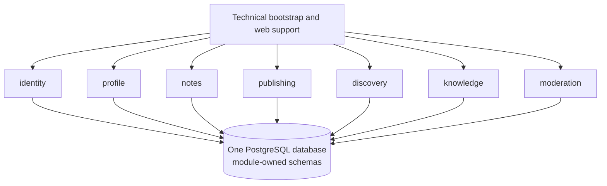
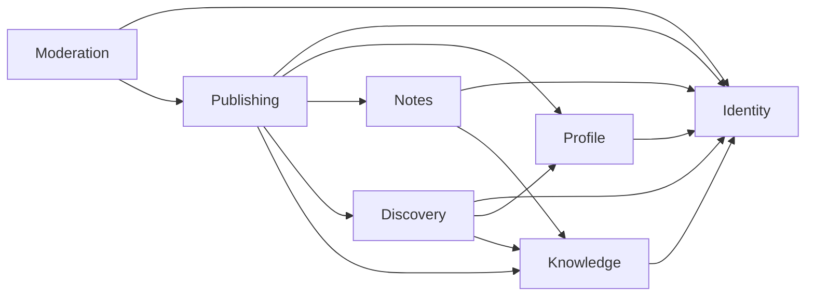
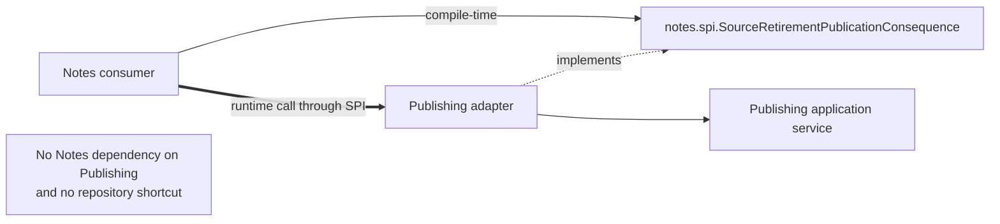
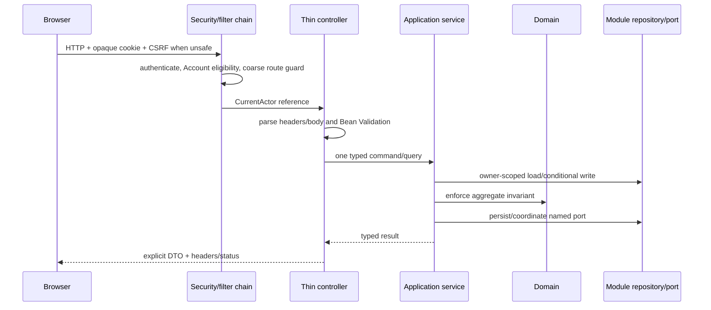
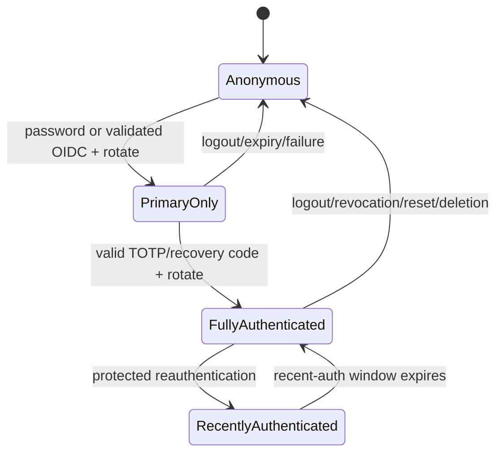
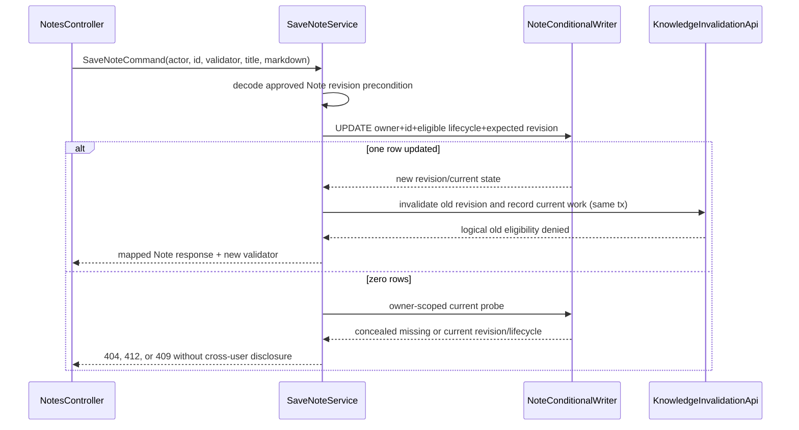
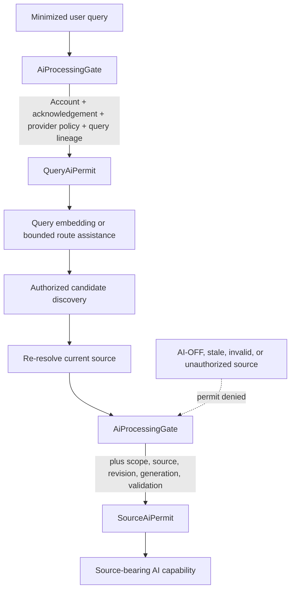
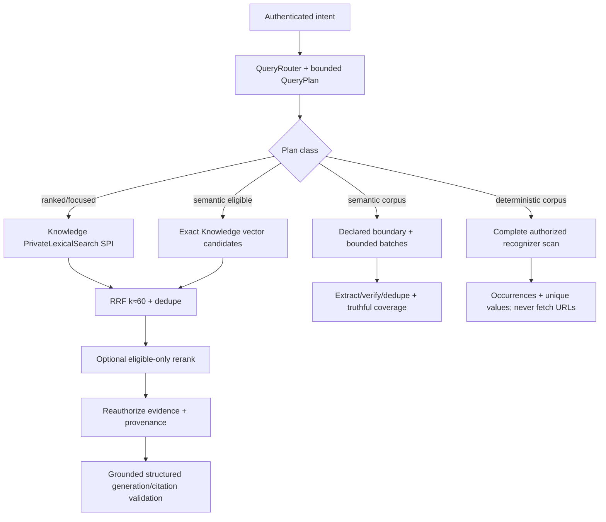
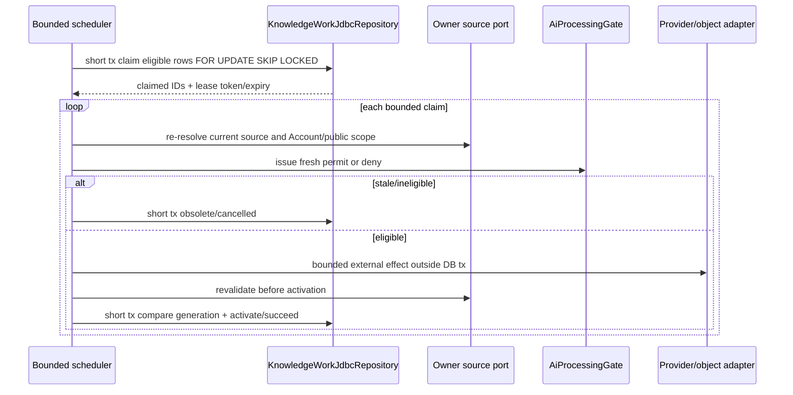

# Notes & Knowledge Workspace

# Backend Low-Level Design

Status: Approved Baseline  
Date: 2026-09-13
Last revised: 2026-09-14
Baseline approval date: 2026-09-14

## 1. Purpose, authority, and implementation gate

This document defines the concrete backend structure that can implement the ten Approved Baselines: Product Vision and Target Flagship Requirements, ADR-001, High-Level Architecture, Technology Stack and Compatibility, Security Architecture, Threat Model, Domain Model, Schema & Migration Design, Search / AI / Retrieval Design, and API Design. `PROJECT_CONTEXT_HANDOFF.md` remains durable project context.

This LLD owns backend packages, classes, module-facing ports, application services, transaction demarcation, persistence mapping, SQL responsibilities, security integration, object/media adapters, AI capability adapters, durable-work execution, error mapping, and implementation test seams. It does not amend product behavior, the 91-endpoint HTTP contract, the 38-relation schema catalog, the seven-module architecture, or any approved security/retrieval invariant.

This is a design artifact only. It creates no application source, build file, configuration, migration, OpenAPI description, test, container, CI workflow, or Git repository. Approval of this draft would not by itself authorize implementation.

### 1.1 Resolved upstream API precision

The approved API amendment resolves the former validator ambiguity. Note, Attachment, and Publication responses carrying strong mutation validators now contain only the selected authoritative aggregate core. `StrongCoreEtagCodec` derives a resource-bound strong validator from the owning aggregate's approved version tuple. Volatile Note/Attachment AI-processing state is exposed only by endpoint 65, `GET /api/notes/{noteId}/ai-processing`; volatile owner Publication source status is exposed only by endpoint 77, `GET /api/me/publications/{publicationId}/source-status`. Both are owner-authorized, `no-store` reads with no mutation ETag or `If-Match` role.

### 1.2 Resolved upstream Schema and Security precision

The approved Schema and Security amendments add Identity-owned relation 38, `identity.security_email_delivery`. It durably persists exactly the approved `capability_link` and `security_notice` work kinds, including bounded claims, retry state, lease-token fencing, and narrowly encrypted delivery material. The one-way `identity_capability` verifier remains authoritative. Blind enumeration-resistant `202` responses therefore need no in-memory durability fiction, polling resource, or Knowledge-owned mail work.

## 2. Fixed runtime and architectural shape

| Concern | Backend decision |
|---|---|
| Runtime | Java 25, Spring Boot 4.1.1, Spring MVC/Servlet, embedded Tomcat baseline. |
| Architecture | Domain-oriented modular monolith with exactly seven Spring Modulith application modules. |
| Deployables | Exactly one initial Spring Boot backend deployable; exact artifact/deployable name remains to be decided. |
| Database | One PostgreSQL 18.6 database, seven module schemas, Flyway-only schema authority. |
| Persistence | Spring Data JPA for aggregate-oriented persistence; `JdbcClient`/native SQL for conditional writes, FTS/trigram/vector queries, claims, and bulk operations. |
| Sessions | Spring Session JDBC/PostgreSQL; opaque HttpOnly authentication cookie. |
| Background work | Bounded same-deployable executor claiming module-owned PostgreSQL durable work. |
| AI | Knowledge-internal capability ports with Spring AI or narrow provider adapters; no separate AI service. |
| Media | Backend-mediated, authorization-checked streaming; no whole-object heap buffering. |
| Explicit exclusions | No WebFlux, R2DBC, broker, API gateway, Kubernetes, separate worker, shared business module, browser JWT, initial ANN index, or cross-module repository. |

The Servlet choice is deliberate. Request/response handling, Spring Security, Spring Session JDBC, JPA/JDBC transactions, multipart intake, and byte-range delivery fit the approved blocking stack. Media is streamed from bounded `InputStream`/SDK response streams to the servlet response with backpressure supplied by blocking I/O and server limits; it is never accumulated into a `byte[]` merely for delivery.

## 3. Package and module structure

The repository has no approved Java base package yet, so this design uses `<base>` as a placeholder. Selecting the real reverse-domain package is a naming/build decision during authorized scaffolding.

```text
<base>
├── Application                           # technical bootstrap only
├── websupport                            # Problem Details/Jackson/Clock glue only
├── identity
│   ├── api  ├── spi  ├── web  ├── application  ├── domain
│   └── infrastructure
│       ├── persistence.jpa  ├── persistence.jdbc
│       ├── external  └── configuration
├── profile                               # same internal package vocabulary
├── notes
├── publishing
├── discovery
├── knowledge
└── moderation
```

There is no `<base>.shared`, `.common`, `.core`, or eighth business module. Small framework glue outside application modules is limited to application bootstrap, RFC 9457 serialization, shared Jackson primitives, request correlation, and an injected `Clock`. It may not contain business DTOs, domain values, repositories, authorization rules, provider routing, or use cases.

Each top-level module is an explicit Spring Modulith module. Package metadata declares allowed dependencies and named interfaces. Explicit detection is enabled; accidental package discovery is not the boundary definition. Future verification uses `ApplicationModules.of(Application.class).verify()`.



### 3.1 Internal package roles

| Package | Allowed responsibility | Prohibited responsibility |
|---|---|---|
| `api` | Provider-owned public module interface, immutable cross-module records, stable exceptions. | Framework controllers, entities, repository exposure. |
| `spi` | Consumer-owned capability needed from another module; implemented by an adapter in the provider module. | Generic service locator or repository-shaped interface. |
| `web` | Controllers, request/response records, header/range parsing, HTTP mapping. | Business transactions or direct repository access. |
| `application` | One use-case service per coherent command/query, orchestration, transaction boundary. | Servlet/provider DTO leakage into domain. |
| `domain` | Plain Java aggregates, entities, value objects, policies, domain failures. | Spring/JPA/HTTP/provider types. |
| `infrastructure.persistence.jpa` | Module-owned JPA records/entities and simple repositories. | Cross-schema aggregate navigation. |
| `infrastructure.persistence.jdbc` | Conditional SQL, FTS/trigram/vector queries, claims, bulk operations. | Unowned-table mutation or hidden cross-module integration. |
| `infrastructure.external` | Email, object storage, OIDC/provider/AI adapters. | Authorization or domain decision ownership. |
| `infrastructure.configuration` | Module-specific bean assembly and typed settings. | Secrets embedded in code or business behavior hidden in config. |

### 3.2 API and SPI direction

A provider-owned `api` says, “this module deliberately offers this operation.” A consumer-owned `spi` says, “this use case requires this capability without depending on the provider's internals.” The provider implements the consumer SPI in a thin adapter that delegates to its own application service. This reverses runtime calls without reversing compile-time module dependencies.

Example: Notes compiles against `notes.spi.SourceRetirementPublicationConsequence`; Publishing supplies `PublishingSourceRetirementAdapter`. Publishing continues to own publication state and repositories. Notes never imports a Publishing repository or domain aggregate.

The physical placement examples are binding direction:

```text
<base>.profile.spi.ActiveAuthorPublications
  <- <base>.discovery.infrastructure.profile.DiscoveryActiveAuthorPublicationsAdapter
<base>.notes.spi.SourceRetirementPublicationConsequence
  <- <base>.publishing.infrastructure.notes.PublishingSourceRetirementAdapter
<base>.knowledge.spi.PrivateKnowledgeSource
  <- <base>.notes.infrastructure.knowledge.NotesPrivateKnowledgeSourceAdapter
<base>.knowledge.spi.PrivateLexicalSearch
  <- <base>.notes.infrastructure.knowledge.NotesPrivateLexicalSearchAdapter
<base>.knowledge.spi.PublicKnowledgeSource
  <- <base>.publishing.infrastructure.knowledge.PublishingPublicKnowledgeSourceAdapter
<base>.identity.spi.AccountDeletionProfileConsequence
  <- <base>.profile.infrastructure.identity.AccountDeletionProfileAdapter
<base>.identity.spi.AccountDeletionPublishingConsequence
  <- <base>.publishing.infrastructure.identity.AccountDeletionPublishingAdapter
```

The consumer owns each SPI vocabulary; the provider owns its physical implementation. Runtime call direction may point opposite compile-time dependency. No generic adapters module exists.

## 4. Module dependency model

Compile-time dependencies are acyclic:



| Consumer \ Provider | Identity | Profile | Notes | Publishing | Discovery | Knowledge | Moderation |
|---|---:|---:|---:|---:|---:|---:|---:|
| Identity | — | SPI adapter | — | SPI adapter | — | — | — |
| Profile | API | — | — | — | SPI adapter | — | — |
| Notes | API | — | — | SPI adapter | — | API | — |
| Publishing | API | API | API | — | API | API | — |
| Discovery | API | API | — | — | — | API | — |
| Knowledge | API | — | SPI adapter | SPI adapter | — | — | — |
| Moderation | API | — | — | API | — | — | — |

“SPI adapter” means the row module owns an SPI and the column module supplies its implementation; it is not a compile-time import from row to column. Every other cell is forbidden. Local domain events may inform noncritical observers but are not used as reliable authorization or critical work storage.

The allowed cells expand as follows; together with the 7×7 matrix this records the named interface, compile-time arrow, runtime call, and reason:

| Compile-time consumer → provider | Named interface | Runtime direction | Reason |
|---|---|---|---|
| Profile → Identity | `AccountEligibilityApi` | Profile calls Identity | Private/public Profile commands require current eligible Account. |
| Knowledge → Identity | `AccountEligibilityApi` | Knowledge calls Identity | Every query, dispatch, and retry rechecks Account authority. |
| Notes → Identity | `AccountEligibilityApi` | Notes calls Identity | Note ownership operates only for a currently eligible Account. |
| Notes → Knowledge | `KnowledgeInvalidationApi` | Notes calls Knowledge | Save/AI/lifecycle changes synchronously revoke old derived eligibility and record work. |
| Discovery → Identity | `AccountEligibilityApi` | Discovery calls Identity | Authenticated Like state requires a current eligible Account. |
| Discovery → Profile | `PublicProfileApi` | Discovery calls Profile | Public author projection is allowlisted and Profile-owned. |
| Discovery → Knowledge | `PublicKnowledgeQueryApi` | Discovery calls Knowledge | Public semantic candidates remain Knowledge-owned and public-only. |
| Publishing → Identity | `AccountEligibilityApi` | Publishing calls Identity | Owner publish operations require current Account eligibility. |
| Publishing → Profile | `PublicProfileApi` | Publishing calls Profile | Publish/republish requires an active usable public projection. |
| Publishing → Notes | `PublishableSourceApi`, `AttachmentSourceApi` | Publishing calls Notes | Checkpoint, hold, source content, and selected private media stay Notes-owned. |
| Publishing → Discovery | `PublicProjectionApi` | Publishing calls Discovery | Snapshot generation activation/invalidation is Discovery-owned. |
| Publishing → Knowledge | `KnowledgeInvalidationApi` | Publishing calls Knowledge | Old public derived generations must become unreachable before commit. |
| Moderation → Identity | `AccountEligibilityApi`, `PrivilegeAuthorizationApi`, `AccountSuspensionApi` | Moderation calls Identity | Current Account eligibility and narrow live capability are checked separately; only the approved terminal consequence may suspend an Account. |
| Moderation → Publishing | `PublicationModerationApi` | Moderation calls Publishing | Public removal stays with the Publication owner module. |
| Identity → Profile (SPI) | `AccountDeletionProfileConsequence` | Identity calls SPI; Profile adapter executes | Account deletion needs Profile denial without an Identity→Profile API dependency. |
| Identity → Publishing (SPI) | `AccountDeletionPublishingConsequence` | Identity calls SPI; Publishing adapter executes | Account deletion must unpublish without forming an Identity cycle. |
| Profile → Discovery (SPI) | `ActiveAuthorPublications` | Profile calls SPI; Discovery adapter executes | Profile HTTP composition pages public projections without Profile depending on Discovery. |
| Notes → Publishing (SPI) | `SourceRetirementPublicationConsequence` | Notes calls SPI; Publishing adapter executes | Confirmed source retirement unpublishes without a Notes→Publishing cycle. |
| Knowledge → Notes (SPI) | `PrivateKnowledgeSource`, `PrivateLexicalSearch` | Knowledge calls SPIs; Notes adapters execute | Knowledge receives purpose-bound current source data and bounded owner-authorized lexical/fuzzy candidates without Notes repository access. |
| Knowledge → Publishing (SPI) | `PublicKnowledgeSource` | Knowledge calls SPI; Publishing adapter executes | Public derivation receives active snapshot data without Publishing repository access. |



## 5. Cross-module contracts

All records below contain only stable IDs, bounded status codes, revisions/generations, and minimal allowlisted data. No contract exposes a repository, JPA entity, session object, provider model, object key, private body unless the named authorized purpose requires it, or generic `Map<String,Object>`.

### 5.1 Provider-owned APIs

| Owner | Interface and representative operations | Consumers |
|---|---|---|
| Identity | `AccountEligibilityApi.requireEligible(UserId)`, `AccountEligibilityApi.readState(UserId)`, `PrivilegeAuthorizationApi.requireActiveCapability(UserId, CapabilityCode, optional bounded scope)`, `AccountSuspensionApi.suspendForModeration(...)` | All protected modules; Moderation for live review/enforce checks and approved suspension. |
| Profile | `PublicProfileApi.requireActiveProjection(UserId)`, `PublicProfileApi.resolveByHandle(PublicHandle)` | Publishing, Discovery. |
| Notes | `PublishableSourceApi.preview(...)`, `checkpointAndHold(...)`, `replaceHold(...)`, `releaseHold(...)`; `AttachmentSourceApi.requireValidatedSelection(...)` | Publishing. |
| Knowledge | `KnowledgeInvalidationApi.invalidatePrivate(...)`, `invalidatePublic(...)`, `recordPrivateWork(...)`, `recordPublicWork(...)`; `PublicKnowledgeQueryApi.search(...)` | Notes, Publishing, Discovery. |
| Discovery | `PublicProjectionApi.invalidate(...)`, `advance(...)` | Publishing. |
| Publishing | `PublicationModerationApi.remove(...)` | Moderation. |
| Moderation | No cross-module provider API initially; its public surface is HTTP/application only. | — |

### 5.2 Consumer-owned SPIs

| Consumer | SPI | Provider implementation | Required semantics |
|---|---|---|---|
| Identity | `AccountDeletionProfileConsequence` | Profile | Inactivate public projection and avatar eligibility in initiating transaction. |
| Identity | `AccountDeletionPublishingConsequence` | Publishing | Unpublish every active Publication and invoke public invalidation before account deletion commits. |
| Profile | `ActiveAuthorPublications` | Discovery | Page active public projections for a handle-bound projection; no private lookup. |
| Notes | `SourceRetirementPublicationConsequence` | Publishing | Detect active source publication; after explicit confirmation make it and old public generations unreachable synchronously. |
| Knowledge | `PrivateKnowledgeSource` | Notes | Resolve only authorized current Note/Attachment source material for a typed purpose permit. |
| Knowledge | `PrivateLexicalSearch.search(CurrentAuthorizedLexicalQuery)` | Notes | Return bounded owner-authorized lexical/fuzzy candidate projections with source identity, revision/provenance, score, and rank for Knowledge fusion; no repository/entity or provider controls. |
| Knowledge | `PublicKnowledgeSource` | Publishing | Resolve only active current public snapshot/media material. |

Critical SPI adapters are mandatory beans. Startup fails if one is absent. They are ordinary local calls and join the initiating transaction with propagation `MANDATORY`; they must not use `REQUIRES_NEW`, swallow a required failure, or turn a synchronous denial boundary into best-effort event delivery.

## 6. Request handling and application conventions



Controllers contain no transaction annotations, repositories, entity mapping, provider calls, or domain branching beyond HTTP framing. Each method builds one immutable command/query and calls one application entry point. Request and response DTOs are Java records dedicated to the endpoint family. Mapping is explicit manual code in `web` mappers; MapStruct and Lombok are not selected.

`CurrentActor` is a narrow request-scoped contract:

```text
CurrentActor(UserId userId, AuthenticationStage stage,
             Instant primaryAuthenticatedAt, Instant fullyAuthenticatedAt)
```

It excludes email, password, TOTP state, moderator capabilities, raw authorities, session ID, cookie, CSRF token, provider tokens, and arbitrary attributes. Framework integration may retain a non-authoritative hint, but no protected operation may rely on it. Application services call `AccountEligibilityApi` for current eligibility and `PrivilegeAuthorizationApi` for current narrow capabilities. `CurrentActor` proves only who authenticated, at which stage, and when; it is not continuing Account, resource, or moderator authorization.

## 7. Transaction model

The initiating application service owns the transaction. Cross-module critical calls join the same transaction. Each module writes only its own repositories. Provider, email, object-transfer, parsing, and long corpus/media work occur outside database transactions; short transactions persist state before and after those effects.

| Operation | Initiator | Transaction type | Joined ports/repositories | Commit truth |
|---|---|---|---|---|
| Register account | Identity | short write | Account, capability, security-email delivery, audit | Eligible capability and queued link work commit together before blind 202; provider call: no. |
| Request/resend verification | Identity | short write | capability supersession, old delivery obsolescence, new security-email delivery, audit | New one-time authority and durable link work commit together; provider call: no. |
| Confirm email | Identity | short conditional write | capability, Account, audit | Token consumed once and Account activated. |
| Password login | Identity | short security write | Account verifier, session/descriptor | Rotated anonymous-to-primary session established. |
| Complete Google OIDC login/reauth/link callback | Identity | provider protocol exchange/validation outside transaction, then short local write | validated issuer+subject result; Account/link/session/audit and required notice repositories as applicable | No DB lock spans provider latency; only successfully validated protocol output enters the authoritative transaction. |
| Complete MFA | Identity | short conditional write | MFA/recovery, session/descriptor, audit | Proof consumed/replay slot advanced and full session rotated. |
| Request password reset | Identity | short write | capability supersession, security-email delivery, audit | Eligible work is durable before blind 202; unknown/ineligible target creates no fake work; provider call: no. |
| Complete password reset | Identity | short conditional write | capability, Account, all sessions, audit, `password_reset_completed` delivery | Token consumed, verifier replaced, sessions revoked, and required notice intent commits; provider call: no. |
| Request email change | Identity | short write | capability supersession, security-email delivery, audit | New-address verification capability and queued link delivery commit; provider call: no. |
| Confirm email change | Identity | short conditional write | capability, Account A→B, sessions, audit, two event-bound notice rows | One event ID plus protected A/B recipient envelopes commit with the change; provider call: no. |
| Change password | Identity | short write | Account, session consequences, audit | Security change and required rotation/revocation are atomic; provider call: no. |
| Begin/confirm MFA enrollment | Identity | short writes | MFA config, recovery codes, audit | Pending setup then active config and recovery set. |
| Disable/reset MFA | Identity | short write | MFA/recovery state, sessions, audit, `mfa_disabled` or `mfa_reset` delivery | Security state, consequences, and required notice intent commit; provider call: no. |
| Link/unlink Google OIDC | Identity | short write | external link, sessions, audit, `google_oidc_linked` or `google_oidc_unlinked` delivery | Link state and required notice intent commit; provider call: no. |
| Revoke session(s) | Identity | short write | Spring Session + descriptor | Selected authority is removed. |
| Delete account | Identity | cross-module critical local ACID | Account/session, Profile consequence, Publishing consequence, synchronous eligibility invalidations | Account, sessions, public and AI eligibility are denied before success; physical cleanup follows only through approved state/reconciliation. |
| Update private Profile | Profile | short write | Profile | Valid current presentation committed. |
| Replace avatar reference | Profile | prepare outside + short write | Avatar/Profile; public projection only on explicit refresh | Validated object reference swaps; old bytes become unreachable and cleanup is best effort/reconciled. |
| Activate public profile | Profile | short write | Profile/projection, Identity eligibility | Allowlisted projection and unique handle committed. |
| Create Note | Notes | short write | preference read, Note, optional Knowledge work | Note gets independent initial AI value and revision. |
| Save Note | Notes | cross-module local ACID | conditional Note write/search projection; Knowledge invalidation/work | New revision and old-representation invalidation/durable intent commit. |
| Change Note lifecycle | Notes | short or critical cross-module | Note; Publishing consequence for published-source trash/delete | Lifecycle changes only after any required public denial. |
| Change Note AI | Notes | cross-module critical local ACID | Note generation + Knowledge invalidation/work | AI OFF/ON state and logical eligibility consequences commit. |
| Bulk Note AI | Notes | bounded batch transactions | owner-scoped conditional Note rows + Knowledge | Each reported batch is applied consistently; no global default change. |
| Replace tags | Notes | short write | Note/tag, optional suggestion attribution via Knowledge API | Current tag set and revision commit. |
| Restore NoteVersion | Notes | short/cross-module write | checkpoint read, conditional Note write, Knowledge | New current revision; checkpoint unchanged. |
| Upload and create accepted Attachment | Notes | external staged stream and bounded validation, then short write | reauthorized current Note; stored/accepted Attachment state + current generation + eligible Knowledge work | No authoritative pre-byte pending row; trusted metadata and current eligibility commit before the initial 201. |
| Delete private Attachment | Notes | cross-module local ACID | Attachment revision/generation/state + Knowledge invalidation; persisted Attachment cleanup state where used | Private eligibility denied; Publication snapshot untouched; object deletion may lag. |
| Acknowledge AI policy | Knowledge | short idempotent write | policy/acknowledgement | Exact current policy evidence exists once. |
| Accept Knowledge query | Knowledge | read-only or short write | gates; work intent for 202 | Sync result complete or durable tracked work accepted. |
| Claim/complete Knowledge work | Knowledge | separate short claim/effect/activation transactions | work, sources via ports, representations/segments | Lease is owned; only current generation can activate. |
| Create Publication | Publishing | cross-module critical local ACID | Profile, Notes checkpoint/hold, Publication, Discovery/Knowledge work | Exact previewed snapshot and active public state commit. |
| Update/republish Publication | Publishing | cross-module critical local ACID | Notes hold, Publication children, Discovery/Knowledge invalidation/work | Old generation unreachable and new snapshot atomic. |
| Unpublish/remove Publication | Publishing | cross-module critical local ACID | Publication, Notes hold release, Discovery/Knowledge invalidation | Public eligibility denied before success. |
| Like/unlike | Discovery | short idempotent write | Like relation, active Publication check via public API | Effective relationship state is committed once. |
| Record approximate view | Discovery | best-effort short write | aggregate | Failure never blocks public read. |
| Submit/begin review Report | Moderation | short write | Report/audit | Public target validated; transition attributable. |
| Terminal moderation decision | Moderation | cross-module critical local ACID | decision/audit + Publishing removal + optional Identity suspension | Decision succeeds only with every mandatory consequence. |
| Claim ready security email | Identity | short JDBC claim | `security_email_delivery` ready partial index | Bounded `SKIP LOCKED` claim commits fresh lease token before provider I/O. |
| Reclaim expired security email | Identity | short JDBC claim | separate expired-lease partial index | New lease token fences the old worker; provider call: no. |
| Record security-email outcome | Identity | short conditional JDBC write | row ID + claimed state + current lease token | Submitted/retry/failed/obsolete is truthful; terminal writes clear encrypted/lease material; provider call already occurred outside transaction. |

`@Transactional` belongs on concrete application-service methods, not interfaces/controllers/domain types. Critical participant adapters use `MANDATORY`. Read queries use `readOnly=true` where the actual driver/path benefits, but security checks are not skipped. A provider call must never occur while a database transaction or row lock is held.

## 8. Security implementation design

### 8.1 Filter chains and deny by default

One ordered Servlet `SecurityFilterChain` provides coarse routing:

- permit bounded authentication bootstrap/continuation and explicit public reads;
- require the limited pre-MFA authority only for its challenge continuation and logout;
- require full authentication for `/api/me/**`, private Notes/Knowledge, owner Publishing, and Likes;
- require an authenticated moderation route shape, while the owning service live-revalidates the narrow capability;
- deny every unmatched request.

URL matchers do not decide resource ownership. Controllers/application services perform owner/public/capability checks through named services before loading content. Every protected request rechecks current Account eligibility; cached authorities cannot keep a suspended/deleted Account active. Async handlers do the same before every sensitive effect. Moderation queue/detail/begin-review call `PrivilegeAuthorizationApi.requireActiveCapability(actor.userId(), moderation.review, boundedScope)`; terminal decisions call it for `moderation.enforce`. Revocation therefore takes effect on the next request even when the browser session predates it. The guard order is full session, current Account eligibility, current active privilege assignment, recent-auth/MFA, public Report target, then bounded consequence; private Note or Attachment data is never loaded.

Fresh Account/current-policy checks also precede Knowledge attempts, security-email dispatch, moderation effects, and public-media reads where Account or Publication denial matters. A stale but cryptographically valid session is insufficient after suspension or deletion; session revocation is defense in depth rather than the sole authority check. Suspension commits Account ineligibility so the next protected operation fails. Account deletion establishes Account/session denial, Public Profile ineligibility, and active Publication unavailability before success; pending security email is revalidated and may become obsolete, while physical cleanup may lag.

### 8.2 CSRF decision

The initial implementation selects Spring Security's supported `HttpSessionCsrfTokenRepository`. This is a Backend LLD selection, not a change to the application-session architecture. The expected CSRF token is associated with the server-side session; `GET /api/auth/csrf` obtains/generates it and returns only the token in JSON. The SPA sends it as `X-CSRF-TOKEN` for unsafe methods.

The authentication cookie remains HttpOnly. No CSRF cookie is needed initially. Deferred/masked-token behavior and BREACH handling use the exact Spring Security 7.1.1 APIs during implementation smoke tests. Session-ID rotation alone is not assumed to invalidate a session-backed token because session attributes may survive. After successful password or OIDC primary login, MFA elevation, session replacement/rotation where authority changes, logout/session invalidation, and any other transition requiring regeneration, the transition explicitly clears the old token through the supported Spring Security 7.1-compatible repository/API. The resulting authority is established, then the SPA calls `GET /api/auth/csrf` to generate/bootstrap a new token. The unsafe authentication request itself is validated with the current token before this sequence. Missing/mismatched proof yields safe `403` Problem Details. CSRF remains enabled for login, logout, recovery, MFA, OIDC-link, uploads, AI, publication, moderation, revocation, and deletion; no custom CSRF repository or JavaScript-readable authentication cookie is introduced.

### 8.3 Authentication and session state



`PreMfaAuthentication` is a session-bound, short-lived context containing only UserId, challenge identity/digest binding, primary method, issue/expiry, failed-attempt counters, and OIDC transaction correlation when applicable. It has no normal application capability. A successful primary step rotates the session and stores the limited context; successful MFA atomically consumes proof/replay state and rotates again to full authority.

Spring Session JDBC remains authoritative. `application_session_descriptor` stores safe display/audit metadata keyed to the framework primary key but never returns it. `SessionHandleCodec` creates an authenticated-encrypted, key-versioned, audience-bound handle carrying the framework primary key and owner binding; decryption is followed by owner/current-state lookup. This uses existing relations and is not a new identifier mapping table.

Passwords use a `PasswordEncoder` configured for Argon2id. Stored verifiers are self-describing. Memory, iterations, parallelism, salt, and output length are benchmarked on production-like infrastructure and documented operationally; there is no silent BCrypt downgrade.

### 8.4 One-time capabilities, MFA, and OIDC

Verification, reset, and email-change raw tokens are generated with a CSPRNG, delivered only through the intended channel, and represented in authoritative capability state only by purpose-bound one-way verifiers. Lookup and comparison are constant-time after bounded candidate selection. Consumption is a single conditional update checking purpose, expiry, unsuperseded/unrevoked state, and `consumed_at IS NULL`. Eligible capability plus `identity.security_email_delivery` work, supersession/obsolescence, and safe audit evidence commit in the same short Identity transaction before the generic enumeration-safe `202`; provider I/O occurs later and exposes no Account existence, delivery state, or polling resource.

TOTP enrollment stores a pending encrypted seed with AEAD nonce/tag framing and key version from the external key source. Confirmation proves a bounded current timestep, activates the configuration, atomically advances `last_accepted_timestep`, generates a new recovery set, hashes each code, and displays plaintext once. Recovery-code consumption is atomic; regeneration increments set generation and revokes the old set.

OIDC uses Spring Security's OAuth2 Client where the exact approved version supports the required flow. Server-side transaction state binds PKCE S256 verifier, `state`, `nonce`, intended action, session, expiry, and one-time completion. Callback validation includes issuer, subject, audience, `azp` when applicable, time claims, nonce, state, and code exchange. Provider tokens never reach React or persistence beyond the bounded protocol need. Matching email does not link identities.

Authorization-code exchange, provider HTTP interaction, and any network-dependent provider/JWK refresh occur outside an authoritative PostgreSQL transaction. After protocol validation succeeds, a short Identity/session transaction applies the authoritative result: login resolves an issuer-plus-subject link or, when policy permits, creates a new internal Account and link before establishing primary/pre-MFA/full session state; reauthentication updates only the validated session recent-auth state; linking conditionally writes the current Account's external link, audit fact, session consequences, and required security-notice intent. Matching provider email never silently links an existing Account, and no database lock remains held during provider latency.

Normal product identity remains consumer self-registration: email/password registration with ownership verification, ordinary password login, Google OIDC login/account creation when policy permits, and optional user TOTP MFA. No Okta, corporate tenant, or administrator-created-user prerequisite is introduced. Only moderator privilege assignment uses the separately protected, attributable Identity-owned operational provisioning mechanism; no initial `/api` privilege-management endpoint exists.

## 9. HTTP primitives

### 9.1 Problem Details

`ApiProblemHandler` is central technical web support using Spring's `ProblemDetail`. Module exceptions are stable typed failures mapped through an allowlisted registry:

| Failure | Status/code rule |
|---|---|
| malformed framing/header/cursor | `400` with stable syntax code |
| no full session | `401 authentication_required` |
| safe missing capability/recent auth/CSRF | `403` with specific safe code |
| absent or concealed private/public target | `404 resource_not_found` |
| current domain/lifecycle conflict | `409` specific code |
| stale aggregate/attachment validator | `412 stale_write` |
| too large / unsupported media | `413` / `415` |
| semantic validation | `422 validation_failed` |
| missing precondition | `428 precondition_required` |
| throttled | `429 rate_limited` plus safe `Retry-After` |
| unavailable required authority/dependency | `503 service_unavailable` |

Responses include safe `type`, `title`, `status`, `instance`, stable `code`, and correlation `traceId`; validation may include allowlisted field errors. Stack traces, SQL, provider bodies, resource existence, secret material, private text, and storage keys are never serialized.

Security-email executor failures remain internal safe state/metric classes. Blind registration, verification, reset, and email-change request callers never receive a delivery/work ID, lease, provider, retry, or failure state and cannot infer whether eligible work exists.

### 9.2 Validators, cursors, preview fingerprints, and operation handles

- `StrongCoreEtagCodec` is the cohesive server-owned codec for Note, Attachment, and Publication core validators. It emits a quoted, opaque, strong, resource-bound value from a deterministic cryptographic digest over canonical resource type, resource identity, and the approved aggregate version tuple. It requires no ETag database column, is not based on `updatedAt`, is not authentication, and reveals no tuple semantics to clients.
- Typed inputs are `NoteCoreVersion(noteId, revision)`, `AttachmentCoreVersion(attachmentId, revision)`, and `PublicationCoreVersion(publicationId, snapshotRevision, publicationGeneration)`. The codec validates syntax and resource binding before the owning service compares the current tuple; clients construct or increment neither value.
- Note revision advances on every successful authoritative Note-core change: explicit Save, pin/unpin, archive/return, trash/restore/logical deletion where applicable, tag replacement, per-Note AI ON/OFF, NoteVersion restore, and any other selected core mutation. Bulk AI updates advance every actually changed Note. Background processing never advances it, and this rule implies neither autosave nor a NoteVersion per mutation.
- Attachment revision advances on every visible Attachment-core change. Knowledge processing state is excluded from core and never advances it. Publication core uses the existing `(publication_id, snapshot_revision, publication_generation)` tuple: snapshot replacement advances snapshot revision and generation, while unpublish, republish, and moderation removal advance generation before visibility changes. Private-source drift is excluded.
- `OpaqueCursorCodec` uses authenticated encryption (AES-GCM through JCA/JCE) with random nonce and key version. Plaintext contains route family, owner/public/moderation scope hash, allowlisted sort/filter fingerprint, last ordering tuple, issue/expiry, and schema version. It contains no private text or raw secret. Every page reauthorizes.
- `PublicationPreviewFingerprintCodec` signs/HMACs the owner, Note/current revision, normalized selection digest, selected Attachment revisions, public profile projection generation, expiry, and format version. It is transient, stateless, and never authorization.
- `KnowledgeOperationHandleCodec` authenticates/encrypts the owner and existing `knowledge_work_intent_id`, purpose, expiry, and key version. It creates no new relation.

Keys come from an external secret/key source, support active plus bounded previous versions for rotation, and are never logged or stored in repository files.

### 9.3 Validation layers

1. Servlet/container bounds reject oversized headers/bodies/multipart requests.
2. Jackson rejects unknown properties for command DTOs and enforces bounded structural depth/types.
3. Bean Validation enforces local syntax, required values, and configured lengths.
4. Application validation resolves cross-field rules, lifecycle, ETags, recent auth, and explicit confirmations.
5. Domain objects enforce invariant-preserving transitions.
6. Database constraints resolve races and impossible row shapes.
7. External adapters validate trusted response shape and limits before returning typed values.

## 10. Persistence implementation model

JPA persistence objects are infrastructure records/classes, not domain objects. Domain aggregates are loaded/mapped explicitly by module-owned repositories. Cross-module foreign keys remain scalar UUID fields; there are no cross-module `@ManyToOne`, `@OneToMany`, or cascades. Open Session in View is disabled. Collections are loaded deliberately and bounded; no controller traverses lazy state.

`JdbcClient`/native SQL is required for owner-scoped conditional Note updates, atomic one-time consumption, TOTP replay advancement, idempotent Like, bulk AI changes, FTS/trigram, exact vector ranking, durable claims with `SKIP LOCKED`, generation-checked activation, and database-generated UUIDv7 return values.

PostgreSQL creates UUIDv7 identifiers using column defaults `uuidv7()`. Inserts either omit the ID and use `RETURNING`, or use a database ID adapter that obtains `uuidv7()` before an ORM insert when the framework needs identity earlier. No `UUID.randomUUID()`, v4 fallback, extension generator, or invented Hibernate annotation is used.

Flyway's one global forward-only history is loaded from `classpath:db/migration`, corresponding to `src/main/resources/db/migration` in the future backend project. Versioned files follow the approved `V<zero-padded sequence>__<owner>__<description>.sql` convention. Hibernate schema mutation is disabled in every environment and production validates rather than creates schema; Spring Session automatic DDL initialization is disabled because its exact approved DDL also belongs to Flyway. No migration file is created by this LLD.

### 10.1 Complete 38-relation mapping

| # | Relation | Owner | Kind / repository style | Aggregate or authority | Key constraints and mutation path | Delete/cleanup and sensitivity |
|---:|---|---|---|---|---|---|
| 1 | `identity.account` | Identity | JPA root + JDBC conditional security updates | Account/UserId eligibility | canonical-email uniqueness; UUIDv7; state checks | logical denial first; highly sensitive verifier/contact data |
| 2 | `identity.external_identity_link` | Identity | JPA child repository | Account login method | unique issuer+subject; no email linking | explicit unlink; provider subject restricted |
| 3 | `identity.identity_capability` | Identity | JDBC conditional repository | one-time verification/reset/email-change capability | digest only; purpose/expiry/supersession/consume predicate | policy cleanup after expiry; secret-adjacent |
| 38 | `identity.security_email_delivery` | Identity | `JdbcClient`/native SQL durable-work repository | persistence-only technical work for two approved delivery kinds | kind/state/envelope checks; partial ready/reclaim/dedupe indexes; `SKIP LOCKED`; conditional lease-token writes and `RETURNING` | terminal token/recipient/lease clearing; never API/search/AI; worker-only encrypted material |
| 4 | `identity.mfa_configuration` | Identity | JDBC security repository | Account MFA state | one per UserId; AEAD fields; monotonic timestep | protected disable/removal; highest sensitivity |
| 5 | `identity.mfa_recovery_code` | Identity | JDBC batch/consume repository | persistence-only verifier rows | generation + digest uniqueness; atomic consume | revoke old generation; highest sensitivity |
| 6 | `identity.privilege_assignment` | Identity | JPA/JDBC capability repository | narrow assignment entity | allowlisted capability/scope; live lookup; audited grant/revoke | no generic private-note capability; restricted |
| 7 | `identity.security_audit_fact` | Identity | append-only JDBC | immutable evidence | insert only; bounded safe metadata | separately governed retention; no secrets/content |
| 8 | `identity.application_session_descriptor` | Identity | JDBC projection repository | safe product session view | framework primary-key link; UserId/time indexes | revocation/expiry reconciliation; no raw browser token |
| 9 | `identity.spring_session` | Identity/framework | Spring Session JDBC | authoritative application session | exact Spring Session 4.1.1 DDL | framework expiry/revocation; restricted |
| 10 | `identity.spring_session_attributes` | Identity/framework | Spring Session JDBC | session attributes | exact framework composite key/FK | framework cascade only; no business repository |
| 11 | `profile.profile` | Profile | JPA aggregate repository | private Profile | unique UserId and normalized handle | account cleanup via Profile SPI; private presentation |
| 12 | `profile.public_profile_projection` | Profile | JPA/JDBC projection repository | explicit public projection | unique active handle; generation check | inactivate on account deletion; public allowlist only |
| 13 | `profile.avatar_asset` | Profile | JPA/JDBC lifecycle repository | Profile-owned object metadata | generated unique object ref; validated state | best-effort delete plus object reconciliation; untrusted filename restricted |
| 14 | `notes.note_preferences` | Notes | JDBC/JPA value repository | UserId-scoped future initializer | default/effective OFF; no Note propagation | policy cleanup; private setting |
| 15 | `notes.note` | Notes | JPA aggregate + JDBC conditional/search | Note authoritative current state | immutable owner; revision covers all core mutations; lifecycle shape; AI generation | logical denial first; private content highest sensitivity |
| 16 | `notes.note_version` | Notes | JDBC immutable repository | Note lineage checkpoint entity | owner-safe FK; no UPDATE; source revision uniqueness | Notes deletes only unheld policy-eligible rows; private content |
| 17 | `notes.note_version_hold` | Notes | JDBC relationship repository | retention hold value | composite key; holder kind initially Publication | release via Notes API; not cross-module repository access |
| 18 | `notes.note_tag` | Notes | JDBC replacement/query repository | Note-owned normalized values | composite Note+label; owner-safe FK | replace inside revisioned Note command; private until copied |
| 19 | `notes.attachment` | Notes | JPA/JDBC lifecycle repository | Attachment root subordinate by Note reference | owner-safe composite FK; four kinds; core revision/generation | logical remove and eligibility invalidation first; persisted cleanup state supports reconciliation |
| 20 | `knowledge.processing_policy` | Knowledge | JPA/JDBC immutable query repository | policy identity | unique code+version; immutable once effective | retire by state/time; public disclosure identity |
| 21 | `knowledge.processing_policy_acknowledgement` | Knowledge | JDBC insert-on-conflict repository | user/policy evidence | composite UserId+policy; immutable/idempotent | policy retention; privacy evidence |
| 22 | `knowledge.private_derived_representation` | Knowledge | JDBC lifecycle repository | private derived root | owner/source/revision/generation/lineage current uniqueness | obsolete first, physical cleanup later; private derived content |
| 23 | `knowledge.private_derived_segment` | Knowledge | JDBC FTS/vector repository | private candidate child | duplicated owner with composite parent FK; exact vector | delete after root exclusion; highly sensitive payload/vector |
| 24 | `knowledge.public_derived_representation` | Knowledge | JDBC lifecycle repository | public derived root | Publication/current generation/lineage | obsolete on update/unpublish; public-only |
| 25 | `knowledge.public_derived_segment` | Knowledge | JDBC FTS/vector repository | public candidate child | duplicated Publication with composite parent FK | cleanup after exclusion; public-only |
| 26 | `knowledge.knowledge_work_intent` | Knowledge | JDBC claim/operation repository | durable work root | scope XOR; dedupe; claim/lease/retry checks | bounded history cleanup; no source body/prompt |
| 27 | `knowledge.organization_suggestion` | Knowledge | JPA/JDBC proposal repository | untrusted proposal | owner/source revision/generation/state | obsolete/retention; private suggestion text |
| 28 | `publishing.publication` | Publishing | JPA aggregate + JDBC lock/update | Publication root/current snapshot | stable UUID; snapshot revision/generation/state; profile FK | unpublish/remove first; copied public content |
| 29 | `publishing.publication_snapshot_tag` | Publishing | JDBC replace-all child repository | immutable current snapshot value | composite Publication+snapshot+label | old child replace in aggregate transaction |
| 30 | `publishing.publication_public_media` | Publishing | JDBC/JPA child lifecycle repository | selected public snapshot media value | UUID locator; current snapshot FK; unique object/order | old bytes unreachable first; later best-effort/lifecycle cleanup |
| 31 | `publishing.publication_audit_fact` | Publishing | append-only JDBC | lifecycle evidence | insert only; bounded fields | separately governed retention; no private body expansion |
| 32 | `discovery.publication_projection` | Discovery | JDBC projection/query repository | public read/search projection | publication PK; expected generation; active state | invalidate synchronously, rebuild asynchronously |
| 33 | `discovery.publication_like` | Discovery | JDBC idempotent relationship repository | Like relation | composite UserId+Publication | insert-on-conflict/no-op, delete-if-present |
| 34 | `discovery.publication_view_aggregate` | Discovery | JDBC aggregate repository | approximate view counter | Publication+bucket; nonnegative | policy retention; no viewer/IP ledger |
| 35 | `moderation.report` | Moderation | JPA aggregate + JDBC state transition | Report root | public target only; lifecycle checks | retained moderation record; restricted context |
| 36 | `moderation.moderation_decision` | Moderation | append-only JDBC | immutable decision entity | terminal uniqueness; public/report target only | no ordinary update/delete; restricted evidence |
| 37 | `moderation.moderation_audit_fact` | Moderation | append-only JDBC | workflow/enforcement evidence | insert only; attributable bounded fields | governed retention; no private source content |

### 10.2 Database access matrix

| Module | Owned schema and important relations | Allowed repository technology | Permitted port access | Prohibited cross-schema access |
|---|---|---|---|---|
| Identity | `identity`: Account, links, capabilities, security-email delivery, MFA/recovery, privilege, audit, descriptor, Spring Session rows | JPA for Account/link; JDBC for atomic proofs, security-email claims/fenced outcomes, audits, sessions | Profile/Publishing consequences only through Identity SPIs | Any SQL/JPA into the other six schemas |
| Profile | `profile`: Profile, public projection, avatar | JPA roots plus JDBC projection/uniqueness where clearer | Identity eligibility API; Discovery adapter for author publications | Account credential/session, Publication, or Discovery tables |
| Notes | `notes`: preferences, Note, version, hold, tag, Attachment | JPA aggregate reads; JDBC conditional writes/search/bulk | Identity and Knowledge APIs; Publishing adapter for source retirement | Knowledge/Publishing repositories or cross-schema SQL |
| Publishing | `publishing`: Publication, snapshot tags/media, audit | JPA root; JDBC root lock/atomic child replacement/audit | Identity, Profile, Notes, Discovery, Knowledge APIs | Live private Note SQL or cross-module entity association |
| Discovery | `discovery`: projection, Like, view aggregate | JDBC projections, FTS/trigram, idempotent relation/aggregate | Identity, Profile, Knowledge public APIs | Private Notes or private Knowledge candidate tables |
| Knowledge | `knowledge`: policies, acknowledgements, private/public representations/segments, work, suggestion | JPA only for simple roots; JDBC for vector, claim, generations, operations | Identity API; Notes/Publishing source SPIs | Notes/Publishing SQL, entity links, or mixed-scope candidates |
| Moderation | `moderation`: Report, Decision, audit | JPA Report reads; JDBC transitions/append-only facts | Identity and Publishing named APIs | Any private Note/Attachment/Knowledge/Profile repository or SQL |

The single runtime database role does not grant architectural permission. Spring Modulith, ArchUnit, repository package visibility, code review, query capture, and integration tests enforce ownership. Migration ownership headers make every cross-schema FK visible without authorizing runtime traversal.

The map contains exactly 38 relations: 11 Identity, 3 Profile, 6 Notes, 8 Knowledge, 4 Publishing, 3 Discovery, and 3 Moderation. `identity.security_email_delivery` uses `JdbcClient`/native SQL rather than JPA for its claim lifecycle; its SQL remains module-internal.

### 10.3 Representative SQL responsibilities

The exact private semantic candidate query is Knowledge-owned and must preserve this logical shape. Notes first supplies a bounded owner-authorized set of current eligible source references through `PrivateKnowledgeSource`; the JDBC adapter binds those references as typed arrays/rows, so vector SQL never queries the Notes schema and cannot be called without an eligible set (names may change only to match approved migrations):

```sql
WITH eligible_sources(source_note_id, source_revision, processing_generation) AS (
    SELECT *
    FROM unnest(:note_ids::uuid[],
                :source_revisions::bigint[],
                :processing_generations::bigint[])
)
SELECT s.derived_segment_id,
       s.parent_id,
       s.source_location,
       s.embedding <=> :query_vector AS distance
FROM knowledge.private_derived_segment s
JOIN knowledge.private_derived_representation r
  ON r.derived_representation_id = s.parent_id
 AND r.owner_user_id = s.owner_user_id
JOIN eligible_sources e
  ON e.source_note_id = r.source_note_id
 AND e.source_revision = r.source_revision
 AND e.processing_generation = r.processing_generation
WHERE s.owner_user_id = :actor_user_id
  AND r.owner_user_id = :actor_user_id
  AND r.state = 'current'
  AND r.lineage_id = :lineage_id
ORDER BY s.embedding <=> :query_vector
LIMIT :candidate_limit
```

The repository method requires `AuthorizedCurrentPrivateSources`, a nonempty immutable value that the Notes provider adapter returns only after owner, lifecycle, Note AI ON, source revision, generation, and Attachment validation/current-state checks. It intentionally contains no fabricated acknowledgement, provider eligibility, model, tier, region, or task-policy field. Knowledge combines those source facts with current Account eligibility, its own processing-policy acknowledgement, provider/task policy, compatible lineage, and operation state before `AiProcessingGate` issues a permit. There is no overload accepting only a vector or global limit. Corpus paths bind bounded batches. This works within the approved 38 relations and requires no further Schema amendment. No HNSW/IVFFlat index is used initially.

## 11. Module class and responsibility design

Names are concrete design names, not a requirement to place every one in a single file. Domain classes remain plain Java and infrastructure mapping remains explicit.

### 11.1 Identity

| Category | Named type and one responsibility sentence |
|---|---|
| web | `AuthController` maps CSRF/session bootstrap where selected, registration, verification, password login/reset, logout, and password recent-auth; `MfaController` maps pre-MFA challenge completion and MFA management; `OidcController` maps OIDC login/reauth/link starts and callbacks; `AccountSecurityController` maps credential/link summary and non-OIDC security mutations; `SessionController` maps safe session-list/revocation endpoints; `AccountController` maps confirmed Account deletion. |
| application | `RegistrationService` creates pending Account/capability state; `EmailVerificationService` issues and consumes verification capability state; `PasswordAuthenticationService` verifies Argon2id and establishes primary state; `MfaChallengeService` elevates a limited session after one proof; `PasswordRecoveryService` consumes reset capability and revokes sessions; `CredentialManagementService` changes password/email/links with security consequences; `OidcFlowService` owns login/reauth/link protocol transactions; `MfaManagementService` owns enrollment/activation/disable/code regeneration; `SessionManagementService` owns rotation/list/revocation; `AccountDeletionService` coordinates logical deletion; `AccountSuspensionService` applies the narrow moderation consequence. |
| domain | `Account` enforces immutable UserId and eligibility transitions; `ExternalIdentityLink` enforces issuer-plus-subject identity; `IdentityCapability` enforces purpose/expiry/single use; `MfaConfiguration` enforces pending/active TOTP state and replay position; `PrivilegeAssignment` represents one narrow audited capability; `OidcPrincipalKey` gives issuer-plus-subject value equality. |
| API | `AccountEligibilityApi` supplies current Account eligibility without credentials; `PrivilegeAuthorizationApi` resolves current active narrow assignment state; `AccountSuspensionApi` applies only the approved suspension consequence. |
| SPI | `AccountDeletionProfileConsequence` requires Profile ineligibility during deletion; `AccountDeletionPublishingConsequence` requires all active Publications to become unavailable. |
| repositories | `AccountRepository` persists Account aggregates; `IdentityCapabilityRepository` atomically issues/supersedes/consumes capability digests; `MfaRepository` atomically advances TOTP/recovery state; `ExternalIdentityRepository` preserves issuer-subject uniqueness; `PrivilegeAssignmentRepository` resolves active narrow capabilities; `SecurityEmailDeliveryRepository` is the module-internal durable-work abstraction; `SecurityAuditWriter` appends safe facts; `SessionDescriptorRepository` owns safe session projections. |
| persistence adapters | `JpaAccountRepositoryAdapter` maps Account rows to the domain; `JdbcIdentityCapabilityAdapter` implements conditional one-time SQL; `JdbcMfaRepositoryAdapter` implements replay/code races; `JdbcSecurityEmailDeliveryAdapter` implements partial-index ready/reclaim claims and fenced outcomes with native PostgreSQL SQL; `SpringSessionAuthorityAdapter` rotates and revokes framework sessions. |
| security email/external | `SecurityEmailPoller` admits bounded work; `SecurityEmailWorker` processes one `SecurityEmailClaim`; `SecurityEventIdGenerator` produces verified UUIDv7 technical correlation; `SecurityEmailMaterialCipher` seals/unseals purpose-bound token/recipient material using external versioned keys; `SecurityEmailMessageRenderer` creates only allowlisted messages; `SecurityEmailProviderPort` is the narrow outbound boundary and `ManagedEmailDeliveryAdapter` applies timeouts/failure classes; `Argon2idPasswordVerifier`, `TokenGenerator`, `TotpEngine`, `MfaSecretCipher`, `SpringOidcClientAdapter`, and `SessionHandleCodec` retain their separate responsibilities. |
| mapper/policy | `IdentityWebMapper` creates allowlisted security DTOs; `CurrentActorResolver` is the sole SecurityContext-to-actor adapter; `AccountEligibilityPolicy` centralizes current eligible-state rules. |

### 11.2 Profile

| Category | Named type and one responsibility sentence |
|---|---|
| web/application | `ProfileController` maps private Profile/avatar commands; `PublicProfileController` maps activation and public reads; `ReplaceProfileService` owns private presentation replacement; `ReplaceAvatarService` stages/validates/swaps an avatar; `ActivatePublicProfileService` deliberately refreshes the allowlisted projection; `PageAuthorPublicationsQuery` composes public author navigation. |
| domain | `Profile` enforces private presentation changes; `PublicHandle` enforces normalized routing value semantics; `PublicProfileProjection` owns the explicit public allowlist and generation; `AvatarAsset` owns validated object-reference lifecycle. |
| API/SPI | `PublicProfileApi` supplies only active allowlisted projection data; `ActiveAuthorPublications` requests public author pages from Discovery. |
| repositories/adapters | `ProfileRepository` persists the private aggregate; `PublicProfileProjectionRepository` performs generation-safe activation/read; `AvatarAssetRepository` persists lifecycle metadata; `JpaProfileRepositoryAdapter` maps Profile rows; `JdbcPublicProfileProjectionAdapter` performs uniqueness/current-generation operations. |
| external/mapper/policy | `AvatarObjectStore` owns avatar byte operations; `AvatarValidator` returns trusted bounded metadata; `AccountDeletionProfileAdapter` physically lives in Profile and implements Identity's deletion SPI; `ProfileWebMapper` separates private and public DTOs; `PublicProjectionPolicy` selects approved fields only. |

### 11.3 Notes

| Category | Named type and one responsibility sentence |
|---|---|
| web | `NotesController` maps create/list/read/Save; `NoteLifecycleController` maps pin/archive/trash/restore/delete; `NoteTagController` maps explicit tag replacement; `NoteAiAccessController` maps per-Note/bulk AI commands; `NoteVersionController` maps immutable checkpoints/restore; `AttachmentController` maps media metadata/bytes/lifecycle; `PrivateSearchController` maps owner-only lexical/fuzzy search; `NotePreferencesController` maps the future initializer. |
| application | Each endpoint service/query named in §15 owns exactly its mapped use case; `PublishableSourceService` alone supplies authorized preview/checkpoint/hold operations to Publishing; `AttachmentValidationService` finalizes trusted media metadata after external validation. |
| domain | `Note` enforces explicit Save, revision, lifecycle, tags, pin, and independent AI state; `NoteVersion` represents immutable retained content; `TagLabel` normalizes one Note-scoped value; `Attachment` enforces four-kind/lifecycle/revision/generation rules; `NoteRevision` and `AttachmentRevision` are optimistic-concurrency values. |
| API/SPI | Provider-owned `PublishableSourceApi` supplies current preview/checkpoint/hold operations and `AttachmentSourceApi` validates selected media for Publishing. Notes owns `SourceRetirementPublicationConsequence` for confirmed active-publication denial and physically implements Knowledge-owned `PrivateKnowledgeSource` and `PrivateLexicalSearch`. Endpoint 44 remains Notes-internal HTTP/application search behavior. |
| repositories | `NoteRepository` loads owner-scoped aggregates; `NoteConditionalWriter` performs revision/lifecycle conditional writes; `NotePreferencesRepository` resolves/upserts the future default; `NoteVersionRepository` reads/inserts/deletes unheld checkpoints; `NoteVersionHoldRepository` acquires/releases holds; `NoteTagRepository` replaces normalized sets; `AttachmentRepository` owns media metadata; `NotesSearchRepository` performs owner-first FTS/trigram SQL. |
| persistence adapters | `JpaNoteRepositoryAdapter` maps current Note aggregates; `JdbcNoteConditionalAdapter` maps zero-row outcomes safely; `JdbcNoteVersionAdapter` implements immutable/hold-aware SQL; `JdbcNotesSearchAdapter` implements parameterized simple/English/trigram queries. |
| external/mapper/policy | `PrivateAttachmentObjectStore` streams private objects; `AttachmentContentValidator` validates file structure within limits; `AttachmentMetadataProbe` derives trusted metadata; `NotesPrivateKnowledgeSourceAdapter` and `NotesPrivateLexicalSearchAdapter` physically live under `notes.infrastructure.knowledge`, implement Knowledge's private-source and lexical-search SPIs, and delegate only to Notes application/search logic and `NotesSearchRepository`; `NotesWebMapper` creates private DTOs; `NoteCheckpointPolicy` decides bounded retention triggers. |

### 11.4 Publishing

| Category | Named type and one responsibility sentence |
|---|---|
| web/application | `PublicationPreviewController` maps preview/create; `OwnerPublicationController` maps owner reads/update/unpublish/republish; `PublicPublicationController` maps active public reads; `PublicMediaController` streams current approved public media; each §15 Publishing service owns its one mapped use case; `RemovePublicationForModerationService` owns immediate policy removal. |
| domain | `Publication` owns stable identity, availability, current immutable snapshot, revisions, and generations; `PublicationSnapshot` is the immutable copied-content value; `PublicMedia` is a selected current-snapshot value; `PublicationAvailability` enforces active/unpublished/removed transitions. |
| API/SPI | `PublicationModerationApi` permits only approved public removal to Moderation. Owner Publication operations remain Publishing-internal application services reached from HTTP controllers; Publishing implements Notes' source-retirement and Identity's account-deletion consequence SPIs. |
| repositories/adapters | `PublicationRepository` persists the root; `PublicationLockingRepository` serializes aggregate replacement; `PublicationSnapshotChildRepository` replaces current tag/media children atomically; `PublicationAuditWriter` appends lifecycle evidence; `JpaPublicationRepositoryAdapter` maps the root; `JdbcPublicationSnapshotAdapter` performs lock/replace/generation SQL. |
| external/mapper/policy | `PublicMediaObjectStore` operates separate public bytes; `PublicMediaPreparer` validates/pre-stages selected derivatives; `PublishingSourceRetirementAdapter` physically lives under `publishing.infrastructure.notes` and implements Notes' SPI; `PublishingPublicKnowledgeSourceAdapter` physically lives under `publishing.infrastructure.knowledge` and implements Knowledge's public-source SPI; `AccountDeletionPublishingAdapter` physically lives in Publishing and implements Identity's SPI; `PublishingWebMapper` keeps owner/public DTOs separate; `PublicationPreviewPolicy` computes normalized preview material. |

### 11.5 Discovery

| Category | Named type and one responsibility sentence |
|---|---|
| web/application | `PublicExploreController` maps Latest/Trending; `PublicSearchController` maps bounded q/tag search; `PublicationLikeController` maps idempotent Like state; `ExplorePublicationsQuery` pages active projections; `SearchPublicationsQuery` fuses public-only lexical/semantic results; `SetLikeService` inserts/deletes one relation; `RecordApproximateViewService` performs nonblocking aggregation; `PublicProjectionService` advances/invalidate generations. |
| domain | `Like` represents one UserId/Publication relationship; `PublicDiscoveryRepresentation` carries active public-only fields; `ApproximateViewAggregate` adds bounded non-authoritative counts; `TrendingPolicy` computes transparent time-decayed ordering. |
| API/SPI | `PublicProjectionApi` exposes only generation-safe activation/invalidation consumed by Publishing. `ActiveAuthorPublications` is implemented for Profile author navigation; author paging, Explore, and public-search queries otherwise remain Discovery-internal application operations. |
| repositories/adapters | `PublicationProjectionRepository` performs active/generation FTS/trigram queries; `LikeRepository` uses insert-on-conflict/delete-if-present; `ViewAggregateRepository` updates bucket totals; `JdbcDiscoveryProjectionAdapter`, `JdbcLikeAdapter`, and `JdbcViewAggregateAdapter` implement those SQL responsibilities respectively. |
| external/mapper/policy | `DiscoveryActiveAuthorPublicationsAdapter` physically lives under `discovery.infrastructure.profile` and implements Profile's SPI; `TransientViewDeduplicator` optionally suppresses duplicates without authority; `DiscoveryWebMapper` returns public-only DTOs; `PublicRankingPolicy` binds allowed Latest/Trending sort behavior. |

### 11.6 Knowledge

| Category | Named type and one responsibility sentence |
|---|---|
| web/application | Knowledge controllers map endpoints 65–72, including the separate endpoint-65 processing projection; each §15 query/service owns its one mapped use case; `PrivateDerivationHandler` builds current private representations; `PublicDerivationHandler` builds current public representations; `KnowledgeInvalidationService` synchronously makes old roots/generations ineligible. |
| domain | `ProcessingPolicy` identifies one immutable disclosure version; `PolicyAcknowledgement` records one user's explicit evidence; `DerivedRepresentation` owns source/generation/lineage state; `SourceReference` binds typed provenance; `DerivationLineage` enforces vector compatibility; `KnowledgeWorkIntent` owns durable claim lifecycle; `OrganizationSuggestion` remains an untrusted proposal; `QueryAiPermit` proves query-only gates; `SourceAiPermit` additionally binds current source gates. |
| API/SPI | `KnowledgeInvalidationApi` exposes synchronous invalidation/work recording; `PublicKnowledgeQueryApi` exposes public-only candidates; Knowledge-owned `PrivateKnowledgeSource` requests authorized Notes source data, `PrivateLexicalSearch` requests bounded authorized lexical/fuzzy candidates, and `PublicKnowledgeSource` requests active Publishing source data. |
| retrieval | `QueryRouter` selects one internal class; `QueryNormalizer` builds bounded variants; the lexical branch calls Knowledge-owned `PrivateLexicalSearch` with `CurrentAuthorizedLexicalQuery`; `SemanticCandidateRetriever` runs exact eligible vector ranking; `ReciprocalRankFusion` fuses ranks; `EligibleReranker` optionally reorders only permitted slots; three corpus/fact workflow classes execute their named plan; `ContextAssembler` minimizes evidence; `CitationValidator` reauthorizes model references; `GroundedAnswerComposer` returns structured supported output; `CoverageTracker` records truthful boundary/progress. No HTTP self-call or Notes repository import is permitted. |
| repositories/adapters | `ProcessingPolicyRepository` reads current policy; `AcknowledgementRepository` performs idempotent evidence insert; `PrivateRepresentationRepository` owns exact private vector/current-state SQL; `PublicRepresentationRepository` owns separate public candidates; `KnowledgeWorkRepository` claims/leases/completes work; `SuggestionRepository` owns proposal state; named JDBC adapters implement each repository without cross-schema SQL. |
| external/mapper/policy | `AiProcessingGate` alone creates permits; `AiCapabilityRegistry` selects one approved capability adapter; each specific AI port adapter performs only its capability; `KnowledgeOperationHandleCodec` protects operation locators; `KnowledgeWebMapper` separates deterministic results, AI answer, citations, coverage, and degradation. Provider implementations of Knowledge-owned source SPIs live physically in Notes and Publishing, never in Knowledge. |

### 11.7 Moderation

| Category | Named type and one responsibility sentence |
|---|---|
| web/application | `ReportIntakeController` maps public Report submission; `ModerationReportController` maps queue/detail/begin/decision; `SubmitReportService` validates an active public target; `BeginReviewService` owns idempotent Open→UnderReview; `DecideReportService` coordinates one terminal outcome and all required owner-module effects. |
| domain | `Report` enforces public-target workflow; `ModerationDecision` is immutable reasoned evidence; `ModerationConsequence` is the closed approved consequence set; `ModerationCapability` represents narrow review/enforce authority. |
| API/SPI | Moderation consumes `AccountEligibilityApi` for current Account eligibility, `PrivilegeAuthorizationApi` for live `moderation.review`/`moderation.enforce` checks, `AccountSuspensionApi` only for the selected suspension consequence, and `PublicationModerationApi` only for approved public removal; it publishes no cross-module business API initially and owns no private-source SPI. |
| repositories/adapters | `ReportRepository` loads public-target reports; `ReportConditionalWriter` atomically begins review/reserves terminal state; `ModerationDecisionWriter` appends the terminal fact; `ModerationAuditWriter` appends safe workflow/enforcement evidence; JDBC/JPA adapters implement only these Moderation relations. |
| mapper/policy | `ModerationWebMapper` removes private/internal identifiers; `ModerationAuthorizationPolicy` checks capability, recent auth, MFA, bounded action, and target public scope. |

## 12. Notes, versions, search, and attachment mechanics

### 12.1 Explicit Save and checkpoints



Save updates title/body/current search projection and revision atomically. A checkpoint is created only for approved retention triggers such as policy cadence, restore preservation, or publication. `NoteVersion` is immutable while retained; restore copies its content into a newly advanced current Note revision and may create a pre-restore checkpoint. Notes alone acquires/releases/deletes holds/versions.

The same concurrency sequence applies to every Note-core command, not only text Save: authenticate and require current Account/owner, resolve the current core tuple, compare the submitted `If-Match`, perform an owner-plus-expected-revision conditional update, advance revision on an actual authoritative change, and return the new core DTO/ETag where the API requires it. The conditional predicate closes the race between comparison and write; `load by ID → trust ETag → unconditional save` is prohibited. An absent or other-owner Note is `404`, missing `If-Match` is `428`, stale current authority is `412`, and a current ETag with an illegal transition is `409`.

Pin/unpin, archive/return, trash/restore, tag replacement, per-Note AI change, version restore, and any other core mutation advance revision before the new representation is visible. A bulk AI command does not accept a client ETag per Note, but its owner-scoped conditional update advances every actually changed Note revision atomically with that Note's AI/generation consequence; an older editor then receives the ordinary stale-write result. Knowledge jobs, status changes, embeddings, transcription, retries, or failure never advance Note revision and cannot create editor conflicts.

Notes lexical search uses parameterized `websearch_to_tsquery`/`plainto_tsquery` choices appropriate to the validated query, separate `simple` and `english` vectors/ranks, and `pg_trgm` similarity/word-similarity over deterministic normalized current title/body. Every branch begins with `owner_user_id`, eligible lifecycle, and bounded filters before rank/snippet production. Ranks are fused in Notes/Knowledge as typed results, never interpreted as confidence.

### 12.2 Upload and object lifecycle

```mermaid
sequenceDiagram
    participant B as Browser
    participant A as AttachmentUploadService
    participant DB as Notes repository
    participant O as Private object store
    participant V as Validators
    B->>A: multipart stream after owner/limits check
    A->>A: authenticate owner/current Note
    A->>O: stream to generated unreachable staging key
    O-->>A: size/digest/store result
    A->>V: bounded type/content/metadata validation
    A->>A: reauthorize/revalidate Note
    alt accepted
        A->>DB: short tx create stored+accepted Attachment UUIDv7 and current generation
        A->>DB: coordinate Knowledge work/invalidation when currently eligible
        A-->>B: 201 + Attachment Location/ETag
    else rejected/failure
        A->>O: make unreachable and best-effort delete/reconcile
        A-->>B: safe 4xx/5xx
    end
```



The initial implementation always performs bounded synchronous upload validation and returns `201` for an accepted Attachment, even though the API preserves a possible future `202` evolution. No Notes-owned durable validation mechanism is approved, so this Backend design does not fabricate one. Uploading, format parsing, and metadata probing occur outside any database transaction; only the final authoritative Attachment creation and eligible Knowledge coordination use a short transaction. If that commit fails, the object remains unreachable, immediate deletion is best effort, and later bounded storage reconciliation/provider lifecycle policy may remove the orphan. API correctness never depends on immediate physical deletion.

`PrivateAttachmentObjectStore`, `AvatarObjectStore`, and `PublicMediaObjectStore` are distinct capability ports even if one S3-compatible provider implements them. They use generated keys, private buckets/prefix policies, bounded multipart/streaming, content length/digest checks, and no client-supplied key authority. Public-media and avatar replacement pre-stage and validate bytes outside a transaction, then perform a short reference/generation swap. Abandoned staging objects are unreachable and handled by best-effort cleanup plus bounded storage reconciliation/lifecycle where no approved durable cleanup relation exists.

Validation stages are: declared framing/size, magic/signature and parser validation, modality allowlist, decompression/bomb and structural limits, trusted metadata extraction, safe derivative/transcode where an approved existing capability supports it, and state commit. A future malware scanner, OCR engine, codec library, or sandbox is not invented here; selecting one requires the appropriate approved dependency/security design.

Byte delivery resolves owner or active-public eligibility before opening storage. `MediaRangeParser` delegates grammar parsing to Spring Framework's supported `HttpRange` facilities, accepts only a supported single range initially, validates it against trusted size, and supplies bounded offset/length to the object adapter; it does not implement ad-hoc header parsing. `StreamingResponseBody` or direct servlet streaming copies bounded chunks; the response sets validated `Content-Type`, safe encoded `Content-Disposition`, `nosniff`, `Content-Length` when known, and `Accept-Ranges`. Wrong pairs/stale generations return safe `404`; invalid ranges return `416` without object metadata leakage.

Attachment core mutations follow the same resource-bound strong-validator discipline using `(attachmentId, revision)`. Deletion requires current ET-A and conditionally advances the Attachment revision/state before private eligibility is denied. Knowledge processing lives only in endpoint 65's projection and never changes Attachment core revision. Attachment's approved persisted cleanup state may drive bounded reconciliation; an untracked staged-object orphan uses best-effort deletion plus storage lifecycle/reconciliation rather than an invented generic cleanup job.

Endpoint 65 is implemented as `NoteAiProcessingController → ReadNoteAiProcessingQuery → AccountEligibilityApi →` Knowledge-owned `PrivateKnowledgeSource` SPI `→ NotesPrivateKnowledgeSourceAdapter`, where the Notes implementation resolves current owner/source facts, `→` Knowledge current processing projections `→ KnowledgeWebMapper`. Authorization precedes composition. There is no alternative direct Notes provider API. The response exposes only product-safe status/reason and an approved operation link when applicable—never raw work ID, generation, provider payload/state, vector, or storage locator—and does not change a Note/Attachment revision or emit a mutation ETag.

## 13. Knowledge and AI mechanics

### 13.1 Central permits and capability ports

`AiProcessingGate` is Knowledge-owned and is the only factory for:

- `QueryAiPermit`: authenticated operation, Account/session eligibility, exact current policy acknowledgement, provider/model/tier/region/task permission, bounded query payload, lineage, expiry, and nonce; it authorizes no source.
- `SourceAiPermit`: current Account eligibility plus source owner/public scope, source ID, revision/checkpoint, current Note AI state where applicable, processing/publication generation, Attachment validation, applicable acknowledgement, approved provider/task capability, compatible lineage, modality, and minimal allowed payload class.

Permits are short-lived immutable in-memory values, not persisted authorization. Constructors are package-private to the gate package. Every queued attempt and retry obtains a fresh permit; a stored work row cannot be converted into one. Notes supplies only source authority/current-state facts. Knowledge alone owns acknowledgement, provider/model/task policy, lineage compatibility, permit issuance, and dispatch. Provider adapters receive a fresh permit plus minimized content and never decide authorization.

AI is split into narrow ports:

| Port | Input/output | Adapter rule |
|---|---|---|
| `TextGenerationPort` | minimal evidence bundle → structured grounded draft | Spring AI chat adapter where compatible |
| `TextEmbeddingPort` | query/document task + lineage + bounded text → validated vector | dimension/operator lineage check |
| `MultimodalUnderstandingPort` | validated selected media slice → structured descriptors | project-owned narrow adapter if Spring AI lacks capability |
| `TranscriptionPort` | bounded audio/video stream → time-coded transcript | no repository/auth logic |
| `StructuredExtractionPort` | bounded evidence batch + schema → typed items | strict schema/size/provenance validation |
| `RerankingPort` | authorized bounded candidates → ordered evidence IDs | optional; cannot see AI-OFF candidates |

There is no giant `AiService`. `AiCapabilityRegistry` selects only an explicitly configured, privacy-approved adapter for the required capability/lineage. Missing capability returns a truthful degraded result; it never silently switches provider, model, tier, region, local/cloud boundary, or dimension.

Provider adapters enforce connect/read/total timeouts, bounded concurrency, payload/item/token limits, retriable-status allowlists, jittered retry only outside user transactions, and response schema/dimension checks. They receive a permit plus minimized payload, never `CurrentActor`, repositories, cookies, credentials from the request, or general tools. They log safe operation/capability/lineage, byte/token counts, duration, and redacted fingerprints—not prompts, responses, URLs, private text, vectors, or provider secrets. URL/tool/browser invocation is unavailable.



### 13.2 Query pipeline



The normalizer preserves exact phrases, Unicode/case-folding, safe URL token decomposition, and source-provenance restrictions for aliases. The ranked/focused lexical branch invokes Knowledge-owned `PrivateLexicalSearch.search(CurrentAuthorizedLexicalQuery)`; Notes' physical adapter returns bounded typed candidates from Notes-owned logic and `NotesSearchRepository` without an HTTP self-call, Notes entity exposure, or Knowledge import of Notes. `ReciprocalRankFusion` begins with `k=60` as evaluation-tunable. Optional AI reranking sees only currently AI-eligible candidates and uses the approved slot-preserving merge around AI-OFF deterministic candidates; if fairness/stability is not demonstrated, it is disabled.

`ContextAssembler` applies per-request, per-source, token, modality, time, and cost budgets and carries typed evidence IDs. `GroundedAnswerComposer` accepts only those IDs; `CitationValidator` rejects unknown/stale/unauthorized IDs and re-resolves source locations. Focused fact output is supported, conflicting, closest-source, or insufficient-evidence. No generic model knowledge is presented as user-note evidence.

Corpus workflows use the approved `knowledge_work_intent` work identity and its explicitly deferred bounded operation metadata to persist an ordered high-water boundary, continuation, mutation marker, progress, and result reference. The metadata is versioned, size-bounded, source-reference-only, and contains no copied Note body, prompt, provider payload, or stored authorization. They do not hold a long transaction or database snapshot. Each batch re-resolves owner, Account, source, revision/generation, AI/policy/provider state, and finalization validates boundary/mutations. This uses the approved 38 relations; relation 38 has no Knowledge/search/AI role, and no extra table may be improvised.

The exact logical boundary is an owner-scoped maximum source-order tuple `(created_at, source_id)` for each approved source family (current Note and current Attachment), plus operation start time and applicable lifecycle scope, obtained from Notes at acceptance. Sources ordered after their family tuple are explicitly outside the operation. Notes pages all source identities up to those tuples in stable bounded batches; for semantic work, it returns only currently AI-eligible references and Knowledge obtains a fresh `SourceAiPermit` before each dispatch. Each captured reference includes current revision and generation. Before accepting extracted output and again at finalization, Notes compares those values and pages boundary-scoped sources changed since the operation start. A changed source is reprocessed at most a configured small bounded number of times; after that, or when mutation makes a stable current view impossible, `corpusChanged=true` and `completed=false`/retry-required is reported. A source that becomes unauthorized, AI OFF, trashed, deleted, or otherwise ineligible is removed immediately even if previously processed. Deterministic extraction uses the same boundary without the AI predicate. No `REPEATABLE READ` snapshot, long lock, or provider call inside a transaction is used, and repeated mutation cannot create an infinite loop.

Deterministic URL extraction scans authorized current content through Notes batches, includes AI-OFF sources, preserves every occurrence and a separate normalized dedupe key, and never resolves, opens, HEADs, previews, crawls, or fetches the URL.

## 14. Durable work executor



`KnowledgeWorkScheduler` polls with bounded cadence and jitter. `KnowledgeWorkClaimer` executes one atomic `UPDATE ... FROM (SELECT ... FOR UPDATE SKIP LOCKED LIMIT :n)` that sets `claimed`, random lease owner, lease expiry, attempt count, and update time, returning rows. The scheduler uses a bounded `ThreadPoolTaskExecutor` with fixed workers, bounded queue, explicit rejection/backpressure, per-capability semaphores, graceful shutdown, and no unbounded virtual-thread fan-out.

The lease token must match for heartbeat, completion, retry, or failure. A handler periodically extends only its unexpired owned lease. After expiry another worker may reclaim; therefore every effect is idempotent and every activation compares expected source revision, generation, lineage, and work dedupe identity. Late completion with a lost lease cannot activate output. Retry uses bounded exponential backoff with jitter and separates transient provider/storage/database failures from permanent validation/policy failures. Exhaustion becomes visible `failed`; stale work becomes `obsolete`; cancellation is best effort and cannot undo an already-dispatched provider call.

### 14.1 Identity durable security-email lifecycle

`identity.security_email_delivery` is not a generic outbox. It is an Identity-owned persistence-only work relation for exactly `capability_link` and `security_notice`. `SecurityEmailDeliveryRepository` is implemented by `JdbcSecurityEmailDeliveryAdapter` using native PostgreSQL SQL because partial predicates, `FOR UPDATE SKIP LOCKED`, batch `RETURNING`, and lease-token-conditional transitions are clearer and safer than a rich JPA aggregate mapping. No other module reads the table, no endpoint exposes it, and its token/recipient ciphertext is never searched, embedded, vectorized, sent to AI, included in model context, or copied into retrieval telemetry.

```mermaid
sequenceDiagram
    participant S as Identity security mutation
    participant DB as security_email_delivery
    participant P as SecurityEmailPoller
    participant W as SecurityEmailWorker
    participant E as SecurityEmailProviderPort
    S->>DB: short tx authority + audit + queued work
    DB-->>S: commit before blind 202
    P->>DB: bounded ready claim or expired-lease reclaim
    DB-->>P: claimed row + fresh lease token; commit
    P->>W: immutable SecurityEmailClaim
    W->>W: revalidate current capability/Account/purpose/policy
    W->>W: decrypt minimum material and render allowlisted message
    W->>E: bounded provider call outside DB transaction
    alt accepted
        W->>DB: fenced submitted + terminal material clearing
    else retryable
        W->>DB: fenced retry_wait + bounded next attempt
    else invalid or terminal failure
        W->>DB: fenced obsolete/failed + terminal material clearing
    end
```

`SecurityEmailPoller` admits only a bounded batch to a dedicated fixed-size, bounded-queue, named-thread in-process executor with configurable cadence, concurrency, provider timeout, graceful shutdown, and explicit rejection/backpressure. This remains inside the one Spring Boot deployable while isolating email-provider latency from Knowledge derivation capacity; PostgreSQL rows, not `@Async` memory, are the durability boundary. Ready claims use only `state IN ('queued','retry_wait') AND next_attempt_at <= now`, ordered by `(next_attempt_at, created_at, security_email_delivery_id)` through the approved ready partial index. Expired claims use a distinct `state='claimed' AND lease_until <= now` path ordered by `(lease_until, created_at, security_email_delivery_id)` through the separate reclaim index. A bounded claim/reclaim sets `claimed`, advances attempt count under final policy, assigns lease owner, creates a fresh lease token, sets lease expiry, clears next-attempt time, and commits before provider I/O. Every heartbeat or outcome conditions on row ID, `state='claimed'`, and the current lease token. Zero affected rows means the worker lost its claim and may not overwrite a newer claimant. Fencing cannot prevent an external duplicate already accepted by the provider.

No external key-management or network call occurs while an authoritative Identity database transaction is open. Capability-link issuance generates a high-entropy token in bounded memory, derives the authoritative verifier, resolves required key material and seals a delivery copy before the short transaction, then atomically creates/supersedes `identity_capability`, obsoletes and clears older active delivery where applicable, inserts new queued work, and records safe audit evidence. Before send, the worker reloads purpose, unused/unrevoked/unsuperseded/unexpired capability state, Account/candidate state, and current purpose-appropriate destination. Invalid work becomes `obsolete` and clears material. The encrypted work copy never becomes capability authority.

Already-approved security notices commit with their authoritative Identity mutation, session consequences, audit evidence, and required rows: `password_reset_completed`, `mfa_disabled`, `mfa_reset`, `google_oidc_linked`, and `google_oidc_unlinked`. For a confirmed email change A→B, the event-bound A/B recipient envelopes are resolved and sealed before the short authoritative transaction whenever key resolution or sealing could require external/blocking I/O. That transaction conditionally revalidates the expected Account/capability state and atomically persists Account A→B, audit/session consequences, one `security_event_id`, and two independently retryable rows, `email_change_old_address` and `email_change_new_address`, whose sealed recipients remain A and B. If B→C occurs first, Event 1 remains A/B while Event 2 is B/C. Other notice kinds resolve the current purpose-appropriate destination at dispatch. Locally available configured key-ring material may perform local cryptographic computation without being treated as provider network I/O. Notice work grants no authority.

Provider I/O is outside every authoritative transaction. A provider-accepted request whose acknowledgement is lost may be retried, so exactly-once email is not promised. A stable row ID may supply a provider idempotency key when supported, but correctness does not depend on it. Capability duplicates carry the same one-time authority; notice duplicates describe the same security event. Retryable failures enter bounded `retry_wait`; non-retryable or exhausted work becomes `failed`; current-policy invalid work becomes `obsolete`. Exact attempts, leases, jitter, backoff, and timeouts are typed configuration, not invented production numbers.

Every `submitted`, `failed`, or `obsolete` transition conditionally clears token and recipient ciphertext/nonce/tag/key-version fields, lease owner/token/expiry, and retry scheduling fields in the same short transaction. Only bounded non-secret operational metadata remains. This logical clearing does not promise immediate WAL, page, backup, or provider erasure. `SecurityEmailMaterialCipher` uses external versioned key material, and `SecurityEventIdGenerator` must produce verified UUIDv7 using the approved JDK/database capability; no UUIDv4 or silent new dependency is allowed.

## 15. Complete 91-endpoint backend mapping

Abbreviations: `RO` = read-only; `SW` = short single-module write; `CX` = critical cross-module local ACID; `EXT` = external work outside a transaction with short before/after transactions; `ET-N/P/A` = the approved strong Note/Publication/Attachment core ETag; `CUR` = authenticated cursor; `ASY` = durable tracked operation. Every private load is owner-scoped and enumeration-safe; every unsafe browser method is CSRF-protected even where the Guard cell abbreviates it.

| # | Endpoint | Controller → entry point | Module | Guard | Tx / repository or port | Validator, cursor, async behavior |
|---:|---|---|---|---|---|---|
| 1 | `GET /api/auth/csrf` | `AuthController` → `CsrfBootstrapQuery` | Identity | any browser state | RO / CSRF repository | no-store token bootstrap |
| 2 | `GET /api/auth/session` | `AuthController` → `SessionStateQuery` | Identity | any browser state | RO / Spring Session | bounded anonymous/MFA/auth state |
| 3 | `POST /api/auth/registrations` | `AuthController` → `RegistrationService.begin` | Identity | anon+rate | SW / account+capability+security-email+audit | blind 202; eligible durable work, no Location/status leak |
| 4 | `POST /api/auth/email-verification/requests` | `AuthController` → `EmailVerificationService.request` | Identity | anon+rate | SW / supersede capability+old work; new capability+security-email+audit | blind 202; no delivery resource |
| 5 | `POST /api/auth/email-verification/confirmations` | `AuthController` → `EmailVerificationService.confirm` | Identity | anon+rate | SW / conditional capability+account | single-use; 204 |
| 6 | `POST /api/auth/login/password` | `AuthController` → `PasswordAuthenticationService.login` | Identity | anon+rate | SW / account+session | rotate; 200 or bounded MFA 202 |
| 7 | `POST /api/auth/mfa/challenges/{challengeId}/totp` | `MfaController` → `MfaChallengeService.completeTotp` | Identity | matching pre-MFA | SW / MFA replay+session | consume/rotate; 200 |
| 8 | `POST /api/auth/mfa/challenges/{challengeId}/recovery-code` | `MfaController` → `MfaChallengeService.completeRecoveryCode` | Identity | matching pre-MFA | SW / recovery+session | atomic consume/rotate; 200 |
| 9 | `POST /api/auth/logout` | `AuthController` → `SessionManagementService.logout` | Identity | any current state | SW / Spring Session+descriptor | invalidate; 204, CSRF refresh |
| 10 | `POST /api/auth/oidc/google/authorizations` | `OidcController` → `OidcFlowService.beginLogin` | Identity | anon+rate | SW / session-bound transaction state | 200 authorization target, single use |
| 11 | `GET /api/auth/oidc/google/callback` | `OidcController` → `OidcFlowService.completeLogin` | Identity | matching transaction | EXT / provider exchange+validation outside tx, then short Account/link/session tx | issuer+subject resolve or policy-permitted new Account; no email auto-link; rotate; 200/202/redirect |
| 12 | `POST /api/auth/password-reset/requests` | `AuthController` → `PasswordRecoveryService.request` | Identity | anon+rate | SW / eligible capability+security-email+audit | blind 202; unknown target creates no fake work; no Location |
| 13 | `POST /api/auth/password-reset/confirmations` | `AuthController` → `PasswordRecoveryService.confirm` | Identity | anon+rate | SW / capability+account+sessions+audit+notice work | consume, set verifier, revoke all, queue required notice; 204 |
| 14 | `POST /api/auth/reauth/password` | `AuthController` → `RecentAuthenticationService.byPassword` | Identity | full Auth | SW / session security state | recent-auth fact; 204 |
| 15 | `POST /api/auth/reauth/oidc/google/authorizations` | `OidcController` → `OidcFlowService.beginReauth` | Identity | full Auth | SW / session transaction | 200, single use |
| 16 | `GET /api/auth/reauth/oidc/google/callback` | `OidcController` → `OidcFlowService.completeReauth` | Identity | matching Auth transaction | EXT / provider exchange+validation outside tx, then short session tx | recent-auth mutation only; 204/redirect; no new login identity |
| 17 | `GET /api/me/security` | `AccountSecurityController` → `SecuritySummaryQuery` | Identity | eligible full Auth | RO / Identity repos | safe summary only |
| 18 | `PUT /api/me/security/password` | `AccountSecurityController` → `CredentialManagementService.setPassword` | Identity | Auth+recent+MFA | SW / account+session consequence+audit | 204; no row validator |
| 19 | `POST /api/me/security/email-change/requests` | `AccountSecurityController` → `CredentialManagementService.requestEmailChange` | Identity | Auth+recent+MFA | SW / capability+security-email+audit | enumeration-safe 202; no delivery resource |
| 20 | `POST /api/me/security/email-change/confirmations` | `AccountSecurityController` → `CredentialManagementService.confirmEmailChange` | Identity | Auth+recent+MFA | SW / capability+Account A→B+sessions+audit+two event-bound notices | atomic consume/change with old/new recipient intents; 204 |
| 21 | `POST /api/me/security/mfa/totp/enrollments` | `MfaController` → `MfaManagementService.beginEnrollment` | Identity | Auth+recent+current MFA policy | SW / MFA config | 201 protected setup; one pending |
| 22 | `POST /api/me/security/mfa/totp/enrollments/{enrollmentId}/confirmation` | `MfaController` → `MfaManagementService.confirmEnrollment` | Identity | owner+recent | SW / MFA+recovery+audit | prove once; 200 codes displayed once |
| 23 | `DELETE /api/me/security/mfa/totp` | `MfaController` → `MfaManagementService.disable` | Identity | Auth+recent+proof | SW / MFA+sessions+audit+security notice | 204; protected transition and durable notice intent |
| 24 | `POST /api/me/security/mfa/recovery-codes` | `MfaController` → `MfaManagementService.regenerateCodes` | Identity | Auth+recent+MFA | SW / recovery generation+audit | 200 plaintext once |
| 25 | `POST /api/me/security/oidc/google/link-authorizations` | `OidcController` → `OidcFlowService.beginLink` | Identity | Auth+recent+MFA | SW / session transaction | 200, new validated flow |
| 26 | `GET /api/auth/oidc/google/link-callback` | `OidcController` → `OidcFlowService.completeLink` | Identity | matching Auth transaction | EXT / provider exchange+validation outside tx, then short current-Account link+audit+notice tx | issuer+subject uniqueness; no email auto-link; durable notice; 204/redirect |
| 27 | `DELETE /api/me/security/oidc-links/{linkId}` | `AccountSecurityController` → `CredentialManagementService.unlinkOidc` | Identity | Auth+recent+MFA+owner | SW / owner-scoped link+audit+security notice | require usable login path; durable notice; 204 |
| 28 | `GET /api/me/security/sessions` | `SessionController` → `SessionManagementService.list` | Identity | eligible Auth | RO / descriptor | encrypted opaque handles; no framework ID |
| 29 | `DELETE /api/me/security/sessions/{sessionHandle}` | `SessionController` → `SessionManagementService.revokeOne` | Identity | Auth+recent by policy | SW / decoded owner-scoped session+descriptor | idempotent safe 204/404 |
| 30 | `POST /api/me/security/sessions/revoke-others` | `SessionController` → `SessionManagementService.revokeOthers` | Identity | Auth+recent+MFA | SW / owner session set | keep current; 204 |
| 31 | `POST /api/me/security/sessions/revoke-all` | `SessionController` → `SessionManagementService.revokeAll` | Identity | Auth+recent+MFA | SW / owner session set | current also invalidated; 204 |
| 32 | `DELETE /api/me/account` | `AccountController` → `AccountDeletionService.delete` | Identity | Auth+recent+MFA+confirm | CX / Identity + Profile/Publishing consequence SPIs | 204 only after logical denial; cleanup internal |
| 33 | `GET /api/me/profile` | `ProfileController` → `ReadProfileQuery` | Profile | eligible owner | RO / profile | private DTO; no Account fields |
| 34 | `PUT /api/me/profile` | `ProfileController` → `ReplaceProfileService.replace` | Profile | owner+recent if handle policy | SW / profile | uniqueness/current state; 200 |
| 35 | `PUT /api/me/profile/avatar` | `ProfileController` → `ReplaceAvatarService.replace` | Profile | eligible owner | EXT / avatar/profile/object store | stream, validate, short swap; 200 |
| 36 | `DELETE /api/me/profile/avatar` | `ProfileController` → `RemoveAvatarService.remove` | Profile | eligible owner | SW / profile+avatar logical state | public projection unchanged until refresh; byte cleanup best effort/reconciled; 204 |
| 37 | `PUT /api/me/public-profile` | `PublicProfileController` → `ActivatePublicProfileService.activate` | Profile | owner+explicit+eligible | SW / profile+projection+Identity API | idempotent generation refresh; 200 |
| 38 | `GET /api/public/profiles/{handle}` | `PublicProfileController` → `ReadPublicProfileQuery` | Profile | anonymous public | RO / active projection | public allowlist/no-store |
| 39 | `GET /api/public/profiles/{handle}/publications` | `PublicProfileController` → `PageAuthorPublicationsQuery` | Profile | anonymous public | RO / Profile + Discovery SPI | CUR bound to handle/projection/active state |
| 40 | `GET /api/me/note-preferences` | `NotePreferencesController` → `NotePreferencesService.read` | Notes | eligible owner | RO / note preferences | absence resolves OFF |
| 41 | `PUT /api/me/note-preferences` | `NotePreferencesController` → `NotePreferencesService.replace` | Notes | eligible owner | SW / preferences upsert | future only; 200 |
| 42 | `POST /api/notes` | `NotesController` → `CreateNoteService.create` | Notes | eligible owner | SW/CX / preference+Note+Knowledge work | optional AI override; 201 Location+strong ET-N |
| 43 | `GET /api/notes` | `NotesController` → `ListNotesQuery.page` | Notes | eligible owner | RO / owner-scoped Note query | CUR bound to lifecycle/filter/sort |
| 44 | `POST /api/notes/search` | `PrivateSearchController` → `PrivateNoteSearchQuery.search` | Notes | eligible owner+rate | RO / Notes FTS/trigram | private body; CUR; AI-independent |
| 45 | `GET /api/notes/{noteId}` | `NotesController` → `ReadNoteQuery.read` | Notes | eligible owner before load | RO / owner-scoped Note core | strong ET-N; no volatile Knowledge status |
| 46 | `PUT /api/notes/{noteId}` | `NotesController` → `SaveNoteService.save` | Notes | eligible owner | CX / owner+expected revision conditional Note+Knowledge invalidation/work | strong ET-N required; advance revision; 428/412/409 |
| 47 | `PUT /api/notes/{noteId}/pin` | `NoteLifecycleController` → `ChangePinService.pin` | Notes | eligible owner | SW / conditional Note | ET-N; idempotent ON; 200 |
| 48 | `DELETE /api/notes/{noteId}/pin` | `NoteLifecycleController` → `ChangePinService.unpin` | Notes | eligible owner | SW / conditional Note | ET-N; idempotent OFF; 200 |
| 49 | `POST /api/notes/{noteId}/archive` | `NoteLifecycleController` → `ArchiveNoteService.archive` | Notes | eligible owner | SW/CX / Note+Knowledge eligibility | ET-N; active→archived; 200 |
| 50 | `POST /api/notes/{noteId}/return-from-archive` | `NoteLifecycleController` → `ArchiveNoteService.returnToActive` | Notes | eligible owner | SW/CX / Note+Knowledge | ET-N; archived→active; 200 |
| 51 | `POST /api/notes/{noteId}/trash` | `NoteLifecycleController` → `TrashNoteService.trash` | Notes | owner+publication confirmation | CX / Note+Publishing SPI+public invalidations | ET-N; 409 if confirmation absent; 200 |
| 52 | `POST /api/notes/{noteId}/restore` | `NoteLifecycleController` → `RestoreTrashedNoteService.restore` | Notes | eligible owner | SW/CX / Note+Knowledge work | ET-N; policy destination; 200 |
| 53 | `DELETE /api/notes/{noteId}` | `NoteLifecycleController` → `DeleteNoteService.delete` | Notes | owner+confirm+recent by policy | CX / Note+Publishing SPI+Knowledge logical invalidation | ET-N; 204 logical completion, physical cleanup may lag; no poll |
| 54 | `PUT /api/notes/{noteId}/tags` | `NoteTagController` → `ReplaceTagsService.replace` | Notes | eligible owner | SW / Note+tags; Knowledge suggestion API | ET-N; stale suggestion guarded; 200 |
| 55 | `PUT /api/notes/{noteId}/ai-access` | `NoteAiAccessController` → `ChangeNoteAiService.set` | Notes | eligible owner | CX / Note generation+Knowledge invalidation/work | ET-N; independent boolean; 200 |
| 56 | `POST /api/notes/ai-access-bulk` | `NoteAiAccessController` → `BulkNoteAiService.apply` | Notes | owner+explicit scope confirmation+rate | bounded CX batches / Notes+Knowledge | no global default; 200 affected summary |
| 57 | `GET /api/notes/{noteId}/versions` | `NoteVersionController` → `ListNoteVersionsQuery.page` | Notes | owner Note before versions | RO / owner-scoped versions | CUR created-desc |
| 58 | `GET /api/notes/{noteId}/versions/{versionId}` | `NoteVersionController` → `ReadNoteVersionQuery.read` | Notes | owner composite scope | RO / immutable version | 200; no ETag mutation contract |
| 59 | `POST /api/notes/{noteId}/versions/{versionId}/restore` | `NoteVersionController` → `RestoreNoteVersionService.restore` | Notes | owner+explicit confirmation | CX / version+conditional Note+Knowledge | ET-N; creates new revision; 200 |
| 60 | `POST /api/notes/{noteId}/attachments` | `AttachmentController` → `AttachmentUploadService.upload` | Notes | eligible owner+limits | EXT / staged stream+bounded validation, then short Attachment+Knowledge tx | initial implementation returns 201 Location+strong ET-A; API's future 202 remains unused |
| 61 | `GET /api/notes/{noteId}/attachments` | `AttachmentController` → `ReadAttachmentQuery.page` | Notes | owner Note before children | RO / owner-scoped attachments | CUR |
| 62 | `GET /api/notes/{noteId}/attachments/{attachmentId}` | `AttachmentController` → `ReadAttachmentQuery.read` | Notes | owner pair before load | RO / Attachment core | strong ET-A; no Knowledge processing status |
| 63 | `GET /api/notes/{noteId}/attachments/{attachmentId}/content` | `AttachmentController` → `ReadAttachmentQuery.stream` | Notes | owner+stored current | no DB tx during stream / object port | 200/206/416; bounded stream |
| 64 | `DELETE /api/notes/{noteId}/attachments/{attachmentId}` | `AttachmentController` → `DeleteAttachmentService.delete` | Notes | owner pair | CX / Attachment+Knowledge invalidation/cleanup | ET-A; public snapshot unchanged; 204 |
| 65 | `GET /api/notes/{noteId}/ai-processing` | `NoteAiProcessingController` → `ReadNoteAiProcessingQuery.read` | Knowledge composed through Notes adapter | eligible owner before composition | RO / Knowledge-owned `PrivateKnowledgeSource` SPI implemented by Notes + Knowledge projections | volatile no-store DTO; no ET-N/A, revision, job/generation/provider/vector exposure |
| 66 | `GET /api/ai/processing-policy` | `ProcessingPolicyController` → `ReadProcessingPolicyQuery.read` | Knowledge | eligible Auth | RO / policy+ack | current exact policy; 200 |
| 67 | `POST /api/ai/processing-policy/acknowledgements` | `ProcessingPolicyController` → `AcknowledgeProcessingPolicyService.acknowledge` | Knowledge | eligible Auth+explicit | SW / insert-on-conflict acknowledgement | 204; 409 changed policy |
| 68 | `POST /api/knowledge/query` | `KnowledgeQueryController` → `ExecuteKnowledgeQueryService.execute` | Knowledge | eligible owner+rate+gates | RO for sync or SW accept work | 200 or ASY 202+Location; server routes class |
| 69 | `GET /api/knowledge/operations/{operationId}` | `KnowledgeOperationController` → `ReadKnowledgeOperationQuery.read` | Knowledge | decoded owner+current Auth | RO / work intent+source ports | opaque handle; current state revalidated |
| 70 | `DELETE /api/knowledge/operations/{operationId}` | `KnowledgeOperationController` → `CancelKnowledgeOperationService.cancel` | Knowledge | decoded owner+current Auth | SW / conditional work state | 202/204 best effort; no authority change |
| 71 | `POST /api/notes/{noteId}/related` | `RelatedNotesController` → `RelatedNotesService.find` | Knowledge | owner+AI/policy/provider gates | RO/external outside tx / Notes SPI+vectors | strong ET-N; 200 |
| 72 | `POST /api/notes/{noteId}/organization-suggestions` | `OrganizationSuggestionController` → `OrganizationSuggestionService.request` | Knowledge | owner+AI/policy/provider gates | RO/SW async accept / Notes SPI+suggestion/work | strong ET-N; 200 or ASY 202+Location |
| 73 | `POST /api/notes/{noteId}/publication-preview` | `PublicationPreviewController` → `BuildPublicationPreviewService.preview` | Publishing | owner+recent by policy | RO + optional pre-stage / Notes/Profile APIs | strong ET-N + stateless fingerprint; nonpublic 200 |
| 74 | `POST /api/notes/{noteId}/publication` | `PublicationPreviewController` → `CreatePublicationService.create` | Publishing | owner+active profile+recent policy | CX / Notes checkpoint/hold+Publication+Discovery/Knowledge | ET-N+fingerprint; 201 Location+strong ET-P |
| 75 | `GET /api/me/publications` | `OwnerPublicationController` → `PageOwnerPublicationsQuery.page` | Publishing | eligible owner | RO / owner Publication | CUR state/sort |
| 76 | `GET /api/me/publications/{publicationId}` | `OwnerPublicationController` → `ReadOwnerPublicationQuery.read` | Publishing | owner before load | RO / Publication core | strong ET-P; no live source status |
| 77 | `GET /api/me/publications/{publicationId}/source-status` | `OwnerPublicationController` → `ReadPublicationSourceStatusQuery.read` | Publishing composed with Notes | owner Publication before composition | RO / Publication provenance + supported Notes API | volatile no-store DTO; no ET-P/revision/private source or checkpoint ID |
| 78 | `PUT /api/me/publications/{publicationId}` | `OwnerPublicationController` → `UpdatePublicationService.update` | Publishing | owner+recent by policy | CX / Notes hold+Publication children+invalidations | strong ET-P+fingerprint; advance tuple; old generation unreachable; 200 |
| 79 | `POST /api/me/publications/{publicationId}/unpublish` | `OwnerPublicationController` → `UnpublishPublicationService.unpublish` | Publishing | owner+recent by policy | CX / Publication+hold release+Discovery/Knowledge | strong ET-P; advance generation and deny logically; 200 |
| 80 | `POST /api/me/publications/{publicationId}/republish` | `OwnerPublicationController` → `RepublishPublicationService.republish` | Publishing | owner+active profile+recent policy | CX / Notes hold+Publication+invalidations/work | strong ET-P+fingerprint; advance generation; 200 |
| 81 | `GET /api/public/publications/{publicationId}` | `PublicPublicationController` → `ReadPublicPublicationQuery.read` | Publishing | active public only | RO / public snapshot+Profile projection; async view signal | public DTO; view best effort; no-store |
| 82 | `GET /api/public/publications/{publicationId}/media/{publicMediaId}/content` | `PublicMediaController` → `StreamPublicMediaQuery.stream` | Publishing | active current snapshot/media/account | no DB tx during stream / Publication+public object port | canonical UUID locator; 200/206/416/404 |
| 83 | `GET /api/public/explore` | `PublicExploreController` → `ExplorePublicationsQuery.page` | Discovery | active public only+rate | RO / public projection | CUR latest/trending |
| 84 | `GET /api/public/search` | `PublicSearchController` → `SearchPublicationsQuery.search` | Discovery | public only+rate | RO / public projection+public Knowledge API | CUR query/tag; no private relation |
| 85 | `PUT /api/public/publications/{publicationId}/like` | `PublicationLikeController` → `SetLikeService.like` | Discovery | eligible Auth+active public | SW / insert-on-conflict Like | idempotent concurrent success; 204 |
| 86 | `DELETE /api/public/publications/{publicationId}/like` | `PublicationLikeController` → `SetLikeService.unlike` | Discovery | eligible Auth+active public | SW / delete-if-present Like | already absent succeeds; 204 |
| 87 | `POST /api/public/publications/{publicationId}/reports` | `ReportIntakeController` → `SubmitReportService.submit` | Moderation | public visible; reporter policy+rate | SW / public-target Report | 201; duplicate/abuse policy; no private pivot |
| 88 | `GET /api/moderation/reports` | `ModerationReportController` → `PageReportsQuery.page` | Moderation | full session→eligible Account→live `moderation.review`→recent/MFA | RO / report queue after live Identity privilege API | CUR state/category/sort |
| 89 | `GET /api/moderation/reports/{reportId}` | `ModerationReportController` → `ReadReportQuery.read` | Moderation | full session→eligible Account→live review→recent/MFA | RO / Report+public Publishing API+safe audit | public/report evidence only |
| 90 | `POST /api/moderation/reports/{reportId}/begin-review` | `ModerationReportController` → `BeginReviewService.begin` | Moderation | full session→eligible Account→live review→recent/MFA | SW / conditional Report+audit | Open→UnderReview; repeat success; terminal 409 |
| 91 | `POST /api/moderation/reports/{reportId}/decisions` | `ModerationReportController` → `DecideReportService.decide` | Moderation | full session→eligible Account→live `moderation.enforce`→recent/MFA | CX / Decision+audit+Publishing+optional Identity | 201 only after all consequences; else rollback 409/503 |

This table preserves all 91 sequential endpoints, `/api` without path versioning, all approved statuses, backend-mediated media, enumeration-safe blind security `202`, tracked Knowledge `202`, and the separation between private and public data. Initial Attachment validation uses the API-permitted synchronous `201`; no Attachment validation `202` is emitted by this implementation.

## 16. Publication, Discovery, Moderation, and deletion flows

### 16.1 Publication pre-staging and atomic switch

```mermaid
sequenceDiagram
    participant B as Owner
    participant P as Publishing service
    participant N as Notes API
    participant O as Public object store
    participant D as Discovery API
    participant K as Knowledge API
    B->>P: preview or update request
    P->>N: authorize source/checkpoint/media selection
    P->>O: outside tx prepare validated public derivatives
    P->>P: begin short transaction; lock Publication
    P->>N: acquire new checkpoint hold (joins tx)
    P->>D: invalidate/advance old projection (joins tx)
    P->>K: invalidate old public representation (joins tx)
    P->>P: replace root snapshot fields and current children
    P->>N: release old hold after new hold established
    P->>P: commit only when old generation unreachable
    P-->>B: new owner representation + ETag
```

Prepared public objects remain unreachable until referenced by the committed active snapshot. Failure before commit records or permits reconciliation of staging objects. Failure of a required invalidation aborts the transaction and does not acknowledge success. New public projection/derivation work may be asynchronous after the exact new snapshot is authoritative.

Publication core ET-P is derived only from `(publicationId, snapshotRevision, publicationGeneration)`. An explicit public-copy replacement advances both approved components; unpublish, republish, and moderation removal advance generation before their new availability is observable. No ETag column is added. Endpoint 77 is implemented as `OwnerPublicationController → ReadPublicationSourceStatusQuery → owner-scoped Publication/provenance read → supported Notes API → current private-source/provenance comparison → PublishingWebMapper`. Its safe DTO exposes only existence/usability/drift/readiness, never private Note/checkpoint IDs, raw revisions, work state, or generations. Because source drift is not Publication core, this no-store projection changes without advancing ET-P.

Public reads never load the source Note. Publishing returns copied snapshot content and approved current media; Profile supplies only active allowlisted author projection. Discovery queries only current active projections. `RecordApproximateViewService` is invoked after a successful public resolution and is best effort. Redis may optionally suppress duplicates, but PostgreSQL aggregate state is authoritative and Redis failure skips or falls back safely.

### 16.2 Source retirement and account deletion

```mermaid
sequenceDiagram
    participant U as Owner
    participant N as Notes or Identity initiator
    participant P as Publishing consequence adapter
    participant D as Discovery
    participant K as Knowledge
    U->>N: confirmed source trash/delete or Account deletion
    N->>P: required consequence within transaction
    P->>P: mark matching Publication(s) unavailable; advance generation
    P->>D: invalidate public projection
    P->>K: invalidate public/private derived eligibility as applicable
    D-->>P: logical denial established
    K-->>P: logical denial established
    P-->>N: consequence complete
    N->>N: commit Note/Account denial and approved eligibility state
    N-->>U: 200/204 only after denial boundary
```

For source Note trash/delete, absence of explicit unpublish confirmation stops before mutation with `409 publication_consequence_required`. There is no retain-public option. Private Attachment deletion does not enter this flow: it invalidates only private Attachment/Knowledge state and leaves copied public media untouched.

Account deletion marks Account/session authority ineligible, invokes Profile and Publishing consequences, and invalidates current AI/public eligibility in the same logical boundary. Physical content/object/derived cleanup is asynchronous and policy-bound. Where approved state exists, owner-module reconcilers may scan it; otherwise cleanup is best effort plus bounded storage/deployment lifecycle policy. Cleanup can never restore sessions, Notes, AI results, projections, or Publications.

### 16.3 Moderation consistency

```mermaid
sequenceDiagram
    participant M as DecideReportService
    participant R as Moderation repositories
    participant P as PublicationModerationApi
    participant A as PrivilegeAuthorizationApi
    participant S as AccountSuspensionApi
    M->>M: full session + Account eligibility
    M->>A: require current moderation.enforce
    M->>M: recent-auth/MFA + public target checks
    M->>R: lock UnderReview Report and reserve terminal decision
    alt consequence none
        M->>R: insert Dismissed decision/audit
    else removePublication
        M->>P: remove current Publication and invalidate public generation
        P-->>M: required effect established
        M->>R: insert Actioned decision/audit
    else remove + suspend
        M->>P: required public removal
        M->>S: suspend responsible Account and deny sessions
        P-->>M: established
        S-->>M: established
        M->>R: insert Actioned decision/audit
    end
    M->>M: commit; only then return 201
```

Any mandatory consequence failure rolls back the terminal decision or leaves the Report safely nonterminal according to the eventual transactional implementation. A moderator cannot use report/public provenance to call `PrivateKnowledgeSource`, Notes, private object storage, session-secret queries, or Profile private reads. Capability assignment is Identity-owned operational/bootstrap behavior with attribution and no initial `/api` surface.

### 16.4 Logical denial and physical cleanup

Logical denial is the synchronous correctness boundary; physical deletion may lag. AI OFF commits Note state/generation plus Knowledge current-root ineligibility before success. Attachment deletion commits unauthorized Attachment state plus Knowledge ineligibility before `204`. Unpublish/moderation commits Publication availability/generation plus Discovery/Knowledge invalidation before success, so old public bytes resolve `404` even while stored. Suspension/deletion commits Account and dependent public/private authority denial first. Knowledge's approved work relation may perform derived cleanup; Attachment's persisted cleanup state may be reconciled; otherwise object removal is best effort plus bounded Deployment/Operations storage lifecycle. No generic cleanup relation or fictitious durable cleanup worker is implied.

## 17. DTOs, mapping, and read models

Each endpoint family defines request/response records under its owning module's `web` package. Names such as `NoteResponse`, `PublicPublicationResponse`, `AttachmentResponse`, and `ModerationDecisionResponse` are transport types only. Manual mapper classes take typed application views and return allowlisted DTOs. Unknown request fields fail; persistence-generated owner IDs, revisions, generations, states, provider controls, and object keys are never bindable.

Read-heavy projections may be mapped directly from module-owned JDBC rows into immutable application views when no aggregate transition is needed. This is appropriate for Note lists/search, session descriptors, public explore/search, operation status, moderation queues, and owner Publication lists. It does not permit cross-module joins; a composition query calls narrow module APIs and merges typed projections in application memory under bounded budgets.

Database uniqueness/check failures are mapped through named constraint identifiers to stable domain conflicts. Unknown constraint violations remain internal `503`/server errors with safe correlation, not leaked SQL. Expected zero-row conditional updates are resolved by an owner-scoped probe to distinguish concealed `404`, current-state `409`, and authorized stale `412` without revealing another owner.

## 18. Configuration, rate control, and observability

Typed configuration records are conceptual contracts, not files created here:

- `SessionSecurityProperties`: cookie, idle/absolute duration, recent-auth, pre-MFA lifetime.
- `CryptoKeyRingProperties`: handle/cursor/fingerprint and MFA encryption key versions/references.
- `UploadPolicyProperties`: exact media allowlists, byte/duration/page/dimension limits, staging lifetime.
- `KnowledgeBudgetProperties`: candidate/batch/context/token/time/cost/work claim/retry limits.
- `ProviderRouteProperties`: capability-to-approved provider/model/tier/region/lineage mapping.
- `SecurityEmailDeliveryProperties`: ready-claim batch, worker concurrency, lease duration, provider timeout, maximum attempts, backoff bounds, and external delivery-key reference/version.
- `RateControlProperties`: route class limits, fail-safe behavior, trusted proxy rules.
- `ExecutorProperties`: workers, queue, claim size, lease, heartbeat, shutdown.

Configuration validates at startup and refuses unsafe missing values. Provider credentials, email credentials, DB credentials, object-store credentials, and cryptographic keys come from an external secret/key source. Repository examples contain placeholders only.

`RateLimitPort` receives a stable route class, safe actor/session/IP-derived key, and cost unit. An in-process limiter is allowed only for one-instance development; production selection is deployment-owned. Redis is optional. If a security-critical distributed decision cannot be made, fail closed or return `503`; no limiter failure broadens authorization. Public-view dedupe failure must not block a valid read.

Structured logs use route templates, safe correlation ID, pseudonymous actor reference, module/use case, result class, duration, safe failure code, work state/age, provider capability, and bounded counts. They exclude all secrets, raw UserId/email, cookies, CSRF, token values/digests, Note titles/bodies, queries, URLs, filenames where sensitive, prompts/responses, media, object keys, vectors, and signed links. Logging frameworks and HTTP/provider debug bodies are disabled/sanitized.

Actuator supplies restricted liveness/readiness and metrics. Health details are nonpublic. Metrics include HTTP latency/status by route template, DB pool/transaction pressure, session counts/expiry, Knowledge work queue age/claim/retry/failure/lease loss, object/provider latency/error, authorized candidate counts, query class, degraded outcomes, and public invalidation failures. Identity security-email metrics include queued count, oldest ready age, claimed count, expired-lease reclaims, retries, terminal submitted/failed/obsolete counts, and provider latency/failure class. Labels never contain resource/work IDs, handles, email/recipient, security-event ID, ciphertext, token, query text, URLs, or unbounded provider messages.

## 19. Verification and test seams for later implementation

This document creates no tests, but implementation must expose deterministic seams:

- `Clock`, `SecureRandomSource`, `TokenGenerator`, `KeyRing`, `TotpEngine`, and session rotation adapters.
- fake `SecurityEmailProviderPort` and three object-store ports with stream/range/failure controls; this email port is distinct from every Knowledge AI provider port and accepts only a minimized recipient plus allowlisted security message.
- deterministic fake generation, embedding, transcription, media-understanding, extraction, and reranking adapters with safe provider-call capture.
- repository race fixtures for conditional Save, token/recovery/TOTP consumption, Like, Report transitions, work claims/leases, and generation activation.
- source-port fakes proving authorization-before-load and no cross-module repository path.
- strong-core ETag fixtures proving Save, tags, pin, lifecycle, per-Note AI, bulk AI, version restore, Attachment core, and Publication core mutations advance their appropriate validators while background processing and endpoints 65/77 do not.
- Identity security-email fixtures proving durable acceptance before eligible blind 202, process-crash recovery, enumeration-safe unknown targets, exclusive claims, stale-token fencing, capability supersession, required notices, A→B then B→C event-bound recipients, terminal material clearing, ambiguous provider acceptance, and zero ciphertext/token leakage into logs or Knowledge/AI capture.
- moderation fixtures proving a capability revoked after login blocks the next queue/detail/begin/decision call using the same session before protected work starts.

Future module tests use Spring Modulith `@ApplicationModuleTest`; whole-system tests use PostgreSQL 18.6/pgvector 0.8.6 Testcontainers and the real Flyway chain. `ApplicationModules.verify()` proves allowed dependencies and named interfaces. ArchUnit adds release checks for: every consumer SPI interface lives in its consumer module; each implementation lives physically in the provider module and imports only the named SPI; no consumer imports provider internals; no cycles; no cross-module infrastructure/persistence imports or repositories; no controller→repository; no domain→Spring/JPA/web/provider; no Knowledge→Notes/Publishing persistence; no Moderation→private modules; no WebFlux/R2DBC; no `UUID.randomUUID`; no `REQUIRES_NEW` on critical adapters; and no eighth business module.

Security tests prove password/OIDC/MFA/session rotation, pre-MFA restriction, CSRF on every unsafe family, recent auth, enumeration resistance, one-time/replay races, owner-before-load, private/public/AI-OFF isolation, indirect media/citation/operation handles, moderator boundaries, public invalidation, and fail-safe degradation. Provider-capture tests require zero cross-user, AI-OFF, stale, invalid, unacknowledged, policy-denied, unpublished, or wrong-lineage payload dispatch.

## 20. Traceability

### 20.1 Domain invariants

All `DM-INV-001` through `DM-INV-050` remain binding:

| Invariants | Backend realization |
|---|---|
| `001–010` | Narrow CurrentActor plus live Account and privilege-assignment APIs, issuer+subject links, one-time capabilities, server sessions, MFA, recent auth, and narrow audited capabilities. |
| `011–018` | OFF future initializer, immutable owner, explicit Save, conditional revision, explicit lifecycle commands, logical denial. |
| `019–027` | immutable/held versions, restore-to-new-revision, independent AI state, explicit bulk/tags, four owner-bound Attachment kinds. |
| `028–037` | deterministic AI-OFF paths, central permits, synchronous invalidation, provenance/lineage, private/public separation, fresh work revalidation, untrusted proposals. |
| `038–046` | Publication aggregate/current snapshot, explicit update, selected public media, active-generation public queries, idempotent Likes, approximate views. |
| `047–050` | public-target Reports, no moderator private access, attributable coherent consequences, seven owner modules/named ports only. |

### 20.2 Threat Model and approved contracts

All 55 Threat Model rows and release blockers remain requirements for implementation/testing. The highest-risk backend responses are owner-scoped queries before load (`TM-AUTHZ-*`), separate exact private/public candidate paths (`TM-RETR-*`), central AI permits and provider capture (`TM-AI-*`), range-safe validated objects (`TM-FILE-*`), mandatory CSRF/session rotation (`TM-WEB-*`, `TM-AUTH-*`, `TM-MFA-*`), atomic public invalidation (`TM-PUB-*`), narrow moderation (`TM-MOD-*`), fresh lease-time authorization (`TM-JOB-*`), safe logs/configuration (`TM-OPS-*`), bounded work (`TM-DOS-*`), and no URL fetch/tool capability (`TM-SSRF-01`).

The 234 functional requirements, 47 non-functional requirements, and 40 acceptance scenarios remain Product-owned. The 38 relations remain Schema-owned. The four query classes and exact initial private-vector strategy remain Retrieval-owned. The 91 endpoints and their HTTP semantics remain API-owned. The amended Security rules for durable Identity security email are fully mapped here without adding product behavior, a Domain invariant, or a Threat ID.

## 21. Practical engineering and interview explainability

- **Controller, application service, and domain:** a controller translates HTTP, an application service owns one use-case transaction/orchestration, and a domain aggregate or policy decides whether a transition itself is valid. Putting all three in a controller makes security and races hard to test.
- **Repository interface and persistence adapter:** the module-owned interface expresses the exact domain/query need; its JPA/JDBC adapter supplies PostgreSQL mechanics. The interface is not exported to other modules.
- **Provider API and consumer SPI:** `api` is a capability deliberately offered by its owner; `spi` is a need declared by a consumer and implemented by the provider. This keeps the policy vocabulary with the side that depends on it.
- **Different compile-time and runtime arrows:** Notes compiles only against its retirement SPI, but Publishing's adapter receives the runtime call. Dependency inversion prevents a cycle while Publishing still performs the effect it owns.
- **Why Modulith cycles matter:** a cycle makes ownership and change direction ambiguous, encourages repository leakage, and makes later testing/extraction unsafe. The verified DAG gives every collaboration one reviewable direction.
- **One database is not shared ownership:** schemas/FKs provide integrity and local transactions, while named ports and module-private repositories preserve who may interpret and mutate each row.
- **Why local ACID helps:** publication removal, AI invalidation, moderation consequences, and Account deletion can become one truthful commit without a distributed transaction. Each participant still writes only its own data.
- **Why not every interaction is an event:** a required denial consequence must succeed before the API reports success, so it is a joined call; an event is suitable only for noncritical observation after the durable truth exists.
- **Why external calls stay outside transactions:** provider, email, object, and media calls can be slow or ambiguous; holding locks while waiting increases contention and cannot atomically roll back the external world.
- **Durable work versus `@Async`:** PostgreSQL state, claim token, lease, attempts, backoff, and generation checks survive process loss; an in-memory future does not.
- **JPA versus `JdbcClient`:** JPA suits aggregate-shaped ordinary persistence; explicit JDBC is clearer for conditional writes, FTS/vector operators, lease claims, bulk updates, atomic one-time use, and `RETURNING uuidv7()`.
- **Why search SQL is explicit:** owner/current/lineage predicates, PostgreSQL rank operators, and execution plans are security and correctness evidence; hiding them behind a generic repository method would make candidate scope hard to prove.
- **Authorization-before-load:** an owner predicate belongs in the first query, so another user's content never becomes an object, snippet, candidate, count, or timing-dependent branch in application memory.
- **Strong optimistic concurrency:** a client proves which committed core representation it edited and receives 412 instead of silently overwriting. Note revision advances for every core mutation, not only text Save; otherwise the same strong ETag could name two different authoritative representations.
- **Why background processing no longer conflicts:** AI-processing and live source status are separate no-store projections, so their changes do not alter aggregate core or churn Note, Attachment, or Publication ETags.
- **Why live privilege lookup matters:** a moderator's session says who authenticated, but the current `privilege_assignment` says what that person may do now. Revocation must block the next request without waiting for logout.
- **Why an SPI implementation lives with the provider:** the consumer owns the vocabulary it needs, while the provider owns the code and repositories that perform the effect; this preserves dependency inversion without moving state ownership.
- **Why Attachment validation is synchronous initially:** the API allows future 202 evolution, but no Notes durable validation mechanism exists. Bounded streaming validation plus a short final transaction gives a truthful 201 without inventing persistence.
- **Why security-email durability is narrow:** its table supports only two Identity security purposes and no arbitrary payload, so it is neither a global outbox nor a notification platform.
- **Why mail provider I/O stays outside the transaction:** PostgreSQL cannot atomically commit with the provider; holding locks adds contention without preventing ambiguous acceptance.
- **Why fencing follows lease expiry:** time expiry permits a new claimant, while a fresh lease token prevents the stale worker from overwriting that claimant's outcome.
- **Why ready and reclaim indexes differ:** ready work sorts by next-attempt time and expired claims by lease expiry; one mixed nullable index would poorly express both approved predicates.
- **Why exactly-once email is not promised:** an accepted provider request can lose its acknowledgement. Retrying may duplicate a message, while one-time capability authority and stable event semantics keep that duplicate safe.
- **Why email-change recipients are event-bound:** A→B notices must remain addressed to A and B even if a later B→C change commits before delivery.
- **Session authorization versus Account eligibility:** a valid session says who authenticated and at what stage; every operation still asks Identity whether the Account is currently active, so suspension/deletion takes effect for existing sessions.
- **Why public media is staged first:** expensive copy/validation occurs before the short snapshot transaction; only a committed current generation references the staged object, and abandoned staging is safely cleaned later.
- **Why cleanup may lag denial:** generation/state predicates make bytes, vectors, and projections unreachable immediately; physical deletion can then retry without leaving a security window.
- **Why provider ports improve testing:** deterministic adapters can capture exactly what would leave the boundary, proving AI-OFF/cross-user/stale data is never dispatched without a real cloud call.
- **Why an AI permit is not authorization:** it is short-lived internal evidence that a particular gate check just ran; every source access and queued retry still resolves current authoritative state, and possession cannot grant a new resource.
- **Why exact vectors first:** personal owner-scoped eligible sets can be small, exact recall is measurable, and approximate filtering behavior must not be assumed isolated merely because SQL has a `WHERE` clause.
- **Why snapshot publication differs from private editing:** Publication owns copied deliberate content, so private Save and private Attachment deletion cannot silently alter the public contract.
- **Why browser sessions fit:** JWTs are not inherently insecure, but Spring Session JDBC directly satisfies rotation, one/other/all revocation, MFA elevation, reset invalidation, and recent-auth in this one-backend architecture.
- **How security is measured:** isolation and provider-capture assertions are binary release blockers, never an averaged “90% secure” score.

## 22. Explicitly rejected backend patterns

- eighth `shared`, `common`, `core`, job, media, or AI business module;
- giant controllers, controller-to-repository calls, framework-laden domain objects, one generic Service per Entity, or generic domain deserialization;
- a shared repository package, `ApplicationContext` service lookup, static service locator, module cycle, or generic `CrudService`;
- cross-module JPA associations, repository imports, cross-module `EntityManager`/native SQL, entity exposure, or SQL joins used as integration;
- `REQUIRES_NEW` to hide failure of a critical consequence;
- provider/object/email calls or large parsing while a database transaction is open;
- WebFlux/R2DBC mixed into the approved MVC/JPA/JDBC stack;
- whole-file buffering for download/upload;
- fire-and-forget `@Async`, an unbounded executor, or effectively unlimited virtual-thread admission for durable work;
- UUIDv4/`UUID.randomUUID()` or invented ORM UUIDv7 annotation;
- JPA/Hibernate `ddl-auto=update`, production auto-DDL, or Open Session in View;
- a giant `AiService`, silent provider fallback, provider models in business code, or agent/tool/browser access;
- private global retrieval followed by filtering, initial HNSW/IVFFlat, mixed public/private vectors, or NoteVersion as a generic corpus;
- queued work, cursor, operation handle, preview fingerprint, citation, or object key treated as authorization;
- moderator private Notes/search/media, generic super-admin browse, or Moderation-owned privilege assignment;
- public bytes served from a durable direct URL that survives unpublish/removal;
- Redis as sessions, authorization, durable work, Likes, Notes, vectors, or public truth;
- HNSW/IVFFlat, a separate vector database, Elasticsearch/OpenSearch, RabbitMQ/Kafka, a separate worker, a new microservice, or a separate AI service without an approved superseding decision;
- browser JWT or generic super-admin private-data access;
- raw secret/private-content logging, unbounded metric labels, or verbose provider payload logs.
- session-cached moderator capability used as current authorization;
- Notes deciding Knowledge acknowledgement, provider, model, region, tier, task, or lineage eligibility;
- an initial in-memory Attachment-validation 202 or a fabricated Notes durable validation queue;
- assuming session-ID rotation automatically rotates a session-backed CSRF token;
- unfenced expired security-email leases or one mixed ready/reclaim claim index;
- a security-email provider call inside an Identity transaction;
- a generic `NotificationService`, outbox payload, arbitrary recipient list, or stored rendered security-email body;
- retargeting an earlier email-change notice to a later current email;
- claiming exactly-once external email delivery;
- using background Knowledge processing/source status as an aggregate ETag component.

## 23. Deferred implementation details

The following remain intentionally downstream within the approved baselines: real Java base package and artifact name; exact Spring annotations/API signatures after compilation smoke tests; exact JPA mapping shapes and query text; Flyway filenames/DDL; exact limits, timeouts, retry counts, lease durations, pools, and rate values; object/email vendors; deployment cookie/origin/proxy settings; production AI providers/models/tier/region, embedding dimensions/operators, optional reranker/native multimodal implementation; parser/transcoder/scanner dependencies; retention durations; key-management vendor; public Trending formula; and observability backend.

None of these deferrals permits changing seven modules, one deployable, `/api`, 91 endpoints, 38 relations, authorization-before-retrieval, AI-OFF behavior, explicit Save, snapshot publication, immediate logical denial, server sessions, mandatory CSRF, private/public separation, or the non-agentic/no-fetch boundary.

## 24. Human review checklist

- [ ] Status is Draft for human review, date is 2026-09-13, and Last revised is 2026-09-14.
- [ ] All ten Approved Baselines and the handoff are unchanged; exactly this existing Backend LLD was modified.
- [ ] Runtime is Spring MVC/Servlet; no WebFlux/R2DBC or heap-buffered media delivery is selected.
- [ ] Exactly seven Spring Modulith modules exist in the design; no shared eighth business module exists.
- [ ] The 7×7 dependency matrix is acyclic; consumer SPI interfaces live in consumers, provider implementations live physically in providers, and no cross-module repository/JPA association exists.
- [ ] Provider APIs and consumer-owned SPIs agree exactly with the dependency matrix: Knowledge imports neither Notes nor its repositories, Profile does not import Discovery, and Notes does not import Publishing.
- [ ] Knowledge owns `PrivateKnowledgeSource` and `PrivateLexicalSearch`; Notes implements both physically, endpoint 44 remains Notes-internal, and endpoint 65 uses only the Knowledge-owned source SPI direction.
- [ ] Critical SPI adapters are mandatory, join the initiating transaction, and never use `REQUIRES_NEW`.
- [ ] The transaction table covers all critical logical-denial and security boundaries without external I/O in DB transactions; OIDC provider exchange/JWK network work precedes each short authoritative callback transaction.
- [ ] Domain objects remain plain Java; controllers are thin; DTO/entity/provider mappings are explicit and manual.
- [ ] CurrentActor contains no moderator authorization; current Account/resource eligibility and live Identity privilege assignment are rechecked for protected work.
- [ ] Spring Session JDBC, double rotation, pre-MFA limitation, Argon2id, one-time capabilities, TOTP encryption/replay, OIDC PKCE/state/nonce, and no browser JWT remain intact.
- [ ] `HttpSessionCsrfTokenRepository`, explicit old-token clearing/regeneration at fixation-sensitive rotations, `/api/auth/csrf`, `X-CSRF-TOKEN`, and mandatory unsafe-method protection are explicit.
- [ ] Opaque cursors, operation/session handles, and preview fingerprints are stateless, key-versioned, tamper-resistant, scoped, and never authorization.
- [ ] The API and Schema amendment blockers are removed as resolved; no stale or new amendment gate remains.
- [ ] Strong Note/Attachment/Publication core ETags are fully implementable through `StrongCoreEtagCodec`; Note revision advances for every Note-core mutation and background AI processing advances none.
- [ ] Endpoints 65 and 77 are owner-authorized volatile no-store projections without aggregate ETags or revision effects.
- [ ] All 38 relations are mapped: 11 Identity, 3 Profile, 6 Notes, 8 Knowledge, 4 Publishing, 3 Discovery, and 3 Moderation.
- [ ] JPA/JDBC split, owner-scoped repositories, no cross-module associations, OSIV off, UUIDv7 database generation, and exact vector SQL responsibilities are explicit.
- [ ] Initial Attachment validation is synchronous and bounded; no authoritative pre-byte pending row or invented Notes validation 202 exists, and upload/public-media/avatar streaming avoids long transactions and private-object exposure.
- [ ] Query routing, RRF, four workflows, permits, narrow capability ports, structured output, citations, provider policy, and no silent fallback are explicit.
- [ ] Knowledge owns acknowledgement/provider/task/lineage gates and permits; Notes supplies only source authority/current-state facts.
- [ ] Work claiming, leases, fresh revalidation, idempotent activation, retries/backpressure, and operation handles remain inside the same deployable and approved relations.
- [ ] Logical denial is synchronous and distinct from physical cleanup; no durable cleanup mechanism is claimed where none is approved.
- [ ] Relation 38 implements exactly two security-email kinds and seven fixed notice kinds, event-bound old/new email-change recipients, separate ready/reclaim paths, fresh lease-token fencing, provider I/O outside transactions, bounded retry, terminal material clearing, and no exactly-once claim.
- [ ] External key-management/network work and blocking seal preparation occur before authoritative Identity transactions; locally available key-ring cryptography may remain local.
- [ ] Identity security-email material has no search/vector/AI role and `SecurityEmailProviderPort` is distinct from Knowledge AI provider ports.
- [ ] Publication update/unpublish, source retirement, account deletion, and moderation terminal action establish every required logical consequence before success.
- [ ] Moderation uses `PrivilegeAuthorizationApi` for live capability lookup and `AccountSuspensionApi` only for the selected suspension consequence.
- [ ] Private Attachment deletion leaves copied public snapshot media unchanged.
- [ ] The endpoint table maps exactly 91 sequential `/api` endpoints to controllers, use cases, guards, transactions, repositories/ports, and concurrency/async behavior.
- [ ] There are 14 readable Mermaid diagrams, including the focused Identity security-email lifecycle.
- [ ] Spring Modulith, ArchUnit, integration, security, provider-capture, and deterministic test seams are forward-specified without creating tests.
- [ ] All 50 Domain invariants, all Threat Model release blockers, all ten Approved Baselines, and the Project Context Handoff remain binding.
- [ ] Normal users still self-register with email/password or Google OIDC and may use TOTP; no Okta/admin-created-user prerequisite exists.
- [ ] No Frontend LLD, implementation, scaffolding, build, configuration, migration, schema, OpenAPI, test, Docker, CI, other file, or Git initialization was created.

## 25. Review gate

This Backend LLD remains a Draft for human review. The approved API and Schema/Security amendments are incorporated and their former blockers are resolved. No new baseline amendment is required by this revision. No implementation or next design document is authorized by this draft.
