# Notes & Knowledge Workspace

# CI/CD & Quality Gates

**Status:** Approved Baseline  
**Date:** 2026-09-16  
**Baseline approval date:** 2026-09-16  
**Document:** 15  

---

## 1. Purpose, scope, and authority

This document defines the complete source-control, continuous-integration, release, artifact-provenance, security-scanning, quality-gate, and production-promotion design for Notes & Knowledge Workspace. It consumes all fourteen Approved Baselines and `PROJECT_CONTEXT_HANDOFF.md`; it does not amend them and grants no implementation authority.

It owns the future canonical Git/CI platform, branch and pull-request policy, repository protections, conceptual workflow classes, runner and permission strategy, reproducible toolchains, test orchestration, security and dependency scanning, secret prevention, ARM64 release-image production, GHCR publication, SBOM/provenance, release identities, manual production promotion, gate classifications, fork safety, retention, failure policy, Dependabot policy, migration verification, and zero-cost controls.

It does not own runtime architecture, product behavior, production topology, cloud provisioning, test semantics, runtime dashboards/alerts/SLOs, implementation code, or an Implementation Roadmap.

### 1.1 Authority boundaries

- Testing Strategy owns what behavior and risk must be proven; this document owns when and how those suites run and what blocks merge or release.
- Security Architecture and Threat Model own non-negotiable security and isolation release blockers.
- Technology Stack and Compatibility owns toolchain/dependency versions and compatibility policy.
- API, Schema, Backend, Frontend, Domain, and Retrieval baselines remain authoritative for their respective contracts and counts.
- Deployment & Operations owns runtime promotion, Flyway execution, readiness, smoke testing, rollback, recovery, and zero-cost OCI operations.
- A future Observability baseline will own runtime metrics, logs/traces schema, dashboards, alerts, SLOs, and alert routing.

### 1.2 Reconciliation result

No upstream conflict was found. No baseline amendment is required. All 50 Domain invariants, all 55 Threat Model rows and every release blocker, 38 Schema relations, 91 API endpoints, 27 frontend routes, eight Testing Strategy suite categories, and the approved deployment topology remain binding.

---

## 2. Zero-cost platform decisions

| Concern | Initial design decision |
|---|---|
| Canonical SCM | GitHub |
| Canonical repository | Eventual public `notes-knowledge-workspace` repository |
| CI/release automation | GitHub Actions |
| Normal runner | Standard GitHub-hosted `ubuntu-24.04` x64 |
| Production artifact runner | Standard GitHub-hosted `ubuntu-24.04-arm` ARM64, subject to revalidation |
| Container registry | Public GitHub Container Registry (GHCR) |
| Static analysis | GitHub CodeQL for supported Java and JavaScript/TypeScript |
| Dependency controls | Dependency graph, dependency review, Dependabot alerts and reviewed update PRs |
| Secret controls | GitHub public secret scanning/push protection where applicable plus a pinned explicit scanner such as Gitleaks |
| Container scanning | A pinned zero-cost scanner such as Trivy, selected/versioned at implementation time |
| Provenance | GitHub Artifact Attestations with short-lived OIDC-backed identity |
| Production delivery | Human-approved operator pull of the exact public GHCR digest to OCI |
| Automatic production deployment | Not selected |

The hard target is ₹0/$0 recurring CI/CD cost at portfolio scale. Current official GitHub documentation states that standard GitHub-hosted runners are free and unlimited for public repositories, including standard public Linux ARM64 labels; public GitHub Packages are free; public GHCR images can be pulled anonymously; CodeQL, dependency review, public secret scanning, and artifact attestations are available to public repositories. These are dated assumptions, not permanent guarantees.

Paid larger runners, paid Actions/storage use, paid security products, paid package behavior, paid OCI resources, and automatic billing are forbidden without explicit human approval. Before Actions or package use is enabled, the repository owner's billing configuration is inspected. Every applicable metered GitHub product receives an account/repository-scoped budget or spending control with **Stop usage when budget limit is reached** (or an equivalent enforceable hard stop) enabled where available. The binding intent is **additional paid spend = ₹0/$0** unless the owner explicitly changes it later; a payment method is not permission to exceed included usage. If an applicable provider/account cannot enforce that guard, or a required free capability becomes unavailable, the result is **STOP AND REVIEW**, not an alert-only budget or silent purchase.

This document does not initialize Git, create a GitHub repository, configure billing, publish a package, or create any workflow.

### Diagram L — zero-cost GitHub-to-OCI delivery topology

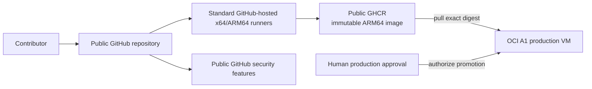

---

## 3. Public repository and bootstrap boundary

The intended canonical repository is public and named `notes-knowledge-workspace`. Before the first public push, a public-safety audit must prove the absence of credentials, committed `.env` files, private Note content, production data, employer/client material, local-machine secrets, database dumps, provider tokens, private infrastructure exports, production uploads/logs, and personal information.

If an interim private repository is used, Actions minutes, artifacts, caches, packages, and security features must remain within the account's currently verified free entitlement. There is no paid upgrade. The private phase must not be assumed to have the public repository's unlimited standard-runner treatment.

This design does not authorize Git initialization. When separately authorized, bootstrap ordering is conceptually:

> public-safety review → Git initialization → repository/build skeleton → first deterministic build/test → GitHub remote → security features/rules → workflows → implementation under protected `main`

### 3.1 Continuous Integration, Delivery, and Deployment

- **Continuous Integration:** every proposed source change receives automated build, behavioral, architectural, and security evidence.
- **Continuous Delivery:** a protected, fully verified commit can reliably produce an immutable deployable artifact ready for deliberate promotion.
- **Automatic Continuous Deployment:** not selected initially. A merge to `main` never automatically replaces production.

Manual production promotion remains legitimate Continuous Delivery because the release artifact is already reproducibly built, tested, scanned, attested, and ready to deploy.

---

## 4. Branch, pull-request, and merge strategy

The repository uses a simple trunk-oriented model:

- `main` is the only permanent development branch;
- work occurs on short-lived feature/fix branches;
- changes enter through pull requests with required checks;
- ordinary changes use squash merge;
- release tags identify releases;
- no permanent `develop`, routine release branches, environment branches, or GitFlow complexity.

### Diagram A — source branch to protected main

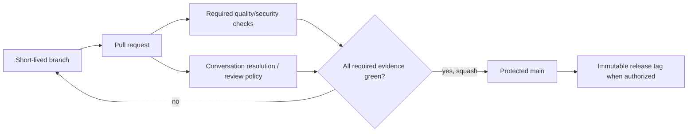

### 4.1 Main protection

Future GitHub rules/rulesets for `main` conceptually require pull requests, named required CI/security conclusions, current-with-target status where appropriate, resolved required conversations, no force pushes, no deletion, and no routine bypass of release-blocking checks.

This is initially a solo-maintainer portfolio project. An impossible ceremonial second-human approval is not required. When trusted collaborators exist, independent approval can be required for sensitive paths. Emergency maintainer bypass, if GitHub permits it, is exceptional, documented, and followed immediately by complete CI/security verification.

### 4.2 Merge and history

Squash merge is preferred for coherent public history, simple reverts, and one conceptual change per PR. Commit-message style is not a release blocker absent a later approved need. History is never rewritten after a release tag.

### 4.3 Documentation-only changes

A safely classified docs-only PR need not run every expensive executable suite. The protected required-check surface still returns a deterministic PASS conclusion rather than leaving jobs skipped/pending. A top-level conclusion job may fan out work by path and then report a stable required result.

Approved Baseline changes are not ordinary docs-only edits. Once implementation exists, CI detects them and requires explicit baseline-amendment acknowledgement without preventing legitimate reviewed amendments.

---

## 5. Application release identity and versioning

Application releases use Semantic Versioning: `v0.x.y` may identify pre-1.0 milestones, `v1.0.0` identifies the first complete Target Flagship release, and later releases advance normally. Application SemVer is unrelated to API path versioning: the backend stays under `/api`, never `/api/v1` merely because a Git tag is `v1.0.0`.

A release originates only from an exact commit reachable from protected `main` with all required evidence green. It never originates from a dirty local tree, arbitrary branch, unreviewed archive, or production host rebuild.

Release metadata records application version, exact Git SHA, build timestamp, Java/Node/npm versions, target architecture, image digest, schema/Flyway compatibility point, repository, workflow identity, SBOM, and attestation references—never secrets.

Release tags are immutable operational records. A correction receives a new version; neither a published tag nor its associated version tag is repointed to different content.

---

## 6. Reproducible toolchain and dependency state

CI consumes the approved technology baseline:

- Java 25-series according to the approved patch policy;
- Maven through a committed Maven Wrapper aligned with the approved Maven baseline;
- Node.js 24.21.0 LTS;
- npm 11.19.0;
- the approved package-lock-driven frontend dependency set;
- `npm ci`, never `npm install`, for reproducible CI installation.

Future source control commits wrapper files, dependency manifests, and `package-lock.json`. CI fails inconsistent manifests/lockfiles, invalid wrapper integrity, or uncommitted generated dependency changes. No job relies on workstation-global Maven, Node modules, IntelliJ output, local `.env`, undeclared repositories, or floating dependency resolution.

A release starts from a fresh checkout and empty job workspace, with declared caches only. Caches may improve speed but cannot affect correctness or authority.

### 6.1 GitHub Action pinning

Every third-party action—including GitHub-owned actions unless a future approved exception exists—is pinned by full commit SHA. Floating `@main`, `@master`, and major tags are forbidden. A human-readable version comment may accompany the SHA, and Dependabot may propose reviewed SHA updates.

Arbitrary installer scripts are not piped into a privileged shell. Downloaded executables require controlled version/integrity provenance.

---

## 7. Workflow permissions and trust boundaries

Default workflow permission is `contents: read` or narrower. The trusted release job's conceptual permission ceiling is exactly `contents: read`, `packages: write`, `id-token: write`, and `attestations: write`. `artifact-metadata: write` is added only if the implementation explicitly selects GitHub's optional linked-artifact/storage-record capability and current official documentation still requires it. Every permission is job-scoped; `write-all` is forbidden.

Pull-request and fork jobs receive none of `packages: write`, `id-token: write`, `attestations: write`, or `artifact-metadata: write` absent a separately reviewed safe future use. They also receive no deployment/cloud credentials or production secrets.

Fork pull requests are untrusted. Secrets and privileged tokens are never exposed. `pull_request_target` must not checkout or execute PR-controlled code, build files, actions, package hooks, or scripts. If ever used for metadata-only automation, it remains entirely separated from untrusted execution.

### Diagram C — fork PR and trusted release trust boundary

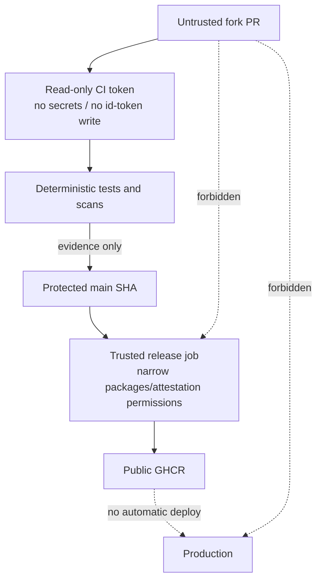

### Diagram K — CI/CD permission boundary

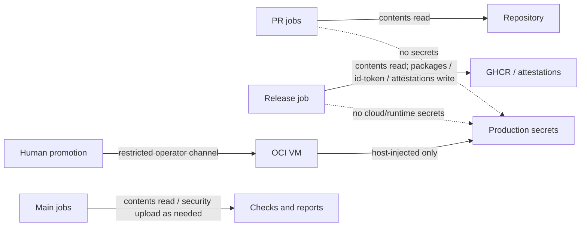

Workflow inputs derived from branch names, PR titles, commit messages, issues, artifact names, and repository-controlled matrices are untrusted. They are never interpolated unsafely into privileged shell commands.

---

## 8. Runner and concurrency strategy

Most CI runs on explicit standard GitHub-hosted `ubuntu-24.04` x64 runners. The production artifact is built and smoke-tested on the standard public `ubuntu-24.04-arm` native ARM64 runner while its availability/free status remains verified. `ubuntu-latest` is avoided where the explicit supported label exists; paid larger runners are prohibited.

If free native ARM64 becomes unavailable, a safe verified zero-cost cross-build/emulation route may be evaluated. No larger runner is purchased automatically; absence of a safe route means STOP AND REVIEW.

The production OCI VM is never a general self-hosted GitHub Actions runner. This avoids untrusted code execution, persistent runner compromise, production-secret exposure, resource contention, and coupling between builds and runtime.

PR concurrency permits cancellation of obsolete runs after a newer commit. Release publication and production promotion are serialized. A production migration/deployment is never cancelled halfway because a newer commit appears.

Every job has a bounded timeout. Testcontainers, browser tests, package installation, provider doubles, container builds, and scanners cannot hang indefinitely.

---

## 9. Testing Strategy orchestration

The eight approved suite meanings remain exact: `FAST`, `DATABASE`, `API`, `SECURITY`, `RETRIEVAL`, `FRONTEND`, `E2E`, and `EVALUATION`. This document does not redefine their contents.

### 9.1 Pull-request evidence

Every source-changing PR eventually proves, as applicable:

1. repository/build sanity: approved Java/Node/npm, wrapper, lockfile, `npm ci`, clean backend compile/package, TypeScript and Vite build, and no unexplained generated changes;
2. `FAST`: backend unit/module tests, Spring Modulith verification, and suitable frontend fast tests;
3. `DATABASE`: PostgreSQL 18 plus approved pgvector through Testcontainers, Flyway, concurrency, FTS/trigram/vector truth;
4. `API`: HTTP integration, RFC 9457, ETags, CSRF, auth stages, and contract behavior;
5. `SECURITY`: zero-tolerance isolation, session/MFA/OIDC adapters, AI-OFF exclusion, citation/provenance, private/public, and moderation restrictions;
6. `FRONTEND`: Vitest/Testing Library, editor concurrency, `ViewerCacheScope`, rendering and browser-security behaviors;
7. `E2E`: relevant journeys from the approved focused twelve-journey Playwright suite;
8. `RETRIEVAL`: a bounded deterministic frozen-corpus regression subset.

No mandatory PR job needs a live provider.

### Diagram B — PR quality-gate fanout and conclusion

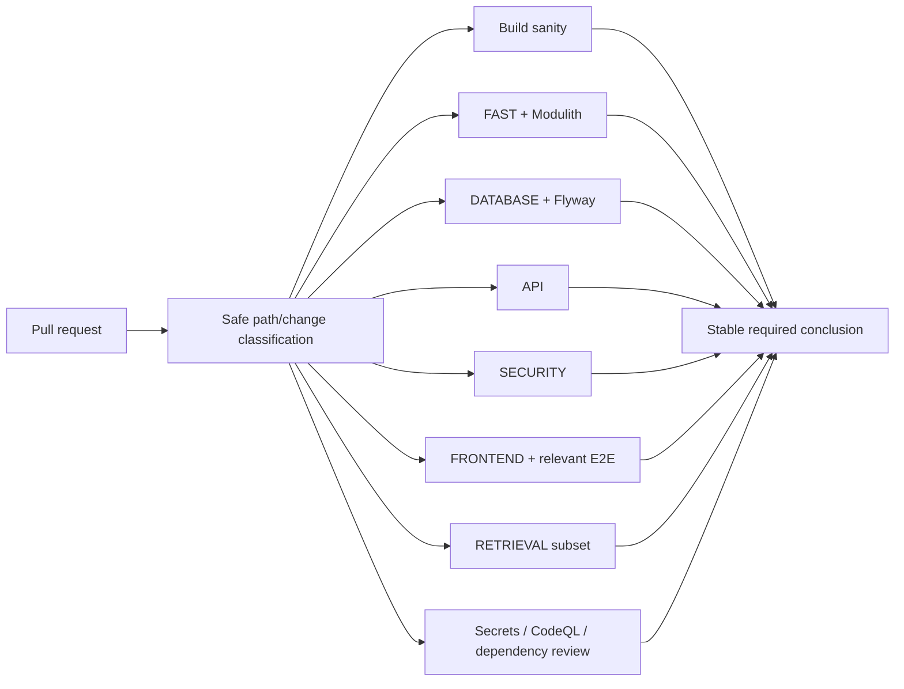

### 9.2 Main and release-candidate evidence

The exact merged `main` commit runs or retains complete required PR evidence plus full deterministic security, relevant database/API/frontend evidence, critical E2E journeys, and deterministic retrieval checks. Main does not deploy production.

PRs use a bounded retrieval regression subset. Main/release candidates run the full frozen-corpus `EVALUATION` suite. Approved retrieval thresholds block release, while security isolation always remains binary zero-tolerance rather than a quality percentage.

### Diagram D — Testing Strategy suites to gate classes

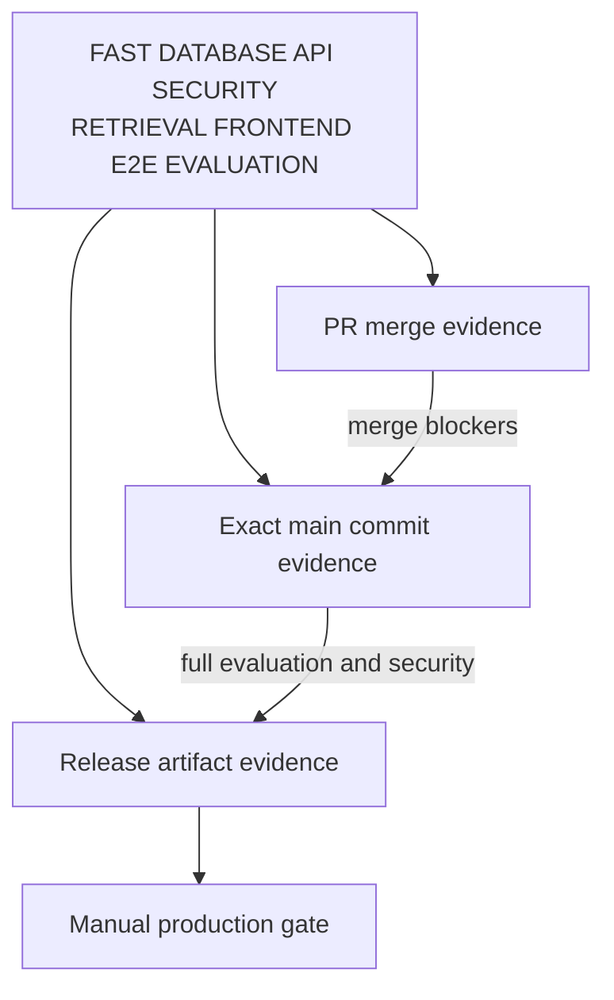

### 9.3 Provider independence

Mandatory CI uses approved deterministic fake/test adapters. It does not require Gemini, Groq, Google OIDC, Brevo, OCI Object Storage, production Redis, the OCI VM, or external services beyond package/build infrastructure. Live synthetic provider qualification belongs to Deployment & Operations smoke procedures, not general CI. Production/provider credentials never enter ordinary test jobs.

### 9.4 Database and Flyway truth

Database/API/security tests use PostgreSQL 18 plus the approved pgvector extension through Testcontainers. SQL, constraints, vector behavior, concurrency, and module ownership are never replaced by mocks. A controlled Redis container may test transient behavior; an S3-compatible test container may be used only within approved technology/deployment boundaries.

When migrations exist, CI proves:

- empty database → Flyway → current schema;
- prior supported released schema → current migrations → current schema;
- valid checksums, unique/ordered versions, required extensions, all 38 approved relations, and no accidental Hibernate/PgVectorStore schema mutation.

Released migrations are not casually edited. Corrective forward migration is normal; database restore is never code rollback.

### Diagram G — Flyway verification and production handoff

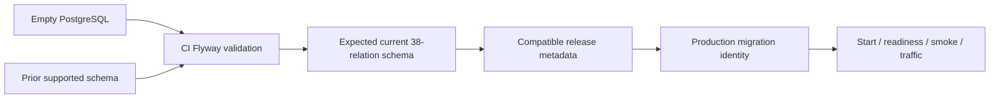

### 9.5 Architectural and contract fitness

Every merge/release preserves exactly seven business modules, an acyclic Modulith graph, module-private repositories, no cross-module JPA/SQL shortcuts, approved provider-API/consumer-SPI direction, and one Spring Boot deployable.

Contract evidence protects all 91 API endpoints, including auth stage, CSRF, strong ETags, volatile endpoints 65/77, private details, and unversioned `/api`. Generated OpenAPI may later be evidence but never authority over the baseline.

Frontend evidence protects 27 routes, same-origin `/api`, no private browser persistence/JWT, `NoteEditorSession`, viewer cache isolation, dirty-editor protection, fragment-token scrubbing, hardened Markdown, and a clean `npm ci` production build whose output enters the Spring Boot artifact. The focused twelve Playwright journeys use synthetic data/providers and isolated database state; failure traces contain only synthetic safe data.

### 9.6 Zero-tolerance gates

The following unconditionally block merge and release:

- any cross-user private leak;
- any AI-OFF source reaching an AI-dependent stage;
- any unauthorized citation/provenance leak;
- any private/public representation bypass;
- any pre-MFA private-data access;
- any release-blocking Threat Model isolation/security failure.

No waiver or percentage threshold can convert these failures into success.

---

## 10. Security and dependency automation

### 10.1 CodeQL

GitHub CodeQL scans supported Java and JavaScript/TypeScript on relevant PRs/pushes, protected `main`, and a bounded schedule. Actionable release-blocking/high-severity findings block release. False positives require documented evidence; findings are not suppressed merely to produce green CI.

### 10.2 Dependency graph, review, and Dependabot

Enable the dependency graph. Dependency review gates PRs that change manifests or lockfiles and blocks known vulnerable introductions at the selected security threshold. Transitive runtime dependencies receive the same risk analysis as direct dependencies.

After bootstrap, Dependabot proposes bounded weekly updates for Maven, npm, GitHub Actions, and container base images once a Dockerfile exists. Its PRs run the same relevant gates. No automatic merge is enabled. Security patches are prioritized; patch/minor updates are reviewed within compatibility policy; major upgrades require deliberate compatibility review and possibly a Technology baseline amendment.

### Diagram H — dependency update flow

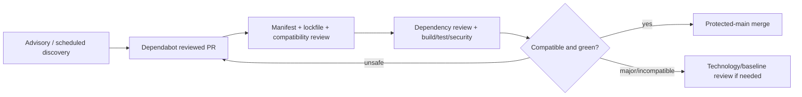

### 10.3 Secret scanning

GitHub public secret scanning is mandatory. Applicable zero-cost push protection is enabled and supplemented by a pinned explicit scanner such as Gitleaks after implementation-time version verification. Any confirmed live secret fails the gate.

False-positive suppression requires evidence, a narrow pattern/value exception, and rationale. Broad directory exclusions and realistic live-looking credentials in fixtures are forbidden; reserved synthetic placeholders are used.

### Diagram I — secret and security scan response

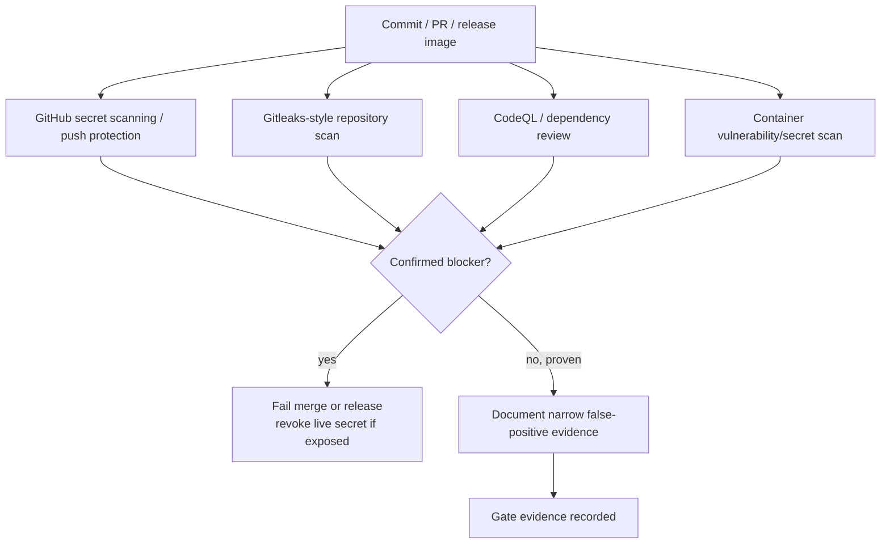

### 10.4 Container scanning and exceptions

The exact ARM64 release image is scanned by a pinned zero-cost tool such as Trivy for OS packages, supported application dependencies, configuration weaknesses, and embedded secrets. High-impact actionable shipped vulnerabilities block release unless a documented, time-bounded exception applies and does not conflict with any Threat Model release blocker or zero-tolerance failure.

A permitted non-blocker exception records finding, artifact/version, rationale, compensating control, owner, review date, expiration, and remediation target. Expired exceptions fail release. Scanner database/network failure is not “no findings”; missing security evidence fails the relevant gate.

### 10.5 Supply-chain controls

Required controls include full-SHA action pinning, least permissions, untrusted-fork isolation, controlled downloads, explicit runner labels, lockfiles, dependency review, immutable release SHA/tag/digest, and bounded logs. GitHub Actions logs never include production/private content, secrets, session/CSRF/OIDC values, provider keys, DB passwords, encryption material, or real user data. Shell tracing is disabled around any secret-bearing operation.

---

## 11. Release artifact and provenance

The release flow is:

> protected exact `main` SHA → required CI green → build one Linux ARM64 production image → production-artifact smoke → scan that exact candidate → generate its SBOM → publish that same image to public GHCR → capture the canonical published `sha256` digest → attest that exact digest → verify attestation/digest/source binding → record release manifest → human production approval → OCI pull by exact digest

The terms are deliberately distinct:

- **Image build** creates the one production ARM64 image.
- **Image publication** pushes that same image to GHCR; publication alone is not release approval.
- **Image digest** is the immutable canonical SHA-256 identity returned and verified for the published image.
- **Attestation** is the signed provenance statement binding that exact digest to the trusted GitHub repository, workflow, and source context.
- **Release** is a digest for which every required artifact, security, provenance, and other release gate has passed.
- **Production promotion** is the human-authorized OCI deployment of that released exact digest.

### Diagram E — ARM64 build, scan, SBOM, GHCR digest, and attestation

```mermaid
flowchart LR
    SHA[Protected green main SHA]
    ARM[Native ubuntu-24.04-arm build]
    Smoke[ARM64 image/startup smoke]
    Scan[Container scan]
    SBOM[SPDX/CycloneDX SBOM]
    GHCR[Publish same image to public GHCR]
    Digest[Capture canonical sha256 digest]
    Attest[Attest that exact digest]
    Verify[Verify digest / source binding]
    Manifest[Record release manifest]
    SHA --> ARM --> Smoke --> Scan --> SBOM --> GHCR --> Digest --> Attest --> Verify --> Manifest
```

### 11.1 Build once and image identity

One Linux ARM64 production image is built from the verified source SHA. The image that passes smoke, scan, and SBOM generation is the same image pushed to GHCR. It is not rebuilt after scanning, after publication, or on the production VM merely to obtain a digest. The canonical published GHCR digest becomes the authoritative deployable identity; only that digest can become the released artifact promoted to production.

Convenience tags include `sha-<commit>` and the immutable release version such as `v1.0.0`. Production identity is `sha256:<digest>`; `latest` is neither required nor used for deployment. Exact base images are implementation-time selections and are pinned by immutable digest where practical.

The ARM64 smoke proves JVM startup, compiled SPA presence, expected internal port, non-root runtime, production-configuration validation, no alternate H2 fallback, no embedded secret, and actual ARM64 architecture. Production never runs an x64-only image through emulation.

### 11.2 GHCR

Publish the already-smoked, scanned, and SBOM-described runtime image as a public GHCR OCI package, then capture and verify the canonical digest returned for that publication. The image contains only application binaries/static assets and no secrets or source-control credentials. The OCI host may pull anonymously while current GHCR behavior permits. Public-package pricing, anonymous pulls, `GITHUB_TOKEN` publication, package retention, and deletion behavior are revalidated before implementation and release. A pushed package is only a published candidate until all release gates pass.

### 11.3 SBOM and attestation

Every candidate image has a standard SPDX- or CycloneDX-compatible SBOM generated using selected zero-cost tooling, preferably existing scanner/build capabilities. The SBOM is reconciled to the same image whose canonical GHCR digest is captured; it contains dependency metadata, never secrets, and does not add a production dependency.

After publication supplies the canonical `sha256` identity, GitHub Artifact Attestations bind that exact subject digest to the repository, workflow, exact commit, and triggering context using GitHub's short-lived OIDC/Sigstore model. No long-lived signing key is created when keyless attestation suffices. The attestation/digest/source binding is verified before the digest is release-eligible or presented for production promotion; creation alone is not proof of safety.

Release eligibility exists only after the scan passed, the matching SBOM exists, the canonical GHCR digest is known, an attestation for that exact digest exists and verifies, and every other release blocker passed. Tagging, pushing, or attesting alone is not release status.

### 11.4 Release manifest

Bounded nonsecret release metadata includes SemVer, Git SHA, image digest, architecture, Java/Node/npm versions, Flyway/schema compatibility point, workflow identity, and SBOM/attestation references. It omits credentials, private hostnames, database URLs with secrets, and private data.

---

## 12. Production promotion trust boundary

GitHub Actions publishes the verified candidate, captures its canonical digest, completes and verifies provenance, and records the eligible release; it does not hold OCI administrator keys, production SSH private keys, production database credentials, Gemini/Google/Brevo/object credentials, or application encryption keys. Initial production promotion is operator-controlled through the approved restricted OCI Bastion/SSH path.

The operator approves the exact digest, logs in through the restricted operational channel, pulls that public GHCR digest, and follows Deployment & Operations. The production host does not run Maven, `npm install`, Vite, or source compilation. A future direct GitHub-to-OCI path requires a separate review proving least-privilege, short-lived, zero-cost credentials.

### Diagram F — immutable digest to manual OCI promotion

```mermaid
sequenceDiagram
    participant R as Trusted release workflow
    participant G as Public GHCR
    participant A as GitHub Attestations
    participant H as Human operator
    participant O as OCI production VM
    R->>G: Publish same scanned/SBOM-backed ARM64 candidate
    G-->>R: Canonical sha256 digest
    R->>A: Attest exact digest and trusted source context
    A-->>R: Verifiable digest/source provenance
    R->>R: Verify attestation; record manifest; mark release eligible
    H->>H: Verify released digest, gates, scan, SBOM, attestation, quotas
    H->>O: Approve through restricted operator path
    O->>G: Pull exact public digest
    G-->>O: Same verified image
    O->>O: Deployment & Operations migration/readiness/smoke
```

### 12.1 Manual production gate

Before promotion, the operator verifies exact release SHA/digest, attestation, SBOM and scan status; Flyway compatibility; current backup/recovery point; OCI free entitlement, disk/memory, Object Storage and outbound budget; Brevo status; Gemini model/quota/data-use posture; Google OIDC hostname readiness; host-injected secrets; and serialized deployment availability. “CI green” alone is insufficient.

There is no permanent paid staging requirement. CI uses ephemeral hosted runners, Testcontainers, deterministic provider doubles, and Playwright. Production runs bounded synthetic/public-safe smoke tests before normal traffic.

### 12.2 Production Flyway

CI validates migrations; only the approved production procedure executes them with the dedicated migration identity. Ordinary PR workflows never connect to production. There is no second migration service.

The sequence remains maintenance when required → controlled Flyway operation → verify → application start → readiness → synthetic smoke → traffic. Deployments are serialized.

### 12.3 Rollback metadata and decision

Each release records previous/current image digests and schema compatibility. Application rollback is permitted only when the previous image safely supports the already-migrated schema. Otherwise, roll forward. Database restore is disaster recovery, never routine application rollback.

### Diagram J — rollback or roll-forward decision

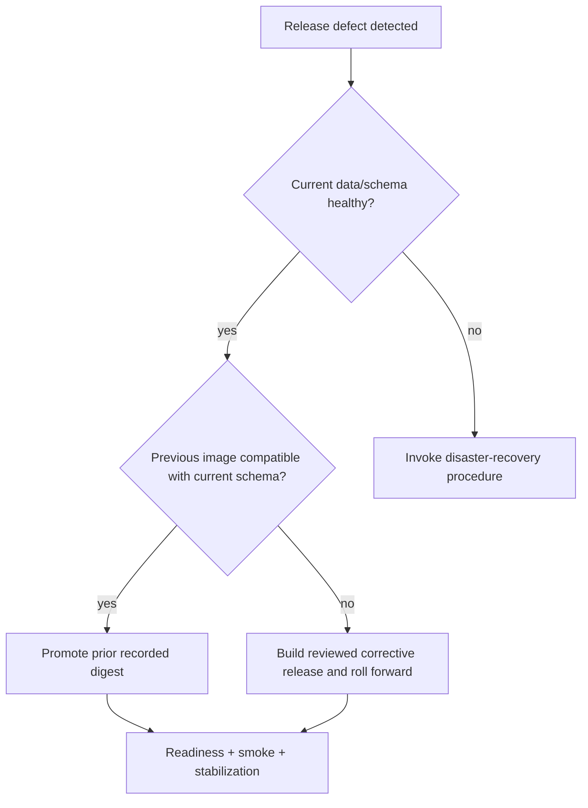

---

## 13. Artifacts, caches, reports, and failure policy

### 13.1 Artifact retention

Release images remain in GHCR according to the release policy; Docker images are not duplicated as normal Actions artifacts. SBOM/provenance and the bounded release manifest remain associated with the release within verified free storage.

CI-only evidence has short diagnostic retention: test summaries, sanitized failure reports, small security outputs, evaluation summaries, and Playwright traces/screenshots on useful failures only. It uses sanitized synthetic evidence only. Do not retain entire Maven repositories, `node_modules`, raw Testcontainers state, giant passing-run videos, or production data. The current GitHub Free planning assumption is 500 MB of included Actions artifact storage as checked on 2026-09-16, subject to revalidation and the mandatory zero-spend hard guard.

### 13.2 Cache policy

Maven dependency and npm download caches—and only measured useful build caches—are keyed by OS/architecture where relevant, lockfiles, wrappers, and tool versions. Caches never contain secrets, `.env`, provider credentials, production data, or authenticated browser state. A missing/suspicious cache is discarded and rebuilt; it may slow a job but never change its result.

Package integrity remains governed by lockfile hashes/integrity, declared trusted registries, reviewed dependencies, and ecosystem checksums/signatures where supported. A cache is not trusted source authority.

### 13.3 Retry and flaky tests

There is no rerun-until-green. A complete workflow may be manually rerun only after evidence of GitHub infrastructure, package-registry, or runner-provisioning failure, distinguishable from a deterministic defect. Playwright retries do not conceal flakes.

A flaky/quarantined test cannot be sole evidence for a blocker. It is made deterministic, assigned an owner/reason if temporarily quarantined, backed by equivalent blocker evidence, and restored promptly. One passing attempt among repeated failures is not acceptance.

### 13.4 Reports and coverage

Reports may show obligation ID, module, endpoint number, synthetic fixture, sanitized expected/actual state, deterministic seed, and safe stack trace. They never dump real/private Notes, credentials, auth cookies, prompts, raw tokens, or encrypted security-email material.

No arbitrary 100% or universal 90% line-coverage threshold defines quality. Coverage may later inform review; risk-based Testing Strategy evidence remains primary, and security isolation is binary.

### 13.5 Formatting, warnings, performance, and size

CI does not silently add Checkstyle, Spotless, PMD, ESLint, Prettier, or Stylelint outside Technology review. Compiler/type/build correctness is enforced. Security/correctness/future-compatibility warnings are triaged; uncontrollable third-party warnings do not automatically fail every build.

CI records build/test duration and frontend/JAR/image size, and may collect stable deterministic timing/query measurements. Unexpected large regressions require explanation. Runtime SLOs remain Observability-owned; no fragile latency threshold or arbitrary tiny artifact limit is invented.

Automated accessibility-critical component/E2E checks run in CI, while manual assistive-technology review remains necessary. CI never claims complete accessibility proof.

---

## 14. Gate classifications

- **Merge blocker:** prevents PR merge, including build/test/architecture/security failure, secret leak, prohibited dependency, or unacknowledged baseline drift.
- **Release blocker:** may allow development merge but prevents a release, including full evaluation, ARM64 artifact, image security, migration compatibility, provenance, or any upstream release blocker.
- **Advisory:** visible evidence that is not automatically blocking until policy promotes it, such as a bounded non-critical maintenance or performance warning.
- **Manual production gate:** human go/no-go for exact digest, current provider/free-tier/backup/configuration/migration readiness.

### 14.1 Required merge blockers

At minimum: clean build, `FAST`, required `DATABASE`, required `API`, `SECURITY`, relevant `FRONTEND`/`E2E`, critical deterministic retrieval regression, Modulith boundaries, secret scan, actionable CodeQL/dependency-review policy, wrapper/lockfile integrity, and approved-baseline change acknowledgement.

### 14.2 Required release blockers

At minimum: every unresolved merge blocker; full `EVALUATION`; every Testing Strategy and Threat Model release blocker; ARM64 build/smoke; actionable image vulnerability without a valid non-blocker exception; migration-from-zero and supported-upgrade migration; schema compatibility; matching SBOM; canonical published digest; verified attestation for that exact digest/source; digest/source ambiguity; and failed security scanner infrastructure. A successful push is not itself a release.

---

## 15. Quality-gate matrix

| Gate | Trigger | Environment | Merge blocker | Release blocker | Live provider | Evidence | Failure policy |
|---|---|---|---:|---:|---:|---|---|
| Build sanity | Source/build changes; main/release | x64 PR/main; ARM64 release | Yes | Yes | No | Versions, wrapper/lock, compile/package/build summary | Fix; no generated/local-state dependence |
| FAST | Relevant PR/main/release | x64 hosted | Yes | Yes | No | JUnit/Vitest/module reports | Deterministic failure blocks |
| DATABASE | DB/persistence paths and required main/release | x64 hosted + PG18/pgvector Testcontainers | Yes when required | Yes | No | Integration report, DB image/version | SQL truth may not be mocked |
| API | API/security/backend changes and main/release | x64 hosted + real DB | Yes when relevant | Yes | No | HTTP contract/Problem Details/ETag/CSRF results | Contract failure blocks |
| SECURITY | Every relevant PR; full on main/release | x64 hosted + deterministic adapters | Yes | Yes | No | Zero-tolerance and threat traces | No waiver for isolation blockers |
| FRONTEND | Frontend/shared contract changes and main/release | x64 hosted | Yes when relevant | Yes | No | Type/build/component reports | Fix; no unsafe persistence/rendering |
| E2E | Relevant PR; critical set main/release | x64 hosted browser + isolated DB | Yes when required | Yes | No | Sanitized Playwright results/failure traces | No hidden retry/flaky acceptance |
| RETRIEVAL | Relevant PR/main/release | x64 hosted deterministic corpus | Yes for critical regression | Yes | No | Task-specific regression summary | Threshold failure blocks as defined |
| EVALUATION | Main/release candidate | x64 hosted frozen corpus | No routine PR full run | Yes | No | Full approved metric report | Release blocked; security remains binary |
| Modulith architecture | Backend/module changes and release | x64 hosted | Yes | Yes | No | Spring Modulith verification | Boundary/DAG/deployable drift blocks |
| Flyway/schema | Migration/persistence changes; release | x64 hosted + PG18 | Yes when changed | Yes | No | From-zero/upgrade/checksum/38-relation evidence | Forward correction; no released-script rewrite |
| Secret scan | Push/PR/main/release | GitHub + pinned scanner | Yes | Yes | No | Native/scanner conclusion | Confirmed secret fails and is revoked if live |
| CodeQL | Relevant PR/main/schedule/release | GitHub code scanning | Yes for configured blockers | Yes | No | Code-scanning alerts/SARIF | Missing/failed scan is not success |
| Dependency review | Manifest/lock/action/base-image PR | GitHub dependency graph/action | Yes for prohibited introduction | Yes | No | Dependency diff and vulnerability result | Update/remove or document allowed non-blocker |
| Container scan | Exact candidate image before publication | Native ARM64 release environment | No ordinary PR | Yes | No | Scanner report reconciled to canonical published digest | Actionable shipped risk blocks |
| ARM64 smoke | Release candidate | `ubuntu-24.04-arm` standard runner | No | Yes | No | Architecture/startup/non-root/static/config checks | STOP AND REVIEW if no free safe route |
| SBOM | Exact candidate image before publication | ARM64 release job/tooling | No | Yes when mechanism available | No | SPDX/CycloneDX artifact/reference reconciled to published digest | Missing required SBOM blocks release |
| Attestation | Published candidate with canonical GHCR digest | Trusted release job | No | Yes when mechanism available | No | Verified OIDC-backed attestation for exact digest/SHA | Missing/invalid provenance blocks; publication alone is not release |
| Production manual gate | Promotion intent | Human + restricted OCI channel | No | Production blocker | Live smoke only after approval | Checklist, exact digest, provider/quota/backup state | Do not promote; no automatic override |

---

## 16. Workflow-class matrix

| Workflow class | Trigger | Trust/permissions | Runner | Suites/security | Secrets | Artifacts | Concurrency | Success condition |
|---|---|---|---|---|---|---|---|---|
| PR CI | Pull request/update | Untrusted/read-only; no `packages`, `id-token`, `attestations`, or `artifact-metadata` write | Standard x64 | Build, relevant FAST/DB/API/SECURITY/FRONTEND/E2E/RETRIEVAL; secret/dependency/CodeQL | None | Short sanitized reports/failure traces | Cancel obsolete run per PR | Stable required conclusion green |
| MAIN CI | Protected-main update | Trusted source; read plus narrow security-report permissions | Standard x64 | Complete deterministic security, relevant DB/API/frontend/E2E/retrieval | No runtime/cloud secrets | Bounded full reports/evaluation evidence | One current main generation; no production action | Exact merged SHA green |
| SECURITY / SCHEDULED MAINTENANCE | Bounded schedule/manual trusted event | Read plus narrow security upload | Standard x64 | Full CodeQL, dependency status, stale review, optional image rescan | None unless a future narrow feature explicitly requires it | Security findings/status | Bounded, cancel stale non-release scan | Scanners current and findings triaged |
| RELEASE | Authorized exact protected-main SHA/tag intent | Trusted; `contents: read`, `packages: write`, `id-token: write`, `attestations: write`; optional `artifact-metadata: write` only for a selected documented linked-artifact record | Standard native ARM64 | Final evaluation, ARM smoke, exact-image scan/SBOM, same-image publication, digest capture, attestation and verification | GitHub publication token only; no OCI/runtime secrets | Canonical public GHCR digest, SBOM, verified attestation, release manifest | Serialized; never cancel after publication begins | Same built image published; exact digest verified and release-eligible |
| PRODUCTION PROMOTION / RUNBOOK HANDOFF | Human chooses released digest | Human/operator; no general Actions deployment token | Restricted OCI operator channel, not Actions runner | Deployment checklist, Flyway/readiness/synthetic smoke | Host-injected production secrets only | Operational release record | Strictly serialized; never overlap migrations | Exact digest healthy and traffic restored |

No conceptual matrix entry creates YAML or grants implementation authority.

---

## 17. Free-tier revalidation register

Every item is rechecked against official GitHub documentation and the actual owner/account/repository settings before bootstrap, workflow implementation, and release. Before Actions/packages are enabled, each applicable metered product is covered by an available hard budget/spending control that blocks further use at the limit. The intended additional paid spend is ₹0/$0. Changed, unavailable, ambiguous, billable, or technically unenforceable zero-spend behavior defaults to **STOP AND REVIEW**. Alert-only budgets and automatic billing are insufficient.

| Capability | Current dated free assumption | Official evidence to recheck | Project dependency | If paid/unavailable |
|---|---|---|---|---|
| Standard public x64 runner | Standard public-repository runners such as `ubuntu-24.04` are free/unlimited | Actions billing and hosted-runner reference; standard vs larger classification | PR/main tests and security | Use another verified standard label or STOP AND REVIEW; never select paid larger runner |
| Standard public ARM64 runner | `ubuntu-24.04-arm` is listed as a standard public ARM64 runner and standard public use is free/unlimited | Hosted-runner reference, label status, architecture, public pricing | Native production image build/smoke | Evaluate safe zero-cost cross-build/emulation or STOP AND REVIEW |
| Billing/spending hard stop | GitHub currently offers product/SKU budgets with **Stop usage when budget limit is reached** for applicable metered products | Owner billing page, budget scope, applicable product/SKU coverage, hard-stop state | Enforces additional paid spend = ₹0/$0 | Do not enable affected usage; STOP AND REVIEW if a zero-spend guard cannot be enforced |
| Actions artifact storage | GitHub Free currently documents 500 MB of included Actions storage; runner minutes being free does not make storage unbounded | Actions billing, included-usage table, retention settings, applicable hard-stop budget | Small short-retention reports and useful synthetic failure traces only; never Docker images, `node_modules`, or Maven-repository archives | Shorten/delete CI evidence or STOP; do not buy storage or intentionally overrun merely because a payment method exists |
| Actions cache storage | Current documentation lists 10 GB included cache storage per repository | Actions billing/cache usage and eviction behavior | Maven/npm download acceleration only | Reduce/disable caches; correctness must remain |
| Public GHCR image | Public GitHub Packages usage is free and Container registry image storage/bandwidth is currently free; Container registry supports anonymous public pulls | GitHub Packages billing, GHCR permissions/pull docs, retention/deletion policy, applicable billing guard | Public ARM64 release image | Select another reviewed zero-cost registry or STOP AND REVIEW |
| GitHub CodeQL | Code scanning/CodeQL available to public GitHub.com repositories | CodeQL availability and terms for public repositories | Java/JavaScript/TypeScript SAST | Use reviewed zero-cost equivalent or STOP; never omit required SAST silently |
| Dependency review | Available to public repositories when dependency graph is enabled | Dependency review availability/action/API | Blocks vulnerable dependency introductions | Use another reviewed zero-cost dependency-diff gate or STOP |
| Secret scanning/push protection | Public secret scanning runs automatically for free; applicable public/user push protection exists but exact repository behavior must be checked | Secret-scanning scope and push-protection availability/limits | Credential-leak prevention | Retain pinned explicit scanner and STOP if required prevention cannot be met |
| Artifact Attestations | Available in public repositories using GitHub/Sigstore public-good infrastructure | Artifact-attestation availability, permissions, OIDC, verification | Provenance tied to SHA/digest | Use reviewed zero-cost provenance alternative or STOP if required gate unavailable |

Private-repository minutes/security/retention are separately revalidated if a temporary private phase exists. Paid usage, storage expansion, or larger runners are never assumed merely because a payment method exists. Cache is optimization-only: the current separately bounded 10 GB assumption is revalidated, and exhaustion, read-only behavior, expiry, or eviction may slow CI but can never change correctness.

---

## 18. Scheduled maintenance, release evidence, and public presentation

Bounded scheduled workflows may run full CodeQL, dependency/security status checks, stale-update review, and a release-image rescan when useful. Generic scheduled CI does not consume live Gemini, mutate production, perform destructive cleanup, or maintain production databases without a separately approved operational reason.

Future public README/release pages may show stable CI/security/release badges only after the workflows exist and are trustworthy. They should explain the architecture, testing/security/privacy boundaries, deployment shape, current release, reproducible local setup, image digest, and verification path without leaking secrets or private infrastructure.

CI never imports production PostgreSQL dumps, attachments, Notes, logs containing content, or sessions. Backup/restore rehearsals involving sensitive production-like material run in controlled operational environments, not public Actions logs.

---

## 19. Manual production-promotion checklist

- [ ] Exact commit is reachable from protected `main` and every required commit-level check is green.
- [ ] Release tag/version is new, immutable, and consistent with the recorded SHA.
- [ ] Owner billing settings and every applicable metered-product budget were checked; available hard-stop controls are enabled and additional paid spend remains ₹0/$0.
- [ ] One native ARM64 production image was built; smoke passed; no post-scan or post-publication rebuild occurred.
- [ ] The exact candidate scan passed; every blocker finding is resolved and any allowed non-blocker exception is unexpired.
- [ ] The SBOM is secret-free and corresponds to that exact candidate.
- [ ] That same image was pushed to public GHCR and its canonical `sha256` digest was captured; no mutable tag such as `latest` is the deployment identity.
- [ ] Artifact attestation for that exact digest verifies repository, workflow, source SHA, and digest before release eligibility.
- [ ] Release manifest records the verified digest and evidence; publication alone was not treated as release.
- [ ] From-zero and supported-upgrade Flyway gates passed; current schema compatibility and rollback metadata are known.
- [ ] Current OCI free entitlement, block/Object Storage/request/outbound quotas, VM disk/memory, backup/recovery point, and operator path are ready.
- [ ] Brevo quota/status, Google OIDC hostname readiness, and Gemini stable model/free-tier/data-use posture were revalidated.
- [ ] Production secrets are host-injected and were not provided to release CI.
- [ ] No other production promotion or migration is running.
- [ ] Operator pulls the exact digest; the VM does not rebuild source.
- [ ] Deployment & Operations readiness and synthetic/public-safe smoke pass before traffic.
- [ ] Stabilization is observed, with a compatible prior digest or roll-forward plan documented.

---

## 20. Practical engineering and interview explainability

An engineer responsible for this design must be able to explain:

- CI integrates every proposed change with automated evidence; Continuous Delivery produces a deployable artifact; Continuous Deployment would promote it automatically and is deliberately not selected.
- Trunk-based development keeps one protected `main` and short-lived branches, reducing merge drift and release-branch ceremony.
- A solo project benefits from PR checks and public evidence, while a mandatory imaginary second reviewer would add ceremony without independent judgment.
- Reproducibility requires a clean checkout, Maven Wrapper, exact JDK/Node/npm policy, lockfiles, and `npm ci`; `npm install` may rewrite resolution.
- Ephemeral hosted runners reduce persistence and cross-job contamination; x64 handles broad CI while native ARM64 proves the actual production artifact.
- Standard public GitHub-hosted runners and public GHCR match the zero-cost target only while current official terms remain valid.
- Tags are convenient names; an image digest identifies immutable bytes, so production deploys by digest.
- Build once/promote the same artifact removes the “rebuilt differently in production” gap.
- An SBOM inventories shipped components; an attestation links artifact digest to repository, workflow, and source SHA. Neither independently proves the software is secure.
- Supply-chain security includes action pinning, least permissions, lockfiles, dependency review, scanners, provenance, immutable identities, and protected release source.
- CodeQL/SAST, dependency review, secret scanning, and container scanning cover different failure classes and remain complementary.
- Untrusted fork PRs receive no secrets or publication authority; `pull_request_target` is dangerous when it executes PR-controlled material with privileged context.
- Full-SHA action pinning protects against mutable upstream tags, with reviewed automation updating pins.
- Merge blockers protect shared source; release blockers protect shipped artifacts; the manual gate protects current production conditions.
- Security isolation is zero-tolerance; coverage percentages and probabilistic retrieval scores cannot excuse a leak.
- Line coverage is not product correctness; risk-traced executable evidence is more meaningful.
- Live AI/email/OIDC/object providers stay outside deterministic CI so quotas, credentials, and network variability cannot corrupt mandatory evidence.
- Testcontainers preserves real PostgreSQL/pgvector/Flyway truth; mocks cannot validate SQL constraints or vector behavior.
- Forward-only Flyway supports controlled evolution; schema-compatible application rollback differs from disaster restore.
- Automatic production deployment on every merge is unnecessary; deliberate digest promotion fits a one-replica portfolio system.
- The production VM is neither a self-hosted Actions runner nor a source-build machine, limiting compromise and resource contention.
- Manual production promotion can still be mature Continuous Delivery because the exact artifact is already verified.
- Later short-lived-credential automation can reduce the manual step without changing application architecture or gate semantics.

---

## 21. Rejected CI/CD patterns

The initial design explicitly rejects:

- paid runners or paid GitHub security tooling as prerequisites;
- automatic payment when CI, artifact, cache, package, or security entitlements change;
- alert-only spending policy where an enforceable applicable hard stop is available;
- automatic production deployment for every `main` commit;
- release/deployment from arbitrary branches, dirty local source, or unverified archives;
- rebuilding the production image manually on OCI;
- `latest` or another mutable tag as production identity;
- mutable/recreated release tags;
- GitFlow, permanent `develop`, and environment branches;
- a GitHub self-hosted runner on the production VM;
- production/runtime/cloud secrets in general CI;
- broad `write-all` permissions;
- unpinned third-party or GitHub-owned actions;
- privileged execution of fork code or `pull_request_target` executing PR-controlled content;
- secrets or private data in Actions logs/artifacts/caches;
- real production data in CI;
- live Gemini, Brevo, Google OIDC, or OCI as mandatory CI;
- mocks replacing PostgreSQL/pgvector truth;
- rerun-until-green, retries hiding flakes, or quarantined tests satisfying blockers;
- arbitrary 100% coverage or universal line-coverage targets;
- dependency auto-merge without gates or arbitrary major auto-upgrades;
- floating `latest` production base images;
- database restore as ordinary code rollback;
- concurrent production promotions/migrations;
- production Flyway from ordinary PR workflows;
- treating scanner database/network failure as a clean scan;
- broad secret-scanner ignore rules;
- permanent paid staging solely for CI;
- runtime SLO invention before the Observability baseline.

---

## 22. Official evidence and revalidation sources

These official GitHub sources were reviewed on 2026-09-16. They are dated checkpoints, not permanent guarantees:

- [GitHub Actions billing](https://docs.github.com/en/billing/concepts/product-billing/github-actions): standard public-repository runner use, paid larger-runner warning, bounded artifact/cache storage, and billing controls.
- [GitHub-hosted runners reference](https://docs.github.com/en/actions/reference/runners/github-hosted-runners): explicit public x64 and ARM64 standard runner labels, architectures, and current free/unlimited public-runner statement.
- [GitHub budgets and spending controls](https://docs.github.com/en/billing/how-tos/set-up-budgets): product/SKU budget configuration and the **Stop usage when budget limit is reached** hard-stop behavior.
- [GitHub Packages billing](https://docs.github.com/en/billing/concepts/product-billing/github-packages): current free public-package treatment and current free Container registry image storage/bandwidth statement.
- [GitHub Packages permissions](https://docs.github.com/en/packages/learn-github-packages/about-permissions-for-github-packages): anonymous access to public Container registry packages.
- [Working with the Container registry](https://docs.github.com/en/packages/working-with-a-github-packages-registry/working-with-the-container-registry): OCI image support, public anonymous pulls, `GITHUB_TOKEN` publication, and pull-by-digest behavior.
- [CodeQL code scanning](https://docs.github.com/en/code-security/concepts/code-scanning/codeql/codeql-code-scanning): current availability for public repositories and supported analysis workflow.
- [Dependency review](https://docs.github.com/en/code-security/concepts/supply-chain-security/dependency-review): public-repository availability and PR enforcement behavior.
- [Secret scanning](https://docs.github.com/en/code-security/concepts/secret-security/secret-scanning): automatic free public-repository scanning.
- [Push protection](https://docs.github.com/en/code-security/concepts/secret-security/push-protection): public/user push-protection behavior and repository-level availability caveats.
- [Artifact attestations](https://docs.github.com/en/actions/concepts/security/artifact-attestations): provenance contents, public Sigstore service, SBOM support, and verification requirement.
- [Using artifact attestations](https://docs.github.com/en/actions/how-tos/secure-your-work/use-artifact-attestations): container-image SHA-256 `subject-digest`, required narrow permissions, and verification.
- [Publishing Docker images](https://docs.github.com/en/actions/tutorials/publish-packages/publish-docker-images): build/push digest output used by the following attestation step.
- [Linked artifact records](https://docs.github.com/en/code-security/how-tos/secure-your-supply-chain/establish-provenance-and-integrity/upload-linked-artifacts): optional `artifact-metadata: write` permission only for linked storage/deployment metadata capabilities.
- [GitHub supply-chain security](https://docs.github.com/en/code-security/concepts/supply-chain-security/supply-chain-security): dependency graph, Dependabot, immutable releases, SBOM export, and public attestation availability.

Before implementation, actual repository visibility, owner plan, billing/budget hard-stop coverage, runner labels, storage consumption, package visibility, security-feature availability, and action permissions determine go/no-go. Blogs and remembered entitlements are not authority.

---

## 23. No implementation authorization

This document does not authorize Git initialization, GitHub repository/remote creation, Actions YAML, Dependabot configuration, Dockerfile/Compose, Maven/Node changes, application configuration, CI scripts, source/tests/fixtures, migrations, OpenAPI, cloud resources, GHCR publication, release tags, production deployment, Observability, Implementation Roadmap, or `AGENTS.md`.

Git remains uninitialized. No workflow or other downstream artifact is created by this task.

---

## 24. Self-review and next step

The document is an **Approved Baseline**, dated **2026-09-16** and approved **2026-09-16**. It selects GitHub/GitHub Actions/public GHCR; one protected `main`; short-lived PRs and squash merge; standard public x64 plus native ARM64 runners; full-SHA action pins; narrowly enumerated release permissions; fork isolation; deterministic provider-free CI; real PostgreSQL/pgvector; complete approved suite orchestration; CodeQL/dependency/secret/container controls; and SemVer without API path versioning. It expressly requires one ARM64 image built once, smoked/scanned/SBOM-described before same-image GHCR publication, canonical digest capture, attestation and verification for that exact digest, release-manifest recording, and only then human-authorized OCI promotion. It also requires enforceable GitHub billing hard stops for applicable metered use so additional paid spend remains ₹0/$0, otherwise **STOP AND REVIEW**.

All prior fourteen Approved Baselines and the handoff remain authority. All 50 Domain invariants, all 55 Threat Model rows/release blockers, 38 relations, 91 endpoints, 27 routes, the approved Testing Strategy, and Deployment & Operations remain unchanged and binding.

The next authorized design document is **Observability**, only when explicitly authorized. Approval of this design does not authorize implementation.
