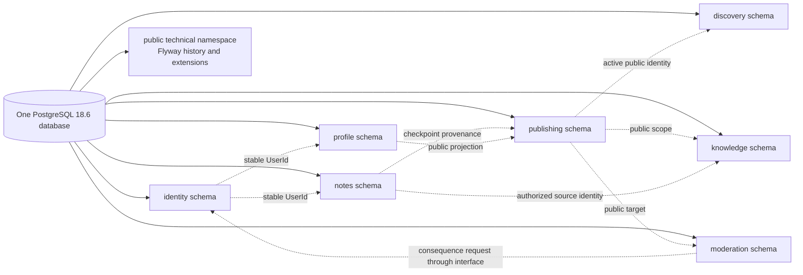
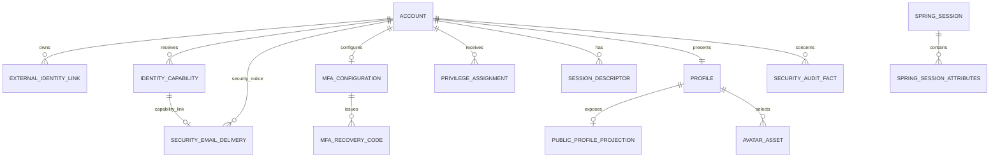
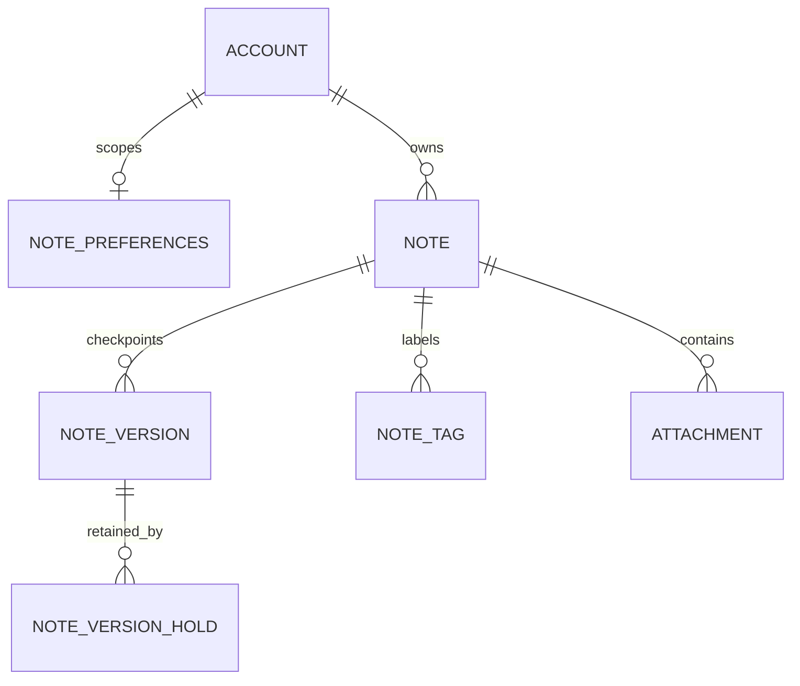
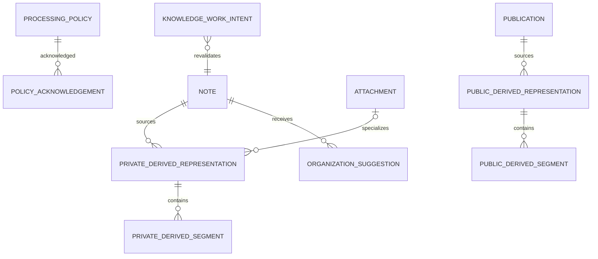
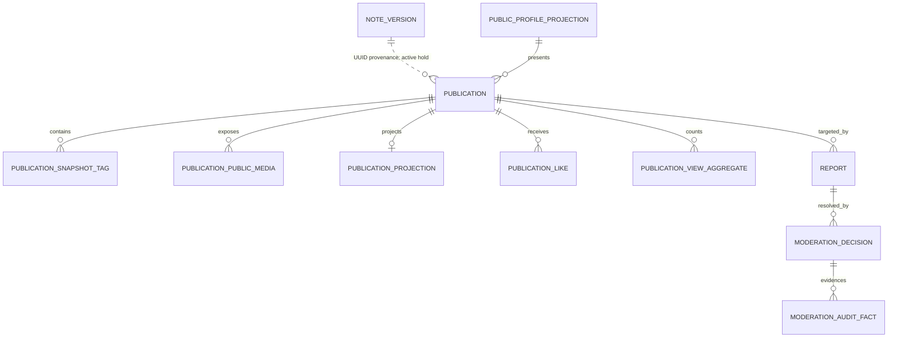

# Notes & Knowledge Workspace

# Schema & Migration Design

Status: Approved Baseline  
Date: 2026-09-11  
Baseline approval date: 2026-09-12  
Baseline amendment review date: 2026-09-13  
Baseline amendment approval date: 2026-09-14

## 1. Purpose, authority, and boundaries

This document defines the relational persistence and migration design for the approved Notes & Knowledge Workspace domain. It implements, and does not redefine, the seven Approved Baselines: Product Vision and Target Flagship Requirements, ADR-001, High-Level Architecture, Technology Stack and Compatibility, Security Architecture, Threat Model, and Domain Model. `PROJECT_CONTEXT_HANDOFF.md` supplies durable project context.

The database baseline is PostgreSQL 18.6, pgvector 0.8.6 where later retrieval design requires it, Flyway 12.4.0 as inherited through the approved Spring Boot baseline, and exactly one physical PostgreSQL database. PostgreSQL is authoritative for application data, Spring Session state, and durable work. Redis remains optional, transient, and non-authoritative.

This document chooses relational namespaces, identifiers, constraints, ownership references, lifecycle representation, durable-work foundations, and migration rules. It does not define Java/JPA mappings, repositories, APIs, DTOs, query/ranking algorithms, vector dimensions or metrics, provider routing, frontend state, deployment vendors, or implementation. Domain aggregates do not map one-to-one to tables, normalized value-object rows do not acquire domain identity, and technical rows do not create new product concepts.

No conflict was found among the approved inputs. This document creates no eighth module, service, worker, broker, database, or product feature and does not authorize implementation.

The approved Schema & Migration Design now incorporates the finalized narrow durable Identity security-email amendment described below. The historical original baseline approval remains recorded above; amendment approval does not itself authorize a migration or application change.

## 2. Decisions at a glance

| Concern | Decision |
|---|---|
| Physical topology | One PostgreSQL database. |
| Application namespaces | One PostgreSQL schema for each approved module: `identity`, `profile`, `notes`, `publishing`, `discovery`, `knowledge`, and `moderation`. |
| Technical metadata | Flyway history and extension objects may occupy the technical `public` namespace; this is not a domain module. |
| Module access | Tables are owned conceptually by their module. Application integration uses module interfaces, never cross-module repositories or arbitrary SQL joins. |
| Cross-module integrity | Selective foreign keys only for stable identity, public targets/projections, and relationships whose lifetime matches the referenced row; `RESTRICT`/`NO ACTION`, no cross-module cascades. Publication checkpoint provenance is deliberately identifier-plus-hold based rather than a permanent FK. Polymorphic or extraction-sensitive references use constrained identifiers plus transactional owner-module validation and reconciliation. |
| Domain identifiers | PostgreSQL `uuid`, generated as UUIDv7 using PostgreSQL 18's built-in `uuidv7()` unless the later implementation must supply an already-created UUID. No UUID extension. |
| Relationship/technical keys | Natural composite keys where they express the invariant; `bigint generated ... as identity` only for non-domain technical row identity where useful. |
| State codes | Lowercase `text` plus named `CHECK` constraints. PostgreSQL ENUMs and ceremonial lookup tables are not selected. |
| Time | `timestamptz` for absolute events; UTC at boundaries. Dates/buckets use `date` only when calendar bucketing is the meaning. |
| Note concurrency | Monotonic `bigint revision`, compared and incremented atomically; `updated_at` is not the concurrency token. |
| Logical denial | Authoritative lifecycle/state or eligibility generation changes first; physical deletion and derived cleanup may lag. |
| Security-email durability | Identity owns one narrow durable delivery relation with exactly two constrained kinds: capability links and approved security notices. Capability validity remains in `identity.identity_capability`; retryable delivery state is not authorization, an email history, notification platform, or generic queue. |
| Private/public search safety | Separate private and public derived relations; scope columns also exist on candidate-bearing child rows and must constrain candidate production. Exact private-vector index/filter execution remains to be proven in Document #9. |
| Vector layout | Lineage and evolution contract selected; dimension, metric, operator class, index, and physical vector relation deferred to Search/AI/Retrieval Design. |
| Migration authority | One global, forward-only Flyway history. Applied migrations are immutable. Production Hibernate/JPA schema mutation is prohibited. |
| RLS | Deliberately not selected initially. Application authorization, owner-scoped queries, structural constraints, and isolation tests remain mandatory. |

The rejected namespace alternative was one application schema with module-prefixed table names. That is workable and slightly simpler for default JPA settings, but separate module schemas make ownership, migration review, accidental coupling, privilege inspection, and future extraction materially clearer. Schema qualification is a modest and acceptable implementation cost. PostgreSQL schemas organize ownership but are not user-authorization boundaries.

## 3. Module and namespace ownership

Every schema has one owning module except the technical namespace. A foreign key documents integrity; it does not authorize repository traversal, direct mutation, or a user. Shared local ACID transactions may coordinate supported module interfaces while each module writes only its own tables.

## 4. Common relational conventions

### 4.1 Names and identifiers

Physical names are lowercase `snake_case`, always schema-qualified in migrations. Domain-root IDs are `uuid` with `uuidv7()` defaults. UUIDv7 gives time-ordered locality without adding `uuid-ossp`, `pgcrypto`, or a third-party UUID library. UUID unpredictability is never treated as authorization. Internal `user_id`, `note_id`, `attachment_id`, and private provenance stay out of public contracts unless a later API decision explicitly exposes them. `publication_id` is the stable public domain identity, although its exact URL/locator form remains API Design.

Composite keys are preferred for pure relationships such as a Like and a Note/tag value. A generated technical key may make normalized child rows easier to address, but it does not create a domain Entity. Primary identifiers are immutable; foreign keys use `ON UPDATE RESTRICT`.

### 4.2 State, nullability, and time

Evolving lifecycle values use `text` with named `CHECK` constraints. Adding a value requires a reviewed migration, without PostgreSQL ENUM's more rigid evolution. Lookup tables are reserved for real managed reference data; none is needed merely to hold code strings. Booleans represent only orthogonal binary facts such as `ai_enabled` and `pinned`, not multi-step lifecycles.

The initial constrained code sets are deliberately small: Account `pending_verification|active|suspended|deletion_requested|logically_deleted`; MFA `enrollment_pending|active` with no row meaning disabled; Identity security-email delivery `queued|claimed|retry_wait|submitted|failed|obsolete`; Note `active|archived|trashed|logically_deleted`; Attachment storage `pending|stored|failed`, validation `pending|accepted|quarantined|rejected`, and cleanup `retained|pending|deleted`; Derived Representation `pending|current|obsolete|failed`; Knowledge work `queued|claimed|retry_wait|succeeded|failed|cancelled|obsolete`; suggestion `pending|accepted|rejected|obsolete`; Publication `active|unpublished|removed`; Report `open|under_review|dismissed|actioned|closed`; and public projections `active|inactive`. These are storage codes for approved lifecycle meanings, not new product states. Any extension is a reviewed forward migration plus application compatibility change.

Required domain facts are `NOT NULL`. Nullable values represent a real absence, such as no password on an OIDC-only account, no consumed time for an unused capability, or no attachment source for a Note-level representation. Absolute times use `timestamptz`: creation, update, verification, expiry, consumption, publication, unpublication, claim, lease, retry, completion, and logical deletion. Timestamps support audit and policy but do not substitute for revisions, generations, or locks.

Common mutable rows use `created_at` and `updated_at` where useful. Immutable facts use `created_at`/`occurred_at` only. Exact user-facing length limits remain downstream; authored fields use `text`. Bounded code fields also use `text` with syntax/allowlist checks rather than arbitrary `varchar` folklore. Authoritative Markdown remains plain text, never trusted rendered HTML.

`jsonb` is not a substitute for understood relations. It is allowed only for genuinely flexible, bounded, versioned, non-secret metadata—for example a small allowlisted provider-independent technical descriptor—when ordinary columns would be unstable or misleading. It must not contain Note bodies, prompts/responses, credentials, session/token material, arbitrary report evidence, or relational state that needs keys/checks. Every JSON payload has an application-owned shape, size bound, and migration/compatibility rule.

### 4.3 Foreign keys and deletion

Within a module, foreign keys are mandatory where the relationship is relationally representable. `ON DELETE CASCADE` is permitted only for current aggregate/value rows whose deletion cannot bypass history, audit, publication, Knowledge invalidation, or security evidence—for example current snapshot tag children after the Publication has already become ineligible. Security facts, retained versions, moderation decisions, and cross-module references use `RESTRICT`/`NO ACTION` or explicit cleanup.

Selective cross-module FKs are allowed for immutable UserId, Public Profile Projection, public targets, and stable public-scope references whose retention semantics match. They provide integrity but are never an application integration API. No cross-module FK cascades. `publishing.publication.source_note_id` and `source_note_version_id` are stable provenance values validated through the Notes interface, not permanent foreign keys: active retention is governed by the Notes-owned hold described below. Polymorphic source and work references are likewise constrained by shape, validated through owner-module interfaces in the coordinating transaction, and reconciled because one permanent FK cannot safely express their lifecycle.

## 5. Identity and Profile relational overview

The two ER edges are conditional alternatives inside one relation, not simultaneous ownership of every row: `delivery_kind` and its named shape check require either the capability-link FK shape or the subject-Account security-notice shape and reject hybrids. `security_event_id` is deliberately not an ER entity or audit FK.

### 5.1 Identity table catalog

| Table | Purpose and primary key | Major columns and references | Constraints, indexes, lifecycle, and traces |
|---|---|---|---|
| `identity.account` | Account aggregate; PK `user_id uuid` | `canonical_email text`, `display_email text`, `email_verified_at timestamptz`, nullable `password_verifier text`, `account_state text`, security timestamps | Unique canonical email; state `CHECK`; verifier must be self-describing Argon2id when present; UserId immutable; indexes on canonical email and eligible state. DM-INV-001..006, 011. |
| `identity.external_identity_link` | Account child Entity; PK `external_identity_link_id uuid` | `user_id`, `issuer text`, `subject text`, safe provider metadata, link/revoke times | FK to Account `RESTRICT`; unique `(issuer, subject)`; no email identity key; active links indexed by UserId. DM-INV-003, 009. |
| `identity.identity_capability` | Verification, email-change, or password-reset capability; PK `capability_id uuid` | nullable `user_id`, pending/candidate canonical email as needed, `purpose`, `verifier_digest bytea`, issued/expiry/consumed/superseded/revoked times | Purpose `CHECK`; no raw token; partial uniqueness permits one unsuperseded capability per subject/purpose where policy chooses; atomic conditional consumption ensures at most one success. DM-INV-007, 009. |
| `identity.security_email_delivery` | Identity-owned durable retry state for exactly two security-email work classes, `capability_link` and `security_notice`; PK `security_email_delivery_id uuid`. Persistence-only technical work, not a Domain Entity, notification feature, or generic outbox. | `delivery_kind`; nullable `capability_id`, `subject_user_id`, `security_event_id`, and `notice_kind`; state/attempt/schedule; lease owner/token/expiry; safe failure code; kind- and state-dependent sealed token or historical-recipient envelopes; lifecycle times | Named kind/state/row/envelope checks reject hybrid shapes; restrictive capability and subject FKs; partial capability and event/notice uniqueness; separate ready-work and expired-lease indexes; no raw token, plaintext recipient, rendered message, arbitrary payload, provider response, or provider secret. Every attempt revalidates the applicable current Identity state. DM-INV-005, 007, 009, 036, 050. |
| `identity.mfa_configuration` | TOTP enrollment/current state keyed by Account; PK/FK `user_id` | `state`, encrypted seed ciphertext/nonce/tag representation, `key_version`, `last_accepted_timestep bigint`, enrollment/activation timestamps | One row per Account; seed fields required only for pending/active states by `CHECK`; no plaintext; atomic timestep advancement prevents replay. DM-INV-006, 007, 009. |
| `identity.mfa_recovery_code` | Persistence-only one-time verifier row; PK `recovery_code_id uuid` | `user_id`, `set_generation bigint`, `verifier_digest bytea`, issued/consumed/revoked times | FK to MFA configuration; unique digest within a set; atomic conditional consume; regeneration advances set and revokes old rows. DM-INV-007, 009. |
| `identity.privilege_assignment` | Narrow capability assignment Entity; PK `privilege_assignment_id uuid` | assigned `user_id`, `capability_code`, bounded `scope_kind`/optional `scope_id`, assigner provenance, granted/revoked times | User/assigner FKs `RESTRICT`; no `is_super_admin`; active-assignment indexes; code/scope allowlist implemented by reviewed checks/application policy and cannot include private-note browsing. DM-INV-010, 048..050. |
| `identity.security_audit_fact` | Append-oriented Identity evidence; PK `audit_fact_id uuid` | actor/target IDs where safe, `event_category`, `outcome_code`, `reason_code`, `correlation_id`, `occurred_at`, bounded safe metadata | Runtime gets INSERT and restricted SELECT, no UPDATE/DELETE; no secrets, sessions, tokens, Note bodies, prompts, or responses. Indexed by occurred time and safe actor/target references. DM-INV-009, 049. |
| `identity.application_session_descriptor` | Product-visible safe session projection; PK `session_primary_id text` matching framework primary key | `user_id`, safe device/display metadata, created/last-seen/expiry/revoked times | Does not store or expose the browser session token; UserId/time indexes support one/other/all revocation views. Exact coupling to framework rows is verified against the approved Spring Session version. DM-INV-004, 008. |
| `identity.spring_session` | Framework-owned authoritative session table; framework PK | Exact Spring Session JDBC columns only | Created by reviewed Flyway migration copied/adapted from the exact approved framework DDL; principal and expiry indexes retained; runtime auto-DDL disabled. Not a Domain Entity. DM-INV-004, 008. |
| `identity.spring_session_attributes` | Framework-owned session attributes; framework composite PK | Exact Spring Session JDBC columns only | FK/cascade behavior must match the exact framework schema; no hand-invented columns. Not a Domain Entity. DM-INV-004, 008. |

Canonical email is produced by a deliberately narrow application normalization rule and persisted for deterministic equality. The original/display form may be retained separately. The design does not claim complete international-provider canonicalization and does not use `citext`. Email change keeps the old canonical email authoritative until the new address is verified and committed.

#### 5.1.1 Durable security-email delivery amendment

`identity.identity_capability` remains the authority for purpose, subject/candidate association, one-way `verifier_digest`, issuance, expiry, consumption, supersession, and revocation. It is not a background-work table. `identity.security_email_delivery` is the single approved additional relation, relation 38, and supports exactly two narrow `delivery_kind` values: `capability_link` and `security_notice`. It is persistence-only Identity technical work—not a second capability, product-visible resource, generic outbox, notification queue, email history, provider-message ledger, new module, or Domain Entity.

The conceptual columns are:

- `security_email_delivery_id uuid PRIMARY KEY`, generated under the PostgreSQL UUIDv7 policy;
- `delivery_kind text NOT NULL`;
- nullable `capability_id uuid`, `subject_user_id uuid`, `security_event_id uuid`, and `notice_kind text`;
- `state text NOT NULL` and `attempt_count integer NOT NULL DEFAULT 0`;
- state-dependent nullable `next_attempt_at timestamptz`, `lease_owner text`, `lease_token uuid`, and `lease_until timestamptz`;
- nullable `last_attempt_at timestamptz` and bounded safe `last_failure_code text`;
- nullable token fields `sealed_token_ciphertext bytea`, `sealed_token_nonce bytea`, `sealed_token_tag bytea`, and `token_key_version text`;
- nullable recipient fields `sealed_recipient_ciphertext bytea`, `sealed_recipient_nonce bytea`, `sealed_recipient_tag bytea`, and `recipient_key_version text`; and
- `created_at timestamptz NOT NULL`, `updated_at timestamptz NOT NULL`, plus nullable `submitted_at timestamptz` and `terminal_at timestamptz`.

The named `ck_security_email_delivery_kind` check admits exactly `capability_link|security_notice`, and `ck_security_email_delivery_kind_shape` rejects every hybrid. `capability_link` is limited to already-approved registration/email-verification links, verification resend through a newly/currently issued capability, password reset, and new-address verification for email change. For such a row, `capability_id` is required while `subject_user_id`, `security_event_id`, and `notice_kind` are null. The capability FK is restrictive `RESTRICT`/`NO ACTION`; a partial unique constraint/index on `capability_id WHERE delivery_kind = 'capability_link'` preserves zero-or-one delivery per capability. Current recipients are resolved through the capability and its purpose-appropriate Account or candidate state rather than copied into the work row.

For `security_notice`, `capability_id` is null and `subject_user_id`, `security_event_id`, and `notice_kind` are required. `subject_user_id` has a restrictive `RESTRICT`/`NO ACTION` FK to `identity.account(user_id)` and identifies the Account whose already-committed security event caused the notice; it is not recipient authority. The initial named notice-kind allowlist is exactly:

- `password_reset_completed`;
- `email_change_old_address`;
- `email_change_new_address`;
- `mfa_disabled`;
- `mfa_reset`;
- `google_oidc_linked`; and
- `google_oidc_unlinked`.

The named `ck_security_email_delivery_notice_kind` check enforces that closed list. Adding a notice kind requires a reviewed migration and already-approved security behavior or an explicit baseline amendment; newsletters, digests, AI notices, moderation broadcasts, arbitrary product notices, and custom template names are excluded. A partial unique constraint/index on `(security_event_id, notice_kind) WHERE delivery_kind = 'security_notice'` prevents duplicate durable intent for one notice class. `security_event_id` is an operation-generated technical UUID correlation/deduplication value, with UUIDv7 direction. It creates no table, lifecycle, Domain Entity, API resource, or authorization meaning; possession grants nothing. The same value may be copied into safe audit evidence for correlation, but there is no FK from delivery to audit.

The six delivery states remain:

| State | Meaning |
|---|---|
| `queued` | Durable eligible work is ready at `next_attempt_at` but unclaimed. |
| `claimed` | One bounded worker lease owns the current attempt. |
| `retry_wait` | A retryable attempt failed and awaits `next_attempt_at`. |
| `submitted` | The provider explicitly accepted at least one submission; inbox delivery is not claimed. |
| `failed` | A non-retryable or bounded terminal failure occurred. |
| `obsolete` | Current security policy/state no longer permits dispatch. |

Named state, attempt, schedule, lease, submission, and terminal-shape checks require `attempt_count >= 0`; admit only the six states; require `queued|retry_wait` to have `next_attempt_at` and no lease fields; require `claimed` to have no `next_attempt_at` and complete `lease_owner`, `lease_token`, and `lease_until`; and require `submitted|failed|obsolete` to have neither scheduling nor lease fields and to have `terminal_at`. Nonterminal states require null `terminal_at`. Only `submitted` may have nonnull `submitted_at`; every other state requires it null. These structural checks do not compare timestamps with the wall clock.

The named `ck_security_email_delivery_token_envelope_shape` check is exact. Active `capability_link` rows (`queued|claimed|retry_wait`) require the complete token ciphertext/nonce/tag/key-version envelope; terminal capability-link rows require all token fields null. Every `security_notice` row requires every token field null in every state. The authoritative verifier remains one-way in `identity.identity_capability`; the temporary active capability-link envelope exists only because a crash-safe retry must recreate the outbound link. Keys remain outside PostgreSQL. Raw token plaintext may exist only during bounded generation/sealing and worker message construction, and is never persisted or logged.

The named `ck_security_email_delivery_recipient_envelope_shape` check is equally narrow. For `delivery_kind = 'security_notice'` with `notice_kind IN ('email_change_old_address','email_change_new_address')`, active rows (`queued|claimed|retry_wait`) require the complete recipient ciphertext/nonce/tag/key-version envelope and terminal rows (`submitted|failed|obsolete`) require every recipient field null. Every other delivery/notice kind requires all recipient-envelope fields null in every state. Each protected value is authenticated-encrypted, externally keyed, key-versioned, bound to its exact `security_event_id` and notice purpose, worker-only, never returned by an API, logged, copied into audit, emitted to telemetry, or reused by another message class, and terminally cleared. No plaintext email, generic recipient list, or redundant recipient digest is stored. Both sides of a confirmed email change are event-bound: the old address is historical at commit, while the new address may become historical before asynchronous delivery if a later email change occurs. All capability-link recipients and the non-email-change notices `password_reset_completed`, `mfa_disabled`, `mfa_reset`, `google_oidc_linked`, and `google_oidc_unlinked` continue to resolve their purpose-appropriate current destination from authoritative Identity state immediately before dispatch.

Terminal transitions to `submitted`, `failed`, or `obsolete` clear every token and recipient envelope field plus every lease field in the same short transaction. Terminal rows retain only bounded non-secret operational metadata. Logical clearing does not promise immediate erasure from WAL, backups, or old pages, and does not protect against simultaneous compromise of PostgreSQL and the external key source.

Ready work and expired claims use separate access paths. A partial B-tree index on `(next_attempt_at, created_at, security_email_delivery_id)` for `state IN ('queued','retry_wait')` supports bounded ready claims. A separate partial B-tree index on `(lease_until, created_at, security_email_delivery_id)` for `state = 'claimed'` supports expired-lease reclaim. Claimed rows deliberately have no `next_attempt_at`; no single mixed `(state,next_attempt_at,lease_until,...)` index is treated as satisfying both paths. Supporting indexes also cover the partial capability uniqueness, partial event/notice uniqueness, and bounded subject/state operational access; encrypted envelopes are not indexed.

Claiming uses one bounded `FOR UPDATE SKIP LOCKED` operation. A successful claim or reclaim sets `state='claimed'`, advances `attempt_count`, sets `lease_owner`, generates a fresh unpredictable `lease_token`, sets `lease_until`, clears `next_attempt_at`, and commits before provider I/O. Heartbeat/extension, success, retry, failure, and obsolescence updates are conditional on `security_email_delivery_id`, `state='claimed'`, and the matching current `lease_token`. Lease expiry alone is insufficient: fencing prevents a stale worker from finalizing or extending work after a newer claimant has reclaimed it.

For an eligible capability-link issuance, one short Identity transaction establishes the new current capability, supersedes/revokes the older applicable capability, marks active older delivery work obsolete and clears all envelopes, inserts the new queued capability-link delivery, and writes required safe audit evidence. Capability, supersession, old-work obsolescence, new queued work, and audit commit together or not at all. Raw token generation, verifier derivation, and sealing are bounded; provider I/O is absent. Unknown/ineligible anonymous recovery targets need no fake row while the same blind enumeration-resistant `202` is returned.

Security notices are created in the same short Identity transaction as the already-approved authoritative security mutation and its audit evidence. Password-reset completion consumes the capability, replaces the verifier, revokes sessions as required, records audit, and inserts `password_reset_completed`. For a confirmed email change from old address A to verified new address B, that transaction commits the authoritative A→B Account transition, required session/security consequences, audit evidence, one `security_event_id`, a queued `email_change_old_address` notice with protected event-bound recipient A, and a queued `email_change_new_address` notice with protected event-bound recipient B. The two rows share the event ID but retry independently, and neither recipient is stored in plaintext. MFA disable/reset and Google OIDC link/unlink similarly commit their authoritative state, required session/security consequences, audit evidence, and matching queued notice together. One event may create one or multiple notice rows. No provider call occurs in these transactions, and a later delivery failure does not roll back an already-committed security event.

Immediately before dispatch, a capability-link worker re-resolves the capability, expected purpose, unconsumed/unrevoked/unsuperseded/unexpired status, Account/candidate state, and destination. A security-notice worker separately revalidates the subject Account and current security policy, verifies that the work row remains current/nonterminal and the notice remains an approved consequence, and applies any explicit policy that makes it obsolete; it does not require a capability. After those checks, `email_change_old_address` decrypts and uses its event-bound protected old address and `email_change_new_address` decrypts and uses its event-bound protected new address. Neither is replaced with the Account's later current email. Other approved security notices resolve the current purpose-appropriate Account security-email destination at dispatch. A committed notice records a historical event and grants no authority; unrelated later Account changes do not automatically negate it, although Account deletion or another explicit security rule may make pending work obsolete.

Provider I/O always occurs outside database transactions. The worker decrypts only the minimum envelope allowed for the delivery kind, constructs an allowlisted purpose-specific message/link, invokes the provider under bounded controls, and then conditionally records the outcome with its lease token. No rendered subject/body/HTML/template, arbitrary application data/JSON, provider credential, provider response body, password, TOTP seed, recovery code, session/CSRF value, or unrestricted payload is persisted.

Provider acceptance and application acknowledgement cannot be atomic, so exactly-once mailbox delivery is not claimed for either kind. Ambiguous acceptance may yield a duplicate. Capability-link duplicates carry the same one-time capability whose consume/supersede/revoke/expire state remains authoritative. Security-notice duplicates describe the same `security_event_id` and grant no authority. A provider adapter may derive an idempotency key from `security_email_delivery_id`, but correctness does not depend on provider support and no provider-message relation is added.

Resend behavior remains capability rotation: the old capability is superseded, active old work becomes obsolete and is fully cleared, and the new capability plus queued work commit together. A racing old external message may arrive, but its token is unusable. Email-change old/new notices share one event correlation yet retry and terminate independently; failure of either one does not roll back the Account email change or block the other's progress because required durable intent committed with the security operation. A later Account email change creates a different event and cannot retarget either row from the earlier event.

`identity.security_audit_fact` remains append-oriented attributable evidence and is never the retry queue. `identity.security_email_delivery` is mutable operational state and may produce bounded safe audit facts, but neither stores message payloads or secret envelopes in audit. Retention may physically delete terminal rows only after token/recipient/lease clearing, required audit evidence, and bounded reconciliation/retention needs. Both restrictive FKs require explicit cleanup ordering rather than cascade deletion.

### 5.2 Profile table catalog

| Table | Purpose and primary key | Major columns and references | Constraints, indexes, lifecycle, and traces |
|---|---|---|---|
| `profile.profile` | Private Profile root; PK `profile_id uuid` | unique `user_id`, display name, biography, nullable original/normalized public handle, selected avatar reference, update time | UserId FK `RESTRICT`; unique normalized handle when non-null; handle is not authorization. DM-INV-002, 043. |
| `profile.public_profile_projection` | Allowlisted current public projection; PK `public_profile_projection_id uuid` | unique `profile_id`, internal UserId provenance, handle, display name, biography, approved avatar asset reference, `projection_generation bigint`, active/update times | Only public fields; handle unique while active; FK to Profile/approved avatar; generation supports stale-write rejection. DM-INV-043. |
| `profile.avatar_asset` | Profile-owned object metadata; PK `avatar_asset_id uuid` | `profile_id`, generated object reference, validation/lifecycle state, trusted media metadata, untrusted display filename, creation/removal times | Object key is not authorization; state `CHECK`; no credentials/vendor URL; only validated asset may enter projection. DM-INV-002, 043. |

Existing Publications reference the current approved Public Profile Projection, so deliberate public profile changes appear consistently across active Publications without copying private Account fields. Publication content remains an independent immutable snapshot. A later API controls handle redirects/URL behavior; neither handle nor projection ID proves private authority.

## 6. Notes relational overview

### 6.1 Notes table catalog

| Table | Purpose and primary key | Major columns and references | Constraints, indexes, lifecycle, and traces |
|---|---|---|---|
| `notes.note_preferences` | UserId-scoped value state; PK/FK `user_id` | `default_ai_enabled boolean NOT NULL DEFAULT false`, update time | Absence also resolves to OFF during safe account creation/backfill; no global gate and no independent domain identity. DM-INV-011, 012, 021, 022. |
| `notes.note` | Current private Note root; PK `note_id uuid` | immutable `owner_user_id`, title/body `text`, `lifecycle_state`, `pre_trash_state`, `pinned boolean`, `revision bigint`, `ai_enabled boolean`, `ai_generation bigint`, create/update/trash/delete times | Unique `(note_id, owner_user_id)` supports owner-safe children; revision/generations positive checks; row-shape `CHECK` requires `pre_trash_state IN ('active','archived')` exactly while Trashed and `NULL` otherwise; owner immutable; owner/state and owner/update indexes. Stale Save uses owner + expected revision. DM-INV-013..018, 021, 022, 028..031. |
| `notes.note_version` | Immutable retained checkpoint Entity; PK `note_version_id uuid` | `note_id`, duplicate `owner_user_id`, captured title/body, `source_revision bigint`, optional bounded checkpoint kind/reason code, created time | Composite FK `(note_id, owner_user_id)` to Note; unique `(note_version_id,note_id,owner_user_id)` and `(note_id,source_revision,note_version_id)`; ordinary UPDATE prohibited, while the Notes-owned retention path may DELETE an unheld row under policy. Not every Save creates one; not a generic search/AI corpus. DM-INV-019, 020, 039. |
| `notes.note_version_hold` | Persistence-only active retention hold; composite PK `(note_version_id, holder_kind, holder_id)` | owner scope, bounded holder kind (initially Publication), created time | Notes-owned; row existence means active and its FK to NoteVersion blocks deletion; release removes the hold through Notes interface. Publishing requests acquire/release in a local transaction. No reverse repository access or FK cascade from Publishing. DM-INV-019, 039, 050. |
| `notes.note_tag` | Normalized technical value/association; composite PK `(note_id, normalized_label)` | duplicate `owner_user_id`, display label, created time | Composite FK to Note prevents owner drift; unique owner/note/normalized label; no global taxonomy or independent Tag entity. Owner/label index supports filtering. DM-INV-023. |
| `notes.attachment` | Attachment root; PK `attachment_id uuid` | `note_id`, duplicate `owner_user_id`, `media_kind`, generated object reference, untrusted display filename, trusted media metadata, `storage_state`, `validation_state`, `cleanup_state`, `revision`, `processing_generation`, size and nullable duration/page count, lifecycle times | Unique `(attachment_id,note_id,owner_user_id)`; composite FK to Note; media kind exactly image/audio/video/pdf; nonnegative metadata checks; object reference unique and not authority; owner/state indexes. No AI permission column. DM-INV-024..027, 031..033, 042. |

The Note row enforces `(lifecycle_state = 'trashed' AND pre_trash_state IN ('active','archived')) OR (lifecycle_state <> 'trashed' AND pre_trash_state IS NULL)`. This preserves either policy-resolved restore destination without inventing `RESTORED`; the application remains authoritative for the eventual restore policy. Logical deletion and AI disabling advance the smallest relevant generation and make later cleanup subordinate.

A Note Save performs an atomic update constrained by `note_id`, authenticated `owner_user_id`, expected `revision`, and an eligible lifecycle predicate, then increments revision. Zero affected rows means conflict or non-authorization without disclosing which. Restore from NoteVersion also checks the current revision and writes new current state; it never updates the historical row.

## 7. Knowledge and provenance relational overview

### 7.1 Knowledge table catalog

| Table | Purpose and primary key | Major columns and references | Constraints, indexes, lifecycle, and traces |
|---|---|---|---|
| `knowledge.processing_policy` | Versioned disclosure/policy identity; PK `processing_policy_id uuid` | stable `policy_code`, `policy_version`, effective/retired times, non-secret policy fingerprint | Unique `(policy_code,policy_version)`; immutable after effective use. Stores identity, not arbitrary legal text. DM-INV-030. |
| `knowledge.processing_policy_acknowledgement` | User/policy evidence; composite PK `(user_id, processing_policy_id)` | acknowledgement time, safe disclosure revision/evidence code | User and policy FKs `RESTRICT`; append/immutable for a version. Note AI state is not stored here. DM-INV-021, 030. |
| `knowledge.private_derived_representation` | Private derived root; PK `derived_representation_id uuid` | `owner_user_id`, `source_kind`, `source_note_id`, nullable `source_attachment_id`, `source_revision`, nullable checkpoint ID, `processing_generation`, `derivation_class`, lineage/model/config IDs, `state`, create/current/obsolete times | Owner required; source-shape `CHECK`; composite source FKs where stable; explicit unique candidate key `(derived_representation_id,owner_user_id)` for child scope integrity; unique current representation per source/class/lineage/generation; owner/source/state indexes. Historical checkpoint provenance does not make it a corpus. DM-INV-025, 028..036. |
| `knowledge.private_derived_segment` | Private candidate-bearing technical child; PK `derived_segment_id uuid` | `parent_id`, duplicated `owner_user_id`, source location, bounded extracted text/payload reference, lineage/generation | Composite FK `(parent_id,owner_user_id)` references the parent's matching unique candidate key and prevents scope drift; every lexical/fuzzy/future-vector candidate has the owner scope required for a mandatory scope-first query. Exact ANN traversal/filter execution is not claimed here. DM-INV-032..034. |
| `knowledge.public_derived_representation` | Public derived root; PK `derived_representation_id uuid` | `publication_id`, expected publication/snapshot generation, class/lineage/state/times | Publication FK `RESTRICT`; public only; explicit unique candidate key `(derived_representation_id,publication_id)` for child scope integrity; unique current lineage constraints and publication/state indexes. Current Publication activity is revalidated. DM-INV-032..034, 041, 044. |
| `knowledge.public_derived_segment` | Public-only candidate child; PK `derived_segment_id uuid` | `parent_id`, duplicated `publication_id`, source location, bounded public extracted text/payload reference, lineage/generation | Composite FK `(parent_id,publication_id)` references the parent's matching unique candidate key and prevents scope drift; never stores private owner/candidate data. DM-INV-033, 034, 044. |
| `knowledge.knowledge_work_intent` | Durable KnowledgeWorkIntent root; PK `knowledge_work_intent_id uuid` | work class, source kind/IDs, `scope_kind`, exclusive private owner/publication scope, expected source revision/checkpoint/generation, state, attempt count/max, next attempt, lease owner/expiry, deduplication key, safe failure code, times | `CHECK` enforces exactly one private/public scope; no bodies/prompts/secrets; unique active dedupe identity where effects require it; claim index `(state,next_attempt_at,lease_until,created_at)`. DM-INV-031, 035, 036. |
| `knowledge.organization_suggestion` | Durable untrusted proposal; PK `suggestion_id uuid` | owner UserId, Note/source revision, processing generation, proposal kind/value, state, created/resolved times | Owner-scoped FK/provenance; pending/accepted/rejected/obsolete check; acceptance records outcome but Notes changes tags only through its own authorized command. DM-INV-023, 037, 050. |

Private and public representation families are physically separate. Candidate-bearing segment rows duplicate their authorization scope under composite foreign keys, so a candidate query can start with `owner_user_id = authenticated_user` or public Publication scope before FTS, trigram, or future vector ranking. There is no ownerless private row, no row with simultaneous private/public scope, and no public query against private relations.

Search/AI/Retrieval Design will decide whether lineage-specific child tables contain `vector(n)`, generated `tsvector`, or other derived payloads. Every such future private table must repeat owner scope and every public table must remain public-only. An embedding model/task/dimension change creates a new lineage and may require parallel tables/columns/indexes, corpus re-embedding, validated cutover, and later cleanup. Vectors are rebuildable; authoritative Note and Publication text are not. An `ALTER TYPE` or model-name edit cannot make incompatible vectors comparable.

Scope columns make authorization-before-retrieval possible and mandatory, but they do not prove the execution semantics of an index that has not been selected. Search/AI/Retrieval Design must inspect and prove the private-vector strategy against the complete current eligibility predicate: authenticated owner scope, current source state, current Note AI eligibility, non-obsolete source revision, current processing generation, and lineage selected for the query. A row owned by another user, derived from an AI-OFF or deleted/ineligible source, tied to an obsolete/superseded revision or generation, or otherwise currently ineligible must not reach application evidence, reranking or model context, citations, or provider dispatch even while its vector/payload remains physically present pending cleanup.

Document #9 must evaluate exact owner-and-eligibility-filtered nearest-neighbor search as the safety/simple-scale baseline, then accept any approximate optimization only after demonstrating the approved isolation and acceptable recall. It must inspect actual PostgreSQL/pgvector filtering and execution plans, using `EXPLAIN`/`ANALYZE`-style evidence where appropriate, and test cross-user isolation, AI-OFF state, stale source/generation, lineage selection, recall/timing effects, and provider capture proving that ineligible content is never dispatched. Approximate HNSW/IVFFlat filtering may occur after the approximate index scan and a shared index can affect recall and speed, so placing a `WHERE` predicate beside a vector column is not proof of pre-scan tenant isolation or complete current eligibility. HNSW, IVFFlat, partitioning, and permanently exact search all remain unselected.

Public vectors may be designed separately because their data has already crossed the explicit Publication boundary, but Document #9 must still prove that only an active Publication's current generation can reach public evidence/results. Unpublished, removed, and previous-generation representations remain ineligible even when stale public vectors physically await cleanup.

### 7.2 Durable claim and generation pattern

Durable work is module-owned rather than collected in a global job/outbox table. Knowledge owns `knowledge.knowledge_work_intent` for its derivation responsibilities; Identity owns the single `identity.security_email_delivery` relation only for its two approved security-email classes: capability links and bounded security notices. This does not become a generic notification facility. No `public.job`, `shared.job`, `platform.outbox`, `global_work`, or generic background-task relation is introduced. Each module owns only the work required by its approved responsibilities.

Workers claim eligible rows atomically, likely with a short transaction using `FOR UPDATE SKIP LOCKED`, a state transition, and a bounded lease. Lease expiry permits recovery after process loss. Attempts and backoff are bounded; permanent/obsolete/cancelled or module-specific terminal states are terminal. Exact executor code and thresholds are downstream.

Before reading content and again before any provider, index, object, or visibility effect, the handler resolves the authoritative source through the owner module and compares current owner/public scope, lifecycle, source revision/checkpoint, AI state when applicable, policy acknowledgement, attachment validation, publication activity, Account eligibility, and generation. Queued work is never authorization. Stale output cannot become current; a uniqueness/currentness constraint plus generation comparison prevents an older completion from replacing a newer one.

Generation belongs to the smallest authority: Note `ai_generation`, Attachment `processing_generation`, Publication `publication_generation`, and representation lineage/generation. There is no system-wide counter and no universal cross-module job table. Other modules may later use their own durable-work relations following the same pattern.

## 8. Publishing, Discovery, and Moderation overview

### 8.1 Publishing table catalog

| Table | Purpose and primary key | Major columns and references | Constraints, indexes, lifecycle, and traces |
|---|---|---|---|
| `publishing.publication` | Publication aggregate root and current snapshot storage; PK `publication_id uuid` | internal owner UserId, source Note/NoteVersion UUID provenance values, Public Profile Projection reference, copied title/Markdown, `snapshot_revision`, `publication_generation`, availability state/reason, published/updated/unpublished/removed times | Source checkpoint is validated through Notes and pinned only by an active Notes-owned hold—not by a permanent NoteVersion FK. Public Profile Projection FK is `RESTRICT`. Unique candidate key `(publication_id,snapshot_revision)` supports current-child FKs; one row holds one current snapshot; state/generation checks and active/update indexes. DM-INV-038..044. |
| `publishing.publication_snapshot_tag` | Current snapshot Value Object child; composite PK `(publication_id,snapshot_revision,normalized_label)` | display label | Composite FK `(publication_id,snapshot_revision)` to the parent's matching unique candidate key, with no `ON UPDATE CASCADE`; old rows are deleted and new-revision rows inserted during explicit atomic replacement. No tag Entity. DM-INV-039, 040. |
| `publishing.publication_public_media` | Explicit current public media Value Object child; PK `public_media_id uuid` (technical) | publication/snapshot identity, optional private Attachment provenance ID, generated public object reference, approved media kind/metadata, state | Separate public object/derivative; no private object key as public authority; unique ordering/object reference; composite current-snapshot FK backed by parent uniqueness and no `ON UPDATE CASCADE`; removed/inactive state checked before access. DM-INV-040..042. |
| `publishing.publication_audit_fact` | Append-oriented lifecycle evidence; PK `audit_fact_id uuid` | publication, actor, action/outcome/reason, snapshot/generation, occurred time | INSERT/restricted SELECT only; no private body duplication beyond already-authoritative public snapshot. DM-INV-039..041, 049. |

The Publication root stores the current snapshot fields because the product has one stable public identity and exactly one current public snapshot, not public revision history. Child rows only normalize repeated current values. A snapshot update is one Publishing aggregate operation: lock the root, validate/acquire the new NoteVersion hold through Notes, delete current child rows under the old `(publication_id,snapshot_revision)`, update the root content and advance snapshot/publication generation, then insert newly approved children under the new pair before commit. Other transactions see the old complete snapshot or the new complete snapshot. Old children are never updated or relabeled through `ON UPDATE CASCADE`. There is no standalone snapshot domain identity.

An active Publication's NoteVersion is protected by `notes.note_version_hold`, acquired through the Notes interface in the same local transaction as publication state where required. Replacing the snapshot acquires the new hold before safely releasing the old; unpublish or removal releases the active hold according to approved retention policy. Notes compaction cannot delete a version with an active hold. An inactive Publication may retain source Note/NoteVersion UUID provenance even when later policy permits physical compaction, because no permanent FK independently pins that private history. Publishing never owns, updates, or deletes NoteVersion. Public reads use copied title/Markdown, public media, and the current public profile projection; they never query live private Note content. Profile projection changes may update public author presentation, but not the publication content snapshot.

### 8.2 Discovery table catalog

| Table | Purpose and primary key | Major columns and references | Constraints, indexes, lifecycle, and traces |
|---|---|---|---|
| `discovery.publication_projection` | Public-only read/discovery projection; PK/FK `publication_id` | expected publication generation, public title/author/tag/search-safe fields, active flag/state, published/updated times, bounded engagement aggregates | FK `RESTRICT`; only active Publications become candidates; generation prevents stale refresh resurrection. Exact FTS/trending values and indexes deferred. DM-INV-034, 041, 044, 046. |
| `discovery.publication_like` | Like relationship; composite PK `(user_id,publication_id)` | created time | FKs to Account and Publication `RESTRICT`; row existence means active Like; insert-on-conflict/no-op and delete-if-present are idempotent; publication/time indexes. DM-INV-044, 045. |
| `discovery.publication_view_aggregate` | Approximate durable aggregate; composite PK `(publication_id,bucket_date)` | `view_count bigint`, updated time | Nonnegative count; no raw IP/viewer ledger; Publication FK `RESTRICT`; bucket and publication indexes support later transparent trends. Redis dedupe may fail without blocking reads. DM-INV-044, 046. |

Two simultaneous Like attempts resolve to one row because the composite primary key is authoritative; the loser observes the already-effective state rather than an error product behavior. Unlike is a conditional delete and is likewise idempotent. Exact request idempotency and trending formula are later concerns.

### 8.3 Moderation table catalog

| Table | Purpose and primary key | Major columns and references | Constraints, indexes, lifecycle, and traces |
|---|---|---|---|
| `moderation.report` | Report aggregate root; PK `report_id uuid` | target `publication_id`, nullable reporter UserId per policy, bounded category, safe contextual text, lifecycle state, submitted/reviewed/resolved times | Public Publication FK `RESTRICT`; no private Note/Attachment/derived IDs; target/state/time indexes; existence never authorizes source access. DM-INV-047, 048. |
| `moderation.moderation_decision` | Stable append-oriented decision Entity; PK `moderation_decision_id uuid` | Report/publication target, moderator actor UserId, decision/consequence/reason codes, safe evidence reference, outcome link/correlation, occurred time | FKs `RESTRICT`; immutable INSERT/SELECT; no arbitrary private evidence; one applicable terminal decision may be constrained per report/decision class. DM-INV-048, 049. |
| `moderation.moderation_audit_fact` | Protected workflow/enforcement evidence beyond the decision fact; PK `audit_fact_id uuid` | decision/report/publication/actor references, action/outcome/reason, correlation, occurred time | Records review assignment, denied/attempted material actions, and cross-module consequence outcome without duplicating private content; append-only privileges. DM-INV-047..050. |

ModerationDecision supplies the immutable decision itself; the separate audit fact exists only for material workflow and enforcement evidence that is not the decision—for example attributable application of a public removal or Identity-owned suspension. Moderation calls Publishing or Identity through their interfaces. It cannot directly mutate Account/Publication repositories and has no relation representing private-note access.

## 9. Physical separation and authorization predicates

| Data class | Authoritative/derived structures | Mandatory first predicate |
|---|---|---|
| Private authoritative | `notes.note`, versions, tags, attachments; private Profile/Identity state | Authenticated immutable UserId plus current lifecycle/relationship. |
| Private derived | `knowledge.private_derived_*`, private future FTS/trigram/vector children | `owner_user_id = authenticated_user_id` and current source/generation/AI predicate before candidate scoring. |
| Public authoritative snapshot | `publishing.publication` and current children, Profile public projection | Publication availability is Active and referenced public state is eligible. |
| Public derived/discovery | `knowledge.public_derived_*`, `discovery.publication_projection`, aggregate engagement | Public-only relation plus current active Publication/generation before candidate scoring. |

Ordinary deterministic Note search starts from `notes.note.owner_user_id`, not a global text relation. Future materialized search rows must repeat owner or public scope and use integrity links preventing drift. Candidate counts, snippets, similarity values, citations, cached projections, and source navigation remain inside the same scope. A foreign key, locator, object reference, citation, job ID, or UUID never replaces caller authorization.

Logical eligibility is synchronous even when payload cleanup is not. On an AI disable or source supersession, Notes changes its authoritative state/generation and calls the Knowledge interface within the required local consistency boundary; Knowledge invalidates the matching current representation root/generation before commit. Candidate children and vectors may remain physically present, but every query joins or constrains against that invalid root/current-generation predicate, so they cannot remain candidates. On Publication update, unpublish, or authorized removal, Publishing advances availability/generation and coordinates supported Knowledge and Discovery interfaces in the same local ACID boundary where required so old public representation roots/projections become ineligible before commit. Deindexing, row/object deletion, cache cleanup, and re-embedding may be asynchronous. A stale refresh must compare generation and cannot reactivate an old generation. Each module writes only its own tables; no distributed transaction or repository shortcut is introduced.

## 10. Database constraints and enforcement split

| Concern | Database enforcement | Application/domain enforcement | Validation/operations |
|---|---|---|---|
| Account/email identity | Unique canonical email; unique OIDC issuer+subject; FK/state checks | Canonicalization, verification, collision-safe linking, eligibility | Race/enumeration/OIDC collision tests. |
| One-time capabilities | Verifier only, expiry/consumption fields, atomic conditional update, active uniqueness | Purpose, current time, supersession, notifications/session effects | Parallel-use and restore tests. |
| Security-email delivery | Exact two-kind shape; restrictive nullable capability/subject FKs; partial capability and event/notice uniqueness; six-state checks; lease-token fencing; kind/state-specific token and event-bound email-change recipient envelopes; separate ready/reclaim indexes; terminal clearing | Atomic capability-link or authoritative security-event/notice creation; purpose/Account/destination/policy revalidation; both email-change recipients fixed to their event; bounded retry; provider call outside transaction | Crash, kind-shape, lease/reclaim/fencing, resend, consume/revoke/expire, sequential email-change retargeting, independent old/new notice progress, deletion, duplicate-provider-acceptance, envelope/logging, and blind-response tests. |
| TOTP/recovery | Encrypted seed shape; monotonic timestep; hashed-code row and one-time update | Cryptography, bounded skew, key access, proof policy | Replay/key-loss/rotation tests. |
| Note ownership | Immutable owner column; owner-safe composite FKs | Authenticated owner predicate on every operation | Cross-user matrix and SQL/candidate inspection. |
| Note Save | Revision check/range; conditional atomic update | Conflict contract and pre-restore preservation | Concurrent Save/restore tests. |
| AI processing | Persisted `ai_enabled`, acknowledgement, source revision/generation/scope | Current policy/provider/source gates before each effect | Fake-provider and disable race tests. |
| Attachments | Four-kind check, owner-safe FKs, state/metadata checks | Type validation, quarantine, object authorization, limits | Parser/object isolation tests. |
| Immutable history/audit | NoteVersion UPDATE denied and controlled Notes-owned DELETE allowed only for unheld policy-eligible rows; audit/decision mutation denied | Owner-module append/retention operations | Attempted mutation, held-version deletion, and privilege inspection. |
| Publication | One root/current snapshot, provenance UUIDs plus active hold, parent unique snapshot key, state/generation | Explicit preview/publish/update/unpublish and media approval | Publish/save/unpublish/compaction races. |
| Like | Composite PK | Idempotent user intent and active-Publication check | Concurrent duplicate tests. |
| Retrieval scope | Separate relations, repeated scope, parent candidate keys, and composite FKs | Scope-first query construction plus current AI/source/generation/lineage eligibility and reauthorization | Inspect all candidate paths and prove the selected private/public pgvector execution, filtering, and current-generation semantics. |
| Moderation | Public-only references and immutable decision facts | Capability, recent auth/MFA, bounded actions, owner-module calls | Moderator-private negatives and audit tests. |

Checks cannot determine who the current caller is, whether the latest disclosure applies, whether a model provider is permitted, or whether a public preview was understood. Those remain application invariants. Conversely, uniqueness and relational shape are not delegated only to UI pre-checks.

## 11. Concurrency, supersession, and idempotency

| Race/operation | Relational token or predicate | Required outcome |
|---|---|---|
| Concurrent Save | Note owner + expected `revision` | Exactly one stale competing update can advance; stale writer receives conflict. |
| Restore versus Save | Selected immutable version + expected current revision | Restore cannot erase unseen current state. |
| Edit versus derivation | source revision + Note/Attachment generation + representation state | Old result cannot become current. |
| AI disable versus work/provider | `ai_enabled=false`, advanced AI generation, and synchronous invalidation of Knowledge current-root/generation predicate | Logical exclusion completes before commit; payload cleanup may lag and stale work becomes obsolete. |
| Attachment delete versus processing | attachment state/revision/generation | Deleted media cannot become current derived/public output. |
| Publish versus private edit | immutable NoteVersion ID and hold + Publication snapshot revision | Public content equals chosen checkpoint. |
| Unpublish/moderation versus refresh | availability/publication generation plus synchronous Knowledge/Discovery root/projection invalidation | Old generation is ineligible before commit; cleanup may lag and refresh cannot resurrect it. |
| Capability/recovery double use | `consumed_at IS NULL` conditional update | At most one concurrent success. |
| A. Capability issuance versus process crash | Capability, sealed token, queued `capability_link`, supersession/obsolescence, and required safe audit facts share one Identity transaction | Capability plus link work commit together or neither commits; no in-memory handoff gap exists. |
| B. Security event versus process crash | Authoritative security mutation, audit, one `security_event_id`, and every required queued `security_notice` share one Identity transaction | Security mutation plus required notice work commit together or neither commits; provider I/O is absent. |
| C. Two workers claim one security-email row | Bounded `SKIP LOCKED` claim sets one fresh current `lease_token` | Only the current fenced claimant may proceed; delivery UUID alone is never authority. |
| D. Stale worker after lease reclaim | Completion/extension predicates require row ID, `claimed`, and matching current `lease_token` | A stale claimant cannot finalize, extend, retry, fail, or obsolete the newer lease. |
| E. Security-email worker crash after claim | `claimed` lease expiry plus separate reclaim ordering and a fresh lease token | Expired work is safely reclaimable without inventing exactly-once external delivery. |
| F. Resend versus old capability-link worker | Old capability supersession, old delivery `obsolete` plus full envelope clearing, and new capability/queued delivery in one Identity transaction | Old work cannot make its token valid again; a racing externally sent old link is unusable. |
| G. Capability consume/revoke/expire versus worker | Authoritative capability state is rechecked immediately before dispatch | Stale link work becomes `obsolete` and clears material; any already-racing send carries an unusable link. |
| H. Email-change old/new notice processing | For Event 1 A→B, two independently leased rows share one `security_event_id`: the old notice is permanently bound to protected recipient A and the new notice to protected recipient B | If Event 2 B→C commits before Event-1 delivery, Event-1 recipients remain A/B and Event-2 recipients are independently bound to B/C. All four rows may retry or terminate independently; none is silently retargeted, and no failure rolls back either committed Account transition. |
| I. Provider accepts but response is lost | Stable delivery/event/capability correlation across bounded retry | A duplicate message is possible; capability duplicates share one-time authority and notice duplicates describe the same event; no exactly-once claim is made. |
| J. Account deletion/security policy versus queued work | Current subject/capability/destination/policy state is revalidated before send | Affected pending work becomes obsolete and fully cleared; work never grants or revives authority. |
| Session revocation | framework session removal/expiry plus descriptor state | No new protected operation after authoritative revocation boundary. |
| Account deletion versus work | Account logical state + each intent's generation recheck | No later private/public/AI eligibility. |
| Like | composite primary key/conditional delete | Like/unlike repeats are idempotent. |
| Work claim | state + lease + `SKIP LOCKED` candidate ordering | One active claim per lease; crash recovery remains possible. |

Domain uniqueness, request idempotency, and job deduplication are distinct. This schema enforces relationship uniqueness and unsafe-effect deduplication where known. HTTP idempotency keys and response replay belong to API Design and are not added to every table.

## 12. Immutability, deletion, and retention

NoteVersion, ModerationDecision, and audit facts are append-oriented, but immutability means prohibition of ordinary UPDATE—not eternal retention. The runtime role receives no UPDATE/DELETE on audit/decision tables and no UPDATE on NoteVersion. The simpler same-deployable model permits controlled DELETE of an unheld NoteVersion only through the Notes-owned retention/cleanup path; an active `note_version_hold` makes that deletion ineligible. No other module deletes a NoteVersion, and DELETE permission does not weaken the checkpoint's immutable content while retained. Exact retention duration remains downstream. Any future policy purge of audit or Moderation facts requires a separately privileged, explicitly designed maintenance path rather than ordinary runtime mutation. A small trigger could later be justified only if privilege separation cannot provide sufficient protection, but blanket triggers are not selected. PublicationSnapshot is immutable as a committed value within one Publication revision; explicit Update Public Copy atomically replaces root snapshot fields/current children and advances revision rather than creating public history.

Logical state changes occur before physical deletion. The cross-module current-root/projection invalidations described in Section 9 participate in the required local logical consistency boundary; they cannot wait for a cleanup worker. Trashed/logically deleted Notes, deleted Attachments, AI-disabled representations, unpublished/removed Publications, suspended/deleted Accounts, and obsolete jobs are therefore ineligible even while payload rows remain. Physical cleanup is explicit, idempotent, asynchronous, and owner-module controlled. Broad cascades are dangerous because they can erase evidence, bypass unpublish/Knowledge invalidation, or break provenance; cross-module cascades are prohibited.

Later retention policy must define NoteVersion compaction, recoverable Trash, Accounts, Attachment objects, derived representations, audit/security evidence, verification/recovery rows, terminal security-email delivery work, job history, moderation records, and backups. No duration is invented here. A terminal security-email row is eligible for ordered cleanup only after every token, historical-recipient, and lease field is cleared, required audit evidence exists, and bounded reconciliation/retention needs are satisfied; its restrictive capability/subject FKs prohibit destructive cascade ordering. Backups contain sensitive private data, may retain logically deleted content, and require protected access/encryption downstream. Restore procedures must reconcile current Account, capability/delivery, public, AI, generation, and cleanup state before restored work or derived data becomes eligible.

## 13. Index policy

Every primary key and unique constraint creates its required index. The private `(derived_representation_id,owner_user_id)` and public `(derived_representation_id,publication_id)` candidate keys specifically support valid scope-preserving child FKs and do not create new domain identities. Explicit supporting indexes are required for non-PK foreign keys used in deletes/joins, Account canonical email and OIDC key, owner-scoped Note/lifecycle/update access, NoteVersion lineage and holds, owner-scoped Attachment state, capability expiry/consumption cleanup, the Identity security-email ready path `(next_attempt_at,created_at,security_email_delivery_id)` partially limited to `queued|retry_wait`, the separate expired-lease path `(lease_until,created_at,security_email_delivery_id)` partially limited to `claimed`, partial capability dedupe, partial `(security_event_id,notice_kind)` dedupe, bounded subject/state lookup, session principal/expiry, active privilege lookup, processing-policy acknowledgement, private representation owner/source/current state, public representation Publication/current state, Knowledge durable-work claim order, active Publication/update time, discovery active/time lookup, report state/target, and audit time/target access. Token and recipient envelope columns are not indexed.

The exact `tsvector` composition/weights, `pg_trgm` indexes and thresholds, vector dimension/operator class, HNSW versus IVFFlat, fusion/reranking, and Trending indexes are explicitly deferred to Search/AI/Retrieval Design. The chosen tables leave owner/public predicates available as leading query constraints.

Partitioning, sharding, read replicas, distributed SQL, a separate vector database, and a search cluster are not selected. They require measured table size, maintenance, latency, or throughput evidence and an approved downstream architecture change where applicable.

## 14. PostgreSQL extensions, RLS, and roles

Approved application extension dependencies are `vector` (pgvector 0.8.6) and `pg_trgm` for the already-approved fuzzy-search direction. Flyway verifies/creates the extension objects only after deployment has installed compatible packages. `CREATE EXTENSION` does not manage the operating-system extension version. `citext`, `uuid-ossp`, `pgcrypto`, and unrelated extensions are not selected; PostgreSQL 18 supplies UUIDv7 generation.

Redis is outside this relational catalog and must never become the durable owner of sessions, Notes, Publications, Likes, permanent view totals, moderation state, embeddings, or durable jobs. It may later hold only bounded transient caches, deduplication, or rate-control data under the approved failure policy; PostgreSQL remains authoritative.

Row-Level Security is deliberately not selected initially. One backend runtime identity, seven module schemas, owner-scoped query construction, duplicated scope with composite integrity, deny-by-default application authorization, and release-blocking isolation tests provide the primary model. RLS could be evaluated later as defense in depth, but could never replace application policy and would require operational/test evidence for sessions, jobs, migrations, and public/private access.

The migration/DDL role owns schemas, tables, sequences, extensions where permitted, and Flyway history. The runtime role is non-superuser, has schema `USAGE` and only required DML privileges, cannot create/alter/drop schema objects, and receives INSERT plus narrowly restricted SELECT—but not UPDATE/DELETE—on append-only audit/decision relations. Exact credentials and role provisioning belong to Deployment and never enter the repository. One runtime identity does not weaken Spring Modulith module ownership; architecture tests and code review prevent repository shortcuts.

## 15. Flyway migration model

Flyway versioned migrations are the sole normal authority for relational evolution. Production JPA/Hibernate auto-create/update is prohibited; later runtime configuration validates schema compatibility. Spring Session and other framework tables are also created by reviewed Flyway migrations based on the exact approved dependency's official DDL, with framework auto-initialization disabled in production.

There is one global monotonically ordered history for the one database. The filename policy is `V<zero-padded sequence>__<owner>__<description>.sql`, where owner is a module or `platform` for extension/framework coordination—for example, conceptually, `V001__platform__extensions.sql` and `V002__identity__account.sql`. These are conventions, not files created by this document. Migrations live in one configured Flyway location whose exact classpath path is selected in Backend LLD; they are not independently versioned per module. A cross-module migration names the primary owner, identifies all affected owners in its header/review record, and requires review by each owner.

An applied migration is immutable. History changes are fixed forward with a new migration. Checksums remain meaningful, and `flyway repair` is not used to conceal unexplained differences. Database rollback and application-binary rollback are different: normal schema evolution is forward-only, while backups, compatible application releases, expand/contract, and explicit corrective migrations handle failure safely.

### 15.1 Expand/contract and large changes

Incompatible evolution follows:

1. add backward-compatible nullable/new structure;
2. deploy code that safely understands old and new forms;
3. backfill in bounded, resumable, scope-preserving batches;
4. switch reads/writes and verify invariants;
5. stop old writes;
6. remove obsolete structure in a later migration.

This baseline amendment is one additive, expand-only change. Because neither draft shape has been implemented, no migration from the earlier draft shape is designed: the eventual first authorized Flyway migration directly creates the human-approved final `identity.security_email_delivery` relation with its named PK, two restrictive FKs, partial uniqueness, `CHECK`, and separate claim/reclaim index structures. No historical backfill is required and deployed behavior does not yet depend on this relation. Existing application versions ignore it; new code must require the migration before claiming durable eligible security-email acceptance. An application rollback may leave the additive table unused and must not drop it in the same release merely to reverse application code. This is migration direction only; no SQL migration is created by this document.

Large data backfills do not run as unbounded application-startup transactions. Embedding regeneration calls no provider from Flyway; it is generation-aware application/background work. Large production indexes may use `CREATE INDEX CONCURRENTLY` in deliberately nontransactional Flyway migrations; ordinary initial empty-database indexes remain transactional where supported. Destructive rename/type changes are never compressed into one unsafe step merely because deployment begins with one instance.

### 15.2 Validation and development

CI/Testing later proves: clean PostgreSQL 18.6 to latest; each supported prior schema to latest; checksum validity; required extension availability/version; owner, uniqueness, FK, check, immutable, generation, and claim indexes; Spring Session/Flyway/application compatibility; and data-preserving expand/contract behavior. Testcontainers and local development use the same migration chain. Fixtures are separate; production migrations seed no users, moderators, secrets, API keys, provider credentials, emails, or private Notes. Moderator bootstrap remains a privileged operational decision.

## 16. Domain invariant traceability

| Invariant | Schema support and remaining owner |
|---|---|
| DM-INV-001 | Immutable UUID UserId, owner columns/FKs; application resolves it from session. |
| DM-INV-002 | Separate canonical email/handle fields; neither is used as ownership key. |
| DM-INV-003 | Unique OIDC `(issuer,subject)`; linking policy remains Identity-owned. |
| DM-INV-004 | Account state plus PostgreSQL Spring Session and descriptor state enable eligibility checks. |
| DM-INV-005 | Logical Account state and generations precede module-owned cleanup; both security-email kinds revalidate applicable Account/capability/policy eligibility and become obsolete rather than reviving authority. |
| DM-INV-006 | MFA configuration and limited/full session authority support post-primary-login MFA. |
| DM-INV-007 | Purpose/expiry/supersession fields and atomic one-time consumption remain in `identity_capability`; a capability-link delivery retries the same capability and cannot change validity, while a security notice carries no token. |
| DM-INV-008 | Framework session rows and UserId-indexed descriptors support rotation/revocation. |
| DM-INV-009 | Recent-auth/session state and authoritative security mutations plus append-only audit facts remain separate from mutable security-email work; technical delivery UUID, lease token, and `security_event_id` create no new identity or authority. |
| DM-INV-010 | Narrow assignment rows, no super-admin/private-note scope, audited grant/revoke. |
| DM-INV-011 | Notes preference effective/default value OFF. |
| DM-INV-012 | Preference table is separate from Note rows; no propagation FK/trigger. |
| DM-INV-013 | `note.owner_user_id NOT NULL`, immutable, stable Account FK. |
| DM-INV-014 | Owner-safe queries and tests; IDs/handles never prove authorization. |
| DM-INV-015 | Conditional Save and revision advancement only on successful commit. |
| DM-INV-016 | Numeric optimistic revision. |
| DM-INV-017 | Orthogonal command columns/relations can transact independently from editor Save. |
| DM-INV-018 | Row-shape CHECK permits Active/Archived `pre_trash_state` only while Trashed and requires NULL otherwise; no RESTORED state. |
| DM-INV-019 | Immutable owner-scoped NoteVersion; active hold blocks Notes-owned policy compaction, while inactive unheld history is not pinned forever. |
| DM-INV-020 | Restore reads checkpoint and conditionally writes new Note revision; checkpoint unchanged. |
| DM-INV-021 | `note.ai_enabled` is independent persisted binary state. |
| DM-INV-022 | Bulk operation changes selected Note rows only; no schema coupling to preference. |
| DM-INV-023 | Note-scoped normalized tag value; Knowledge suggestion is non-authoritative. |
| DM-INV-024 | Attachment media-kind `CHECK` has exactly four categories. |
| DM-INV-025 | Composite Note/owner FK binds every Attachment. |
| DM-INV-026 | No Attachment AI flag; parent Note and processing gates are re-read. |
| DM-INV-027 | Storage/validation accessibility states are separate from Knowledge processing state. |
| DM-INV-028 | Authoritative Note/Attachment rows remain available to deterministic owner-scoped queries when AI is OFF. |
| DM-INV-029 | AI state/generation excludes private AI-derived rows; no encryption claim exists in schema. |
| DM-INV-030 | Note AI state and policy acknowledgement are separate relations; application checks all current gates. |
| DM-INV-031 | AI disable advances Note generation and synchronously invalidates Knowledge current-root/generation eligibility before commit; cleanup may lag. |
| DM-INV-032 | Derived roots persist source, version/checkpoint, scope, generation, and lineage. |
| DM-INV-033 | Candidate children repeat owner or Publication scope and reference explicit matching parent candidate keys; locators grant nothing and current eligibility is still revalidated. |
| DM-INV-034 | Physically separate private/public representation and segment relations. |
| DM-INV-035 | Work rows contain references/minimal metadata, never authorization or copied bodies/prompts. |
| DM-INV-036 | Expected state/generation fields enable mandatory handler revalidation; Identity delivery separately revalidates capability-link purpose/state/destination or security-notice subject/event/policy/destination before every external effect. |
| DM-INV-037 | Suggestion state is a proposal; accepted Notes changes use Notes interface. |
| DM-INV-038 | Separate Publishing schema/root; no `note.is_public`. |
| DM-INV-039 | Publication owns stable UUID/current snapshot; provenance UUIDs plus Notes-owned active hold preserve the required checkpoint without a permanent FK. |
| DM-INV-040 | Snapshot fields/children change only through explicit revisioned replacement; parent pair is unique and old children are never relabeled. |
| DM-INV-041 | Availability/generation and Knowledge/Discovery current predicates become ineligible in the same logical boundary before asynchronous cleanup. |
| DM-INV-042 | Dedicated public-media rows/object references; no attachment-public flag. |
| DM-INV-043 | Separate allowlisted Public Profile Projection and handle routing value. |
| DM-INV-044 | Active Publication predicate precedes public projections, search, likes, and views. |
| DM-INV-045 | Like composite primary key and idempotent insert/delete behavior. |
| DM-INV-046 | Bucketed approximate aggregate; no raw viewer/IP history; recording is nonblocking. |
| DM-INV-047 | Report FK targets Publication only and carries no private source reference. |
| DM-INV-048 | Narrow privilege/decision structures contain no private-note capability or relation. |
| DM-INV-049 | Immutable attributable decision and audit facts; bounded policy remains application-enforced. |
| DM-INV-050 | Seven schemas and owner interfaces; Identity and Knowledge each own only their required durable-work relation, and two narrow row kinds inside Identity's one relation do not create another module or cross-module repository access. |

All 50 invariants are accounted for. SQL can enforce structural truth, while caller authority, current policy, explicit user understanding, and module collaboration remain application/testing responsibilities.

## 17. Threat Model forward trace

| Threat | Relational response |
|---|---|
| TM-AUTH-02 / TM-OPS-05 | Blind external `202` remains independent of Account existence; eligible capability/link work commits atomically, while approved post-event notices commit with their authoritative security mutations; no internal delivery/event/status identifier is exposed. |
| TM-AUTHZ-01 | Immutable owner UUIDs, owner-safe composite keys, owner-leading indexes, and scope-first queries. |
| TM-AUTHZ-02 | Attachment/derived/provenance rows retain owner/source binding; delivery, capability, and object identifiers grant no access or token-consumption authority. |
| TM-AUTHZ-03 / TM-MOD-01 | Narrow privilege rows, public-only Report/Decision references, append-only evidence, no private-note permission relation. |
| TM-AUTHZ-04 / TM-DATA-02 | Seven owned schemas, selective FKs, no cross-module cascades/repository traversal, separate migration/runtime roles. |
| TM-RETR-01 / TM-RETR-02 | Private/public candidate families are separate and scope is present before ranking; Document #9 must prove selected pgvector owner plus AI/source/generation/lineage filtering, execution plans, isolation, recall, timing, and provider-capture behavior. |
| TM-RETR-03 / TM-RETR-04 | Provenance, source revision, generation, current state, and reauthorization support prevent stale/cross-scope results; public vectors also require active current Publication generation. |
| TM-AI-01 / TM-AI-02 | Independent Note state, independent policy acknowledgement, inherited Attachment eligibility, generation/supersession, stale-work rejection. |
| TM-FILE-03 | Composite Note/owner/object metadata binding and separate public derivative reference. |
| TM-PUB-01 / TM-PUB-02 | Copied current snapshot, active checkpoint hold without permanent history-pinning FK, synchronous old-generation invalidation, and separate public structures. |
| TM-JOB-01 | Exact row-kind shapes, partial dedupe, separate ready/reclaim paths, fresh lease-token fencing, and current-state revalidation prevent hybrid work, duplicate durable intent, stale claim completion, and authority revival. |
| TM-JOB-03 / TM-DOS-01 | Bounded security-email claim admission, attempts, fenced leases, retry/backoff, and rate controls prevent an unbounded retry or mail-amplification loop. |
| TM-MFA-01 / TM-MFA-03 / TM-OPS-05 | Atomic timestep, recovery-code, and capability consumption with expiry/supersession. |
| TM-DATA-01 / TM-OPS-04 | Parameterized future queries, owner-leading design, Flyway-only DDL, required constraint/index validation. |
| TM-DATA-03 / TM-OPS-01 / TM-PRIV-02 | Logical denial, bounded retention, protected backup/restore reconciliation, temporary sealed token material and the two event-bound email-change recipient envelopes with keys outside PostgreSQL, terminal clearing, and no overclaim against combined database/key compromise. |
| TM-OPS-02 / TM-JOB-02 | Safe bounded purpose/notice/failure codes and append-only metadata; no generic payload, rendered message, private content, prompts, token/recipient envelopes in audit, plaintext secrets in work, provider responses, credentials, or session IDs in jobs/audit/logs. |

Every release blocker remains binding. Executable isolation, race, privilege, migration, provider-capture, object-policy, and restore evidence belongs to later Testing, Backend, Search/AI/Retrieval, Deployment, CI/CD, and Observability designs.

## 18. Practical explainability

- One table can support two narrow security-email work classes without becoming a generic notification platform because `delivery_kind`, exact shape checks, bounded notice codes, and purpose-specific creation paths admit no arbitrary message or payload.
- `capability_id` is nullable because post-security-event notices intentionally carry no token capability; the kind-shape constraint requires it exactly for `capability_link` and forbids it for `security_notice`.
- `security_event_id` is technical correlation/deduplication for one committed operation, not a Domain Entity, API resource, authentication credential, or new lifecycle.
- Both sides of a confirmed email change require event-bound protected recipients: the old address is already historical at commit, and the new address may become historical before asynchronous delivery if a later change occurs. Separate purpose-bound rows preserve the approved “notify old and new addresses” semantics without creating generic recipient storage.
- Other approved security notices still resolve their current purpose-appropriate destination at dispatch because their semantics permit it, reducing durable sensitive data; capability-link destination resolution is unchanged.
- `lease_token` is a fencing value: lease expiry without a fresh-token conditional update would let a stale worker overwrite the outcome of a newer reclaimed claim.
- Ready-work and lease-reclaim indexes are separate because they have different predicates and sort keys, and a claimed row deliberately has no `next_attempt_at`.
- No rendered message is persisted because an allowlisted delivery/notice purpose plus current Identity state supplies enough input at dispatch while minimizing sensitive durable payload.
- A primary key locates a row; only current server-side policy authorizes a person.
- A foreign key proves a referenced row exists; it does not prove the caller may see it or permit application repository traversal.
- A unique constraint resolves races that an application pre-check cannot. The Like primary key and OIDC issuer/subject uniqueness are examples.
- A `CHECK` constraint rejects impossible row shapes and invalid bounded codes; it cannot evaluate current user intent or provider policy.
- Normalizing tags or snapshot media into rows is storage design, not creation of new domain Entities.
- Repeating owner/public scope on candidate rows is deliberate denormalization: composite integrity prevents drift and retrieval can authorize before scoring.
- A Note revision is a concurrency token; a timestamp is evidence about time and can collide or change for unrelated reasons.
- Immutable NoteVersion rows cannot be updated; restoring copies content into a new current revision, while Notes-owned retention may delete only an unheld checkpoint under later policy.
- Logical deletion removes eligibility now; physical deletion follows policy and coordinated cleanup later.
- Broad cascades are dangerous because they can erase audit/provenance or skip unpublish and derived-data invalidation.
- PostgreSQL schemas make module ownership visible, but one application credential and one database mean they are not user-security walls.
- One database still supports modular ownership because code interfaces and repository boundaries—not network distance—define module collaboration.
- Applied Flyway files are immutable history; editing them destroys checksum trust and makes environments disagree.
- Forward expand/contract permits compatible application rollback and bounded validation; destructive one-step DDL often permits neither.
- Vectors can be rebuilt from authorized source text; Note and Publication content are authoritative and cannot be treated as disposable indexes.
- Changing embedding model, task, or dimension changes data compatibility, so it requires lineage, re-embedding, cutover, and cleanup—not merely configuration.

## 19. Deferred details

Search/AI/Retrieval Design owns chunking, lexical/fuzzy ranking, FTS composition, vector dimension/type/operator, HNSW/IVFFlat, fusion, reranking, query planning, provider/model routing, evaluation, and retrieval-quality indexes.

API Design owns external identifiers and URL exposure, DTOs, pagination, HTTP idempotency, and error contracts. Backend LLD owns JPA mappings, repositories, transactions, fetch/cascade behavior, SQL/query implementation, Flyway integration, and executor code. Deployment owns database provisioning, roles/credentials, backups, extension packages, topology, and HA. Testing owns executable migration, constraint, concurrency, authorization, and isolation evidence.

This amendment changes no API endpoint or behavior: the Approved API remains 91 sequential endpoints. No endpoint exposes `security_email_delivery_id`, `security_event_id`, lease token, delivery/retry status, protected recipient, or worker status; blind security `202` remains enumeration-resistant. The Identity relation has no search, retrieval, vector, or AI role. Search / AI / Retrieval Design remains unchanged; security-email ciphertext must not enter telemetry or provider/model data.

With this amendment approved, the still-draft Backend LLD must map revised relation 38; create capability-link and security-notice commands; generate security-event correlation and one or multiple required notice rows; design the Identity security-email repository and bounded same-deployable poller/executor; implement separate ready and expired-lease claim paths plus lease-token fencing; revalidate current state; seal/unseal tokens and both event-bound email-change recipient paths through external key ports; render only allowlisted messages; keep provider I/O outside transactions; condition terminal changes on the current lease; clear material; bound retry/backoff; handle ambiguous provider acceptance; preserve blind API behavior; and create no generic notification module. Backend LLD remains Draft and is not modified or approved here.

This amendment forward-traces the Approved Security Architecture without changing it: the one-way capability verifier remains authoritative; encrypted token material is temporary; encryption keys remain outside PostgreSQL; work never grants authority; every send is revalidated; terminal material is cleared; recipient storage exists only for the two event-bound old/new notices of a confirmed email change; exactly two narrow durable-email classes exist; exactly-once delivery is not promised; and no generic notification facility is created.

The previously approved catalog contained 37 relations; this approved amendment adds exactly one relation, producing the current authoritative total of 38. Project Context Handoff, Security Architecture, API Design, and Search / AI / Retrieval Design receive only the corresponding clerical status/count synchronization in this finalization task; their behavior is unchanged. Because the relation is persistence-only technical work supporting existing Identity behavior, no Domain Model amendment or `DM-INV-051` is required. Its delivery UUID, lease token, and `security_event_id` remain technical values rather than Domain Entities or user-facing identities; all `DM-INV-001` through `DM-INV-050` remain binding.

Exact retention durations, user-visible text limits, attachment size/duration/page limits, object-store keys/transfer, moderator bootstrap, CSRF representation, cryptographic framing, and rate-limit storage remain with their approved downstream owners. No URL crawler, autonomous tool, arbitrary file, sharing/team, social graph, E2EE Vault, billing, or unrestricted administrator data is introduced.

## 20. Review checklist and catalog totals

- Status is **Approved Baseline**; original date is 2026-09-11, historical baseline approval date is 2026-09-12, baseline amendment review date is 2026-09-13, and baseline amendment approval date is 2026-09-14.
- Only the five authorized existing documents were modified for approval/status/count synchronization; no migration SQL, JPA, API artifact, source, configuration, test, OpenAPI, Docker, CI, or other downstream artifact exists.
- One physical PostgreSQL database and seven module schemas are preserved; the technical namespace is not an eighth module.
- Exactly one new Identity-owned relation is approved. The authoritative catalog contains **38 relations**: 11 Identity, 3 Profile, 6 Notes, 8 Knowledge, 4 Publishing, 3 Discovery, and 3 Moderation; `11 + 3 + 6 + 8 + 4 + 3 + 3 = 38`.
- The document contains **five diagrams**: one module/schema ownership view and four bounded ER overviews.
- Cross-module FKs are selective, restrictive, and never repository or authorization shortcuts.
- `delivery_kind` admits exactly `capability_link` and `security_notice`; the capability-link and security-notice shapes are explicit, `capability_id` is not globally required, and hybrid rows are rejected.
- A security-notice row requires `subject_user_id`, `security_event_id`, and one bounded initial `notice_kind`: `password_reset_completed`, `email_change_old_address`, `email_change_new_address`, `mfa_disabled`, `mfa_reset`, `google_oidc_linked`, or `google_oidc_unlinked`.
- `identity.identity_capability` remains the one-way token-validity/consumption authority. Active capability-link work has a complete encrypted token envelope; every security notice has no token material.
- Active `email_change_old_address` and `email_change_new_address` notices both require complete protected event-bound recipient envelopes; every other kind requires those fields null. Later email changes cannot retarget prior notices, and no plaintext recipient is persisted.
- The capability FK and subject-Account FK are restrictive. Partial capability uniqueness and partial `(security_event_id,notice_kind)` uniqueness preserve the two different dedupe rules without adding a relation.
- Every successful claim/reclaim gets a fresh `lease_token`; ready and expired-lease indexes are separate, and a stale claimant cannot finalize or extend a newer lease.
- Provider I/O remains outside database transactions; bounded claims, retry/backoff, current kind-specific revalidation, supersession, and ambiguous acceptance are explicit. Exactly-once delivery is not claimed.
- Every terminal transition clears token, recipient, and lease material in the same state change; no generic rendered message, payload, outbox, notification feature, provider response, or secret is persisted.
- Blind enumeration-resistant API `202` behavior remains unchanged and exposes no delivery/event/lease resource, status, protected recipient, worker state, or Account-existence signal.
- Identity otherwise continues to cover Account, OIDC, password, verification/recovery, MFA, sessions, privilege assignments, and safe audit evidence without plaintext secrets.
- Note ownership, explicit Save, optimistic revision, immutable version content, Notes-owned deletion of unheld versions, active retention holds, constrained flexible Trash restore, four media kinds, and independent AI state remain intact.
- AI ON remains independent from disclosure acknowledgement; AI disable/source supersession synchronously invalidates the Knowledge current-root/generation predicate, while payload cleanup may lag.
- Publication owns stable identity and one current snapshot Value Object; private Save cannot mutate it, no permanent NoteVersion FK pins inactive history, and update/unpublish/removal synchronously invalidates old public generations before cleanup.
- Likes are physically unique and views remain approximate without permanent viewer/IP history.
- Reports and Moderation remain public-target-only; no moderator/private-note relation exists.
- Private/public candidate relations are physically separate and carry the scope needed for mandatory authorization-before-retrieval; no claim is made yet about unselected ANN pre-scan behavior.
- Private and public derived parents expose explicit scope-pair unique candidate keys, making both child composite FKs valid and preventing duplicated scope from drifting.
- Vector shape and retrieval ranking remain deferred; Document #9 must prove owner plus current AI/source/revision/generation/lineage eligibility and active current public generation before any strategy may pass candidates to evidence, reranking, a model, citations, or a provider.
- Flyway is the only schema authority; one ordered immutable history, forward fixes, expand/contract, real-chain development, and clean/upgrade tests are required.
- PostgreSQL `vector` and `pg_trgm` are the only selected application extensions; Redis remains outside authoritative schema ownership.
- No Domain invariant or Entity was added; the delivery UUID, lease token, and `security_event_id` remain technical. All `DM-INV-001` through `DM-INV-050` remain the complete binding catalog and every Threat Model release blocker remains binding with the required forward traces.
- No Product, API, Technology, Search/AI, or other behavioral amendment is required. The Approved API remains 91 endpoints; Security Architecture, API Design, Search / AI / Retrieval Design, and Project Context Handoff receive clerical status/count synchronization only, while every other Approved Baseline remains unchanged.
- The eventual first authorized Flyway migration creates the final two-kind shape directly; no earlier-draft migration or historical backfill is required.
- Security Architecture remains Approved with only clerical Schema-status synchronization; Backend LLD remains Draft for human review and unchanged. This amendment approval authorizes no implementation, migration, source, configuration, test, OpenAPI, downstream design artifact, or Git initialization.
