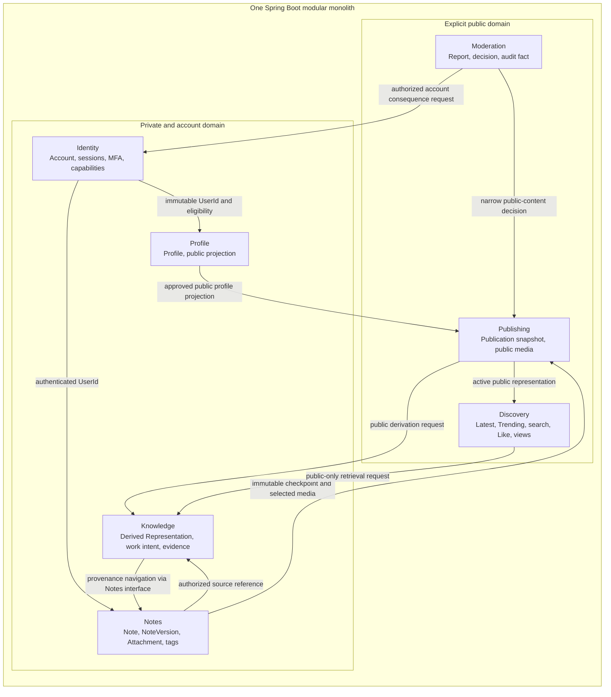
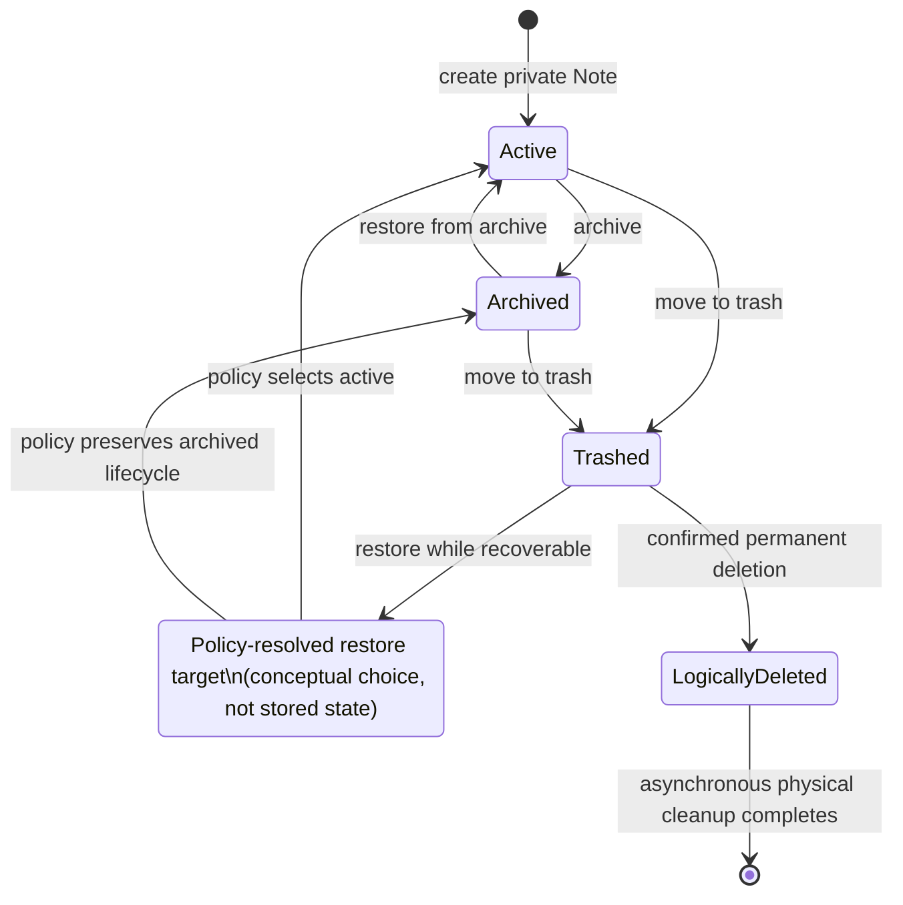
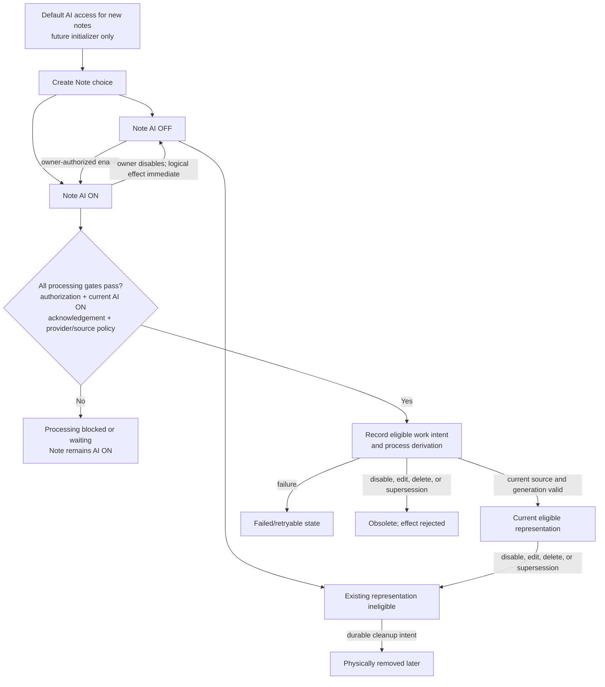
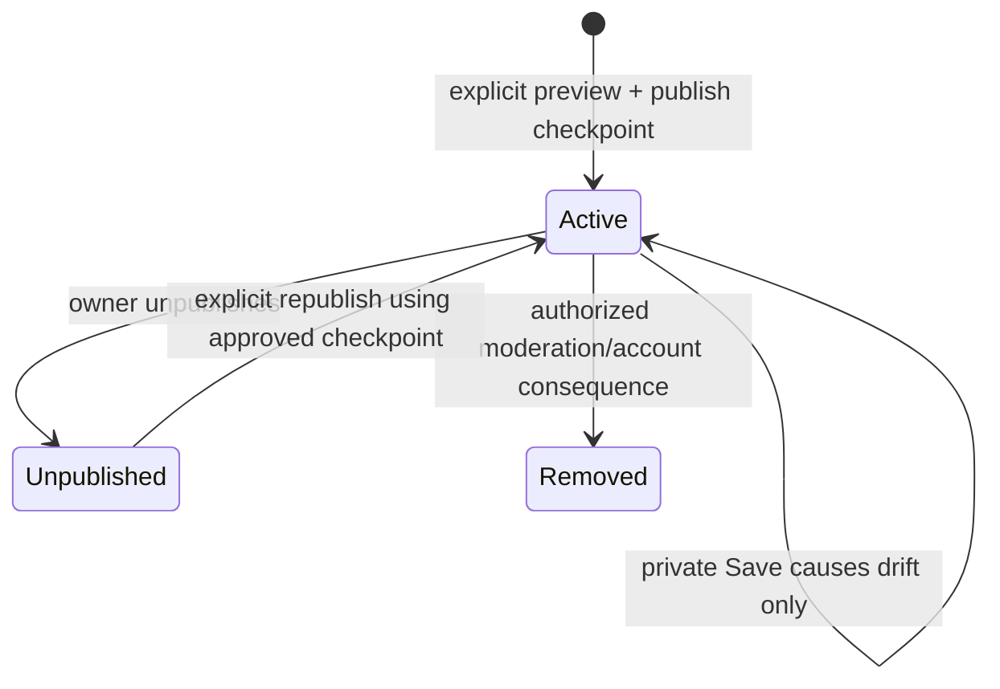
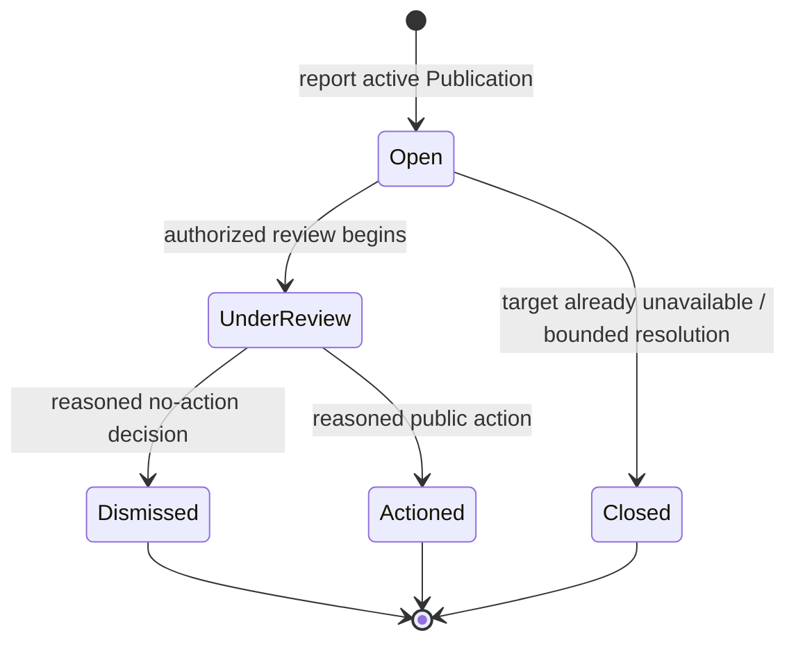
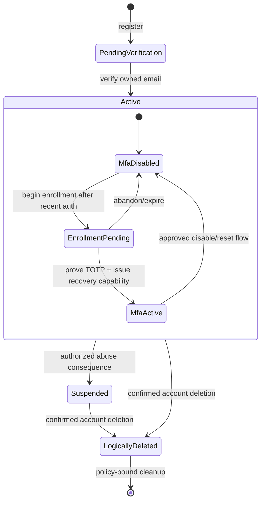

# Notes & Knowledge Workspace

# Domain Model

Status: Approved Baseline  
Date: 2026-09-11  
Baseline approval date: 2026-09-11

## 1. Purpose, authority, and boundaries

This document defines the conceptual domain model for Notes & Knowledge Workspace: the things that exist, the approved module that owns each thing, the consistency boundary around it, and the rules that must always hold. It consumes and does not supersede these Approved Baselines:

1. Product Vision and Target Flagship Requirements.
2. ADR-001 — Architecture Style and Deployables.
3. High-Level Architecture.
4. Technology Stack and Compatibility.
5. Security Architecture.
6. Threat Model.
7. `PROJECT_CONTEXT_HANDOFF.md` as durable project context.

This is a domain model, not a persistence, API, framework, or implementation design. Concept names express product meaning; they do not freeze Java class names, packages, database structures, endpoint contracts, or event technology. A later design may refine a representation only while preserving the identities, ownership, lifecycle rules, and stable invariants defined here.

No conflict was found among the approved inputs. This document creates no new top-level module, deployable, service, worker, broker, or product capability, and it does not authorize implementation.

## 2. Modeling language and ubiquitous-language glossary

An **Entity** is distinguished by stable identity across changes. A Note remains the same Note when its title changes. A **Value Object** is defined by validated meaning rather than a lifecycle identity; two equal Email Address values mean the same thing. An **Aggregate** is a consistency boundary containing concepts whose invariants must be protected together. Its **Aggregate Root** is the only supported entry point for changing that boundary.

Aggregate boundaries are not object-tree convenience. They keep immediate invariants small enough to enforce and prevent one Account from becoming an in-memory container for every Note, Attachment, Publication, Session, and Report. Independent aggregates refer to one another through stable conceptual identifiers and approved module interfaces.

| Term | Meaning in this model |
|---|---|
| Account | Identity-owned security and lifecycle identity for one person in the application. |
| UserId | Immutable, non-public internal identity used for ownership and authorization. |
| Email Address | Verified contact/login value; never authorization identity. |
| External Identity Link | Link from an Account to one OIDC principal identified by issuer plus subject. |
| Public Handle | Unique public presentation/routing value; never proof of ownership. |
| Note | Core private aggregate containing the current deliberately saved Markdown state and its independent AI participation state. |
| Note Revision | Concurrency identity of current committed Note state. It is not automatically retained history. |
| NoteVersion | Immutable retained checkpoint used for history, restoration, or publication provenance. |
| Attachment | Notes-owned supported private media associated with exactly one Note. |
| Default AI access for new notes | Account-scoped Notes preference that initializes future Note creation only. |
| AI participation state | Independent ON/OFF value owned by each Note after creation. |
| Derived Representation | Knowledge-owned, source-subordinate searchable or AI-derived material with authorization and lineage provenance. |
| Knowledge Work Intent | Durable statement that work is requested; never an authorization grant. |
| Publication | Publishing-owned stable public identity and current deliberately approved snapshot derived from an immutable NoteVersion. |
| Public Profile Projection | Profile-owned intentionally public presentation data, distinct from Account/security data. |
| Like | Discovery-owned authenticated-user relationship to an eligible Publication. |
| Approximate View Aggregate | Privacy-conscious, non-authoritative engagement estimate for a Publication. |
| Report | Moderation-owned concern about an active public Publication. |
| Moderation Decision | Attributable, reasoned decision affecting approved public/moderation scope. |
| Role | Named grouping of narrowly approved capabilities; not authority by itself at a resource boundary. |
| Capability | Specific privileged action an authenticated actor may perform subject to current scope and policy. |
| Audit Fact | Append-oriented security or moderation evidence, distinct from routine application logging. |

## 3. Approved module ownership

The exact top-level backend modules are **Identity, Profile, Notes, Publishing, Discovery, Knowledge, and Moderation**. They are logical boundaries inside the same Spring Boot modular-monolith deployable.

| Module | Domain responsibility and concepts owned | May reference or request | Must not own or bypass | Key invariants and collaboration |
|---|---|---|---|---|
| Identity | Account, immutable UserId, credentials, verified contact state, OIDC links, MFA and recovery state, application-session capability, privilege assignments, security audit facts | Profile identity, Notes eligibility effects, Publishing/account-publication consequences, Moderation-requested account consequence | Notes, private content, publications, public discovery state, another module's repository | Resolves every login method to UserId; controls account/session eligibility; exposes deliberate identity/security interfaces. |
| Profile | Private presentation profile, optional Public Handle, avatar reference/lifecycle, Public Profile Projection | UserId and account eligibility; Publishing requests for approved public author data | Credentials, MFA/recovery/session state, private Notes, Publication state | Public output is an allowlisted projection; handle is routing only; private and public profile data stay distinct. |
| Notes | Note, NoteVersion, Attachment, tag values/associations, Note Revision, per-note AI state, Default AI access for new notes | UserId eligibility; Knowledge acknowledgement/work interface; Publishing checkpoint request | Credentials, provider-derived representations, Publication snapshot, moderation decisions | Owns private truth; exactly one owner per Note; explicit Save; attachment inheritance; checkpoint immutability. |
| Publishing | Publication and its current approved snapshot, source-checkpoint provenance, selected public media representation, public availability lifecycle | Notes checkpoint/media interface; Profile public projection; Knowledge/Discovery public-work requests | Private Note repository, private Knowledge index, Profile repository, moderator assignment | Publication is not a Note flag or live view; private Save cannot mutate it; unpublish denies public eligibility immediately. |
| Discovery | Latest/Trending/public-search read concepts, Like relationship, approximate views, public discovery projections | Only active Publication and approved Public Profile Projection; approved Knowledge public-search interface | Private Notes, private vectors, Reports, moderation authority, authoritative sessions | Public candidate scope begins with active publications; engagement failure cannot grant access or block an otherwise readable publication. |
| Knowledge | Derived Representation, source/scope/lineage provenance, processing state, Knowledge Work Intent, query evidence, AI disclosure acknowledgement, AI suggestions | Authorized Notes sources, Attachments, active Publications, current AI/public/account state through owner interfaces | Authoritative Note content/lifecycle, per-note AI state, Publication lifecycle, account credentials, direct repositories of other modules | Derived data never broadens source authority; queued work revalidates; private/public and AI/non-AI processing remain distinguishable. |
| Moderation | Report, report lifecycle, Moderation Decision, moderation evidence/audit facts | Active public Publication, authenticated reporter where required, Identity capability/authorized-account-consequence interfaces, Publishing public-removal interface | Arbitrary private Notes/search/AI/Attachments, credentials, MFA/recovery/session secrets, generic unrestricted administration | Authority is capability- and public-scope-bound; a Report never opens the private source; decisions are attributable and auditable. |

Every module owns its repositories and state. Cross-module references are identities or purpose-built projections, and mutations cross supported application interfaces. One PostgreSQL database and a shared local transaction do not make the database a module integration API.

## 4. Module and concept map

The arrows are in-process conceptual collaborations, not network calls. Neither a semantic signal nor durable work intent implies Kafka, RabbitMQ, or another deployable.

## 5. Identity and Account domain

### 5.1 Account aggregate

`Account` is the Identity aggregate root. Its stable identity is `UserId`, which is immutable and non-public. The aggregate governs account eligibility, login/contact email and verification state, presence of an application password credential, external OIDC links, MFA configuration, and security-sensitive lifecycle transitions. It does not contain the user's Notes, Profile, Publications, Sessions, or Reports as object collections.

Account lifecycle is modeled only to the degree required by approved behavior:

- **Pending verification:** registration state without every verified-account capability.
- **Active:** eligible for authenticated product behavior subject to session, MFA, ownership, and operation policy.
- **Suspended:** logically ineligible for the policy-defined activity following an authorized abuse decision; exact reinstatement policy is downstream.
- **Deletion requested / logically deleted:** authenticated, public, and AI eligibility is removed before asynchronous cleanup.

These are conceptual states, not frozen enum values. Enforcement status may be modeled separately from lifecycle if later design avoids conflating suspension with deletion.

An Email Address is a contact/login value whose verified ownership can change through a protected process. It never replaces UserId. An `ExternalIdentityLink` is an Account entity identified conceptually by its OIDC issuer and subject pair; provider email is not its identity and a matching email cannot silently create a link.

`MfaConfiguration` is Account security state. Enrollment begins pending, becomes active only after proof with a valid TOTP, and cannot be bypassed by choosing OIDC as the primary login. TOTP material is recoverable protected state; recovery codes are one-time proof capabilities. Cryptographic representation belongs downstream.

### 5.2 One-time identity capabilities

Email-verification and password-recovery artifacts are Identity-owned, purpose-bound lifecycle concepts. They require enough independent identity to enforce expiry, supersession, and exactly-once consumption under concurrency. They are not general bearer permissions and do not encode authorization to private content.

A recovery or verification capability may therefore be a small aggregate separate from Account: it refers to UserId or a pending registration, carries purpose and lifecycle, and is atomically consumed. This separation prevents a large Account aggregate while preserving the one-time invariant.

### 5.3 Application sessions

`ApplicationSession` or `SessionDescriptor` is modeled only as the product-visible, Identity-owned capability to recognize active/recent sessions, identify the current session, revoke one, revoke others, revoke all, and invalidate authority after sensitive changes. It is not a model of Spring Session JDBC rows.

The browser authentication decision remains an opaque server-side session. Session creation/elevation rotates authority after primary authentication and MFA. Revocation and account/security changes operate against current authoritative session state. No browser JWT access/refresh-token domain is introduced.

### 5.4 Roles, capabilities, and assignment

A Role is a convenient approved grouping; a Capability is the specific privileged action checked at an operation boundary. Resource ownership and publication state still constrain a capability. There is no ambiguous all-access administrator flag.

Identity owns `PrivilegeAssignment`, including who received which approved role/capability scope, who assigned it, and its active/revoked lifecycle. Assignment is security-sensitive, requires the approved proof and audit behavior, and does not grant private-note browsing. The initial bootstrap/operational mechanism for assigning moderators is explicitly deferred.

### 5.5 AI disclosure relationship

Knowledge owns the processing-policy acknowledgement because it controls provider-processing eligibility. Account supplies UserId; it does not absorb provider policy into authentication. An acknowledgement identifies the meaningful configured processing policy accepted by that user and can become insufficient if a later approved material policy change requires renewed acknowledgement.

Processing-policy acknowledgement is independent of a Note's persisted AI ON/OFF state. Missing or insufficient acknowledgement blocks AI-dependent work and provider processing under the applicable policy; it does not force an AI-enabled Note to become AI OFF. This separation allows renewed acknowledgement after a material policy change without silently mutating existing Note state.

## 6. Profile domain

`Profile` is a Profile-owned aggregate keyed independently while referencing UserId. It contains private presentation choices such as display name, short biography, optional Public Handle, and avatar reference/lifecycle. Account credentials, login email, MFA, sessions, and recovery state never become Profile fields.

`PublicProfileProjection` is an intentionally public, allowlisted representation owned by Profile. It may contain only approved public handle, display name, short biography, sanitized avatar representation, and public associations needed by active publications. A private-only Account need not have a handle; first publication or public-profile activation requires a valid unique handle through synchronous Profile validation.

Public Handle is a value object with public formatting and uniqueness meaning. It is presentation/routing identity only. It is neither UserId nor an authorization credential. Avatar bytes are supporting storage; the domain owns a validated reference and lifecycle, not a filesystem path or object-key format.

## 7. Notes domain

### 7.1 Note aggregate

`Note` is the core private aggregate root. It owns:

- stable Note identity and exactly one immutable owner UserId;
- current deliberately saved title and Markdown body;
- current Note Revision used for optimistic conflict detection;
- active, archived, trashed, and logically deleted eligibility;
- pin state as an orthogonal organization property rather than a lifecycle state;
- applied tag values/associations;
- independent AI participation state;
- relationships to retained NoteVersions and associated Attachments.

Owner identity comes from the authenticated security context and authoritative Note state. A caller-supplied owner identifier cannot make an operation authorized. The initial product has one owner per Note and no sharing or multi-owner semantics.

Editor changes before Save are client work-in-progress, not committed Note state. Explicit Save is the authoritative operation for title, Markdown body, and comparable editor-owned content. Pin, archive, restore, trash, tag changes, publish-related commands, and AI-state commands may persist directly without a second editor Save. A failed Save cannot advance the committed revision, and concurrent Save must compare the caller's expected revision so an older editor cannot silently overwrite newer state.

### 7.2 Note lifecycle

`RestoreTarget` is a diagram-only decision point, not a persisted lifecycle state. The exact destination of a Trash restore—and permanent-deletion retention timing—remain downstream policy where not already fixed. If a Note is a publication source, trash or permanent deletion must first obtain the approved explicit public-copy consequence; it cannot silently leave unintended public availability. Logical denial precedes slower physical cleanup.

### 7.3 Note Revision and NoteVersion

`Note Revision` identifies current committed state for concurrency and supersession. It is not the same as a retained historical version.

`NoteVersion` is an immutable Notes-owned entity with stable identity, Note lineage, owner scope, captured content, and checkpoint provenance. Retained versions exist for bounded history/recovery, explicit restoration, and publication provenance. A Save does not automatically create a retained NoteVersion unless the approved retention/checkpoint policy requires one.

Restoring a NoteVersion is an explicit Note operation. It does not mutate the checkpoint. It produces new current Note state and a new current revision, while keeping the immediately pre-restore state understandable or recoverable to the extent allowed by the bounded retention policy. The exact checkpoint cadence and retention count/duration remain downstream.

### 7.4 Note creation preference and AI state

`Default AI access for new notes` is a small Notes-owned, user-scoped preference state. Its conceptual scope is UserId's Notes preferences; it does not need a separate entity identity or aggregate lifecycle. It is independently mutable within Notes because it affects Note creation behavior rather than authentication. A new Account begins with an effective value of OFF.

When a Note is created, Notes reads the current preference and uses it only to initialize the Create Note AI choice unless the user explicitly overrides that choice. The resulting value becomes the new Note's own independent AI participation state. Later preference changes never mutate existing Notes and are not a runtime account-wide processing gate. Explicit bulk actions are independent commands over applicable owned Notes and do not alter the preference. Exact persistence representation belongs to Schema Design.

### 7.5 Tags

In the approved scope, a tag has no lifecycle independent of its owner's Notes. `TagLabel` is therefore modeled as a validated, user-scoped value associated with a Note, not as a hierarchy or independent global taxonomy. A later schema may normalize storage without changing this domain meaning. Knowledge may propose tags/topics, but Notes changes authoritative tag associations only after explicit user confirmation.

### 7.6 Attachment aggregate

`Attachment` is a Notes-owned aggregate root with independent upload, validation/quarantine, availability, processing-reference, removal, and cleanup lifecycle. Separating it from the Note consistency boundary avoids making every media transition lock or load the full Note, while its `NoteId` and owner provenance make it subordinate to exactly one Note for authorization.

Supported media kinds are exactly image, audio/voice, bounded video, and PDF. Original display metadata is untrusted and never serves as identity or authorization. Stored availability and AI-processing status are separate: a successfully accepted Attachment remains accessible to its owner when derivation fails.

Attachment does not own an AI permission. Its effective AI eligibility is calculated from the current parent Note state together with current authorization, disclosure acknowledgement, provider policy, and validation state. Deletion, trash, restoration, retained-version, and public-selection effects follow approved Note and Publication policy. Public selection belongs to a Publication snapshot; Attachment does not acquire an `isPublic` truth merely because a public derivative exists.

## 8. Knowledge and AI domain

### 8.1 Derived Representation aggregate

`DerivedRepresentation` is a Knowledge-owned aggregate root. It is subordinate to an authoritative source and carries conceptual provenance sufficient to resolve:

- authoritative source kind and stable source identity: current private Note content, Attachment with Note/owner provenance, or active Publication/public snapshot;
- source owner UserId for private scope, or Publication identity for public scope;
- relevant Note Revision and, where needed, checkpoint/NoteVersion identity for lineage or publication provenance, plus processing generation;
- private or public authorization scope;
- deterministic or AI-dependent derivation class;
- processing/eligibility state;
- derivation lineage such as model/configuration identity where compatibility matters;
- evidence location or segment needed for navigation.

This list defines meaning, not columns. Derived data never becomes authority for Note ownership, AI state, Publication activity, or Account eligibility. Private and public representations are separate scopes. An ownerless or scope-less representation is invalid.

Derived Representation belongs to Knowledge rather than Note because derivation lineage, provider failure, regeneration, invalidation, and retrieval evidence have an independent lifecycle, while Notes must remain the sole owner of authoritative private content and AI state.

Retained historical NoteVersions are not a generic Knowledge corpus and are not automatically embedded, indexed, or made AI-queryable. A Source Reference may retain checkpoint/NoteVersion identity when needed to explain lineage or support Publication provenance without treating that checkpoint as an independently searchable source. Searchable historical versions would require an explicit future product and retrieval decision.

### 8.2 Knowledge Work Intent

`KnowledgeWorkIntent` is a small Knowledge-owned durable aggregate recording requested derivation, invalidation, or cleanup. It refers to the source, expected revision/checkpoint, expected generation, required scope, and processing class; it should not carry private bodies or provider prompts when the source can be resolved safely at execution time.

Queued intent is not authorization. Before claim effects, before source reading, and immediately before provider/index/public effects, Knowledge re-resolves current source existence, UserId/public scope, source version, Note AI state when AI-dependent, disclosure policy, Attachment validation, Publication activity, Account state, and supersession generation. Stale intent becomes obsolete/cancelled rather than recreating eligibility.

### 8.3 AI participation transitions

AI ON is an independent persisted Note state established by an owner-authorized Note operation. It does not itself authorize work or a provider call. A Note may remain AI ON while processing is blocked or waiting because acknowledgement or another current processing gate is not satisfied. AI OFF excludes Note and Attachment content from embeddings, vectors/semantic retrieval, AI reranking/classification, generative context, semantic category extraction, AI suggestions, multimodal reasoning, semantic related-note behavior, and every other AI-dependent stage.

AI OFF remains compatible with editing, explicit Save, lifecycle actions, tags, versions, authorized Attachment access, lexical/fuzzy search, and deterministic non-AI extraction. It is a processing control, not encryption or E2EE.

Enabling AI requires owner authorization and persists AI ON independently of disclosure acknowledgement. Before any AI-dependent work becomes eligible or reaches a provider, current authorization, current Note AI ON, the applicable processing-policy acknowledgement, provider/tier policy, source or Attachment validation, and every other applicable state gate must pass. A material provider-policy change may block processing pending renewed acknowledgement without changing the Note to OFF. No third Note AI state is introduced. Disabling AI changes authoritative Note state immediately, invalidates existing eligibility through a generation/current-state rule, rejects stale work, and schedules physical removal. Cleanup may lag; logical ineligibility may not.

### 8.4 Knowledge query and evidence

A knowledge query is a transient operation, not a persistent all-knowing aggregate. It starts with authenticated UserId or active public scope, selects the authorized strategy, gathers evidence, and returns results/provenance. `EvidenceReference` is a value object resolving to an authorized source and relevant location. It never grants access by possession.

Deterministic extraction may include AI-disabled Notes because it performs no AI-dependent processing. Semantic and model-dependent stages may use only currently AI-enabled sources. Knowledge suggestions remain proposals; model output never changes Notes, tags, publication, security state, or moderator decisions automatically.

## 9. Publishing domain

`Publication` is a Publishing-owned aggregate root with one stable public identity for the approved publishable Note relationship. It owns current availability, source Note and immutable NoteVersion provenance, copied/approved public title and Markdown content, selected public tag values, approved public author/profile reference, explicitly selected public media representations, and public timestamps.

The current `PublicationSnapshot` is an immutable value object within the Publication aggregate. Publication owns the stable public identity; the snapshot has no independent domain identity or lifecycle. An explicit Update Public Copy operation replaces the value object inside the stable Publication identity using a newly approved immutable checkpoint; the product does not promise public revision history. A future persistence layer may use a technical row identifier without turning PublicationSnapshot into a domain Entity. Ordinary private Save, tag changes, or Attachment changes do not mutate the current public snapshot. Publication drift is a comparison between the source Note's current revision and the snapshot's source checkpoint.

This model does not create restoration or appeals behavior for a moderation removal; any such future behavior would require explicit approved policy. Both Unpublished and Removed are publicly ineligible immediately. Physical index, cache, or object cleanup may follow asynchronously and cannot restore public reachability.

Publication is not `Note.isPublic`, not a live read of private content, and not authority to traverse private history. Public media is copied or represented through an explicitly approved public reference/derivative; a private object location never becomes public merely through selection.

## 10. Discovery and engagement domain

Discovery operates only over active Publication representations and approved Public Profile Projections.

- `PublicDiscoveryRepresentation` is a Discovery-owned public read concept used by Latest, Trending, and public search. It carries Publication provenance and current active eligibility, never private Note authority.
- `Like` is an authenticated-user relationship between UserId and an eligible Publication. At most one active Like exists per pair. Repeating like/unlike intent is idempotent. Exact persistence uniqueness is downstream.
- `ApproximateViewAggregate` is a privacy-conscious estimate, not an identity or exact ledger. It does not require permanent raw IP history. A counting failure cannot block an otherwise eligible public read.
- Trending is a transparent time-decayed public ranking over active publications and bounded engagement signals; it is not a personalized recommendation domain.

Discovery does not own Reports; reporting is a public-surface entry into the Moderation module. It does not read private Notes or private Knowledge representations to build candidates.

## 11. Moderation and audit domain

### 11.1 Report aggregate

`Report` is a Moderation-owned aggregate root with stable identity, target active Publication identity, bounded reason/category and context, reporter reference where the approved downstream policy requires one, submission time, and lifecycle such as open, under review, and resolved. Those lifecycle labels are conceptual rather than frozen storage enums.

A Report concerns the public representation the reporter saw. It is not ownership proof, does not disclose the private source, and never authorizes a moderator to open the private Note, private Attachment, private versions, private search, or private AI evidence.

### 11.2 Moderation Decision and capability

`ModerationDecision` has stable identity and append-oriented meaning: authorized actor UserId, target Report/Public Publication, reason/evidence safe for moderation scope, decision time, and approved consequence. It is not an editable generic administrator note. Public hide/remove is requested synchronously through Publishing's supported interface. An approved abusive-account suspension is requested through Identity's supported interface. Each owner module mutates only its own state.

The capability to review public reports, moderate a public Publication, or request an approved abusive-account consequence is narrow and independently checked. Moderator status does not confer unrestricted account administration and never grants access to private notes, private retrieval, private attachments, credentials, MFA secrets, recovery state, or session secrets. Exact capability names and moderator-assignment persistence are deferred.

Moderator operations require an eligible authenticated server-side session, CSRF protection for unsafe browser actions, recent authentication and MFA where appropriate, enumeration-resistant denial, bounded mass-action behavior, public/private confused-deputy protection, and protected audit evidence. These constraints narrow how an approved capability may be exercised; they do not create moderator access to private sources.

### 11.3 Audit facts versus logs

Identity owns security audit facts for security-sensitive Account, MFA, recovery, session, OIDC-link, and privilege-assignment changes. Moderation owns moderation audit facts for report review and enforcement decisions. Publishing owns attributable publication lifecycle facts where required.

An Audit Fact is immutable/append-oriented evidence containing safe actor, target, action, outcome, time, and policy reason references. It excludes passwords, tokens, TOTP material, recovery codes, session identifiers, private Note bodies, raw Attachments, and provider prompts/responses. Routine diagnostic logging and metrics are technical observability, not substitutes for domain audit evidence.

## 12. Concept ownership matrix

| Concept | Owning module | Aggregate/root relationship | Owner/security scope | Mutable? | Visibility | Key invariants |
|---|---|---|---|---|---|---|
| Account | Identity | Root | UserId / account security | Lifecycle mutable; UserId immutable | Private | Login methods resolve to UserId; deletion/suspension remove eligibility. |
| External Identity Link | Identity | Account entity | UserId + issuer/subject | Link lifecycle mutable; pair identity stable | Private | Never linked by email alone. |
| MFA Configuration | Identity | Account security entity | UserId | Mutable through protected transitions | Private | Primary login does not bypass active MFA. |
| Verification/Recovery Capability | Identity | Small root | Purpose-bound account/pending registration | Single-use lifecycle | Private secret-bearing boundary | Expiring, supersedable, consumed once. |
| Application Session | Identity | Independent security capability/root | UserId | Revocable/expiring | Private | Opaque server authority; invalidation is authoritative. |
| Privilege Assignment | Identity | Small root | Assigned UserId + approved scope | Grant/revoke lifecycle | Private security metadata | Narrow, auditable, no private-note grant. |
| Profile | Profile | Root | UserId | Mutable | Private presentation | Separated from credentials and sessions. |
| Public Profile Projection | Profile | Public projection/root | Public Handle + UserId provenance | Explicitly refreshed | Public allowlist | Contains only intentionally public fields. |
| Note Creation Preference | Notes | User-scoped preference state; no separate entity identity | UserId Notes preference scope | Independently mutable | Private | Initializes future Notes only; new-account effective value OFF. |
| Note | Notes | Root | Exactly one UserId | Mutable current state | Private | Explicit Save; independent AI state; optimistic conflict detection. |
| NoteVersion | Notes | Immutable entity in Note lineage | Same UserId and NoteId | Immutable | Private | Retained checkpoint, not every Save; publication provenance. |
| TagLabel / association | Notes | Note-owned value/association | Note owner | Mutable by explicit command | Private; copied if published | No global or hierarchical authority; AI proposal requires confirmation. |
| Attachment | Notes | Root subordinate to Note by reference | NoteId + owner UserId | Lifecycle mutable | Private unless explicitly represented in Publication | Supported kinds only; no independent AI permission. |
| AI Processing Acknowledgement | Knowledge | User/policy-scoped root | UserId + processing-policy identity | Supersedable | Private security/privacy metadata | Required before first processing under applicable policy. |
| Derived Representation | Knowledge | Root | Private UserId/source or public Publication scope | Regenerable lifecycle | Private or public, never mixed | Source/version/generation/lineage provenance; never broader authority. |
| Knowledge Work Intent | Knowledge | Root | Source-derived scope | Durable lifecycle | Private operational metadata | Intent is not authorization; current state revalidated. |
| Tag/Topic Suggestion | Knowledge | Derived proposal | Authorized source UserId | Pending/accepted/rejected conceptually | Private | Cannot mutate authoritative tags without confirmation. |
| Publication | Publishing | Root | Stable public identity; source-owner provenance | Lifecycle/current snapshot mutable | Public only while active | Derived from immutable checkpoint; private Save has no effect. |
| Publication Snapshot | Publishing | Immutable value object within Publication | Publication scope | Immutable; replaced only through Publication | Public while Publication active | No independent lifecycle or public history; copied approved content/media only. |
| Public Discovery Representation | Discovery | Projection/read concept | Active Publication | Rebuildable | Public | No private candidate source. |
| Like | Discovery | Relationship/small root | UserId + PublicationId | Active/inactive intent | Public aggregate, private actor detail | At most one active per pair; idempotent. |
| Approximate View Aggregate | Discovery | Aggregate/projection | Publication scope | Approximate accumulation | Public aggregate only | Nonblocking; privacy-conscious; not security identity. |
| Report | Moderation | Root | Public Publication target; reporter per policy | Lifecycle mutable | Restricted moderation data | Does not authorize private source access. |
| Moderation Decision | Moderation | Stable append-oriented entity/root | Authorized capability + public target | Immutable decision fact | Restricted moderation data; effect may be public | Reasoned, attributable, bounded consequence. |
| Audit Fact | Owning module | Append-oriented fact | Actor/target scope | Immutable | Restricted | No secret or private content payload. |

## 13. Aggregate-boundary analysis

| Boundary | Why this boundary exists | What stays outside |
|---|---|---|
| Account | Protects immutable identity, account eligibility, login-link integrity, MFA state, and sensitive transitions together. | Notes, Profile, Sessions, one-time capabilities, and Publications have independent scale/lifecycle and reference UserId. |
| Verification/Recovery Capability | Exactly-once, expiry, and supersession require a small atomic lifecycle independent of loading Account. | Private content and general authorization. |
| Application Session | Individual and bulk revocation, expiry, and device-visible lifecycle occur independently and may be numerous. | Spring Session persistence layout and Account object collections. |
| Profile | Presentation fields and avatar lifecycle change without locking authentication state. | Credentials and public Publication content. |
| Note | Current content, revision, lifecycle, tags, and AI state form the immediate private-note consistency boundary. | Large media lifecycles and derived/provider state are separate roots/modules. |
| Attachment | Upload/validation/removal can progress independently and needs its own concurrency, while NoteId/owner provenance preserves subordination. | Embeddings, transcripts, and public derivatives. |
| Publication | Stable public identity, approved snapshot, selected public media, and availability must change together and independently of private Save. | Private Note state/history and public engagement. |
| Derived Representation | Regeneration, invalidation, and lineage have independent lifecycle, but source scope remains mandatory. | Authoritative source content/ownership and Note AI state. |
| Knowledge Work Intent | Durable retry/claim/supersession is operationally independent from the source aggregate. | Authorization grant or copied private content. |
| Like | One user/publication relationship needs idempotent uniqueness without loading Publication engagement collections. | Publication availability truth and approximate views. |
| Report | Submission and review lifecycle is distinct from Publication state; it targets public provenance. | Private source and moderator assignment. |
| Moderation Decision | Decision evidence must be stable and attributable while consequence mutations remain with Publishing or Identity. | Generic administration or another module's repository. |

This avoids a giant User aggregate. UserId supplies stable ownership reference across many independent roots; it does not imply that Account transactionally owns their object graphs. A shared physical database similarly supplies local ACID capability without erasing module boundaries.

## 14. Cross-module collaboration, signals, and durable intent

| Conceptual change | Immediate collaboration | Decoupled signal or durable work | Why |
|---|---|---|---|
| Note created/saved | Notes authorizes owner and commits current revision; Knowledge interface records work intent when required | A local semantic `NoteSaved` signal may inform noncritical observers; Knowledge-owned durable intent drives derivation | Save outcome is immediate; provider/index work is delayed and recoverable. |
| Note AI enabled | Notes verifies the owner and persists independent AI ON state; acknowledgement is not a precondition to that Note transition | Knowledge evaluates authorization, current AI ON, applicable acknowledgement, provider/tier policy, and source gates before recording or processing eligible derivation work; otherwise processing remains blocked/waiting | Note state and processing eligibility are separate; provider-dependent work may be delayed without mutating the Note back to OFF. |
| Note AI disabled | Notes changes state; Knowledge invalidates logical eligibility consistently | Knowledge records removal/cleanup intent; conceptual `NoteAiDisabled` signal may notify observers | No new AI use may wait for physical cleanup. |
| Attachment accepted/removed | Notes commits authoritative Attachment lifecycle | Knowledge or Notes-owned cleanup intent is recorded by the owning module | Validation/derivation/object cleanup may be delayed; access truth is immediate. |
| Publication created/updated | Publishing synchronously obtains an authorized immutable Notes checkpoint and approved Profile projection | Knowledge/Discovery owns public index/projection work intent | Exact public snapshot must commit deliberately; derived public work is retryable. |
| Publication unpublished | Publishing makes public availability false immediately | Knowledge/Discovery records deindex/projection cleanup | Public denial cannot wait for asynchronous cleanup. |
| Report decision applied | Moderation records an attributable decision and calls Publishing for public action; calls Identity only for an approved account consequence | Noncritical notifications may observe a local signal | Decision, public availability, and account eligibility have distinct owners but may use local ACID coordination. |
| Account deletion requested | Identity removes account/session eligibility and coordinates immediate public/AI denial through supported interfaces | Owning modules record cleanup intents | Logical revocation is immediate; physical deletion is asynchronous and policy-bound. |

Signal names are illustrative domain language, not frozen event class names. Local domain events do not imply a broker. When losing or delaying work would violate a guarantee, an owning module records durable intent rather than relying only on ephemeral publication.

## 15. Transactional invariants and consistency

The initial architecture permits one local transaction to coordinate supported module interfaces, but no participant may mutate another module's repository.

1. **Create Note:** Notes commits Note identity, immutable owner, initial revision, and the independently initialized AI state as one authoritative outcome.
2. **Save plus derived intent:** Notes commits the new revision; when derivation is required, Knowledge records its own source-version work intent consistently through an application interface. Save success does not wait for provider success.
3. **AI disable:** Notes commits AI OFF while Knowledge's current generation/eligibility is invalidated consistently enough that no post-commit AI read or dispatch treats old representations as eligible.
4. **One-time proof consumption:** Identity permits exactly one committed consumption of a verification token, password-recovery capability, TOTP replay slot, or recovery code.
5. **MFA activation:** Identity establishes active MFA and its new recovery capability as one consistent security outcome.
6. **Publication creation/update:** Publishing receives an authorized immutable checkpoint and commits the exact previewed public snapshot and source provenance together; selected media belongs to that same approved snapshot.
7. **Like uniqueness:** Discovery commits one effective Like relationship for a UserId/Publication identity and makes repeated intent idempotent.
8. **Moderation enforcement:** Moderation records the decision while Publishing commits public ineligibility through its own interface where immediate denial is required; an account consequence similarly remains an Identity mutation.
9. **Account deletion:** Identity's logical ineligibility, session revocation, and required public/AI denial take effect before cleanup work is allowed to lag.

Exact transaction demarcation, locking, isolation, and failure recovery are later design responsibilities. No distributed transaction is assumed.

## 16. Concurrency and race invariants

| Race | Domain protection | Required outcome |
|---|---|---|
| Concurrent Note Save | Expected Note Revision and optimistic conflict outcome | Older state never silently overwrites newer committed state; both relevant states remain understandable. |
| Restore versus newer Save | Selected immutable NoteVersion plus expected current revision | Restore is explicit and cannot erase an unseen newer revision. |
| Note edit versus derivation | Source Revision, processing generation, supersession | Old output cannot become current for a newer Note. |
| AI disable versus derivation/provider dispatch | Immediate Note state, generation invalidation, pre-effect revalidation | No new eligible representation or provider dispatch occurs after the authoritative disable boundary. |
| Publish versus private changes | Explicit selected NoteVersion and preview identity | Committed public snapshot matches the chosen checkpoint, not a racing draft. |
| Unpublish/moderation versus public refresh | Authoritative Publication availability plus generation/current-state check | Refresh cannot resurrect removed content. |
| Attachment delete versus processing | Attachment lifecycle, source generation, current Note/AI/public state | Deleted media cannot become newly retrievable, AI processed, or public. |
| Recovery artifact/code double use | Atomic one-time lifecycle | Exactly one concurrent attempt succeeds. |
| Session revocation versus request | Authoritative current session capability and defined commit boundary | A revoked session cannot begin a new protected operation after revocation takes effect. |
| Account deletion versus work | Account logical state plus every intent's revalidation | No later private, public, or AI effect becomes eligible after deletion commits. |
| Moderation removal versus public cache/index | Publication active state and superseding generation | Public refresh cannot restore removed availability. |

Optimistic concurrency, idempotency, generation, supersession, and current-state revalidation are domain concepts here. Their data types and locking mechanisms are deferred.

## 17. Entity identity and value objects

### 17.1 Stable entity identities

Account/User, Note, NoteVersion, Attachment, Publication, Derived Representation, Knowledge Work Intent, Report, Moderation Decision, Application Session, and Privilege Assignment require stable conceptual identity across lifecycle transitions. Like may be identified by its UserId/Publication relationship rather than an invented public ID. Approximate views need a Publication scope, not durable visitor identity.

No identifier generation mechanism is selected. Internal identifiers remain non-public where required. Publication identity and Public Handle may be public locators, but neither authorizes private access.

### 17.2 Selected value objects

| Value object | Domain meaning carried |
|---|---|
| Email Address | Normalized contact/login syntax and verified-ownership context without becoming identity. |
| OIDC Principal Key | Issuer plus subject equality; prevents email-based identity substitution. |
| Public Handle | Public formatting/routing and uniqueness rules. |
| Note Title | Bounded user-facing title meaning; exact length remains downstream. |
| Markdown Content | Current deliberately saved authored content; rendering remains untrusted. |
| Note Revision | Concurrency/supersession identity without choosing number, UUID, timestamp, or ETag. |
| AI Participation State | Exact per-Note ON/OFF semantics. |
| Processing Policy Identity | Meaningful provider/processing disclosure version to which acknowledgement applies. |
| Media Kind | Closed approved set: image, audio/voice, bounded video, PDF. |
| Source Reference | Authoritative current source kind/identity, scope, revision, optional checkpoint/NoteVersion provenance, and generation; checkpoint identity does not make retained history a generic corpus. |
| Derivation Lineage | Compatibility identity for model/configuration-produced representations. |
| Publication Availability | Whether current public resolution is eligible and why it became unavailable. |
| Report Reason | Bounded public-moderation category/context, not free authority to inspect private data. |
| Capability Scope | Specific privileged action and eligible resource domain. |

Not every primitive becomes a value object. These values earn the distinction because validation, equality, or security meaning would otherwise be repeatedly ambiguous.

## 18. Important domain operations

These are conceptual commands, not endpoint or method signatures.

- **Identity:** register Account; verify Email Address; authenticate password/OIDC principal; link/unlink External Identity; begin/confirm MFA enrollment; consume recovery code; request/complete password recovery; change verified email; revoke one/other/all Sessions; assign/revoke approved privilege; suspend Account; request Account deletion.
- **Profile:** change display presentation; establish/change Public Handle under policy; accept/replace/remove validated avatar reference; activate/refresh Public Profile Projection.
- **Notes:** change Default AI access for new notes; create private Note with explicit initial AI choice; Save Note against expected revision; pin/unpin; archive/restore; trash/restore; confirm permanent deletion; apply/remove tag; attach/remove supported media; retain/inspect/restore NoteVersion; enable/disable AI; request deliberate bulk AI change.
- **Knowledge:** acknowledge processing policy; record derivation/invalidation intent; revalidate and process eligible source; mark derived state current/failed/obsolete; perform authorized deterministic or AI-dependent knowledge query; propose organization change; resolve provenance.
- **Publishing:** preview checkpoint; publish; update public copy; unpublish; replace selected public media through explicit update; deny public availability after account/moderation consequence.
- **Discovery:** browse Latest/Trending; public search; like/unlike eligible Publication; record bounded approximate view.
- **Moderation:** submit Report against active Publication; begin review; dismiss with reason; record public-content decision; request public removal; request approved abusive-account suspension.

## 19. Stable domain-invariant catalog

- **DM-INV-001:** UserId is immutable, internal, and the authorization subject for account-owned private behavior.
- **DM-INV-002:** Email Address and Public Handle are mutable/contact or presentation values and never replace UserId for authorization.
- **DM-INV-003:** An OIDC External Identity Link is identified by issuer plus subject and is never established solely from matching email.
- **DM-INV-004:** Private authenticated behavior requires an eligible Account and fully authorized current session.
- **DM-INV-005:** Account deletion removes logical authenticated, public, and AI eligibility before asynchronous physical cleanup.
- **DM-INV-006:** Active application MFA applies after either approved primary login method and must succeed before full application authority.
- **DM-INV-007:** Verification, reset, TOTP-replay, and recovery-code capabilities are purpose-bound, expiring/supersedable where applicable, and consumable at most once.
- **DM-INV-008:** Application Sessions are server-controlled, revocable individually or in groups, and invalidated or rotated by approved security transitions.
- **DM-INV-009:** Sensitive security changes require approved recent-authentication/MFA consequences and attributable audit evidence.
- **DM-INV-010:** Privileged assignment grants only explicit approved capabilities and never unrestricted private-note authority.
- **DM-INV-011:** A newly created Account begins with Default AI access for new notes set to OFF.
- **DM-INV-012:** Default AI access for new notes initializes only future creation choices; changing it never mutates an existing Note.
- **DM-INV-013:** Every private Note has exactly one immutable owner UserId.
- **DM-INV-014:** A client-supplied owner identity, identifier, handle, or locator never proves Note authorization.
- **DM-INV-015:** Editor-owned Note content becomes authoritative only through explicit successful Save; failed Save never advances committed state.
- **DM-INV-016:** Concurrent Note changes cannot silently overwrite a newer committed Note Revision.
- **DM-INV-017:** Explicit pin, archive, restore, trash, tag, AI, and publication-related commands may persist independently of editor Save.
- **DM-INV-018:** Archive, trash, restore, and confirmed permanent deletion are explicit lifecycle transitions; logical denial precedes cleanup.
- **DM-INV-019:** Every retained NoteVersion is immutable, owner-scoped, bounded by policy, and distinct from current Note Revision.
- **DM-INV-020:** Restoring a NoteVersion creates new current Note state without mutating the checkpoint and preserves pre-restore understandability while policy permits.
- **DM-INV-021:** Each Note owns one independent AI ON/OFF state after creation, regardless of the current future-note default.
- **DM-INV-022:** Explicit bulk AI changes mutate only selected applicable existing Notes and never change the future-note default.
- **DM-INV-023:** Tag values remain user/Note scoped, have no unapproved hierarchy, and AI-proposed changes require user confirmation.
- **DM-INV-024:** Attachment media kind is limited to image, audio/voice, bounded video, or PDF in the approved product.
- **DM-INV-025:** Every Attachment is associated with exactly one owning Note and derives private authorization from that Note and owner.
- **DM-INV-026:** Attachment has no independent AI permission; effective AI eligibility follows the current parent Note plus all provider/validation gates.
- **DM-INV-027:** Successfully stored Attachment availability is distinct from AI-processing state and survives derivation failure for its authorized owner.
- **DM-INV-028:** AI OFF preserves editing, Save, lifecycle, tags, versions, authorized media access, lexical/fuzzy search, and deterministic non-AI extraction.
- **DM-INV-029:** AI OFF excludes Note and Attachment content from every AI-dependent stage and is never represented as encryption or E2EE.
- **DM-INV-030:** Owner authorization may persist a Note as AI ON independently; AI-dependent work cannot become eligible or begin until current authorization, AI ON, applicable processing-policy acknowledgement, provider/tier policy, and other source-state gates pass.
- **DM-INV-031:** Disabling AI removes logical eligibility immediately, invalidates stale work/results, and may defer only physical cleanup.
- **DM-INV-032:** Every Derived Representation identifies an authoritative source, source version/checkpoint, owner or public scope, processing generation, and compatible lineage.
- **DM-INV-033:** Derived data, evidence, citations, caches, and object locators never gain broader authorization than their authoritative source.
- **DM-INV-034:** Private-owner and active-public Knowledge scopes are distinct; no public query begins from private candidates.
- **DM-INV-035:** Knowledge Work Intent is requested work, not stored authorization or permission to retain copied private content.
- **DM-INV-036:** Every sensitive asynchronous effect revalidates current source, scope, version, generation, AI/public/account state, and supersession before becoming usable.
- **DM-INV-037:** AI output and organization suggestions are untrusted proposals and cannot automatically modify Notes, tags, Publication, security, or moderation state.
- **DM-INV-038:** Publication is a distinct aggregate and never a visibility flag or live view on a private Note.
- **DM-INV-039:** A Publication owns one stable public identity for the approved publishable Note relationship, and its current immutable PublicationSnapshot is created from an authorized immutable NoteVersion.
- **DM-INV-040:** Ordinary private Save and private Attachment/tag changes never mutate the current Publication snapshot; update requires explicit previewed action.
- **DM-INV-041:** Unpublish, account deletion, or authorized moderation removes public eligibility immediately before asynchronous cleanup.
- **DM-INV-042:** Only explicitly selected, approved public media representations enter a Publication; private object identity never becomes public authority.
- **DM-INV-043:** Public Profile Projection contains only intentionally public fields, and Public Handle remains presentation/routing metadata.
- **DM-INV-044:** Latest, Trending, public search, public reads, and engagement operate only on currently active Publication representations.
- **DM-INV-045:** At most one active Like exists per UserId/Publication pair, and repeated like/unlike intent is idempotent.
- **DM-INV-046:** View counts are approximate, privacy-conscious, non-authoritative, and their failure cannot block eligible public reads.
- **DM-INV-047:** A Report targets a public Publication representation and never grants access to its private source Note or derivatives.
- **DM-INV-048:** Moderator capability is restricted to approved public/report/moderation scope and excludes private Notes, private retrieval/media, credentials, MFA, recovery, and session secrets.
- **DM-INV-049:** Every material Moderation Decision is attributable, reasoned, auditable, bounded against mass abuse, and applied through the owning module's interface.
- **DM-INV-050:** Modules own their state and repositories; cross-module identities, interfaces, projections, and selected local signals never authorize repository shortcuts or imply a broker.

## 20. Additional identity and MFA state view

Suspension restoration and support-assisted MFA recovery are not designed here. Full application authority after primary authentication still depends on active MFA state and the approved session transition.

## 21. Retrieval and public-scope traces

Private retrieval must be structurally expressible as:

`authenticated UserId -> eligible Account -> owner-scoped Notes/sources -> AI gate when processing is AI-dependent -> candidate/evidence -> authorization-checked provenance`

Public retrieval must be structurally expressible as:

`active Publication scope -> approved Public Profile/Public Discovery representation -> public-only candidates -> active-state revalidation -> public provenance`

DerivedRepresentation's source reference, owner/public scope, source revision/checkpoint, generation, lineage, and current eligibility provide the concepts later Data and Search/AI/Retrieval designs require. A citation resolves through the source-owning module and is never access merely because the reference exists.

## 22. Threat Model forward traces

| Threat | Domain support |
|---|---|
| TM-AUTHZ-01 | `DM-INV-001`, `DM-INV-013`, and `DM-INV-014` establish immutable private ownership and reject caller-supplied identity as authority. |
| TM-AUTHZ-02 | `DM-INV-025`, `DM-INV-032`, and `DM-INV-033` bind indirect media, derived data, and provenance to an authorized source. |
| TM-AUTHZ-03 / TM-MOD-01 | `DM-INV-010`, `DM-INV-047`, `DM-INV-048`, and `DM-INV-049` create narrow capabilities and prohibit report-to-private pivots. |
| TM-AUTHZ-04 | `DM-INV-050` requires owner-module interfaces and prohibits repository shortcuts/confused deputies. |
| TM-RETR-01 / TM-RETR-02 | `DM-INV-032` through `DM-INV-034` make owner/public scope part of every searchable source before candidates exist. |
| TM-AI-01 | `DM-INV-021`, `DM-INV-026`, and `DM-INV-028` through `DM-INV-031` preserve independent Note state, inherited media eligibility, and immediate disablement. |
| TM-PUB-01 / TM-PUB-02 | `DM-INV-038` through `DM-INV-044` separate private checkpoints, public snapshots, selected media, and active public eligibility. |
| TM-JOB-01 | `DM-INV-032`, `DM-INV-035`, and `DM-INV-036` require version/generation provenance and current-state revalidation rather than queued authority. |
| TM-MFA-03 and recovery races | `DM-INV-006` through `DM-INV-009` require proven MFA activation, one-time recovery state, session consequences, and audit evidence. |

These structures support the Threat Model's release blockers; they do not replace the required later negative, integration, concurrency, and deployment evidence.

## 23. Domain concepts versus technical concepts

Note, NoteVersion, Attachment, AI Participation State, Publication, Like, Report, and Moderation Decision are domain concepts because product behavior gives them identity, lifecycle, or invariant meaning.

Spring Security filters, CSRF repositories, JPA entity managers, PostgreSQL rows, vector columns, Redis keys, Docker containers, object keys, HTTP DTOs, and controllers are implementation/platform concepts and are not part of this model. ApplicationSession and KnowledgeWorkIntent sit near the application/security boundary; they are modeled only because users require revocation and the product requires durable, current-state-aware work. Their framework and persistence representation remains downstream.

## 24. Deferred details and architecture guardrails

This document explicitly defers:

- table layout, foreign keys, normalization, enum storage, ID-generation mechanism, indexes, vector columns/dimensions, and database constraints;
- object-key layout, transfer path, storage vendor, JPA ownership/cascades, lazy/eager loading, repository interfaces, transaction annotations, isolation/locking syntax, and exact event mechanism;
- endpoint paths, API contracts, DTO shapes, JSON, error contracts, and exact validation annotations;
- exact version/checkpoint retention count, cadence, compaction, and duration;
- exact attachment formats, sizes, durations, page/count limits, quotas, quarantine/scanner, and cleanup objectives;
- exact AI work schema, job states/leases/retries, provider/model/configuration, chunking, embeddings, and retrieval algorithms;
- exact moderation role/capability names, assignment persistence/bootstrap, restoration/appeal policy, and audit persistence;
- exact session persistence mapping, cookie/CSRF transport, recent-auth duration, token/recovery representation, and cryptographic parameters;
- exact public Handle syntax, Trending formula, view deduplication, public cache/index implementation, and publication URL/slug;
- exact deployment, frontend hosting, observability, testing, CI, and implementation sequence.

The architecture remains exactly one initial Spring Boot backend deployable, a domain-oriented modular monolith supported by Spring Modulith, one PostgreSQL physical database with module-owned state, local ACID where justified, internal Knowledge, a bounded same-deployable executor, and PostgreSQL-backed durable work. Redis remains optional/transient. No RabbitMQ, Kafka, API gateway, Kubernetes, separate AI service, or separate worker is introduced. Provider abstraction, private/public isolation, server-side sessions, and the absence of browser JWT requirements remain binding.

The model introduces no shared ownership, comments, follows, messaging, arbitrary files, Office documents, ebooks, URL fetching/preview, autonomous agents/tools, E2EE claim, payments, or unrestricted private-note administrator.

## 25. Review checklist

- Status is Draft for human review and date is 2026-09-11.
- All seven exact HLD modules are represented; no top-level module was added.
- Note is the core private aggregate with one immutable owner and explicit Save.
- Current Note Revision and immutable retained NoteVersion are distinct.
- The future-note AI default is an initializer only; every Note owns independent ON/OFF state.
- Attachments inherit Note AI eligibility and remain normally accessible after AI-processing failure.
- AI OFF preserves deterministic non-AI behavior and is not encryption.
- Knowledge owns source-scoped derived representations and durable intent; intent is not authorization.
- Publication is a stable distinct aggregate derived from an immutable checkpoint and unaffected by private Save.
- Public Profile, public discovery, private/public Knowledge, and media scopes are explicit.
- Report and moderation authority remain public-scope-only; no unrestricted private-note reader exists.
- Transaction and concurrency concepts preserve every forward-traced race without choosing schema or locking mechanics.
- Fifty stable domain invariants provide traceability for later Data, Search/AI/Retrieval, API, Backend, Frontend, Testing, Deployment, CI/CD, and Observability work.
- Database, JPA, API, framework, and implementation details remain deferred.
- No implementation or downstream design is authorized by this document.
