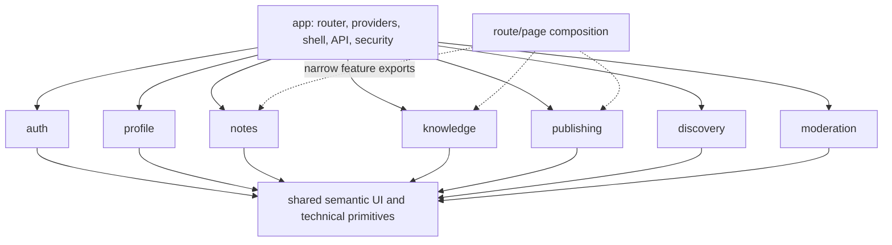
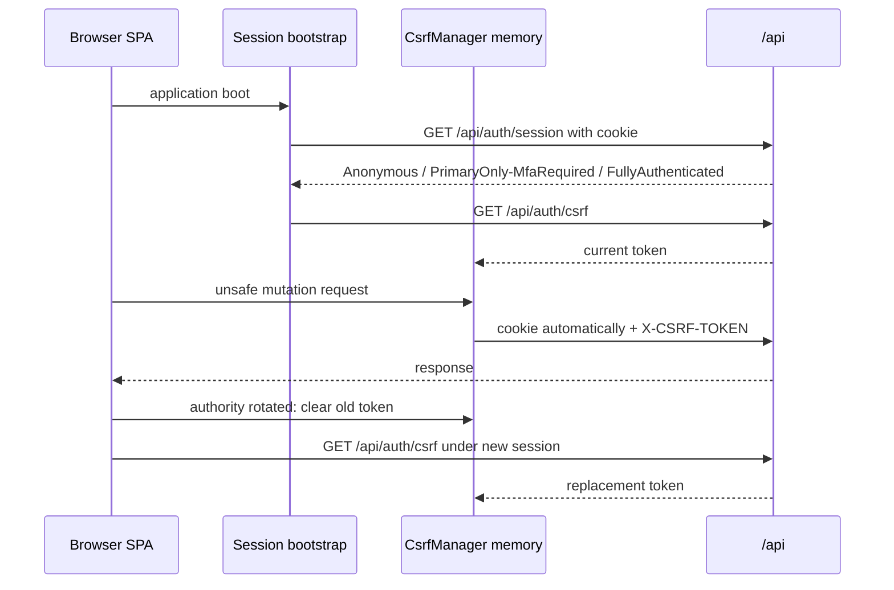
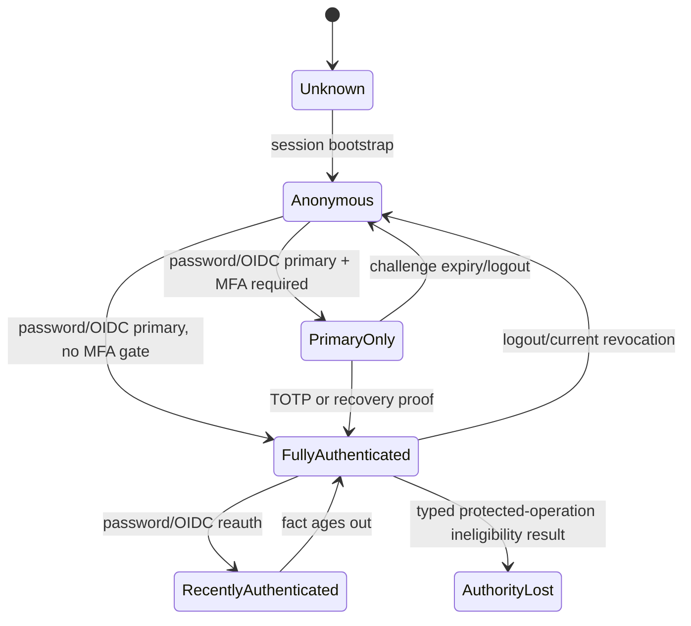
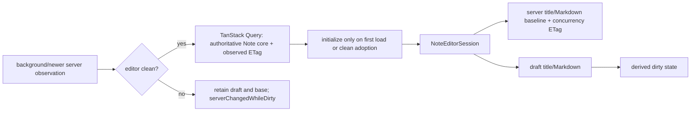
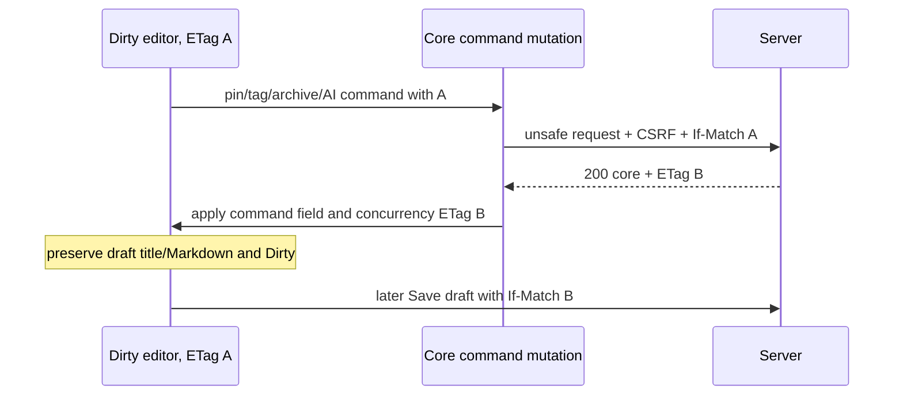
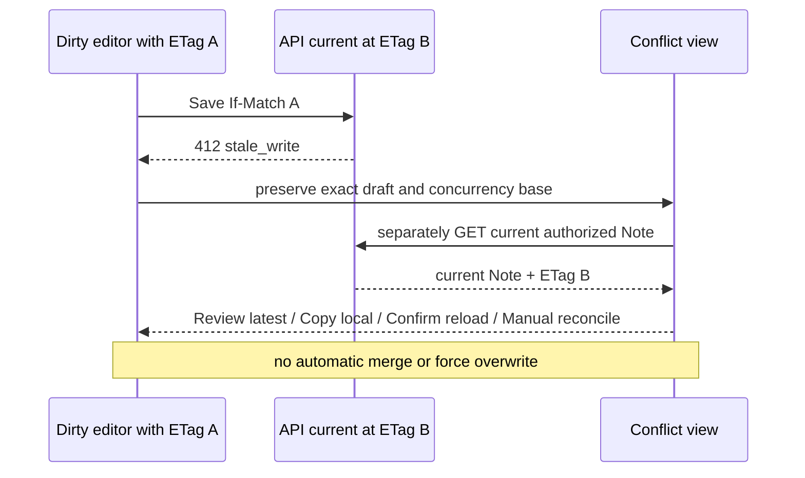
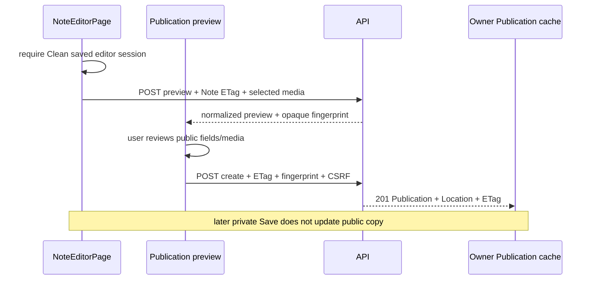
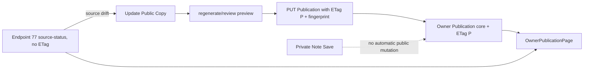

# Notes & Knowledge Workspace

# Frontend Low-Level Design

Status: Approved Baseline  
Date: 2026-09-14  
Baseline approval date: 2026-09-15

## 1. Purpose, authority, and implementation gate

This document defines the concrete browser-frontend architecture for Notes & Knowledge Workspace. It consumes the eleven Approved Baselines and `PROJECT_CONTEXT_HANDOFF.md`; it does not amend them. The browser is an untrusted client. The Spring Boot backend remains authoritative for identity, eligibility, ownership, lifecycle, concurrency, AI policy, publication, moderation, and file safety.

This is design only. It creates no React source, package manifest, Vite or TypeScript configuration, CSS, test, Playwright project, OpenAPI client, backend source, migration, Docker/CI artifact, roadmap, `AGENTS.md`, or Git repository. Approval of this baseline does not authorize implementation.

No Product, API, Security, or Technology baseline amendment is required by this design.

## 2. Approved runtime and dependency boundary

The frontend is a React SPA built by Vite with browser-history routing. It has no SSR framework, Next.js, Remix, Server Components architecture, PWA/service worker, Electron shell, or native-mobile shell. It is compatible with same-origin static assets plus relative `/api/...` calls; exact asset hosting remains Deployment-owned.

| Concern | Approved baseline |
|---|---|
| UI runtime | React 19.3.0 and React DOM 19.3.0; no React Compiler or experimental behavior by default |
| Language | TypeScript 7.0.2, strict direction |
| Toolchain | Node.js 24.21.0 LTS, bundled npm 11.19.0, Vite 8.2.2, `@vitejs/plugin-react` 6.1.1 |
| Remote state | TanStack Query 5.102.8 |
| Routing | React Router 8.3.1 through `react-router` / `react-router/dom`, not removed `react-router-dom` |
| Forms | React Hook Form 7.87.0 for structured forms, not the Note editor session |
| Future tests | Vitest 5.0.0; Testing Library React 16.3.3, DOM 10.4.1, user-event 14.6.7, jest-dom 7.0.1, jsdom 30.0.1; Playwright 1.63.0 |
| Markdown | `react-markdown` 10.1.0 and `remark-gfm` 4.0.1; raw HTML off; `rehype-sanitize` 6.0.0 only after the last unsafe transform if an unsafe HTML/plugin path is later approved |
| Authoring | A project-owned `MarkdownEditorAdapter` contract; no external editor package is selected |

No Redux, Zustand, MobX, Recoil, Axios, Tailwind, component framework, CSS-in-JS package, Zod, Storybook, alternate router/query library, or editor library is introduced. If implementation evidence later proves another dependency necessary, implementation must stop at that point and seek the appropriate Technology Baseline amendment.

## 3. Frontend architecture and dependency direction

```text
src/
  app/
    router/       route definitions, gates, lazy boundaries
    providers/    QueryClient and narrow technical contexts
    shell/        public/private shells and responsive navigation
    api/          fetch transport, Problem Details, ETag/Location decoding
    security/     session bootstrap, CSRF manager, sensitive-state clearing
    errors/       route boundaries and typed error presentation
  features/
    auth/
    profile/
    notes/
    knowledge/
    publishing/
    discovery/
    moderation/
  shared/
    ui/           small semantic primitives
    hooks/        product-neutral browser hooks only
    formatting/   safe display formatting only
    accessibility/
    types/        truly shared transport primitives only
```

`app` composes routing and technical providers. `features` owns user journeys and API interactions. `shared` contains presentation/technical primitives, never business workflows. There is no business-bearing `common` or `utils` bucket and no mechanical copy of Java module packages.

The compile-time direction is `app → features → shared`. Feature-to-feature use is through narrow public exports and page composition; low-level components never import entire unrelated features. Cycles are prohibited. A Note page is composed by the route layer from Notes editor UI, a Knowledge processing projection, and Publishing actions.



## 4. State ownership strategy

TanStack Query owns remote/server state in a memory-only cache. React Hook Form owns conventional form editing and validation. Component state or a local reducer owns transient workflows. A Note-scoped `NoteEditorSession` reducer owns unsaved title/Markdown and its concurrency base. React Context is limited to technical composition such as current session shell wiring; it is not a general product store. Server collections are never copied into Redux-like state.

`ViewerCacheScope` is a narrow frontend-local cache-identity value for public server representations that contain current-viewer fields. Anonymous authority uses the constant `anonymous`; each newly established fully authenticated browser authority receives a fresh in-memory `viewerEpoch`. The epoch is non-authoritative, non-secret, contains no Account identifier or server identity, is never persisted or placed in a URL, and is never sent as authentication or authorization. It exists only to prevent one viewer-conditioned Query representation from being reused for another viewer.

### 4.1 State ownership matrix

| State | Owner and location | Cacheable | URL-visible | Browser persistence | Invalidation | Sensitivity |
|---|---|---:|---:|---:|---|---|
| Authenticated session projection | Auth query, Query memory | no-store response; short memory | no | no | boot, auth transition, 401/ineligibility | high |
| `ViewerCacheScope` | `SessionCoordinator` memory (`anonymous` or fresh local epoch) | identity component only | no | never | full-authority establishment/change/loss | non-secret; no identity |
| CSRF token | `CsrfManager` closure/ref | no Query cache | no | no | rotation, logout, refresh failure | secret-like proof |
| Email verification/reset/email-change token | narrow `AuthContinuationState` memory | no | fragment only until immediate capture/scrub | never | consumption, loss, expiry, flow exit | critical one-time secret |
| Pre-MFA challenge identifier | narrow `AuthContinuationState` memory | no | no | never | success, expiry, logout, reload | sensitive opaque continuation |
| Recent-auth return intent | narrow `AuthContinuationState` memory | no | no sensitive payload | never | successful return, cancellation, authority loss | sensitive workflow reference |
| Current Account/security summary | Auth query memory | bounded memory | no | no | credential/MFA/link/session changes | high |
| Private Profile response | Profile query memory | bounded memory | no | no | profile/avatar mutation | private |
| Note collection | Notes query memory | yes, bounded pages | filters are not URL state for private views | no | Note create/lifecycle/tag/pin/bulk changes | private |
| Authoritative Note core | Notes query memory | yes | only opaque Note route ID | no | Save and core commands | highest private content |
| Note ETag | beside `Etagged<Note>` and editor base | memory only | no | no | successful core response/refetch when clean | concurrency-sensitive |
| Unsaved title/Markdown | `NoteEditorSession` reducer | no | no | no | explicit discard or successful Save | highest private content |
| Dirty state | editor-derived comparison | no | no | no | edit, Save, explicit discard | private workflow |
| Save phase/error/conflict | editor reducer | no | no | no | Save lifecycle/reconciliation | private workflow |
| Note AI-processing projection | separate Knowledge query memory | bounded polling only | no | no | Note AI/Save/Attachment changes and poll result | private operational |
| Attachment upload progress | `AttachmentUploadSession` local reducer | no | no | no | completion/abort/unmount | private operational |
| Attachment metadata + ETag | Notes query memory | bounded | opaque route ownership only | no | upload/delete/refetch | private |
| Attachment AI processing | endpoint-65 projection | bounded polling | no | no | AI state and processing transitions | private operational |
| Private-search text | controlled Notes state | no | no | no | user edit/route exit | highest private query |
| Private-search results | Notes query memory keyed by ephemeral epoch | bounded | no | no | search input epoch, Note mutations | private content |
| Ask question | Knowledge workflow reducer | no | no | no | submit/clear/route exit | highest private query |
| Knowledge operation handle | workflow closure plus alias key | poll only | no | no | terminal/cancel/session loss | sensitive opaque locator |
| Knowledge result/citations | Knowledge workflow/query memory | bounded until workflow exit | no | no | operation terminal/session loss | highest private content |
| Owner Publication core + ETag | Publishing query memory | bounded | opaque route ID only | no | create/update/unpublish/republish | private owner state |
| Publication source status | separate endpoint-77 query | bounded volatile | no | no | Note/publication mutation and polling/refetch | private projection |
| Public Explore filters | Discovery route state | yes | yes, canonical bounded values | no required persistence | URL/filter changes | public |
| Public search q/tag | Discovery route state | yes | yes | no required persistence | URL/filter changes | public |
| Profile forms | React Hook Form component state | no | no | no | submit/reset/unmount | private |
| MFA secret/QR | enrollment component state | no | no | never | activation/exit | critical secret |
| Recovery codes | one-time component state | no | no | never | explicit leave/clear | critical secret |
| Moderation queue/detail | Moderation Query memory | bounded | opaque report route only | no | begin/decision/capability loss | restricted |

### 4.2 Browser-storage privacy

`localStorage`, `sessionStorage`, IndexedDB, service-worker caches, and persisted Query caches contain no session/auth token, CSRF token, Note content/draft, private search or Ask text/results, private citation, unnecessary Attachment metadata, Profile/security data, MFA material, recovery/reset material, or moderation data. Public URL filters are navigation state rather than storage. Any future harmless display preference requires separate justification.

Logout, current-session loss, Account suspension/deletion, or an authoritative ineligible result invokes one `clearSensitiveClientState` boundary: cancel in-flight private queries, clear authenticated Query cache, remove public Query entries conditioned on the ending authenticated `ViewerCacheScope`, dispose editor/Ask/upload/MFA/moderation reducers, revoke local object URLs, clear CSRF memory, switch the viewer scope to `anonymous`, and move to a safe auth state. Viewer-neutral public entries need not be destroyed. The epoch is never written to `localStorage`, `sessionStorage`, IndexedDB, or another persistent store.

## 5. Browser route architecture

The route tree contains 27 browser routes. `/notes`, `/notes/{id}`, `/explore`, and `/profile/{handle}` preserve upstream paths. Other browser paths below are Frontend LLD navigation decisions; they are not API paths or authorization identities.

```mermaid
flowchart TD
    Boot[Session Unknown] --> Session[GET /api/auth/session]
    Session -->|Anonymous| Public[PublicRoute / AnonymousOnlyRoute]
    Session -->|PrimaryOnly| MFA[PreMfaRoute: /mfa only]
    Session -->|Full| Private[FullSessionRoute: private shell]
    Public --> Explore[/explore and public routes]
    Public --> Auth[/signup /login recovery]
    Private --> Notes[/notes and /notes/id]
    Private --> Ask[/ask]
    Private --> Settings[/settings/*]
    Private --> OwnerPub[/publications/*]
    Private --> ModGate[ModerationRoute]
    ModGate -->|authorized| Mod[/moderation/reports]
    ModGate -->|typed recent-auth or MFA required| Reauth[/reauth then explicit return]
    ModGate -->|typed capability missing or revoked| Private
```

`AnonymousOnlyRoute`, `FullSessionRoute`, `PreMfaRoute`, `PublicRoute`, and `ModerationRoute` are UX gates. They never replace backend checks. Pre-MFA renders only the challenge surface and triggers no Note, Profile, Knowledge, Publication-owner, or moderation query. With no approved capability-introspection endpoint, moderation is entered directly and the first queue request determines access. A safe typed recent-auth/MFA requirement enters reauthentication with only an in-memory return intent; only a typed missing/revoked moderation capability clears moderation state and exits the route. A CSRF-specific 403 follows the global controlled refresh policy. Status 403 alone is never treated as capability loss.

### 5.1 Route matrix

| # | Browser path / route ID | Gate; owner | Primary queries and mutations | Route states | Responsive behavior |
|---:|---|---|---|---|---|
| 1 | `/` — `landing` | Public; app/discovery | session; public navigation | loading, marketing/entry, error-safe | simple single column |
| 2 | `/signup` — `signup` | AnonymousOnly; auth | registration | submitting, generic accepted, validation/rate/error | compact form |
| 3 | `/verify-email` — `verifyEmail` | Public; auth | fragment capture/scrub; verify confirmation/resend | pending, generic accepted, success, lost/expired/conflict | compact result/form |
| 4 | `/login` — `login` | AnonymousOnly; auth | password login, OIDC start | submitting, MFA-required, error | compact form |
| 5 | `/mfa` — `mfaChallenge` | PreMfa; auth | memory-only TOTP/recovery challenge | missing/reload restarts login; invalid/expired, submitting, error | focused single task |
| 6 | `/forgot-password` — `passwordResetRequest` | Public; auth | blind reset request | submitting, generic accepted, error | compact form |
| 7 | `/reset-password` — `passwordResetConfirm` | Public; auth | fragment capture/scrub; reset confirmation | lost/invalid/expired, submitting, success, error | compact form |
| 8 | `/auth/complete` — `authCompletion` | Public; auth | session and CSRF refresh after backend callback | loading, MFA/full/anonymous/error | transient status page |
| 9 | `/reauth` — `recentAuth` | Full; auth | password/OIDC reauth | method choice, submitting, return/error | dialog-like page/sheet |
| 10 | `/notes` — `notesIndex` | Full; notes | preferences, Note pages, private search | loading, empty, results, offline/error | desktop list+empty detail; phone list |
| 11 | `/notes/new` — `noteCreate` | Full; notes | preferences; create Note | local draft, submitting, error | full editor surface |
| 12 | `/notes/{id}` — `noteEditor` | Full; notes composition | Note, Attachments, versions, endpoint 65; Save/core/media/version/publication actions | loading, dirty, saving, conflict, processing, unavailable | split panes desktop; route-driven single pane phone |
| 13 | `/ask` — `askKnowledge` | Full; knowledge | policy; Ask and operation poll/cancel | idle, running, insufficient, complete, degraded/error | answer/evidence stack; collapsible evidence phone |
| 14 | `/publications` — `ownerPublications` | Full; publishing | owner Publication pages | loading, empty, list, error | list/detail navigation |
| 15 | `/publications/{publicationId}` — `ownerPublication` | Full; publishing | owner core, ETag, endpoint 77; update/unpublish/republish | loading, current/drifted, preview, conflict/error | detail plus contextual actions |
| 16 | `/settings/profile` — `profileSettings` | Full; profile | private Profile; profile/avatar mutations | loading, validation, saved/error | stacked sections phone |
| 17 | `/settings/public-profile` — `publicProfileSettings` | Full; profile/publishing | private Profile; public activation | inactive/active, conflict, saved/error | focused projection preview |
| 18 | `/settings/security` — `securitySettings` | Full; auth | security summary; email-change fragment ingress; password/email/OIDC mutations | loading, token lost, recent-auth required, error | section list/detail |
| 19 | `/settings/security/mfa` — `mfaSettings` | Full; auth | summary; enroll/confirm/disable/regenerate | setup, verify, codes-once, error | secure single-flow layout |
| 20 | `/settings/security/sessions` — `sessionSettings` | Full; auth | sessions; revoke one/others/all | loading, current marker, empty/error | responsive row actions |
| 21 | `/settings/privacy` — `privacySettings` | Full; notes/knowledge | Note preference, policy; preference/bulk AI/ack | loading, disclosure, confirmation/error | stacked controls |
| 22 | `/explore` — `publicExplore` | Public; discovery | Latest/Trending | loading, empty, cards, rate/dependency error | responsive card/list grid |
| 23 | `/explore/search` — `publicSearch` | Public; discovery | public q/tag search | loading, no matches, results/error | bounded filter bar; stacked phone |
| 24 | `/profile/{handle}` — `publicProfile` | Public; profile/discovery | public Profile and active Publications | loading, unavailable, empty/list | profile header plus cards |
| 25 | `/publication/{publicationId}` — `publicPublication` | Public; publishing/discovery/moderation | public snapshot/media; like/report | loading, unavailable, rendered content, media/rate/error | readable article; native media |
| 26 | `/moderation/reports` — `moderationQueue` | Moderation; moderation | report queue | loading, empty, permission-lost/error | table/list becomes cards |
| 27 | `/moderation/reports/{reportId}` — `moderationReport` | Moderation; moderation | detail; begin review/terminal decision | loading, public evidence, conflict, permission-lost | focused review and accessible decision form |

Backend-directed `/api/auth/oidc/google/callback`, `/api/auth/reauth/oidc/google/callback`, and `/api/auth/oidc/google/link-callback` are not React routes. The backend validates them and redirects to an approved frontend destination such as `/auth/complete` or the originating safe screen.

## 6. Shell, responsive layout, and visual primitives

The private desktop shell centers Notes: primary sidebar navigation, a Note/search list pane where relevant, main editor/content, and a contextual panel only when attachments, processing, versions, or publication actions need it. Ask My Knowledge has a dedicated entry. Settings and Profile are secondary. The public shell is lighter and separates Explore, public search, Profile, and Publication navigation.

Tablet/narrow desktop collapses the sidebar and makes contextual panels overlays or sheets. Phone uses route-driven single-pane list/editor/detail navigation; it never squeezes desktop columns. Dialogs become appropriately sized sheets, Attachment actions remain reachable, Ask evidence stacks below answers, settings become sections, and public cards become a single readable column. Native media controls remain usable at every size.

The visual system uses CSS custom properties for typography, spacing, color, radius, elevation, and motion plus dependency-free CSS Modules/local CSS. Semantic primitives are `Button`, `IconButton`, `TextField`, `MarkdownEditorShell`, `Checkbox`/`Switch`, `Select`, `Dialog`, `ConfirmDialog`, `Menu`, justified `Tabs`, `Toast`, `InlineAlert`, `Skeleton`, `EmptyState`, `LoadMore`, and `StatusBadge`. They form a small product UI kit, not an enterprise framework. Destructive confirmations use accessible application dialogs, never `window.confirm()`.

Accessibility is architectural: landmarks and heading order, native controls, labelled fields, associated errors and summaries, logical tab order, visible focus, keyboard operation, non-color status, reduced-motion support, live regions for Save/upload/processing, accessible loading/empty/error states, modal focus trap/restore and safe Escape behavior, touch-sized targets, useful alt text, and native accessible media controls. No `div` buttons are permitted.

## 7. API transport, errors, retries, and CSRF

### 7.1 Typed transport

`ApiClient` is a narrow Fetch-based same-origin transport using relative `/api/...` URLs and cookie credentials. It sends `Accept`/`Content-Type` correctly, attaches CSRF only to unsafe calls, decodes 200/201/202/204/206, and returns typed bodies plus separately captured ETag, Location, Retry-After, Content-Range, and response metadata. `Etagged<T>` keeps the validator adjacent to its authoritative resource; `CursorPage<T>` treats cursors as opaque.

`ProblemDetailsDecoder` maps RFC 9457 type/status/code and allowlisted field errors without displaying untrusted `detail`, stack traces, or internal metadata. Expected API/domain failures use contextual UI, while route/feature error boundaries handle unexpected render defects with safe navigation and retry/reload. Generic response-body logging is prohibited.

Safe reads may retry a bounded number of times only for network/transient 5xx failures. Reads do not retry 400, 401, 403, 404, 409, 412, 422, or 428. Mutations never receive blanket automatic retries; visible user retry is explicit. Idempotent Like/Unlike does not loosen this rule. A 429 honors safe Retry-After without differentiating blind-flow Account existence. A 503 degrades the affected AI/provider feature while Notes editing, ordinary search, Attachment access, and AI settings remain usable.

### 7.2 CSRF and session bootstrap

`CsrfManager` obtains a token from `GET /api/auth/csrf`, retains it only in memory, and supplies `X-CSRF-TOKEN` to unsafe cookie-authenticated requests. React never reads the HttpOnly authentication cookie. After password/OIDC primary authentication, MFA elevation, logout/new anonymous session, or another authority-changing session replacement, it clears the old token and bootstraps a new one. A known CSRF-specific 403 may cause one controlled refresh/retry only when an approved code proves rejection occurred before mutation; arbitrary 403s are never retried.



## 8. Authentication and security workflows

The session bootstrap state machine is `Unknown → Anonymous | PrimaryOnly/MfaRequired | FullyAuthenticated`. Those are the only three bounded states returned by `GET /api/auth/session`. `AuthorityLost/Ineligible` is a derived local handling state entered only when a typed protected-operation result establishes current Account ineligibility; it is not a fourth session DTO state. Recent authentication is a transient server-controlled fact layered on a full session, not a separate durable login. Cookie presence, local storage, and stale React state prove nothing.

`SessionCoordinator` assigns `anonymous` scope while authority is Anonymous or PrimaryOnly. Anonymous-to-FullyAuthenticated and PrimaryOnly-to-FullyAuthenticated transitions establish a fresh authenticated `viewerEpoch`; a newly bootstrapped fully authenticated browser lifecycle does likewise. Logout, current-session revocation, Account deletion, effective current-session loss, or a switch from one authenticated Account to another removes cache entries conditioned on the former epoch before switching to `anonymous` or a new epoch. It does not rely on stale-time expiry. Establishing a fresh full-authority scope causes any currently viewed viewer-conditioned public representation to refetch; ordinary recent-auth elevation for the same continuing full session does not itself create a different viewer identity.



`AuthController` UI flows keep registration and recovery consumer-style: no Okta, tenant, invite-only, or administrator-created-user screen. Registration, verification resend, and password-reset request use one generic accepted component whose wording never confirms Account existence or delivery eligibility.

`AuthContinuationState` is a narrow in-memory flow holder, not an authentication store. It may temporarily hold only the active email-verification token, password-reset token, email-change confirmation token, opaque pre-MFA challenge identifier, or safe recent-auth return intent. It contains no session/auth credential, general Account state, provider token, or persistent mutation payload.

Security-email ingress uses existing routes and URL fragments: for example `/verify-email#<token-material>`, `/reset-password#<token-material>`, and the equivalent existing Security route for email-change confirmation. Before rendering diagnostics or starting API work, the auth ingress captures the fragment into `AuthContinuationState` and immediately removes it with History API replacement. The token is later sent only in the approved POST body. It never enters a query string, route-state persistence, local/session storage, IndexedDB, Query cache/key, analytics, or logs. If reload or full navigation loses it before consumption, the user must reopen the original email link.

Google OIDC starts by POSTing the approved authorization-start endpoint, then performs a top-level navigation to the returned target. Provider tokens are never decoded, stored, or exposed to React. The provider returns to a backend callback; after backend protocol validation/session establishment, React reboots session and CSRF state. Linking never uses client-side email matching. If OIDC recent-auth requires external navigation and an already approved server-side continuation cannot preserve the security-link flow, the client does not persist its one-time token; after reauth the user reopens the original email link.

MFA enrollment displays the returned QR/manual secret only in component memory, submits current TOTP, and displays recovery codes once after activation. Secrets and codes never enter Query persistence, URLs, clipboard without an explicit Copy action, or browser storage; leaving the flow clears them. The opaque pre-MFA challenge identifier returned after primary login lives only in `AuthContinuationState`, never in `/mfa` or browser persistence, and is cleared on success, expiry, logout, or reload. If `/mfa` reloads without it, the route safely returns the user to restart primary login. Pre-MFA supports TOTP or one recovery code without rendering the private shell.

Session management uses only safe descriptors and opaque handles. Revoke-one, revoke-others, revoke-all, logout, password reset, and security changes apply the approved consequences. Current-session loss clears private state immediately. Recent-auth-required actions hold only a minimal intended-action reference in memory, route to password or Google reauth as supported, and never persist the sensitive mutation payload.

## 9. Note editor and concurrency architecture

### 9.1 Server state versus local draft

The TanStack Query entry contains the latest observed `Etagged<NoteCore>`. The editor never controls inputs directly from that object. On initial load, `NoteEditorSession` copies title/Markdown into a baseline and draft and stores the authoritative ETag as its concurrency base. It owns `noteId`, baseline title/Markdown, draft title/Markdown, current ETag, dirty calculation, `Clean | Dirty | Saving | SaveFailed | Conflict`, last error, and `serverChangedWhileDirty`.



The authoring shell provides title, Markdown source editing, keyboard formatting affordances, Ctrl/Cmd+S, visible state, optional source/preview split, Attachment insertion/navigation, readable typography, IME-friendly input, responsive editing, and accessible controls. Markdown source remains authoritative. `MarkdownEditorAdapter` isolates implementation mechanics without selecting CodeMirror, Monaco, TipTap, Lexical, ProseMirror, or another unapproved dependency.

### 9.2 Explicit Save

```mermaid
sequenceDiagram
    participant U as User
    participant E as NoteEditorSession
    participant A as ApiClient
    participant Q as Query cache
    U->>E: edit title/Markdown
    E->>E: Dirty
    U->>E: Save or Ctrl/Cmd+S
    E->>A: PUT /api/notes/{id}, If-Match current editor ETag
    A-->>E: 200 Note core + new ETag
    E->>Q: replace authoritative core + ETag
    E->>E: baseline=draft; preserve returned fields; Clean
```

Network/5xx failure preserves the exact draft in `SaveFailed` with persistent inline Retry. Successful Save updates baseline and ETag. It never invents autosave, generic mutation retry, or a force-write path.

### 9.3 Same-tab immediate core command while dirty

Pin/unpin, tag replacement, archive/return, and per-Note AI ON/OFF may commit while title/body are dirty. The command sends the editor's current ETag. On success, the editor adopts the returned newer ETag and only the relevant authoritative non-editor field; draft title/Markdown and their dirty calculation remain intact. A later Save uses that new ETag.



A background refetch or other tab showing a newer revision is different: when dirty, the editor must not adopt that unreviewed ETag. It retains draft and base, marks `serverChangedWhileDirty`, and enters reconciliation on Save or explicit review.

### 9.4 Stale-write conflict



`412` means stale concurrency; `409` means a current-state domain conflict. A `428` means the client omitted a required precondition: preserve draft, refetch for diagnosis, show a recoverable application error, and never silently resubmit. Unsaved navigation uses in-app blocking plus browser `beforeunload` where supported; it does not persist the draft.

### 9.5 Create, collection, commands, and versions

Create Note starts as a local editor session. It initializes “Use this note with AI” from the future-Note preference and permits an override. Only `POST /api/notes` creates identity; success captures Location and ETag and navigates to `/notes/{id}`. Merely visiting `/notes/new` creates no hidden Note.

One Notes collection query family covers active, pinned, archived, trash, tags, filters, sorting, and opaque cursor pages. No duplicated store exists per view. Ordinary private search is POST-based; text stays in controlled memory, never URL/history/storage/analytics, and uses server FTS/trigram independently of AI so AI-OFF Notes remain searchable. Debounce timing is implementation tuning.

Version history lists and inspects immutable checkpoints. Restore requires explicit confirmation and current Note ETag, creates a new Note core/ETag, and never destroys a dirty editor without a deliberate reconciliation/discard decision.

Published-source trash/delete handles `publication_consequence_required` with an accessible confirmation that proceeding unpublishes. No keep-public option appears. Permanent deletion, unpublish, Account deletion, MFA disable, recovery-code regeneration, bulk AI changes, and moderation enforcement also require deliberate accessible confirmation.

Server-derived features operate only on successfully saved Note state. Ordinary server search, Ask My Knowledge/retrieval, Related Notes, organization suggestions, publication preview, and preview-backed create/update/republish do not contain the unsaved local draft. The frontend never merges draft content into server corpus results. This is a visible consequence of explicit Save, not a hidden limitation.

From `NoteEditorPage`, Related Notes (endpoint 71), organization suggestions (endpoint 72), and publication preview (endpoint 73) require `NoteEditorSession` to be `Clean`. When dirty, their controls do not submit and show persistent contextual guidance to save changes first. After Save succeeds, the returned ETag becomes the operation/preview base and the action may run against that saved revision. There is no hidden Save.

## 10. Note AI participation and processing policy

`note.aiEnabled` and current processing-policy acknowledgement are independent. A Note may remain AI ON while processing is blocked pending acknowledgement. The UI shows that state and a deliberate disclosure action; it never silently toggles the Note OFF or auto-accepts a new policy.

`GET /api/ai/processing-policy` displays the exact current disclosure and need. `POST` acknowledgement is deliberate and idempotent. On `processing_policy_changed`, refetch, display the replacement, and require a new action. Users never select provider, model, vector mode, query class, or retrieval algorithm.

Endpoint 65 has a separate query identity and lifecycle from Note core. It may poll only while an approved product status is in progress, with bounded scheduling, visibility/offline awareness, and stop on stable/terminal/unmount/401/404. Its updates never alter Note/Attachment ETags, editor baseline, draft, or dirty state.

Bulk AI enable/disable is separately confirmed and never changes the future-Note default. If it advances the revision of an open clean Note, normal refetch may adopt it; a dirty editor retains its base/draft and marks a server change.

## 11. Attachments and media

The UI supports exactly image, audio/voice, bounded video, and PDF. Browser `accept` and local size/type checks are hints only; the server validates authoritative type, structure, limits, and lifecycle. There is no arbitrary file manager, Office/ebook support, or inference from extension alone.

`AttachmentUploadTransport` is a narrow dependency-free XMLHttpRequest adapter only where upload progress is needed; it supplies same-origin credentials, CSRF, progress, abort, and safe response decoding. JSON traffic remains Fetch-based. The file-input value is cleared after completion/failure so the same file can be selected again.

```mermaid
sequenceDiagram
    participant U as User
    participant X as AttachmentUploadTransport
    participant A as API
    participant Q as Attachment query
    participant P as endpoint 65 query
    U->>X: select supported file; local UX preflight
    X->>A: multipart + cookie + CSRF; progress/abort
    A-->>X: initial implementation 201 + Attachment + ETag
    X->>Q: insert/invalidate authoritative metadata
    X->>P: invalidate processing projection
    par independent UI state
        Q-->>U: stored Attachment remains usable
        P-->>U: excluded/queued/indexing/ready/failed/retrying
    end
```

Upload state is `selected | uploading | validating | accepted | uploadFailed`; AI state comes separately from endpoint 65. AI failure cannot erase or hide a stored Attachment, and AI retry never implies byte re-upload.

Images use responsive rendering, audio/video native accessible controls with bounded preload, and PDFs use backend-mediated open/download. Content URLs remain same-origin API URLs; object-store keys are never exposed. Large media is not buffered into JavaScript ArrayBuffers merely to render it. 200/206 are supported; 416 becomes a contained media error. Local preview object URLs are revoked.

Attachment metadata and strong ETag are captured together. Delete sends If-Match, removes/invalidate private metadata and endpoint 65 on success, and leaves already copied public snapshot media unchanged. The UI points users to Update Public Copy or Unpublish for public removal.

## 12. Ask My Knowledge and related assistance

Ask My Knowledge is a dedicated `/ask` workflow, not a floating chatbot. Local memory owns the question. Results distinguish deterministic results, AI answer, citations, coverage/completeness, insufficient evidence, degradation, and current operation state. Questions, answers, private citations, and operation handles never enter URLs, storage, analytics, or persisted chat history.

```mermaid
sequenceDiagram
    participant U as Ask workflow
    participant A as POST /api/knowledge/query
    participant O as Operation poller
    U->>A: private question in request body
    alt immediate
        A-->>U: 200 structured result/citations/coverage
    else tracked asynchronous
        A-->>U: 202 + opaque Location/operation handle
        loop bounded, visible/online, nonterminal
            O->>A: GET operation; respect Retry-After/cap
            A-->>O: current status/result
        end
        O-->>U: completed/failed/cancelled/obsolete
    end
    opt user cancellation
        U->>A: DELETE operation + CSRF
    end
```

The reusable poll scheduler stops on terminal state, explicit cancellation, route exit, session loss, or configured bound; pauses offline; reduces hidden-tab work; and survives transient poll failure without resubmitting the original query. The opaque handle is retained through an in-memory alias and never decoded.

Citations use only approved locators, navigate through owner-authorized Note/Attachment routes, and retain source evidence. Unsupported or conflicting evidence remains visible. Related Notes and organization suggestions are AI-dependent and operate on the current saved Note revision only; a dirty editor blocks submission until Save succeeds. If unavailable they return no fabricated results. Suggestions require explicit user confirmation before any tag/topic mutation.

## 13. Publishing and public/private separation

Owner publishing is explicit: clean, saved private Note → Publish → preview → select approved public fields/media → confirm exact fingerprint → create Publication. Before endpoint 73, `NoteEditorSession` must be `Clean` and the request uses the current saved ETag. A dirty editor shows persistent “Save changes before using this action” guidance and does not submit or perform a hidden Save. After Save, its returned ETag becomes the preview base. The fingerprint is opaque, in-memory workflow state only; a later Note mutation leaves the server fingerprint/ETag contract authoritative and may make the preview stale, requiring regeneration and fresh review. Local unsaved draft content is never published directly. Private Save and later private Attachment changes never mutate the current public snapshot.



Endpoint 77 is a distinct volatile owner query from Publication core/ETag. It may show private source existence, drift, or update readiness and offers Update Public Copy; it never mutates or advances the Publication validator.



After a successful unpublish, moderation removal, confirmed source-Note retirement/unpublish, or another known Publication logical-denial result, the mutation handler synchronously removes or replaces the exact known viewer-scoped public Publication cache entries so this client cannot keep rendering it as active. It also removes the item from currently materialized public collection pages where practical, then invalidates/refetches Explore, public search, author Publication lists, and applicable owner/source-status families. This client-cache denial complements backend authority; it cannot erase bytes already rendered in another tab/browser.

After successful public-copy update or republish, the handler replaces or evicts the exact currently materialized viewer-scoped public Publication entries before invalidating affected public collections, so an already open client does not retain the old snapshot indefinitely. This is freshness, not authorization. Republish/update still requires approved preview/checkpoint semantics. Copied public media remains distinct from private Attachment data.

Public pages consume only public DTOs and caches. `PublicPublicationPage` cannot accept `NoteResponse`; `NoteEditorPage` cannot substitute a Publication DTO. Owner pages may compose owner core and source status but never feed a private DTO into public rendering.

## 14. Public discovery, Profiles, and Likes

Public surfaces are Explore Latest/Trending, public q/tag search, public Profile with active Publications, and stable public Publication. Public filters may use canonical bounded URL state; private search/Ask may not. Cursors remain opaque and are not decoded or exposed as human-editable semantics. There is no feed, following, comments, DMs, personalization, or creator analytics.

Private Account settings, private Profile editing, and explicit public-profile activation are separate. Registration does not require a handle. A usable unique handle is requested only before activation/first publication. Private Profile/avatar edits do not touch public caches; only successful activation/refresh does. That explicit result invalidates/removes the old public Profile key if the handle changed, the current/new Profile key, author Publication lists, known cached public Publications by that author, and materialized Explore/search pages containing the author's projection. It uses targeted family invalidation and need not enumerate the corpus. Local avatar preview URLs are revoked and server acceptance remains authoritative.

`PublicPublicationView` is public content but may include the current authenticated viewer's Like state, so its cache identity is viewer-conditioned. Like PUT/DELETE requires authentication and is server-idempotent. A bounded optimistic update snapshots and changes only the exact Publication entry under the current `ViewerCacheScope`; it updates currently materialized current-viewer list projections only when their approved DTO actually exposes viewer Like state, rolls back that same scope on definite failure, and refetches authoritative state on ambiguity. It never mutates the anonymous entry, a historical authenticated epoch, a viewer-neutral DTO, or Publication content. Anonymous Like preserves a safe return route through in-memory/navigation state while prompting login. Approximate views are displayed as approximate and their tracking never blocks public read UX.

## 15. Settings and destructive security actions

Settings separate Profile, public Profile, password/email and external sign-in, MFA, sessions, AI/Privacy, and Account deletion. Public forms never receive password, MFA, session, OIDC subject, privilege, or private Account fields. React Hook Form owns signup/login/reset, Profile, Account/security, publication confirmations, and moderation decisions; the Note editor does not use it as its state authority.

The AI/Privacy page explains that “Default AI access for new notes” initializes future creates only. Existing Notes change only through separate confirmed bulk enable/disable actions. Processing disclosure stays accessible.

Account deletion requires recent-auth/MFA and confirmation. On 204 the client does not wait for cleanup: it clears all sensitive state, CSRF memory, editors, query cache, and returns to signed-out UI. Password/email/MFA/OIDC changes invalidate security/session summaries as appropriate and honor server-driven session consequences.

## 16. Moderation and reporting boundary

Public Report submission sends only an approved reason and bounded optional public context. Success reveals no queue or enforcement state. Reporters gain no report-status browsing.

Moderation exposes only queue, public/report detail, begin review, and allowlisted terminal decision. There is no generic admin dashboard, private Note/Attachment view, private search/RAG, privilege management, or broad account browser. `ModerationRoute` is only a UX gate; every API call depends on live server authorization. A 403 is dispatched by an approved safe Problem Details code: `recent_authentication_required` or an MFA requirement opens reauthentication with only a safe in-memory moderation return intent; a typed missing/revoked moderation capability clears moderation caches and exits moderation while the ordinary Account session may remain; a CSRF-specific code follows the one-refresh CSRF policy. The client never infers the cause from status alone.

```mermaid
sequenceDiagram
    participant R as ModerationRoute
    participant Q as Report queue/detail API
    participant D as Decision workflow
    R->>Q: first authorized queue request
    alt moderation.review + current recent-auth/MFA satisfied
        Q-->>R: public/report DTO only
        R->>Q: begin review + CSRF
        R->>D: reasoned allowlisted decision
        D->>Q: terminal command + recent-auth/MFA + CSRF
        Q-->>D: 201 only after required consequences
    else typed recent-auth/MFA required
        Q-->>R: 403 safe reauth code
        R->>R: enter reauth with memory-only return intent
    else typed capability revoked/absent
        Q-->>R: 403 capability code
        R->>R: clear moderation cache; leave moderation UI
        Note over R: ordinary Account session may remain
    end
```

## 17. Safe Markdown and content rendering

`MarkdownView` uses `react-markdown` plus `remark-gfm`; raw HTML is disabled and `dangerouslySetInnerHTML` is prohibited for user content. Its renderer delegates every destination to `MarkdownUrlPolicy`. Clickable Markdown links use an allowlist of approved safe schemes plus safe `rel` and referrer behavior. Arbitrary Markdown image destinations—including `http`, `https`, `data`, and `blob`—render as a safe non-fetching representation such as alt text plus an optional policy-approved clickable link; they never become a network-loading ``. Only an explicitly recognized application-owned reference may delegate to `PrivateAttachmentView` through an authorized private backend route or `PublicMediaView` through a current public-media route. Attachment/public-media renderers sit outside arbitrary Markdown URL authority. Saved URLs are never automatically opened, resolved, previewed, crawled, or fetched.

The renderer chain is `MarkdownView → MarkdownUrlPolicy → safe link renderer | non-fetching arbitrary-image renderer`; recognized application media is rendered separately. If a later approved plugin creates an unsafe HTML/property path, `rehype-sanitize` becomes mandatory after the last unsafe transformation with a strict schema. Private and public renderers may share safe visual primitives, but `PrivateAttachmentView`, `PublicMediaView`, `CitationList`, and `SourceLink` accept distinct typed contracts. No new Markdown dependency is required.

## 18. Query-key catalog

Keys are created only by feature-owned factories. Private text never appears in a developer-visible key. Private search uses an in-memory random epoch incremented when criteria change; the request closure holds the body. Knowledge operations and restricted Report IDs use in-memory aliases rather than raw opaque handles in keys.

| Key shape | Owner | Parameters and privacy | Invalidation/refetch | Dev-tool safety |
|---|---|---|---|---|
| `sessionKeys.current()` | auth | private, no params | boot/auth/401/session mutation | restricted but content-free key |
| `securityKeys.summary()` | auth | private | password/email/MFA/OIDC changes | safe key |
| `securityKeys.sessions()` | auth | private | revoke/security consequences | safe key |
| `profileKeys.me()` | profile | private | Profile/avatar mutation | safe key |
| `profileKeys.public(handle)` | profile | public handle | activation and public changes | public |
| `profileKeys.publications(handle, filters, cursor)` | profile/discovery | public | publication availability/projection changes | public; cursor opaque |
| `notePreferenceKeys.current()` | notes | private | preference replacement | safe key |
| `noteKeys.list(normalizedFilters, cursor)` | notes | private structural filters only | create/core/lifecycle/tag/bulk changes | safe if filters contain no content |
| `noteKeys.core(noteId)` | notes | opaque ID | Save/core command/version restore | restricted locator |
| `noteKeys.attachments(noteId, cursor)` | notes | opaque IDs | upload/delete | restricted locator |
| `noteKeys.attachment(noteId, attachmentId)` | notes | opaque IDs | upload/delete/refetch | restricted locator |
| `noteKeys.versions(noteId, cursor)` | notes | opaque IDs | checkpoint-affecting operations | restricted locator |
| `noteKeys.version(noteId, versionId)` | notes | opaque IDs | immutable while available | restricted locator |
| `noteKeys.aiProcessing(noteId)` | knowledge | opaque ID, no text | processing/core/media changes; bounded poll | restricted locator |
| `noteKeys.privateSearch(searchEpoch, structuralFilters, cursor)` | notes | no query text | epoch and Note mutations | safe nonreversible session alias |
| `knowledgeKeys.policy()` | knowledge | private acknowledgement projection | acknowledgement/policy conflict | safe key |
| `knowledgeKeys.operation(operationAlias)` | knowledge | no raw handle | bounded poll/cancel/session loss | safe alias only |
| `publicationKeys.ownerList(filters, cursor)` | publishing | private structural | create/update/availability | safe structure; cursor opaque |
| `publicationKeys.owner(publicationId)` | publishing | private opaque ID | update/unpublish/republish | restricted locator |
| `publicationKeys.sourceStatus(publicationId)` | publishing | private volatile | Note/publication changes | restricted locator |
| `publicationKeys.public(viewerScope, publicationId)` | publishing | public ID plus non-secret memory-only `anonymous`/local epoch; no identity | viewer change, update/unpublish/remove | public locator; scope is non-authoritative |
| `discoveryKeys.explore(sort, cursor)` | discovery | public | publication/like projection changes | public |
| `discoveryKeys.search(publicFilters, cursor)` | discovery | public q/tag/sort | publication/like projection changes | public |
| `moderationKeys.queue(filters, cursor)` | moderation | restricted structural | begin/decision | restricted |
| `moderationKeys.detail(reportAlias)` | moderation | no raw report locator | begin/decision/capability loss | safe alias; data restricted |

CSRF tokens, one-time security-link tokens, pre-MFA challenge IDs, editor drafts, upload progress, MFA setup, recovery codes, preview fingerprints, Ask questions, and recent-auth return intents are not Query keys.

Viewer scope is added only to a key whose approved response actually contains current-viewer data. `GET /api/public/publications/{publicationId}` requires it because `PublicPublicationView` may contain current authenticated Like state. Explore, public search, and public-Profile Publication-list keys remain viewer-neutral under their current approved DTOs. If a future approved DTO gains current-viewer engagement state, that specific key adopts the same rule; this LLD does not invent such fields.

## 19. Mutation and cache-invalidation matrix

| Mutation | Incorporate direct response | Targeted invalidation | Dirty-editor rule | ETag / optimism |
|---|---|---|---|---|
| Create Note | seed core + ETag | Note lists | becomes persisted editor | capture ET-N; no optimism |
| Save Note | replace core + ET-N | affected lists, processing, and known source Publication endpoint-77 status | baseline=draft | required ET-N |
| Pin/unpin | patch core from response | affected lists | preserve draft; adopt returned ET-N only same tab | required ET-N; no blind optimism |
| Archive/return/trash | replace/remove core | lifecycle lists and processing; confirmed source retirement synchronously evicts known public entry/materialized cards, then invalidates public/owner/source-status families | warn/preserve or leave after success | required ET-N |
| Replace tags | patch core | lists/search/related | preserve draft; adopt same-tab ET-N | required ET-N |
| Note AI toggle | patch core | processing/related/suggestions | preserve draft; adopt same-tab ET-N | required ET-N |
| Bulk AI | use summary | lists and affected processing/core observations | dirty editors flag server change | no per-Note client ETag |
| Attachment upload | insert response + ET-A | Attachment list, endpoint 65 | draft unaffected | no optimism |
| Attachment delete | remove private item | Attachment list/detail, endpoint 65 | draft unaffected; public cache unchanged | required ET-A |
| NoteVersion restore | replace Note + ET-N | core/lists/processing/versions | require draft handling first | required ET-N |
| Profile update/avatar | replace Profile | private Profile | n/a | no optimism |
| Public-profile activation | replace public projection | old/new public Profile, author lists, known author Publication views, and materialized Explore/search author projections | n/a | no optimism; private edits alone do nothing |
| Publish | seed owner core + ET-P and current viewer-scoped exact public entry when returned/available | owner list plus exact public page and public collection families | requires Clean saved editor | ET-N + fingerprint input |
| Update public copy | replace owner core + ET-P; replace/evict materialized viewer-scoped exact entries | owner/source status, exact public page, Explore/search/author lists | requires Clean saved preview source | ET-P + fingerprint |
| Unpublish | replace owner unavailable state; synchronously evict materialized viewer-scoped exact entries/cards | then invalidate owner/public/Explore/search/author/source-status families | private draft unchanged | ET-P; immediate client-cache denial |
| Republish | replace owner core + ET-P and replace/evict materialized viewer-scoped exact entries | then invalidate public collection families and source status | requires clean saved preview source | ET-P + fingerprint |
| Like/unlike | patch exact current viewer-scoped Publication state | current-viewer list projections only if their approved DTO includes Like state | n/a | rollback same scope; refetch on ambiguity |
| Report submission | show generic success | public Report form only | n/a | no optimism |
| Begin review | replace Report | queue/detail | n/a | server-idempotent; no optimism |
| Moderation decision/removal | replace/close detail; synchronously evict removed exact public entry/materialized cards | then invalidate queue/detail and public Publication/Explore/search/author families | n/a | no optimism; consequence atomicity |
| Password/email/OIDC/MFA | use safe response only | security/session summaries | n/a | clear/refresh session+CSRF when rotated |
| Login/MFA completion to full authority | use session result/bootstrap | establish fresh authenticated viewer scope; refetch viewed viewer-conditioned public state | n/a | never reuse anonymous/prior epoch |
| Revoke session/logout | use 204 | sessions; current loss removes old viewer-conditioned public entries, switches to anonymous, and clears all private cache | dispose editor | no optimism |
| Account deletion | none after 204 | remove old viewer-conditioned entries, switch to anonymous, and clear every private/auth key | dispose editor/workflows | logical denial wins |

There is no application-wide `invalidateQueries()` after routine mutations. Feature factories target affected keys. Only logout, Account deletion, effective current-session loss, or ineligibility clears all authenticated state.

## 20. Component and responsibility catalog

| Area | Named artifact | Responsibility |
|---|---|---|
| app | `AppRouter` | Declares browser routes, gates, and lazy boundaries. |
| app | `PublicShell` / `PrivateShell` | Compose public navigation or the authenticated Notes-centered layout without authorizing data. |
| app | `ApiClient` | Performs typed same-origin Fetch requests and captures headers separately. |
| app | `ProblemDetailsDecoder` | Converts allowlisted RFC 9457 failures into typed frontend errors. |
| app | `CsrfManager` | Keeps the current CSRF proof in memory and attaches it to unsafe requests. |
| app | `SessionCoordinator` | Bootstraps session state, establishes/rotates memory-only `ViewerCacheScope` on full-authority changes, removes prior viewer-conditioned entries when authority ends, and clears sensitive client state on authority loss. |
| app | `SensitiveStateRegistry` | Registers reducer/object-URL cleanup callbacks for session loss. |
| auth | `LoginPage`, `SignupPage`, `MfaChallengePage` | Render the three consumer authentication stages and their accessible forms. |
| auth | `BlindAcceptedPanel` | Shows enumeration-resistant registration/verification/reset acceptance text. |
| auth | `AuthContinuationState` | Holds only the active one-time security token, MFA challenge ID, or safe reauth return intent in memory. |
| auth | `SecurityLinkIngress` | Captures token material from a URL fragment, immediately scrubs it with History replacement, and never logs or persists it. |
| auth | `OidcNavigationCoordinator` | Starts backend OIDC transactions and performs top-level navigation without handling provider tokens. |
| auth | `MfaEnrollmentFlow` | Owns memory-only QR/secret verification and one-time recovery-code presentation. |
| auth | `SecuritySettingsPage` / `SessionSettingsPage` | Compose safe security summary, credential methods, and opaque session controls. |
| auth | `useSessionQuery` / `useSecurityMutations` | Expose typed auth reads and explicit non-retrying mutations. |
| profile | `ProfileSettingsPage` | Owns private Profile form and avatar workflow. |
| profile | `PublicProfileActivationPanel` | Requires explicit projection activation/refresh. |
| profile | `PublicProfilePage` | Renders only allowlisted public Profile and active Publication DTOs. |
| profile | `ProfileApi` / `ProfileMapper` | Call Profile endpoints and keep public/private types separate. |
| notes | `NotesIndexPage` | Composes lifecycle filters, server pages, and private search. |
| notes | `NoteEditorPage` | Composes editor, Attachments, versions, processing, and publishing actions. |
| notes | `NoteEditorSessionReducer` | Owns draft, baseline, ETag, Save, and conflict state. |
| notes | `MarkdownEditorAdapter` | Defines accessible Markdown authoring behavior without selecting a package. |
| notes | `PrivateSearchPanel` | Keeps query text in memory and renders POST search results. |
| notes | `AttachmentUploadTransport` | Uses XHR only for credentialed CSRF-protected progress/abort upload. |
| notes | `AttachmentPanel` / `VersionHistoryPanel` | Render authorized media metadata/content actions or immutable versions. |
| notes | `NotesApi` / `useNoteQueries` / `useNoteMutations` | Encapsulate endpoint calls, ETags, targeted keys, and explicit retries. |
| knowledge | `AskKnowledgePage` | Owns the dedicated private question/result/evidence workflow. |
| knowledge | `KnowledgeOperationPoller` | Polls one accepted operation under bounded visibility/offline rules. |
| knowledge | `ProcessingPolicyPanel` | Separates disclosure acknowledgement from Note AI state. |
| knowledge | `NoteProcessingPanel` | Renders endpoint-65 volatile Note/Attachment processing without touching editor state. |
| knowledge | `CitationList` / `SourceLink` | Present validated evidence and owner-authorized navigation. |
| knowledge | `KnowledgeApi` / `KnowledgeMapper` | Decode sync/async results, coverage, citations, and degradation. |
| publishing | `PublicationWorkflow` | Owns preview, media selection, fingerprint, confirmation, and create/update. |
| publishing | `OwnerPublicationPage` | Composes owner core/ETag with separate endpoint-77 source status. |
| publishing | `PublicPublicationPage` | Accepts and renders only public Publication DTOs. |
| publishing | `PublicationApi` / `PublicationMapper` | Keeps owner/public/source-status transport contracts distinct. |
| discovery | `ExplorePage` / `PublicSearchPage` | Render server-paged public Latest/Trending/q/tag results. |
| discovery | `LikeButton` | Applies bounded optimistic idempotent Like state with rollback/refetch. |
| discovery | `DiscoveryApi` | Encapsulates public paging/search/Like calls and opaque cursors. |
| moderation | `ModerationQueuePage` / `ModerationReportPage` | Render only approved queue, public evidence, review, and terminal decision UI. |
| moderation | `ModerationAccessHandler` | Clears only moderation state and exits on authoritative capability loss. |
| moderation | `ModerationApi` | Calls report/begin/decision endpoints without any private-resource path. |
| shared | `MarkdownView` | Safely renders Markdown with raw HTML disabled and URL policy applied. |
| shared | `MarkdownUrlPolicy` | Separates safe clickable links from non-fetching arbitrary image destinations and recognized application media. |
| shared | `ConfirmDialog`, `InlineAlert`, `SaveStatus`, `ProcessingStatus` | Provide accessible confirmation and persistent contextual status primitives. |

## 21. Complete 91-endpoint frontend interaction mapping

`Safe/CSRF` records HTTP safety and whether the SPA supplies CSRF. `Protocol` means the browser is directed through a backend callback; React does not Fetch it. Query-key effects use the factories in §18. Every opaque cursor, handle, and ID remains undecoded.

| # | Endpoint | Feature / client function | Route or workflow; session stage | Safe / CSRF | Cache, ETag, polling, redirect, or download behavior |
|---:|---|---|---|---|---|
| 1 | `GET /api/auth/csrf` | auth `getCsrf` | boot/any route; any browser state | safe / no | fill memory-only `CsrfManager`; no Query persistence |
| 2 | `GET /api/auth/session` | auth `getSession` | app boot and `/auth/complete`; any state | safe / no | replace `sessionKeys.current`; no-store authority |
| 3 | `POST /api/auth/registrations` | auth `beginRegistration` | `/signup`; Anonymous | unsafe / yes | generic accepted UI; no polling/location or existence signal |
| 4 | `POST /api/auth/email-verification/requests` | auth `requestVerification` | `/verify-email`; Anonymous | unsafe / yes | same generic accepted state; no polling |
| 5 | `POST /api/auth/email-verification/confirmations` | auth `confirmVerification` | `/verify-email`; Anonymous | unsafe / yes | 204 success; no cache authority inferred until session/login |
| 6 | `POST /api/auth/login/password` | auth `loginPassword` | `/login`; Anonymous | unsafe / yes | clear old CSRF; 200 full or 202 MFA state; refetch session/CSRF |
| 7 | `POST /api/auth/mfa/challenges/{challengeId}/totp` | auth `completeTotpChallenge` | `/mfa`; PrimaryOnly | unsafe / yes | on 200 clear/refetch session+CSRF; never load private data before success |
| 8 | `POST /api/auth/mfa/challenges/{challengeId}/recovery-code` | auth `completeRecoveryChallenge` | `/mfa`; PrimaryOnly | unsafe / yes | same full-session transition and sensitive-state clearing |
| 9 | `POST /api/auth/logout` | auth `logout` | any shell; any state | unsafe / yes | clear all private state and old CSRF; bootstrap anonymous token if needed |
| 10 | `POST /api/auth/oidc/google/authorizations` | auth `startGoogleLogin` | `/login`; Anonymous | unsafe / yes | receive target then top-level navigation; no provider token in React |
| 11 | `GET /api/auth/oidc/google/callback` | backend OIDC callback | provider → backend → `/auth/complete` | protocol / no SPA CSRF | React never fetches; destination refetches session and CSRF |
| 12 | `POST /api/auth/password-reset/requests` | auth `requestPasswordReset` | `/forgot-password`; Anonymous | unsafe / yes | generic 202, no polling/location/existence signal |
| 13 | `POST /api/auth/password-reset/confirmations` | auth `confirmPasswordReset` | `/reset-password`; Anonymous | unsafe / yes | 204; clear any auth/private state because sessions are revoked |
| 14 | `POST /api/auth/reauth/password` | auth `reauthenticatePassword` | `/reauth`; Full | unsafe / yes | refetch session/security fact; resume only in-memory intended action |
| 15 | `POST /api/auth/reauth/oidc/google/authorizations` | auth `startGoogleReauth` | `/reauth`; Full | unsafe / yes | top-level redirect; retain only safe in-memory return intent |
| 16 | `GET /api/auth/reauth/oidc/google/callback` | backend reauth callback | provider → backend → safe return | protocol / no SPA CSRF | React never fetches; refetch session/CSRF and resume intent |
| 17 | `GET /api/me/security` | auth `getSecuritySummary` | `/settings/security` or MFA; Full | safe / no | `securityKeys.summary`; no persistent cache |
| 18 | `PUT /api/me/security/password` | auth `changePassword` | `/settings/security`; Full+recent/MFA | unsafe / yes | invalidate security/session; honor rotation and refresh CSRF |
| 19 | `POST /api/me/security/email-change/requests` | auth `requestEmailChange` | `/settings/security`; Full+recent/MFA | unsafe / yes | generic 202; invalidate summary only when authoritative state changes |
| 20 | `POST /api/me/security/email-change/confirmations` | auth `confirmEmailChange` | `/settings/security`; Full+recent/MFA | unsafe / yes | invalidate security/session; apply rotation consequences |
| 21 | `POST /api/me/security/mfa/totp/enrollments` | auth `beginTotpEnrollment` | `/settings/security/mfa`; Full+recent | unsafe / yes | keep secret/QR only in local enrollment state; no Query cache |
| 22 | `POST /api/me/security/mfa/totp/enrollments/{enrollmentId}/confirmation` | auth `confirmTotpEnrollment` | MFA enrollment; Full+recent | unsafe / yes | show recovery codes once in memory; invalidate security/session |
| 23 | `DELETE /api/me/security/mfa/totp` | auth `disableTotp` | MFA settings; Full+recent/proof | unsafe / yes | confirmed; invalidate security/session and refresh authority if rotated |
| 24 | `POST /api/me/security/mfa/recovery-codes` | auth `regenerateRecoveryCodes` | MFA settings; Full+recent/MFA | unsafe / yes | show replacement codes once in memory; invalidate summary |
| 25 | `POST /api/me/security/oidc/google/link-authorizations` | auth `startGoogleLink` | Security settings; Full+recent/MFA | unsafe / yes | top-level provider navigation; no token handling |
| 26 | `GET /api/auth/oidc/google/link-callback` | backend link callback | provider → backend → Security settings | protocol / no SPA CSRF | React never fetches; refetch session/security/CSRF |
| 27 | `DELETE /api/me/security/oidc-links/{linkId}` | auth `unlinkGoogle` | Security settings; Full+recent/MFA | unsafe / yes | invalidate security/session; display current-state conflict inline |
| 28 | `GET /api/me/security/sessions` | auth `listSessions` | `/settings/security/sessions`; Full | safe / no | `securityKeys.sessions`; opaque handles only |
| 29 | `DELETE /api/me/security/sessions/{sessionHandle}` | auth `revokeSession` | Session settings; Full+recent by policy | unsafe / yes | invalidate session list; if current authority lost, clear all private state |
| 30 | `POST /api/me/security/sessions/revoke-others` | auth `revokeOtherSessions` | Session settings; Full+recent/MFA | unsafe / yes | invalidate sessions; current shell stays subject to refetch |
| 31 | `POST /api/me/security/sessions/revoke-all` | auth `revokeAllSessions` | Session settings; Full+recent/MFA | unsafe / yes | clear all authenticated cache/workflows and CSRF after 204 |
| 32 | `DELETE /api/me/account` | auth `deleteAccount` | Security settings; Full+recent/MFA | unsafe / yes | deliberate confirmation; on 204 clear all state without cleanup polling |
| 33 | `GET /api/me/profile` | profile `getMyProfile` | `/settings/profile`; Full | safe / no | `profileKeys.me` |
| 34 | `PUT /api/me/profile` | profile `replaceMyProfile` | Profile settings; Full/recent if required | unsafe / yes | replace/invalidate private Profile; field/domain errors inline |
| 35 | `PUT /api/me/profile/avatar` | profile `replaceAvatar` | Profile settings; Full | unsafe / yes | staged upload UI; replace Profile only after server acceptance; revoke preview URL |
| 36 | `DELETE /api/me/profile/avatar` | profile `deleteAvatar` | Profile settings; Full | unsafe / yes | invalidate private Profile; public projection remains until explicit refresh |
| 37 | `PUT /api/me/public-profile` | profile `activatePublicProfile` | `/settings/public-profile`; Full owner | unsafe / yes | target old/new Profile, author lists, known author Publication views, and materialized Explore/search author projections; explicit action only |
| 38 | `GET /api/public/profiles/{handle}` | profile `getPublicProfile` | `/profile/{handle}`; Public | safe / no | `profileKeys.public(handle)`; public DTO only |
| 39 | `GET /api/public/profiles/{handle}/publications` | profile/discovery `listAuthorPublications` | public Profile; Public | safe / no | opaque-cursor public author pages |
| 40 | `GET /api/me/note-preferences` | notes `getNotePreferences` | create/privacy settings; Full | safe / no | `notePreferenceKeys.current`; absence means OFF |
| 41 | `PUT /api/me/note-preferences` | notes `replaceNotePreferences` | `/settings/privacy`; Full | unsafe / yes | replace preference; no existing Note invalidation implied |
| 42 | `POST /api/notes` | notes `createNote` | `/notes/new`; Full owner | unsafe / yes | 201 Location + ET-N seeds core/lists; optional AI override |
| 43 | `GET /api/notes` | notes `listNotes` | `/notes`; Full owner | safe / no | bounded `noteKeys.list`; opaque cursor |
| 44 | `POST /api/notes/search` | notes `searchPrivateNotes` | `/notes` search; Full owner | unsafe / yes | memory-only request; result key uses ephemeral epoch, never query text; AI-independent |
| 45 | `GET /api/notes/{noteId}` | notes `getNote` | `/notes/{id}`; Full owner | safe / no | capture `Etagged<NoteCore>` under `noteKeys.core` |
| 46 | `PUT /api/notes/{noteId}` | notes `saveNote` | editor Save; Full owner | unsafe / yes | If-Match ET-N; replace baseline/ETag, invalidate known Publication source status; 412 preserves draft |
| 47 | `PUT /api/notes/{noteId}/pin` | notes `pinNote` | Note list/editor; Full owner | unsafe / yes | If-Match ET-N; same-tab response updates pin+ETag, not draft |
| 48 | `DELETE /api/notes/{noteId}/pin` | notes `unpinNote` | Note list/editor; Full owner | unsafe / yes | same ET-N/draft rule; targeted lists invalidated |
| 49 | `POST /api/notes/{noteId}/archive` | notes `archiveNote` | Note editor/list; Full owner | unsafe / yes | If-Match ET-N; move lifecycle queries; dirty navigation guarded |
| 50 | `POST /api/notes/{noteId}/return-from-archive` | notes `returnFromArchive` | Note editor/list; Full owner | unsafe / yes | If-Match ET-N; update core/lists without replacing draft |
| 51 | `POST /api/notes/{noteId}/trash` | notes `trashNote` | Note editor/list; Full owner | unsafe / yes | If-Match ET-N; confirmed unpublish synchronously evicts known exact public cache/materialized cards, then targeted invalidation |
| 52 | `POST /api/notes/{noteId}/restore` | notes `restoreTrashedNote` | trash view/editor; Full owner | unsafe / yes | If-Match ET-N; update lifecycle lists/core |
| 53 | `DELETE /api/notes/{noteId}` | notes `deleteNote` | trash/editor; Full+recent by policy | unsafe / yes | If-Match ET-N; confirmed unpublish synchronously evicts known exact public cache/materialized cards before family invalidation after 204 |
| 54 | `PUT /api/notes/{noteId}/tags` | notes `replaceTags` | editor; Full owner | unsafe / yes | If-Match ET-N; same-tab tag+ETag update preserves draft; invalidate lists/search |
| 55 | `PUT /api/notes/{noteId}/ai-access` | notes `setNoteAiAccess` | editor/privacy; Full owner | unsafe / yes | If-Match ET-N; preserve draft, adopt same-tab ETag; invalidate endpoint 65/AI features |
| 56 | `POST /api/notes/ai-access-bulk` | notes `bulkSetAiAccess` | privacy settings; Full owner | unsafe / yes | explicit scope confirmation; invalidate affected lists/processing; dirty editors flag external change |
| 57 | `GET /api/notes/{noteId}/versions` | notes `listNoteVersions` | editor version panel; Full owner | safe / no | bounded immutable `noteKeys.versions` pages |
| 58 | `GET /api/notes/{noteId}/versions/{versionId}` | notes `getNoteVersion` | version panel; Full owner | safe / no | immutable `noteKeys.version` while available |
| 59 | `POST /api/notes/{noteId}/versions/{versionId}/restore` | notes `restoreNoteVersion` | version panel; Full owner | unsafe / yes | If-Match ET-N; require dirty handling; replace core with new ET-N |
| 60 | `POST /api/notes/{noteId}/attachments` | notes `uploadAttachment` | editor Attachment panel; Full owner | unsafe / yes | XHR progress/abort; initial Backend returns 201 + Location/ET-A; invalidate list and endpoint 65; no initial 202 workflow |
| 61 | `GET /api/notes/{noteId}/attachments` | notes `listAttachments` | editor Attachment panel; Full owner | safe / no | bounded Attachment list key; opaque cursor |
| 62 | `GET /api/notes/{noteId}/attachments/{attachmentId}` | notes `getAttachment` | Attachment detail; Full owner | safe / no | capture authoritative metadata + ET-A separately from processing |
| 63 | `GET /api/notes/{noteId}/attachments/{attachmentId}/content` | notes `attachmentContentUrl` | media/open/download; Full owner | safe / no | native same-origin 200/206 navigation/element; handle 416; no large JS buffer |
| 64 | `DELETE /api/notes/{noteId}/attachments/{attachmentId}` | notes `deleteAttachment` | Attachment panel; Full owner | unsafe / yes | If-Match ET-A; evict private item and endpoint 65; do not mutate public media cache |
| 65 | `GET /api/notes/{noteId}/ai-processing` | knowledge `getNoteProcessing` | editor processing panel; Full owner | safe / no | separate volatile `noteKeys.aiProcessing`; bounded poll; no ET-N/A or draft effect |
| 66 | `GET /api/ai/processing-policy` | knowledge `getProcessingPolicy` | Ask/privacy/AI prompt; Full | safe / no | `knowledgeKeys.policy`; no automatic acknowledgement |
| 67 | `POST /api/ai/processing-policy/acknowledgements` | knowledge `acknowledgePolicy` | disclosure panel; Full | unsafe / yes | invalidate policy; 409 refetches replacement and requires deliberate action |
| 68 | `POST /api/knowledge/query` | knowledge `executeKnowledgeQuery` | `/ask`; Full owner | unsafe / yes | memory-only query; 200 immediate or 202 Location creates one operation alias/poller |
| 69 | `GET /api/knowledge/operations/{operationId}` | knowledge `getKnowledgeOperation` | active Ask workflow; Full owner | safe / no | bounded polling; handle hidden behind memory alias; stop terminal/offline/hidden bound |
| 70 | `DELETE /api/knowledge/operations/{operationId}` | knowledge `cancelKnowledgeOperation` | active Ask workflow; Full owner | unsafe / yes | stop poll on accepted/complete cancellation; never resubmit original Ask |
| 71 | `POST /api/notes/{noteId}/related` | knowledge `getRelatedNotes` | editor related panel; Full owner | unsafe / yes | require Clean editor; use saved ET-N; private result memory; unavailable when AI gates fail |
| 72 | `POST /api/notes/{noteId}/organization-suggestions` | knowledge `requestOrganizationSuggestions` | editor suggestion panel; Full owner | unsafe / yes | require Clean editor; use saved ET-N; 200/202; proposals never auto-mutate Notes |
| 73 | `POST /api/notes/{noteId}/publication-preview` | publishing `buildPublicationPreview` | editor Publication workflow; Full+recent by policy | unsafe / yes | require Clean editor; current saved ET-N; fingerprint memory-only; stale requires fresh review |
| 74 | `POST /api/notes/{noteId}/publication` | publishing `createPublication` | reviewed preview; Full+recent | unsafe / yes | ET-N + fingerprint; 201 Location + ET-P seeds owner core; invalidate public projections |
| 75 | `GET /api/me/publications` | publishing `listOwnerPublications` | `/publications`; Full owner | safe / no | bounded owner list with opaque cursor |
| 76 | `GET /api/me/publications/{publicationId}` | publishing `getOwnerPublication` | owner Publication; Full owner | safe / no | capture owner DTO + ET-P; separate from endpoint 77 |
| 77 | `GET /api/me/publications/{publicationId}/source-status` | publishing `getPublicationSourceStatus` | owner Publication; Full owner | safe / no | separate volatile no-store key; no ET-P or mutation role |
| 78 | `PUT /api/me/publications/{publicationId}` | publishing `updatePublicCopy` | owner preview/update; Full+recent | unsafe / yes | clean saved preview source; If-Match ET-P + fingerprint; replace/evict materialized viewer-scoped exact entries, then invalidate lists/source status |
| 79 | `POST /api/me/publications/{publicationId}/unpublish` | publishing `unpublish` | owner Publication; Full+recent | unsafe / yes | If-Match ET-P; synchronously evict materialized viewer-scoped exact entries/cards, then invalidate public families |
| 80 | `POST /api/me/publications/{publicationId}/republish` | publishing `republish` | owner preview; Full+recent | unsafe / yes | clean saved preview source; ET-P + fingerprint; replace/evict materialized viewer-scoped exact entries, then invalidate public families |
| 81 | `GET /api/public/publications/{publicationId}` | publishing `getPublicPublication` | `/publication/{publicationId}`; Public | safe / no | viewer-scoped public DTO key because current Like may vary; active/unavailable controls route; views non-authoritative |
| 82 | `GET /api/public/publications/{publicationId}/media/{publicMediaId}/content` | publishing `publicMediaContentUrl` | public Publication media; Public | safe / no | native 200/206 element/navigation; handle 416; no private/object-store path |
| 83 | `GET /api/public/explore` | discovery `getExplore` | `/explore`; Public | safe / no | public latest/trending key; URL sort; opaque cursor |
| 84 | `GET /api/public/search` | discovery `searchPublications` | `/explore/search` and tag navigation; Public | safe / no | public bounded q/tag/sort URL state and public cache |
| 85 | `PUT /api/public/publications/{publicationId}/like` | discovery `likePublication` | public Publication/card; Full | unsafe / yes | bounded optimism only in current viewer scope/applicable DTOs; same-scope rollback or refetch; 204 idempotent |
| 86 | `DELETE /api/public/publications/{publicationId}/like` | discovery `unlikePublication` | public Publication/card; Full | unsafe / yes | same current-scope rule; 204 already-unliked remains success |
| 87 | `POST /api/public/publications/{publicationId}/reports` | moderation `submitReport` | public Publication; Public/Full per policy | unsafe / yes | bounded public reason/context; generic success; no Report tracking cache |
| 88 | `GET /api/moderation/reports` | moderation `listReports` | `/moderation/reports`; `moderation.review` + recent-auth/MFA by policy | safe / no | typed 403: reauth requirement preserves safe intent; capability loss clears moderation cache/exits |
| 89 | `GET /api/moderation/reports/{reportId}` | moderation `getReport` | moderation detail; `moderation.review` + recent-auth/MFA by policy | safe / no | public/report DTO only; typed 403 separates reauth from capability loss |
| 90 | `POST /api/moderation/reports/{reportId}/begin-review` | moderation `beginReview` | moderation detail; review+recent/MFA | unsafe / yes | replace/invalidate detail/queue; idempotent UnderReview success |
| 91 | `POST /api/moderation/reports/{reportId}/decisions` | moderation `decideReport` | moderation detail; enforce+recent/MFA | unsafe / yes | after 201, a removal synchronously evicts known exact public entry/materialized cards, then invalidates queue and public families |

The mapping accounts for exactly 91 sequential API endpoints. The three OIDC callbacks are browser/backend protocol endpoints rather than React Fetch calls. Content endpoints use native browser delivery, and accepted Knowledge operations poll without command resubmission.

## 22. Error, loading, offline, and telemetry policy

| Status | Frontend treatment |
|---:|---|
| 401 | Rebootstrap session; if invalid, clear private state and return to safe authentication. |
| 403 | Dispatch only by safe typed code: recent-auth/MFA opens reauth, moderation capability loss exits moderation, and CSRF follows its controlled refresh; never infer from status or generically retry. |
| 404 | Show generic unavailable/not-found without existence inference. |
| 409 | Handle typed current-state/policy/domain conflict; it is not stale ETag conflict. |
| 412 | Preserve draft and enter explicit concurrency reconciliation. |
| 413 | Persistent bounded-size error beside the upload/content action. |
| 415 | Persistent unsupported-media error; browser `accept` did not authorize type. |
| 422 | Map allowlisted field violations to labelled fields and an error summary. |
| 428 | Preserve draft, diagnose/refetch, and show a recoverable client-precondition fault without resubmission. |
| 429 | Honor safe Retry-After and cool down submission without enumeration leaks. |
| 503 | Show feature-scoped dependency degradation and an explicit retry; do not declare the whole app down. |

Every major route defines loading, empty, error, and success states plus relevant offline, retrying, permission-lost, processing, degraded-AI, or conflict states. “No results” differs from failure; “insufficient evidence” differs from provider outage. Inline errors persist where the user must act—Save, conflict, upload, MFA, and destructive failure. Toasts are limited to nonblocking confirmation.

This is not offline-first. Connectivity loss retains only the current in-memory draft, displays offline state, and makes Save fail visibly with explicit Retry. There is no service worker, offline mutation queue, or promise of crash/restart draft recovery.

Client diagnostics may include a route template, coarse feature, sanitized error class, duration, and allowlisted trace ID. They never include Note content, private query/answer/citation, email/password/TOTP/recovery code, CSRF, session/operation handle, avoidable private filename/object URL, moderation content, or provider payload. Unexpected error boundaries never serialize props or raw exceptions to user-visible UI/logs.

## 23. Performance and code splitting

Substantial route families—private Notes/editor, Ask My Knowledge, settings/security, public Explore, and moderation—use React/Vite lazy route chunks. Trivial components are not fragmented. Anonymous landing does not prefetch private routes or data. Pagination stays server-driven; the client never filters an entire corpus, renders thousands of cards, downloads media merely for metadata, buffers video/PDF into JS, polls terminal work, or duplicates Query state. Editor rerender boundaries are deliberate; memoization follows profiling rather than habit.

## 24. Future testing seams and release evidence

Testing Strategy owns implementation, but this design exposes deterministic seams: `ApiClient`, `CsrfManager`, `ViewerCacheScope` generation/rotation, clock/timers, `AttachmentUploadTransport`, `KnowledgeOperationPoller`, navigation adapter, `MarkdownEditorAdapter`, browser visibility/network state, safe Markdown URL policy, and session-sensitive cleanup registry.

Future tests must prove:

- `GET /api/auth/session` is decoded only as anonymous, MFA-required, or authenticated; AuthorityLost is derived from a separate typed operation result;
- verification, reset, and email-change link tokens enter through fragments, move to memory, are immediately scrubbed, and never reach persistence, Query keys, analytics, or logs;
- a pre-MFA challenge ID is memory-only and reloading `/mfa` without it safely restarts primary login;
- private cache and reducers clear on logout/session loss/deletion;
- pre-MFA never loads private application data;
- unsafe calls receive CSRF and fixation-sensitive transitions refresh it;
- no browser JWT, auth-cookie read, or persistent token/content store exists;
- ETag A Save returns/adopts B and becomes clean;
- same-tab core command adopts B without erasing a dirty draft;
- a dirty editor cannot invoke endpoints 71, 72, or 73 until Save succeeds and supplies the new saved ETag;
- ordinary Search and Ask never claim or client-merge unsaved draft content into server results;
- external B observed while dirty does not silently replace A;
- 412 preserves the exact draft and provides no force overwrite;
- transient Save failure preserves draft and explicit Retry works;
- endpoint-65 churn never alters editor ETag/draft;
- upload and AI-processing states remain independent;
- private 404 and blind 202 do not leak existence;
- moderation privilege loss exits moderation without necessarily ending ordinary Account access;
- a moderation recent-auth/MFA 403 opens reauthentication rather than capability-loss handling;
- a typed moderation capability-loss 403 clears only moderation state and exits that UI;
- public components cannot accept private DTOs;
- an anonymous Publication load followed by login refetches under a fresh authenticated viewer scope rather than reusing anonymous current-Like state;
- User A's cached `liked=true` cannot appear after logout in anonymous scope;
- after User A logs out and User B logs in, User B receives a fresh scope and cannot inherit User A's Like state;
- Like/unlike optimism changes and rolls back only the current viewer-scoped exact Publication entry and only applicable current-viewer list DTOs;
- `ViewerCacheScope` is memory-only and contains no Account identifier, UserId, email, username, session handle, auth token, or other sensitive/server identity;
- successful unpublish/source retirement/moderation removal evicts the known exact public cache before collection refetch can preserve stale active UI;
- public-profile refresh invalidates old/new Profile and materialized author projections on known public views;
- raw HTML stays off and private search/Ask never enters URL/storage;
- an external Markdown image destination causes no image-network request, and arbitrary saved URLs are never fetched.

## 25. Practical engineering explainability

- **Server state versus draft:** Query state records what the server said; the editor records what the user is still composing.
- **Why Query does not replace editor state:** background freshness is useful, but automatic replacement would destroy unsaved work.
- **Why no Redux initially:** Query, forms, and local reducers already give each state one clear owner without a duplicate global cache.
- **Why React cannot read the auth cookie:** the HttpOnly cookie is deliberately browser-managed to reduce credential theft; session state comes from the API.
- **CSRF versus session:** the cookie authenticates; the memory-only CSRF proof demonstrates an unsafe request came through the approved browser flow.
- **Route guards:** they prevent confusing screens, but the server still authorizes every operation.
- **ETag adjacency:** the validator belongs beside the exact authoritative core it protects, not in an unrelated global variable.
- **Same-tab command advancement:** pin/tag/AI can change core revision without saving Markdown, so the editor adopts only the returned ETag and command field.
- **Dirty refetch rule:** adopting an unreviewed external ETag could let stale local text overwrite someone else's update.
- **412 versus 409:** 412 means the precondition is stale; 409 means current authority exists but the requested domain transition conflicts.
- **Private query privacy:** URLs leak through history, screenshots, referrers, and telemetry, so private search/Ask stays in request bodies and memory.
- **AI-processing separation:** embeddings/jobs are volatile operational state, not part of the authored Note core or its ETag.
- **Upload versus indexing:** bytes can be safely stored and usable even when later AI derivation fails.
- **Public DTO identity:** a Publication is an explicit copied snapshot, not a view of the private Note cache.
- **Public content versus viewer cache identity:** public bytes remain public, but a DTO carrying current-Like state is keyed by a non-secret memory-only viewer epoch so one browser viewer cannot inherit another's presentation state.
- **Source drift versus ET-P:** endpoint 77 observes private-source change without mutating the public snapshot.
- **Opaque cursors:** only the server understands paging state; decoding would couple the UI to hidden implementation.
- **Polling versus resubmission:** polling asks about one accepted operation; resubmitting could duplicate cost and work.
- **Exactly-once UI assumptions:** networks lose responses, so UI reconciles server state rather than assuming one click equals one external effect.
- **Hidden buttons are not security:** users can call APIs independently; backend checks remain authoritative.
- **Pre-MFA isolation:** a primary credential alone has not reached full authority and must not trigger private fetches.
- **No browser token storage:** same-origin server sessions provide revocation and lifecycle control without JavaScript bearer tokens.
- **Shared safe rendering:** public/private Markdown may share a hardened renderer while their DTOs and data access remain separate.
- **Route-level chunks:** a few substantial lazy boundaries reduce initial cost without speculative micro-chunk complexity.

## 26. Explicitly rejected frontend patterns

- browser JWT/localStorage authentication or reading the auth cookie in JavaScript;
- Redux/Zustand without measured need or copying Query server state into another store;
- private drafts, search, Ask, citations, MFA, recovery, or moderation data in browser persistence;
- private query text in URLs/history or developer-visible query keys;
- overwriting dirty drafts after refetch, silently adopting external ETags, automatic merge, or force-save bypass;
- conflating 409 with 412 or using AI-processing/source-status as a mutation validator;
- a combined upload/indexing state;
- generic floating chatbot or user-selected provider/model/query class;
- client URL crawling, saved-link previews, or arbitrary remote fetching;
- direct object-store URLs as authorization or large-media ArrayBuffer buffering;
- public rendering from private Note cache or auto-publication after Save;
- generic admin dashboard, moderator private Note/media/search UI, or client-selected privilege;
- raw HTML Markdown or `dangerouslySetInnerHTML` for user content;
- blanket mutation retry, infinite polling, service worker/offline mutation queue, or persisted Query cache;
- `window.confirm()`, one giant `App`, or hundreds of speculative micro-components;
- client-generated owner UserId, cursor/operation/session-handle decoding, or frontend authority over lifecycle/file safety.

## 27. Deferred details

Exact pixel values, branding/colors, icon art, animation/debounce/poll timing within bounded policies, toast copy, static hosting, and final E2E implementation remain downstream. The final editor implementation may use browser primitives behind `MarkdownEditorAdapter`; selecting a new editor dependency would require Technology review. State ownership, session/CSRF, ETags, dirty-editor behavior, privacy/storage, API transport, route gates, targeted invalidation, Attachment/AI separation, Publication/private separation, and moderation boundaries are not deferred.

## 28. Traceability

This LLD forward-traces the Product flagship experience, approved frontend Technology versions, Security Architecture browser/session/content controls, every Threat Model release blocker, all frontend-relevant Domain invariants among `DM-INV-001` through `DM-INV-050`, the complete 91-endpoint API, and Backend LLD session/concurrency/processing mechanics. It never depends on PostgreSQL relations directly; Schema is visible only through API behavior and invariants, and the 38-relation catalog is not reproduced here.

All 50 Domain invariants remain binding. Every Threat Model release blocker remains binding. All eleven Approved Baselines and `PROJECT_CONTEXT_HANDOFF.md` remain unchanged. No baseline amendment is required.

## 29. Human review checklist

- [ ] Status is Approved Baseline, original date is 2026-09-14, and baseline approval date is 2026-09-15.
- [ ] React SPA, Vite, browser history, same-origin `/api`, and only approved exact dependency versions are selected.
- [ ] Feature-oriented `app → features → shared` structure has no circular feature dependency or giant global product store.
- [ ] State ownership, 27 browser routes, viewer-aware query identity where approved DTOs require it, targeted invalidation, component responsibilities, and all 91 API interactions are mapped.
- [ ] TanStack Query is memory-only server state; React Hook Form owns ordinary forms; `NoteEditorSession` owns drafts/concurrency.
- [ ] Session bootstrap decodes only anonymous, MFA-required, or authenticated; AuthorityLost is separately derived, auth cookie is unreadable, CSRF is memory-only, and PrimaryOnly loads no private shell data.
- [ ] Consumer signup/password login, Google OIDC account creation, optional TOTP, blind security text, one-time recovery display, and opaque sessions remain intact without Okta/admin provisioning.
- [ ] One-time security links use fragment → memory → immediate History scrub, MFA challenge ID is memory-only, and reload/token loss safely restarts the relevant original flow.
- [ ] Private content/search/Ask/citations/MFA/moderation data is absent from query strings and browser persistence; authority loss clears sensitive memory.
- [ ] Explicit Save, transient-failure preservation, same-tab ETag advancement, dirty external-change handling, and 412 reconciliation contain no force overwrite.
- [ ] Note AI state differs from acknowledgement; endpoint 65 is separate, bounded, volatile, and cannot alter editor ETag/draft.
- [ ] Related/suggestion/publication-preview actions require a clean saved editor; ordinary Search/Ask explicitly exclude unsaved drafts and never client-merge them into server results.
- [ ] Ordinary private search remains POST-based and AI-independent; Ask remains dedicated, private, and handles one 200/202 operation without resubmission.
- [ ] Exactly four Attachment modalities, server-authoritative validation, progress/abort, separate upload/AI state, backend content URLs, and private-delete/public-copy separation are explicit.
- [ ] Publication preview/fingerprint, owner/public DTO separation, explicit update/unpublish/republish, endpoint 77 drift, exact public cache eviction/replacement, and targeted collection invalidation are explicit.
- [ ] Public-profile activation refreshes old/new Profile and known author projections without making private Profile edits public.
- [ ] Public Explore/search/Profile/Publication/Like/Report behavior stays small, public-only, URL-safe where public, and non-authoritative for views; viewer-conditioned Publication cache state is isolated across anonymous/authenticated and User-A/User-B transitions without session-keying viewer-neutral DTOs.
- [ ] Moderation stays narrow, exposes no private data, and distinguishes typed recent-auth/MFA, CSRF, and actual capability-loss 403 handling.
- [ ] Raw Markdown HTML and arbitrary URL fetching are disabled; arbitrary image syntax is non-fetching and application media uses authorized typed renderers.
- [ ] Accessibility, responsive single-pane mobile behavior, route errors, offline limitations, code splitting, and future test seams are defined.
- [ ] There are 13 focused Mermaid diagrams corresponding to the required architecture and workflow views.
- [ ] All 50 Domain invariants and every Threat Model release blocker remain binding; no Product/API/Security/Technology amendment is required.
- [ ] All eleven Approved Baselines and handoff remain unchanged; no implementation, Testing Strategy, other artifact, or Git repository was created.

## 30. Review gate

This Frontend LLD is an Approved Baseline. It does not authorize npm installation, Vite scaffolding, React/CSS/backend source, configuration, migration, generated OpenAPI clients, tests, CI, deployment, Testing Strategy, or Git initialization.
