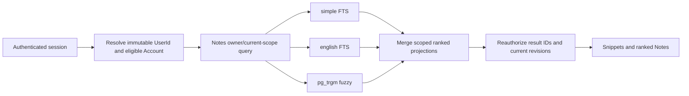
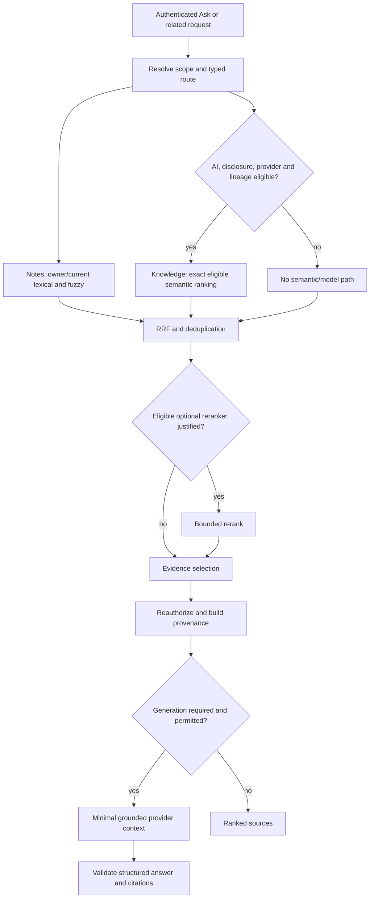
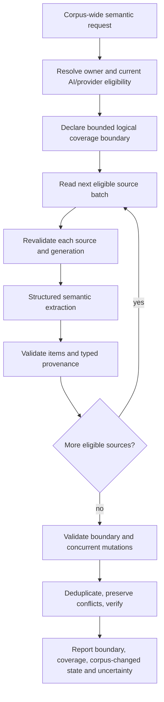
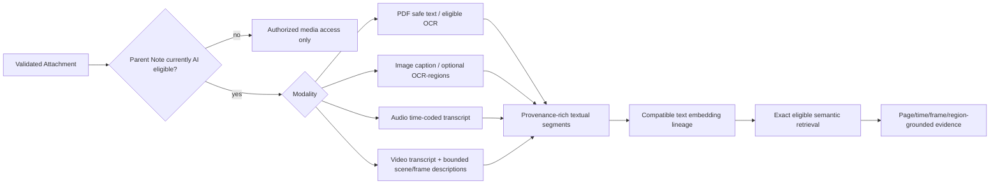
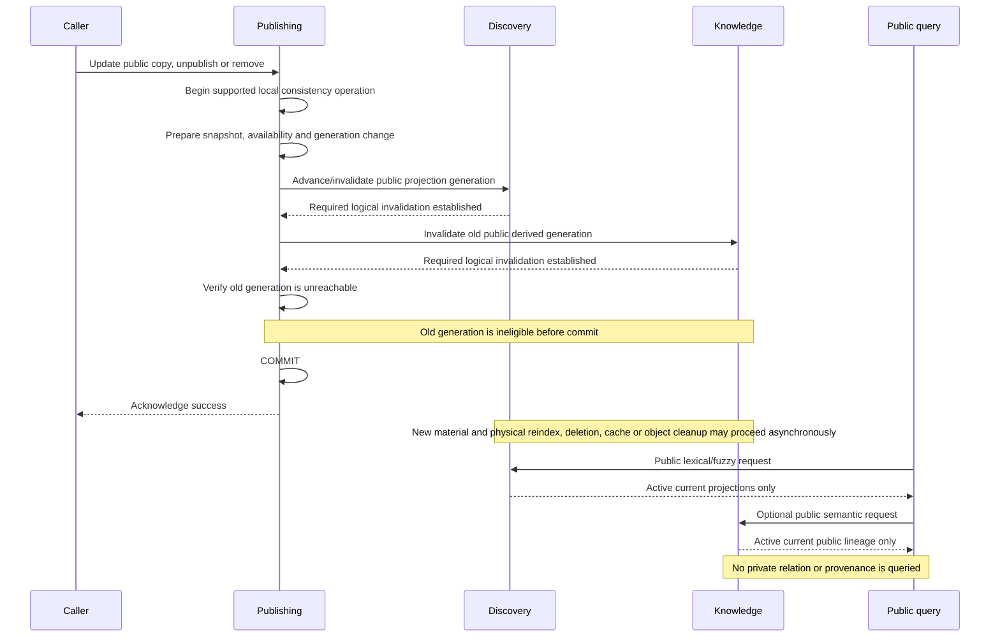

# Notes & Knowledge Workspace

# Search / AI / Retrieval Design

Status: Approved Baseline  
Date: 2026-09-12  
Baseline approval date: 2026-09-12

## 1. Purpose, authority, and boundaries

This document defines the design for private ordinary search, fuzzy matching, semantic retrieval, Ask My Knowledge, Related Notes, corpus-wide extraction, multimodal derivation, public search, evidence provenance, provider routing, and retrieval evaluation. It consumes the eight Approved Baselines and `PROJECT_CONTEXT_HANDOFF.md`; it does not reopen their product, architecture, security, domain, or relational decisions.

This document owns retrieval classification, candidate-generation order, lexical configuration, vector execution strategy, chunking, fusion, optional reranking, context construction, grounded-answer behavior, multimodal retrieval strategy, provider capability routing, and the evidence required before retrieval optimizations are adopted. It does not define HTTP contracts, Java/JPA mappings, screens, production provider deployment, exact operational quotas, or application implementation.

This is a design document only. It creates no API, Backend LLD, Frontend LLD, migration, schema, source code, configuration, test implementation, container definition, CI workflow, or provider account.

## 2. Binding inputs and precedence

The following remain authoritative:

1. Product Vision and Target Flagship Requirements owns user-visible behavior and the 234 functional requirements, 47 non-functional requirements, and 40 canonical acceptance scenarios.
2. ADR-001 owns the domain-oriented modular monolith, one initial Spring Boot backend deployable, same-deployable bounded background executor, and extraction criteria.
3. High-Level Architecture owns logical modules, interactions, synchronous consistency boundaries, asynchronous work, and degraded modes.
4. Technology Stack and Compatibility owns PostgreSQL 18.6, pgvector 0.8.6, Spring AI 2.0.1, framework classifications, provider-integration findings, and dependency/version policy.
5. Security Architecture owns authentication, authorization, AI/provider gates, private/public boundaries, safe rendering, upload handling, logging restrictions, and fail-safe behavior.
6. Threat Model owns the 55 threats, validation obligations, and release blockers.
7. Domain Model owns aggregate meanings, module ownership, AI participation, provenance, publication semantics, and `DM-INV-001` through `DM-INV-050`.
8. Schema & Migration Design owns seven namespaces, 38 relations, relational scope, composite child foreign keys, generation/invalidation foundations, private/public physical separation, and migration policy. Its additional Identity security-email relation has no search, retrieval, vector, AI, or provider-context role and was not required by this design.

If a later implementation detail conflicts with one of those authorities, the authority wins until it is explicitly amended. A retrieval score, vector, cache entry, model response, or queued job is never authorization.

## 3. Design decisions at a glance

| Concern | Initial decision |
|---|---|
| Private authorization order | Resolve authenticated `UserId`, eligible Account, authorized current corpus, and all applicable current-state gates before candidate scoring. |
| Ordinary private search | Notes-owned PostgreSQL full-text and `pg_trgm` retrieval over current authorized Notes; no AI dependency. |
| FTS configuration | Independent `simple` and `english` signals. `simple` is primary for names, shorthand, URLs, code-like text, and mixed/unknown language; `english` supplies English stemming. |
| Fuzzy matching | Owner-scoped `pg_trgm` over deterministic normalized title/body search text, with bounded candidate budgets and empirically tuned thresholds. |
| Private vector search | Exact nearest-neighbor ranking after owner, current-source, AI, revision, generation, and lineage eligibility filtering. No initial HNSW or IVFFlat index. |
| Public vector search | Public-only exact nearest-neighbor ranking over active current Publication generation and compatible lineage. It never queries private rows. |
| Hybrid fusion | Reciprocal Rank Fusion (RRF) over authorized ranked lists, initially with tunable `k = 60`; optional eligible-only reranking follows fusion. |
| Focused facts | Broad complementary candidate recall, bounded evidence inspection, conflict visibility, citations, and an insufficient-evidence outcome. |
| Semantic aggregation | Complete eligible AI-corpus traversal in bounded batches, structured extraction, provenance, deduplication, and verification; never fixed top-K alone. |
| Deterministic extraction | Complete authorized current-corpus scan, including AI-OFF Notes, using supported deterministic recognizers; saved URLs are returned as text and never fetched. |
| Text chunking | Markdown-aware structural chunks targeting about 600 tokens, normally 400–800, hard-bounded at 900, with about 80 tokens of overlap when needed. All values are evaluation-tunable. |
| Multimodal baseline | Textual-surrogate-first: PDF text, audio transcript, video transcript plus bounded scene/frame descriptions, and image caption plus optional OCR/region descriptors. |
| Provider behavior | Capability-routed, provider-agnostic ports; privacy approval is separate from technical compatibility; no silent cloud fallback. |
| Generated output | Untrusted, grounded in reauthorized evidence, citation-linked, and unable to invoke tools or mutate state. |

## 4. Non-negotiable candidate security order

Every private path uses this order:

```text
authenticated server-side session
  -> immutable UserId
  -> eligible Account and current security state
  -> authorized private source scope
  -> current source lifecycle and revision
  -> current AI/disclosure/provider eligibility, when AI-dependent
  -> current processing generation and compatible lineage
  -> candidate scoring
  -> evidence selection or reranking
  -> provenance validation
  -> answer or provider dispatch
```

The system must not search a global private corpus and remove unauthorized rows afterward. The constraint belongs in every candidate-producing query or owner-module call, not only in an outer response filter. Counts, snippets, distances, ranks, timing diagnostics, cache keys, and “no result” behavior are also protected outputs.

For private vector retrieval, the initial plan is deliberately exact: filter to the authenticated owner and complete current eligibility set, then order that eligible set by the selected lineage's distance operator. An implementation must demonstrate this shape with real PostgreSQL 18.6/pgvector 0.8.6 execution plans and candidate capture. A `WHERE` clause written beside an approximate index is not evidence that filtering occurred before traversal.

For public retrieval, candidate generation begins only from public-only structures and active current Publication state/generation. Public visibility never authorizes access to a private Note, private vector, private Attachment, private checkpoint, or private provenance path.

## 5. Module ownership and retrieval ports

| Module | Retrieval responsibility | Must not do |
|---|---|---|
| Notes | Own current private Note text, lifecycle, tags, owner scope, per-note AI state, future-note lexical fields, private lexical/fuzzy queries, and authoritative source resolution. | Expose repositories to Knowledge or let a score establish ownership. |
| Knowledge | Own private/public derived representations, segments, embeddings, semantic candidates, multimodal surrogates, query routing, fusion, evidence assembly, processing-policy identity/version and acknowledgement, provider-processing eligibility coordination, provider ports, and evaluations. | Read Notes repositories directly, treat queued work as authorization, move Account/session authority into Knowledge, or merge public and private vectors. |
| Publishing | Own Publication activity, stable public identity, immutable current snapshot, selected public media, and synchronous generation invalidation. | Turn a private Note into a live public read or allow private Save to update public content. |
| Discovery | Own public-only lexical/fuzzy projections, Latest/Trending/search inputs, and public query results. | Read private Notes or private derived relations. |
| Identity | Resolve the authenticated immutable `UserId` and expose current Account lifecycle/eligibility plus session, security, MFA, and recent-auth state where applicable. | Own processing-policy acknowledgement/provider allowability or place session or credential material into retrieval context. |
| Profile | Supply only intentionally public projection fields where public results require them. | Leak private profile/account fields. |
| Moderation | Apply narrow approved public/report actions through owning-module interfaces. | Search, inspect, or retrieve private Notes, private Attachments, or private derived data. |

Hybrid orchestration calls module-owned ports and fuses typed, scoped result projections in Knowledge. It does not implement a giant SQL statement across module schemas and does not create a cross-module repository.

## 6. Query classes and routing

### 6.1 Canonical query classes

| Class | User outcome | Corpus and candidate strategy | Completeness language | AI use |
|---|---|---|---|---|
| Ranked relevance | “Find my note about the hotel near Kyoto.” | Bounded lexical, fuzzy, and—when permitted—semantic lists; fuse and rank the best matches. | “Best matches,” never “all.” | Optional. AI-OFF Notes can enter lexical/fuzzy only. |
| Focused fact retrieval | “What was my PlayStation password?” | High-recall lexical/fuzzy/semantic evidence discovery, bounded inspection, exact-value extraction, conflict check, and citations. | Supported fact, conflict, or insufficient evidence. | AI-dependent if semantic/reranking/generation is used; deterministic exact evidence may still be shown. |
| Corpus-wide semantic extraction/aggregation | “List the films I wrote down to watch.” | Inspect the complete authorized AI-eligible corpus in bounded batches; classify/extract, deduplicate, verify, and retain provenance. | Complete corpus coverage does not mean perfect semantic classification. | Required for semantic classification; AI-OFF content excluded. |
| Corpus-wide deterministic extraction | “Show every URL I saved.” | Scan the complete authorized current corpus or a proven complete deterministic derived index; apply an explicit recognizer and deduplicate occurrences. | Complete relative to the supported recognizer and corpus snapshot. | Not required; includes AI-OFF Notes. URLs are never fetched. |

The query class is an internal execution decision, not a technical mode users must choose. A single knowledge-query surface may route to deterministic extraction or AI-dependent processing while making the resulting coverage semantics visible.

### 6.2 Bounded router

The router derives a typed plan containing at least:

- authenticated/private or active-public scope;
- requested outcome and query class;
- deterministic or AI-dependent processing classification;
- lexical, fuzzy, semantic, and supported-modality signals;
- coverage contract: ranked, bounded focused, complete eligible corpus, or complete deterministic corpus;
- provider capabilities, if any, needed after policy gating;
- candidate, batch, context, time, and cost budgets;
- expected evidence and provenance types;
- a deterministic fallback or truthful unavailable state.

Deterministic rules recognize explicit patterns such as URL extraction and obvious navigational searches first. For an already AI-dependent, acknowledged, provider-permitted request, a model may assist intent classification or query expansion, but its output is schema-validated and cannot authorize content, change AI state, choose an undisclosed provider, or turn a bounded path into an unbounded one. If routing is uncertain, the safe fallback is ordinary ranked search or a clarification—not a broader corpus or provider call.

### 6.3 Retrieval decision table

| Input evidence | Route outcome | Mandatory candidate filters | Output contract |
|---|---|---|---|
| Explicit “all/every” plus supported deterministic pattern such as URL | Corpus-wide deterministic extraction | Owner, current Note/Attachment source; no AI predicate | Every recognized occurrence for the captured corpus revision, with source provenance; no URL fetch. |
| “All/every/list” plus semantic category without deterministic recognizer | Corpus-wide semantic extraction | Owner, current source, AI ON, disclosure/provider policy, current generation/lineage | Bounded-batch corpus coverage, extracted items, provenance, dedupe, uncertainty. |
| Specific attribute or value sought | Focused fact retrieval | Per-signal scope plus AI eligibility for every AI-dependent signal/stage | Supported answer with citations, visible conflicts, or insufficient evidence. |
| General find/related request | Ranked relevance | Owner/current; AI gates only for semantic/rerank/model lists | Ranked sources with signal explanation; no completeness claim. |
| Public search | Public ranked retrieval | Active Publication, current snapshot/projection generation; public lineage only | Ranked active public snapshots; never private evidence. |
| AI/provider unavailable | Deterministic fallback where meaningful | Same owner/public and current-source predicates | Ordinary search/extraction remains available; AI-dependent outcome is truthfully degraded. |
| Authorization, Account, source, lineage, or policy cannot be established | Deny/no dispatch | None may be relaxed | Enumeration-safe denial or unavailable state; zero candidates sent onward. |

## 7. Ordinary private lexical and fuzzy search

### 7.1 Searchable source

Notes owns a deterministic `search_text` projection of the current authorized Note title and current Markdown body. Normalization:

- applies Unicode normalization and locale-independent case folding suitable for indexed comparison;
- removes Markdown presentation syntax without executing HTML or fetching references;
- preserves human-visible link text and stored URL text;
- preserves meaningful code, identifier, path, email, hashtag, punctuation, and symbol-bearing tokens for the trigram signal;
- collapses non-meaningful whitespace while retaining deterministic source offsets through a mapping;
- does not rewrite the authoritative Note body; and
- is refreshed with the current Note revision under Notes ownership.

Tags are separately owner-authorized Notes data and may contribute a labeled lexical signal. Historical `NoteVersion` rows do not enter ordinary search merely because they exist.

### 7.2 Full-text configuration

The initial design uses two independent PostgreSQL FTS representations:

1. `simple` is the primary broad lexical representation. It avoids language-specific stemming and stop-word loss, making it safer for proper names, shorthand such as `ps`, URLs, identifiers, mixed-language text, and unfamiliar terms.
2. `english` is a supplementary representation for English prose so inflected forms can match through stemming.

Title terms receive the stronger title weight and body terms the normal content weight. Tags contribute a distinct boosted signal only after their owner scope is resolved. The two FTS rankings remain separate inputs to fusion; scores from unlike rankers are not treated as calibrated probabilities.

This does not claim complete multilingual linguistic search. Additional language configurations require representative-corpus evidence and an explicit compatible-index evolution; automatic language detection must not silently remove the `simple` path.

### 7.3 Fuzzy matching with `pg_trgm`

`pg_trgm` supplies typo-tolerant similarity for title, deterministic normalized search text, tags, and query-token variants. Initial indexes use the approved `pg_trgm` extension and GIN trigram operator classes on the selected normalized expressions; B-tree owner/lifecycle indexes remain available to constrain scope. Candidate count, minimum similarity, word-similarity threshold, short-token handling, and title/body boosts are configuration values tuned through the evaluation corpus rather than universal constants.

Very short abbreviations such as `ps` do not contain enough trigrams for reliable fuzzy recovery, so deterministic aliases learned only from safe product vocabulary or the user's authorized current corpus may contribute bounded query variants. The system does not claim that every typo or abbreviation can be inferred.

### 7.4 Query normalization and expansion

All paths may use deterministic normalization: Unicode normalization, case folding, whitespace/punctuation variants, URL host/path decomposition without network access, exact phrase preservation, and known lexical token variants. Expansion is bounded and its original-query match is retained.

Every alias or expansion term derived from private Note content carries conceptual provenance sufficient to enforce downstream stage eligibility. A term derived from an AI-OFF Note may assist that owner's deterministic lexical/fuzzy retrieval, but it cannot be sent to a query-embedding provider, model-assisted expansion, reranker, classifier, generator, or any other AI-dependent stage merely because its derivation was deterministic. Static application vocabulary and terms entered directly by the user are not derived from private Note content and therefore do not inherit a Note's AI exclusion. A term derived from AI-eligible private content may enter an AI-dependent stage only after its source-specific AI, disclosure, provider, revision, generation, and authorization gates are revalidated. No persistent alias relation is selected.

Model-assisted expansion is allowed only after the request is classified as AI-dependent and Knowledge verifies current processing-policy acknowledgement and provider-policy gates. A query-only call may expand the user's own minimized query without first selecting a source Note; if any proposed input term came from Note content, that call instead requires the applicable source-bearing gates above. Expansion changes only the query expression, not corpus authorization. The result remains bound to the same authenticated operation, confers no authorization, and cannot move AI-OFF content into semantic retrieval, model reranking, or context.

### 7.5 Private ordinary-search flow



No disclosure acknowledgement, embedding, AI-enabled state, chat provider, or transcription service is needed for this flow.

## 8. Semantic eligibility and exact vector execution

### 8.1 Private eligibility contract

A private derived segment is eligible for semantic candidate scoring only when all of the following are current:

- the authenticated caller resolves to the segment's `owner_user_id`;
- the Account/session is eligible for the operation;
- the authoritative Note exists in an eligible current lifecycle state;
- the source revision/checkpoint reference and processing generation match the current source contract;
- the Note is independently AI ON;
- required AI/provider disclosure has been acknowledged;
- the chosen provider/task/tier/region policy is currently permitted;
- an Attachment source, if present, remains owned by the Note, stored, validated, and eligible;
- the derived root is current/ready rather than queued, failed, obsolete, or excluded;
- its derivation class and modality are appropriate for the requested task; and
- its provider/adapter/model/version/task/dimension/configuration lineage exactly matches the query lineage.

Notes is authoritative for Note and per-Note AI state. Identity is authoritative for immutable `UserId`, Account lifecycle/eligibility, and applicable session/security state. Knowledge owns processing-policy identity/version and acknowledgement and coordinates the configured provider/model/tier/region/task allowability decision at the Knowledge/provider-policy boundary. Knowledge combines those facts with current Note/public state and its synchronously invalidated representation root/generation predicate so candidate SQL need not bypass module ownership. It resolves current authority through module ports before the query and revalidates evidence before use.

### 8.2 Immediate logical exclusion

Turning AI OFF advances the authoritative AI processing generation and causes Notes to invoke Knowledge's invalidation port in the same required local consistency boundary. Before commit completes, the former representation root is no longer current/eligible. Segment rows, vectors, transcripts, captions, OCR output, or caches may remain physically present while durable cleanup runs, but no query may treat payload presence as eligibility.

The same rule applies to source edit/supersession, delete/trash states where retrieval is not allowed, invalid Attachment state, policy withdrawal, Account deletion, lineage retirement, and other current-source changes. Physical cleanup is subordinate to logical ineligibility.

```mermaid
sequenceDiagram
    participant U as Owner
    participant N as Notes
    participant K as Knowledge
    participant J as Durable executor
    U->>N: Disable AI or Save new revision
    N->>N: Advance source/AI generation
    N->>K: Invalidate matching current representation
    K->>K: Mark root obsolete/excluded before commit
    N-->>U: Commit succeeds; old evidence is unreachable
    N->>J: Enqueue cleanup/re-derivation intent
    J->>N: Re-resolve owner, source, revision, AI state
    alt Still ineligible or stale
        J->>K: Cleanup/mark obsolete; no provider call
    else Current and eligible
        J->>K: Produce only current-generation output
    end
```

### 8.3 Initial private vector strategy

The initial private vector strategy is exact owner-and-current-eligibility-filtered nearest-neighbor search:

1. resolve the authorized operation scope and query lineage;
2. restrict private derived roots and segments to the authenticated owner and all current eligibility predicates;
3. compute the chosen lineage's distance only within that eligible set;
4. order exactly by distance and take the bounded semantic candidate budget;
5. capture IDs and predicates for tests before any evidence or model stage; and
6. revalidate selected evidence immediately before reranking or provider dispatch.

No HNSW or IVFFlat index is approved initially. pgvector documents exact search as its default and notes that approximate indexes trade recall for speed; it also documents that filters on approximate indexes are applied after the index scan and that shared multitenant indexes can affect recall and speed. Those behaviors make exact, scope-first execution the appropriate initial personal-workspace baseline.

The selected similarity operator is lineage/task metadata, not a universal constant. Text-surrogate embedding lineages normally begin with cosine distance when the selected model's official guidance supports it; a model that requires another operator creates a separate lineage and evaluation.

### 8.4 ANN evolution gate

Approximate search remains an allowed future optimization, not an assumed destination. An ANN proposal requires an explicit design amendment or superseding retrieval decision supported by all of:

- measured exact-search latency and resource failure at representative per-user segment counts;
- production-like `EXPLAIN (ANALYZE, BUFFERS)` evidence for exact and proposed ANN plans;
- proof of owner, current source, AI-OFF, revision, generation, Attachment, and lineage exclusion at captured candidate boundaries;
- exact-versus-ANN recall comparison for each query class and corpus-size band;
- adversarial cross-user near-duplicate tests;
- tests for stale, deleted, superseded, wrong-lineage, and cleanup-pending rows;
- timing/count/plan side-channel review and multitenant interference measurements;
- provider-capture evidence showing zero ineligible dispatches;
- safe rollback, rebuild, re-embedding, and index cutover behavior; and
- a documented choice among partitioning, partial/expression indexes, iterative scans, HNSW, IVFFlat, or another mechanism rather than a generic “add ANN” instruction.

Passing a quality or latency benchmark does not excuse one security violation. A single cross-user or AI-OFF candidate escape blocks release.

### 8.5 Public vectors

Public semantic retrieval operates only on `knowledge.public_derived_representation` and `knowledge.public_derived_segment`. It requires active Publication status, the current immutable snapshot/generation, current public derivative state, and exact compatible lineage before scoring. Initial ranking is exact. Public ANN may be evaluated independently if public scale warrants it, but it may not traverse or share a candidate index with private data.

## 9. Chunking and derived representation

### 9.1 Text and Markdown chunking

The initial chunker is deterministic and Markdown-aware. It:

- retains heading ancestry as compact context metadata;
- prefers heading sections, paragraphs, list-item groups, block quotes, tables, and fenced code blocks as boundaries;
- avoids splitting a URL, identifier, Markdown link, or code token when practical;
- records deterministic normalized and authoritative-source offsets;
- targets approximately 600 model tokens, normally allows 400–800, and hard-bounds a chunk at 900;
- adds approximately 80 tokens of overlap only when a semantic boundary needs continuity;
- avoids duplicating a whole short section merely to reach a target;
- includes source revision/checkpoint, processing generation, derivation class, modality, and lineage; and
- changes its chunker version/configuration ID whenever compatibility-affecting behavior changes.

These are initial evaluation defaults, not universal product guarantees. Tables, long code blocks, transcripts, OCR, and page/time-bound media use structure-specific policies with their own bounded segment sizes. Chunking changes create a new derivation configuration/lineage and do not reinterpret old vectors in place.

### 9.2 Provenance model

Every evidence item carries a typed, backend-constructed provenance record:

| Source | Minimum provenance |
|---|---|
| Note text | Note ID, current revision/checkpoint, heading ancestry, normalized and source character range. |
| PDF | Note ID, Attachment ID, source revision/generation, page number and text range; region when available. |
| Audio | Note ID, Attachment ID, generation, transcript time start/end, transcript range. |
| Bounded video | Note ID, Attachment ID, generation, transcript time range and/or sampled frame/time reference. |
| Image | Note ID, Attachment ID, generation, whole-image or bounded region/box, caption/OCR segment identity. |
| Publication | Publication ID, current public generation/snapshot identity, public heading/location or selected public-media location. |

The backend resolves each citation from typed evidence and reauthorizes the source. A model may refer to evidence IDs supplied in a structured contract, but model-emitted Note IDs, URLs, titles, or citation strings are untrusted and cannot become navigation targets without validation. Object-store keys and reusable signed URLs never appear in model context or citation payloads.

## 10. Ranked hybrid retrieval

### 10.1 Candidate pipeline

For eligible AI-dependent ranked retrieval:

1. Notes produces authorized current lexical/fuzzy Note projections.
2. Knowledge produces authorized current exact semantic segments for the selected lineage.
3. Each retriever returns a bounded ranked list with stable typed source/provenance IDs, not raw global rows.
4. Knowledge deduplicates same-source or substantially overlapping segments while preserving all contributing signal ranks.
5. RRF combines ranks using `score = Σ 1 / (k + rank)` with initial tunable `k = 60`.
6. Optional reranking may inspect only the bounded, already authorized, AI-eligible fused set.
7. Evidence is reauthorized and assembled under context budgets.
8. The result is returned as sources, Related Notes, or grounded Ask My Knowledge evidence.

Initial working budgets—subject to evaluation—are up to 50 candidates per lexical, fuzzy, and semantic signal; up to 100 distinct items after union; up to 30 for an optional reranker; and up to 12 minimally sufficient evidence segments for generation. These are protective defaults, not product promises. Focused and corpus-wide paths use separate plans.

RRF is selected because it combines rank order without pretending FTS rank, trigram similarity, and vector distance share a calibrated scale. Absolute distance, trigram, RRF, or reranker scores are ranking signals, not user-visible confidence percentages.



### 10.2 Context construction

Generation context contains only the minimally sufficient, currently authorized and AI-eligible evidence needed for the request. It preserves source boundaries, evidence IDs, modality/location, and conflict markers; removes redundant overlap; and enforces token, item, per-source, modality, time, and cost limits.

Context must not contain AI-OFF or stale content, unrelated corpus dumps, session identifiers, authentication cookies, CSRF tokens, provider credentials, secrets from configuration, internal object locators, moderation-only data, or private profile fields. User-stored credential-like text may be included only when it is currently authorized, AI-eligible, relevant to the owner's request, covered by disclosure/provider policy, and minimized to the evidence needed. The product remains a notes application, not a password manager.

### 10.3 Optional reranking

Reranking is optional and adopted only if controlled ablations show a material task-appropriate improvement after latency, cost, privacy, and failure analysis. A model or cross-encoder reranker is AI-dependent. It receives only bounded authorized AI-eligible candidates and must support a no-reranker fallback. AI-OFF Notes may participate in ordinary lexical/fuzzy output but never cross into a model reranker.

RRF remains the authoritative unified ranking baseline when lexical/fuzzy results contain both AI-ON and AI-OFF Notes. The initial deterministic mixed-subset merge freezes every AI-OFF candidate in its RRF position and allows an optional reranker to reorder only the AI-eligible candidates among the remaining RRF positions. The merge does not remove, demote, or relabel an AI-OFF candidate merely because it was intentionally withheld from the reranker. If evaluation cannot demonstrate that this slot-preserving merge is fair and stable for a plan, that plan disables model reranking and returns RRF order alone. For generative synthesis, AI-OFF candidates may still be displayed as deterministic search results, but they never enter model context. “Not AI-reranked” does not mean “less relevant.”

## 11. Focused fact retrieval and grounded answers

A focused fact plan expands recall across exact phrase, FTS, trigram, deterministic aliases, and eligible semantic evidence. It then performs bounded evidence-level extraction rather than trusting a top chunk's summary. The verifier checks the requested field/value relationship, temporal or revision relevance, source support, and conflicts across current evidence.

Outcomes are:

- a supported fact with one or more navigable citations;
- multiple conflicting supported values with their separate citations and no silent choice;
- a closest-source presentation without a factual claim; or
- an explicit insufficient-evidence result.

Ask My Knowledge answers only from supplied evidence, visibly distinguishes direct source support from inference, and does not present generic model knowledge as a fact from the user's Notes. Material claims and extracted items carry citation coverage. Citation validation occurs after generation; an invalid citation is removed or causes answer repair/failure, never invented substitution.

Provider output is parsed against a bounded structured schema, length-limited, safely rendered, and treated as untrusted. It cannot mutate a Note, tag, AI state, Publication, moderation decision, security setting, or any other domain state.

## 12. Corpus-wide extraction

### 12.1 Semantic extraction and aggregation

Corpus-wide semantic work is not top-K RAG. At operation start, Knowledge establishes an explicit bounded logical operation coverage boundary for the current AI-eligible corpus—for example a generation/high-water/ordered-continuation contract that a future Backend LLD can realize within the approved retrieval/work metadata. The boundary declares which sources the operation intends to inspect; it is neither stored authorization nor a permanent authorization snapshot. Notes created outside it after the operation starts are not silently reported as inspected. Knowledge traverses the declared boundary in bounded, deterministic batches, and each batch, source use, provider dispatch, and finalization revalidates authorization, Account eligibility, AI state, processing-policy acknowledgement, provider policy, revision, generation, and lineage.

Each batch produces schema-validated candidate items with typed provenance and classification evidence. The reducer normalizes and deduplicates only when equivalence is supported, preserves alternative spellings and conflicting claims, and verifies provenance before final output. A captured source that becomes unauthorized, AI OFF, deleted, or otherwise ineligible is excluded immediately and cannot be dispatched or retained. If a captured source revision changes before or after processing, the operation either boundedly reprocesses/restarts the affected scope under the current revision or records the corpus as changed and declines to claim completeness for the current corpus. Repeated mutation may therefore produce a truthful retry/restart-required or incomplete result instead of an infinite refresh loop.

Finalization validates the operation boundary and mutation record. “Complete corpus coverage” means every source eligible within the explicitly declared, successfully validated operation boundary was inspected. It does not mean that later-created out-of-boundary sources were inspected, that the result represents a concurrently changed current corpus, or that a probabilistic model identified every semantic item correctly. The UI/report must distinguish the boundary, coverage, corpus-changed state, extraction quality, truncation, failure, cancellation, and retry/restart requirement.

No model/provider processing occurs inside a long-lived PostgreSQL transaction, `REPEATABLE READ` snapshot, or database lock. Short transactions may read a bounded batch or update operation progress, but current authority is resolved again before each sensitive effect. This design adds no relation; if implementation later proves that persistence beyond the Schema Baseline's explicitly deferred retrieval/work metadata is necessary, the Schema Baseline must be amended before that structure is implemented.



### 12.2 Deterministic exhaustive extraction

Deterministic extraction scans all authorized current sources or a complete deterministic index proven to cover them. It is independent of per-note AI state and provider availability. Each recognizer defines its supported syntax, normalization, false-positive handling, source types, and completeness boundary.

The URL recognizer finds explicit URI forms and supported Markdown link destinations in Note text and deterministic safe PDF text where that source is part of the authorized deterministic corpus. It preserves the stored value and source location, may normalize only a separate comparison key for deduplication, and never resolves DNS, opens, previews, crawls, HEADs, fetches, scores, or otherwise invokes a saved URL. Unsafe or malformed strings remain inert text.

Results distinguish unique normalized values from every occurrence so deduplication cannot erase provenance. If a source is unreadable, unsupported, changed beyond the captured traversal, or the operation is truncated/cancelled, the result must not claim completeness.

## 13. Related Notes and AI organization

Related Notes is a private semantic feature. The source Note and candidates must share the authenticated owner, be current and AI ON, satisfy disclosure/provider policy, and use a compatible current lineage. The source Note itself is excluded from its result list; substantially duplicate chunks are collapsed to Note-level candidates; stale relations are not cached as authority.

AI-generated tag, topic, title, summary, or organization suggestions are untrusted proposals tied to a source revision and processing generation. Notes validates the source and requires an explicit owner confirmation through a later Notes command before changing authoritative data. A stale suggestion cannot apply to a newer revision. No generated suggestion creates a hidden tag taxonomy or third AI state.

## 14. Multimodal derivation and retrieval

### 14.1 Initial textual-surrogate strategy

The initial practical strategy turns supported media into bounded, provenance-rich textual surrogates and embeds those surrogates in the selected text-embedding lineage. Native shared-space multimodal embeddings remain optional until the exact provider, privacy policy, model, dimensions, quality, cost, and failure behavior are approved and evaluated.

| Source/modality | Deterministic availability | AI-dependent derivation when Note is eligible | Retrieval and grounding unit | AI-OFF behavior |
|---|---|---|---|---|
| Note Markdown text | Authorized read, lexical/fuzzy search, deterministic patterns | Chunk embeddings, semantic retrieval, reasoning | Heading/paragraph/list/code chunk and character range | Remains lexical/fuzzy/deterministic; no embedding/model. |
| Image | Authorized original/safe derivative access | Caption; optional bounded OCR and region descriptors; later native multimodal embedding only if approved | Whole image or region/box with Attachment provenance | Remains accessible; no caption, model OCR, embedding, or reasoning. |
| Audio/voice | Authorized playback/download | Time-coded transcript and optional bounded acoustic/content descriptions | Transcript segment with time start/end | Remains accessible; no transcription, embedding, or reasoning. |
| Bounded video | Authorized playback/download | Time-coded transcript plus bounded sampled scene/frame descriptions | Transcript time range and/or frame timestamp | Remains accessible; no transcription, frame/scene model, embedding, or reasoning. |
| PDF | Authorized open/download; safe deterministic parser text may be extracted when approved by file-security policy | Semantic embedding, OCR/model understanding for scanned/complex pages when eligible | Page, text range, and optional region | Safe deterministic text extraction may remain; no model OCR, embedding, or reasoning. |
| Publication snapshot/media | Public read only after explicit Publication creation and selected media | Separate public derivation under public lineage/policy | Publication generation plus public text/page/time/region | Private Note AI state cannot be inferred from or used to query public data. |

“Optional OCR” means OCR performed through a model or AI service is AI-dependent. A future explicitly selected deterministic local OCR implementation would require security, quality, and classification review; it is not silently assumed here.

### 14.2 Cross-modal queries

The textual-surrogate baseline supports text-to-text, text-to-image, text-to-audio, text-to-video, and text-to-PDF retrieval by embedding the user's text query and the eligible textual surrogates in one compatible text lineage. It also supports media-grounded answers when the selected provenance segment actually supports the response.

It does not claim that a caption exhaustively represents an image, that a transcript captures non-speech audio, or that sampled video frames capture every event. A native multimodal embedding lineage may later complement—not silently reinterpret—the text lineage if controlled evaluation demonstrates improvement.



### 14.3 Processing states

User-visible and operational state must truthfully distinguish:

- source stored and authorized access available;
- deterministic extraction available;
- AI derivation queued;
- processing;
- current/ready;
- failed/retryable;
- obsolete/superseded;
- excluded because AI is OFF or a current gate fails; and
- physical cleanup pending after logical exclusion.

A successful Note Save or Attachment store never depends on embedding, transcription, captioning, OCR-model, reranking, or chat-provider success.

## 15. Embedding lineage and vector shape

Every embedding lineage identifies at least:

- provider and Knowledge adapter implementation;
- model identifier and provider model/version revision where exposed;
- task/purpose such as query, document, or native multimodal;
- vector data type and dimension;
- similarity/distance operator and any normalization requirement;
- modality and surrogate/processor class;
- chunker/extractor/transcriber/captioner version and configuration;
- safety-relevant processing policy version; and
- creation, activation, retirement, and compatibility state.

Vectors from incompatible lineages are never compared or fused as if they occupied the same space. Each active lineage has one validated dimension. There is no universal project dimension. A model/task/dimension change creates a new lineage, parallel derivation, measured cutover, and later cleanup; it is not an in-place model-name edit.

The approved production-private provider, model, region/tier, embedding task, vector dimension, and native multimodal choice remain deployment/provider-policy gated. Technical support in Spring AI or a vendor SDK is not permission to transmit real user content.

## 16. Provider abstraction, privacy, and dispatch

### 16.1 Capability ports

| Capability | Knowledge-owned port | Spring AI baseline | Required privacy/behavior gate |
|---|---|---|---|
| Text generation | Grounded generation/structured response port | Use `ChatModel`/`ChatClient` where capability fits | Current owner/evidence eligibility, disclosure, approved provider/tier/region, minimal context, no silent fallback. |
| Text embedding | Query/document embedding port | Use Spring AI embedding abstraction where fit | Query-only gates for query vectors; complete source-bearing gates for document vectors; approved model/task/lineage and dimension validation. |
| Native multimodal embedding | Narrow multimodal embedding port | Project-owned adapter where Spring AI 2.0.1 lacks required capability | Explicit provider/privacy approval and measured cross-modal benefit; optional initially. |
| Transcription/media understanding | Narrow transcription/media-understanding ports | Use supported abstractions where fit; otherwise narrow adapter | Validated Attachment, parent AI eligibility, modality limits, data-handling approval, provenance. |
| Structured output | Schema-bound result parser/validator | Spring AI structured-output support where reliable | Reject malformed/oversized/unreferenced output; output remains untrusted. |
| Reranking | Optional reranker port | Provider/local implementation only after evaluation | Authorized AI-eligible bounded candidates only; deterministic fallback. |

Business/domain code depends on these narrow capability ports, never on a universal provider gateway or provider-specific response type. Provider capability differences remain explicit rather than hidden behind lowest-common-denominator claims.

### 16.2 Dispatch classes, privacy gates, and fallback

Knowledge distinguishes two conceptual AI dispatch classes so pre-candidate work does not circularly depend on a source that has not been retrieved.

#### Query-only / pre-candidate AI call

Query embedding and optional model-assisted intent classification or query expansion may contain the user's minimized query but no retrieved Note or Attachment content. Before a private query-only call, Knowledge requires the authenticated operation authority, current Account/session eligibility from Identity, current applicable processing-policy acknowledgement, approved provider/model/tier/region/task policy, a compatible query task/lineage, bounded payload, and quota/timeout/cost gates. Public query-only work uses its approved public-purpose and provider-policy contract.

There is no source-specific Note AI check at this stage because no source Note has been selected. The query vector, route, or expansion remains ephemeral or policy-bounded to the same authenticated operation and authorizes no Note, Attachment, corpus, evidence, or later dispatch. Note-derived alias terms are not query-only inputs unless their own source-bearing gates pass as defined in section 7.4.

#### Source-bearing AI call

Document/chunk embedding, Attachment captioning/transcription/OCR-model/media understanding, model reranking, grounded generation, and semantic extraction/classification contain or derive from source content. Immediately before each private source-bearing dispatch, Knowledge re-resolves the authenticated owner, current Account eligibility, current source and lifecycle, per-Note AI ON state and Attachment inheritance, processing-policy acknowledgement, approved provider/model/tier/region/task policy, current revision/checkpoint, processing generation, compatible lineage, Attachment validation where applicable, request budgets, and minimal payload. Public source-bearing work instead requires approved active-public scope, current Publication/snapshot generation, public processing policy, and public-only source resolution; it never reads a private repository.

#### Shared dispatch rules

Knowledge owns acknowledgement and provider-processing eligibility coordination; Identity supplies only identity, Account, session, and security facts. A job's queued state or an earlier eligibility decision is insufficient. If any applicable gate changes, dispatch is denied and work becomes excluded, obsolete, or retryable as appropriate. First-use disclosure remains mandatory. There is no silent fallback from local to cloud, between cloud providers, to another region/tier, to an incompatible embedding lineage, or from an approved text-only path to multimodal processing.

Local development may use local providers where practical. Cloud evaluation before production approval uses only synthetic, harmless, or intentionally public-safe fixtures. Real private Notes, media, credentials, and provider keys do not enter repository fixtures, captured requests, or public demos.

### 16.3 Prompt injection and non-agentic boundary

Note text, Markdown, URLs, PDFs, OCR, captions, transcripts, public content, filenames, and provider output are untrusted data. Instructions inside them cannot change authorization, AI state, disclosure, provider selection, budgets, system prompts, citation rules, or domain state.

The initial system is non-agentic. It has no autonomous browsing, URL opening, shell/code execution, plugin/tool invocation, note mutation, tag application, publication, unpublication, moderation, account action, external messaging, purchase, or credential use. Saved URLs are inert evidence. Retrieval and generation adapters receive a closed capability set and typed evidence, not general tools.

## 17. Public search, update, and unpublish

Public lexical/fuzzy search begins in `discovery.publication_projection`; public semantic search begins in `knowledge.public_derived_*`. Both require the active current Publication generation. Discovery and Knowledge receive only public snapshot fields and explicitly selected safe public-media derivatives. Ranking signals may include lexical/fuzzy relevance and approved privacy-conscious public engagement projections, but never private Note state.

Publication update creates a new immutable snapshot and generation. Publishing synchronously makes the old generation ineligible through owning-module interfaces before commit; new Discovery/Knowledge material may become ready synchronously or asynchronously without restoring the old generation. Unpublish, authorized moderation removal, or Account deletion synchronously removes public eligibility. Cache/object/index cleanup may lag but cannot preserve reachability.



## 18. Transactions, durable work, and caches

### 18.1 Transaction boundaries

- Note Save commits authoritative content/revision and Notes-owned lexical projection consistently; Knowledge derivation may follow asynchronously.
- AI disable/source supersession advances generation and invalidates Knowledge current eligibility within the required same-deployable local consistency boundary before success is acknowledged.
- Publication update/unpublish/removal advances availability/generation and coordinates synchronous logical invalidation with Discovery and Knowledge before success.
- Provider calls, embedding, transcription, captioning, OCR-model work, and large corpus processing never hold an interactive database transaction open.
- Background completion uses generation-checked compare-and-activate semantics; an older completion cannot replace a newer representation.

### 18.2 Durable work

Knowledge work uses the approved PostgreSQL durable-intent/claim model and same-deployable bounded executor. Claims are leases, not permission. Work is idempotent by source, revision/generation, derivation class, and lineage. Handlers bound concurrency, batch size, memory, media pages/duration/frames, provider requests, and retry counts; use timeout and exponential backoff with jitter where retryable; distinguish permanent validation/policy failures from transient provider failures; and revalidate before every sensitive read, provider call, output activation, object effect, or public effect.

### 18.3 Caches

Retrieval caches are optional and never authoritative. Keys include authenticated owner or public scope, query/plan version, source or corpus generation, AI/provider policy version when applicable, and embedding lineage. Values contain only bounded result IDs/safe ranks, not reusable credentials or unbounded private payload. Every hit is reauthorized and revalidated. AI disable, source change, unpublish, Account deletion, policy change, and lineage cutover make old keys unusable before asynchronous eviction. Redis failure cannot broaden access and falls back to authoritative PostgreSQL/module checks.

## 19. Failure and degraded behavior

| Failure | Required behavior |
|---|---|
| Chat provider unavailable | Ordinary Notes, explicit Save, lexical/fuzzy search, deterministic extraction, media access, profiles, and publication continue; Ask reports a truthful degraded state or returns sources without fabricated synthesis. |
| Embedding provider unavailable | Existing source vectors remain valid derived data only while their lineage and policy remain current. New semantic queries continue only when an approved compatible query vector for the same comparable lineage can still be obtained—for example from a still-available approved capability or a valid policy-permitted same-lineage query cache. If no compatible query vector is available, semantic retrieval is truthfully unavailable. New derivation queues/retries; lexical/fuzzy/deterministic retrieval continues; no model, provider, task, dimension, or lineage is silently substituted. |
| Transcription/caption/OCR-model failure | Stored Attachment remains accessible; state is failed/retryable; no false “ready” or empty-result claim. |
| Stale work completes | Generation check rejects activation; no candidate, cache, citation, or provider use. |
| Eligibility changes during query | Evidence is removed at revalidation; provider dispatch/answer is denied or rebuilt from remaining evidence. |
| Timeout or budget reached | Return partial/truncated status only when truthful for the query class; never label incomplete corpus traversal complete. |
| Invalid model output/citation | Reject, repair within bounded policy, or fall back to verified sources/insufficient evidence. |
| Redis/cache failure | Query authoritative stores; deny if authority cannot be resolved; no authentication or authorization relaxation. |
| Public invalidation dependency failure | Do not acknowledge update/unpublish success until required logical unreachability is established; physical cleanup may retry. |

## 20. Evaluation and release evidence

### 20.1 Reproducible corpus

The offline corpus is synthetic and public-safe. It includes multiple users; hundreds and then thousands of Notes per user; distractors; near-duplicates across users; misspellings; shorthand; proper names; URLs; Markdown; code; mixed-language text; tags; deterministic aliases with AI-ON and AI-OFF provenance; mixed-state RRF lists; conflicting facts; insufficient-evidence cases; AI ON/OFF combinations; stale/deleted/superseded revisions and generations; concurrent create/edit/disable/delete mutations during corpus traversal; publication update/unpublish states; embedding-provider outages with and without a compatible same-lineage query representation; and image, audio, bounded video, and PDF fixtures with precise page/time/frame/region truth.

Credential-like examples use unmistakably fictional placeholders. URLs use safe reserved/example domains and are never fetched. The same versioned corpus and relevance judgments are used for provider/model and pipeline comparisons.

### 20.2 Metrics by outcome

| Outcome | Required metrics/evidence |
|---|---|
| Ranked relevance | Recall@K, Precision@K, MRR, NDCG; latency by per-user corpus size; separate lexical, fuzzy, exact vector, hybrid, expansion, and rerank ablations; mixed AI-ON/AI-OFF slot-preserving merge stability and fairness versus RRF alone. |
| Focused fact | Answer correctness, insufficient-evidence precision/recall, conflict handling, citation precision, citation recall, claim citation coverage, evidence faithfulness. |
| Corpus semantic extraction | Item precision, recall, F1, declared-boundary corpus coverage, concurrent-mutation detection/reprocessing, no false current-corpus completion, deduplication correctness, provenance correctness, conflict retention, retry/restart, cancellation, and truncation truthfulness. |
| Deterministic extraction | Recognizer precision/recall, exact corpus traversal, occurrence and unique-item counts, deduplication correctness, provenance correctness, no-fetch proof. |
| Multimodal | Separate text-to-text, text-to-image, text-to-audio, text-to-video, text-to-PDF recall/ranking; grounded-answer faithfulness; page/time/frame/region provenance; AI exclusion. |
| Security | Zero cross-user candidates/content/metadata/citations/cache leaks; zero AI-OFF-derived aliases in AI calls; zero source content in query-only calls; zero AI-OFF/stale/wrong-lineage/provider dispatches; zero private-to-public retrieval. Binary failure, not an averaged score. |
| Reliability/performance | P50/P95/P99 latency, timeout rate, queue age, retry/failure rate, provider latency/cost, exact eligible segment count, memory/CPU, and degraded-path availability. |

The product's 90% engineering ambition applies only to an approved, task-appropriate non-security quality metric where meaningful. Results are reported, not assumed, and no blanket “AI accuracy” percentage is permitted. Security requires zero observed violations regardless of average quality.

### 20.3 Exact-versus-ANN benchmark gate

Benchmarks use representative distributions of segments per owner and public Publication corpus size—not speculative global enterprise scale. Exact search is measured first with owner/current/lineage filters and realistic concurrent load. ANN is considered only when the complete gate in section 8.4 passes. Comparisons report plan shape, scanned/filtered rows, latency, resource use, recall versus exact ground truth, tenant interference, and leakage/capture results.

### 20.4 Deterministic provider capture

Testing later requires deterministic fake embedding, generation, transcription, media-understanding, structured-output, and reranking adapters. Capture distinguishes query-only calls from source-bearing calls and records safe source IDs when applicable, lineage, task, modality, byte/token counts, and redacted payload fingerprints; tests may inspect full synthetic payloads only in isolated fixtures. It must prove that query embedding can occur without a selected source while authorizing no corpus, and that query-only payloads contain no retrieved source content or AI-OFF-derived private alias. The suite must prove zero provider calls or payload inclusion for cross-user, AI-OFF, stale, deleted, invalid Attachment, wrong-lineage, unacknowledged, policy-denied, unpublished, or superseded sources. Embedding-outage tests must reject incompatible query vectors and permit continued semantic retrieval only with an approved compatible same-lineage query representation.

## 21. Observability and safe operations

Permitted telemetry includes route class, deterministic/AI classification, owner-scope hash or non-reversible correlation identifier, public/private flag, candidate counts after authorization, ranker names, corpus batch progress, lineage identifier, duration, retry reason class, provider capability, token/byte counts, cache outcome, and success/degraded/failure state.

Logs, metrics, and traces exclude Note text, titles where sensitive, prompts, model outputs, transcript/caption/OCR content, URLs, object keys, signed links, embedding values, credentials, cookies, tokens, raw UserId/email, and reusable provider request bodies. Debugging private content requires a separately approved, access-controlled operational procedure; enabling verbose framework/provider logs is not such a procedure.

## 22. Relational and migration forward requirements

This design remains within the approved 38-relation catalog. The separately approved Identity security-email relation has no search, retrieval, vector, AI, or provider-context role and was not required by this design. This design selects additions only in areas the Schema & Migration Design explicitly deferred:

- Notes-owned current `notes.note` search projection fields for deterministic normalized `search_text`, weighted `simple` and `english` `tsvector` representations, GIN FTS indexes, and a GIN `pg_trgm` index on the selected normalized expression;
- Discovery-owned `discovery.publication_projection` equivalents for public-only current snapshot search, with active/generation-aware supporting indexes;
- a lineage-specific pgvector payload and validated dimension metadata on existing `knowledge.private_derived_segment` and `knowledge.public_derived_segment`, while their parent roots retain lineage/model/configuration/current-state authority;
- private B-tree access paths beginning with `owner_user_id` and current parent/generation/lineage fields, plus public paths beginning with current Publication/generation/lineage, proven through execution plans; and
- no initial HNSW or IVFFlat index.

Exact column expressions, index names, DDL ordering, backfill batches, concurrent-index mechanics, and rollback scripts belong to a future authorized Data/Backend implementation design and Flyway migrations. Application-maintained projection values require revision/generation checks and repair/rebuild jobs; database-generated expressions must use only immutable, version-stable functions. Neither choice may bypass module ownership.

No new relation, namespace, extension, cross-module foreign key, global durable-job table, permanent Publication-to-NoteVersion foreign key, or RLS dependency is selected. The approved `vector` and `pg_trgm` extensions are sufficient; this design does not add `unaccent` or another extension. Historical `NoteVersion` content remains checkpoint/provenance data rather than a generic retrieval corpus.

## 23. Traceability

### 23.1 Product and acceptance themes

This design implements the approved search, AI, multimodal, retrieval, privacy, security, degradation, performance, evaluation, testing, and observability requirements, especially `FR-SEARCH-*`, `FR-AI-*`, `FR-RETR-*`, `FR-MM-*`, `FR-ATTACH-*`, `FR-SEC-03`, `FR-SEC-14`, `NFR-SEC-*`, `NFR-PRIV-*`, `NFR-SEARCH-*`, `NFR-AI-*`, `NFR-PERF-*`, `NFR-COST-*`, `NFR-TEST-*`, `NFR-OBS-*`, and `NFR-DEGRADE-*`. It preserves the canonical acceptance scenarios for grounded facts, insufficient evidence, semantic aggregation, exhaustive extraction, cross-user isolation, AI-OFF behavior, multimodal availability, provider degradation, and publication revocation.

### 23.2 Domain invariant trace

All `DM-INV-001` through `DM-INV-050` remain binding. The most direct forward trace is:

| Invariants | Design response |
|---|---|
| `DM-INV-001..010` | Immutable identity, eligible Account, server-side authority, narrow capabilities, and no moderator/private retrieval path. |
| `DM-INV-011..024` | Current Note/NoteVersion lifecycle, explicit Save, owner-scoped current lexical corpus, independent AI state, and non-retroactive defaults. |
| `DM-INV-025..031` | Attachment inheritance and availability, AI-OFF deterministic behavior, Knowledge-owned processing-policy acknowledgement, complete processing gates, and immediate logical exclusion. |
| `DM-INV-032..036` | Source/revision/generation/lineage provenance, no authorization amplification, private/public separation, query-only/source-bearing dispatch classification, and dispatch-time revalidation. |
| `DM-INV-037` | Model output and organization suggestions remain untrusted and require explicit owning-module commands. |
| `DM-INV-038..044` | Publication aggregate/snapshot identity, explicit update, selected media, active current public generation, and public-only search. |
| `DM-INV-045..047` | Public engagement/report signals remain narrow, privacy-conscious, and unable to reach private evidence. |
| `DM-INV-048..050` | Moderator exclusion from private retrieval and repository/module-boundary enforcement. |

### 23.3 Threat Model trace

| Threats | Mandatory response/evidence |
|---|---|
| `TM-AUTHZ-01`, `TM-AUTHZ-02`, `TM-AUTHZ-04` | Owner/current scope before every candidate; indirect segment/citation/cache reauthorization; module ports instead of repository shortcuts. |
| `TM-RETR-01`, `TM-RETR-02` | Exact scope-first private vectors; scoped lexical/fuzzy/hybrid/aggregate/exhaustive paths; AI-OFF alias stage control; mixed-state RRF merge; candidate-capture isolation tests. |
| `TM-RETR-03` | Scope/generation-rich cache keys, safe counts/errors/timing review, typed reauthorized provenance. |
| `TM-RETR-04` | Source revision/generation/lineage, bounded corpus-operation coverage, concurrent-mutation handling, synchronous logical invalidation, stale completion rejection, and private/public separation. |
| `TM-AI-01..06` | AI-OFF and AI-OFF-derived-alias exclusion, query-only/source-bearing provider gates, provider minimization/no fallback, prompt-injection boundary, structured untrusted output, and grounded citations. |
| `TM-FILE-01..04` | Validated bounded media, safe derivation, resource budgets, authorized objects, selected public derivatives, immediate revocation. |
| `TM-PUB-01..03` | Explicit immutable public snapshot, active current generation, public-only projection, no private pivot. |
| `TM-JOB-01` | Durable intent is not authority; revalidation before every sensitive effect; idempotent generation-checked activation. |
| `TM-SSRF-01` and injection-related threats | Stored URLs/content are inert data; no fetch, browsing, general tools, or instruction authority. |
| `TM-MOD-01`, `TM-MOD-02` | Moderator/public scope stays narrow; no private search, RAG, media, citations, or provider context. |

Every Threat Model release blocker remains binding. A later test plan must map each relevant threat to executable query, race, cache, provider-capture, and public-invalidation evidence.

### 23.4 Schema contract consumed

This design preserves:

- physically distinct `knowledge.private_derived_*` and `knowledge.public_derived_*` candidate families;
- owner/public scope on candidate children and composite child foreign keys back to the matching parent scope;
- synchronous logical invalidation with asynchronous physical cleanup;
- source revision, processing generation, state, and lineage provenance;
- module-owned durable work with no global job table;
- no RLS dependency and no cross-module repository access;
- holds/retention without turning retained versions into a corpus; and
- Publication provenance without a permanent cross-module Publication-to-NoteVersion foreign key.

## 24. Practical explainability and rejected patterns

- **Why two FTS configurations?** `simple` preserves broad literal vocabulary while `english` improves English stemming. Keeping them separate avoids pretending one score or language policy fits all Notes.
- **Why fuzzy plus semantic?** Trigrams handle spelling variation and substrings; semantic embeddings handle meaning. Neither is a complete substitute for the other.
- **Why exact vectors first?** Personal owner-scoped eligible sets can often be small enough for exact ranking, which preserves exact recall and makes filter order testable. Approximation is justified only by measured need.
- **Why is an owner predicate not automatically proven ANN isolation?** PostgreSQL can apply a filter after traversing an approximate index; therefore SQL text alone does not establish traversal isolation, recall, or timing behavior. The plan and captured candidates must prove the actual behavior.
- **Why RRF?** Rank fusion combines heterogeneous rankers without inventing a shared probability scale.
- **What are retrieval, reranking, and generation?** Retrieval finds an authorized candidate set, reranking reorders a bounded eligible set, and generation writes an answer from validated evidence. Each later stage can add cost and risk but cannot broaden the prior stage's authorization.
- **What is query expansion?** It adds bounded alternative ways to express the same query so candidate recall can improve; it neither changes the requested scope nor makes an unmatched item true.
- **What is the chunking tradeoff?** Small chunks localize evidence but lose context; large chunks preserve context but dilute matching and consume provider budgets. Structural boundaries and measured overlap balance those effects.
- **What is provenance versus a citation?** Provenance is the backend's typed source/version/location chain; a citation is the user-facing navigation created from validated provenance. A citation string without that chain is not trustworthy.
- **Why scan the corpus for movies but rank for a hotel note?** “All items” is a coverage request; “best note” is a relevance request. Fixed top-K cannot honestly satisfy both.
- **What is deterministic completeness versus semantic recall?** A deterministic recognizer can claim complete traversal relative to its declared syntax; probabilistic semantic extraction can report complete corpus coverage but must measure and qualify classification recall.
- **What is the corpus operation boundary?** It declares the finite set/range an operation intends to traverse so coverage can be stated honestly. It is not authorization, does not require a long database snapshot, and must be revalidated when concurrent edits change the corpus.
- **Why are URL results deterministic?** URLs have an explicit detectable syntax, so exhaustive authorized scanning is more reliable and cheaper than asking a model to guess completeness. URLs remain inert text.
- **Why textual media surrogates first?** They give one inspectable, provenance-rich baseline across all four committed modalities while native multimodal quality/privacy/provider choices remain measurable and replaceable.
- **Why is embedding lineage explicit?** An embedding only has meaning inside the model/task/dimension/configuration space that produced it; incompatible spaces cannot be compared just because both values are vectors.
- **Why are embeddings rebuildable?** Notes and Publication snapshots are authoritative content, while embeddings are derived indexes that can be regenerated under a new lineage and cut over safely.
- **Why can a vector remain physically stored after AI OFF?** Cleanup may be asynchronous, but the current root/generation becomes synchronously ineligible, so the vector cannot be a candidate or reach a provider.
- **Why is provider disclosure separate from Note AI ON?** AI ON records the owner's per-Note participation choice; Knowledge-owned processing-policy acknowledgement and provider/tier policy separately determine whether a particular processing dispatch is permitted. Identity supplies Account/session eligibility but does not own that acknowledgement.
- **Why distinguish query-only and source-bearing calls?** A query embedding can be required before any matching Note is known, so it gates the minimized user query without inventing a source check. The moment Note or Attachment content is included, every applicable source-specific gate becomes mandatory.
- **Why preserve AI-OFF positions around an optional reranker?** Withholding a Note from AI is a privacy choice, not negative relevance evidence. RRF provides the shared baseline; slot-preserving recombination prevents the unseen subset from being punished.
- **Why is a prompt inside a Note data rather than authority?** The owner authorized retrieval of content, not delegation of security, provider, tool, or mutation decisions to that content.
- **Why does RAG not eliminate hallucination?** Retrieval supplies evidence and narrows grounding, but a model can still misread, omit, or fabricate; structured output, provenance validation, citations, conflict handling, and insufficient-evidence behavior remain necessary.
- **Why are scores not confidence?** Rank and distance order candidates; they do not measure factual truth or calibrated answer probability.

Rejected initial patterns:

- global private retrieval followed by application post-filtering;
- a shared private/public vector index or public search over private Notes;
- one giant prompt containing all Notes;
- initial HNSW/IVFFlat based on speculative scale;
- ANN selected merely because it sounds scalable;
- fixed top-K RAG for exhaustive or corpus-wide semantic requests;
- model-generated citation targets without backend provenance validation;
- model-generated resource identifiers trusted as authority;
- AI reranking of lexical candidates from AI-OFF Notes;
- embedding or otherwise AI-processing AI-OFF content;
- treating Note AI ON as sufficient provider authorization;
- treating a queued job or earlier eligibility check as current authorization;
- stale-revision or stale-generation retrieval;
- treating NoteVersion history as a generic semantic corpus;
- silently switching provider/model/tier/region after failure;
- automatic URL fetch, browsing, tool use, or state mutation from retrieved content;
- a single “AI accuracy” metric, a fabricated “93% accurate” claim, or a rank score presented as confidence;
- introducing Redis as source of authorization, currentness, vectors, or durable work; and
- bypassing module interfaces with cross-schema repositories or one giant retrieval query.

## 25. Preserved architecture and product boundary

This design preserves exactly seven modules inside one domain-oriented Spring Modulith modular monolith, one initial Spring Boot backend deployable, one initial PostgreSQL physical database, internal Knowledge capability, the same-deployable bounded executor, and PostgreSQL-backed durable work. Redis remains optional/conditional and never authoritative. It introduces no RabbitMQ, Kafka, API gateway, Kubernetes, separate AI service, separate worker, Elasticsearch/OpenSearch, or separate vector database.

It also introduces no generic chat platform, web browsing, autonomous research, URL previews, comments, follows, social-feed expansion, shared Notes, teams/organizations, arbitrary file search, Office-document/ebook scope, E2EE, billing, or unrestricted administrator/moderator AI search. Only Note Attachments in the four approved modalities—image, audio/voice, bounded video, and PDF—participate.

## 26. Deliberately deferred decisions

The following remain downstream and do not block this draft's architectural decisions:

- exact production private/public provider, model IDs, tier, region, retention/training controls, and deployment topology;
- exact embedding dimensions and operator for each selected model/task lineage;
- whether native multimodal embeddings complement the textual-surrogate baseline;
- exact parser/transcriber/caption/OCR implementations and security sandboxes;
- exact thresholds, candidate/batch/context budgets, timeouts, quotas, concurrency, rate limits, and corpus-size bands after measurement;
- whether optional model routing, query expansion, reranking, or second-pass verification meets its evaluation gate;
- API request/response shapes, streaming, pagination, UI wording, and accessibility behavior;
- exact SQL, DDL/index names, Flyway versions, Java/JPA mapping, repository implementation, and execution-plan fixtures;
- production cache use, if any;
- public ranking weights and anti-abuse parameters; and
- any ANN/partitioning strategy after the explicit evolution gate passes.

These deferrals may refine mechanisms but may not weaken authorization-before-retrieval, AI-OFF exclusion, immediate logical invalidation, provider disclosure, private/public separation, deterministic exhaustive coverage semantics, provenance, or the non-agentic boundary.

## 27. Authoritative technical sources

The implementation and review evidence must use the approved version baselines and primary sources, including:

- pgvector 0.8.6 README—exact and approximate indexing, filtering, multitenancy, and hybrid search: https://github.com/pgvector/pgvector/blob/v0.8.6/README.md
- PostgreSQL 18 full-text search controls: https://www.postgresql.org/docs/18/textsearch-controls.html
- PostgreSQL 18 text-search configuration: https://www.postgresql.org/docs/18/textsearch-configuration.html
- PostgreSQL 18 `pg_trgm`: https://www.postgresql.org/docs/18/pgtrgm.html
- Spring AI 2.0.1 reference: https://docs.spring.io/spring-ai/reference/
- Spring AI PgVectorStore reference: https://docs.spring.io/spring-ai/reference/api/vectordbs/pgvector.html
- OWASP GenAI LLM Top 10 2026: https://genai.owasp.org/resource/owasp-genai-llm-top-10-2026/

The pgvector generic store integration may be used where it preserves this design, but schema initialization remains disabled and specialized owner/current-eligibility queries may use a Knowledge-owned adapter. Framework convenience cannot relax candidate security or schema ownership.

## 28. Human review checklist

- [ ] Four query classes and their distinct completeness contracts are explicit.
- [ ] Every private candidate path is owner/current scoped before scoring.
- [ ] Identity owns Account/session/security facts; Knowledge owns processing-policy acknowledgement and provider-processing eligibility coordination.
- [ ] Query-only calls contain no retrieved source content and authorize no source; source-bearing calls revalidate every applicable source gate.
- [ ] Ordinary lexical/fuzzy search works for AI-OFF Notes without a provider.
- [ ] `simple` plus `english` FTS and `pg_trgm` roles are deliberate.
- [ ] Private and public vector paths begin exact; no initial ANN index is approved.
- [ ] ANN has a measured performance, recall, isolation, timing, and provider-capture gate.
- [ ] Hybrid fusion uses RRF; optional reranking excludes AI-OFF evidence and mixed-state recombination does not suppress AI-OFF candidates.
- [ ] Focused facts support conflicts, citations, and insufficient evidence.
- [ ] Semantic aggregation traverses an explicit eligible operation boundary in bounded batches and reports concurrent mutation without false current-corpus completeness.
- [ ] Deterministic extraction can include AI-OFF Notes and never fetches URLs.
- [ ] Chunking, lineage, dimension, provenance, citations, and context limits are explicit.
- [ ] Image, audio, bounded video, and PDF derivation/retrieval are all covered.
- [ ] Provider capability and privacy gates remain separate, with no silent fallback.
- [ ] An embedding outage permits semantic retrieval only when an approved compatible same-lineage query vector remains available.
- [ ] AI-OFF-derived aliases remain deterministic-only and cannot leak indirectly into an AI-dependent stage.
- [ ] Prompt injection cannot grant tools, authority, provider changes, or mutations.
- [ ] Public search uses only active current public structures and invalidates old generations synchronously.
- [ ] Evaluation separates ranked, focused, semantic, deterministic, multimodal, and binary security outcomes.
- [ ] All 50 Domain invariants and applicable Threat Model release blockers remain binding.
- [ ] The design preserves the approved 38 relations, does not use the Identity security-email relation, and records only deferred search/retrieval column/index work.
- [ ] No downstream API, implementation, migration, configuration, or test artifact is created by this document.
