# Notes & Knowledge Workspace

# Observability

**Status:** Approved Baseline  
**Date:** 2026-09-17  
**Baseline approval date:** 2026-09-17  
**Document:** 16

---

## 1. Purpose, scope, and authority

This document defines the initial production observability design for Notes & Knowledge Workspace: runtime metrics, structured diagnostic logs, safe correlation, health semantics, service-level indicators and objectives, dashboards, alarms, notification routing, external synthetic monitoring, telemetry retention, privacy boundaries, and the zero-cost operating envelope.

It consumes all fifteen Approved Baselines and `PROJECT_CONTEXT_HANDOFF.md`. It does not amend product behavior, the seven-module modular-monolith architecture, the one-deployable/one-replica topology, the 38-relation schema, the 91-endpoint API, the 27 frontend routes, the 50 Domain invariants, the 55 Threat Model rows or release blockers, Testing Strategy evidence, Deployment & Operations authority, or CI/CD gates. It grants no implementation, provisioning, Git, or spending authority.

Deployment & Operations remains authoritative for production topology, readiness/degradation behavior, recovery, cost posture, and its 21 runbooks. CI/CD & Quality Gates remains authoritative for build/release evidence and human promotion. Testing Strategy remains authoritative for executable correctness and release-blocking evidence. This document owns how their already-approved runtime obligations become observable.

No upstream conflict was found. No baseline amendment is currently required. One implementation-time dependency guard applies: `micrometer-registry-prometheus` may be used only as Spring Boot-managed Actuator export plumbing after the approved compatibility smoke test. If that adapter is found to be outside the Technology Stack's downstream allowance or incompatible with Spring Boot 4.1.1, **REQUIRES TECHNOLOGY STACK AND COMPATIBILITY BASELINE AMENDMENT BEFORE IMPLEMENTATION**.

## 2. Reconciliation result and fixed constraints

The design preserves these binding facts:

- Spring Boot Actuator is required; detailed operations endpoints are private.
- One Spring Boot application deployable and one initial replica contain seven Spring Modulith modules and bounded background executors.
- PostgreSQL 18/pgvector is authoritative for application state, JDBC sessions, Knowledge durable work, and Identity relation-38 security-email work.
- Redis is optional/conditional, transient, and never authoritative.
- Object storage, Brevo, Google OIDC, and Gemini are feature dependencies, not global readiness dependencies.
- The packaged React SPA uses same-origin `/api`; no telemetry API is added to the 91 product endpoints.
- The production target is one zero-cost OCI ARM64 VM with no automatic paid fallback or overage.
- Logs and telemetry are diagnostic evidence, never authorization, audit truth, durable-work truth, or a substitute for schema constraints.
- Private content and secrets never enter metrics, dashboards, alarms, synthetic payloads, or routine diagnostic logs.
- Security isolation and logical-denial failures are zero-tolerance release/incident conditions, not percentage SLOs.

## 3. Observability principles

1. **Operate from user-visible outcomes.** Availability, latency, freshness, logical denial, and safe degradation matter more than process-up alone.
2. **Minimize before exporting.** Aggregate in-process, use bounded dimensions, sanitize at creation, and never rely on a downstream filter to remove private data.
3. **Keep authority in owning systems.** PostgreSQL and module policy remain authoritative; telemetry can reveal a problem but cannot grant access or complete a transition.
4. **Separate core from optional features.** PostgreSQL and core safety affect readiness; AI, email, Object Storage, Redis, and OIDC expose feature health and truthful degradation.
5. **Prefer age to count for durable work.** Queue depth is useful; oldest eligible/ready age reveals user-visible staleness.
6. **Measure each workload honestly.** Core HTTP, Search, retrieval, provider calls, and background freshness have different targets and failure meanings.
7. **Alert only when action exists.** Sustained windows, deduplication, recovery messages, cooldowns, and maintenance suppression prevent noise.
8. **Treat observability cost as capacity.** Metric streams, retrieval queries, log bytes, synthetic runs, dashboards, and notifications are monitored against verified free allowances.
9. **Fail independently.** Loss of OCI Monitoring or Logging never takes Notes down, bypasses security, blocks a database commit, or changes an API result.
10. **Use the smallest sufficient stack.** Metrics, structured logs, safe correlation, health, and an external probe are sufficient initially; distributed tracing is deferred.

## 4. Initial platform and trust boundary

The initial stack is:

- Spring Boot 4.1.1 Actuator and Micrometer for health, standard meters, custom bounded meters, and observations;
- Spring Boot built-in structured JSON logging, with ECS preferred after live validation against Spring Boot 4.1.1 and OCI ingestion;
- a loopback/private management listener exposing only approved Actuator endpoints;
- Prometheus-format exposition from the restricted Actuator endpoint;
- OCI Unified Monitoring Agent / Oracle Cloud Agent host integration to scrape the local endpoint and publish custom metrics to OCI Monitoring;
- OCI Monitoring for metric storage/query and OCI Alarms;
- OCI Logging for bounded custom application logs collected from host/container stdout/stderr;
- OCI Console Dashboards for seven restricted logical dashboard groups;
- OCI Notifications for operator alarm email, separate from Brevo application email;
- one external OCI HTTPS synthetic monitor, only while the current free allowance is verified.

There is no standalone Prometheus server or TSDB, Grafana, Loki, Tempo, Jaeger, Zipkin, Elasticsearch/OpenSearch, paid Logging Analytics, or commercial APM requirement. Prometheus exposition is a wire format and scrape contract; it does not imply a Prometheus server.

The agent uses an OCI instance principal/dynamic group and least-privilege policy where supported. The Java application does not receive OCI Monitoring or Logging credentials when host-side collection can perform export. The management listener is not internet-routable; detailed health, metrics, loggers, environment, mappings, heap/thread dumps, and configuration are never public.

### Diagram A — complete initial observability architecture

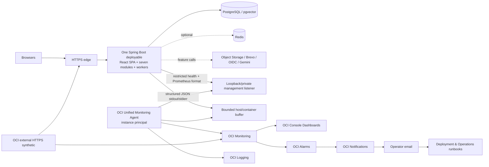

## 5. Signal model and naming

The four initial signal types are:

- **Metrics:** aggregated numeric time series for rates, counts, gauges, durations, ages, saturation, and outcomes.
- **Logs:** structured, bounded diagnostic events explaining what class of operation occurred and how it ended.
- **Health:** deliberately small liveness/readiness/feature-state assessments.
- **Synthetic results:** independent outside-in DNS/TLS/HTTPS/SPA reachability evidence.

Distributed traces are not collected initially. A safe `traceId`/request ID correlates request logs, Problem Details, and immediate downstream log events; durable work uses its existing restricted work identifiers in logs. Metrics never use a trace ID.

Custom OCI application metrics use namespace `notes_workspace`. Conceptual Micrometer names use `notes.workspace.*`; exporter normalization may render punctuation differently without changing semantics. Standard Boot/JVM/process meters retain their managed names. Platform and operational signals may instead retain their OCI-native, host-native, synthetic, deployment, or operator-evidence names; they do not need a Java/Micrometer equivalent merely to appear beside application metrics on a dashboard.

Allowed bounded dimensions are selected from: `environment`, `module`, `operation`, normalized HTTP `route`, HTTP `method`, status class, stable safe `outcome`, `dependency`, `providerCapability`, `queryClass`, `jobType`, bounded `workState`, `modality`, and `severity`. Every dimension has a documented allowlist and maximum cardinality.

Forbidden metric dimensions include UserId, AccountId, NoteId, AttachmentId, PublicationId, ReportId, work/security-event IDs, email, handle, IP, session/cookie/token, filename, object key, model prompt, query text, raw URL/path/query string, provider error text, exception message, trace/request ID, and any other user- or resource-specific identifier.

### Diagram B — Actuator/Micrometer to OCI Monitoring

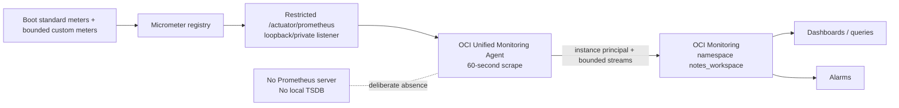

## 6. Metric design and cardinality budget

Counters record monotonic events; timers/distributions record latency; gauges record current bounded state; age gauges record staleness. The initial scrape interval is 60 seconds. Request-level events are aggregated inside Micrometer; one datapoint is not exported per request. Histograms/percentiles are enabled only for named latency families whose buckets are justified by an SLO. Meter filters deny unknown tags and cap each allowlisted tag value set.

Route dimensions use framework route templates such as `/api/notes/{noteId}`, never raw paths. Unknown/unmatched routes collapse to `UNKNOWN` or a bounded class. Provider errors map to stable safe classes such as `timeout`, `rate_limited`, `unavailable`, `invalid_response`, and `policy_denied`; raw messages are logs-only after sanitization or are discarded.

### 6.1 Core metric catalog

The following is the initial meaningful **application/Micrometer metric** catalog, not permission to generate hundreds of series. These meters are produced by the Spring Boot application and exposed through the restricted Prometheus-format endpoint. “Max” is the intended number of values for the named dimension set per environment; implementation must verify actual stream multiplication before enabling export.

| Metric | Type / unit | Allowed dimensions (max) | Source | Purpose | Dashboard | Alert |
|---|---|---|---|---|---|---|
| `http.server.requests` | timer / seconds | route ≤91, method ≤6, statusClass ≤6, outcome ≤8 | Boot MVC | core request rate/error/latency by template | HTTP / API | sustained 5xx, latency |
| `notes.workspace.http.inflight` | gauge / requests | module ≤7 | request filter | saturation and drain behavior | System Overview | overload diagnosis |
| `jvm.memory.used` / `max` | gauge / bytes | area/id managed-bounded | Boot JVM | heap/non-heap pressure | JVM / Database / Redis | memory pressure |
| `jvm.gc.pause` | timer / seconds | action/cause bounded | Boot JVM | GC stalls | JVM / Database / Redis | latency diagnosis |
| `jvm.threads.live` | gauge / threads | none | Boot JVM | thread growth | JVM / Database / Redis | capacity diagnosis |
| `process.uptime` / CPU | gauge | none | Boot/process | restart and CPU pressure | System Overview | restart/capacity |
| `hikaricp.connections` | gauge / connections | state ≤5, pool ≤2 | Boot DB pool | pool saturation | JVM / Database / Redis | pool saturation |
| `notes.workspace.db.operation` | timer / seconds | queryClass ≤12, outcome ≤6 | repository adapters | selected query latency/failure without SQL text | JVM / Database / Redis | DB latency/failure |
| `notes.workspace.redis.operation` | timer / seconds | operationClass ≤6, outcome ≤6 | Redis adapter | transient dependency health | JVM / Database / Redis | Redis outage |
| `notes.workspace.redis.evictions` | counter | none | Redis | memory pressure/loss | JVM / Database / Redis | warning |
| `notes.workspace.rate_control` | counter | class ≤9, outcome ≤4 | rate-control boundary | fail-safe/limit activation | Identity / Security Delivery | abnormal activation |
| `notes.workspace.knowledge.work.count` | gauge / items | jobType ≤8, state ≤7 | Knowledge durable relation | queue/claim/retry/failure | Knowledge / AI / Retrieval | backlog/failure |
| `notes.workspace.knowledge.work.oldest_age` | gauge / seconds | jobType ≤8, eligibility ≤2 | Knowledge durable relation | user-visible freshness | Knowledge / AI / Retrieval | >10m / >30m |
| `notes.workspace.knowledge.work.outcome` | counter | jobType ≤8, outcome ≤8 | executor | success/retry/reclaim/terminal failure | Knowledge / AI / Retrieval | failure/reclaim spike |
| `notes.workspace.security_email.work.count` | gauge / items | jobType ≤2, state ≤6 | Identity relation 38 | exactly `queued`, `claimed`, `retry_wait`, `submitted`, `failed`, or `obsolete` | Identity / Security Delivery | backlog/failure |
| `notes.workspace.security_email.oldest_ready_age` | gauge / seconds | jobType ≤2 | Identity relation 38 | provider-submission freshness | Identity / Security Delivery | >5m / >15m |
| `notes.workspace.security_email.outcome` | counter | jobType ≤2, outcome/reasonClass ≤8 | Identity executor | safe outcomes such as `submitted`, `retry_scheduled`, `obsolete`, and `failed`; `obsolete_due_to_expiry` is a reason class, not persistence state | Identity / Security Delivery | terminal failure spike |
| `notes.workspace.search.request` | timer / seconds | queryClass ≤4, strategy ≤4, outcome ≤8 | Knowledge/Search | lexical/fuzzy, exact, hybrid, extraction latency | Knowledge / AI / Retrieval | Search/retrieval latency |
| `notes.workspace.retrieval.candidates` | distribution / count | queryClass ≤4, stage ≤6 | retrieval pipeline | bounded candidates/coverage diagnostics | Knowledge / AI / Retrieval | regression diagnosis |
| `notes.workspace.retrieval.coverage` | gauge / ratio | queryClass ≤4, state ≤5 | coverage tracker | truthful corpus-operation progress | Knowledge / AI / Retrieval | stalled/degraded coverage |
| `notes.workspace.ai.provider` | timer / seconds | capability ≤5, provider ≤3, outcome ≤8 | provider adapter | success, 429/resource-exhausted, timeout, unavailable, and other bounded provider outcomes | Knowledge / AI / Retrieval | provider/quota |
| `notes.workspace.ai.budget.usage_ratio` | optional gauge / ratio | provider ≤3, capability ≤5, budgetWindow ≤3 | local application budget | local use divided by a currently verified configured soft budget; never Google's authoritative remaining quota | Capacity / Cost / Release | budget/quota danger |
| `notes.workspace.attachment.validation` | timer / seconds | modality ≤4, outcome ≤8 | Attachment boundary | bounded validation latency/failure | Storage / Publication | validation spike |
| `notes.workspace.storage.operation` | timer / seconds | objectClass ≤4, operation ≤6, outcome ≤8 | storage adapter | Object Storage health | Storage / Publication | storage failure |
| `notes.workspace.storage.staging_oldest_age` | gauge / seconds | modality ≤4 | reconciliation | aged unreachable staging | Storage / Publication | staging age |
| `notes.workspace.identity.auth` | counter | flow ≤9, outcome ≤8 | Identity boundary | bounded auth/OIDC/MFA outcomes | Identity / Security Delivery | anomaly/support diagnosis |
| `notes.workspace.security.control_rejected` | counter | control ≤12, reasonClass ≤8 | security boundary | CSRF/recent-auth/MFA/rate/policy rejection | Identity / Security Delivery | zero-tolerance class or spike |
| `notes.workspace.publication.command` | counter | operation ≤5, outcome ≤8 | Publishing | publish/update/unpublish/republish/moderation | Storage / Publication | denial failure |
| `notes.workspace.public.denial` | counter | reasonClass ≤8, outcome ≤3 | public route/generation gate | immediate logical denial evidence | Storage / Publication | any failed denial |
| `notes.workspace.moderation.command` | counter | operation ≤4, outcome ≤6 | Moderation | begin review/decision/consequence | Identity / Security Delivery | consequence failure |

PostgreSQL application signals come from Boot pool/transaction meters and bounded application query-class timers. Platform PostgreSQL/storage evidence can come from host/OCI signals and narrowly scoped operator-owned PostgreSQL statistics collection. No additional PostgreSQL exporter is required initially. Slow-query evidence never logs bind values or private SQL parameters.

### 6.2 Platform and operational signal catalog

The following signals are produced or owned by OCI, the host, deployment automation, external synthetic monitoring, bounded PostgreSQL/operator collection, or a reviewed operational evidence process. They may share dashboards and alarms with application metrics, but are **not required to originate from Java or Micrometer**.

| Signal | Form / unit | Owner/source | Purpose | Dashboard | Alert / constraint |
|---|---|---|---|---|---|
| VM CPU, memory, disk, inode, network | OCI/host metric / ratio, bytes, count | OCI Compute agent / host | one-VM saturation and exhaustion | System Overview; JVM / Database / Redis; Capacity / Cost / Release | memory, disk, and capacity alerts |
| PostgreSQL/WAL/index/storage growth | bounded operational metric / bytes | PostgreSQL/host operational collector | authoritative data capacity | JVM / Database / Redis; Capacity / Cost / Release | capacity danger; no SQL parameters |
| Object Storage capacity/request usage | provider-native usage / bytes, count | OCI Object Storage / operator evidence | shared free capacity and request guard | Storage / Publication; Capacity / Cost / Release | free-tier danger; no object keys |
| Certificate validity/expiry | synthetic/edge signal / seconds | external synthetic / ACME-edge evidence | public TLS renewal | System Overview | certificate expiry |
| Backup/recovery-point age | bounded operational evidence / seconds | Deployment backup process/operator | restore readiness | Capacity / Cost / Release | stale backup; not application authority |
| Monitoring ingestion/retrieval usage | OCI-native or operator-reviewed usage / ratio/count | OCI usage/limits evidence | telemetry free-tier guard | Capacity / Cost / Release | no Java account query or credentials |
| Logging usage | OCI-native or operator-reviewed usage / bytes/ratio | OCI usage/limits evidence | log-volume free-tier guard | Capacity / Cost / Release | no Java account query or credentials |
| Synthetic-run and Notifications use | OCI-native or operator-reviewed usage / count/ratio | OCI usage/limits evidence | run/message allowance guard | Capacity / Cost / Release | no Java account query or credentials |
| Outbound transfer and infrastructure allowance | OCI-native or operator-reviewed usage / bytes/ratio | OCI usage/limits evidence | zero-cost guard | Capacity / Cost / Release | STOP AND REVIEW before billable boundary |
| Gemini configured limits/quota evidence | provider-console/operator evidence | current official limits and Google AI Studio/provider controls | deployment revalidation of model/tier limits; corroborate 429 outcomes | Knowledge / AI / Retrieval; Capacity / Cost / Release | not a precise application-side remaining-quota percentage; no Google billing/monitoring credentials in Java |
| Current release/deployment identity | safe annotation/metadata | CI/CD release manifest + deployment process | correlate regression with version, Git SHA, image digest, timestamp | System Overview; Capacity / Cost / Release | never ordinary metric dimensions; stable-series marker only if platform-native |

Where OCI exposes a native usage/limit signal, use it. Where only Console, API, or operator evidence exists, record a bounded dated operational review. Dashboard 7 may combine application metrics, OCI-native resource metrics, and revalidated operator evidence. The Java application receives no OCI billing, Monitoring, Logging, or account-usage credentials merely to manufacture these signals.

Zero-tolerance metrics are counters expected to remain zero. They are not labeled by user/resource ID and are never sampled away:

- cross-user authorization/candidate/citation violation;
- AI-OFF content entering an AI-dependent stage or provider payload;
- unauthorized or invalid citation/provenance escape;
- public bytes/content reachable after logical denial;
- pre-MFA authority reaching a protected private operation;
- security-email authority/material/revalidation/fencing corruption;
- moderator/private-Note, private-media, Search, RAG, or provider-context bypass.

## 7. Structured logging, correlation, and privacy

Spring Boot built-in structured JSON logging is the initial encoder. ECS is preferred because it supplies well-known JSON fields without requiring an Elastic backend; use does not select Elasticsearch. Spring Boot 4.1.1 support and OCI parsing must be validated live. If ECS does not ingest cleanly, another Boot built-in structured JSON format may be selected without semantic change or a duplicate logging stack.

The application writes JSON to stdout/stderr. The container/host retains a small bounded, rotated buffer; the OCI Unified Monitoring Agent tails it into OCI Logging. Agent/export failure drops or buffers only within strict disk/memory caps, emits a local health signal if possible, and never blocks request correctness or durable commits.

Stable safe fields are: `@timestamp`, `log.level`, `service.name`, `service.environment`, `service.version`, `service.git.commit`, deployment digest/prefix when available, `log.logger`, `process.thread.name`, server-controlled `trace.id`/`request.id`, `event.name`, `module`, `operation`, `outcome`, `durationMs`, normalized `http.route`, method, status, safe error code, bounded provider capability, job type/state, and safe aggregate counts.

The default production level is `INFO`. `DEBUG`/`TRACE` are disabled. A temporary increase requires an operator, affected logger allowlist, start/end time, disk/log-budget check, privacy review, and automatic reversion. Framework wire logging, SQL bind parameters, security filters, mail bodies, provider payloads, and HTTP bodies stay disabled regardless.

### Diagram C — structured logs to OCI Logging

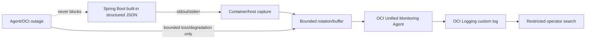

### 7.1 Correlation strategy

The backend creates a cryptographically uninteresting, non-authoritative correlation value for each request. A client-supplied value is untrusted: accept only a narrow length/character format and otherwise replace it. Return the safe value in Problem Details as `traceId` where already approved, and place it in MDC/log fields. It is never a credential, resource identifier, database key, authorization input, cache key, or metric dimension.

Immediate same-process calls retain the correlation context. Durable jobs may use existing Knowledge work IDs plus safe generation/currentness, attempt-band, reclaim-outcome, and lease-expired/reclaimed boolean or class evidence only in restricted logs. Raw lease tokens, hashes, fingerprints, and other derivatives are never telemetry. The schema is not changed to persist originating HTTP traces. Once work is durable, its authoritative lifecycle is independent of a request trace.

### Diagram D — request correlation without authority

```mermaid
sequenceDiagram
    participant B as Browser
    participant F as Request filter
    participant A as Application/module
    participant L as Structured log
    participant P as Problem Details
    B->>F: HTTP request + optional untrusted correlation value
    F->>F: validate bounded value or replace; create server traceId
    F->>A: request context only
    A->>L: safe events with traceId
    A-->>P: safe failure code + traceId when needed
    P-->>B: RFC 9457 response
    Note over F,A: traceId grants no access and is never a metric label or DB authority
```

### 7.2 Structured log-event catalog

| Event name | Level | Safe fields beyond common envelope | Forbidden examples | Sampling / retention |
|---|---|---|---|---|
| `application.start` | INFO | version, commit, digest, environment | secrets/config values | always; operational retention |
| `application.ready` | INFO | startup duration, schema-compatible boolean | datasource URL/credentials | always |
| `application.shutdown` | INFO | reason class, drain duration | in-flight private payloads | always |
| `request.completed` | INFO/WARN | route template, method, status, duration, outcome | raw path/query/body, user/resource ID | successful high-volume routes may be bounded-sampled; errors always within rate cap |
| `auth.outcome` | INFO/WARN | flow, outcome, reason class | email, password, OIDC token, session ID | never sample suspicious aggregates; no per-login alert |
| `security.control.rejected` | WARN | control, safe reason class | CSRF/session/MFA/recovery values | always for zero-tolerance/security classes; rate-limited duplicates |
| `note.command.outcome` | INFO/WARN | command, outcome, safe errorCode, duration | title/body/tags/URL, NoteId | bounded; failures always |
| `attachment.validation.outcome` | INFO/WARN | modality, size band, outcome, duration | filename, bytes, object key | bounded; failures always |
| `storage.operation.outcome` | INFO/WARN | object class, operation, outcome, duration | bucket/object key, signed URL, credentials | success sampled if noisy; failures always |
| `knowledge.work.outcome` | INFO/WARN/ERROR | job type/state, age band, attempt band, outcome | content, work ID in broad logs, vector | terminal/fencing failure always; success aggregated/sampled |
| `retrieval.outcome` | INFO/WARN | query class, strategy, candidate/coverage bands, outcome | query, snippets, citations/resource IDs | bounded; degraded/failure always |
| `ai.provider.outcome` | INFO/WARN/ERROR | provider capability, model config ID, latency, safe error class | prompt, response, evidence, token/user content | success sampled; policy/security failures always |
| `security_email.work.outcome` | INFO/WARN/ERROR | job type/state, age/attempt band, provider outcome | recipient, token/ciphertext, envelope, security event content | always for terminal/lease/revalidation failures; successes bounded |
| `publication.command.outcome` | INFO/WARN/ERROR | command, generation-change boolean, outcome | private provenance, Note/public-media IDs | always for logical-denial failure |
| `public_denial.outcome` | WARN/ERROR | reason class, route class, outcome | public/private resource locator | never sampled when denial fails |
| `moderation.outcome` | INFO/WARN/ERROR | operation, consequence class, outcome | report text, private Note/media, actor identity | attributable safe audit reference only; failure always |
| `dependency.state_change` | INFO/WARN/ERROR | dependency, prior/current state, feature impact | endpoint secrets/provider bodies | state changes only; deduplicated |

### 7.3 Telemetry data classification

| Class | Examples | Metrics | Logs | Dashboards | Alerts |
|---|---|---|---|---|---|
| Safe / Expected | route template, status class, module, bounded operation/outcome, duration, aggregate count, provider capability | Allowed as bounded dimensions/values | Allowed | Allowed aggregate | Allowed aggregate |
| Safe Release Metadata | application version, Git SHA, image digest, deployment timestamp | Not ordinary metric dimensions | Allowed in `application.start` and deployment/release records | Allowed on restricted release/deployment annotations and current-release metadata | Safe annotation/reference only; not a changing metric label |
| Restricted Operational Identifier | server traceId, durable work ID, internal event reference | Forbidden as dimension | Restricted logs only when necessary, short-lived, access-controlled | Never | Never in notification body; link operator to restricted view |
| Forbidden | Note title/body, Search/Ask text/answer, prompt/response/evidence, URLs, attachment bytes/transcript/filename/object key, email, handle, raw UserId, credentials, cookies/session/CSRF/OIDC/MFA/recovery/capability material, security-email ciphertext, raw IP | Never | Never | Never | Never |

Exceptions and stack traces are sanitized. Production responses and logs contain stable safe error codes/classes, not SQL, parameters, provider bodies, filesystem paths, secrets, or private content.

## 8. Durable-work observability

Knowledge and security-email workers are observed separately because they have different authorities, privacy risks, and user-facing freshness targets. Queue count, oldest ready/eligible age, claim rate, expired-lease reclaim, retry, terminal failure, provider latency, and completion throughput are aggregated from owner-module state. Telemetry cannot claim, retry, invalidate, send, activate, or obsolete work. Relation 38 has exactly six persistence states: `queued`, `claimed`, `retry_wait`, `submitted`, `failed`, and `obsolete`. Capability/event/policy expiry is revalidated by Identity; when it makes delivery ineligible, the work becomes `obsolete`, optionally with safe diagnostic reason `obsolete_due_to_expiry`. That reason is not a seventh state. An **expired lease** remains a separate, valid reclaim condition.

### Diagram E — Knowledge durable-work visibility

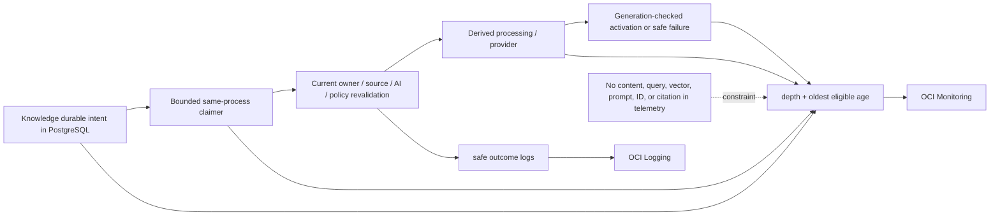

### Diagram F — Identity security-email work visibility

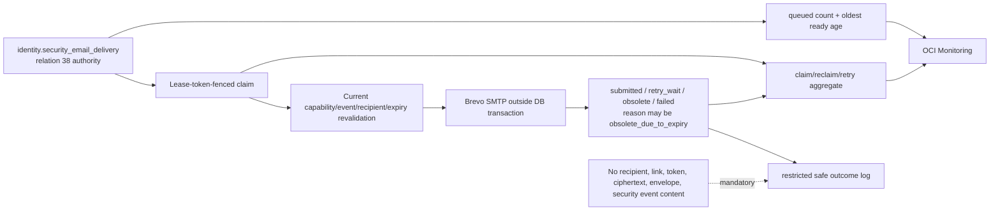

## 9. Health architecture and dependency degradation

**Liveness** says the process and internal runtime can continue. It does not call Gemini, Brevo, Redis, Object Storage, OIDC, DNS, or TLS; it does not flap on transient PostgreSQL latency. A deadlocked/fatally unhealthy process may fail liveness, but optional dependency failure does not.

**Readiness** says ordinary core requests can be handled safely. It requires completed initialization, valid mandatory configuration, PostgreSQL reachability, expected Flyway schema and pgvector availability, and enforceable core security/authority. PostgreSQL unavailability or inability to enforce core authority makes the instance not ready. Optional/provider failures usually keep readiness up while their features degrade truthfully.

**Feature health** is a restricted operator view of dependency/capability state. It is neither a public endpoint nor a promise that every feature call will succeed. Public health output, if any is operationally required, is a minimal status only; details remain loopback/private.

### Diagram G — liveness, readiness, and feature health

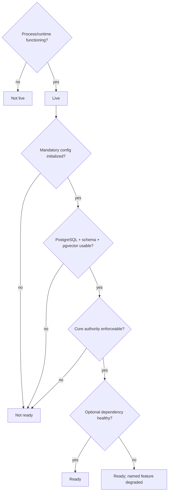

### 9.1 Feature-health matrix

| Capability / dependency | Authority | Readiness effect | Feature impact | Primary signal | Alert | Degradation / runbook |
|---|---|---|---|---|---|---|
| PostgreSQL / pgvector / Flyway schema | authoritative | Required | nearly all stateful features | readiness, pool, query class, storage | critical | fail closed; runbooks 5/6/4 |
| Redis | transient only | Conditional: required only if a security control cannot fail safely | rate control, dedupe, approximate views/cache | operation errors, memory, evictions, fail-safe counter | high/warning | safe fallback or fail closed; runbook 8 |
| OCI Object Storage | byte authority with DB locators | Usually no | upload/download/avatar/public media bytes | operation outcome/latency, staging age, capacity | high | metadata/core Notes continue; runbooks 9/10 |
| Brevo SMTP | external submission; relation 38 remains authority | No | verification/reset/security notice delivery | oldest ready age, submit latency/outcome/quota | high | durable delay, enumeration safety; runbooks 11/15 |
| Google OIDC | external identity provider | No | new OIDC login/link | bounded callback outcome/state change | warning/high | password/existing sessions unaffected; runbook 16 |
| Gemini chat | provider only | No | AI answer/generation | provider latency/error/quota | warning | deterministic results may remain; runbook 12 |
| Gemini embedding/multimodal | provider only | No | indexing/semantic/multimodal freshness | Knowledge age, provider outcome, lineage | warning/high | lexical/fuzzy and existing compatible lineage only; runbooks 12/13/14 |
| DNS / TLS / edge | public reachability | process may remain ready; external service unavailable | all browser/public traffic | external probe, cert expiry | critical/high | no HTTP downgrade; runbook 17 |
| Knowledge executor | PostgreSQL durable work remains authority | No unless unsafe resource failure threatens core | derived freshness/query operations | oldest eligible age, claim/reclaim/failure | high | truthful lag/degradation; runbook 14 |
| Security-email executor | relation 38 remains authority | No | security delivery freshness | oldest ready age, reclaim/retry/failure | high | safe delay; runbook 15/11 |
| OCI Monitoring / agent | diagnostic only | No | metrics, dashboards, alarms | heartbeat/absence, agent health | high | app continues; inspect agent/IAM; operational gap if prolonged |
| OCI Logging / agent | diagnostic only | No | centralized logs | ingestion heartbeat, local buffer/disk | warning/high | app continues, bounded local rotation; inspect agent/IAM |
| OCI Notifications | notification transport only | No | operator alarm delivery | service metric/test notification | high | Console alarm state remains; operator checks manually |

## 10. External synthetic monitoring and frontend visibility

One external OCI HTTPS synthetic monitor checks the canonical public origin from outside the VM. Subject to current official Always Free verification, run it every six minutes (10 runs/hour) to test DNS resolution, TLS validity/hostname/chain, edge reachability, HTTP response, and delivery of a small safe SPA/public route. It is read-only, anonymous, bounded, and sends no secret or private content.

If the same verified allowance supports a second safe check without exceeding 10 total runs/hour, it may probe one existing anonymous read-only endpoint such as a public exploration/profile representation. It must not create a new API endpoint, authenticate, mutate data, like/report, fetch a stored URL, or expose a private identifier. The first monitor has priority.

There is no third-party browser analytics, RUM SDK, session replay, keystroke capture, or public status-page dependency initially. Frontend production visibility comes from server route metrics, safe JS error reports only if a later privacy-reviewed first-party mechanism is approved, Playwright evidence, the external synthetic, and user/incident reports. Future RUM requires explicit privacy, CSP, data-transfer, retention, cardinality, cost, and consent review.

### Diagram H — outside-in synthetic path

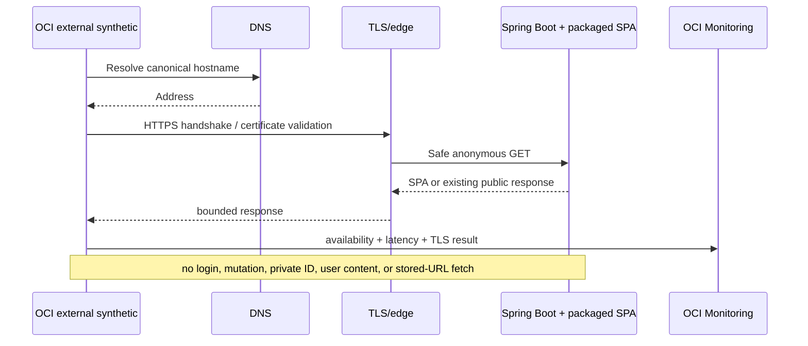

## 11. SLIs, SLOs, and error budget

These are internal initial operational objectives, not a commercial SLA or contractual promise. One free VM and one application replica cannot honestly promise zero downtime. Planned deployment/restart downtime counts against external availability.

| SLI | Measurement source | Initial objective | Window | Exclusions / qualifications | Alert relationship | Contractual? |
|---|---|---|---|---|---|---|
| Core external availability | independent HTTPS synthetic successful probes / scheduled probes | ≥99.0% | rolling 30 days | only documented probe-provider invalid results may be excluded; planned downtime counts | fast unavailability plus budget-burn review | No |
| Core server outcome | valid core requests without app-attributable 5xx/core 503 | <1% app-attributable failure | rolling 30 days plus 5m/30m views | expected 4xx never automatically fail; classify 503 truthfully; do not game denominator | sustained 5xx alarms | No |
| Ordinary non-AI core API latency | server p95 for allowlisted core route classes | ≤750 ms | rolling 30 days; operational 5m/30m | excludes password hashing, large byte streaming, AI/provider, long Knowledge operations | sustained p95 warning/high | No |
| Private lexical/fuzzy Search latency | p95 server duration | ≤1 s | rolling 30 days; operational 15m | representative bounded corpus; excludes client/network and AI | Search latency alert | No |
| Exact-vector/hybrid pre-generation latency | p95 retrieval before model generation | ≤2 s | rolling 30 days; operational 15m | query embedding/provider time reported separately; track p50/p95/p99 | retrieval latency alert | No |
| Knowledge freshness | eligible ready work beginning processing within target | ≥95% within 5 min when provider/quota healthy | rolling 7 days and current oldest age | excludes policy-ineligible/obsolete work and declared provider/quota outage, which is reported separately | warning oldest >10m; high >30m | No |
| Security-email freshness | eligible ready work reaches provider submission | ≥95% within 2 min when Brevo/quota/dependencies are healthy | rolling 7 days and current oldest eligible-ready age | submission is not mailbox delivery; no exactly-once claim; work invalidated by capability/event/policy expiry transitions to `obsolete` with optional safe reason `obsolete_due_to_expiry` | warning oldest eligible ready >5m; high >15m | No |

For latency, p50 explains typical behavior, p95 is the objective, and p99 highlights tail pain; none is calculated from raw user identifiers. AI provider latency is separate from core latency because a free external provider is optional, quota-bound, and outside core control. AI availability has feature-health targets and alerts, not the core availability SLO.

The 99.0% availability objective has a 1% rolling error budget: approximately 7.2 hours in a 30-day month, measured at the six-minute probe resolution. The budget is a decision aid, not permission to schedule 7.2 hours of downtime. When exhausted, pause nonessential releases and prioritize stability, diagnosis, and recovery. Security violations have no error budget.

### Diagram I — SLI to operational decision

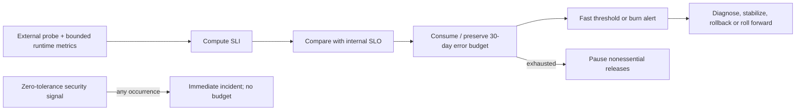

### 11.1 Zero-tolerance operational invariants

| Condition expected at zero | Evidence | Response |
|---|---|---|
| Cross-user private resource/candidate/cache/citation exposure | release tests plus runtime safe violation counter/log | immediate security incident; disable affected path; preserve evidence |
| AI-OFF content/derivative enters AI stage/provider context | permit/provider-capture tests and runtime policy counter | stop AI dispatch; incident and revalidation |
| Unauthorized or unvalidated citation/provenance | citation validator/test/runtime invariant event | disable affected answer path; incident |
| Public content/media reachable after logical denial | anonymous denial probe and public-denial metric | runbook 21; security incident |
| Pre-MFA session performs protected operation | security enforcement tests and runtime rejection/violation signal | revoke/contain; security incident |
| Security-email material/authority/fencing/revalidation corruption | relation-38 invariants and worker events | halt affected delivery; runbook 15; incident |
| Moderator gains private Note/media/Search/RAG/provider context | authorization tests and runtime invariant event | revoke capability/session; security incident |

The first, second, third, fifth, and seventh rows expose a Deployment runbook gap: the approved catalog has no general security-incident runbook. This document does not invent one. Before production, the existing deployment/operations authority must add or approve the appropriate incident-response procedure without weakening any baseline.

## 12. Dashboards

Exactly seven restricted logical dashboards are defined. They contain aggregates only, inherit OCI IAM least privilege, are not public, and never show private content, raw identifiers, prompts, URLs, emails, filenames, object keys, query strings, traces, or secrets.

| # | Dashboard | Audience and questions | Core panels | Specifically forbidden |
|---:|---|---|---|---|
| 1 | **System Overview** | operator; is the public service reachable, live, ready, stable, and within SLO? | external availability/TLS, liveness/readiness, request rate/5xx/p95, uptime/restarts, active dependencies, error budget, safe current-release annotation/metadata | user activity list, raw paths, health details/secrets |
| 2 | **HTTP / API** | backend/operator; which route classes and outcomes explain latency/errors? | route-template rate, 4xx/5xx, p50/p95/p99, inflight, Problem code class, top bounded slow route templates | raw URL/query/body, IDs, IP/email, trace list |
| 3 | **JVM / Database / Redis** | backend/operator; is the one VM/process/data plane saturated? | heap/native/GC/threads/CPU/disk, Hikari pool, DB query classes/storage, Redis memory/evictions/errors/fail-safe | SQL text/parameters, keys/values, session identifiers |
| 4 | **Knowledge / AI / Retrieval** | Knowledge/operator; is derived data fresh and retrieval/provider behavior truthful? | Knowledge depth/oldest age/reclaim/failure, Search and pre-generation p50/p95/p99, candidate/coverage bands, provider latency/errors/quota/model ID | queries, Note/citation IDs, prompts/responses, vectors, evidence |
| 5 | **Identity / Security Delivery** | security/operator; are auth controls and security mail functioning safely? | bounded auth outcomes, security-control classes, rate control, email depth/age/retry/submission/failure, OIDC state | email/account/session/token/capability/recovery material |
| 6 | **Storage / Publication** | storage/publishing/operator; are bytes valid, capacity bounded, and public denial immediate? | validation outcomes, storage latency/errors, staging age, object capacity, publication commands, public-denial failures, moderation consequences | filenames, keys, signed URLs, private provenance/report text |
| 7 | **Capacity / Cost / Release** | owner/operator; will the free envelope hold and did a release regress? | application telemetry plus OCI-native/operator usage evidence, outbound usage, backup age, safe version/SHA/digest/deployment annotation, before/after core signals | release identity as metric labels, billing credentials, user-level usage |

## 13. Alerting and notification design

Severities are:

- **Sev-1 Critical:** current security/correctness/public availability incident needing immediate action.
- **Sev-2 High:** sustained major feature/core degradation or imminent capacity loss needing prompt action.
- **Sev-3 Warning:** early degradation or budget risk for planned intervention.
- **Info:** state change/recovery/release annotation, normally dashboard-only.

Sev-1 and Sev-2 alarms publish through OCI Alarms to an OCI Notifications topic with confirmed operator email subscriptions. This channel is independent of Brevo, so a Brevo outage cannot suppress operational alarms. Notifications contain only alarm name, severity, environment, bounded signal/threshold, start time, safe dashboard/runbook reference, and no private identifier or content.

Every alarm has a sustained/pending window unless a zero-tolerance invariant justifies immediate firing; alarms deduplicate while open, use a repeat interval/cooldown, and send recovery. Planned maintenance uses time-bounded OCI alarm suppression for expected availability/restart signals. Security violation and public-denial-failure alarms are never suppressed merely for deployment convenience.

### 13.1 Actionable alert catalog

| # | Alert | Signal and condition / window | Severity / notification | Suppression and recovery | Approved runbook / gap |
|---:|---|---|---|---|---|
| 1 | External service unavailable | synthetic failures from required vantage policy for 2 consecutive probes (~12m); immediate operator check on first failure | Sev-1 / OCI email | deployment maintenance only; recover after 2 successes | 17 TLS/DNS failure; 7 VM loss if host absent |
| 2 | Application not ready | readiness=down for 5m outside deployment | Sev-1 / OCI email | normal deployment window only; recover 5m ready | 2 Failed deployment; 5 PostgreSQL outage |
| 3 | PostgreSQL unavailable | DB health/connection success absent 2m | Sev-1 / OCI email | never mask outside declared DB maintenance; recover 5m | 5 PostgreSQL outage; 6 if integrity uncertain |
| 4 | Sustained core 5xx/503 | app-attributable core failures >5% for 5m or >1% for 30m with minimum traffic | Sev-2 / OCI email | maintenance only for expected rejection; recover below thresholds 15m | 2 Failed deployment or 3 Application rollback when release-correlated |
| 5 | Core API p95 high | allowlisted non-AI core p95 >750ms for 15m | Sev-3; escalate Sev-2 >1.5s/15m | suppress only during planned load test; recover <target 15m | 3 Application rollback if regression; 5 if DB-related |
| 6 | Restart/crash loop | uptime resets ≥3 in 15m or process missing | Sev-1 / OCI email | deployment permits one expected restart; recover 30m stable | 2 Failed deployment; 7 VM loss |
| 7 | Disk/inode low | free <15% warning; <8% or projected <24h high for 10m | Sev-3 / Sev-2 email | no indefinite suppression; recover >20% | 7 VM loss/host recovery; 5 if DB volume affected |
| 8 | JVM/host memory pressure | heap >85% after GC or host available <10% for 15m; OOM/restart critical | Sev-2 / OCI email | deployment startup grace; recover 30m | 2 Failed deployment; 3 rollback if regression |
| 9 | DB pool saturation | active/max >85% and pending >0 for 10m | Sev-2 / OCI email | none beyond planned load test; recover <70% 15m | 5 PostgreSQL outage/diagnosis |
| 10 | Redis unavailable affects control | Redis errors plus security fail-safe activation for 5m | Sev-2 / OCI email | none for safety path; recover 10m | 8 Redis outage |
| 11 | Knowledge backlog age | oldest eligible >10m warning; >30m high | Sev-3 / Sev-2 email | provider-maintenance annotation does not hide age; recover <5m | 14 Stuck Knowledge work; 12/13 if provider/model cause |
| 12 | Knowledge failure/reclaim spike | terminal/reclaim rate >3× 7-day same-hour baseline with minimum 5 in 15m | Sev-2 / OCI email | deployment grace only; recover normal 30m | 14 Stuck Knowledge work |
| 13 | Security-email backlog age | oldest eligible ready >5m warning; >15m high | Sev-3 / Sev-2 email | never expose recipient; recover <2m | 15 Stuck security email; 11 Brevo outage/quota |
| 14 | Security-email terminal failure spike | ≥3 terminal failures or >5% eligible work in 15m | Sev-2 / OCI email | no suppression for authority/fencing failures; recover 30m | 15 Stuck security email; 11 provider cause |
| 15 | Object Storage failure | failure >5% with minimum 5 operations/10m or dependency down 5m | Sev-2 / OCI email | planned provider maintenance only; recover 15m | 9 Object-storage outage |
| 16 | Staging backlog too old | unreachable staging oldest age exceeds approved cleanup age plus grace | Sev-3; Sev-2 when capacity threatened | cleanup maintenance may suppress duplicates; recover after verified reconciliation | 10 Orphan staging cleanup |
| 17 | AI provider failure/rate limit | capability error/rate-limit >20% with minimum 5 calls/15m | Sev-3; Sev-2 if all configured initial capability unavailable | no core-readiness alarm; recover 30m | 12 Gemini outage/quota |
| 18 | Gemini free-budget / quota exhaustion | verified local soft-budget utilization >70% warning or >85% high; or sustained/repeated provider 429 `RESOURCE_EXHAUSTED`; or explicit provider/operator quota-exhausted evidence when safely available | Sev-3 / Sev-2 email | exact windows/limits follow currently verified model/tier configuration; no paid activation or automatic failover; AI-only degradation; recover after verified reset/config | 12 Gemini outage/quota; STOP AND REVIEW if the free deployment is not viable |
| 19 | TLS certificate expiry | <21d warning, <7d high, invalid/expired critical | Sev-3 / Sev-2 / Sev-1 email | never suppress invalid cert; recover after external verification | 17 TLS/DNS failure |
| 20 | Free-tier capacity danger | any compute/block/object/log/metric/synthetic/notification/outbound ratio >70% warning or >85% high | Sev-3 / Sev-2 email | no paid overage; recover below 65% | Section 20 zero-cost guard; runbook 1 predeploy; STOP AND REVIEW gap |
| 21 | Backup too old/failed | newest verified backup/rehearsal evidence exceeds approved operational interval | Sev-2 / OCI email | planned backup maintenance only; recover after verified backup | 6 PostgreSQL restore readiness; gap until exact interval approved |
| 22 | OCI metric ingestion absent | app/agent heartbeat absent 5m while service probe succeeds | Sev-2 / OCI email only if independent OCI signal can fire | maintenance only; recover 10m | no numbered runbook; agent/IAM operational gap |
| 23 | OCI log ingestion absent/local buffer danger | log heartbeat absent 15m or local log disk >cap | Sev-3; Sev-2 if disk threatened | maintenance only; recover after ingestion and bounded drain | no numbered runbook; protect disk, never block app |
| 24 | Cross-user/AI-OFF/citation/pre-MFA/moderator violation | any zero-tolerance counter >0 | Sev-1 / immediate OCI email | never suppressed; close only after containment and verified evidence | security-incident runbook gap; affected feature disabled |
| 25 | Public denial failed | any content/media success after denial expectation | Sev-1 / immediate OCI email | never suppressed; recover only after anonymous verification | 21 Public-media denial verification |
| 26 | Security-email authority/fencing violation | any invariant violation | Sev-1 / immediate OCI email | never suppressed; recover after worker halt, state validation, containment | 15 Stuck security email plus security-incident gap |
| 27 | Moderation consequence failed | required remove/suspend consequence not established or protected session remains eligible | Sev-1 / immediate OCI email | never suppressed; recover after owner-module verification | no dedicated numbered runbook; security-incident gap |

Thresholds with “approved interval,” ratios, baseline multipliers, or minimum traffic require implementation-time measurement and configuration review. They are not permission to invent retention, retry, or business policy.

### Diagram J — alert to operator response

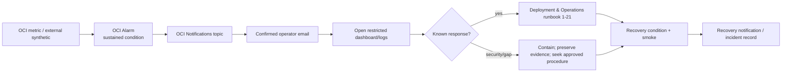

## 14. Release annotations and regression diagnosis

Each human-approved promotion records the immutable image digest, application version, Git commit, deployment start/end, and outcome as safe release metadata. `application.start`, the CI/CD release manifest, deployment annotations, and restricted dashboard metadata expose this identity. Full version, SHA, and digest values are **not ordinary custom metric dimensions**: every release would create historical time-series churn. If a platform-native binary deployment marker is later useful, its series identity stays stable while the annotation carries changing release metadata. Dashboards annotate the stabilization window. A regression decision compares pre/post-release availability, 5xx, latency, memory, DB pool, and backlog age. Observability supports—but does not itself authorize—Deployment runbook 3 rollback or a corrective roll-forward. Schema compatibility remains the deployment authority.

### Diagram K — release-to-regression decision

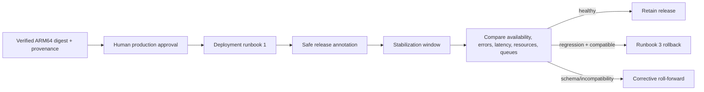

## 15. Telemetry privacy boundary

Sanitization occurs before data reaches MDC, a meter, or stdout. Agent/OCI filters are defense in depth, not the privacy boundary. Dashboard queries and alarm messages select only safe aggregates. Operator access is least privilege and attributable. Exported incident evidence is manually minimized and time-bounded.

### Diagram L — privacy and authority boundary

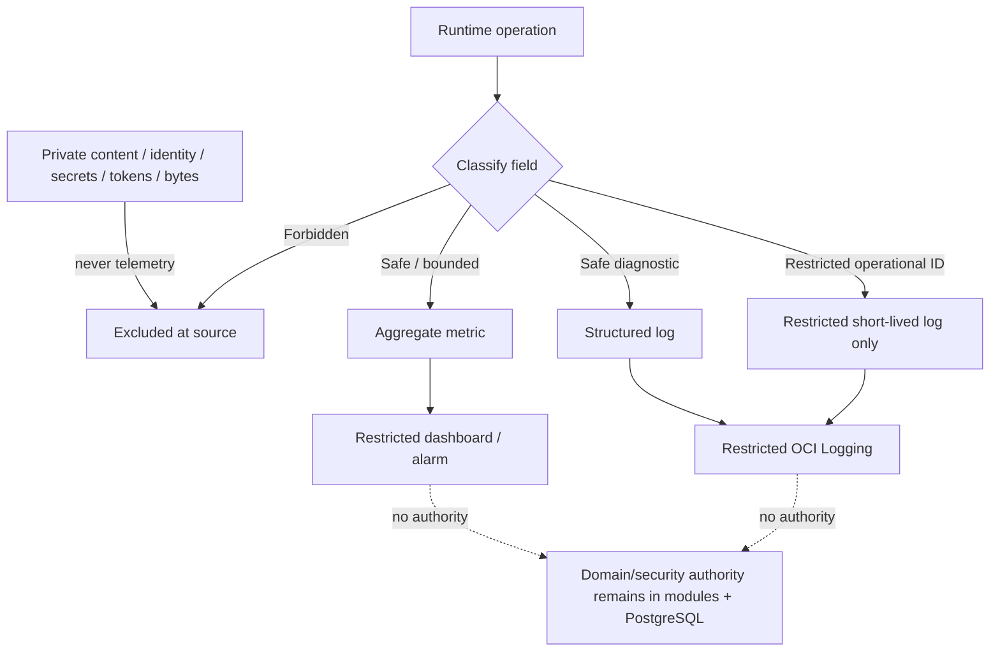

## 16. Retention and lifecycle

There is no invented legal retention requirement. Retention is an operational minimum/maximum chosen for diagnosis, privacy, and free capacity; legal/privacy requirements may later shorten or otherwise govern it through an explicit decision.

| Telemetry class | Initial retention / lifecycle | Authority and access | Privacy | Storage | Zero-cost action |
|---|---|---|---|---|---|
| Application structured logs | 14-day operational target; local rotated buffer much shorter and capped | diagnostic only; restricted operators | no private content; restricted IDs minimized | stdout/host buffer + OCI custom log | reduce verbosity/sampling first; stop optional ingestion before paid use |
| OCI physical application-log copy | OCI currently documents configurable 30-day increments with a 30-day minimum; implementation must revalidate because it cannot presently enforce 14 days exactly | OCI IAM; diagnostic only | same source-minimized JSON | OCI Logging | accept 30-day minimum only after human privacy/free-budget review; otherwise STOP AND REVIEW—do not claim 14-day physical deletion |
| Infrastructure/agent/edge logs | 14-day operational target where controllable; provider minimum disclosed | operator | no secrets/private request data | bounded host/OCI | enable only useful categories; cap and rotate |
| Metrics | 30-day SLO window plus provider-managed availability needed for comparisons; exact provider retention revalidated | aggregate only | bounded dimensions | OCI Monitoring | lower streams/scrape/query range before paid expansion |
| Synthetic results | rolling 30 days for SLO calculation, subject to provider free retention | anonymous probe only | no user data | OCI APM/Monitoring | one priority monitor; reduce secondary check first |
| Alarm state/history | provider-managed minimum useful operational history; target 30 days | operator | safe aggregate only | OCI Monitoring/Notifications | dedupe/repeat control; no content in messages |
| CI evidence | per approved CI/CD retention, unchanged | CI/CD authority | synthetic only | GitHub artifacts/checks | this document does not change CI retention |
| Incident exports | case-by-case, shortest necessary period with explicit owner/deletion date | security/operator | manually minimized, encrypted/restricted | approved protected location | no automatic indefinite archive or paid analytics |

The 14-day application-log target means routine operational usefulness and local lifecycle. The currently documented OCI minimum creates a provider constraint, not permission to lie about deletion or enable paid tooling. Before implementation, verify whether OCI offers a current compliant shorter lifecycle. If it does not, human review must explicitly accept the 30-day physical minimum within the free and privacy envelope or choose another approved zero-cost mechanism.

## 17. Zero-cost capacity and current official evidence

Additional paid observability spend is fixed at ₹0/$0. No automatic overage, paid Logging Analytics, commercial APM, paid synthetic capacity, paid retention, or surprise upgrade is allowed. Budgets/usage alarms are defense in depth, not permission to spend. If a hard cap is available it is enabled; if a required service cannot be held inside verified free limits, **STOP AND REVIEW**.

Current OCI planning checkpoints, verified from official sources on 2026-09-17, are:

| Service | Current planning assumption | Design use | Guard |
|---|---:|---|---|
| OCI Monitoring ingestion | 500 million datapoints/month included | bounded 60-second custom streams plus OCI-native metrics | meter/tag allowlists; stream inventory; usage alarm |
| OCI Monitoring retrieval | 1 billion datapoints/month included | seven dashboards, alarms, bounded investigations | bounded query windows/panels; avoid refresh storms |
| OCI Logging | Free-tier tenancies: up to 10 GB/month shared Logging | minimized structured application logs and only needed service logs | 14-day operational target; provider minimum disclosed; volume alarm |
| OCI Console Dashboards | 100 dashboards/tenancy included | exactly seven logical dashboards | no dashboard sprawl |
| OCI Notifications | 1 million HTTPS and 1,000 email notifications/month included | Sev-1/Sev-2 operator email and recovery | dedupe/cooldown; no alert storms |
| OCI APM synthetic | 10 synthetic monitor runs/hour included | one six-minute external probe; optional second only inside aggregate allowance | monitor-run usage alarm; first monitor priority |
| OCI APM tracing | 1,000 tracing events included | not used as foundation | no initial tracing dependency |

At a 60-second cadence, each continuous stream emits about 43,200 datapoints per 30 days. The theoretical free allowance is not a target: the project keeps streams in the low hundreds, measures actual ingestion, and leaves generous tenancy headroom. Dimension multiplication is reviewed before a meter is released.

When capacity approaches a guardrail, act in this order:

1. remove accidental high-cardinality dimensions and duplicate meters;
2. reduce dashboard refresh/retrieval ranges and unnecessary histogram buckets;
3. aggregate more and increase noncritical scrape intervals where safe;
4. sample routine success logs and lower noisy framework levels;
5. shorten controllable retention and disable optional service-log categories;
6. remove the optional second synthetic check;
7. preserve critical security/availability evidence and stop optional telemetry;
8. STOP AND REVIEW rather than incur cost or lose required safety evidence.

Usage is itself monitored on Dashboard 7. A monthly operator review records date, official URL, tenancy/account/region, observed console allowance and consumption, reviewer, and go/stop result without secrets.

## 18. Distributed tracing decision

No Jaeger, Tempo, Zipkin, OpenTelemetry Collector, commercial tracing agent, or dedicated trace backend is selected. The initial system is one process, one backend deployable, one replica, and PostgreSQL-backed durable work. Metrics, structured logs, safe request correlation, existing work IDs in restricted logs, health, and external synthetic monitoring provide proportionate diagnosis without another service, TSDB, privacy surface, or cost stream.

Future OpenTelemetry/Micrometer tracing becomes eligible only after measured incidents show that HTTP → durable scheduling → asynchronous execution → provider/storage diagnosis cannot be performed reliably with the initial signals. A future explicit design must then review Spring Boot 4.1.1/current compatibility, exporter and backend, sampling, free capacity, sensitive attributes, propagation trust, durable-boundary semantics, retention, cross-provider transfer, and whether the problem actually requires spans. A future extracted service may justify workload identity and distributed tracing; that does not require changing the browser session model.

The small OCI APM tracing allowance is not used merely because it exists. Resume-oriented tracing is rejected.

## 19. Testing, CI/CD, and deployment boundaries

Testing Strategy must later verify, with synthetic canaries, that forbidden data never enters logs/metrics; route templates remain bounded; meter dimensions reject IDs; health semantics degrade correctly; zero-tolerance counters fire in controlled tests; durable ages/reclaims are correct; alarm expressions and dashboard queries use safe aggregates; and telemetry loss does not change application correctness.

CI/CD may later validate the existence/shape of instrumentation, JSON schemas, dashboard/alarm definitions, and release annotations only after implementation is authorized. It must not call live OCI/Gemini/Brevo/OIDC as a mandatory general CI dependency or place production telemetry credentials in CI. This document creates no workflows or configuration.

Deployment & Operations owns provisioning, agent installation, IAM dynamic groups/policies, private listener/networking, log rotation, OCI resources, suppressions, incident operations, runbooks, rollback/roll-forward, and revalidation. Observability neither adds a deployable nor changes readiness.

## 20. Runbook relationship and identified gaps

High/critical alerts map to the approved catalog where the catalog already owns the response:

- release/startup/regression: runbooks 1 **Normal deployment**, 2 **Failed deployment**, 3 **Application rollback**, 4 **Flyway failure**;
- database/host: 5 **PostgreSQL outage**, 6 **PostgreSQL restore**, 7 **VM loss**;
- transient/storage: 8 **Redis outage**, 9 **Object-storage outage**, 10 **Orphan staging cleanup**;
- providers/work: 11 **Brevo outage/quota**, 12 **Gemini outage/quota**, 13 **Gemini model retirement**, 14 **Stuck Knowledge work**, 15 **Stuck security email**, 16 **OIDC configuration/domain-readiness failure**;
- edge/secrets: 17 **TLS/DNS failure**, 18 **Leaked Gemini key**, 19 **Leaked OIDC/email/S3 credential**, 20 **Encryption-key rotation**;
- denial: 21 **Public-media denial verification**.

Gaps identified without inventing new authority are: general security incident containment, OCI Monitoring/Logging/Notifications outage, and exact free-tier telemetry exhaustion. These require an approved Deployment & Operations runbook addition or explicit operational procedure before production. Until then: contain the affected feature, preserve privacy-safe evidence, keep core correctness authoritative, avoid paid fallback, and STOP AND REVIEW.

## 21. Practical engineering and interview explainability

- **Monitoring vs observability:** monitoring checks known conditions; observability uses emitted evidence to infer why an unfamiliar internal state produced an outcome.
- **Metrics, logs, health, synthetic:** metrics show aggregate behavior, logs explain bounded events, health answers narrow process/service questions, and an external synthetic proves the public path from outside the host.
- **Cardinality:** each unique dimension combination creates a series. An ID label can create millions of expensive, privacy-sensitive streams; bounded enums keep cost and queries predictable.
- **Counter/timer/gauge/distribution:** counters accumulate events, timers capture count and duration, gauges show current state, and distributions/histograms support percentiles.
- **Percentiles:** p50 is typical, p95 is the objective tail, and p99 reveals rare pain; an average can hide slow users.
- **Route template:** `/api/notes/{noteId}` is bounded; `/api/notes/0199...` is an unbounded raw path and forbidden as a label.
- **SLI/SLO/SLA/error budget:** an SLI is a measurement, an SLO is an internal target, an SLA is a contractual commitment not made here, and the error budget is the allowed SLO shortfall used to balance change and reliability.
- **Alert vs dashboard:** an alert demands action now or soon; a dashboard supports investigation and trend review. Not every interesting graph deserves a notification.
- **Liveness vs readiness vs feature health:** liveness protects process restart decisions, readiness protects safe core traffic, and feature health lets optional providers fail without lying that all features work.
- **Logs are not audit authority:** diagnostic logs can drop, rotate, or be unavailable. Domain audit/security facts remain in approved authoritative state.
- **Structured logging/MDC/correlation:** stable fields enable search and joins; MDC carries a safe request trace through immediate calls. The trace is not authorization.
- **Why no bodies/prompts:** they contain the user's most sensitive material, create a second uncontrolled corpus, increase breach impact, and are unnecessary for routine diagnosis.
- **Queue depth vs oldest age:** a large fast-moving queue may be healthy; one old stuck item can be harmful. Age is usually the more actionable freshness signal.
- **Why AI latency is separate:** model/network/quota behavior is optional and externally controlled; mixing it into core API latency would hide core health and punish truthful degradation.
- **Why a free provider is not a core SLO:** no paid capacity/support contract exists, and Notes/Search must remain useful during provider outage.
- **Why security gets zero budget:** one cross-user or AI-policy leak is a correctness/security incident, not an acceptable percentile.
- **Alert fatigue:** noisy alerts teach operators to ignore real incidents. Sustained windows, minimum traffic, grouping, cooldown, recovery, and useful actions protect attention.
- **Maintenance suppression:** suppress only expected operational noise for an explicit interval. Never suppress zero-tolerance/security failures.
- **External vs same-host monitoring:** a process can report healthy while DNS, TLS, edge routing, or the VM is unreachable. The external probe observes the user path.
- **Why one VM still needs observability:** resource contention, disk growth, provider outages, stuck jobs, bad releases, and security controls exist even without a cluster.
- **Why no Prometheus/Grafana server:** OCI already supplies storage, queries, dashboards, alarms, and notifications inside the zero-cost target; another server consumes scarce VM resources and adds operations.
- **Exposition is not a server:** `/actuator/prometheus` is a text scrape format. The OCI agent reads it and publishes to OCI Monitoring; it does not create a local TSDB.
- **Why agent scraping:** host-side instance identity avoids OCI credentials in the Java app and avoids a custom push client/TSDB.
- **Why tracing is deferred:** one process plus PostgreSQL durable boundaries can be diagnosed with correlation and work outcomes; traces add cost, sampling/privacy questions, and another backend.
- **When OpenTelemetry is justified:** repeated measured diagnostic gaps across async/provider/storage boundaries or future service extraction can justify an explicit design.
- **Rollback/roll-forward:** release annotations and stabilization comparisons show whether an immutable digest correlated with regression; Deployment still decides based on schema compatibility and risk.
- **Cost monitoring:** telemetry can itself exceed free ingestion, retrieval, log, synthetic, or notification quotas, so Dashboard 7 and alarms treat it as a resource.

## 22. Rejected observability patterns

The initial design explicitly rejects:

- logging Note bodies or private Note titles;
- logging Search/Ask queries or answers;
- logging model prompts, responses, evidence, or citations;
- logging attachment bytes, transcripts, filenames, or object keys;
- logging auth/session/CSRF/OIDC/MFA/recovery/capability/security-email secrets;
- putting user, resource, work, email, handle, raw URL, or trace IDs into metric dimensions;
- raw request/response-body logging or SQL parameter logging;
- arbitrary URL-path dimensions;
- public Actuator metrics, health details, `env`, `configprops`, loggers, mappings, heap dumps, or thread dumps;
- public dashboards;
- metrics as authorization or logs as durable-job/audit authority;
- alerts for every ordinary failed login, 404, or expected policy denial;
- high-cardinality metrics and unbounded log retention;
- permanent production DEBUG/TRACE;
- paid Datadog, New Relic, Sentry, Logging Analytics, or another commercial APM requirement;
- an initial Prometheus server, Grafana server, Loki, Tempo, Jaeger, Zipkin, Elasticsearch, or OpenSearch;
- distributed tracing for résumé optics;
- telemetry failure taking Notes down;
- AI failure making overall readiness fail;
- a same-host-only availability claim;
- external synthetics that mutate data or authenticate;
- browser analytics/session replay or a public status-page dependency initially;
- automatic paid observability overage.

## 23. Boundary with the Implementation Roadmap

Observability defines what runtime evidence is needed. A later Implementation Roadmap may sequence instrumentation, dashboards, OCI resources, configuration, alarms, and verification only after explicit authorization. This document does not create or authorize that Roadmap.

## 24. No implementation or provisioning authorization

This document does not authorize Java instrumentation, custom meters, logger/Actuator configuration, dependency/POM changes, Prometheus registry addition, OCI agent configuration, Monitoring namespaces, Logging groups, dashboards, alarms, Notifications topics/subscriptions, synthetics, IAM policies, cloud resources, source/tests/configuration, Docker changes, CI workflows, Git/GitHub initialization, schema/migrations, OpenAPI, API endpoints, or frontend routes.

Git remains uninitialized.

## 25. Official evidence and dated revalidation sources

Official sources reviewed on 2026-09-17:

- [Spring Boot Metrics / Micrometer / Prometheus exposition](https://docs.spring.io/spring-boot/reference/actuator/metrics.html): Actuator auto-configures Micrometer and can expose Prometheus format; the endpoint must be explicitly exposed.
- [Spring Boot structured logging](https://docs.spring.io/spring-boot/reference/features/logging.html): built-in structured JSON formats and MDC/key-value support.
- [Spring Boot 4.1.1 structured-format API](https://docs.spring.io/spring-boot/api/java/org/springframework/boot/logging/structured/CommonStructuredLogFormat.html): ECS, GELF, and Logstash formats are built in.
- [OCI custom metrics](https://docs.oracle.com/en-us/iaas/Content/Monitoring/Tasks/publishingcustommetrics.htm): custom namespaces, dimensions, one-minute aggregation, queries, and alarms.
- [OCI agent configurations](https://docs.oracle.com/en-us/iaas/Content/Monitoring/Tasks/agent-configurations.htm): Unified Monitoring Agent Prometheus-format endpoint ingestion, dynamic groups, and metric permissions.
- [OCI Monitoring overview](https://docs.oracle.com/en-us/iaas/Content/Monitoring/Concepts/monitoringoverview.htm): metrics, alarms, absence triggers, and suppressions.
- [OCI Logging overview](https://docs.oracle.com/iaas/Content/Logging/Concepts/loggingoverview.htm) and [custom logs](https://docs.oracle.com/en-us/iaas/Content/Logging/Concepts/custom_logs.htm): agent-ingested custom application logs and IAM-managed log groups.
- [OCI log retention configuration](https://docs.oracle.com/en-us/iaas/Content/Logging/Task/enabling_logging.htm): current 30-day increments and 30-day default/minimum UI choice, requiring explicit reconciliation with the 14-day operational target.
- [OCI Always Free resources](https://docs.oracle.com/en-us/iaas/Content/FreeTier/freetier_topic-Always_Free_Resources.htm): 500 million Monitoring ingestion points, 1 billion retrieval points, 10 GB/month Logging for free-tier tenancies, 100 dashboards, 1 million HTTPS/1,000 email Notifications, 1,000 APM trace events, and 10 synthetic runs/hour.
- [OCI Always Free synthetic announcement](https://docs.oracle.com/iaas/releasenotes/changes/b470bc2d-cdc4-43b4-94b5-6f9982ca3798/index.htm): 10 synthetic monitor runs/hour.
- [OCI alarm suppression](https://docs.oracle.com/en-us/iaas/Content/Monitoring/Tasks/create-alarm-suppression.htm): time-bounded maintenance suppression.
- [OCI Notifications overview](https://docs.oracle.com/en-us/iaas/Content/Notification/Concepts/notificationoverview.htm): alarms publish to topics and active subscriptions.

These are dated planning checkpoints, not permanent guarantees. Before implementation and every production deployment, verify current official documentation, tenancy type/home region, Console limits and usage, agent/ARM support, IAM behavior, retention options, and billing controls. Missing, changed, or paid-only capability means STOP AND REVIEW.

## 26. Self-review and review gate

- [x] Exactly one Observability baseline is defined at `docs/observability/Observability.md`; status is Approved Baseline; original date and baseline approval date are 2026-09-17.
- [x] All fifteen upstream Approved Baselines remain unchanged; `PROJECT_CONTEXT_HANDOFF.md` records this approval without amending their decisions; no upstream amendment was silently made.
- [x] Actuator/Micrometer, Spring Boot structured JSON, OCI Monitoring/Logging/Dashboards/Alarms/Notifications, and free external synthetic monitoring form the initial platform.
- [x] No standalone Prometheus/Grafana/Loki/Tempo/Jaeger/Zipkin/Elasticsearch/OpenSearch or commercial APM is selected.
- [x] Metric cardinality is bounded; user/resource/trace IDs and private content are forbidden as labels.
- [x] Application/Micrometer metrics are separated from OCI/host/deployment/synthetic/operator evidence; Java receives no OCI billing or telemetry-account credentials.
- [x] Relation 38 retains exactly six states; expiry produces `obsolete` with optional `obsolete_due_to_expiry`, while expired-lease reclaim remains distinct.
- [x] Neither a raw lease token nor a lease-token hash, fingerprint, or derivative enters telemetry; fencing authority remains internal.
- [x] Release version, Git SHA, and image digest remain safe log/annotation/dashboard metadata and are not custom metric dimensions.
- [x] Gemini observability uses local configured soft-budget utilization plus bounded provider outcomes such as 429/resource exhausted; no authoritative provider remaining-quota percentage is assumed.
- [x] HTTP/JVM/DB/Redis, Knowledge, security email, Search/retrieval, AI, storage, identity/security, publication/denial, backup/TLS, and free-tier signals are covered.
- [x] Structured logs use stdout/stderr, safe trace IDs, INFO default, bounded rotation, and an initial 14-day operational target; OCI's current 30-day physical minimum is disclosed, not misrepresented.
- [x] Liveness, readiness, and feature health are distinct; PostgreSQL is required for readiness and optional providers degrade locally.
- [x] Core external availability is 99.0% with a 1% rolling 30-day error budget; latency, Search, Knowledge, and security-email freshness targets are explicit and noncontractual.
- [x] Security/cross-boundary correctness has zero error budget.
- [x] Exactly seven logical dashboards are defined.
- [x] Exactly 17 structured log-event classes remain defined.
- [x] Twenty-seven actionable alerts are defined with severity, routing, suppression, recovery, and runbook/gap mapping.
- [x] Zero-cost limits are dated and guarded; automatic paid overage is forbidden.
- [x] No dedicated distributed-tracing backend is selected; the future OpenTelemetry gate is explicit.
- [x] Exactly 12 Mermaid diagrams, A through L, are present.
- [x] All 50 Domain invariants and all 55 Threat Model rows/release blockers remain binding.
- [x] Schema/API/frontend counts remain 38/91/27; no relation, endpoint, or route was added.
- [x] CI/CD, Testing Strategy, Deployment & Operations, and the Implementation Roadmap boundary remain unchanged.
- [x] No source, dependency, configuration, cloud resource, dashboard JSON, alarm definition, workflow, migration, OpenAPI, or downstream artifact is created.

Human review is complete, and this document is the Approved Baseline for initial production observability. Approval does not authorize implementation, provisioning, Git initialization, or the Implementation Roadmap.
