# Notes & Knowledge Workspace

# Deployment & Operations

**Status:** Approved Baseline  
**Date:** 2026-09-16  
**Baseline approval date:** 2026-09-16  
**Document:** 14  

---

## 1. Purpose and authority

This document defines the initial production deployment and operations design for the complete Notes & Knowledge Workspace flagship application. It consumes the thirteen Approved Baselines that precede it and does not amend them.

The initial production goal is a credible, publicly reachable portfolio environment with **zero recurring monetary cost**, provided current free-tier capacity and terms remain available. Zero cost is an operating constraint, not a promise that third-party free services will remain available forever.

This document authorizes no implementation, provisioning, account creation, deployment, configuration, migration, or code. Every external limit, supported version, architecture, data-use term, and free-tier entitlement named here must be revalidated immediately before implementation and again before production deployment.

### 1.1 Authority order

If wording here conflicts with an Approved Baseline, the Approved Baseline wins. In particular:

- Product Requirements own behavior and scope.
- ADR-001 owns the modular-monolith style and initial deployables.
- High-Level Architecture owns module boundaries and dependency direction.
- Technology Stack and Compatibility owns technology classification and version baselines.
- Security Architecture and Threat Model own security controls and release blockers.
- Domain Model owns domain language and invariants.
- Schema & Migration Design owns the 38-relation persistence baseline and migration discipline.
- Search / AI / Retrieval Design owns retrieval modes, evidence, coverage, and provider/model lineage.
- API Design owns the `/api` HTTP contract.
- Backend and Frontend LLDs own implementation-level component responsibilities.
- Testing Strategy owns verification depth and release gates.

### 1.2 Reconciliation result

No structural conflict was found with the approved architecture. One deliberate privacy constraint is especially important:

> The approved technology baseline permits unpaid Gemini services for synthetic or public-safe development and demonstration content, but does not approve arbitrary confidential or sensitive private-note content for unpaid-provider processing.

Accordingly, this deployment may integrate, deploy, and demonstrate every AI workflow with a frozen synthetic/public-safe corpus. It must not be presented as approved for arbitrary sensitive private-note AI processing while using unpaid Gemini terms. A future change to that posture requires explicit provider/privacy baseline review; it is not an operations toggle.

### 1.3 Binding scope and feature completeness

All 50 Domain invariants and every Threat Model release blocker remain binding. The deployment must preserve the complete approved product: email/password registration, email verification, password recovery, Google OIDC, optional MFA, PostgreSQL-backed sessions, Notes, immutable versions/checkpoints, Attachments, lexical/fuzzy search, pgvector semantic retrieval, Ask My Knowledge, per-Note AI controls, image/audio/video/PDF processing, publication, public profiles and discovery, Likes, Reports, narrow moderation, durable Knowledge work, and durable security-email delivery.

Free-tier quotas may degrade an affected capability truthfully; they are not permission to remove that capability from the built application.

---

## 2. Initial production decisions

| Area | Initial decision |
|---|---|
| Application architecture | One Spring MVC/Servlet domain-oriented Spring Boot modular monolith with seven Spring Modulith modules |
| Backend replicas | One application replica initially |
| Frontend delivery | Vite-built React assets packaged into and served by the Spring Boot artifact |
| Public API namespace | `/api`, without URL path versioning |
| Primary production target | One Oracle Cloud Infrastructure Ampere A1 Always Free VM in the tenancy home region |
| Planning allocation | Approximately 2 OCPUs and 12 GB RAM, subject to live entitlement and capacity verification |
| Primary database | Self-hosted PostgreSQL 18 with pgvector on persistent block storage |
| Sessions | Spring Session JDBC in PostgreSQL |
| Durable work | PostgreSQL-backed Knowledge and security-email work claimed by bounded same-process executors |
| Cache/transient coordination | Same-VM Redis 8.10.x/current supported patch, never authoritative |
| Object storage | OCI Object Storage Always Free through the S3-compatible application port |
| Email | Brevo Free through the Mail boundary |
| External identity | Google OIDC Authorization Code flow with PKCE, state, and nonce |
| Initial AI provider | Google Gemini free tier for synthetic/public-safe demonstration use |
| TLS and hostname | Revalidated free DNS hostname plus Let's Encrypt ACME certificate |
| Edge | Lightweight ARM64-compatible reverse proxy/TLS edge; Caddy is the preferred candidate pending implementation-time verification |
| Monetary behavior | No automatic paid upgrade, overage, failover, or purchase |

All resource figures in this document are planning assumptions rather than entitlements. If a required free resource cannot be obtained, the operator stops and reviews the design; the system does not silently create a billable substitute.

---

## 3. Production context and trust boundaries

### Diagram A — zero-cost OCI production topology

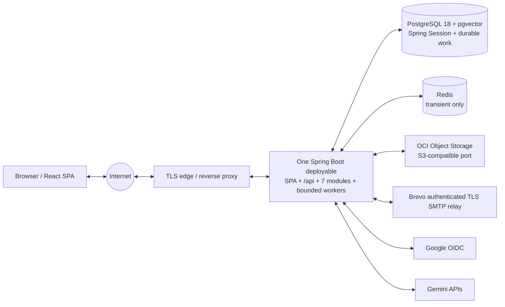

### 3.1 Application boundary

There is exactly one initial Spring Boot backend deployable. It contains the seven approved modules—Identity, Profile, Notes, Publishing, Discovery, Knowledge, and Moderation—and the same-deployable bounded background executors. The React application is compiled browser software, not another server-side service boundary.

Infrastructure processes such as PostgreSQL, Redis, and the TLS edge are not application deployables. There is no initial separate worker, AI service, frontend server, API gateway, message broker, service mesh, or Kubernetes control plane.

### 3.2 VM process layout

#### Diagram B — OCI VM internal runtime/container layout

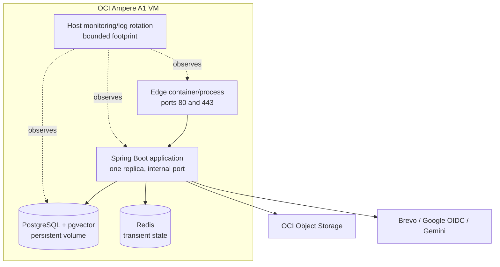

The production VM may run these components as isolated containers, but containerization does not change the approved deployable count or module boundaries. The application image is built for Linux ARM64 and runs as a non-root user.

### 3.3 Availability posture

The initial environment has one VM and one application replica. It has no high-availability or zero-downtime claim. A short maintenance/restart interval is acceptable for this portfolio deployment. PostgreSQL-backed sessions and durable jobs preserve a later path to multiple application replicas, but no such topology is selected here.

One replica is deliberate for portfolio-scale traffic, a 2-OCPU planning budget, bounded database connections, operational simplicity, and easier diagnosis; it is not a claim that the code cannot scale later.

---

## 4. OCI Always Free resource plan

### 4.1 Compute

The primary target is one Arm-based Ampere A1 compute instance in the OCI tenancy home region. The design plans approximately 2 OCPUs and 12 GB RAM, within the currently documented Always Free aggregate allocation, leaving unused aggregate entitlement only if live tenancy capacity permits.

Capacity is not guaranteed. If the selected shape is unavailable:

1. retrying later or selecting another eligible availability domain in the home region is acceptable;
2. reducing the free-eligible shape is allowed only after a capacity review proves the application remains safe;
3. creating a paid shape is forbidden without a new explicit human decision.

### 4.2 Storage plan

The current planning envelope is:

- up to 200 GB aggregate Always Free block volume allocation, including boot volume usage;
- up to five free volume backups where the current entitlement still provides them;
- approximately 20 GB OCI Object Storage plus the currently documented bounded request allowance;
- the currently documented large monthly Always Free outbound-data-transfer allowance, presently 10 TB, as a dated planning checkpoint rather than a permanent guarantee;
- bounded Monitoring, Logging, Notifications, and Vault/secret allocations only where they remain free.

An implementation-time storage budget must allocate the block allowance among boot, database, WAL/temporary headroom, local operational files, and recovery staging. It must not reserve the whole allocation to the database and leave no space for safe upgrades or restore work.

Outbound transfer is budgeted separately from storage. Measurements include application HTTPS responses, Attachment downloads, backend-mediated public media, API payloads, and relevant provider-bound traffic. Because media bytes pass through the application authority boundary, they can contribute directly to OCI egress. An internal soft guard stays below the currently verified billable boundary; if usage approaches it, approved throttling/rejection of abusive or oversized media traffic preserves safe core behavior without silently incurring paid egress.

### 4.3 Memory and CPU budget

No hard values are frozen before measurement. The initial budget must account separately for:

| Consumer | Budget discipline |
|---|---|
| OS, edge, and host agents | Small, bounded baseline; disable unnecessary services |
| JVM heap and native memory | Explicit container/host limit below total RAM; measured under multimodal and concurrent load |
| PostgreSQL and pgvector | Conservative shared buffers/work memory/connections; prevent per-query multiplication from exhausting RAM |
| Redis | Explicit max memory and eviction suitable only for transient data |
| File/page cache | Preserve meaningful headroom for PostgreSQL and object transfer |
| Deployment/migration peak | Reserve headroom for image unpacking, migration, and process restart |

The sum of configured maxima and credible transient peaks must stay below 12 GB with safety margin. OOM-kill recovery is not a capacity strategy.

### 4.4 ARM64 fitness

Before production, the exact Java runtime, application image, PostgreSQL 18 image/package, pgvector build, Redis release, reverse proxy, image/audio/video/PDF tooling, and operational utilities must be verified for Linux ARM64.

Developer machines may be x86-64. Future CI must build or validate `linux/arm64`, and production-like smoke tests must run on ARM64 before release. An upstream dependency without a trustworthy ARM64 artifact is a release blocker until replaced or deliberately built and verified.

---

## 5. Network, hostname, TLS, and same-origin delivery

### Diagram C — browser, TLS edge, and same-origin SPA/API flow

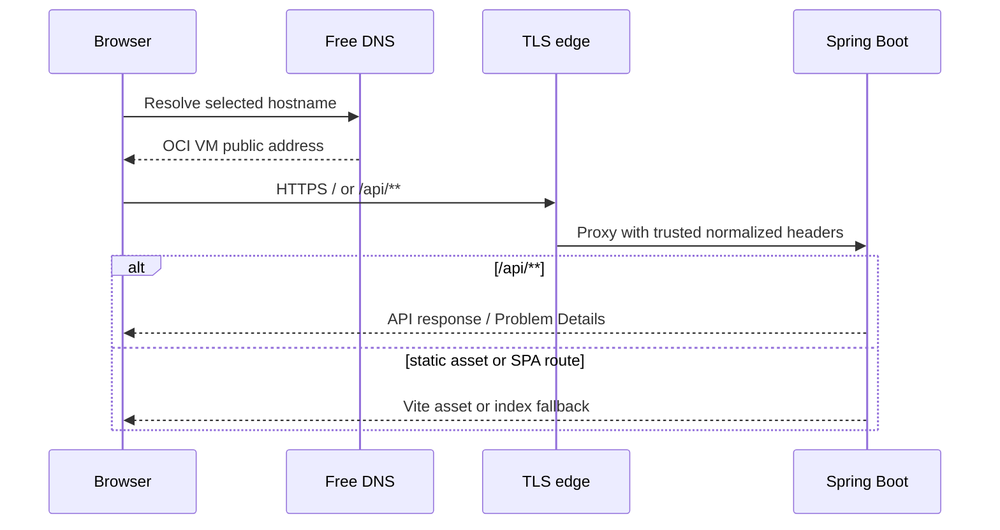

### 5.1 Public exposure

Public application traffic uses TCP 80 only for ACME/HTTPS redirection where required and TCP 443 for HTTPS application traffic. PostgreSQL, Redis, the Spring Boot internal listener, detailed Actuator/management endpoints, Docker/container administration, and object-storage administration remain non-public.

Operator access is a separate restricted operational path, not a public application port. Prefer a restricted, time-limited OCI mechanism such as OCI Bastion when it remains available within the verified zero-cost posture. If direct SSH is temporarily required, it is key-only, source-IP allowlisted, monitored, has password login disabled, and is never open to `0.0.0.0/0`. It is disabled when the safer operator channel is available and verified. Operator shell access never grants application-level private-note authority.

### 5.2 Hostname and certificates

A revalidated free dynamic-DNS provider such as DuckDNS, or an equivalent provider with acceptable continuity and HTTPS support, supplies the initial hostname. No hostname is selected by this document.

Let's Encrypt ACME supplies an automatically renewed certificate. Renewal health is monitored before expiry. Failure to obtain a valid certificate blocks public launch; plain HTTP fallback is forbidden.

### 5.3 Reverse-proxy trust

The application trusts forwarded host, scheme, and client-address headers only from the known internal edge address/network. Direct public access to the application listener is denied. Untrusted forwarded headers are discarded rather than used for redirects, secure-cookie decisions, audit identity, rate limiting, or OIDC callback construction.

### 5.4 SPA routing and caching

The Vite production build is packaged in the Spring Boot artifact. There is no production Node server, Vercel/Netlify site, or cross-origin SPA/API split.

- `/api/**` is routed only to API handlers and never to `index.html`.
- management, error, well-known, and static-asset routes are excluded from SPA fallback.
- recognized client-side routes may fall back to `index.html`.
- hashed Vite assets use long-lived immutable caching.
- `index.html` is short-lived or revalidated so deployments do not strand clients on old asset graphs.
- private and viewer-conditioned API responses retain their approved `no-store` behavior.
- no service worker or PWA caching is introduced initially.

---

## 6. Artifact and container posture

The future production artifact is one immutable Spring Boot application artifact containing compiled frontend assets. A future multi-stage container build should:

- compile frontend and backend in controlled build stages;
- copy only runtime outputs into a minimal ARM64-compatible runtime image;
- run as non-root with a read-only root filesystem where compatible;
- omit source, VCS metadata, build caches, tests, credentials, and environment files;
- use bounded ephemeral temporary space;
- expose only the internal application port;
- support graceful JVM shutdown;
- identify the exact application and dependency build provenance.

This document does not create or prescribe the concrete Dockerfile.

The application filesystem is never authoritative. Uploaded bytes, database state, sessions, durable work, publication eligibility, and secrets live in their approved systems. Local temporary files are disposable and removed after bounded processing.

### 6.1 Local development topology

#### Diagram D — local-development topology

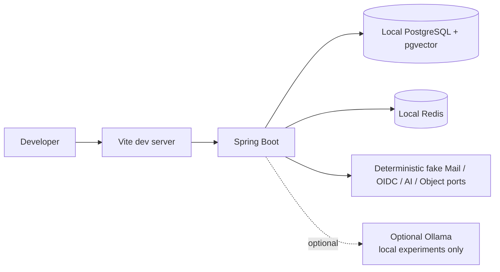

IDE plus Vite development is the fast loop. A future Compose topology may provide production-like local PostgreSQL, Redis, and object compatibility, but it is not created here. Deterministic fake providers remain the default for repeatable tests. Ollama is optional local experimentation, never a production dependency or required developer setup.

---

## 7. PostgreSQL, pgvector, sessions, and migrations

PostgreSQL 18 plus the approved pgvector release is self-hosted on the VM with its data directory on persistent block storage. PostgreSQL is the authority for all approved relational data, Spring Session JDBC, vector records and lineage, durable Knowledge work, and durable security-email work.

It remains the one physical database and the authority for Accounts, sessions, Profiles, Notes, versions, Knowledge state, embeddings, durable work, Publications, Discovery state, moderation, and security-email delivery. There is no H2 or in-memory production fallback.

When PostgreSQL runs in its own infrastructure container, it uses a persistent mounted volume, private listener, authenticated clients, bounded connections, explicit restart policy, pinned compatible PostgreSQL/pgvector versions, and independently recoverable backups. That container is infrastructure, not a microservice.

### 7.1 Database identities

At minimum, separate credentials and least-privilege roles are required for:

- **migration:** may perform approved Flyway schema changes but is not used by normal requests;
- **application:** may read/write only the runtime schemas and objects required by module ownership;
- **recovery/backup:** narrowly scoped for logical backup and restore operations, held separately from application credentials.

The application does not connect as a PostgreSQL superuser.

### 7.2 Schema ownership

Flyway is the only production schema evolution mechanism. Hibernate DDL auto-generation and Spring AI/PgVectorStore automatic schema initialization are disabled. Extension creation, vector dimensions/indexes, Spring Session tables, and all 38 approved relations are migration-owned.

Routine operations must use owner-module interfaces, not cross-module SQL shortcuts. Recovery-only direct database work is exceptional, controlled, attributable, rehearsed, and reconciled through approved invariants before traffic resumes.

### 7.3 Deployment migration sequence

#### Diagram E — deployment and Flyway sequence

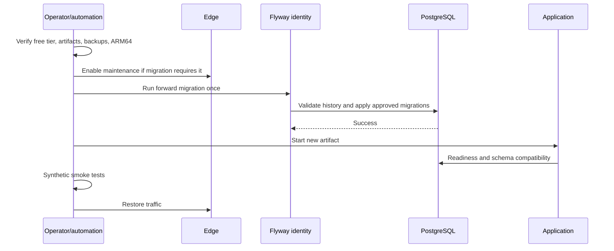

Migrations are forward-only. A code rollback is permitted only when the previous artifact remains compatible with the migrated schema. Otherwise the recovery action is a corrective forward release. Restoring an old database backup merely to roll back code is forbidden because it discards committed user data.

### 7.4 Persistence boundaries

#### Diagram F — PostgreSQL, block-volume, and object-storage persistence

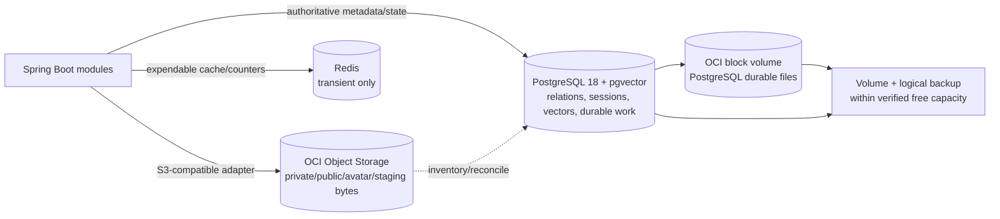

---

## 8. Redis operating role

Redis 8.10.x, using the current supported patch verified at implementation time, runs on the same VM and is reachable only on the internal network.

Allowed uses are transient rate-limit counters, bounded deduplication hints, approximate public views, and expendable cache entries. Redis is not authoritative for authentication, sessions, durable work, Note state, vectors, publication state, moderation state, or security-email delivery.

Redis has explicit memory and connection limits. Persistence may be disabled or treated as non-authoritative. On loss, ordinary caches rebuild. Security-sensitive controls that require Redis must fail safely or fall back to an approved conservative mechanism; they must not silently fail open.

---

## 9. OCI Object Storage and attachment lifecycle

OCI Object Storage is accessed through its S3-compatible application adapter so provider SDK concepts do not enter business modules. The initial free planning limit is approximately 20 GB with bounded monthly requests; exact values and S3 compatibility are revalidated before deployment.

### 9.1 Logical object separation

One or more non-public buckets/prefixes must separate at least:

- private attachment objects;
- immutable copied public-media objects;
- validated public avatar projections;
- unreachable staging objects;
- encrypted operational backup copies, if capacity permits.

No bucket is made publicly listable or readable. Public bytes remain backend-mediated so current publication availability, selected media, authorization, response headers, and revocation semantics are enforced. Browser presigned upload/download flows are not selected initially.

Application-level upload quotas and admission checks reject or defer new bytes before the verified free storage/request allowance could be exceeded. Capacity pressure never triggers a paid storage tier automatically.

### 9.2 Upload and validation

#### Diagram G — Attachment staging, commit, and object lifecycle

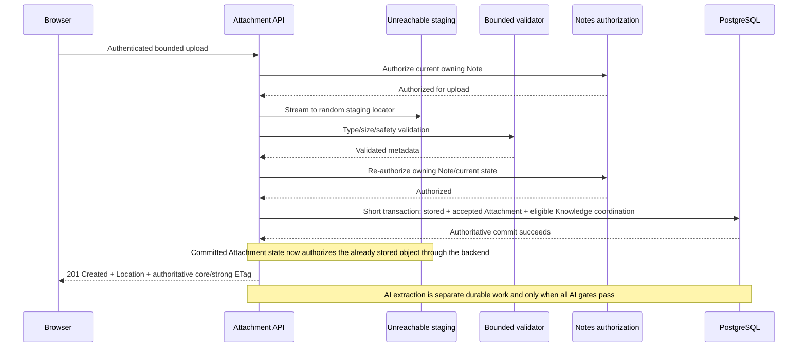

The generated staging locator is private and unreachable before authority exists; there is no authoritative pre-byte Attachment row and no validation `202`. Bounded validation occurs outside the database transaction, followed by Note reauthorization/revalidation. Only a successful short authoritative commit permits `201 Created`. The committed Attachment state—not a public bucket transition or post-response object move—authorizes backend-mediated access to the already stored object. A failed commit leaves the bytes unreachable.

No post-`201` promotion is a correctness dependency. If a later implementation copies, moves, or reclassifies bytes, it must either finish before the authoritative Attachment commit or be non-authoritative housekeeping whose failure cannot make a successfully returned Attachment inaccessible. Best-effort/lifecycle reconciliation may remove abandoned staging bytes without a new database relation. AI processing remains separate durable work.

Private Attachment deletion invalidates private eligibility and schedules physical cleanup, but does not mutate an already copied immutable public snapshot. Public media remains independently owned by Publication until Update Public Copy or Unpublish. Source Note deletion follows the approved confirmation-plus-unpublish rule.

Unpublish and other public-denial transitions make public content logically unreachable synchronously. Physical object deletion may be asynchronous.

---

## 10. Transactional security email

Brevo Free is the preferred initial provider, selected as an authenticated TLS **Brevo SMTP relay** through the existing application-owned Mail port and Spring Boot Mail `JavaMailSender`/Jakarta Mail boundary. The flow is Identity security-email worker → Mail port → `JavaMailSender`/Jakarta Mail → Brevo SMTP relay. No Brevo-specific HTTP SDK, API client, or provider type enters Identity or domain code.

The relay serves verification, password reset, confirmed email-change notices, MFA disable/reset notices, external-identity link/unlink notices, and the other approved security-email flows. Relation 38 provides durable retry and reconciliation; provider I/O remains outside database transactions and no in-memory queue is authoritative. Production secrets comprise SMTP host/configuration, SMTP login, SMTP key, and the approved sender identity.

The currently documented Free plan limit of 300 messages per day is a planning assumption. The operator sets an internal limit below the provider ceiling, monitors rejection/deferral, and never enables automatic purchase or overage.

If quota or provider availability is exhausted:

- eligible durable work remains truthful and bounded;
- enumeration-safe API responses remain generic;
- retry follows capped backoff and expiry rules;
- users are told that delivery is delayed/unavailable where disclosure is safe;
- the application does not claim that email was sent merely because work was accepted.

A provider-verified sender may be used without a paid custom domain only if current Brevo policy supports it. SPF, DKIM, and DMARC become mandatory before a custom production domain is represented as trustworthy.

---

## 11. Google OIDC

Google is the initial external identity provider. The production client uses an exact HTTPS redirect URI on the selected hostname; wildcard callbacks are forbidden. The OAuth client secret is injected from the secret system and is never shipped to the SPA.

The approved Authorization Code flow with PKCE S256, state, nonce, issuer-plus-subject identity, and no automatic email linking remains unchanged. Provider network calls do not occur inside database transactions. OIDC outage prevents new Google login but does not invalidate already-authorized local sessions solely because Google is unavailable.

### 11.1 Free-hostname production-readiness gate

Working HTTPS alone does not make Google login production-ready. Before declaring the Google OIDC integration ready, the operator must prove with the actual Google Auth Platform project that:

1. the selected free hostname can be registered wherever the configured client and branding require an authorized domain;
2. the exact HTTPS redirect URI is accepted without wildcard relaxation;
3. domain ownership can be demonstrated through Google's required verification path when applicable;
4. required DNS TXT control and Search Console Domain-property verification work where applicable;
5. required homepage, privacy-policy, and support URLs are reachable, mutually consistent, and use eligible authorized domains; and
6. the client requests only `openid`, `email`, and `profile` unless a later Approved Baseline explicitly authorizes another scope.

A free hostname remains acceptable; buying a domain is not an architectural prerequisite. DuckDNS remains only a candidate because its current official specification exposes TXT-record control. The exact assigned hostname must still pass Google's real project, authorized-domain, redirect, branding, and verification checks. If DuckDNS or another free provider cannot satisfy them, select another verified zero-cost hostname provider or **STOP AND REVIEW**—never silently purchase a domain or loosen OIDC security.

---

## 12. AI rollout, privacy, quotas, and model lifecycle

### 12.1 Rollout stages

#### Diagram J — Google-first deployment, Groq evaluation, and optional migration

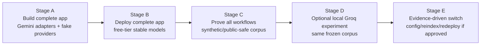

Groq experimentation is not a launch blocker and is never an automatic failover target. A provider change occurs only through an explicit, reviewed configuration/release decision with privacy and capability checks.

### 12.2 Initial Gemini selection

`gemini-embedding-2` is the current stable multimodal embedding candidate because official documentation describes text, image, video, audio, and PDF inputs with configurable dimensions. Live regional access, free-tier availability, Spring AI/adapter compatibility, dimension selection, and task behavior must be smoke-tested immediately before use.

The chat/generation model is not frozen by a stale alias here. Implementation selects a current stable free-tier Gemini model only after live capability, data-use, quota, and API smoke tests. The exact provider model IDs are recorded as deployment configuration and in Knowledge lineage/telemetry where approved.

### 12.3 Privacy gate

Free-tier Gemini data-use terms currently permit provider use/human review in ways incompatible with claiming approval for arbitrary confidential private notes. Therefore:

- future-note AI default remains OFF;
- every Note owns an independent AI ON/OFF state after creation;
- required provider disclosure/acknowledgement remains separate from Note AI state;
- AI-OFF Notes and Attachments never reach the provider or AI evidence path;
- all authorization, current state, provider-policy, disclosure, and task gates are revalidated before processing and result commit;
- the initial public portfolio demonstration uses only synthetic or intentionally public-safe content;
- the UI/operator documentation must not encourage users to submit secrets or confidential personal data to the unpaid provider;
- the system must not claim an unavailable privacy guarantee.

This is not a third Note AI state and does not change deterministic access to AI-disabled Notes.

### 12.4 Full workflow demonstration

The synthetic/public-safe corpus must demonstrate text, image, audio, video, and PDF ingestion; lexical/fuzzy/semantic hybrid retrieval; Ask My Knowledge; citations; related-note results; organization suggestions; deindexing after AI OFF; re-enable/reindex; insufficient evidence; and truthful provider/quota degradation.

No AI feature is represented by a fake button or hard-coded success response.

### 12.5 Quota behavior

Billing and automatic overage remain disabled. Gemini 429, quota exhaustion, model unavailability, and provider 5xx responses degrade only AI-dependent features. Retry uses bounded exponential backoff with jitter and a retry budget; it must not create a retry storm. Ordinary Note CRUD and deterministic search remain available.

### 12.6 Groq comparison and switching

Any Groq comparison uses the same frozen evaluation corpus and separately scores:

- chat/answer quality and citations;
- text embedding retrieval;
- multimodal embedding/extraction parity;
- latency, quotas, privacy terms, and operational failure modes.

A chat-model switch does not require re-embedding. An embedding model, version, or dimension switch creates a new lineage and requires controlled reindexing; incompatible vector spaces are never mixed.

### 12.7 Model-retirement flow

When official model retirement/deprecation is detected, stop incompatible new work if necessary; assess the replacement's capability, privacy, quota, and compatibility; run synthetic smoke tests and the frozen evaluation corpus; create a new lineage and controlled reindex for embedding changes; make a configuration-only replacement where only chat generation changes; then deploy deliberately and verify citations, gates, degradation, and zero-cost posture. A stable exact model identifier is used whenever the provider offers one; an unversioned alias must not silently change processing semantics.

---

## 13. Secrets and key lifecycle

OCI Vault/Secrets is preferred only if its current free allocation and access path are revalidated. Deployment-time secret injection is acceptable; the application need not acquire a direct OCI SDK dependency solely to read secrets.

Separate secret material and rotation purposes are required for PostgreSQL application access, Flyway, recovery, Redis authentication where used, S3-compatible object credentials, Brevo, Google OIDC, Gemini, TOTP encryption, and security-email artifact protection.

### Diagram L — secrets and configuration trust boundaries

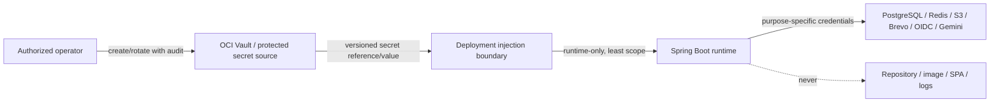

Secrets must not appear in source control, image layers, frontend bundles, committed environment files, logs, support output, screenshots, or error responses. Rotation is purpose-specific and version-aware. A compromise response revokes/rotates the affected credential, evaluates derived exposure, and verifies all dependent paths before normal service resumes.

---

## 14. Health, readiness, and dependency degradation

Actuator supplies the required health/operability foundation, but public exposure is minimal and protected. Liveness answers whether the process can continue. Readiness answers whether ordinary application requests can be served safely. Public/infrastructure health output is bounded; `env`, beans, mappings, heap dumps, thread dumps, detailed metrics, and configuration properties are not public. Detailed operations endpoints require restricted operator access.

- PostgreSQL unavailable: not ready.
- Redis unavailable: readiness may remain up only where security-sensitive paths fail safely and core correctness is preserved.
- Gemini or Brevo unavailable: application remains ready; affected feature is degraded.
- Object storage unavailable: metadata-only unaffected paths may remain available, but byte-dependent operations fail truthfully.
- TLS/DNS failure: process may be healthy while public service is unavailable; external monitoring must catch it.

### Diagram H — dependency, readiness, and degradation model

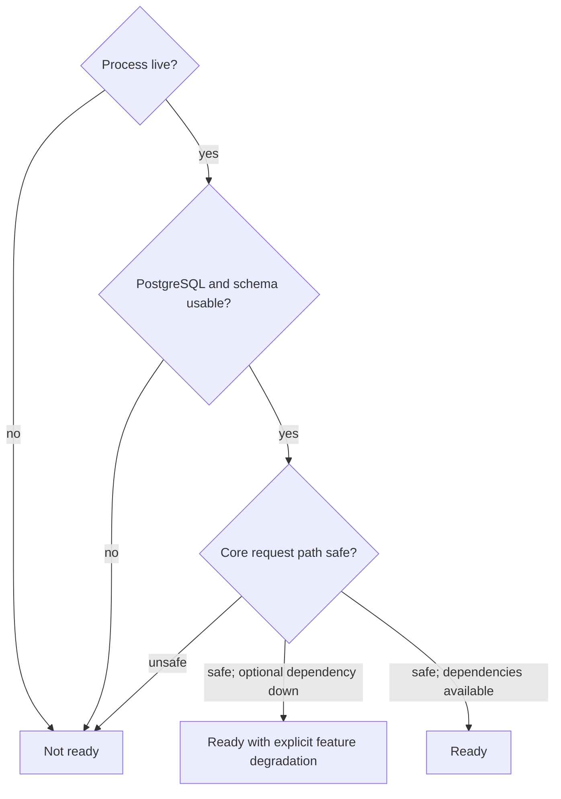

### 14.1 Dependency-degradation matrix

| Dependency | Required at startup | Required for readiness | Affected feature | Fail behavior | Retry owner | User-visible result | Operator action |
|---|---|---|---|---|---|---|---|
| PostgreSQL/pgvector | Yes | Yes | Nearly all stateful features | Fail closed; never use fallback memory state | Driver within bounds; operator beyond them | Service unavailable | Mark not ready; inspect DB/storage; execute outage or restore runbook |
| Redis | No, if safe fallbacks initialize | Conditional | Rate limits, dedupe, approximate views/cache | Security paths fail closed/safe; cache misses rebuild | Redis adapter | Only impacted operation degraded | Inspect memory/evictions/errors; restart empty and verify safeguards |
| OCI Object Storage | No for metadata-only startup | Usually no | Uploads, attachment/public/avatar bytes | Fail closed for byte operations; never invent success | Object adapter/reconciliation worker | Attachment/media temporarily unavailable | Check capacity/quota/provider; reconcile after recovery |
| Brevo | No | No | Verification/reset/security email | Durable eligible work; enumeration safety retained | Security-email worker until expiry | Safe delivery delay message where allowed | Check queue age/quota/provider; invoke mail runbook |
| Google OIDC | No | No | New Google sign-in/link flows | Fail closed for provider flow; existing sessions unaffected | Identity flow/user retry | Google sign-in unavailable | Verify exact callback, provider state, and secret |
| Gemini chat | No | No | AI answers/suggestions requiring generation | No fabricated answer; deterministic results may remain | Knowledge worker within retry budget | AI temporarily unavailable/partial | Check 429/5xx, quota, latency, exact model ID |
| Gemini embedding/multimodal | No | No | Indexing/semantic or multimodal coverage | Durable retry; report coverage lag/degradation | Knowledge worker | Semantic/multimodal coverage delayed | Check backlog, lineage, model access; apply model runbook if needed |
| DNS/TLS/edge | Yes for public launch | External availability fails | All public traffic | Fail closed; no HTTP downgrade | Edge/ACME automation then operator | Browser connection failure | Check external probe, certificate, DNS record, and edge logs |

---

## 15. Durable work and graceful shutdown

Knowledge indexing/query work and security-email delivery use their approved PostgreSQL relations. The same Spring Boot process runs bounded claimers/executors. Work is claimed with leases/visibility rules, is idempotent at its owner boundary, and is revalidated before external processing and before commit.

### Diagram I — durable-work shutdown, restart, and reclaim

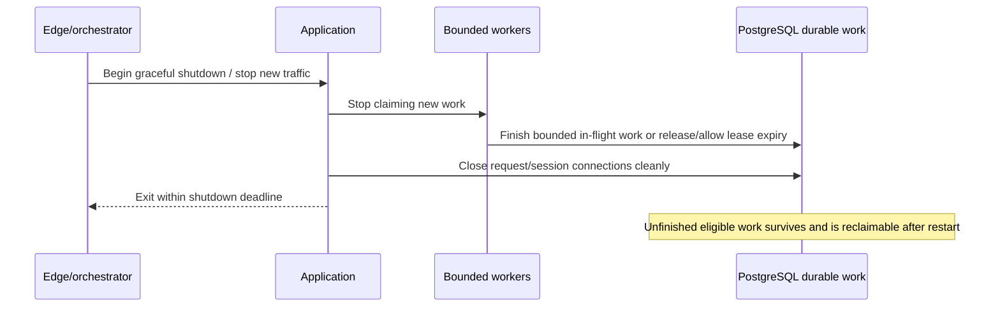

Shutdown must not wait indefinitely for provider calls. External timeouts are shorter than the process shutdown deadline. On restart, stale claims become reclaimable under the approved retry model.

---

## 16. Normal deployment procedure

The normal release sequence is:

1. Revalidate external free-tier entitlements, data-use terms, current stable models, supported patches, and ARM64 artifacts.
2. Verify the release commit/artifact provenance and public-repository hygiene.
3. Run the Testing Strategy release gates, including module, security, migration, API, frontend, retrieval, and ARM64 checks.
4. Confirm zero billable resources/automatic upgrades and sufficient compute, block, object, API, and email quota.
5. Confirm current backups and record a recoverable configuration/secret-version inventory without copying secret values.
6. Build the immutable ARM64 artifact/image with the compiled SPA.
7. Run required migrations once with the migration identity; use maintenance mode when compatibility requires it.
8. Start the new application with purpose-specific injected secrets and bounded resource limits.
9. Verify liveness, readiness, schema history, worker claiming, storage adapters, and edge routing.
10. Run authenticated core smoke tests and the production synthetic/public-safe Gemini smoke suite.
11. Verify no private content, secret, token, or unsafe identifier appears in logs/telemetry.
12. Restore normal traffic only after all mandatory checks pass.
13. Monitor the stabilization window and either retain the release, perform a schema-compatible application rollback, or issue a corrective forward release.

### 16.1 Production smoke content

The Gemini smoke account/corpus contains no real user secrets or confidential private material. It exercises exact configured model IDs, embedding dimensions, multimodal modalities, citations, provider-policy gates, AI OFF exclusion, and deliberate quota/degradation paths.

---

## 17. Backup, recovery, and restore security

Backups are layered:

- OCI block-volume backups protect the volume/VM storage layer within the current free allocation.
- Logical PostgreSQL backups provide schema-aware recovery and portability.
- Encrypted copies in object storage may be retained only when the shared free capacity permits and key separation is maintained.
- Object inventory and reconciliation metadata support detecting missing/orphaned private and public objects.

No point-in-time recovery, RPO, or RTO is claimed until the exact WAL/archive design, measured backup frequency, and restore rehearsals prove it. A backup that has not been restored in rehearsal is not treated as sufficient evidence.

### 17.1 Restore trust boundary

#### Diagram K — database disaster-recovery sequence

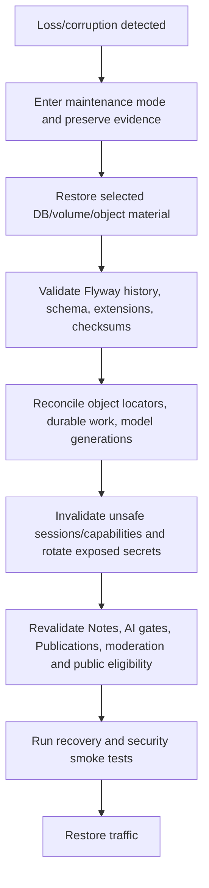

Restored data is treated as untrusted until reconciled. Recovery occurs in maintenance mode. Unsafe sessions/capabilities are invalidated where the restore boundary makes their state uncertain. Jobs and generation records are revalidated rather than blindly replayed. Public routes stay closed until active Publication and copied-media eligibility is proven.

### 17.2 Backup and recovery matrix

| Asset | Authoritative | Primary location | Backup approach | Recreate instead of restore? | Restore/reconciliation | Security requirement |
|---|---|---|---|---|---|---|
| PostgreSQL schemas and data | Yes | Block volume | Logical backup plus volume backup | No | Flyway history, extensions, constraints, module invariants, sessions/jobs review | Encrypt backup; separate recovery role/key; maintenance mode |
| VM/block volume | Partly; hosts DB and runtime | OCI block storage | Bounded OCI volume backups | App runtime can be rebuilt; DB data cannot simply be discarded | Rebuild host from declared design, then validate DB and services | Do not restore leaked secrets from stale images blindly |
| Private attachment objects | Yes for bytes | Non-public OCI object prefix/bucket | Object retention/copy within verified free capacity; inventory | No when user bytes cannot be reproduced | Match approved Attachment locators/state; quarantine orphans | Never make public; backend authorization required |
| Public copied media | Yes for current public bytes, governed by DB | Separate non-public public-media prefix | Object retention/copy plus DB publication backup | Sometimes from valid private source, but not assumed | Deny public access until active Publication generation matches | Immediate logical denial wins over physical presence |
| Avatar projections | Yes for served avatar bytes | Non-public avatar prefix | Object copy/inventory | May be regenerated only from an authorized validated source | Reconcile PublicProfileProjection and current locator | Public allowlist only; no private source exposure |
| Staging objects | No | Unreachable staging prefix | No routine backup | Yes; delete/re-upload | Age-based orphan cleanup | Must remain unreachable and short-lived |
| Redis | No | VM ephemeral/transient storage | None required | Yes | Restart empty; rebuild caches/counters conservatively | Security controls fail safe during loss |
| Application image/artifact | No data authority | Registry/build output | Reproducible immutable artifact retention | Yes from verified source/build | Verify digest, provenance, ARM64, SBOM/equivalent evidence later | No secrets/source/VCS in runtime image |
| Secrets and keys | Yes for credentials/cryptographic access | Vault/protected secret source | Provider-supported protected versioning/export policy | Rotate rather than restore if exposure uncertain | Rebind versions, test consumers, revoke prior material | Purpose separation, audit, dual-control where practical |

### 17.3 Code rollback versus disaster restore

A code rollback changes the running application artifact and is allowed only across a compatible schema. Disaster restore recovers lost/corrupt authoritative state and invokes the full security/reconciliation process. These are separate procedures. A database restore is never used as a convenient application rollback.

### 17.4 Logical deletion and physical erasure

Logical denial occurs at the approved synchronous boundary: trashed/deleted content, AI-ineligible data, unpublishing, account deletion, and moderation removal stop being eligible before asynchronous physical cleanup. Operators monitor erasure work and storage reconciliation without re-exposing content. Backup-retention limits and eventual expiry are disclosed honestly; an old backup is not silently rewritten in place.

---

## 18. Logging, monitoring, and alerting boundary

Runtime logs are structured, bounded, rotated, and privacy-safe. They may contain timestamp, severity, safe correlation IDs, safe technical resource identifiers where required, bounded module/operation categories, status classes, durations, provider/model IDs, retry category, and aggregate sizes. They must not contain Note titles/bodies, search or Ask queries/answers, raw prompts or provider response bodies, model evidence, attachment bytes, passwords, session/CSRF/OIDC tokens, TOTP/recovery material, email artifacts, object credentials, or provider secrets.

Initial operations must observe at least:

- external HTTPS availability and certificate expiry;
- VM CPU, memory, disk, inode, and network saturation;
- JVM heap/native memory, GC, threads, and connection pools;
- PostgreSQL availability, connections, storage growth, slow/failing queries, backup age, and migration history;
- Redis memory, evictions, connection errors, and fail-safe activation;
- durable Knowledge/security-email queue depth, age, retries, terminal failures, and stale claims;
- object-storage capacity, request failures, staging age, and orphan reconciliation;
- Brevo and Gemini quota, 429/5xx, latency, and exact configured model IDs;
- OIDC callback failure classes;
- security events, rate-limit activation, publication denial, and moderation consequences without private content.

This document defines required signals and operations behavior. A later Observability artifact may define exact metric names, dashboards, alert thresholds, retention, and notification routing without changing these invariants.

### 18.1 Rate-limit and provider-quota operation

Measured Redis-backed rate classes may cover registration, login, verification, password reset, MFA, OIDC initiation, AI operations, uploads, and Reports. Exact numeric limits remain operational configuration; API-owned 429 semantics do not change. Security-sensitive classes fail safely when Redis is unavailable.

AI controls include daily/hourly request awareness, token/request budgets, embedding batch bounds, multimodal size limits, operation concurrency, and capped retries. Provider work is not performed inside a database transaction. Quota exhaustion fails the affected work truthfully rather than repeatedly retrying until reset and growing an unbounded backlog.

---

## 19. Capacity and scale order

Capacity testing must measure, not assume:

- JVM resident memory and peak multimodal processing memory;
- PostgreSQL memory, connection pressure, vector-query latency, index size, WAL and backup growth;
- Redis memory/eviction behavior;
- upload streaming and temporary-space peaks;
- durable-worker concurrency and queue age;
- object-storage bytes and requests;
- outbound network transfer from HTTPS responses, Attachment downloads, public media, API payloads, and relevant provider traffic;
- email and AI daily/minute quota consumption;
- ARM64 latency and throughput for the complete workload.

When a limit is approached, scale in this order:

1. remove leaks, tune queries/indexes, bound payloads/concurrency, and reduce unnecessary retention;
2. schedule/background expensive work and apply truthful per-user/provider quotas;
3. use remaining verified free allocation without adding a new deployable;
4. degrade optional AI/derived features while preserving core Notes safely;
5. stop accepting the affected operation when safety/correctness cannot be maintained;
6. if a later approved resource envelope and measured need justify it, add another replica of the same application deployable;
7. move infrastructure only when measured limits require it;
8. revisit service extraction only under ADR-001's approved criteria;
9. seek explicit approval for any paid plan or materially changed architecture.

The system never silently crosses the boundary into paid resources or a new architecture.

---

## 20. Zero-cost guardrail

**ZERO-COST GUARDRAIL:** The initial environment must not create a billable resource—including paid compute, managed database, load balancer, oversized storage, or paid outbound transfer—enable pay-as-you-go billing for Gemini, opt into automatic email overage, or configure a paid failover. Before every deployment, the operator verifies current console/account status, free eligibility, region, resource shape, storage totals, outbound-transfer usage, API/message quotas, and provider billing settings. Internal soft limits stay below every billable boundary. If the verified free outbound quota is approached, the application throttles or rejects approved abusive/oversized public or media traffic while preserving safe core behavior; it never silently incurs paid egress. Exhaustion produces explicit feature degradation or stopped acceptance, not spending.

Budgets/alerts are defense in depth, not authorization to spend. If an account/provider requires billing activation for a feature, that feature is unavailable until a human-approved baseline/deployment amendment explicitly accepts cost and terms.

---

## 21. Maintenance and operator authority

Maintenance mode is appropriate for incompatible migrations, disaster restore, security reconciliation, or a public-eligibility repair that cannot be performed safely under traffic. It is not appropriate merely because Gemini or Brevo is unavailable; those dependencies degrade locally.

Infrastructure operator access is distinct from application authentication and authorization. Shell/database/object access is exceptional and audited. It does not create a super-admin private-note browsing capability.

Initial moderator provisioning, grant, and revoke are Identity-owned protected operational/bootstrap actions. They are attributable, least-privilege, subject to recent-auth/MFA and operational authorization as appropriate, and expose no general privilege-management product API. No moderator capability permits generic private Note, Attachment, search, or RAG access.

---

## 22. Operational runbook catalog

The following runbooks must exist before production operation. This document defines their safe shape, not shell commands.

| # | Runbook | Trigger | Safe action | Authoritative source | Verification | Escalation/stop condition |
|---:|---|---|---|---|---|---|
| 1 | Normal deployment | Approved release | Follow Section 16; migrate once; smoke; observe | Artifact provenance, Flyway history, baselines | Health, core/API/UI/AI synthetic smoke | Stop on failed gate, cost ambiguity, or schema mismatch |
| 2 | Failed deployment | New artifact unhealthy | Keep/restore maintenance; capture evidence; compatible rollback or roll-forward | Last known artifact, current schema | Prior artifact compatibility and smoke | Never restore DB merely for code rollback |
| 3 | Application rollback | Regression with compatible schema | Deploy prior verified artifact and retain current data | Compatibility record, artifact digest | Full smoke and queue claim safety | Roll forward if schema incompatible |
| 4 | Flyway failure | Migration validation/apply error | Keep traffic closed; preserve history/error; repair only after reviewed diagnosis | Flyway schema history and migration source | History clean; constraints/extensions correct | Never hand-edit history casually |
| 5 | PostgreSQL outage | DB unavailable but corruption/loss not established | Mark not ready; preserve evidence; restore service without data rollback | Live database, storage and PostgreSQL diagnostics | Connections, schema, invariants, request smoke | Switch to restore runbook if integrity is uncertain |
| 6 | PostgreSQL restore | Corruption/loss requires recovery | Enter maintenance; restore selected backup; execute all Section 17 security reconciliation | Logical/volume backup and migration history | Invariants, sessions/jobs/public eligibility, complete smoke | Stop if backup integrity or authorization state remains uncertain |
| 7 | VM loss | Instance unavailable/lost | Provision only a verified free-eligible replacement; restore restricted Bastion or key-only source-allowlisted operator access, app/DB, and edge | Immutable artifact, backups, secret inventory | ARM64, private service ports, restricted operator path, storage, DNS/TLS, complete smoke | No paid substitute or open SSH without approval |
| 8 | Redis outage | Connection/health failure | Activate safe fallbacks/fail-closed paths; restart empty | PostgreSQL authority and configured policies | Core correctness, security rate paths, cache rebuild | Not-ready if safe enforcement cannot be maintained |
| 9 | Object-storage outage | S3 errors/latency | Stop byte operations; preserve metadata truth; bounded retry | PostgreSQL locators/state, object provider status | Upload/download/reconciliation after recovery | Do not expose local/public workaround |
| 10 | Orphan staging cleanup | Aged unreachable objects | Enumerate bounded staging prefix; delete only objects beyond safe age/not committed | Object metadata and approved Attachment state | No reachable object removed; capacity recovers | Stop on locator ambiguity |
| 11 | Brevo outage/quota | 429/5xx/daily limit | Keep eligible durable work bounded; disclose delay safely; no overage | Security-email work state and provider response | Delivery/retry/expiry state truthful | Stop new optional mail; escalate if security flows cannot complete |
| 12 | Gemini outage/quota | 429/5xx/quota | Degrade AI; retain deterministic features; cap retries | Knowledge work state/provider telemetry | No hallucinated success; backlog recovers | No billing/failover activation |
| 13 | Gemini model retirement | Official deprecation/removal | Follow Section 12.7; freeze unsafe new work; assess exact replacement | Official model lifecycle docs and configured IDs | Frozen-corpus evaluation and lineage integrity | Stop if privacy/capability/free access unverified |
| 14 | Stuck Knowledge work | Lease/backlog age breach | Diagnose claim/eligibility/provider state; reclaim idempotently | PostgreSQL Knowledge work/generation records | No duplicate current generation; coverage truthful | Stop bulk replay if gates cannot be revalidated |
| 15 | Stuck security email | Work age/retry breach | Revalidate eligibility/expiry; retry idempotently or terminally fail | PostgreSQL security-email relation | Enumeration safety and truthful status | Do not extend expired artifacts merely to deliver |
| 16 | OIDC configuration/domain-readiness failure | Redirect, authorized-domain, branding, TXT/Search Console, scope, or provider errors | Disable the affected login entry; verify the exact URI, free-hostname eligibility/ownership, required public URLs, scopes, secret, and configuration | Google Auth Platform project, Search Console/DNS evidence, hostname provider, and Security baseline | Exact redirect plus PKCE/state/nonce/issuer-subject and `openid email profile` tests pass | Select another verified zero-cost hostname or STOP AND REVIEW; never buy silently or loosen redirects/linking |
| 17 | TLS/DNS failure | External probe/cert warning | Repair DNS/ACME/edge; keep HTTP redirect only | DNS provider, ACME account, edge config | External HTTPS chain, hostname and renewal | Do not serve credentials/content over HTTP |
| 18 | Leaked Gemini key | Suspected disclosure | Revoke/rotate key; stop AI calls; review logs/usage | Secret system and provider audit/usage | Old key rejected; new key scoped; synthetic smoke | Escalate on unauthorized use/content exposure |
| 19 | Leaked OIDC/email/S3 credential | Suspected disclosure | Revoke/rotate affected purpose-specific key; contain feature | Vault versions and provider audit | Old secret rejected; callbacks/mail/objects verified | Public/private object uncertainty requires maintenance |
| 20 | Encryption-key rotation | Scheduled/required rotation | Introduce new version, update consumers, verify, retire old version | Secret inventory/version policy | Every consumer uses intended version | Stop if encrypted data cannot be read safely |
| 21 | Public-media denial verification | Unpublish/moderation/delete not reflected | Deny route/cache immediately; reconcile DB/object generation | Publishing authority and current public generation | Anonymous request 404/unavailable; no stale cache | Security incident if bytes remain reachable |

---

## 23. Free-tier and terms revalidation register

Every row defaults to **STOP AND REVIEW** when evidence is missing, changed, regionally unavailable, or requires billing.

| Service | Planning assumption | Verify before implementation/deployment | Evidence owner | If changed |
|---|---|---|---|---|
| OCI Ampere A1 compute | Selected Always Free instance plans approximately 2 OCPUs/12 GB within the current aggregate entitlement | Home-region eligibility, capacity, image, ARM64, no paid shape | Operator | STOP AND REVIEW; no paid fallback |
| OCI block/boot storage | 200 GB aggregate and five backups currently documented | Actual boot inclusion, volume totals, backup count/retention, performance | Operator | Reduce safely or STOP AND REVIEW |
| OCI Object Storage | 20 GB and bounded free requests | Storage/request entitlement, S3 compatibility, Customer Secret Key, region | Operator/backend | Enforce lower quota or STOP AND REVIEW |
| OCI outbound data transfer | Current official Always Free checkpoint is a large monthly allowance, presently 10 TB | Actual tenancy/region entitlement, metering scope, billable boundary, and internal soft guard; include HTTPS, Attachment, public-media, API, and relevant provider traffic | Operator | Throttle/reject approved abusive or oversized traffic, preserve safe core behavior, or STOP AND REVIEW; never incur paid egress silently |
| OCI Vault/Secrets | Bounded Always Free keys/secret versions/operations | Exact current allocation, access method, rotation behavior | Security/operator | Use another approved protected injection method or STOP |
| Brevo Free | 300 emails/day currently documented | Account eligibility, sender verification, retry/holding behavior, data terms, no overage | Security/operator | Lower limits/degrade; no auto purchase |
| Gemini free tier | Selected models/quotas without billing; unpaid data-use restrictions | Model IDs, modality, dimensions, quotas, region, data-use terms, billing disabled | Knowledge/security/operator | Synthetic-only degradation or STOP; privacy review for broader use |
| Free DNS / Google OIDC domain readiness | Candidate free-hostname continuity; DuckDNS currently documents TXT control but is not pre-approved for the actual Google project | Provider terms, record/update security, TXT control, Search Console verification where applicable, Google authorized-domain acceptance, exact redirect, and homepage/privacy/support URL eligibility | Operator/Identity | Select another verified zero-cost hostname or STOP AND REVIEW; do not buy a domain silently |
| Let's Encrypt ACME | Free automated public certificate | Rate limits, challenge support, renewal path, hostname eligibility | Operator | Fix ACME/edge; never downgrade to HTTP |

Revalidation evidence records date, official source URL, account/region context, observed console status, reviewer, and the resulting go/stop decision without capturing secrets.

---

## 24. Public repository hygiene

The repository may contain architecture/design documents and future source/configuration templates, but never live secrets, real user content, provider exports, production database/object samples, `.env` files, private keys, session cookies, OIDC artifacts, recovery codes, or screenshots containing them.

Examples use unmistakably fictional values. Secret scanning, dependency review, build provenance, and generated-artifact exclusions become future CI requirements. Production configuration remains external and its non-secret shape is documented without exposing values.

---

## 25. Testing traceability

Deployment and operations validation must trace to the approved Testing Strategy and include at least:

- reproducible unit/module/integration/system tests on the immutable release;
- Spring Modulith boundary and architecture fitness tests;
- PostgreSQL 18/pgvector/Flyway migration and rollback-compatibility tests;
- Spring Session JDBC restart/revocation behavior;
- Redis loss/fail-safe tests;
- S3-compatible upload, object authorization, Range, denial, orphan, and reconciliation tests;
- security-email durable retry, enumeration safety, quota, expiry, and provider-failure tests;
- OIDC exact redirect, free-hostname authorized-domain/TXT/Search Console readiness where applicable, required public URLs, minimal scopes, PKCE/state/nonce, issuer-subject, linking, and outage tests;
- CSRF, cookie, proxy-header, CORS/same-origin, TLS, and security-header tests;
- ARM64 build/runtime and native media-tool fitness;
- all four attachment modalities and bounded-resource tests;
- AI OFF/disclosure/provider-policy/authorization-before-retrieval gates;
- frozen-corpus hybrid, citations, exhaustive extraction, degradation, lineage, and reindex tests;
- publication snapshot, copied media, cache-denial, unpublish, moderation, and account-suspension tests;
- backup integrity and isolated restore rehearsal;
- graceful shutdown, lease reclaim, deployment, compatible rollback, and maintenance-mode tests;
- external quota exhaustion and zero-cost guardrail tests using safe simulations where live exhaustion is inappropriate.

---

## 26. CI/CD and Observability boundaries

A future CI/CD & Quality Gates design may define GitHub workflows, jobs, environments, branch rules, test gates, registry, approvals, artifact signing/provenance, ARM64 builders, secret scanning/access, migration execution, release promotion, and deployment automation. It must implement this document's gates without changing product or architecture decisions.

A future Observability design may define metric/log/trace names, dashboards, SLOs, alerts, retention, and notification channels. It must preserve data minimization and may not log private content to improve diagnostics.

Neither downstream document may turn an optional external dependency into a global startup dependency, authorize spending, or add deployables without the required upstream decision.

---

## 27. Production fitness checklist

### 27.1 Architecture and artifact

- [ ] Exactly one Spring Boot application deployable and one initial replica.
- [ ] Seven Modulith modules and same-process bounded workers retain approved boundaries.
- [ ] React assets are packaged in the application artifact; no production Node server.
- [ ] Linux ARM64 runtime and all native dependencies are verified.
- [ ] Runtime image is immutable, non-root, minimal, and secret-free.
- [ ] `/api` routing and SPA fallback exclusions are tested.

### 27.2 Cost and capacity

- [ ] All OCI/provider entitlements were revalidated on the deployment date.
- [ ] No paid shape, billing upgrade, automatic overage, or paid failover is enabled.
- [ ] CPU, RAM, disk, inode, object bytes/requests, outbound transfer, email, and AI quotas have safe internal limits below billable boundaries.
- [ ] Measured peak memory plus headroom fits the selected VM.
- [ ] Capacity-exhaustion behavior is truthful and tested.

### 27.3 Network and security

- [ ] Public application traffic uses only 80 for ACME/redirect where required and 443 for HTTPS; internal services and detailed management endpoints are private.
- [ ] Operator access prefers a restricted OCI mechanism such as Bastion; any temporary direct SSH is key-only, source-IP allowlisted, password-disabled, and never open to `0.0.0.0/0`.
- [ ] Valid HTTPS certificate, renewal monitoring, and external probe are active.
- [ ] Only the known edge is trusted for forwarded headers.
- [ ] Purpose-specific secrets are injected externally, scoped, versioned, and rotatable.
- [ ] Operator and moderator boundaries do not grant private-note browse authority.
- [ ] Security Architecture and Threat Model release blockers pass.

### 27.4 Data and recovery

- [ ] Flyway alone owns production schema evolution; exactly 38 approved relations remain.
- [ ] Migration, application, and recovery database roles are separate.
- [ ] Current logical and volume backups exist within verified limits.
- [ ] Isolated restore rehearsal has passed with session/job/public-eligibility reconciliation.
- [ ] No false PITR/RPO/RTO claim is made.
- [ ] Object inventories, staging cleanup, and public denial are verified.

### 27.5 External providers

- [ ] S3-compatible OCI Object Storage operations and private-bucket posture pass.
- [ ] Brevo sender, quota, durable retry, and safe degradation pass.
- [ ] Google OIDC exact production redirect, free-hostname authorized-domain/ownership readiness, applicable DNS TXT/Search Console verification, required public URLs, and minimal `openid email profile` scopes pass against the actual project.
- [ ] Exact Gemini model IDs, dimensions, modality, quota, data-use terms, and billing-off state are recorded.
- [ ] Synthetic/public-safe AI corpus proves the complete AI workflow.
- [ ] No claim approves unpaid Gemini for arbitrary confidential private content.

### 27.6 Operations

- [ ] Liveness/readiness and all dependency-degradation behaviors pass.
- [ ] Graceful shutdown and durable-work reclaim pass.
- [ ] Structured logs are bounded and contain no prohibited data.
- [ ] All 21 runbooks have owners and have been exercised proportionately.
- [ ] Deployment and compatible rollback/roll-forward paths are rehearsed.
- [ ] Maintenance mode and incident communication are ready.

---

## 28. Practical engineering and interview explainability

An engineer responsible for this design must be able to explain and demonstrate:

- why a modular monolith and one deployable reduce operational cost without abandoning module boundaries;
- why infrastructure processes do not become application deployables;
- how same-origin SPA/API delivery simplifies cookies, CSRF, CORS, TLS, and deployment;
- why one replica is an honest availability tradeoff rather than hidden high availability;
- how ARM64 changes image, native library, and CI verification;
- why PostgreSQL is authoritative for sessions, vectors, and durable jobs while Redis is expendable;
- how Flyway roles and forward-only migrations separate schema authority from runtime access;
- why a code rollback differs from disaster restore;
- why database restore demands session, job, vector-generation, object, publication, and authorization reconciliation;
- how inaccessible staging plus short transaction boundaries avoid half-created Attachments;
- why private Attachment deletion does not rewrite an immutable public snapshot;
- how backend-mediated object delivery preserves authorization and immediate public denial;
- how zero-cost quotas are enforced before provider hard limits and why automatic payment is forbidden;
- why email acceptance, durable processing, provider delivery, and user-visible truth are distinct states;
- how Google OIDC secrets and tokens stay out of the SPA and transactions;
- why unpaid Gemini terms restrict the acceptable demo corpus despite complete technical integration;
- how AI OFF, disclosure acknowledgement, provider policy, authorization, and result-commit checks remain distinct gates;
- why chat-model replacement and embedding-lineage replacement have different operational consequences;
- how 429/5xx retry budgets avoid thundering herds and cost surprises;
- why optional-provider outages do not make the whole application unready;
- how liveness, readiness, external availability, and feature degradation differ;
- why graceful shutdown stops claims before waiting on bounded in-flight work;
- how secret purpose separation reduces blast radius and enables rotation;
- why logs and metrics must be useful without containing private notes or AI evidence;
- how measured resource budgets and scale order preserve correctness on a small VM;
- why free-tier and model claims are dated evidence requiring repeated verification.

---

## 29. Rejected patterns

The initial design explicitly rejects:

- automatic paid OCI/Gemini/Brevo upgrade or overage;
- paid fallback when Always Free capacity is unavailable;
- paid hosting as a prerequisite, Render free-web-service cold starts as the primary topology, or an expiring free database as authoritative state;
- separate frontend hosting/server or cross-origin production SPA/API;
- a second Spring Boot deployable, separate worker, or dedicated AI service;
- RabbitMQ, Kafka, API gateway, Kubernetes, service mesh, Elasticsearch, or a separate vector database;
- Redis as session, durable-job, authorization, publication, or vector authority;
- public PostgreSQL/Redis/application/management/container ports;
- trusting arbitrary forwarded headers;
- application-filesystem authority for user data;
- Hibernate DDL auto or PgVectorStore schema initialization in production;
- database restore as application rollback;
- public object buckets or initial browser presigned flows;
- direct object-key authority or storing uploads in the application container;
- treating private Attachment deletion as mutation of copied public media;
- sending AI-OFF or arbitrary confidential private content to unpaid Gemini;
- automatic Gemini-to-Groq failover;
- mixing embeddings from different model/dimension lineages;
- retry storms, unbounded workers, unlimited uploads, or unlimited provider calls;
- provider calls inside database transactions or live Gemini as a mandatory CI dependency;
- JavaScript-readable authentication tokens or a browser JWT redesign;
- service-worker/PWA caching in the initial release;
- secrets in repositories, images, frontend bundles, logs, screenshots, or committed environment files;
- maintenance mode for ordinary optional-provider degradation;
- operator/moderator access as a super-admin private-content browser;
- routine manual database hacks across module ownership;
- claims of zero downtime, PITR, RPO, RTO, or high availability without evidence.

---

## 30. Deferred decisions

The following details are deliberately downstream and may be resolved without changing this baseline when they honor its constraints:

- exact OCI image, availability domain, VM/volume partition sizes, and container runtime;
- exact reverse-proxy product/version and configuration;
- exact free hostname/provider and selected hostname;
- exact JVM/PostgreSQL/Redis memory and connection numbers after measurement;
- exact object bucket/prefix names, lifecycle durations, and backup rotation within approved semantics;
- exact health endpoint exposure and monitoring implementation;
- exact log/metric names, thresholds, dashboards, and notification channels;
- exact deployment automation, artifact registry, CI runner, and ARM64 build mechanism;
- exact current stable Gemini chat model, embedding dimension, quotas, and Groq experiment configuration;
- exact backup cadence and evidence-based recovery objectives;
- exact operational access mechanism and moderator bootstrap procedure;
- exact rate-limit numbers and internal quota thresholds.

The following are **not** deferred: zero-cost/no-overage behavior, one application deployable, same-origin packaged SPA, PostgreSQL authority, Redis non-authority, backend-mediated object authorization, privacy/provider gates, immediate logical denial, migration discipline, secret separation, ARM64 verification, truthful degradation, and restore security reconciliation.

---

## 31. Official evidence and revalidation sources

These sources were reviewed on 2026-09-16. They are evidence checkpoints, not permanent guarantees.

- [OCI Always Free resources](https://docs.oracle.com/en-us/iaas/Content/FreeTier/freetier_topic-Always_Free_Resources.htm): current compute, block-volume, backup, Object Storage, request, Vault, Monitoring/Logging, outbound-transfer, and free Bastion checkpoints plus home-region constraints.
- [OCI Free Tier overview](https://www.oracle.com/cloud/free/): current account/free-tier overview and upgrade posture.
- [OCI Amazon S3 Compatibility API](https://docs.oracle.com/en-us/iaas/Content/Object/Tasks/s3compatibleapi.htm): S3-compatible endpoint and Customer Secret Key model.
- [Brevo Free plan](https://help.brevo.com/hc/en-us/articles/208580669-FAQs-What-s-included-in-the-Free-plan): current daily email allowance and free-plan behavior.
- [Gemini API pricing](https://ai.google.dev/gemini-api/docs/pricing): current free/paid model availability and billing context.
- [Google APIs Additional Terms of Service for Gemini API](https://ai.google.dev/gemini-api/terms): unpaid-service data-use and sensitive/confidential-content restrictions.
- [Gemini Embeddings](https://ai.google.dev/gemini-api/docs/embeddings): current stable embedding model, modality, and dimension documentation.
- [Google Cloud domain verification](https://support.google.com/cloud/answer/13804266): authorized-domain ownership and Search Console Domain-property/TXT verification guidance.
- [Google Auth Platform branding](https://support.google.com/cloud/answer/15549049): authorized-domain and homepage/privacy-policy requirements.
- [Google OpenID Connect reference](https://developers.google.com/identity/openid-connect/reference): exact redirect matching and `openid`/`email`/`profile` scope behavior.
- [Let's Encrypt](https://letsencrypt.org/): free automated CA and ACME information.
- [DuckDNS specification](https://www.duckdns.org/spec.jsp): one candidate free DNS provider's current TXT-record control; actual Google-project eligibility remains a deployment gate.

Only official provider documentation and the actual target account/region console determine go/no-go. Marketing summaries and remembered limits are insufficient.

---

## 32. Review gate and next step

This document is an **Approved Baseline**. Its approval establishes the deployment and operations design authority but creates no implementation or provisioning authority. The approved cost posture, privacy/provider reconciliation, recovery design, matrices, runbooks, and operational boundaries remain binding.

The next authorized document is **CI/CD & Quality Gates**, followed separately by **Observability**, only when explicitly authorized. Neither is created by this task.
