# Notes & Knowledge Workspace

# Implementation Roadmap

**Status:** Approved Baseline  
**Date:** 2026-09-17  
**Document:** 17  
**Baseline approval date:** 2026-09-17  

## 1. Purpose, authority, and implementation boundary

This roadmap converts the sixteen upstream Approved Baselines into a dependency-ordered execution plan for one finished **Target Flagship**. Its phases are implementation increments, not MVPs, product editions, releases, or permission to omit later scope. Approval of this roadmap alone does not authorize source code, scaffolding, migrations, cloud resources, Git initialization, or any other implementation artifact. After approval, the next authorized document is `AGENTS.md`; it must be created, reviewed, and accepted only under a separate documentation authorization. Phase 0 begins only after that step and a separate explicit implementation authorization.

The authoritative inputs remain, in order: Product Vision and Target Flagship Requirements; ADR-001; High-Level Architecture; Technology Stack and Compatibility; Security Architecture; Threat Model; Domain Model; Schema & Migration Design; Search / AI / Retrieval Design; API Design; Backend LLD; Frontend LLD; Testing Strategy; Deployment & Operations; CI/CD & Quality Gates; and Observability. `PROJECT_CONTEXT_HANDOFF.md` remains a concise context summary. This roadmap schedules those decisions; it does not amend them.

If implementation discovers a genuine conflict, the required disposition is exactly:

> **REQUIRES <NAME> BASELINE AMENDMENT BEFORE IMPLEMENTATION**

No work package may silently repair, reinterpret, or work around an Approved Baseline. Phase 0 is **COMPLETE** following human completion approval on 2026-09-19; Phase 1 is **IN PROGRESS** under separately authorized Work Package 1A; Phases 2 through 14 are **NOT STARTED**.

## 2. Delivery principles

- Build vertical slices: database truth, owner-module behavior, API contract, first-party UI, security controls, automated evidence, and feature telemetry advance together.
- Accumulate testing, security, observability, and CI/CD from the first applicable slice; none is an end-stage hardening exercise.
- Use the approved seven-module domain-oriented modular monolith and exactly one initial Spring Boot backend deployable.
- Begin with an empty application schema. Flyway is the sole normal schema authority from day one; production ORM auto-create/update is prohibited.
- Use PostgreSQL 18 plus pgvector for database truth in integration tests. Do not substitute H2 or mock SQL semantics.
- Use deterministic provider doubles in mandatory CI. Run bounded live-provider qualifications separately at named gates.
- Local development must remain useful without OCI or live Gemini. Deployment is not the first full integration exercise.
- Preserve the intended additional paid spend of ₹0/$0. Any unavailable, ambiguous, or automatically billable dependency is **STOP AND REVIEW**.
- Work is single-maintainer by default. Parallelism is allowed only for independently testable, non-overlapping packages with an already-frozen interface; schema, security, API, and shared-contract changes serialize.
- Documentation follows implemented reality while remaining subordinate to Approved Baselines. Any required semantic change first needs a baseline amendment.

### Diagram A — complete phase dependency chain

### Diagram B — vertical-slice anatomy

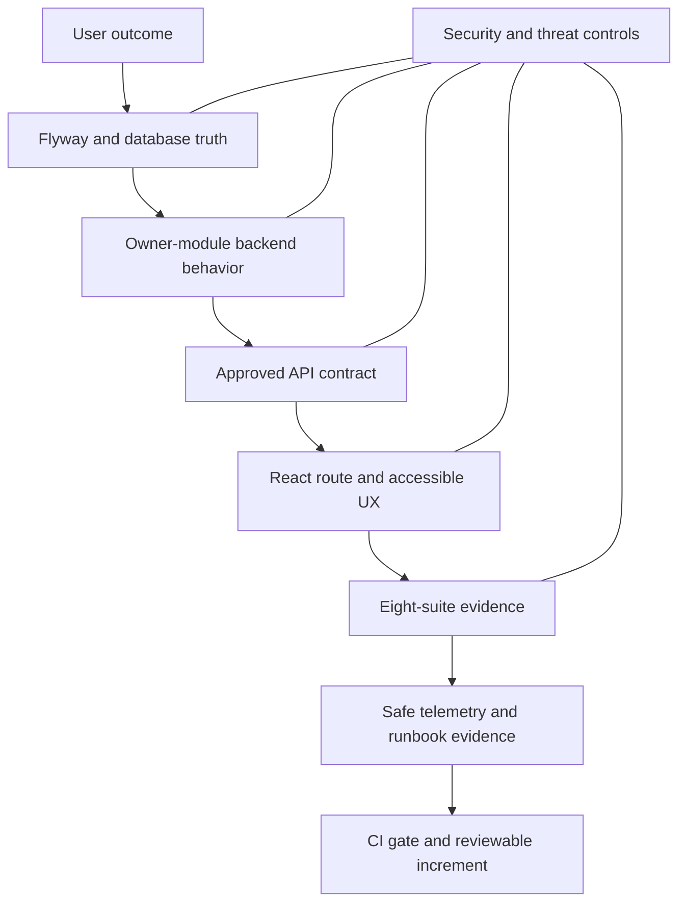

## 3. Phase summary and dependency matrix

| Phase | Status | Relative weight | Outcome | Direct dependency |
|---|---|---|---|---|
| 0 — Entry / Revalidation / Public Safety | COMPLETE | MEDIUM | Authority, zero-cost, provider, licensing, public-repository, and safety gates are current | Approved Baselines |
| 1 — Repository / Toolchain / Compatibility / Architecture Bootstrap | IN PROGRESS | LARGE | Reproducible public-repository skeleton and verified modular boundaries | 0 |
| 2 — Persistence / Runtime Security / Shared Backend | NOT STARTED | VERY LARGE | Flyway, PostgreSQL, runtime security, error/concurrency foundations, safe telemetry | 1 |
| 3 — Identity / Sessions / Account Security / OIDC / MFA / Security Email | NOT STARTED | VERY LARGE | Complete secure account lifecycle | 2 |
| 4 — Private Notes Core / Editor | NOT STARTED | VERY LARGE | Explicit-Save private Notes with lifecycle, tags, versions, and conflicts | 3 |
| 5 — Profile / Avatars / Attachments / Media | NOT STARTED | VERY LARGE | Private profiles and safe four-modality attachment access | 4 |
| 6 — Ordinary Search / Deterministic Knowledge | NOT STARTED | LARGE | AI-independent lexical/fuzzy search and exhaustive deterministic extraction | 5 |
| 7 — AI Participation / Durable Knowledge / Embeddings / Multimodal | NOT STARTED | VERY LARGE | Correct AI gates, durable derivation, vectors, and multimodal lineage | 6 |
| 8 — Ask / Related / Suggestions | NOT STARTED | VERY LARGE | Routed evidence-grounded knowledge workflows and proposals | 7 |
| 9 — Publishing / Public Profiles / Discovery / Likes / Views / Public Media | NOT STARTED | VERY LARGE | Deliberate immutable public snapshots and complete public experience | 8 |
| 10 — Reports / Narrow Moderation | NOT STARTED | LARGE | Public-target-only reporting and attributable enforcement | 9 |
| 11 — Operationalization | NOT STARTED | VERY LARGE | Complete packaging, CI/CD, observability, container, and deployment mechanics | 10 |
| 12 — System-wide Quality Closure / Flagship Acceptance | NOT STARTED | VERY LARGE | All baselines, suites, invariants, scenarios, and release blockers close | 11 |
| 13 — Zero-cost OCI Production Deployment / Recovery Qualification | NOT STARTED | VERY LARGE | Qualified ARM64 production deployment and recovery evidence | 12 |
| 14 — Public Portfolio Release / Stabilization | NOT STARTED | LARGE | Publicly explainable, stable Target Flagship release | 13 |

| Phase | Requires | May safely overlap | Must not start until |
|---|---|---|---|
| 0 | Baseline set | Read-only inventory checks | All authority/count conflicts are resolved |
| 1 | 0 | Frontend/backend skeleton packages after contracts freeze | Tool/free-tier compatibility is verified |
| 2 | 1 | Independent test harness and redaction fixtures | P1 architecture and toolchain gates pass |
| 3 | 2 | UI screens against approved deterministic adapters | DB/security/session foundations exist |
| 4 | 3 | Editor component work after Note DTO/ETag contract is stable | Full owner identity is enforceable |
| 5 | 4 | Profile and attachment UI within separate frozen contracts | Note ownership and storage staging exist |
| 6 | 5 | Search UX and corpus fixtures | Notes/attachments authorize correctly |
| 7 | 6 | Modality adapters behind frozen ports | Deterministic retrieval and provider gates exist |
| 8 | 7 | Ask UI and evaluation corpus extensions | Durable current representations are proven |
| 9 | 8 | Public UI surfaces with synthetic snapshots | Private snapshot/version/media semantics are stable |
| 10 | 9 | Queue UI with public-only fixtures | Active public/report targets exist |
| 11 | 10 | CI/observability work streams with frozen signal contracts | All feature slices exist |
| 12 | 11 | Independent suite execution | Operational rails are complete |
| 13 | 12 | Read-only public smoke and recovery rehearsal preparation | Release candidate is fully green |
| 14 | 13 | Portfolio documentation and monitored stabilization | Production qualification succeeds |

## 4. Phase execution plans

Every future implementation work package must be small and coherent and report: objective; governing baseline references; files in scope; relation/API/route IDs; implementation actions; security controls; tests; telemetry; CI impact; stop conditions; and completion evidence. A package is not complete merely because it compiles.

### Phase 0 — Entry / Revalidation / Public Safety

| Field | Plan |
|---|---|
| Objective | Establish a safe, current implementation entry gate without changing any baseline. |
| Dependencies / preconditions | Implementation Roadmap is an Approved Baseline; `AGENTS.md` has been separately authorized, created, reviewed, and accepted; explicit implementation authorization exists; all seventeen Approved Baselines (the sixteen upstream baselines plus this Implementation Roadmap) and `PROJECT_CONTEXT_HANDOFF.md` remain authoritative. |
| Primary outcome | Verified authority inventory, count ledger, licenses, public-repository posture, free-tier controls, and current official compatibility/provider/cloud evidence. |
| Backend / frontend | No product code. Confirm chosen versions, JDK/Node/npm/Maven availability, package provenance, browser targets, accessibility tooling, and same-origin assumptions. |
| Data / migration | Confirm PostgreSQL 18, pgvector 0.8.6, Flyway-from-zero approach, 38-relation target, and backup/restore prerequisites. |
| Security | Revalidate Argon2 implementation path, Spring Security/Session/CSRF abstractions, OIDC hostname/redirect requirements, secret-handling and public-repo safety. |
| Test evidence | Inventory scripts/checklists only after implementation authorization; today record required future compatibility smoke and count checks. |
| Observability / CI | Revalidate GitHub free controls, OCI Monitoring/Logging limits, notification path, and no-automatic-spend policy. |
| Live provider | Revalidate Brevo and Gemini capabilities, modalities, privacy/retention/terms, free quota, model lifecycle; do not send private data. |
| Future artifacts | During authorized Phase 0: dated revalidation evidence and implementation-entry decision record; repository structure, wrappers, and lockfiles remain Phase 1 artifacts. |
| Explicitly not yet | Creating or changing `AGENTS.md`; Git init, build files, source, workflows, cloud/provider configuration. |
| Stop conditions | Any version incompatibility, license/terms ambiguity, absent hard zero-spend control, provider privacy mismatch, or baseline/count conflict. |
| Exit criteria | Dated official evidence supports the approved path; no conflict; human authorizes Phase 1. |
| Planned interview evidence | Explain why implementation begins with falsifiable entry gates, not generated scaffolding. |

### Phase 1 — Repository / Toolchain / Compatibility / Architecture Bootstrap

| Field | Plan |
|---|---|
| Objective | Create the reproducible repository and prove the selected stack and modular-monolith skeleton. |
| Dependencies | Phase 0. |
| Primary outcome | One Spring Boot deployable and React/TypeScript client build reproducibly, with seven module boundaries and no feature behavior claimed. |
| Backend | Maven Wrapper; Java 25; Boot 4.1.1; Modulith 2.1.1; package/module APIs; architecture tests; Actuator base; no cross-module repository access. |
| Frontend | Node 24.21.0 LTS, npm 11.19.0, React 19.3.0, TypeScript 7.0.2, Vite 8.2.2, plugin-react 6.1.1, Vitest/Testing Library/Playwright shell; accessible responsive app shell. |
| Data / migration | Flyway wired but application catalog empty; real PostgreSQL Testcontainers connectivity/version/extension smoke. |
| Security | Dependency pinning, secret scanning, safe defaults, no committed credentials, dependency/supply-chain review. |
| Test evidence | FAST skeleton, DATABASE connectivity, Modulith verification, frontend component smoke, Playwright boot smoke. |
| Observability | Structured logging envelope and safe application start/ready/shutdown events; no user content. |
| CI/CD | First PR CI with build, FAST, Modulith, frontend checks, secret/dependency scans; deterministic and secretless. |
| Live provider | None. |
| Future artifacts | Authorized repository files, wrappers, lockfiles, module/API skeletons, initial CI. |
| Explicitly not yet | Domain tables, auth, Notes, live providers, Docker release image, OCI. |
| Stop conditions | Boot/Modulith/Spring AI incompatibility; Vite/TS/React incompatibility; pgvector/PG mismatch; public-runner or billing ambiguity. |
| Exit criteria | Clean reproducible builds and boundary tests on supported local/x64 CI environments. |
| Planned interview evidence | Demonstrate architecture fitness before feature volume. |

### Diagram C — repository/bootstrap compatibility flow

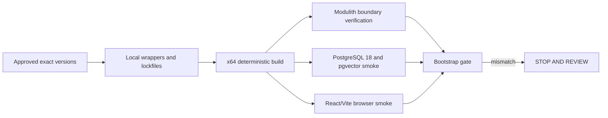

### Phase 2 — Persistence / Runtime Security / Shared Backend

| Field | Plan |
|---|---|
| Objective | Build shared persistence, runtime security, API, concurrency, error, work-claim, and telemetry foundations. |
| Dependencies | Phase 1. |
| Primary outcome | A secure same-origin runtime with Flyway truth, PostgreSQL sessions, CSRF, typed Problem Details, ETags, redaction, and testable dependency degradation. |
| Backend | Security filter chains, session authority, CSRF repository abstraction, CORS/headers/proxy trust, RFC 9457 mapping, pagination/validation, clocks/UUIDs, transactional owner-module ports, lease/fencing primitives. |
| Frontend | CSRF/session bootstrap, typed Problem handling, route guards, state clearing, accessibility/error shell; no feature routes claimed. |
| Data / migration | Initial reviewed Flyway migrations for framework session relations; migration-from-zero/validation discipline; runtime least-privilege roles. |
| Security | Deny by default, HttpOnly/Secure session cookie, unsafe-method CSRF, no browser JWT/localStorage auth, privacy-safe logging, rate-control abstraction. |
| Test evidence | DATABASE/API/SECURITY foundations: session fixation/rotation, CSRF, headers, Problem Details, ETag semantics, privilege separation, log-leak tests. |
| Observability | Request/dependency metrics, health groups, correlation, events `request.completed`, `security.control.rejected`, `dependency.state_change`. |
| CI/CD | Add real-DB DATABASE/API/SECURITY gates and Flyway checks when migrations change. |
| Live provider | None. |
| Future artifacts | First Flyway scripts, shared backend infrastructure, security configuration, safe telemetry. |
| Explicitly not yet | User registration, Note CRUD, AI/provider calls, public routes. |
| Stop conditions | Session/CSRF ambiguity, unsafe proxy/origin behavior, PG/pgvector incompatibility, inability to enforce runtime-role least privilege or log redaction. |
| Exit criteria | Shared controls are proven with a real database and all zero-tolerance foundation tests pass. |
| Planned interview evidence | Explain why horizontal foundations are small and immediately exercised by the next vertical slice. |

### Diagram D — security foundation dependency flow

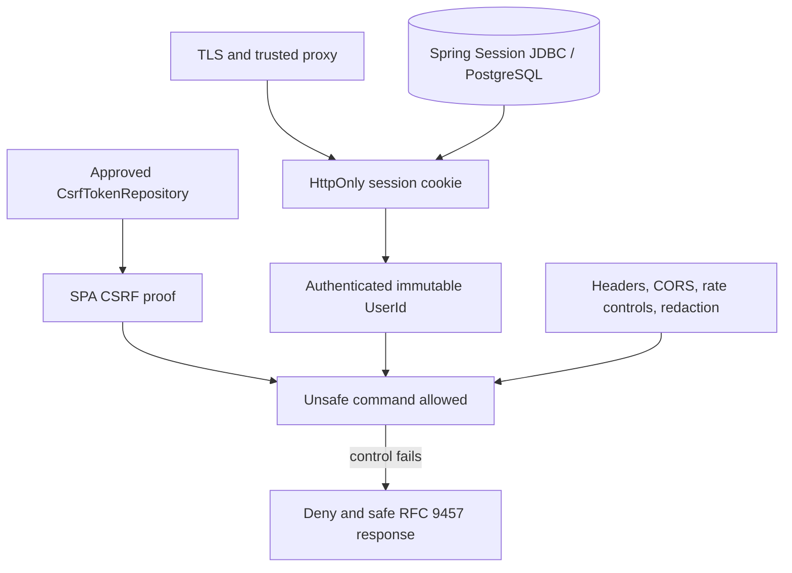

### Phase 3 — Identity / Sessions / Account Security / OIDC / MFA / Security Email

| Field | Plan |
|---|---|
| Objective | Deliver the complete secure Account journey, not a temporary login. |
| Dependencies | Phase 2. |
| Primary outcome | Registration, verification, password/OIDC login, application MFA, recovery, recent-auth, sessions, security changes, and account deletion work end to end. |
| Backend | Endpoints 1–32; Argon2id PasswordEncoder path; issuer+subject OIDC, PKCE/state/nonce; MFA/recovery; session rotation/revocation; narrow privileges; durable security-email worker with lease fencing and revalidation. |
| Frontend | Routes 1–9 and 18–20; memory-only MFA/recovery material; generic blind-acceptance UX; session/CSRF refresh; accessible secure settings. |
| Data / migration | Remaining nine Identity relations after session foundation, including one `security_email_delivery` relation and no generic notification subsystem. |
| Security | Enumeration resistance, no automatic email linking, post-primary-login MFA, recent-auth, one-time capabilities, protected recipient envelopes, provider I/O outside transactions. |
| Test evidence | Auth/session/OIDC/MFA/email races, replay, revocation, capability supersession, lease fencing, blind 202, account-deletion denial; Brevo double in CI. |
| Observability | Identity/security dashboard inputs; auth/control/security-email safe events and alerts; no recipient/token/session data. |
| CI/CD | Full Identity API/SECURITY/E2E critical paths become merge blockers. |
| Live provider | Bounded Brevo sandbox/live qualification and Google OIDC qualification after official revalidation; never mandatory CI. |
| Future artifacts | Identity migrations, adapters, routes, tests, safe email templates, runbook hooks. |
| Explicitly not yet | Notes, attachments, knowledge, publication, moderator provisioning API. |
| Stop conditions | OIDC free-hostname/redirect failure, Brevo terms/quota mismatch, unverifiable email durability, any session/MFA/recovery authority flaw. |
| Exit criteria | Account journeys and session consequences pass deterministic suites; qualified providers work at the bounded gate. |
| Planned interview evidence | Explain server-controlled sessions and durable security email without claiming exactly-once delivery. |

### Phase 4 — Private Notes Core / Editor

| Field | Plan |
|---|---|
| Objective | Deliver the central private Notes workflow with explicit Save and recoverable concurrency. |
| Dependencies | Phase 3. |
| Primary outcome | Owners create, edit, Save, pin, tag, archive, trash, restore, delete, inspect/restore versions, and manage per-Note AI state/default truthfully. |
| Backend | Endpoints 40–43 and 45–59; owner-derived authorization; strong ETag/If-Match; lifecycle commands; bounded immutable checkpoints/holds; no implicit autosave. |
| Frontend | Routes 10–12 core; real Markdown editor; Unsaved/Saving/Saved/Failed states; Ctrl/Cmd+S; navigation guard; explicit conflict reconciliation; responsive/keyboard-accessible UX. |
| Data / migration | Five Notes relations excluding Attachment; constraints for owner, lifecycle, revision, AI generation, tags, versions, holds. |
| Security | Enumeration-safe private 404, mass-assignment protection, sanitized Markdown/raw HTML off, no caller-supplied owner authority. |
| Test evidence | Save failure retention, stale ETag 412, 428, independent commands, lifecycle rules, version immutability/restore, AI default independence, XSS/accessibility. |
| Observability | Safe `note.command.outcome`, route-template API metrics, no titles/bodies/tags/URLs. |
| CI/CD | Notes FAST/DATABASE/API/SECURITY/FRONTEND/E2E paths block relevant merges. |
| Live provider | None. |
| Future artifacts | Notes migrations, editor route/components, API adapters, corpus fixtures without private production data. |
| Explicitly not yet | File bytes, ordinary search, embeddings, Ask, publication. |
| Stop conditions | Save semantics drift, weak/non-core ETags, owner leakage, new relation/API/route need, Markdown safety ambiguity. |
| Exit criteria | Notes journeys and AS-01..04/21/22 pass across backend/UI/security evidence. |
| Planned interview evidence | Show explicit persistence, conflict recovery, and orthogonal commands. |

### Phase 5 — Profile / Avatars / Attachments / Media

| Field | Plan |
|---|---|
| Objective | Add private presentation and safe stored media before any multimodal derivation. |
| Dependencies | Phase 4. |
| Primary outcome | Users manage private Profile/avatar and authorized image, audio, bounded video, and PDF attachments whose bytes remain usable without AI. |
| Backend | Endpoints 33–36 and 60–64; staged backend-mediated upload; type/size/duration/page validation; Range streaming; logical delete and cleanup; object locators never authority. |
| Frontend | Route 16 plus Attachment panels on route 12; progress/abort; native media; 200/206/416 handling; accessible avatar/media controls. |
| Data / migration | Private `profile.profile` and `profile.avatar_asset` plus `notes.attachment`; public projection persistence waits for its Phase 9 vertical slice. |
| Security | Owner Note authorization before metadata/bytes, active-content defenses, `nosniff`, generated keys, private buckets, parser bounds, no direct private key exposure. |
| Test evidence | Four modalities, spoof/polyglot/size failures, Range, cross-user denial, cleanup races, object reconciliation, avatar projection separation. |
| Observability | Attachment/storage outcomes by safe modality/size band; no filenames, bytes, keys, or signed URLs. |
| CI/CD | File/parser/object-adapter tests and frontend media flows join relevant blockers; provider double/local object adapter only. |
| Live provider | No AI. Object-store compatibility may be locally/deterministically qualified before OCI. |
| Future artifacts | Profile/Attachment migrations, safe validators, storage ports/adapters, media UI. |
| Explicitly not yet | Public profile activation, public media, embeddings, content reasoning. |
| Stop conditions | Unsupported modality safety, storage authorization gap, unbounded resource use, need for public bucket. |
| Exit criteria | Authorized bytes and metadata remain correct through failures; attachment access is AI-independent. |
| Planned interview evidence | Explain why byte custody and validation precede multimodal AI. |

### Phase 6 — Ordinary Search / Deterministic Knowledge

| Field | Plan |
|---|---|
| Objective | Prove owner-scoped, AI-independent retrieval before semantic retrieval. |
| Dependencies | Phase 5. |
| Primary outcome | Lexical/fuzzy/tag search handles imperfect wording, while exhaustive deterministic extraction can inspect the complete authorized scope and never fetch saved URLs. |
| Backend | Endpoint 44 and internal deterministic strategy used later by endpoint 68; PostgreSQL FTS/`pg_trgm`; scope-first predicates; result/provenance/completeness classes. |
| Frontend | Search in route 10 with typo/shorthand ranking, complete-occurrence presentation, source navigation, and explicit ranked-versus-exhaustive wording. |
| Data / migration | No extra authoritative relation; derived/index columns only as already allowed by approved schema/migration design. |
| Security | Authorization before candidates, AI-OFF inclusion only in non-AI paths, no remote URL fetch/preview, bounded query/filter/cursor. |
| Test evidence | Cross-user isolation, typo/shorthand, URL completeness/dedup/provenance, AI-OFF deterministic inclusion, query limits, execution-plan evidence. |
| Observability | `retrieval.outcome` with strategy/candidate/coverage bands, never query text/snippets/IDs. |
| CI/CD | Critical RETRIEVAL regression becomes a merge/release blocker using a frozen deterministic corpus. |
| Live provider | None. |
| Future artifacts | Search adapters, SQL/index migrations if already authorized, deterministic corpus/evaluation fixtures. |
| Explicitly not yet | Vectors, embeddings, model reranking/generation. |
| Stop conditions | Post-filter cross-user risk, incomplete exhaustive claim, new relation/API/route requirement, automatic URL fetching. |
| Exit criteria | Ordinary search and deterministic extraction are useful and secure with AI unavailable. |
| Planned interview evidence | Contrast ranking with exhaustive coverage and explain why ordinary Search precedes AI Search. |

### Diagram E — Notes to Attachments to Search to AI

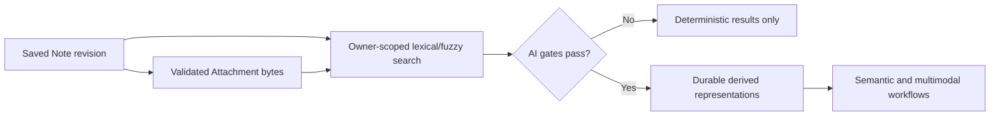

### Phase 7 — AI Participation / Durable Knowledge / Embeddings / Multimodal

| Field | Plan |
|---|---|
| Objective | Establish safe AI participation and correct durable derivation before user-facing Ask. |
| Dependencies | Phase 6. |
| Primary outcome | AI ON/OFF, disclosure, provider policy, work durability, source/generation lineage, embeddings, and four-modality derivation are truthful and revocable. |
| Backend | Endpoints 65–67; AI gates; current policy acknowledgement; Knowledge work claiming/fencing/retry; private derived roots/segments; provider-agnostic embedding/multimodal ports; exact owner-and-eligibility filtered retrieval baseline. |
| Frontend | Route 21 and processing panel on route 12; independent Note state/default/disclosure; pending/degraded/removal/failed states without job internals. |
| Data / migration | Five Knowledge relations: policy, acknowledgement, private representation, private segment, work intent; pgvector lineage/dimension strategy per approved design. |
| Security | Authorization and current gate revalidation before content, provider, index, and publishable result; immediate logical AI disable; no AI-OFF dispatch; no E2EE claim. |
| Test evidence | Lease loss/reclaim, stale generation, AI disable races, provider capture, vector isolation/recall/execution plans, modality derivation, lineage cutover, quota degradation. |
| Observability | Knowledge/AI dashboard foundation; backlog/age/reclaim/provider/coverage metrics and safe work/provider events. |
| CI/CD | RETRIEVAL/EVALUATION deterministic provider-double suites; no live Gemini in mandatory CI. |
| Live provider | Bounded Gemini capability smoke on synthetic/public-safe corpus only after current privacy/terms/quota verification. |
| Future artifacts | Knowledge migrations, workers, adapters, vector indexes, frozen multimodal corpus. |
| Explicitly not yet | Full Ask answer UX, suggestions, public vectors, automatic Groq fallback. |
| Stop conditions | Spring AI incompatibility, Gemini capability/terms mismatch, unsafe vector filtering, unbounded cost, inability to revoke current eligibility. |
| Exit criteria | Current eligible representations are durable, isolated, explainable, and recoverable; AI-OFF never reaches provider capture. |
| Planned interview evidence | Explain gates, lineage, durable work, and why embedding changes require corpus reprocessing. |

### Diagram F — durable Knowledge and Ask dependency

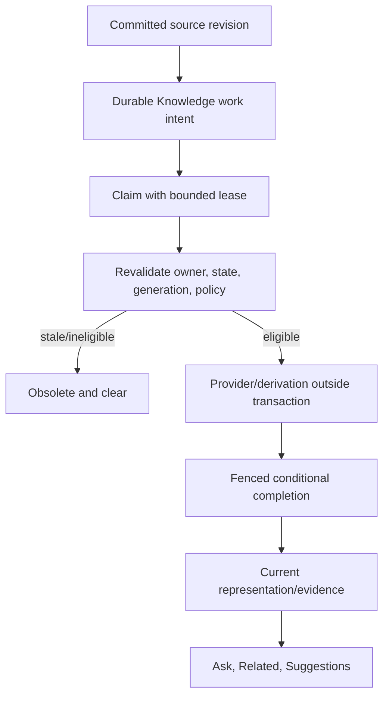

### Phase 8 — Ask / Related / Suggestions

| Field | Plan |
|---|---|
| Objective | Deliver routed personal-knowledge outcomes from proven evidence and durable representations. |
| Dependencies | Phase 7. |
| Primary outcome | Focused lookup, semantic relevance, high-recall aggregation, deterministic exhaustive extraction, related Notes, and organization suggestions behave truthfully. |
| Backend | Endpoints 68–72; server-owned query classification/routing; 200/202 tracked operations, polling/cancel; bounded context; citations; insufficient evidence; proposal-only suggestions. |
| Frontend | Route 13 plus editor Related/Suggestion panels; evidence navigation; coverage/degraded/uncertain states; no client technical mode/provider/model/vector selection. |
| Data / migration | `knowledge.organization_suggestion`; existing work intent for tracked operations; no chat-history or generic conversation relation. |
| Security | Reauthorize every operation/result/citation; AI-OFF deterministic results never enter model evidence; output remains untrusted; no automatic Note/tag mutation. |
| Test evidence | Focused password-like fact, shorthand, insufficient evidence, multi-note movies, all URLs, citations, cancellations, related isolation, suggestion confirmation, provider outage. |
| Observability | Query-class/strategy/coverage/provider bands; no queries, answers, evidence, operation IDs, or citations in telemetry. |
| CI/CD | Full RETRIEVAL and EVALUATION thresholds on frozen text/multimodal corpora; security properties remain binary. |
| Live provider | Bounded Gemini answer/multimodal qualification on synthetic/public-safe evidence; results do not replace deterministic gates. |
| Future artifacts | Ask adapters, operation UI, evaluation sets and reports. |
| Explicitly not yet | Agentic tools, general chatbot, streaming, auto-actions, Groq switch. |
| Stop conditions | Fabricated citations, unsupported completeness, general-knowledge substitution, client-routed providers, privacy/quota failure. |
| Exit criteria | AS-05..13 and 23..28 evidence passes with truthful degradation and navigable authorized provenance. |
| Planned interview evidence | Explain query classes, high recall versus completeness, and provider-independent evaluation. |

### Phase 9 — Publishing / Public Profiles / Discovery / Likes / Views / Public Media

| Field | Plan |
|---|---|
| Objective | Cross the private/public boundary only through explicit immutable snapshot operations. |
| Dependencies | Phase 8. |
| Primary outcome | Public profiles, publication preview/create/update/unpublish/republish, public media, Latest/Trending/search, likes, and approximate views operate only on active public state. |
| Backend | Endpoints 37–39 and 73–86; stable Publication ID; checkpoint hold; selected copied media; synchronous public denial; public-only search/projections; idempotent likes; nonblocking views. |
| Frontend | Routes 14, 15, 17, and 22–25; deliberate public projection, preview fingerprint, drift status, accessible public article/media, viewer-scoped caches, Explore/search/profile navigation. |
| Data / migration | `profile.public_profile_projection`, two public Knowledge relations, four Publishing relations, and three Discovery relations; atomic current-snapshot replacement and generation predicates. |
| Security | No live private Note read on public path; no private provenance; selected media only; no-store initial policy; unpublish/delete/moderation generation denial before cleanup. |
| Test evidence | Snapshot preservation, source drift, trash/delete confirmation+unpublish, public-profile allowlist, media denial, stale cache/generation, like races, approximate views, public-only retrieval. |
| Observability | Publication/storage dashboards; publication/public-denial events; active-only discovery metrics; no private provenance/public IDs in broad logs. |
| CI/CD | Public API/FRONTEND/E2E/SECURITY/RETRIEVAL gates; anonymous denial tests are release blockers. |
| Live provider | Gemini public-derived qualification only if needed and only against already-public/synthetic content; public search remains independently testable. |
| Future artifacts | Publishing/Discovery/public Knowledge migrations, public UI, public media/object lifecycle, projection workers. |
| Explicitly not yet | Social graph/followers, public revision history, personalized feed, private moderator access. |
| Stop conditions | Public path touches private corpus, old generation remains reachable, cache varies incorrectly by viewer, public bytes outlive logical denial. |
| Exit criteria | Complete public family works with stable identity, explicit snapshots, current-only discovery, and immediate logical removal. |
| Planned interview evidence | Demonstrate private Note versus Publication aggregate and snapshot consistency. |

### Diagram G — private Note to Publication and discovery

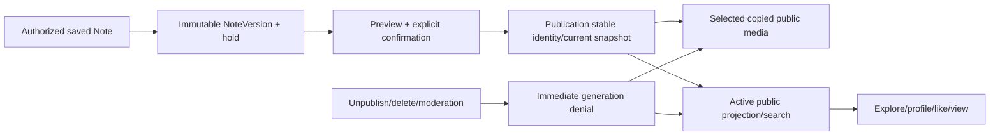

### Phase 10 — Reports / Narrow Moderation

| Field | Plan |
|---|---|
| Objective | Add only the approved public-target reporting and narrow moderation authority. |
| Dependencies | Phase 9. |
| Primary outcome | Reports progress Open → UnderReview → Dismissed/Actioned, and mandatory public/account consequences are established before terminal success. |
| Backend | Endpoints 87–91; narrow `moderation.review`/`moderation.enforce`; begin-review; immutable reasoned decision; local-ACID owner-module consequences; audited operational provisioning boundary. |
| Frontend | Routes 26–27 and report action on route 25; accessible bounded evidence/decision UX; typed recent-auth/MFA and capability-loss handling. |
| Data / migration | Three Moderation relations; no private-note evidence relation and no generic admin relation. |
| Security | Moderators cannot self-assign, browse private Notes/search/media, or gain super-admin access; public-only target/evidence; bounded mass-action/rate controls. |
| Test evidence | Public-only reports, begin-review idempotency, terminal race, rollback/retry on consequence failure, suspension immediate ineligibility, privilege escalation denial. |
| Observability | Safe moderation outcome/consequence metrics and alerts; no report text, private content, or actor identity in broad telemetry. |
| CI/CD | Moderation SECURITY/API/E2E zero-tolerance paths block merge/release. |
| Live provider | None. |
| Future artifacts | Moderation migrations, routes, Identity-owned provisioning/runbook mechanism, tests. |
| Explicitly not yet | Broad user administration, private investigation, automatic mass takedown. |
| Stop conditions | Any private-source dependency, terminal success before consequence, self-service privileges, missing attributable evidence. |
| Exit criteria | AS-20 and all moderation threat/release blockers pass; authority remains narrow. |
| Planned interview evidence | Explain capability boundaries and cross-module consistency without repository shortcuts. |

### Phase 11 — Operationalization

| Field | Plan |
|---|---|
| Objective | Complete production-shaped packaging, CI/CD, observability, and deployment mechanics before final acceptance. |
| Dependencies | Phase 10. |
| Primary outcome | One reproducible non-root ARM64 image, all workflow/gate classes, dashboards/alerts, safe logs, runbook hooks, backup/restore and graceful-drain mechanics are ready. |
| Backend / frontend | Production configuration profiles, SPA same-origin/static delivery, reverse-proxy contract, health/readiness/degradation, executor drain/reclaim, conservative caches. |
| Data / migration | Migration-from-zero and supported-upgrade evidence; exact 38-relation assertion; backup/restore and session/job reconciliation mechanics. |
| Security | Image/runtime hardening, secret injection/rotation, least-privilege database/object/cloud IAM, no debug exposure, public denial probes. |
| Test evidence | Container smoke, ARM64 startup, upgrade/rollback compatibility, recovery rehearsal locally/staged, synthetic probes and log-leak scan. |
| Observability | Implement all seven dashboards, 27 alerts, 17 event classes, health/synthetic paths, release annotations, retention/cost guards. |
| CI/CD | Implement all 19 quality gates and five workflow classes; build once on native ARM64, scan/SBOM/publish/attest exact digest. |
| Live provider | Provider health/degradation, quota and safe synthetic smoke hooks; no live provider in mandatory PR CI. |
| Future artifacts | Docker/Compose, workflow YAML, dashboards/alarms, operator scripts/config only under later implementation authority. |
| Explicitly not yet | OCI production provisioning/promotion, public release claim. |
| Stop conditions | ARM64 failure, paid runner/resource requirement, unsafe image, missing provenance, observability free-tier excess, rollback/migration ambiguity. |
| Exit criteria | Release candidate mechanics are reproducible and evidence-bearing outside production. |
| Planned interview evidence | Explain build-once digest promotion and continuous operational rails. |

### Diagram H — Testing, CI, and Observability rails

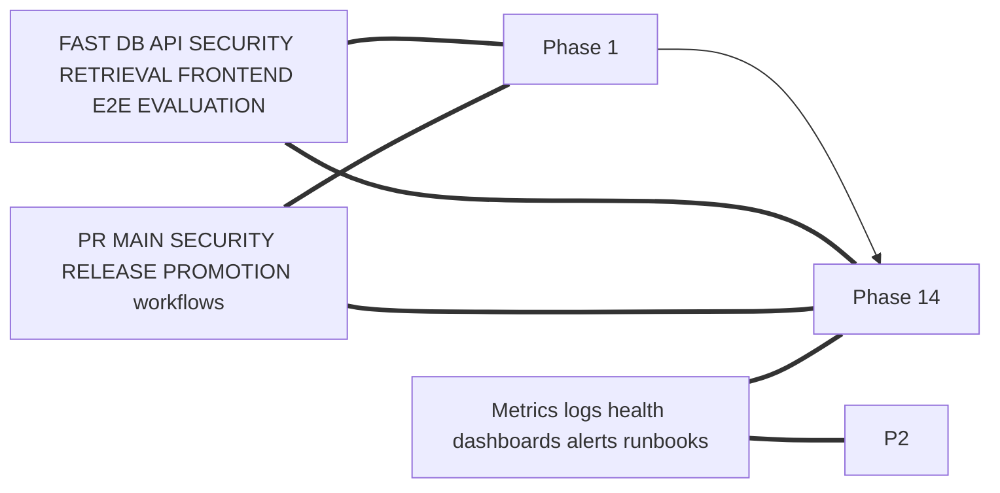

### Phase 12 — System-wide Quality Closure / Flagship Acceptance

| Field | Plan |
|---|---|
| Objective | Close every cross-system requirement and release blocker before production. |
| Dependencies | Phase 11. |
| Primary outcome | The complete Target Flagship—not a subset—passes authoritative product, domain, threat, schema, API, frontend, test, operational, and telemetry checks. |
| Backend / frontend | Fix only defects against baselines; conduct complete accessibility, responsive, browser, degraded-state, cache, concurrency, and safe-error review. |
| Data / migration | Verify clean install and supported upgrade result in exactly 38 relations with constraints/indexes/extensions and no drift. |
| Security | Exercise all 55 threat rows, zero-tolerance counters, redaction, public denial, account/AI revocation, moderation, provider capture, secret scan. |
| Test evidence | All eight suites, 40 canonical acceptance scenarios, 234 FRs, 47 NFRs, 50 invariants, 91 endpoints, and 27 routes trace green. |
| Observability | Validate every dashboard, alert, event class, synthetic, runbook link, retention/cost boundary and no-content telemetry rule. |
| CI/CD | Required merge/release blockers green for exact SHA/digest; exceptions cannot waive security isolation or baseline meaning. |
| Live provider | Bounded Gemini/Brevo/OIDC qualification under synthetic/public-safe data plus truthful degraded cases. |
| Future artifacts | Release evidence pack and defect records only under implementation authority. |
| Explicitly not yet | Production promotion or public portfolio claim. |
| Stop conditions | Any count/trace gap, flaky accepted blocker, unresolved threat, provider/privacy ambiguity, automatic spend, unsupported migration/recovery. |
| Exit criteria | Flagship completion checklist in Section 16 is entirely evidenced; human production gate may be considered. |
| Planned interview evidence | Present traceable quality closure rather than a compilation/demo claim. |

### Diagram I — migration accumulation to 38 relations

```mermaid
flowchart LR
  Z[Empty application schema] --> P2[Phase 2: 2 session relations]
  P2 --> P3[Phase 3: +9 Identity = 11]
  P3 --> P4[Phase 4: +5 Notes = 16]
  P4 --> P5[Phase 5: +3 Profile/Attachment = 19]
  P5 --> P7[Phase 7: +5 Knowledge = 24]
  P7 --> P8[Phase 8: +1 Suggestion = 25]
  P8 --> P9[Phase 9: +10 Public = 35]
  P9 --> P10[Phase 10: +3 Moderation = 38]
  P10 --> V[Phase 12: clean/upgrade verification]
```

### Phase 13 — Zero-cost OCI Production Deployment / Recovery Qualification

| Field | Plan |
|---|---|
| Objective | Promote the exact qualified digest to the approved zero-cost OCI topology and prove operation/recovery. |
| Dependencies | Phase 12 and manual production gate. |
| Primary outcome | Same-origin HTTPS service on OCI ARM64 with PostgreSQL/pgvector, Redis conditional role, Object Storage, safe providers, monitoring, backup, and recovery evidence. |
| Backend / frontend | Deploy exact digest; health/readiness; static SPA routing/cache; no build on server; synthetic product smoke. |
| Data / migration | Backup, maintenance gate, Flyway once, schema validation, restore rehearsal, session/job/public-eligibility reconciliation. |
| Security | Restricted operator access, TLS/DNS, host firewall, private service ports, Vault/secret rotation, least privilege, no public bucket. |
| Test evidence | External HTTPS, auth, core Notes, attachment, deterministic search, safe AI corpus, publication/denial, moderation, restart/reclaim, restore. |
| Observability | OCI ingestion, external synthetic, dashboards/alerts/email notification, capacity/free-tier and backup evidence. |
| CI/CD | Human promotion handoff only; exact digest and release manifest; no general OCI secret in GitHub Actions. |
| Live provider | Production OIDC/Brevo and Gemini synthetic/public-safe qualifications; arbitrary sensitive private-note AI remains constrained by approved provider posture. |
| Future artifacts | OCI resources and operational records only when implementation/deployment is separately authorized. |
| Explicitly not yet | Groq switch, automatic paid scaling, public portfolio announcement. |
| Stop conditions | OCI availability/topology/capacity ambiguity, any paid resource, DNS/TLS/OIDC failure, monitoring gap, restore uncertainty, unsafe provider terms. |
| Exit criteria | Runbooks 1–21 applicable paths are exercised or bounded; recovery, denial, and zero-cost evidence pass. |
| Planned interview evidence | Show deployment is promotion of an already-proven artifact, not first integration. |

### Diagram J — implementation to ARM64 release qualification

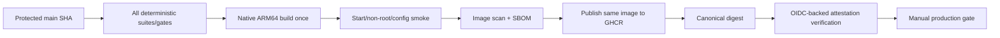

### Diagram K — OCI deployment and stabilization

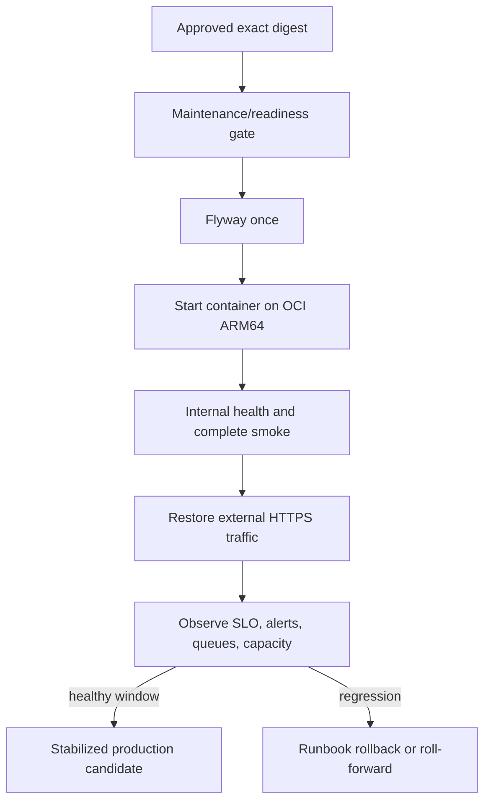

### Phase 14 — Public Portfolio Release / Stabilization

| Field | Plan |
|---|---|
| Objective | Publish and stabilize the complete flagship as a truthful public portfolio system. |
| Dependencies | Phase 13. |
| Primary outcome | Public repository/release evidence, usable production service, architecture/security/quality explanations, and monitored stabilization without overstated claims. |
| Backend / frontend | No new scope; correct production defects through normal gates; preserve accessibility, degraded states, privacy, and contracts. |
| Data / migration | Retention, capacity, backup, migration history, public denial and cleanup monitored. |
| Security | Public-repo hygiene, disclosure-ready dependency/security evidence, no sample secrets/private content, prompt/provider limitations stated honestly. |
| Test evidence | Post-release synthetic/E2E smoke and regression suite for fixes; release evidence linked to exact digest. |
| Observability | Stabilization window uses all dashboards/alerts/runbooks and error-budget/capacity signals. |
| CI/CD | Normal protected-main/release process; no manual unverified server mutation. |
| Live provider | Continue bounded Gemini-first operational qualification and truthful feature degradation. |
| Future artifacts | Portfolio narrative, diagrams, evidence links only after implementation authorization. |
| Explicitly not yet | Groq migration, microservices, new features, paid scale. |
| Stop conditions | Misleading completion claim, open release blocker, privacy leak, unstable service, free-tier risk, evidence/digest mismatch. |
| Exit criteria | Target Flagship meets Section 16, production is stable, and claims match evidence. |
| Planned interview evidence | End-to-end story covering decisions, tradeoffs, tests, security, operations, and incident readiness. |

## 5. Post-deployment Groq experiment (outside flagship release gating)

After Phase 14, a separate, reversible experiment may use a locally executed evaluation harness to compare the deployed Gemini-first path with **Groq-hosted inference** against the same frozen synthetic/public-safe corpus. The evidence covers task/model capability, quality, citation behavior, latency, rate limits, reliability, privacy/data handling, retention or ZDR where offered/applicable, region/account/tier constraints, modality support, Spring AI/provider integration fit, and zero-cost sustainability. The developer machine runs only the evaluation harness; the provider/model runtime remains Groq-hosted, so the experiment requires no local Groq hardware, memory sizing, runtime, or model licensing. Ollama/local models remain the distinct approved local-model path. The experiment is not an automatic fallback and cannot delay or redefine the first production release. A chat/reasoning-provider switch may be adapter/configuration work; an embedding provider/model/dimension change requires new lineage, corpus re-embedding/reindexing, validated cutover, and controlled cleanup. Any selection change requires the approved decision process.

### Diagram L — post-deployment Gemini to locally executed Groq-hosted evaluation

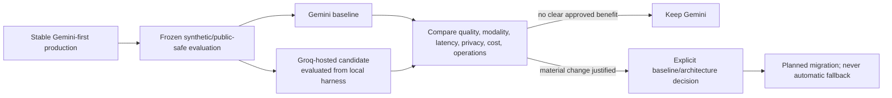

## 6. Authoritative relation-to-phase ledger — 38 relations

Each relation has exactly one primary implementation phase. Later phases may consume it only through the approved owner module/interface.

| Phase | Count | Relations |
|---|---:|---|
| 2 | 2 | `identity.spring_session`, `identity.spring_session_attributes` |
| 3 | 9 | `identity.account`, `identity.external_identity_link`, `identity.identity_capability`, `identity.security_email_delivery`, `identity.mfa_configuration`, `identity.mfa_recovery_code`, `identity.privilege_assignment`, `identity.security_audit_fact`, `identity.application_session_descriptor` |
| 4 | 5 | `notes.note_preferences`, `notes.note`, `notes.note_version`, `notes.note_version_hold`, `notes.note_tag` |
| 5 | 3 | `profile.profile`, `profile.avatar_asset`, `notes.attachment` |
| 7 | 5 | `knowledge.processing_policy`, `knowledge.processing_policy_acknowledgement`, `knowledge.private_derived_representation`, `knowledge.private_derived_segment`, `knowledge.knowledge_work_intent` |
| 8 | 1 | `knowledge.organization_suggestion` |
| 9 | 10 | `profile.public_profile_projection`, `knowledge.public_derived_representation`, `knowledge.public_derived_segment`, `publishing.publication`, `publishing.publication_snapshot_tag`, `publishing.publication_public_media`, `publishing.publication_audit_fact`, `discovery.publication_projection`, `discovery.publication_like`, `discovery.publication_view_aggregate` |
| 10 | 3 | `moderation.report`, `moderation.moderation_decision`, `moderation.moderation_audit_fact` |
| **Total** | **38** | **11 Identity + 3 Profile + 6 Notes + 8 Knowledge + 4 Publishing + 3 Discovery + 3 Moderation** |

## 7. API endpoint-to-phase ledger — 91 endpoints

| Primary phase | Endpoint IDs and family | First frontend consumer | Required suite accrual |
|---|---|---|---|
| 3 | 1–32 — CSRF/session, registration, verification, password/OIDC login, MFA/recovery, recent-auth, security changes, sessions, deletion | Routes 1–9, 18–20 | FAST, DATABASE, API, SECURITY, FRONTEND, E2E |
| 5 | 33–36 — private Profile/avatar | Route 16 | FAST, DATABASE, API, SECURITY, FRONTEND, E2E |
| 9 | 37–39 — public-profile activation/read/active publications | Routes 17, 24 | API, SECURITY, RETRIEVAL, FRONTEND, E2E |
| 4 | 40–43 — Note preference/create/list; 45–59 — Note read/save/lifecycle/tags/AI/bulk/versions | Routes 10–12, 21 for later privacy composition | FAST, DATABASE, API, SECURITY, FRONTEND, E2E |
| 6 | 44 — ordinary private lexical/fuzzy search | Route 10 | DATABASE, API, SECURITY, RETRIEVAL, FRONTEND, E2E |
| 5 | 60–64 — Attachment upload/list/metadata/content/delete | Route 12 | DATABASE, API, SECURITY, FRONTEND, E2E |
| 7 | 65–67 — Note AI-processing projection and policy/acknowledgement | Routes 12, 21 | DATABASE, API, SECURITY, RETRIEVAL, FRONTEND, E2E, EVALUATION |
| 8 | 68–72 — Knowledge query/operation/cancel/related/suggestions | Routes 13 and 12 panels | API, SECURITY, RETRIEVAL, FRONTEND, E2E, EVALUATION |
| 9 | 73–86 — preview/publication owner lifecycle, public reads/media/explore/search/likes | Routes 12, 14–15, 22–25 | DATABASE, API, SECURITY, RETRIEVAL, FRONTEND, E2E, EVALUATION |
| 10 | 87–91 — report, queue/detail, begin review, decision | Routes 25–27 | FAST, DATABASE, API, SECURITY, FRONTEND, E2E |

The sets are disjoint and cover endpoint IDs 1–91 exactly once. `/api` remains the unversioned backend namespace.

## 8. Frontend route-to-phase ledger — 27 routes

| Phase | Routes |
|---|---|
| 3 | 1 `/`; 2 `/signup`; 3 `/verify-email`; 4 `/login`; 5 `/mfa`; 6 `/forgot-password`; 7 `/reset-password`; 8 `/auth/complete`; 9 `/reauth`; 18 `/settings/security`; 19 `/settings/security/mfa`; 20 `/settings/security/sessions` |
| 4 | 10 `/notes`; 11 `/notes/new`; 12 `/notes/{id}` |
| 5 | 16 `/settings/profile` |
| 7 | 21 `/settings/privacy` |
| 8 | 13 `/ask` |
| 9 | 14 `/publications`; 15 `/publications/{publicationId}`; 17 `/settings/public-profile`; 22 `/explore`; 23 `/explore/search`; 24 `/profile/{handle}`; 25 `/publication/{publicationId}` |
| 10 | 26 `/moderation/reports`; 27 `/moderation/reports/{reportId}` |

All 27 routes have one primary phase. Later enhancement of a composed route does not create another route or change its primary ownership.

## 9. Seven-module implementation ledger

| Module | Primary introduction | Completion consumers | Boundary proof |
|---|---|---|---|
| Identity | 2 foundation; 3 behavior | 4–14 | Own repositories and interfaces; no private-note capability |
| Profile | 5 private; 9 public projection | 9–14 | Only allowlisted public projection crosses boundary |
| Notes | 4; Attachment in 5 | 6–10 | Owner-scoped authority and no foreign repository access |
| Knowledge | 6 deterministic; 7 durable; 8 workflows; 9 public derivatives | 6–14 | Physically/logically separate private and public scope |
| Publishing | 9 | 9–14 | Stable Publication snapshot, Notes interface/hold only |
| Discovery | 9 | 9–14 | Active-public projections only; non-authoritative views |
| Moderation | 10 | 10–14 | Public targets and narrow capabilities only |

## 10. Domain-invariant implementation forward trace — DM-INV-001 through DM-INV-050

| Invariant ID | First material phase | Phase exit gate that proves it | Primary Testing Strategy suites |
|---|---:|---|---|
| DM-INV-001 | 3 | Immutable UserId is the owner/authorization subject on all Identity paths | DATABASE, API, SECURITY |
| DM-INV-002 | 3 | Email and handle mutation cannot change authorization identity | DATABASE, API, SECURITY |
| DM-INV-003 | 3 | OIDC links use issuer+subject and reject email-only linking | API, SECURITY, E2E |
| DM-INV-004 | 3 | Protected operations require eligible Account and fully authorized session | API, SECURITY, E2E |
| DM-INV-005 | 3 | Account deletion denies authenticated/public/AI eligibility before cleanup | DATABASE, API, SECURITY, E2E |
| DM-INV-006 | 3 | Password and OIDC primary login both enforce application MFA before full authority | API, SECURITY, E2E |
| DM-INV-007 | 3 | Verification/reset/TOTP replay/recovery capabilities are bounded and one-use | DATABASE, API, SECURITY |
| DM-INV-008 | 3 | Session rotation and individual/group revocation invalidate authority | DATABASE, API, SECURITY, E2E |
| DM-INV-009 | 3 | Sensitive changes enforce recent-auth/MFA consequences and attributable audit | API, SECURITY, E2E |
| DM-INV-010 | 3 | Privilege assignment grants only approved narrow capabilities | DATABASE, API, SECURITY |
| DM-INV-011 | 4 | New Account resolves future-Note AI default to OFF | DATABASE, API, FRONTEND, E2E |
| DM-INV-012 | 4 | Default changes initialize only future Note creation | DATABASE, API, SECURITY, E2E |
| DM-INV-013 | 4 | Every Note has one immutable owner UserId | DATABASE, API, SECURITY |
| DM-INV-014 | 4 | Client IDs/handles/locators never prove Note authorization | API, SECURITY |
| DM-INV-015 | 4 | Editor content becomes authoritative only after successful explicit Save | API, FRONTEND, E2E |
| DM-INV-016 | 4 | Stale Note revision cannot silently overwrite newer state | DATABASE, API, FRONTEND, E2E |
| DM-INV-017 | 4 | Orthogonal Note commands persist independently of editor Save | DATABASE, API, FRONTEND, E2E |
| DM-INV-018 | 4 | Archive/trash/restore/delete lifecycle and logical-denial ordering pass | DATABASE, API, SECURITY, E2E |
| DM-INV-019 | 4 | Retained NoteVersions are immutable, owner-scoped, bounded, and hold-aware | DATABASE, API, SECURITY |
| DM-INV-020 | 4 | Version restore creates new current state without mutating checkpoint | DATABASE, API, FRONTEND, E2E |
| DM-INV-021 | 4 | Each created Note owns an independent binary AI state | DATABASE, API, FRONTEND, E2E |
| DM-INV-022 | 4 | Bulk AI commands affect selected Notes only, not future default | DATABASE, API, SECURITY, E2E |
| DM-INV-023 | 4 | Tags remain Note-scoped and suggestions cannot auto-apply | DATABASE, API, FRONTEND |
| DM-INV-024 | 5 | Attachment media kind accepts exactly image/audio/video/PDF | DATABASE, API, SECURITY, E2E |
| DM-INV-025 | 5 | Every Attachment derives authorization from exactly one owning Note | DATABASE, API, SECURITY |
| DM-INV-026 | 5 | Attachment has no independent AI permission | DATABASE, API, SECURITY |
| DM-INV-027 | 5 | Stored owner access remains distinct from AI-processing outcome | API, SECURITY, FRONTEND, E2E |
| DM-INV-028 | 6 | AI-OFF Notes retain deterministic editing/search/extraction/media behavior | API, SECURITY, RETRIEVAL, E2E |
| DM-INV-029 | 7 | AI-OFF content is excluded from every AI-dependent stage without encryption claim | SECURITY, RETRIEVAL, EVALUATION |
| DM-INV-030 | 7 | AI work begins only after all current authorization/policy/provider gates pass | DATABASE, SECURITY, RETRIEVAL, EVALUATION |
| DM-INV-031 | 7 | AI disable immediately removes eligibility and prevents stale resurrection | DATABASE, SECURITY, RETRIEVAL, EVALUATION |
| DM-INV-032 | 7 | Every derived representation carries source/version/scope/generation/lineage | DATABASE, SECURITY, RETRIEVAL |
| DM-INV-033 | 7 | Derived data/evidence/citations/locators never broaden source authority | DATABASE, SECURITY, RETRIEVAL |
| DM-INV-034 | 7 | Private-owner and active-public Knowledge scopes remain distinct | DATABASE, SECURITY, RETRIEVAL |
| DM-INV-035 | 7 | Knowledge Work Intent stores requested work, not authorization or copied content | DATABASE, SECURITY |
| DM-INV-036 | 7 | Sensitive asynchronous effects revalidate current state before usability | DATABASE, SECURITY, RETRIEVAL, EVALUATION |
| DM-INV-037 | 8 | AI output/suggestions remain proposals and cannot auto-mutate authority | API, SECURITY, RETRIEVAL, E2E, EVALUATION |
| DM-INV-038 | 9 | Publication is a distinct aggregate, never a Note visibility flag/live view | DATABASE, API, SECURITY, E2E |
| DM-INV-039 | 9 | Publication owns stable identity and current snapshot comes from authorized NoteVersion | DATABASE, API, SECURITY, E2E |
| DM-INV-040 | 9 | Private Save/Attachment/tag changes never mutate public snapshot automatically | DATABASE, API, SECURITY, E2E |
| DM-INV-041 | 9 | Unpublish/account deletion/moderation removes public eligibility before cleanup | DATABASE, API, SECURITY, E2E |
| DM-INV-042 | 9 | Only explicitly selected approved copied media enters Publication | DATABASE, API, SECURITY, E2E |
| DM-INV-043 | 9 | Public Profile Projection exposes only intentional allowlisted fields | DATABASE, API, SECURITY, E2E |
| DM-INV-044 | 9 | Discovery/search/read/engagement candidates are current active Publications only | DATABASE, API, SECURITY, RETRIEVAL, E2E |
| DM-INV-045 | 9 | One active Like per user/publication and repeated intent is idempotent | DATABASE, API, E2E |
| DM-INV-046 | 9 | Views are approximate, privacy-conscious, non-authoritative, and nonblocking | DATABASE, API, SECURITY |
| DM-INV-047 | 10 | Reports target public Publication only and grant no private-source access | DATABASE, API, SECURITY, E2E |
| DM-INV-048 | 10 | Moderator capability excludes private Notes/retrieval/media/security secrets | API, SECURITY, E2E |
| DM-INV-049 | 10 | Material Moderation Decisions are attributable, reasoned, bounded, and owner-applied | DATABASE, API, SECURITY, E2E |
| DM-INV-050 | 1 | Seven-module ownership and no cross-module repository shortcut pass architecture fitness | FAST, SECURITY |

The table contains 50 unique stable IDs, each with one first-material phase and one primary exit trace. Every invariant remains binding in all later phases.

## 11. Threat Model implementation forward trace — 55 rows

“Release blocker” below is copied from the Threat Model's explicit row disposition, not inferred from severity. `YES` retains any condition stated there (for example, “if accessible” or “when exposure occurs”). In addition, the Threat Model's global rule remains independently binding: any proven cross-user isolation, authentication, authorization, MFA, private/public, AI-state, or authorization-before-retrieval violation blocks release through Phase 14 even when its row is `NO` below.

| Threat ID | First exposure phase | Preventive-control phase | First executable-evidence phase | Explicit row release blocker? | Primary suites |
|---|---:|---:|---:|:---:|---|
| TM-AUTH-01 | 3 | 2–3 | 3 | NO | API, SECURITY, E2E |
| TM-AUTH-02 | 3 | 2–3 | 3 | NO | API, SECURITY, E2E |
| TM-AUTH-03 | 3 | 3 | 3 | NO | FAST, DATABASE, SECURITY |
| TM-AUTH-04 | 3 | 2–3 | 3 | NO | DATABASE, API, SECURITY, E2E |
| TM-OIDC-01 | 3 | 3 | 3 | NO | API, SECURITY, E2E |
| TM-OIDC-02 | 3 | 3 | 3 | NO | API, SECURITY, E2E |
| TM-OIDC-03 | 3 | 3 | 3 | YES | DATABASE, API, SECURITY, E2E |
| TM-OIDC-04 | 3 | 3 | 3 | NO | API, SECURITY, E2E |
| TM-MFA-01 | 3 | 3 | 3 | NO | DATABASE, API, SECURITY |
| TM-MFA-02 | 3 | 2–3 | 3 | NO | DATABASE, SECURITY |
| TM-MFA-03 | 3 | 3 | 3 | NO | API, SECURITY, E2E |
| TM-AUTHZ-01 | 4 | 2–4 | 4 | YES | DATABASE, API, SECURITY, E2E |
| TM-AUTHZ-02 | 2 | 2 | 5 | YES | API, SECURITY, RETRIEVAL |
| TM-AUTHZ-03 | 10 | 3, 10 | 10 | NO | API, SECURITY, E2E |
| TM-AUTHZ-04 | 2 | 1–2 | 2 | YES | FAST, API, SECURITY |
| TM-RETR-01 | 6 | 2, 6 | 6 | YES | DATABASE, SECURITY, RETRIEVAL |
| TM-RETR-02 | 6 | 2, 6 | 6 | YES | API, SECURITY, RETRIEVAL |
| TM-RETR-03 | 6 | 2, 6 | 6 | NO | API, SECURITY, RETRIEVAL |
| TM-RETR-04 | 7 | 7 | 7 | YES | DATABASE, SECURITY, RETRIEVAL, EVALUATION |
| TM-AI-01 | 7 | 4, 7 | 7 | YES | SECURITY, RETRIEVAL, EVALUATION |
| TM-AI-02 | 7 | 4, 7 | 7 | NO | DATABASE, API, SECURITY, E2E |
| TM-AI-03 | 7 | 7–8 | 8 | NO | SECURITY, RETRIEVAL, EVALUATION |
| TM-AI-04 | 7 | 0, 7 | 7 | NO | SECURITY, EVALUATION |
| TM-AI-05 | 7 | 7–8 | 8 | NO | SECURITY, RETRIEVAL, EVALUATION |
| TM-AI-06 | 7 | 7–8 | 8 | NO | API, SECURITY, EVALUATION |
| TM-FILE-01 | 5 | 5 | 5 | NO | API, SECURITY, E2E |
| TM-FILE-02 | 5 | 5 | 5 | NO | API, SECURITY, E2E |
| TM-FILE-03 | 5 | 2, 5 | 5 | YES | API, SECURITY, E2E |
| TM-FILE-04 | 5 | 5, 9 | 9 | YES | API, SECURITY, E2E |
| TM-WEB-01 | 4 | 1–5 | 4 | YES | SECURITY, FRONTEND, E2E |
| TM-WEB-02 | 2 | 2 | 2 | NO | API, SECURITY, FRONTEND, E2E |
| TM-WEB-03 | 2 | 2, 11 | 11 | NO | API, SECURITY, E2E |
| TM-PUB-01 | 9 | 4, 9 | 9 | YES | DATABASE, API, SECURITY, E2E |
| TM-PUB-02 | 9 | 7, 9 | 9 | NO | API, SECURITY, RETRIEVAL, E2E |
| TM-PUB-03 | 9 | 9 | 9 | NO | API, SECURITY, E2E |
| TM-MOD-01 | 10 | 3, 10 | 10 | YES | API, SECURITY, E2E |
| TM-MOD-02 | 10 | 2, 10 | 10 | NO | API, SECURITY, FRONTEND, E2E |
| TM-JOB-01 | 7 | 2, 7 | 7 | YES | DATABASE, SECURITY, RETRIEVAL, EVALUATION |
| TM-JOB-02 | 7 | 2, 7 | 7 | NO | DATABASE, SECURITY |
| TM-JOB-03 | 7 | 2, 7 | 7 | NO | DATABASE, SECURITY, EVALUATION |
| TM-DATA-01 | 2 | 2 | 2 | YES | DATABASE, API, SECURITY |
| TM-DATA-02 | 2 | 1–2 | 2 | NO | FAST, DATABASE, SECURITY |
| TM-DATA-03 | 2 | 2, 11 | 11 | NO | DATABASE, SECURITY, E2E |
| TM-DATA-04 | 2 | 2, 11 | 11 | NO | DATABASE, API, SECURITY |
| TM-OPS-01 | 2 | 1–2, 11 | 11 | NO | SECURITY, E2E |
| TM-OPS-02 | 2 | 2 | 2 | NO | API, SECURITY |
| TM-OPS-03 | 1 | 1 | 1 | NO | FAST, SECURITY |
| TM-OPS-04 | 2 | 1–2, 11 | 11 | NO | API, SECURITY, E2E |
| TM-OPS-05 | 3 | 3 | 3 | NO | DATABASE, API, SECURITY, E2E |
| TM-DOS-01 | 2 | 2–3 | 3 | NO | API, SECURITY, E2E |
| TM-DOS-02 | 7 | 6–8 | 8 | NO | RETRIEVAL, EVALUATION |
| TM-DOS-03 | 2 | 2, 5, 7 | 5 | NO | API, SECURITY, E2E |
| TM-PRIV-01 | 7 | 0, 7 | 7 | NO | SECURITY, FRONTEND, EVALUATION |
| TM-PRIV-02 | 9 | 2, 9, 11 | 9 | NO | API, SECURITY, E2E |
| TM-SSRF-01 | 2 | 2, 6 | 6 | NO | API, SECURITY, RETRIEVAL |

The table contains 55 unique stable IDs with no invented ID. The 15 explicit row-level `YES` classifications and all global blocker semantics are sourced from the Approved Threat Model and remain globally binding through Phase 14.

## 12. Product stable-ID primary-phase ledger

### 12.1 Functional Requirements — 234

| Phase | Exact stable-ID sets |
|---|---|
| 2 | FR-SEC-01..14 |
| 3 | FR-ID-01..10; FR-MFA-01..12; FR-SESSION-01..08 |
| 4 | FR-NOTE-01..26 |
| 5 | FR-ATTACH-01..15; FR-PROFILE-01..05 and 07..10 |
| 6 | FR-SEARCH-01..12; FR-RETR-12..16 |
| 7 | FR-AI-01..09 and 27..31 and 34..45; FR-MM-01..10 |
| 8 | FR-AI-10..26 and 32..33; FR-RETR-01..11 and 17..29 |
| 9 | FR-PROFILE-06; FR-PUB-01..21; FR-EXPLORE-01..08; FR-ENGAGE-01..07 |
| 10 | FR-MOD-01..07 |

The sets are disjoint and total 234. Numeric range notation means every stable ID in the inclusive range, not prose substitution.

### 12.2 Non-Functional Requirements — 47

| Phase | Exact stable-ID sets |
|---|---|
| 1 | NFR-REPO-01..04; NFR-MAINT-01..02 |
| 2 | NFR-SEC-01..04; NFR-PRIV-01..04; NFR-AUDIT-01 |
| 6 | NFR-SEARCH-01..02 |
| 7 | NFR-AI-01..09; NFR-DEGRADE-01..03 |
| 11 | NFR-OBS-01..02 |
| 12 | NFR-ACC-01..03; NFR-PERF-01..02; NFR-REL-01..06; NFR-TEST-01..03 |
| 13 | NFR-COST-01..02 |

The sets are disjoint and total 47.

### 12.3 Canonical Acceptance Scenarios — AS-01 through AS-40

| Phase | Scenario IDs |
|---|---|
| 3 | AS-16, AS-17 |
| 4 | AS-01..04, AS-21, AS-22 |
| 5 | AS-29, AS-30 |
| 6 | AS-05, AS-06, AS-10, AS-11, AS-13, AS-23 |
| 7 | AS-12, AS-18, AS-25..28, AS-32..40 |
| 8 | AS-07..09, AS-24 |
| 9 | AS-14, AS-15, AS-19, AS-31 |
| 10 | AS-20 |

The sets are disjoint and cover all 40 scenarios exactly once.

## 13. Continuous accrual matrices

### 13.1 Phase-by-suite Testing Strategy accrual matrix

Only the controlled values `N/A`, `INTRODUCED`, `EXPANDED`, and `FULL GATE` are used. `FULL GATE` in Phases 13–14 includes production/smoke evidence without creating a ninth suite.

| Phase | FAST | DATABASE | API | SECURITY | RETRIEVAL | FRONTEND | E2E | EVALUATION |
|---:|---|---|---|---|---|---|---|---|
| 0 | N/A | N/A | N/A | N/A | N/A | N/A | N/A | N/A |
| 1 | INTRODUCED | INTRODUCED | N/A | INTRODUCED | N/A | INTRODUCED | INTRODUCED | N/A |
| 2 | EXPANDED | EXPANDED | INTRODUCED | EXPANDED | N/A | EXPANDED | EXPANDED | N/A |
| 3 | EXPANDED | EXPANDED | EXPANDED | EXPANDED | N/A | EXPANDED | EXPANDED | N/A |
| 4 | EXPANDED | EXPANDED | EXPANDED | EXPANDED | N/A | EXPANDED | EXPANDED | N/A |
| 5 | EXPANDED | EXPANDED | EXPANDED | EXPANDED | N/A | EXPANDED | EXPANDED | N/A |
| 6 | EXPANDED | EXPANDED | EXPANDED | EXPANDED | INTRODUCED | EXPANDED | EXPANDED | N/A |
| 7 | EXPANDED | EXPANDED | EXPANDED | EXPANDED | EXPANDED | EXPANDED | EXPANDED | INTRODUCED |
| 8 | EXPANDED | EXPANDED | EXPANDED | EXPANDED | EXPANDED | EXPANDED | EXPANDED | EXPANDED |
| 9 | EXPANDED | EXPANDED | EXPANDED | EXPANDED | EXPANDED | EXPANDED | EXPANDED | EXPANDED |
| 10 | EXPANDED | EXPANDED | EXPANDED | EXPANDED | EXPANDED | EXPANDED | EXPANDED | EXPANDED |
| 11 | EXPANDED | EXPANDED | EXPANDED | EXPANDED | EXPANDED | EXPANDED | EXPANDED | EXPANDED |
| 12 | FULL GATE | FULL GATE | FULL GATE | FULL GATE | FULL GATE | FULL GATE | FULL GATE | FULL GATE |
| 13 | FULL GATE | FULL GATE | FULL GATE | FULL GATE | FULL GATE | FULL GATE | FULL GATE | FULL GATE |
| 14 | FULL GATE | FULL GATE | FULL GATE | FULL GATE | FULL GATE | FULL GATE | FULL GATE | FULL GATE |

Exactly eight approved suite categories remain; no ninth category is introduced.

### 13.2 CI/CD quality-gate accrual — 19 entries

| Phase | Gate entries activated or completed |
|---|---|
| 1 | Build sanity; FAST; FRONTEND; Modulith architecture; Secret scan; CodeQL; Dependency review |
| 2 | DATABASE; API; SECURITY; Flyway/schema |
| 6 | RETRIEVAL |
| 7 | EVALUATION begins as release evidence |
| 9 | E2E reaches public/private critical set |
| 11 | Container scan; ARM64 smoke; SBOM; Attestation; Production manual gate; all earlier gates fully orchestrated |
| 12 | All 19 gates green for exact release candidate |

The five workflow classes accrue as: PR CI in Phase 1; MAIN CI in Phase 1/2; SECURITY / SCHEDULED MAINTENANCE in Phase 1/11; RELEASE in Phase 11; PRODUCTION PROMOTION / RUNBOOK HANDOFF in Phase 13.

The following is a sequencing ledger for approved mechanics, not additional quality gates:

| CI/CD capability or mechanic | First implementation phase | Completion / required-use phase | Existing gate or workflow relationship |
|---|---:|---:|---|
| Local clean build | 1 | 1 | Build sanity |
| Maven Wrapper | 1 | 1 | Build sanity and wrapper integrity |
| `package-lock.json` | 1 | 1 | Build sanity and dependency state |
| `npm ci` | 1 | 1 | Build sanity / FRONTEND |
| PR CI | 1 | 1 | PR CI workflow; expands with every slice |
| MAIN CI | 1 | 2 | MAIN CI workflow; expands with every slice |
| Protected main | 1 | 1 | Branch protection using stable required conclusions |
| PostgreSQL 18/pgvector Testcontainers | 1 | 2 | DATABASE / Flyway-schema gates |
| Modulith architecture gate | 1 | 1 | Modulith architecture gate |
| CodeQL | 1 | 1 | CodeQL gate; scheduled/full orchestration completed in 11 |
| Dependency review | 1 | 1 | Dependency review gate |
| Dependabot | 1 | 11 | SECURITY / SCHEDULED MAINTENANCE workflow; not a new gate |
| Secret scanning | 1 | 1 | Secret scan gate; response process completed in 11 |
| Container scanning | 11 | 11 | Container scan gate |
| Native ARM64 production build | 11 | 11 | ARM64 smoke / RELEASE workflow |
| SBOM | 11 | 11 | SBOM gate |
| Public GHCR publication | 11 | 11 | RELEASE workflow; publication alone is not release |
| Canonical digest capture | 11 | 11 | RELEASE manifest and attestation inputs |
| Artifact Attestation | 11 | 11 | Attestation gate |
| Attestation verification | 11 | 12 | Attestation/release eligibility gate |
| Manual production promotion | 11 | 13 | Production manual gate and PROMOTION / RUNBOOK HANDOFF workflow |

The authoritative totals remain exactly 19 quality-gate entries and five workflow classes.

### 13.3 Observability accrual

| Phase | Dashboards | Alerts | Structured events | Operational purpose |
|---|---|---|---|---|
| 2 | System Overview; HTTP/API; JVM/Database/Redis foundations | 1–10, 22–24 foundation wiring | `application.start`, `application.ready`, `application.shutdown`, `request.completed`, `security.control.rejected`, `dependency.state_change` | Safe runtime and dependency visibility |
| 3 | Identity / Security Delivery | 13, 14, 26 plus relevant 24 | `auth.outcome`, `security_email.work.outcome` | Account/security-email correctness |
| 4 | HTTP/API Notes panels | Relevant 4, 5, 24 | `note.command.outcome` | Save/command health without content |
| 5 | Storage / Publication storage portion | 15, 16 | `attachment.validation.outcome`, `storage.operation.outcome` | Media safety/capacity |
| 6–8 | Knowledge / AI / Retrieval | 11, 12, 17, 18 plus relevant 24 | `knowledge.work.outcome`, `retrieval.outcome`, `ai.provider.outcome` | Coverage, freshness, provider degradation |
| 9–10 | Storage / Publication completion | 25, 27 | `publication.command.outcome`, `public_denial.outcome`, `moderation.outcome` | Public denial and enforcement |
| 11 | Capacity / Cost / Release; complete all seven dashboards | 19–23 and complete all 27 | Validate all 17 classes and privacy/retention | Production operations and zero-cost envelope |
| 13 | OCI-native ingestion and external synthetic | Exercise all applicable alerts | Release annotations, no new event class | Deployment/recovery qualification |

Approved observability capability sequencing is made explicit below; it does not create new signals or semantics:

| Observability capability | First implementation phase | Completion / qualification phase |
|---|---:|---:|
| Server-controlled trace/request ID | 2 | 2; privacy rechecked in 12 |
| Structured JSON logging | 2 | 2; all event classes complete in 11 |
| Base Actuator liveness/readiness | 2 | 2; production dependency semantics qualified in 13 |
| Standard JVM/process/HTTP metrics | 2 | 2; OCI ingestion qualified in 13 |
| PostgreSQL/Hikari telemetry | 2 | 2; capacity/recovery views complete in 11–13 |
| Redis telemetry | 2 | 11 when the approved conditional Redis use is active |
| Security-email freshness | 3 | 3; production provider alerting qualified in 13 |
| Knowledge-work freshness | 7 | 7; production alerting qualified in 13 |
| Search/Retrieval telemetry | 6 | 8; production ingestion qualified in 13 |
| AI/provider telemetry | 7 | 8; Gemini production qualification in 13 |
| Attachment/Object Storage telemetry | 5 | 11; OCI Object Storage qualification in 13 |
| Publication/public-denial telemetry | 9 | 9; anonymous production denial probe in 13 |
| Moderation telemetry | 10 | 10; production consequence alert qualified in 13 |
| Zero-tolerance runtime signals | 2 | 10 across all features; full release gate in 12 |
| Release annotation | 11 | 11; exact promoted digest annotation in 13 |
| OCI agent integration | 13 | 13 |
| OCI Monitoring | 13 | 13 |
| OCI Logging | 13 | 13 |
| All seven dashboards | 2 progressively | 11 complete; 13 production-qualified |
| All 27 alerts | 2 progressively | 11 complete; 13 delivery-qualified |
| OCI Notifications routing | 13 | 13 |
| External HTTPS synthetic | 13 | 13; continues through 14 stabilization |

Authoritative totals remain seven dashboards, 27 alerts, 17 structured log-event classes, and 12 Observability diagrams. This roadmap implements their meaning; it does not reproduce or amend those diagrams.

### 13.4 Deployment runbook accrual — 21 runbooks

| Phase | Runbooks prepared/exercised |
|---|---|
| 7 | 12 Gemini outage/quota; 13 Gemini model retirement; 14 stuck Knowledge work |
| 3 | 11 Brevo outage/quota; 15 stuck security email; 16 OIDC configuration/domain readiness |
| 5 | 9 object-storage outage; 10 orphan staging cleanup |
| 9 | 21 public-media denial verification |
| 11 | 1–5 normal/failed deploy, rollback, Flyway, PostgreSQL outage; 7 VM loss; 8 Redis outage; 17 TLS/DNS; 18–20 credential/key rotation |
| 13 | 6 PostgreSQL restore and complete rehearsal/qualification of all applicable 1–21 |

### 13.5 Live-provider qualification matrix

| Provider/capability | Deterministic development/CI | First bounded live gate | Production gate | Failure behavior |
|---|---|---|---|---|
| Google OIDC | Protocol adapter/test issuer; no live secrets in CI | Phase 3 exact redirect/domain/PKCE/state/nonce/issuer-subject | Phase 13 external auth smoke | Disable affected entry; password/session paths remain truthful |
| Brevo security email | Capturing adapter and durable-work tests | Phase 3 sandbox/live test with non-sensitive controlled recipient | Phase 13 generic verification/reset/notice smoke | Durable bounded retry; blind API remains enumeration-safe |
| Gemini embeddings/generation/multimodal | Deterministic doubles and frozen corpus | Phase 7 capability/privacy/quota; Phase 8 answer quality | Phase 13 synthetic/public-safe full workflow | AI-only degradation; deterministic Notes/search remain healthy |
| OCI Object Storage | Local S3-compatible/test adapter | Phase 11 compatibility and lifecycle smoke | Phase 13 private/public object and denial checks | Byte features degrade safely; no public/local workaround |
| OCI Monitoring/Logging/Notifications/Synthetics | Local metrics/log tests and alert fixtures | Phase 11 API/agent/free-limit proof | Phase 13 ingestion/notification/external probe | Protect disk; disclose telemetry gap; STOP if required safety is absent |
| Groq-hosted inference evaluated from the local developer harness | None before flagship release | Only after Phase 14, using the frozen synthetic/public-safe corpus | Separate explicit decision after hosted-provider capability, quality, citations, latency, rate limits, reliability, privacy/retention/ZDR, region/account/tier, modality, Spring AI fit, and zero-cost review | Local machine runs the harness only; never automatic fallback and never blocks Gemini-first release; Ollama remains the separate local-model path |

## 14. STOP AND REVIEW register

| Trigger | Required response |
|---|---|
| Java/Spring Boot/Spring Modulith/Spring AI or frontend stack incompatibility | Stop; produce evidence; require Technology/architecture amendment if selection must change |
| `micrometer-registry-prometheus` or another component falls outside approved dependency allowance | Stop; resolve explicit approved version/classification before adding it |
| PostgreSQL 18/pgvector 0.8.6 compatibility or filtered-vector safety cannot be proven | Stop; no alternate DB/vector store or unsafe post-filter shortcut |
| Native ARM64 build/run, GHCR, SBOM, attestation, or free runner is unavailable | Stop; evaluate only an explicitly reviewed zero-cost safe route |
| Google OIDC requires an unavailable/paid hostname, unsafe redirect, or unverified domain | Stop; do not loosen OIDC controls or buy silently |
| Brevo free access, terms, privacy, quota, or durable delivery assumptions fail | Stop; do not make email best-effort/in-memory |
| Gemini required modalities, models, privacy/retention/terms, free quota, or lifecycle are unsuitable | Stop; no secret paid activation or automatic Groq fallback |
| OCI Always Free topology/capacity/resource availability differs materially | Stop; do not resize into paid resources or weaken topology silently |
| GitHub public runner/package/security feature or enforceable zero-spend guard is unavailable | Stop; do not enable metered usage automatically |
| OCI observability free limits, ingestion, notification, or external synthetic coverage cannot meet the baseline | Stop; redesign through an approved amendment, not by dropping visibility |
| Implementation appears to need a new relation, endpoint, route, deployable, module, or Domain invariant | Stop and name the exact baseline amendment required |
| Any requirement/invariant/threat/contract is ambiguous in a way that changes behavior | Stop; obtain human clarification/baseline amendment |
| Any provider/cloud/tool could create automatic spend or needs a payment workaround | Stop; intended additional spend remains ₹0/$0 |

## 15. Rejected roadmap patterns and scope controls

The roadmap explicitly rejects: backend first and frontend months later; tests/security/observability at the end; deployment as first integration; optional features “while we are here”; temporary browser JWT; H2; public S3/Object Storage bucket; in-memory durable jobs; disabled CSRF; mocked PostgreSQL semantics; live Gemini in mandatory CI; Groq before first deployment; automatic Gemini-to-Groq failover; convenient API-path rewrites; ORM-driven extra tables; frontend-driven extra routes; résumé microservices; one huge implementation prompt; “complete because it compiles”; buying infrastructure because free setup is inconvenient; and silent Approved-Baseline amendments.

No phase authorizes followers/social graph, personalized feed, agentic tools, general chatbot, public revision history, arbitrary remote URL fetching, a Vault/E2EE claim, new role, generic notification module, Kubernetes, RabbitMQ, API gateway, dedicated AI service, separate worker, or a second backend deployable.

## 16. Flagship completion and phase completion criteria

A phase may become **COMPLETE** only when its user/engineering outcome works through the approved API/UI boundary; its migrations/constraints are correct; applicable authorization, privacy, concurrency, AI/public gates and threat controls pass; required suites and CI gates are deterministic and green; safe telemetry/runbook evidence exists; no secrets/private content leak through artifacts or signals; documentation matches reality; and no unresolved baseline conflict remains. Otherwise it is NOT STARTED, IN PROGRESS, or BLOCKED.

The Target Flagship is complete only when:

- all 234 FRs, 47 NFRs, and AS-01..40 have passing trace evidence;
- all 38 relations, 91 endpoints, 27 routes, seven modules, 50 invariants, and 55 threat rows are implemented without unauthorized additions;
- the eight suite categories and every Testing Strategy/Threat Model release blocker pass;
- private Notes, four attachment modalities, deterministic Search, AI participation, durable Knowledge, Ask/Related/Suggestions, Publishing, public discovery, engagement, and narrow moderation work end to end;
- authorization precedes retrieval, AI-OFF/provider gates are proven, public denial is immediate, and degraded behavior is truthful;
- all 21 runbooks, 19 CI gates, five workflow classes, seven dashboards, 27 alerts, 17 event classes, and approved operational controls are implemented/qualified as applicable;
- one verified native ARM64 image is built once, scanned, SBOM-attached, published by digest, attested, promoted, recovered, and stabilized on the approved zero-cost OCI topology;
- the public repository and portfolio claims are accurate, safe, reproducible, and tied to evidence;
- no required work is deferred under an MVP/V2 label, and no automatic paid resource is enabled.

## 17. Practical learning and interview guide

- A roadmap orders work and evidence; architecture defines structural decisions.
- Horizontal foundations are deliberately narrow; vertical slices deliver usable outcomes across data/backend/API/UI/security/tests/telemetry.
- Identity precedes private Notes because immutable authenticated UserId is the authorization root.
- Ordinary Search precedes AI Search so owner scoping, typo behavior, deterministic completeness, and graceful AI independence are proven first.
- Byte storage/validation precedes multimodal derivation so models never become storage or authorization authorities.
- AI controls precede provider dispatch; durable-work correctness precedes Ask freshness.
- Publication follows Note/version semantics because a public snapshot needs an authorized immutable checkpoint and selected media.
- Moderation follows public content because Reports target public representations and never create private access.
- Tests, security, and telemetry grow with every slice; CI starts early while release automation waits for a real complete artifact.
- Provider doubles make mandatory CI deterministic; live qualifications answer external capability/terms questions separately.
- Deployment promotes an already-tested artifact; it is not the first full-system exercise.
- Native ARM64 build-once/digest promotion removes rebuild ambiguity.
- Zero-cost revalidation belongs at entry, release, and production boundaries because terms/resources change.
- Phases are dependency increments, not product versions; a big-bang prompt would erase review and evidence boundaries.
- STOP AND REVIEW preserves architectural integrity better than a quiet shortcut.
- Groq experimentation follows stable Gemini-first production so it is comparison, not schedule risk.
- Embedding changes require new lineage, dimension compatibility, corpus re-embedding, validation, cutover, and cleanup; a chat model adapter change may be narrower.
- A modular monolith still supports rigorous phases because module ownership and interfaces isolate work without operational microservices.

## 18. Roadmap verification ledger

| Item | Verified value |
|---|---:|
| Implementation phases | 15 (0–14): Phase 0 COMPLETE; Phase 1 IN PROGRESS; Phases 2–14 NOT STARTED |
| Post-deployment experiment | 1, outside flagship release gating |
| Relations | 38 |
| API endpoints | 91 |
| Frontend routes | 27 |
| Modules | 7 |
| Domain invariants | 50 |
| Threat rows | 55 |
| Functional Requirements | 234 |
| Non-Functional Requirements | 47 |
| Canonical Acceptance Scenarios | 40 |
| Testing suite categories | 8 |
| Deployment runbooks | 21 |
| CI/CD quality gates | 19 |
| CI/CD workflow classes | 5 |
| Observability dashboards | 7 |
| Observability alerts | 27 |
| Structured log-event classes | 17 |
| Observability diagrams (unchanged upstream) | 12 |
| Roadmap Mermaid diagrams | 12 |

No baseline amendment is presently required. All sixteen upstream Approved Baselines and `PROJECT_CONTEXT_HANDOFF.md` were unchanged by the Roadmap's design and review; this approved Implementation Roadmap is the seventeenth Approved Baseline. No implementation is authorized or started by this document.
