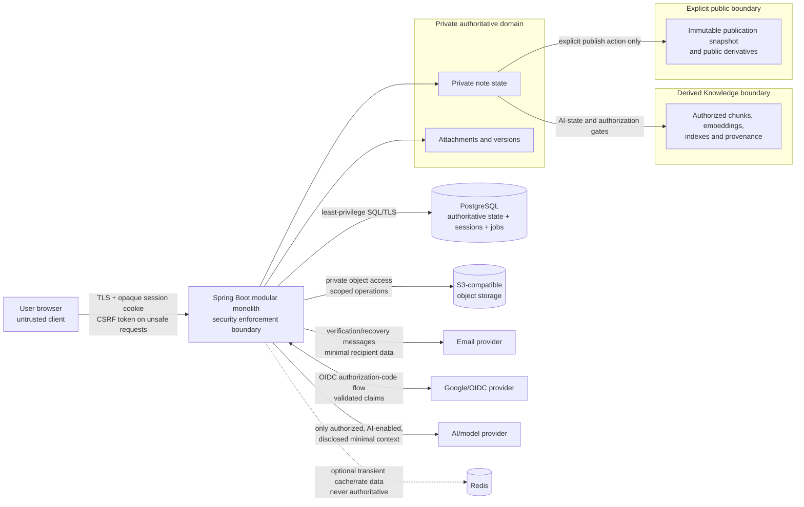
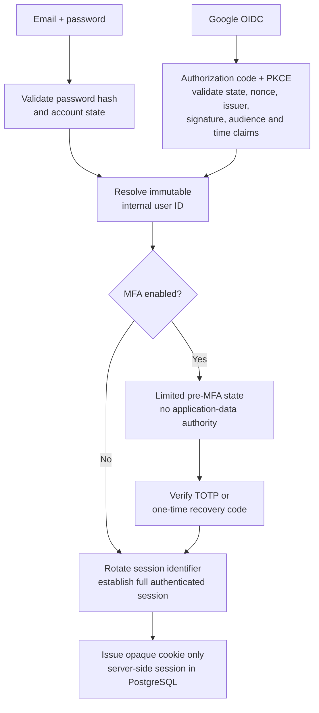
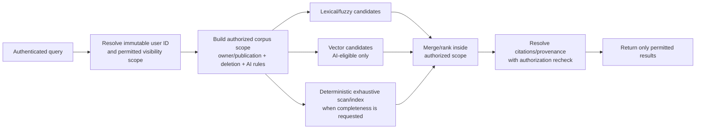
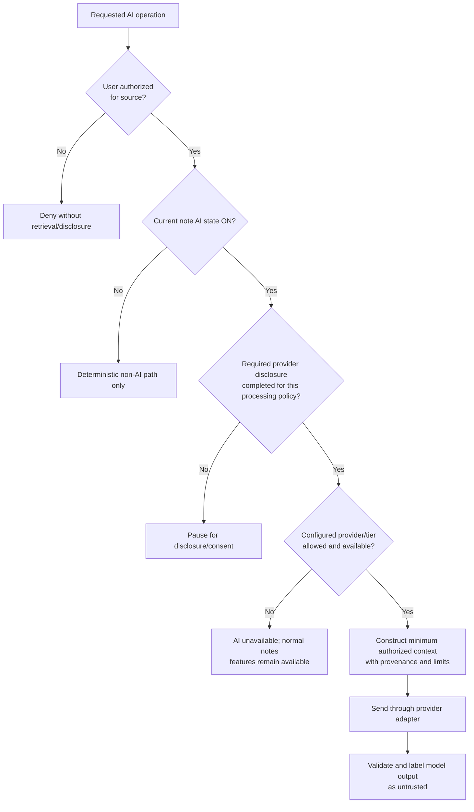
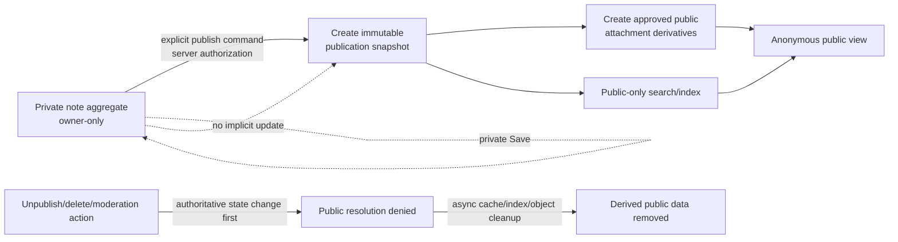

# Notes & Knowledge Workspace

# Security Architecture

Status: Approved Baseline  
Date: 2026-09-10  
Baseline approval date: 2026-09-11  
Baseline amendment review date: 2026-09-13  
Baseline amendment approval date: 2026-09-13

## 1. Purpose, authority, and scope

This document defines the security rules, trust boundaries, mechanisms, and invariants that every later design and implementation for Notes & Knowledge Workspace must obey. It consumes, and does not supersede, the approved Product Vision and Target Flagship Requirements, ADR-001, High-Level Architecture, Technology Stack and Compatibility baseline, and Project Context Handoff.

This document owns the security architecture. It does not define endpoint paths, DTOs, database tables or indexes, repository classes, exact token columns, exact Redis keys, exact Content Security Policy text, provider-specific deployment configuration, or a complete inventory and prioritization of attack scenarios. Those details belong to the later API, domain, data, backend, deployment, testing, and Threat Model documents.

Security controls described here must remain inside the approved domain-oriented modular monolith and its supporting infrastructure. PostgreSQL remains authoritative. Redis, if introduced, remains optional and transient. This document creates no service, gateway, broker, separate AI process, or separate worker.

This approved amendment reconciles only the security treatment of recoverable material needed for durable Identity security-email delivery; it does not approve a schema shape, implementation, migration, API change, or broader notification capability. The original baseline approval metadata remains preserved above.

## 2. Security principles

1. **Deny by default.** A request, query, job, or provider call proceeds only after an explicit rule grants it.
2. **Authorize immutable identity.** The immutable internal user ID is the authorization subject. Email address, public handle, browser-supplied owner IDs, provider email, and object identifiers are not proof of identity or ownership.
3. **Authorize before retrieval.** Ownership, visibility, role, note AI state, and deletion/publication state constrain candidate selection before lexical, fuzzy, vector, hybrid, aggregate, or exhaustive retrieval.
4. **Enforce least privilege at every boundary.** Application roles, database identities, object-storage permissions, provider credentials, background jobs, and moderator capabilities receive only what they require.
5. **Treat every external or derived value as untrusted.** Browser input, Markdown, files, filenames, URLs, provider claims, model output, embeddings, cached values, and job payloads require validation and current-state checks.
6. **Require stronger verification for sensitive changes.** Password, email, MFA, external-identity, session, and account-deletion changes require recent authentication and MFA where enabled.
7. **Propagate source authorization.** Chunks, embeddings, indexes, caches, job payloads, citations, attachments, versions, and projections never gain broader access than their source.
8. **Separate visibility from AI eligibility.** Note ownership/publication and per-note AI participation are independent controls. Provider integration is never permission to disclose content.
9. **Publish explicitly.** Public access exists only through an explicit publication snapshot and its public resources, never by opening access to the private note aggregate.
10. **Fail securely.** Failure of a dependency cannot silently disable authorization, MFA, CSRF protection, abuse controls, or AI privacy gates.
11. **Keep secrets out of observability.** Passwords, private note bodies, session IDs, tokens, TOTP secrets, recovery codes, provider payloads, and raw attachment contents do not enter logs or metrics.
12. **Enforce on the server.** React may improve usability by hiding unavailable actions, but it is not an authorization or data-protection boundary.

## 3. Trust boundaries and protected assets

The primary protected assets are account identities and authenticators; private notes, note content, versions, tags, attachments, and saved links; per-note AI participation state; publication snapshots; retrieval indexes and provenance; sessions; provider credentials and tokens; cryptographic keys; security audit records; and moderation state.

The browser, every external provider, uploaded content, stored note content, model output, cache entries, and queued work all cross a trust boundary. PostgreSQL, object storage, and Redis are supporting systems, not separately trusted application services. Their possession of data does not replace application authorization.

Trust-boundary rules:

- Browser input is never trusted for owner, role, AI eligibility, public state, or object-storage authorization.
- PostgreSQL is the source of truth for identity, authorization, AI state, publication state, sessions, and durable job state; derived stores are rebuildable and subordinate.
- Object storage is private by default. Knowledge of an object key is not authorization.
- External email, OIDC, and AI providers receive only the data required for the approved operation, under explicit provider configuration and disclosure rules.
- Redis may accelerate transient functions but may not become the only copy of security or domain state.
- Private and public representations, retrieval paths, cache namespaces, and object access remain separated.

## 4. Identity and authentication architecture

### 4.1 Primary identity

The application supports application-managed email/password authentication and Google OAuth2/OpenID Connect login. The Spring Boot backend is the relying party and OAuth client. Both methods resolve to one immutable internal user ID before any application authorization occurs.

Email is a verified contact and login attribute, not the authorization key. A public handle is presentation data. An OIDC external identity is keyed by the verified issuer and subject (`iss`, `sub`) pair, not by mutable provider email.

Successful primary authentication does not bypass application MFA. If MFA is enabled, the user remains in a narrowly scoped pre-MFA transaction that cannot access notes, retrieval, attachments, profile data, publication, or ordinary authenticated APIs. A full server-side session is established or elevated only after MFA succeeds.

The architecture does not use browser JWT access/refresh tokens, localStorage/sessionStorage authentication tokens, Spring Authorization Server, or authentication state owned by React.

### 4.2 Password hashing and password policy direction

Application passwords must be encoded with **Argon2id through Spring Security's `PasswordEncoder` abstraction**, using `DelegatingPasswordEncoder`-style encoded identifiers so stored hashes remain self-describing and migrations remain possible. Spring Security 7.1.1 exposes multiple Argon2-capable `PasswordEncoder` implementations, including the Bouncy Castle-backed `Argon2PasswordEncoder` and the Password4j-backed `Argon2Password4jPasswordEncoder`. The concrete Spring Security Argon2 implementation and auxiliary cryptographic dependency are implementation-time compatibility and benchmark decisions; the selected configuration must provide Argon2id and be evaluated for current Spring Security support, performance, maintenance/security status, dependency impact, and compatibility with the approved technology baseline. Any new explicit dependency not already covered by that baseline requires the appropriate technology compatibility review before scaffolding.

Argon2id is selected because it is a modern memory-hard password hash and is the current first-choice direction in OWASP password-storage guidance. Every password receives a unique salt through the encoder. Passwords are never stored in plaintext or reversible encryption. Exact memory, iteration, parallelism, and output settings are security configuration values to be benchmarked on intended hardware against current guidance and the authentication service objective; this document intentionally does not invent them.

Encoded hashes must preserve algorithm and parameter information. On successful authentication, the application must detect encodings that need upgrading and re-encode the password when plaintext is already legitimately present for verification. The design must retain compatibility paths for controlled future hash migration.

The downstream password policy must favor adequate length, breached/common-password blocklisting, rate limiting, password-manager and paste support, and no arbitrary periodic rotation. It must not add brittle composition rules without a separately justified requirement. A pepper is not required by this baseline; introducing one later requires an owned key lifecycle and an explicit operational rationale.

### 4.3 Registration and email verification

Registration accepts an email as a candidate login/contact attribute, creates only the minimum pending state, and issues an ownership-verification artifact using a cryptographically secure random generator. Verification and resend responses must resist account enumeration with generic external behavior and controlled timing while still providing usable guidance to the requester.

Verification artifacts must be high entropy, purpose-bound, expiring, single-use, and represented in the authoritative capability/token record only by a one-way protected verifier so a database disclosure of that verifier does not directly reveal a usable link token. Authoritative validation and consumption use that verifier; plaintext or reversibly encrypted token material must never replace it or become authorization state. Comparisons are constant-time where applicable. A resend is throttled and invalidates or safely supersedes prior active artifacts according to the downstream transaction design. Token values must not appear in logs, analytics, referrer leakage, or durable job diagnostics.

An account does not receive verified-email privileges until the transaction commits. Expired, already-used, malformed, or superseded artifacts fail safely. Exact token length, lifetime, route, and persistence shape are deferred.

### 4.4 Durable Identity security-email material

Reliable retry after an issuing process returns or crashes cannot be implemented from a one-way verifier alone: `hash(rawToken)` cannot reconstruct the original token required in a verification, recovery, or email-change link. The architecture therefore distinguishes two security responsibilities:

1. **Authoritative capability verification state:** the Identity capability retains only the one-way protected verifier and owns purpose, expiry, single use, supersession, revocation, and token validity.
2. **Recoverable outbound-delivery material:** a narrowly scoped Identity security-email work record may temporarily hold an authenticated-encrypted copy of the already-issued raw capability token solely so the approved Identity delivery worker can reconstruct the exact outbound link after process failure.

The delivery copy is not a second capability, cannot substitute for the verifier, and does not grant authority through possession of its row or work UUID. It requires authenticated encryption with integrity protection, a recorded non-secret key version/reference, root/key material outside PostgreSQL, and tightly scoped worker-only decrypt permission. It is excluded from browser/API responses, logs, audit, traces, metrics, debugging dumps, provider-payload persistence, and every use outside the exact Identity security-email purpose. PostgreSQL never stores the raw token in plaintext. A database-only disclosure must not directly yield a usable raw token; simultaneous compromise of PostgreSQL and the external encryption key remains a serious risk and is not claimed safe.

Raw capability-token plaintext may exist only during bounded initial generation, while sealing it for durable delivery, inside the bounded Identity worker immediately before constructing the approved outbound link, and inside the resulting outbound security message/link. It must not persist in PostgreSQL or appear in logs, audit, traces, metrics, unrelated queues, debugging dumps, or API responses except where a separately approved user-facing flow explicitly requires a secret to be shown once.

Recoverable token material is removed from the active work record in the same terminal transition when provider submission is accepted, bounded terminal failure occurs, or the capability becomes obsolete, superseded, revoked, consumed, expired, or otherwise ineligible. Column clearing is logical application removal; it makes no immediate-erasure promise for WAL, prior pages, backups, or provider copies. Retention, backup, and provider-copy controls remain Security/Deployment responsibilities.

A security-email work row is never authorization. Immediately before every dispatch, Identity revalidates that the capability exists, has the expected purpose, remains unconsumed, unrevoked, unsuperseded, and unexpired, and that the Account/current target and intended destination remain eligible. Stale work becomes obsolete and cannot revive an old capability.

Issuance or security-event handling uses a short PostgreSQL transaction to establish authoritative Identity state plus durable Identity-owned security-email intent, then commits before provider I/O. Provider interaction occurs outside that transaction, followed by a short transaction recording retry, submitted, failed, or obsolete outcome. PostgreSQL and the email provider do not share an atomic commit. If a provider accepts a request but its acknowledgement is lost, retry may produce a duplicate message. Exactly-once mailbox delivery is not guaranteed. Capability-linked duplicates remain security-safe because they reference the same authoritative one-time capability; consumption, supersession, revocation, and expiry remain authoritative regardless of message count. Provider idempotency may be used downstream when available but is not the security model.

The narrow facility supports only two controlled classes: capability-link delivery and already-approved Identity security-event notices. Existing notices include password-reset completion/security notification, confirmed email-change notice to the old and new addresses, MFA disable/reset notification, and external-identity link/unlink notification. These are Identity security notifications, not marketing, newsletters, social notifications, a product notification center, a generic messaging platform, AI notifications, or moderation broadcasts. Where such an approved notice must survive process failure, Identity-owned durable security-email work is the approved direction; any broader use requires explicit review.

For capability-link delivery, the worker should resolve the authorized current destination from current Identity-owned Account/capability state immediately before dispatch whenever that preserves intended-recipient semantics. If an approved security notice requires a historical recipient—especially the old address after a confirmed email change—the durable boundary may retain only the minimum purpose-bound recipient material required for retry. Persisted historical-recipient material must be encrypted/protected at rest, worker-only, unavailable to browser/API clients, excluded from logs/telemetry, and removed from active work after terminal processing under retention policy. Arbitrary message bodies and generic recipient lists are not approved.

## 5. Server-side browser sessions

Spring Session JDBC with PostgreSQL-backed server-side sessions is authoritative. The browser receives only an opaque, meaningless session identifier in a cookie. No application authentication secret is readable by JavaScript.

Required cookie and lifecycle properties are:

- `HttpOnly` and `Secure` in production;
- host-only/narrow domain by default and the narrowest practical `Path`;
- `SameSite=Lax` as the safe initial direction compatible with top-level OIDC redirects; a stricter same-site policy may be selected if the final topology and tested login flow permit it, while `None` requires an explicit cross-site need and `Secure`;
- idle and absolute expiration, with exact durations deferred;
- session identifier rotation after primary authentication and again when MFA establishes full authority, using container/Spring Security session-fixation protection;
- invalidation on logout and on account deletion;
- user-visible individual-session revocation, revoke-other-sessions, and revoke-all-sessions capabilities;
- security-driven revocation or rotation after password reset, password change, confirmed email change, MFA reset/disable, external-identity changes, suspected compromise, and similar sensitive events;
- a server-side recent-authentication marker for sensitive operations, with exact age deferred.

Password reset revokes all existing sessions and does not silently create a fully authenticated session. Sensitive account changes rotate the continuing session as required and revoke other sessions according to the operation's downstream policy. Session identifiers never appear in URLs, client storage, logs, or analytics. Authenticated and token-bearing responses use `Cache-Control: no-store` where appropriate.

## 6. Browser request security: CSRF, CORS, and transport

### 6.1 CSRF

CSRF protection remains enabled for every unsafe operation in the cookie-authenticated application. Spring Security generates and persists the expected CSRF token through an approved `CsrfTokenRepository` strategy. The browser supplies the corresponding CSRF proof through the selected SPA transport, and the backend validates it before allowing an unsafe operation. The CSRF token is not an authentication credential and must not be used as one.

The React client may obtain and return the token through a dedicated authenticated bootstrap/token response or response header/cookie pattern compatible with Spring Security's SPA support. Spring Security's supported `HttpSessionCsrfTokenRepository` and `CookieCsrfTokenRepository` remain allowed implementation choices, but neither is selected by this architecture; a custom repository requires a demonstrated later need. If a cookie-based CSRF repository or token transport is selected and JavaScript must read that cookie, only the CSRF token—not the opaque authentication session identifier—may be JavaScript-readable. The application authentication session remains server-side in PostgreSQL through Spring Session JDBC, and its cookie remains `HttpOnly` regardless of the CSRF repository choice. Spring Security's deferred/masked token behavior, token refresh after authentication/logout, and BREACH protections must be handled deliberately. The exact CSRF repository, persistence location, cookie/header transport, names, and bootstrap mechanism belong to API, Frontend, and Backend LLD.

Login, logout, password/recovery, MFA, external-identity, publication, AI-state, upload, and account-deletion transitions receive the same CSRF analysis; they are not exempt merely because the user may be unauthenticated or partially authenticated.

### 6.2 CORS

Same-origin browser delivery is preferred where the downstream deployment permits it, but frontend hosting topology remains undecided. If cross-origin delivery is chosen, CORS uses an explicit environment-specific origin allowlist, explicit methods and headers, and credentials only for approved origins. Credentialed requests never use wildcard origins. Preflight handling occurs before Spring Security authentication because preflight requests do not carry the session cookie.

CORS is a browser policy, not authentication or authorization. Non-browser callers and same-origin requests still require every server-side control.

### 6.3 TLS, proxy trust, and security headers

Production traffic crossing untrusted networks uses TLS. The backend trusts forwarded scheme/address/host headers only from explicitly configured proxies and rejects ambiguous host or redirect construction. Secure-cookie and redirect behavior is tested behind the actual proxy topology.

The browser security-header baseline includes:

- a restrictive Content Security Policy using nonce/hash-based script authorization where required, without routine `unsafe-inline` or `unsafe-eval`;
- `frame-ancestors` to prevent unauthorized framing;
- `X-Content-Type-Options: nosniff`;
- an appropriate `Referrer-Policy`, with stricter/no-referrer behavior on token-bearing pages;
- HSTS after HTTPS-only production behavior and subdomain consequences are verified;
- a least-privilege `Permissions-Policy`;
- safe cache controls for private/authentication content;
- omission or explicit disabling of obsolete `X-XSS-Protection` behavior.

Exact CSP, HSTS duration, allowed origins, trusted proxies, and header deployment values remain downstream decisions.

## 7. Google OIDC and external-identity linking

Google login uses the backend confidential-client OpenID Connect Authorization Code flow. It requires provider discovery/JWK validation, exact registered redirect URI matching, unpredictable `state`, OIDC `nonce`, and PKCE with `S256`. Callback processing rejects unsolicited, replayed, issuer-mixed, or mismatched transactions.

The backend validates the ID token signature and algorithm through trusted provider metadata, exact issuer, audience and authorized-party semantics where applicable, expiration and other time claims, nonce, and the transaction binding. The stable external identity key is issuer plus subject. Provider email is accepted as a contact/bootstrap assertion only when the issuer's semantics and `email_verified` claim permit it; it never replaces the issuer/subject key.

Provider access and refresh tokens are not sent to React and are not retained beyond the login purpose unless a later approved feature explicitly requires provider API access and defines its scope, encryption, revocation, and retention. The current product requires identity login, not general Google data access.

**Account-linking policy:**

- A new OIDC identity may create a new internal account when policy permits and no protected collision exists.
- It must never be silently linked to an existing account solely because emails match.
- Linking to an existing account requires a currently authenticated account, recent authentication, MFA if enabled, and a newly validated OIDC transaction; an alternative recovery/linking flow must prove control of the existing account independently.
- An unauthenticated email collision produces a safe continuation/linking experience without revealing unnecessary account or provider details.
- Unlinking requires recent authentication, MFA where enabled, and proof that at least one usable primary authentication path remains.
- Linking and unlinking revoke or rotate sessions as downstream policy requires and generate security audit events and user notifications.

Failure of Google/OIDC leaves password login available only for accounts that already possess a valid password credential. It never permits identity-validation bypass.

## 8. MFA, TOTP, and recovery codes

TOTP is optional per user and is an application-level second factor after either password or OIDC primary authentication. It is not considered phishing-resistant, but it materially improves account protection within the approved scope.

Enrollment requires a full session, recent authentication, and any existing MFA. The server generates the seed with a cryptographically secure random generator, reveals it only over the protected enrollment transaction as QR/manual setup data, and keeps it pending until the user proves possession with a valid TOTP. Activation and recovery-code issuance commit atomically; abandoning enrollment does not leave MFA half-enabled.

TOTP seeds must remain recoverable for verification and therefore **must not be hashed**. They are protected at rest using application-level authenticated encryption with a root key outside the database, a recorded key identifier/version, integrity authentication, a rotation/migration path, and tightly limited decryption use. Exact AEAD algorithm, nonce framing, key provider/KMS, and rotation procedure belong to Security/Backend/Deployment LLD. Database/storage encryption alone is not a substitute for this separation.

Verification follows RFC 6238 with a deliberately bounded clock-skew window and prevents acceptance of the same OTP more than once within its valid window. Attempts are throttled and audited without logging the code. System time is monitored because TOTP depends on it.

Recovery codes are generated from cryptographically secure high-entropy values, displayed once, stored only as one-way hashes/verifiers, consumed transactionally once, and rate-limited. Their exact count and format are deferred. Regeneration invalidates every old recovery code and requires recent authentication plus MFA where possible.

MFA disable/reset and lost-factor recovery are high-risk operations. They require recent proof through an approved independent path, produce user notifications and audit events, and revoke/rotate sessions. Email alone must not silently remove MFA. Exact support-assisted recovery, if ever offered, belongs to later policy and Threat Model work.

## 9. Password recovery and sensitive account changes

Password-recovery initiation returns generic behavior and applies per-network, per-account-candidate, and global abuse controls without permanent account lockout. Recovery artifacts use cryptographically secure high entropy; are purpose-bound, expiring, single-use, represented in authoritative capability state by one-way protected verifiers, and invalidated atomically when used or superseded. The narrow temporary encrypted delivery material in section 4.4 does not replace this verifier or participate in validation. Recovery email never contains a password. Reset pages prevent token leakage through logs, analytics, third-party resources, browser referrers, and unsafe redirects.

After successful reset, all existing sessions are revoked. MFA remains enabled and is required at the next authentication/recovery stage according to policy. The account owner receives a security notification through an established channel.

Email change requires a full session, recent authentication, MFA where enabled, verification of the new address, and notification to the old and new addresses. The old verified email remains authoritative until the new address is proven and the transaction commits. Collisions and responses resist enumeration. Password change, email change, MFA changes, external-identity linking/unlinking, recovery-code regeneration, account deletion, and revoke-all-sessions all require recent authentication; exact recent-auth duration is deferred.

## 10. Authorization and module enforcement

The application uses deny-by-default server-side authorization combining roles with ownership, relationship, visibility, publication, account state, and per-note AI state. Global security configuration establishes authenticated/public boundaries; domain application interfaces enforce resource-specific policy at the point where the owning module can decide it correctly.

Rules include:

- Private notes, note content, versions, tags, derived Knowledge records, and attachments are accessible only through the owning user's immutable internal ID unless a separately approved sharing feature exists.
- Public readers receive only published snapshots and approved public derivatives, never private note records.
- Moderators operate only on public/report/moderation representations required for their role. Moderator status does not grant browsing access to private notes, private retrieval, private attachments, account credentials, or AI context.
- Cross-module callers use owner-module application interfaces and identifiers. They do not bypass policy through another module's repositories.
- Object IDs, UUID unpredictability, handles, URLs, filenames, storage keys, cached keys, and client flags are never access-control decisions.
- Authorization failures avoid confirming whether another user's resource exists.
- Every read, write, download, search, version lookup, job, cache fill, citation resolution, publication action, and provider dispatch is authorized independently at the server.

## 11. Authorization before retrieval and cache isolation

The system must apply authorization and state constraints in candidate-generating queries—not retrieve globally and filter after ranking. This applies to ordinary search, `pg_trgm` fuzzy matching, PostgreSQL full-text search, pgvector similarity, hybrid ranking, focused fact lookup, broad corpus synthesis, exhaustive extraction, suggestions, backlinks, provenance, and citations.

Derived records carry enough immutable source and owner/publication identity to scope retrieval. Public and private search/vector representations are logically separated; a public query cannot address the private index or cache. Private caches are keyed by user and all security-relevant scope, including visibility, AI-state generation/version, source version, and deletion/publication state. Cache hits undergo the same current authorization checks as misses. Cache invalidation is correctness-sensitive, not best effort, for revocation, AI disable, unpublish, and deletion.

AI-disabled notes remain available to authorized deterministic non-AI functions. They are excluded from embeddings, semantic/vector candidates, model context, AI-generated organization, and provider calls. Exhaustive operations such as “find every saved URL” use deterministic complete authorized traversal or an equivalently complete structured index; top-K RAG must not masquerade as exhaustive retrieval.

Provenance is permissioned data. A citation, count, score, timing difference, cache key, snippet, or “not found” distinction must not reveal another user's note or a private/unpublished resource.

## 12. AI participation and provider boundary

The account setting “Default AI access for new notes” remains a future-note initializer only and defaults OFF for new accounts. Each note independently owns its current AI ON/OFF state; attachments inherit the parent note state. Changing the account default never changes existing notes. Explicit bulk enable/disable is a separate, deliberate operation. There is no Global AI, master gate, inherited runtime state, or account-wide pause control.

Before the first actual AI processing, the user receives the required AI/provider disclosure and consent experience. Provider configuration does not grant content access. Every embedding, extraction, model prompt, reranking, summarization, classification, and provider dispatch must pass all current gates.

Security requirements:

- Gate evaluation uses authoritative current state immediately before retrieval and immediately before provider dispatch.
- Only the minimum authorized content necessary for the operation crosses the provider boundary. Provider/account/tier selection follows the disclosed privacy and retention policy.
- Provider requests never contain application passwords, session or CSRF tokens, recovery artifacts, provider credentials, or unrelated internal metadata.
- Disabling a note's AI state removes logical eligibility immediately, cancels or invalidates pending derivation where possible, and causes stale jobs/results to be rejected. Physical vector cleanup may follow asynchronously but cannot leave the content retrievable.
- Enabling AI creates eligibility for new processing; it does not revive stale data without a current source/version check.
- AI provider failure does not automatically switch to a provider or tier with different disclosure, retention, region, or privacy behavior.
- Note content and retrieved text are untrusted data, not instructions that can override authorization, invoke tools, fetch saved URLs, or change system policy.
- Model output never automatically executes code, calls arbitrary tools, updates notes, publishes, changes tags/topics without approved confirmation, changes AI/security settings, accesses other modules, or becomes trusted HTML.
- Saved links are treated as text. Finding a URL never authorizes fetching or visiting it. Any future remote-content ingestion requires a separate SSRF, content, privacy, and authorization design.

## 13. Attachments and object storage

Uploads are accepted only for authenticated, authorized note operations and inherit the parent note's current AI state. Image, audio, video, and PDF support does not imply trust in media content. The upload path applies defense in depth:

- server-defined allowlists by product use case; extension, declared MIME type, and browser metadata are never sufficient alone;
- bounded request, file, user, note, and aggregate quotas, with exact values deferred;
- generated opaque storage identifiers and sanitized display filenames;
- content-signature/type inspection and format-aware parsing in constrained components;
- quarantine/unavailable state until required validation and malware checks complete;
- safe failure that does not expose partially accepted content;
- private bucket/container posture, encryption in transit and at rest, versioning/retention configuration as deployment policy, and least-privilege application credentials;
- storage outside the application web root and delivery with correct content type, `nosniff`, safe `Content-Disposition`, and no execution authority;
- resource-exhaustion controls for archives, decompression, media metadata, thumbnails, OCR/transcription, and parsers;
- no use of a remote public scanning service for private content without explicit privacy review and disclosure.

The backend authorizes every upload initiation, completion, metadata read, download, derivative access, and deletion. If presigned/direct operations are selected later, each capability is short-lived and scoped to one object/action plus size/type constraints; it is a transport capability after application authorization, not authorization itself. Object keys remain non-authoritative.

Successful attachment storage and attachment AI-processing state are separate. An AI extraction, transcription, embedding, or provider failure marks only that processing attempt unavailable/retryable; it does not destroy the user's successfully stored media. Active file content is never executed or rendered merely because its extension is accepted, and formats capable of active content require a safe bounded representation or remain download-only/unavailable for richer processing.

Publication creates explicit public attachment representations or derivatives attached to the publication snapshot. It never makes the private object namespace public. Unpublish immediately denies public resolution even if physical cache/object cleanup continues. Object storage outage disables affected upload/download behavior without exposing alternative unauthorized paths.

## 14. Markdown, URLs, and browser content safety

All note Markdown and generated output is untrusted. The normal baseline uses `react-markdown`'s structured rendering path with raw HTML disabled by default, validates or safely transforms URLs, and subjects custom components and plugins to security review. The application relies on framework contextual escaping and safe DOM APIs and must not use `dangerouslySetInnerHTML` or an equivalent unsafe-rendering shortcut. If a downstream plugin, transform, raw-HTML path, generated-HTML path, or component behavior can introduce unsafe HTML or properties, strict allowlist sanitization using the approved `rehype-sanitize` direction becomes mandatory after the last unsafe transformation; no later untrusted transformation may undo that guarantee.

Links and media references permit only approved URL schemes and reject script/data schemes except narrowly justified, safely handled cases. User links use appropriate `rel` attributes when opened in a new browsing context. Saved URLs are displayed as data and are never automatically fetched. Public and private renderers share equivalent XSS controls, while public pages receive a particularly restrictive CSP and no private-session data in their payload.

Content Security Policy is defense in depth, not the primary sanitizer. Representative stored, reflected, DOM-based, Markdown, SVG/media, and model-output XSS payloads are release tests.

## 15. Publication, public profiles, and moderation

Publication is an explicit authenticated action that copies approved content into a separate immutable public snapshot owned by the Publication module. Saving the private note never updates that snapshot. Publishing requires current ownership, recent authentication where downstream risk policy requires it, clear confirmation of what will become public, and revalidation of all referenced attachments.

Public handles, slugs, and snapshot IDs are locators, not private authorization. Anonymous public responses contain only the approved snapshot/profile projection, use public-only caches and indexes, and cannot pivot into private versions, drafts, notes, attachments, retrieval, or account existence.

Public profile projections contain only fields deliberately designated public. They never disclose email, password/credential state, linked-provider details, MFA state or secrets, recovery data, session data, private moderation details, private notes or attachments, or internal security metadata.

Unpublish, account deletion, or authorized moderation removes logical public availability immediately before asynchronous cleanup. CDN/cache behavior, if later introduced, must support bounded invalidation consistent with this invariant.

Moderation authority is narrowly scoped to public content, reports, and enforcement state. Moderator actions are audited. A moderator cannot browse private notes merely because related public content or a report exists. Reports and moderation text are untrusted content and must not cause SSRF, XSS, or AI/tool execution.

## 16. Durable jobs and asynchronous security

PostgreSQL-backed durable jobs executed by the bounded same-deployable executor are references to work, not frozen authorization grants. Job payloads contain identifiers and minimal metadata rather than private note bodies, credentials, tokens, or provider prompts. The sole token-material exception approved here is the section 4.4 Identity security-email boundary: it may retain only authenticated-encrypted, purpose-bound delivery material under external keys and terminal clearing, never plaintext or authorization state. Approved historical-recipient material follows the same narrow protection and minimization rules.

At claim time and again immediately before each sensitive side effect, the worker revalidates:

- job purpose, account state, ownership/visibility, source existence and version;
- current note AI state and required disclosure/provider policy;
- publication or deletion state;
- attachment validation state;
- job generation/idempotency and whether a newer change superseded it.

Stale, revoked, deleted, AI-disabled, unpublished, or no-longer-authorized jobs become cancelled/obsolete outcomes, not retries that recreate access. Retries are bounded and idempotent where the external boundary permits; dead-letter/terminal state contains safe diagnostics without private payloads. Leases and concurrency controls prevent concurrent ownership but cannot guarantee exactly-once external email delivery. Executor delay may delay physical cleanup, derivation, or an approved notice, but logical authorization changes take effect synchronously in authoritative state.

## 17. Rate limiting, brute-force resistance, and abuse controls

Security-sensitive operations require a throttling abstraction independent of Redis. Controls cover login, registration, verification resend, password recovery/reset, OIDC initiation/callback anomalies, MFA verification, recovery-code use, sensitive account changes, upload initiation/volume, publication/reporting, public enumeration, and cost-bearing AI operations.

Limits combine dimensions such as account/internal subject, normalized account candidate, network/source characteristics, session/device signal, operation, and global/provider capacity. Responses and delays resist enumeration. Progressive delay, bounded challenges, and temporary throttling are preferred over permanent account lockout that an attacker can weaponize. Exact thresholds and algorithms are set from threat/risk and observed traffic later.

The correct backing depends on deployment topology:

- A verified single-instance deployment may use bounded in-process transient counters for suitable controls.
- Multi-instance or correctness-critical distributed enforcement requires a shared implementation, such as PostgreSQL-backed state or Redis when measured need justifies it.
- Redis remains optional and never authoritative for account, session, permission, or note state.

If Redis is unavailable, sensitive authentication, recovery, MFA, publication, upload, and cost-bearing operations must use a tested shared fallback or fail closed/temporarily unavailable; they must not silently become unlimited. Low-risk best-effort counters may degrade only under an explicitly classified policy. Availability probes and alerts distinguish abuse-control failure from ordinary endpoint failure.

## 18. Secrets, cryptographic keys, and provider credentials

No secret, credential, private key, token, or certificate is committed to the repository or embedded in browser assets. Runtime secrets come from an approved environment/platform secret store with separate development, test, staging, and production values; least-privilege workload access; auditable reads; revocation; and rotation procedures.

Key classes remain separated by purpose: password hashes, session identifiers, verification/recovery token verifiers, TOTP encryption keys, security-email delivery-material encryption keys, object-storage credentials, database credentials, OIDC client secret, email-provider credentials, and AI-provider credentials are not interchangeable. Production data-encryption root keys stay outside PostgreSQL. Ciphertexts carry a non-secret key ID/version so key rotation and re-encryption are possible. Keys are never used for both encryption and unrelated token generation. Decryption authority for security-email material is limited to the bounded Identity delivery path and grants no capability-validation authority.

Cryptography uses platform/framework implementations and current approved primitives, not custom algorithms. Random tokens, session IDs, recovery codes, and TOTP seeds use a cryptographically secure random generator. Comparisons of secret verifiers are constant-time where applicable. Rotation supports overlap only as narrowly required and records which version protected the data. Backup, restore, revocation, compromise response, and loss-of-key consequences must be tested before production.

If TOTP key material is unavailable, MFA verification fails closed; it is never bypassed. If a provider secret is unavailable, only that provider-backed operation becomes unavailable. Secret values are redacted at configuration binding, exception, health, diagnostic, and logging boundaries.

## 19. Data-store, cache, and data lifecycle security

### 19.1 PostgreSQL

The application uses a least-privilege runtime database identity, never a database superuser, together with parameterized ORM/query APIs, controlled migrations, encrypted transport where the deployment boundary requires it, protected backups, and restricted administrative access. Untrusted values never enter string-built SQL. A distinct migration identity is preferred when operationally practical. Database row ownership columns support query-time authorization but do not replace application policy. PostgreSQL Row Level Security is not required by this architecture; if later justified as defense in depth, application authorization remains mandatory. Extensions, search functions, and vector operations receive the same privilege and tenant-isolation review as ordinary SQL. Module ownership remains enforced through code and architecture tests despite the shared physical database.

### 19.2 Redis

When introduced, Redis holds only bounded, expiring transient data. Keys and values avoid private note bodies, authenticators, provider prompts, or durable authorization decisions. Network access, authentication, encryption, memory/eviction policy, prefix separation, and command restrictions are deployment responsibilities. Cache misses and cache loss must be safe because PostgreSQL remains authoritative.

### 19.3 Deletion and derived data

Deletion and revocation first change authoritative logical state so reads, retrieval, AI processing, publication, sessions, and jobs stop immediately. Physical cleanup of chunks, vectors, caches, objects, publications, and provider-side artifacts may be asynchronous and retryable, but stale records remain unreachable and ineligible throughout. Cleanup is idempotent and auditable without logging content. Exact backup retention, legal holds, provider retention, and deletion service objectives remain downstream policy decisions.

Account deletion requires a full session, recent authentication, MFA where enabled, and explicit confirmation. It invalidates sessions, blocks further authenticated activity, makes publications unavailable, and ends retrieval/AI eligibility before asynchronous cleanup begins.

Terminal Identity security-email work clears recoverable token and protected historical-recipient material before bounded operational-row retention. That logical clearing does not imply immediate removal from WAL, previous pages, backups, or provider systems. Restored work must revalidate current capability, Account, purpose, destination, and terminal state before any effect.

## 20. Logging, audit, and error handling

Operational logs use structured events, correlation IDs that are not authenticators, controlled verbosity, newline/control-character neutralization, access restrictions, integrity protection, retention, and alerting. They may record event type, timestamp, outcome, internal actor ID or a protected/pseudonymous reference, target type/ID where safe, source class, and policy reason code.

Logs, traces, metrics, audit, and debugging dumps must not contain passwords, password hashes, session IDs, CSRF tokens, plaintext or encrypted verification/reset delivery tokens, protected historical-recipient material, TOTP seeds/codes, recovery codes, OIDC authorization codes/tokens, provider secrets, persisted provider payloads, private note or attachment content, raw AI prompts/responses containing user content, signed object URLs, or full sensitive headers. Query strings and request/response bodies are not logged by default. Redaction is tested, not assumed.

Security audit events include successful and failed authentication, logout, meaningful throttling, session creation/revocation, password reset/change, email verification/change, MFA enrollment/disable/reset/recovery use, external-identity link/unlink, security-sensitive profile changes, AI-state and disclosure events where useful for accountability, publication/unpublication, account deletion initiation, moderator actions, and suspicious provider/storage/access failures. Audit records are access-controlled and tamper-evident/append-oriented at the system level, but the exact audit schema is deferred.

Client-visible errors never expose stack traces, SQL, internal object keys, provider details/secrets, token values, another user's resource existence, or sensitive topology. Authentication/recovery responses avoid enumeration. Internal errors retain only policy-compliant diagnostic metadata. Exact API error contracts belong to API Design.

## 21. Secure degradation and failure policy

Failure of a supporting dependency must not weaken authorization or disclose data.

| Dependency/failure | Required security behavior |
|---|---|
| PostgreSQL unavailable | Authenticated state, authorization, sessions, durable jobs, and authoritative reads cannot be safely established; affected operations fail closed. Static/public content may continue only from a separately proven, revocation-safe public architecture. |
| Email provider unavailable | Eligible capability links and approved Identity security notices use bounded durable retry or report temporary unavailability; no token is exposed through another channel and no verification is bypassed. Blind enumeration-resistant behavior remains unchanged. |
| AI provider unavailable | Normal notes and authorized deterministic functions remain available; AI is unavailable/degraded and no undisclosed provider fallback occurs. |
| Redis unavailable | Use the tested rate-limit/cache fallback. Sensitive operations fail closed or temporarily unavailable if enforcement cannot be proven; authorization never depends on cached grants. |
| Object storage unavailable | Metadata may remain visible when safe, but uploads/downloads/derivatives fail without bypassing authorization or exposing internal keys. |
| OIDC provider unavailable | Existing password credentials continue normally; OIDC users are not granted bypass login or auto-linked identities. |
| TOTP encryption key unavailable | TOTP verification and dependent sensitive operations fail closed; MFA is never skipped. |
| Durable executor delayed | Logical disable, deletion, and unpublish remain effective from PostgreSQL immediately; cleanup/derivation shows delayed state and retries safely. |

No availability statement in this document promises operation when authoritative security state cannot be consulted.

## 22. Security decision matrix

| Security concern | Decision | Enforcement point | Failure behavior | Detailed design deferred to |
|---|---|---|---|---|
| Password hashing | Argon2id via Spring Security encoder abstraction; versionable hashes | Identity credential service | Reject authentication safely; never downgrade silently | Backend LLD / deployment tuning |
| Sessions | Opaque cookie; Spring Session JDBC/PostgreSQL | Security filter chain and session service | Fail closed if authoritative session unavailable | API / Backend LLD |
| CSRF | Repository-managed expected token and matching browser proof required for unsafe cookie-authenticated requests; repository remains unselected | Spring Security + React transport | Reject unsafe request | API / Frontend / Backend LLD |
| CORS | Same-origin preferred; otherwise explicit credentialed allowlist | Edge/backend before authentication | Reject disallowed origin/preflight | Deployment / API Design |
| OIDC | Backend authorization-code flow, PKCE, state/nonce, issuer+subject | Identity module/provider adapter | Reject invalid transaction; no password/MFA bypass | Identity LLD |
| MFA | TOTP after either primary method; limited pre-MFA state | Identity/security boundary | No data session until factor succeeds | Identity / Backend LLD |
| Recovery | High-entropy, expiring, single-use, hashed artifacts | Identity recovery service | Generic denial; revoke sessions on reset | Identity / Data / API Design |
| Security-email delivery material | One-way capability verifier remains authoritative; temporary authenticated-encrypted delivery copy and minimal protected historical recipient are narrowly allowed | Identity-owned durable delivery worker with external key boundary and pre-send revalidation | Bounded retry; stale work obsolete; terminal material cleared; duplicate mail possible without duplicate capability | Data / Backend / Deployment LLD |
| Authorization | Immutable internal ID; deny by default | Security chain + owner module application interfaces | Deny without enumeration | Domain / API / Backend LLD |
| Retrieval | Scope candidates before lexical/vector/exhaustive work | Notes/Knowledge query boundary | Return no unauthorized candidates | Data / Knowledge LLD |
| AI eligibility | Current per-note state + disclosure + provider gate | Knowledge orchestration and provider dispatch | Deterministic path or explicit AI unavailable | AI/Knowledge LLD |
| Uploads | Private, authorized, validated/quarantined objects | Notes/attachment service and object adapter | Reject/quarantine; no direct public fallback | Attachment / Deployment LLD |
| Markdown | Raw HTML off; structured rendering; strict final sanitization whenever an unsafe HTML/property path is introduced | Render pipeline and browser policy | Render safely or reject unsupported content | Frontend / Publication LLD |
| Publication | Explicit immutable public snapshot, separate index/objects | Publication module | Unpublish denies immediately | Publication / Data LLD |
| Rate limiting | Topology-correct shared control; Redis optional | Security/abuse-control abstraction | Fallback or fail closed for sensitive operations | Threat Model / Backend / Deployment |
| Logging and secrets | Structured redacted events; external secret/key lifecycle | Cross-cutting platform controls | Drop/redact unsafe data; alert on control failure | Deployment / Operations |
| Background jobs | Minimal payload; reauthorize/revalidate before effects | Durable job claim and handler | Mark stale/obsolete; bounded safe retry | Backend / Data LLD |

## 23. Security testing invariants

Later test plans must implement unit, integration, database, browser, concurrency, provider-adapter, and deployment tests for these invariants:

1. User A cannot read, update, delete, infer, cite, or download User B's note, attachment, version, tag, or derived data.
2. Lexical, fuzzy, vector, hybrid, aggregate, and exhaustive retrieval cannot cross users or private/public scopes.
3. Cached retrieval and provenance cannot cross users or reveal another user's resource existence.
4. AI-disabled notes never enter embeddings, model context, AI-derived organization, or provider dispatch; disabling AI immediately removes logical semantic eligibility.
5. Stale or retried jobs cannot re-enable deleted, unpublished, superseded, or AI-disabled derived data.
6. Unpublished content is immediately unavailable publicly; private Save never mutates the publication snapshot.
7. CSRF blocks unsafe requests lacking the correct current token, including login/logout and partial-auth transitions where applicable.
8. Session fixation protection rotates identifiers; logout and individual/all-session revocation stop old identifiers.
9. MFA cannot be bypassed through OIDC, alternate endpoints, session upgrade, recovery, or race conditions.
10. A TOTP cannot be replayed in its accepted window; recovery codes work once; reset/verification artifacts enforce purpose, expiry, supersession, and single use.
11. OIDC issuer/audience/nonce/state/PKCE failures are rejected, and an email collision never silently links accounts.
12. Filename, MIME, extension, content-signature, size, parser, and authorization controls resist representative upload bypasses and resource exhaustion.
13. Private object keys or signed capabilities cannot be used outside their authorized object/action/window.
14. Markdown, public rendering, filenames, URLs, and AI output resist representative stored/reflected/DOM XSS payloads.
15. Moderator privileges cannot browse private notes or retrieval merely through report/public-content access.
16. Error timing and content do not become practical account/resource enumeration oracles.
17. Redis/provider/key/database/storage/executor failure follows the stated secure degradation policy.
18. Logs, traces, metrics, audit events, and health output contain no forbidden secrets or private content.
19. Concurrency tests cover enable/disable AI, publish/unpublish, deletion, recovery-token use, recovery-code use, session revocation, and duplicate job execution.
20. Security-email tests prove one-way-verifier authority, no plaintext persistence/observability, external-key separation, worker-only decryption, current capability/Account/destination revalidation, terminal clearing, blind enumeration behavior, bounded lease/retry, resend/deletion races, and safe duplicate-mail handling after ambiguous provider acceptance.

Any cross-user, private/public isolation, authentication bypass, MFA bypass, AI-state boundary, or authorization-before-retrieval failure is a **release blocker**. Security is not reduced to a percentage score.

## 24. Explicitly rejected patterns

The architecture rejects:

- JWT access/refresh tokens stored in browser localStorage or sessionStorage;
- disabling CSRF for the cookie-authenticated SPA;
- treating CORS, React route guards, hidden buttons, UUIDs, or object keys as authorization;
- global vector retrieval followed by post-filtering;
- mixing public and private search/vector indexes or cache namespaces;
- automatic OIDC account linking solely by matching email;
- storing plaintext reset/verification tokens or recovery codes;
- replacing the authoritative one-way capability verifier with encrypted delivery material, or treating a security-email work row/UUID as token validity or authority;
- hashing a TOTP seed that the verifier must recover, or storing it plaintext without protected-at-rest treatment;
- trusting filename extension or declared MIME type alone;
- making private buckets public or treating presigned URLs as permanent permissions;
- logging private notes, raw files, session/auth tokens, or provider payloads containing user content;
- automatic AI-provider fallback that changes disclosure, retention, region, or privacy policy;
- treating retrieved text or AI-generated output as trusted instructions or trusted HTML;
- processing saved URLs automatically merely because retrieval found them;
- fail-open MFA, authorization, abuse control, or AI-state behavior during dependency failure;
- security controls enforced only by the frontend.

## 25. Deferred security details

The following remain explicitly deferred to the indicated downstream documents and must comply with this architecture:

- endpoint names, DTOs, API errors, redirect routes, and exact CSRF repository, persistence location, transport/header/cookie shape, names, and bootstrap mechanism;
- database tables, columns, constraints, indexes, token-verifier layout, security-email work/recipient-envelope shape, audit schema, and migration roles;
- exact cookie name, idle/absolute session durations, and recent-authentication duration;
- exact password-hash cost parameters and benchmark target;
- exact rate-limit thresholds, algorithms, keys, challenges, and distributed backing;
- exact TOTP authenticated-encryption algorithm/framing, root key provider, and rotation runbook;
- exact verification/reset token length and lifetime, security-email authenticated-encryption algorithm/framing, scoped key-provider mechanics, delivery lease/retry/retention policy, and recovery-code count/format;
- exact attachment type/size/aggregate limits, parser sandbox, malware scanner, quarantine workflow, and object capability duration;
- exact CSP, CORS origins, HSTS duration, proxy trust, cookie domain, and production topology;
- exact secret manager/KMS, provider credentials, provider privacy/retention contract, and deletion service objectives;
- exact logging platform, retention, alert thresholds, audit persistence, backup/legal retention, and incident response;
- detailed adversaries, abuse cases, likelihood, impact, and mitigation priority in the next Threat Model;
- exact automated security test implementation and release pipeline integration.

Deferral does not make a control optional. Later documents select implementation details within these fixed rules.

## 26. Authoritative sources

Sources were verified on **2026-09-10**. The architecture uses primary framework, standards, provider, NIST, and OWASP sources rather than informal blogs.

### Spring

- [Spring Security — Password Storage](https://docs.spring.io/spring-security/reference/features/authentication/password-storage.html): encoder abstraction, adaptive one-way functions, Argon2 support, versioned encodings, and upgrade direction.
- [Spring Security 7.1.1 API — `Argon2PasswordEncoder`](https://docs.spring.io/spring-security/reference/api/java/org/springframework/security/crypto/argon2/Argon2PasswordEncoder.html) and [`Argon2Password4jPasswordEncoder`](https://docs.spring.io/spring-security/reference/api/java/org/springframework/security/crypto/password4j/Argon2Password4jPasswordEncoder.html): the supported Bouncy Castle-backed and Password4j-backed Argon2 encoder options considered by the implementation-time compatibility and benchmark decision.
- [Spring Security 7.1.1 API — `PasswordEncoder`](https://docs.spring.io/spring-security/reference/api/java/org/springframework/security/crypto/password/PasswordEncoder.html) and [`DelegatingPasswordEncoder`](https://docs.spring.io/spring-security/reference/api/java/org/springframework/security/crypto/password/DelegatingPasswordEncoder.html): encoder contract, upgrade support, and identifier-prefixed delegation for versionable password storage.
- [Spring Security — Session Management](https://docs.spring.io/spring-security/reference/7.0/servlet/authentication/session-management.html): session-fixation protection and session lifecycle integration.
- [Spring Security — CSRF](https://docs.spring.io/spring-security/reference/servlet/exploits/csrf.html): mandatory unsafe-request protection, repository-based token persistence, validation, deferred/masked tokens, BREACH protection, and SPA integration considerations.
- [Spring Security 7.1.1 API — `CsrfTokenRepository`](https://docs.spring.io/spring-security/reference/api/java/org/springframework/security/web/csrf/CsrfTokenRepository.html), [`HttpSessionCsrfTokenRepository`](https://docs.spring.io/spring-security/reference/api/java/org/springframework/security/web/csrf/HttpSessionCsrfTokenRepository.html), and [`CookieCsrfTokenRepository`](https://docs.spring.io/spring-security/reference/api/java/org/springframework/security/web/csrf/CookieCsrfTokenRepository.html): the repository abstraction and supported session-backed and cookie-backed choices that remain unselected until downstream design.
- [Spring Security — CORS](https://docs.spring.io/spring-security/reference/7.0/servlet/integrations/cors.html): CORS ordering before authentication and explicit configuration.
- [Spring Security — OAuth 2.0 Login](https://docs.spring.io/spring-security/reference/servlet/oauth2/login/index.html): backend OAuth2/OIDC client and Authorization Code flow integration.
- [Spring Session — JDBC](https://docs.spring.io/spring-session/reference/configuration/jdbc.html): database-backed server-side session architecture.

### Standards and provider guidance

- [NIST SP 800-63B-4 — Authentication and Authenticator Management](https://pages.nist.gov/800-63-4/sp800-63b.html): passwords, throttling, OTP/replay resistance, recovery, and authenticator lifecycle.
- [NIST SP 800-63B-4 — Passwords](https://pages.nist.gov/800-63-4/sp800-63b/passwords/): password policy and blocklist direction.
- [RFC 6238 — TOTP](https://datatracker.ietf.org/doc/html/rfc6238): time-based one-time password algorithm and verifier considerations.
- [RFC 9700 — Best Current Practice for OAuth 2.0 Security](https://datatracker.ietf.org/doc/html/rfc9700): redirect, PKCE, mix-up, token, and client security guidance.
- [Google OpenID Connect](https://developers.google.com/identity/openid-connect/openid-connect): Google discovery, ID-token validation, issuer/subject, nonce, audience, and email claim semantics.

### OWASP

- [Application Security Verification Standard](https://owasp.org/www-project-application-security-verification-standard/): verification framework for downstream security requirements and tests.
- [Authorization Cheat Sheet](https://cheatsheetseries.owasp.org/cheatsheets/Authorization_Cheat_Sheet.html): deny by default, validate every request, least privilege, and identifier safety.
- [Password Storage Cheat Sheet](https://cheatsheetseries.owasp.org/cheatsheets/Password_Storage_Cheat_Sheet.html): Argon2id and benchmarked password-hash guidance.
- [Authentication Cheat Sheet](https://cheatsheetseries.owasp.org/cheatsheets/Authentication_Cheat_Sheet.html): authentication responses, reauthentication, and credential-change controls.
- [Forgot Password Cheat Sheet](https://cheatsheetseries.owasp.org/cheatsheets/Forgot_Password_Cheat_Sheet.html): enumeration-resistant, expiring, single-use reset flows.
- [Session Management Cheat Sheet](https://cheatsheetseries.owasp.org/cheatsheets/Session_Management_Cheat_Sheet.html): secure cookie attributes, rotation, revocation, and lifecycle.
- [OAuth 2.0 Cheat Sheet](https://cheatsheetseries.owasp.org/cheatsheets/OAuth2_Cheat_Sheet.html): state/nonce, PKCE, redirect, and token handling.
- [Multifactor Authentication Cheat Sheet](https://cheatsheetseries.owasp.org/cheatsheets/Multifactor_Authentication_Cheat_Sheet.html): enrollment, recovery, throttling, and factor changes.
- [File Upload Cheat Sheet](https://cheatsheetseries.owasp.org/cheatsheets/File_Upload_Cheat_Sheet.html): layered upload validation, naming, storage, and scanning.
- [Cross Site Scripting Prevention Cheat Sheet](https://cheatsheetseries.owasp.org/cheatsheets/Cross_Site_Scripting_Prevention_Cheat_Sheet.html): contextual output handling and sanitization.
- [Content Security Policy Cheat Sheet](https://cheatsheetseries.owasp.org/cheatsheets/Content_Security_Policy_Cheat_Sheet.html), [HTTP Headers Cheat Sheet](https://cheatsheetseries.owasp.org/cheatsheets/HTTP_Headers_Cheat_Sheet.html), and [Transport Layer Security Cheat Sheet](https://cheatsheetseries.owasp.org/cheatsheets/Transport_Layer_Security_Cheat_Sheet.html): browser and transport defense in depth.
- [Secrets Management Cheat Sheet](https://cheatsheetseries.owasp.org/cheatsheets/Secrets_Management_Cheat_Sheet.html) and [Cryptographic Storage Cheat Sheet](https://cheatsheetseries.owasp.org/cheatsheets/Cryptographic_Storage_Cheat_Sheet.html): secret/key lifecycle, separation, rotation, and protected storage.
- [Logging Cheat Sheet](https://cheatsheetseries.owasp.org/cheatsheets/Logging_Cheat_Sheet.html): security event logging, sensitive-data exclusion, integrity, and availability.

## 27. Security Architecture versus Threat Model

This Security Architecture states the mandatory trust boundaries, mechanisms, and invariants. The next Threat Model will identify concrete adversaries, abuse cases, attack paths, impact, likelihood/priority, and mitigations against this architecture. Obvious threat classes are mentioned here only to justify controls; they are not a substitute for that analysis.

## 28. Durable security-email amendment trace and downstream gate

### 28.1 Existing Threat Model controls

This amendment preserves every Threat Model release blocker and adds no threat ID. Its direct existing traces are:

| Existing threat | Required security-email response |
|---|---|
| `TM-AUTH-02` | Blind enumeration-resistant verification/recovery behavior remains identical whether or not an eligible durable delivery is created. |
| `TM-OPS-05` | Purpose-bound one-time capability authority, current destination checks, supersession/revocation, retry-safe outage behavior, and old/new email-change notification semantics remain enforced. |
| `TM-JOB-01` | Work is not authority; capability, Account, purpose, destination, and current state are revalidated immediately before each dispatch, and stale work becomes obsolete. |
| `TM-JOB-02` | Durable work and diagnostics exclude plaintext tokens, arbitrary message bodies, provider payloads, and generic recipients; encrypted delivery/historical-recipient material stays inside the narrow protected boundary. |
| `TM-JOB-03` | Claims, leases, attempts, backoff, concurrency, and retry are bounded; provider outage cannot create an unbounded retry storm. |
| `TM-OPS-01` | Authenticated-encryption keys remain outside PostgreSQL, purpose-separated, versioned, tightly authorized, rotatable, and subject to serious combined database/key-compromise analysis. |
| `TM-OPS-02` | Plaintext/encrypted delivery material and protected historical-recipient data are forbidden from logs, traces, metrics, audit, health, and debugging output. |
| `TM-PRIV-02` | Terminal material clearing and bounded work/backup/provider retention prevent delivery records from becoming permanent message or recipient history without promising immediate physical erasure. |

### 28.2 Product, API, and Schema boundary

This amendment creates no product or API behavior. The Approved API remains 91 sequential endpoints: blind security `202` semantics, authentication/session behavior, verification/reset/email-change flows, and the absence of delivery status, delivery IDs, polling resources, or a notification center remain unchanged.

The Schema & Migration Design Baseline Amendment is now approved. The current authoritative catalog contains 38 relations, including exactly one new Identity-owned technical relation, `identity.security_email_delivery`, conforming to this Security amendment's narrow two-class scope: capability-linked delivery and already-approved Identity security notices that require durable retry. This Security Architecture does not own its columns. Backend LLD remains Draft for human review and unchanged.

No Domain Model amendment or new invariant is required. `DM-INV-001` through `DM-INV-050` remain the complete binding catalog. The delivery facility is technical Identity work supporting approved behavior, not a Domain Entity, generic message capability, new module, service, worker, broker, or product surface.

### 28.3 Amendment review checklist

- Status is **Approved Baseline**; original date is 2026-09-10, historical baseline approval date is 2026-09-11, baseline amendment review date is 2026-09-13, and baseline amendment approval date is 2026-09-13.
- Authoritative verification/recovery capability state still stores only a one-way protected verifier; encrypted delivery material cannot substitute for it.
- Temporary token recovery is authenticated-encrypted, purpose-bound, worker-only, integrity-protected, externally keyed, never plaintext at rest, and never browser/API/observability/provider-payload state.
- Work-row or work-UUID possession grants no authority; stale capabilities cannot be revived and every send revalidates current Identity authority.
- Raw-token plaintext lifetime is bounded to generation/sealing, immediate worker link construction, and the approved outbound message/link.
- Terminal clearing is mandatory without claiming immediate WAL/page/backup/provider erasure or safety under combined database/key compromise.
- Provider I/O occurs outside authoritative Identity transactions; exactly-once mailbox delivery is not claimed and capability-linked duplicates use the same one-time capability.
- Already-approved password-reset, email-change, MFA, and external-identity security notices may use narrow Identity-owned durability without creating a generic notification facility.
- Historical recipient material is allowed only when required by approved notice semantics, minimally retained, protected at rest, worker-only, unlogged, and terminally removed.
- API Design remains unchanged at 91 endpoints. The Schema amendment is Approved Baseline; Backend LLD remains Draft and unchanged in this task.
- All 50 Domain invariants and every Threat Model release blocker remain binding.
- No source, migration, configuration, test, OpenAPI, downstream document, service, broker, worker, or Git repository is created by this clerical synchronization.
