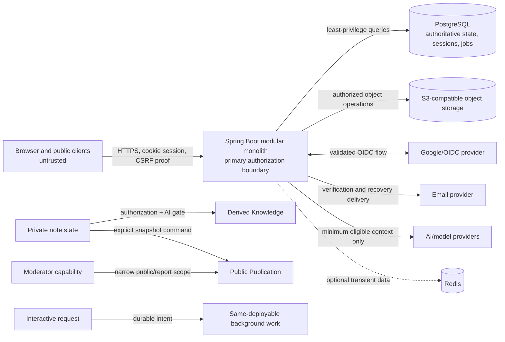
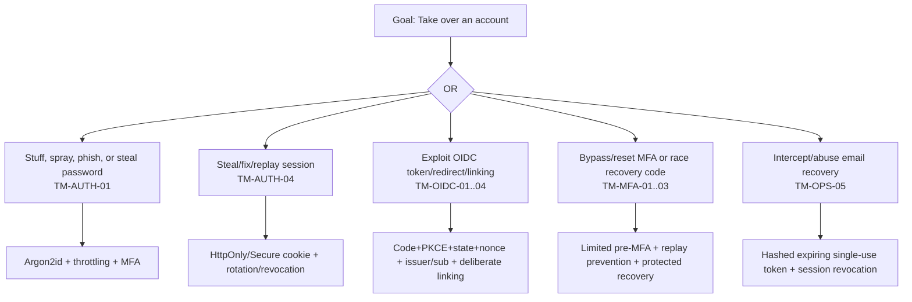
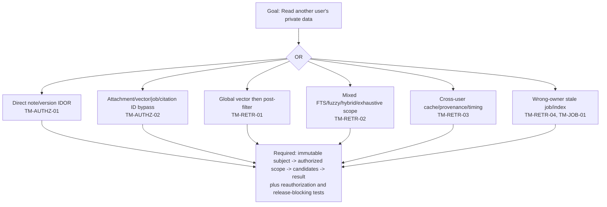
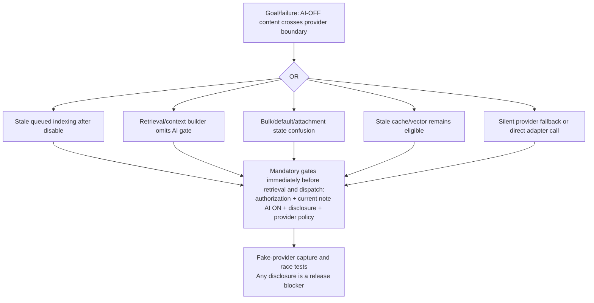
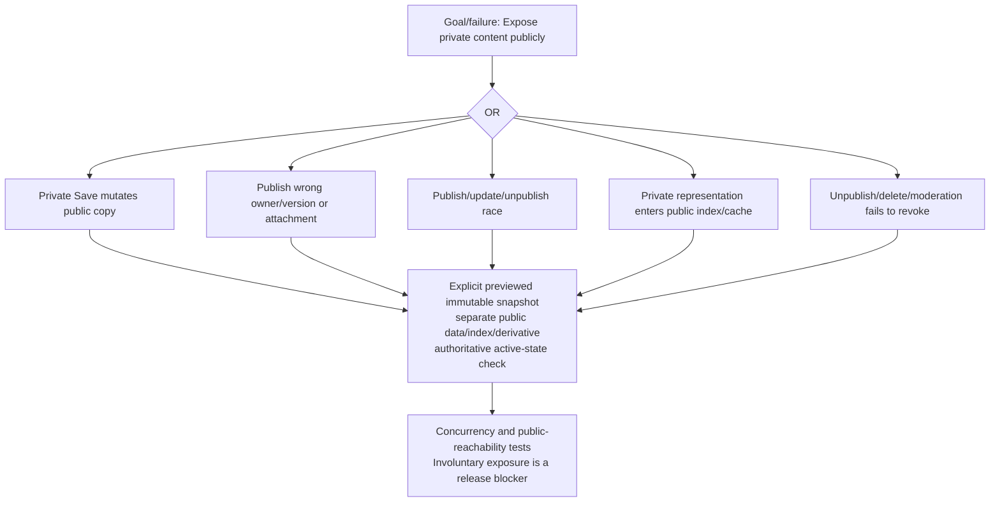
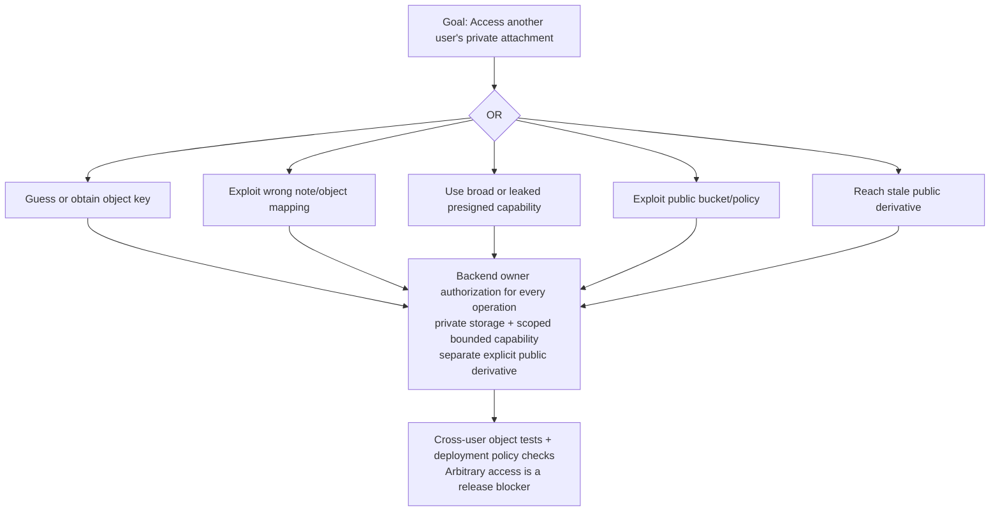

# Notes & Knowledge Workspace

# Threat Model

Status: Approved Baseline  
Date: 2026-09-11
Baseline approval date: 2026-09-11

## 1. Purpose, authority, and boundaries

This document identifies and prioritizes concrete threats against the approved Notes & Knowledge Workspace product and architecture. It consumes and does not supersede these Approved Baselines:

1. Product Vision and Target Flagship Requirements.
2. ADR-001 — Architecture Style and Deployables.
3. High-Level Architecture.
4. Technology Stack and Compatibility.
5. Security Architecture.

`PROJECT_CONTEXT_HANDOFF.md` supplies durable project context. This Threat Model analyzes what can go wrong, which approved controls already address it, which downstream implementation and validation work is required, and what residual risk remains. It does not redesign authentication, sessions, CSRF, authorization, OIDC, MFA, publication, retrieval, AI participation, deployment topology, modules, databases, object storage, or provider architecture.

Where a complete mitigation would require changing an Approved Baseline, the register records a future explicit design or superseding-decision need. No such need authorizes a silent baseline change.

## 2. Method and risk scale

The model uses a practical hybrid method based on the OWASP Threat Modeling four-question framing:

1. What are we working on? Identify assets, actors, entry points, data flows, assumptions, and trust boundaries.
2. What can go wrong? Use STRIDE as a coverage aid, then add product-specific abuse, privacy, concurrency, and AI/RAG threats.
3. What will we do? Trace each threat to approved controls and create downstream design, implementation, operations, and test requirements.
4. Did we do enough? Define validation evidence, residual risk, review triggers, and release blockers.

STRIDE labels are abbreviated as **S**poofing, **T**ampering, **R**epudiation, **I**nformation disclosure, **D**enial of service, and **E**levation of privilege. They are coverage labels, not a rigid taxonomy.

### 2.1 Qualitative assessment

**Likelihood** describes realistic exploitability and exposure before the required downstream controls are proven:

- **Low:** substantial uncommon preconditions or privileged access are required.
- **Medium:** plausible conditions exist, but exploitation requires meaningful access, timing, or control failure.
- **High:** common internet capabilities, ordinary authenticated access, or likely implementation mistakes are sufficient.

**Impact** describes the credible worst meaningful outcome:

- **Low:** limited nuisance or reversible low-sensitivity effect.
- **Medium:** bounded integrity, privacy, cost, or availability harm.
- **High:** material account, private-data, public-integrity, operational, or availability harm.
- **Critical:** account takeover; authentication/MFA/authorization bypass; cross-user private-data exposure; arbitrary private attachment exposure; AI-disabled content disclosed to a provider; private content made public without explicit publication; destructive unauthorized actions; systemic secret compromise; or protected moderator privilege escalation.

**Risk** is a conservative synthesis, not arithmetic. Critical impact remains Critical when the path is credible even at Medium likelihood. High likelihood with High impact is High or Critical depending on blast radius. Low likelihood does not waive mandatory controls. CVSS and fabricated decimal scores are intentionally not used.

### 2.2 Disposition vocabulary

- **Mitigated by approved design:** architecture contains the necessary control, subject to correct implementation.
- **Requires downstream implementation:** a fixed control must be implemented in a later design.
- **Requires validation:** architecture is adequate only after specified negative, integration, concurrency, or deployment evidence exists.
- **Accepted residual risk:** remaining risk is explicit and proportionate after controls.
- **Deferred because feature not selected:** relevant only if an unapproved feature is later added.
- **Requires future decision:** baseline change or new scope would require explicit approval.

No Critical confidentiality, authentication, authorization, private/public, or AI-boundary risk is casually accepted.

## 3. Release-blocker rule

Any proven cross-user isolation failure, authentication bypass, authorization bypass, MFA bypass, private/public isolation failure, AI-state boundary failure, or authorization-after-retrieval leak is a **release blocker**. This remains true when identifiers are difficult to guess, a UI hides the action, only metadata leaks, probability appears low, several requests are required, or most tests pass.

Release requires zero observed violations of these invariants in the supported test scope. This is not a percentage score.

## 4. Protected assets

| Asset class | Assets | Security concern |
|---|---|---|
| Identity and security | Immutable internal user identity, password verifiers, email-verification state, reset artifacts, OIDC links, TOTP secrets, recovery codes, sessions, recent-auth state, audit evidence | Account takeover, impersonation, privilege escalation, repudiation |
| Private user data | Note title/body, versions/checkpoints, tags, private attachments and metadata, saved links, private profile data | Confidentiality, integrity, availability, ownership |
| Derived knowledge | Chunks, embeddings, vectors, transcripts/extractions, AI metadata, caches, provenance/citations, durable-job state | Inherited authorization, stale eligibility, cross-context leakage |
| Public data | Approved publication snapshots and derivatives, public profile projections, likes, views, reports, moderation state | Deliberate exposure, integrity, abuse, private/public separation |
| Operational | Database/object/AI/OIDC/email credentials, cryptographic root keys, deployment secrets, logs, backups | Systemic compromise, recovery, least privilege, supply chain |

## 5. Actors and adversaries

- An unauthenticated internet attacker probing identity, public, recovery, upload, and operational surfaces.
- A malicious authenticated user attempting horizontal or vertical escalation, resource enumeration, retrieval leakage, or exhaustion.
- An attacker controlling another website and attempting CSRF, login confusion, framing, redirect, or origin abuse.
- An attacker holding a stolen/reused password, session cookie, email account, or Google/OIDC account.
- An abusive legitimate user consuming Argon2, search, vector, AI, upload, media, database, or job capacity.
- A malicious public-content or uploaded-content author targeting visitors, parsers, moderators, or AI pipelines.
- A compromised or misconfigured OIDC, email, object-storage, AI/model, dependency, or CI provider.
- A moderator abusing legitimate scope or an attacker controlling a moderator session.
- An operator/developer with excessive infrastructure access or unsafe diagnostics.
- An attacker with partial database, backup, cache, log, object-storage, or key-material disclosure.
- An attacker exploiting XSS, SQL injection, file parser, dependency, configuration, or application logic weaknesses.

Root or nation-state capability is not assumed unless a specific row states the necessary privileged precondition.

## 6. Trust boundaries and attack surface

Supporting systems are dependencies, not application microservices. Important entry points, without freezing URLs, are registration; password and OIDC login/callback; MFA; verification and recovery; email change; session management; note lifecycle and versions; attachments; search and Ask My Knowledge; note AI-state controls; publish/update/unpublish; public browse/search/likes/views/reports; moderation; durable work; provider dispatch; object access; and later operational interfaces.

The approved modular monolith reduces network boundaries but not logical trust requirements. Shared process and database access make confused-deputy, cross-module shortcut, stale-context, and shared-failure-domain threats particularly important.

## 7. Highest-priority threats

The highest-priority scenarios are:

1. **TM-AUTHZ-01 / TM-RETR-01:** a user reads another user's private note directly or through vector/retrieval leakage.
2. **TM-AUTH-01 / TM-AUTH-04:** account takeover through stolen credentials or a stolen/fixated/replayed session.
3. **TM-MFA-03 / TM-OIDC-04:** MFA is bypassed through recovery, social login, or partial-session elevation.
4. **TM-OIDC-03:** email-based identity collision silently links an attacker's provider identity to a victim account.
5. **TM-AI-01:** an AI-disabled note or attachment reaches embeddings, model context, or an external provider.
6. **TM-PUB-01 / TM-PUB-02:** private or revoked content becomes or remains publicly available without the required explicit snapshot action.
7. **TM-FILE-03:** object-storage mapping, policy, or capability errors expose private attachments.
8. **TM-WEB-01:** stored Markdown, public content, model output, or media causes XSS and session/account compromise.
9. **TM-JOB-01:** stale or duplicate work violates current AI, publication, deletion, or ownership state.
10. **TM-MOD-01:** moderator privilege expands into private-note access or unauthorized role assignment.
11. **TM-OPS-01 / TM-OPS-04:** systemic secret exposure or security misconfiguration defeats otherwise correct application controls.
12. **TM-DOS-02 / TM-DOS-03:** expensive retrieval, AI, media, or same-process work exhausts the single deployable.

The first eleven include Critical-impact paths. They are not displaced by lower-impact cosmetic, spam, or quality concerns.

## 8. Central threat register

Every row is a required forward trace. “Controls” means already-approved architecture, not proof of implementation. “Downstream” names the later owner and required work. “Validation” is the minimum evidence direction, not a test implementation.

### 8.1 Authentication and sessions

| ID / title / category | Assets, actor, path or preconditions | Likelihood / impact / risk | Existing approved controls | Additional mitigation and downstream owner | Validation requirement | Residual risk / disposition |
|---|---|---|---|---|---|---|
| **TM-AUTH-01 — Credential stuffing, brute force, or spraying** (S, D, E) | Account and sessions; internet attacker uses reused credentials, rotating sources, or broad low-rate attempts. | H / C / C | Argon2id, MFA, generic responses, multidimensional throttling, security telemetry. | Threat-informed limits, breached-password policy, anomaly response, provider budgets; Identity/Backend/Deployment/Operations. | Distributed attack, account-targeted DoS, and success-after-throttle tests; Argon2 load test. | Phishing/reuse persists; Requires implementation and validation. |
| **TM-AUTH-02 — Enumeration and recovery abuse** (I, D) | Account/email state; attacker compares registration, verification, login, reset, resend timing/content or floods mail. | H / H / H | Generic external behavior, protected single-use artifacts, throttling, no password email. | Normalize response/timing and bound resend/recovery; Identity/API/Email/Testing. | Differential response/timing and mail-abuse tests. | Side channels may remain; Requires validation. |
| **TM-AUTH-03 — Password-verifier disclosure and offline cracking** (I, E) | Password verifiers; attacker obtains database/backup copy and performs offline guessing. | M / C / C | Argon2id, unique salt, versionable encoder, benchmarked parameters, least-privilege DB/backups. | Select compatible encoder/dependency and tune on intended hardware; Backend/Deployment/Security Testing. | Hash-format, parameter, upgrade-on-auth, and offline-cost review. | Weak/reused passwords remain crackable; Requires implementation. |
| **TM-AUTH-04 — Session fixation, theft, replay, or stale privilege** (S, E, I) | Session and private data; stolen cookie/XSS/fixation or failed rotation/revocation after MFA or account change. | H / C / C | Opaque HttpOnly Secure cookie, PostgreSQL session, rotation, idle/absolute lifetime, logout and scoped/all revocation, recent auth. | Correct proxy/cookie settings, atomic privilege elevation, revocation propagation and anomaly response; Identity/Backend/Deployment. | Fixation, stolen-cookie replay, concurrent revocation, logout, and security-change tests. | A live stolen cookie remains powerful until detected/expired; Requires validation. |

### 8.2 OIDC and account linking

| ID / title / category | Assets, actor, path or preconditions | Likelihood / impact / risk | Existing approved controls | Additional mitigation and downstream owner | Validation requirement | Residual risk / disposition |
|---|---|---|---|---|---|---|
| **TM-OIDC-01 — Forged or misvalidated identity token** (S, E) | Internal identity; attacker supplies wrong signature, algorithm, issuer, audience, authorized party, time claim, nonce, or provider ID. | M / C / C | Provider discovery/JWK validation, exact issuer/audience/time/nonce checks, issuer+subject identity. | Pin approved provider metadata and fail closed on ambiguity/key errors; Identity/Backend. | Negative claim/signature/key-rotation tests with synthetic tokens. | Provider compromise remains; Requires validation. |
| **TM-OIDC-02 — Code interception, redirect abuse, login CSRF, or mix-up** (S, I, E) | Login transaction; attacker manipulates redirect, state, nonce, PKCE, issuer, browser history, or open redirect. | M / C / C | Authorization Code, PKCE S256, state, nonce, exact redirects, issuer defense, server-side exchange. | Single-use transaction binding, safe return targets, token/referrer/log exclusion; Identity/API/Deployment. | Interception, replay, missing/mismatched state/nonce/PKCE/issuer, and redirect tests. | Browser/provider compromise persists; Requires implementation and validation. |
| **TM-OIDC-03 — Email collision or automatic-link takeover** (S, E) | Existing account; attacker presents provider identity with matching/mutable email and gains victim linkage. | M / C / C | No email-only linking; issuer+subject key; verified-email semantics; authenticated/recent-auth linking; collision-safe UX. | Transactional uniqueness, deliberate link/unlink, retain usable login method, notifications; Domain/Identity/API. | Same-email collision, conflicting provider, relink, unlink-last-method, and race tests. | Compromised existing proof path can still link; Release-blocking validation. |
| **TM-OIDC-04 — Provider-token leakage or OIDC bypass of application MFA** (S, I, E) | Provider token, pre-MFA state, session; token reaches React/logs or OIDC path creates full session before TOTP. | M / C / C | Provider tokens server-side and login-only; application MFA after password or OIDC; limited pre-MFA authority. | Minimize token retention, isolate partial session authorities, rotate on elevation; Identity/Backend/Logging. | OIDC-with-MFA end-to-end negatives; token redaction and partial-session route matrix. | Provider account takeover may satisfy primary factor, not MFA; Requires validation. |

### 8.3 MFA and recovery

| ID / title / category | Assets, actor, path or preconditions | Likelihood / impact / risk | Existing approved controls | Additional mitigation and downstream owner | Validation requirement | Residual risk / disposition |
|---|---|---|---|---|---|---|
| **TM-MFA-01 — TOTP guessing, replay, or clock-skew abuse** (S, E, D) | MFA challenge; attacker guesses or reuses an accepted code or exploits broad time windows. | M / C / C | Throttling, RFC 6238 direction, bounded skew, no same-code reuse, limited pre-MFA state. | Atomic replay record and monitored time source; Identity/Data/Operations. | Parallel replay, boundary-window, skew, throttle, and restart tests. | TOTP is phishable and shared-secret based; Requires validation. |
| **TM-MFA-02 — TOTP seed or encryption-root compromise** (I, E) | TOTP seeds and root key; database disclosure, key-store compromise, bad rotation, or key in same DB. | L / C / H | Authenticated encryption, external root key, key ID/version, least-privilege decrypt, fail closed. | Define AEAD framing, KMS/secret store, rotation/recovery and access audit; Security LLD/Deployment. | DB-only compromise, tamper, wrong/missing key, rotation, backup/restore tests. | Combined DB+key compromise defeats factor; Requires implementation. |
| **TM-MFA-03 — Enrollment, reset, or recovery-code takeover** (S, T, E) | MFA state/recovery codes; intercepted QR, enable without proof, code double-use, email/support social engineering, or email-only disable. | M / C / C | Recent auth, prove TOTP before activation, hashed one-time codes, atomic regeneration, MFA not removed by email alone, notifications/revocation. | Define proof-of-control and any support policy; Identity/Domain/API/Operations. | Concurrent code use, incomplete enrollment, reset abuse, notification and session consequence tests. | Lost-factor support remains social-engineering risk; Requires future policy and validation. |

### 8.4 Authorization, IDOR/BOLA, and confused deputy

| ID / title / category | Assets, actor, path or preconditions | Likelihood / impact / risk | Existing approved controls | Additional mitigation and downstream owner | Validation requirement | Residual risk / disposition |
|---|---|---|---|---|---|---|
| **TM-AUTHZ-01 — Horizontal private-resource access** (I, T, E) | Notes, content, versions, tags; authenticated attacker substitutes/enumerates IDs or uses alternate actions. | H / C / C | Immutable user ID, deny-by-default, owner predicate in candidate/resource query, server-side checks. | Central policy and owner-module interfaces on every read/write/lifecycle path; Domain/API/Backend. | User A/B matrix for read/update/delete/version/tag and guessed IDs. | UUID opacity only slows discovery; Release blocker. |
| **TM-AUTHZ-02 — Indirect attachment, job, vector, or citation reference bypass** (I, E) | Attachments, derived data, jobs, provenance; attacker follows a leaked identifier or object key around note authorization. | H / C / C | Identifiers not authority; derived data inherits source; every resolution reauthorized. | Source/owner identity carried and rechecked through adapters and navigation; Domain/Data/Backend. | Direct ID/key, citation, vector, job-status, derivative and download cross-user tests. | New indirect paths can omit checks; Release blocker. |
| **TM-AUTHZ-03 — Vertical moderator/admin privilege escalation** (E, T, I) | Roles, public/moderation data, private notes; forged role, excessive grant, compromised moderator, or generic admin behavior. | M / C / C | Narrow public/report/moderation scope; no private-note browsing; recent auth/MFA where appropriate; audit. | Domain Model must define capabilities and assignment; API must authorize each operation and bound mass actions. | Negative moderator-private tests, role-assignment tests, CSRF, reauth, audit and mass-action tests. | Legitimate moderator can still abuse allowed takedowns; Requires validation/operations. |
| **TM-AUTHZ-04 — Cross-module or alternate-path confused deputy** (E, I, T) | Any private/public resource; one module uses another repository, wrong principal, stale projection, or unguarded endpoint/job. | M / C / C | No cross-module repositories; explicit application interfaces; current authorization; Spring Modulith boundaries. | Define caller/callee authority contracts and invariant tests; Domain/Backend/Testing. | Architecture tests plus route/job/provider path authorization matrix. | Shared process raises impact of coding error; Release blocker when exposure occurs. |

### 8.5 Retrieval, cache, and provenance isolation

| ID / title / category | Assets, actor, path or preconditions | Likelihood / impact / risk | Existing approved controls | Additional mitigation and downstream owner | Validation requirement | Residual risk / disposition |
|---|---|---|---|---|---|---|
| **TM-RETR-01 — Global vector retrieval then post-filtering** (I, E) | Private embeddings/content; malicious user or ordinary query reaches mixed-user nearest neighbors before authorization. | H / C / C | Authorization before candidate generation; owner-scoped vectors; private/public separation. | Prove SQL/vector query shape and index strategy preserve scope; Search/AI/Retrieval Design and Data LLD. | Multi-user vector corpus with adversarial near-duplicates; inspect candidates, not only final answer. | Vector metadata/timing may leak even if text filtered; Release blocker. |
| **TM-RETR-02 — Mixed lexical, fuzzy, hybrid, aggregate, or exhaustive candidates** (I) | Notes and deterministic items; missing owner predicate or fusion merges authorized and unauthorized lists. | H / C / C | Authorized corpus built first; every strategy and modality constrained; deterministic complete scan remains owner-scoped. | Shared scope contract and per-strategy query review; Search/Data/Backend. | FTS, `pg_trgm`, hybrid, focused, aggregation, exhaustive and media isolation tests. | One alternate planner can regress; Release blocker. |
| **TM-RETR-03 — Cache, count, timing, or provenance side channel** (I) | Resource existence, snippets, citations; cross-user cache key, authorization-free hit, error/count/timing differences. | M / C / C | Scope-rich cache keys; current auth on hit; citations reauthorized; enumeration-safe errors. | Define cache/provenance identity and timing/error policy; Search/API/Backend. | Cross-user cache warming, citation resolution, counts, snippets and timing comparison. | Aggregate timing cannot be made perfectly indistinguishable; Requires validation. |
| **TM-RETR-04 — Stale or misowned derived representation** (T, I) | Vectors/chunks/public index; background job writes wrong owner, old ownership/deletion/publication survives, or public search reaches private index. | M / C / C | Source/owner/version provenance, current-state revalidation, logical ineligibility, separate indexes. | Transaction/generation strategy and rebuild/reconciliation; Data/Knowledge/Jobs. | Owner-write fault injection, delete/unpublish/AI-disable races, index rebuild tests. | Physical stale bytes may remain but must be unreachable; Release blocker if retrievable. |

### 8.6 AI participation, provider, prompt, and output threats

| ID / title / category | Assets, actor, path or preconditions | Likelihood / impact / risk | Existing approved controls | Additional mitigation and downstream owner | Validation requirement | Residual risk / disposition |
|---|---|---|---|---|---|---|
| **TM-AI-01 — AI-disabled content reaches AI processing/provider** (I, T) | Private note/attachment; stale state, missing gate, wrong cache, direct provider path, or job dispatch after disable. | M / C / C | Independent per-note state; authorization+AI+disclosure gates before retrieval and dispatch; immediate logical ineligibility; attachment inheritance. | One authoritative eligibility contract, generation/version checks, provider-boundary guard; Knowledge/Notes/Backend. | Instrumented fake provider must prove zero disabled text/media across every AI path and races. | Provider cannot retract already sent data; release blocker. |
| **TM-AI-02 — Default, bulk, or attachment-state confusion** (T, I) | AI state and derived data; account default mutates existing notes, partial bulk failure, attachment diverges, or stale cache persists. | M / H / H | Future-note initializer only; per-note persistent state; explicit bulk actions; attachment follows note; truthful jobs/status. | Transactional command semantics and resumable reconciliation; Domain/Data/Knowledge. | Mixed-state default changes, partial bulk failure/retry, attachment inheritance and cache invalidation tests. | Large bulk operations may take time; Requires validation. |
| **TM-AI-03 — Excessive or cross-user provider context** (I) | Notes, media, secrets; retrieval/context builder includes unrelated notes, internal metadata, credentials, or wrong-user evidence. | M / C / C | Authorized bounded evidence; minimum necessary content; no session/secrets; provenance. | Context contract, content minimization, request inspection/redaction; Search/Knowledge/Provider Adapter. | Synthetic multi-user provider-capture tests for every modality and fallback route. | Eligible notes may contain user-stored secrets by intent; requires clear disclosure. |
| **TM-AI-04 — Provider/tier retention, fallback, logging, or error disclosure** (I, R) | Private content and provider credentials; wrong tier/region, silent provider switch, raw payload logging, or error echoes request. | M / C / C | Disclosed provider policy; no silent fallback; minimal context; payload/log exclusion; sanitized errors. | Freeze deploy-time provider policy, data controls, retention and outage behavior; Deployment/Privacy/Knowledge. | Configuration and contract tests; provider-outage/fallback negatives; log/error inspection. | External processing always carries provider risk; Requires explicit deployment decision. |
| **TM-AI-05 — Prompt injection or poisoned retrieved content** (T, I, E) | Model behavior and authorized data; note/PDF/image/transcript/public content tells model to override policy or reveal other data. | H / H / H | Retrieved content is data; system authorization/AI/provider/tool rules outside model; no autonomous general tool use. | Delimit evidence, minimize privileges, validate provenance/output, adversarial corpus; Search/AI Design/Testing. | Direct/indirect multimodal injection suite, including hidden text and public-content poison. | Model behavior cannot be perfectly controlled; accepted only within non-authoritative output boundary. |
| **TM-AI-06 — Unsafe or misleading model output gains authority** (T, I, E) | Notes/publication/security state; fabricated citation, unsafe HTML, executable instruction, destructive suggestion, or false state claim is trusted. | H / H / H | Output untrusted; no automatic code/tool/note/publish/security actions; source reauthorization; safe rendering; confirmation. | Typed output contracts, provenance validation, visible uncertainty and action confirmation; AI/API/Frontend. | Hallucinated citation, cross-user metadata, XSS, and attempted action tests. | Ordinary factual hallucination remains quality risk unless it crosses a boundary. |

### 8.7 Attachments and object storage

| ID / title / category | Assets, actor, path or preconditions | Likelihood / impact / risk | Existing approved controls | Additional mitigation and downstream owner | Validation requirement | Residual risk / disposition |
|---|---|---|---|---|---|---|
| **TM-FILE-01 — Spoofed, polyglot, active, or parser-exploit file** (T, I, E) | Browser, parser, visitor; malicious image/audio/video/PDF uses extension/MIME mismatch, malformed container, metadata, SVG/script, or active PDF. | H / C / C | Bounded modalities, content/signature validation, quarantine, raw active content not executed, safe headers/derivatives, patched parsers. | Exact allowlist, parser sandbox/isolation posture and scanning workflow; Attachment/Deployment LLD. | MIME/extension/polyglot/malformed/active-content corpus and parser fault tests. | Scanning cannot prove benign; Requires implementation and validation. |
| **TM-FILE-02 — Upload/media resource exhaustion** (D) | Storage, CPU, memory, parser and executor; decompression bomb, oversized duration/pages, many files, expensive metadata or transcoding. | H / H / H | Size/count/duration/page/quota bounds, quarantine, timeouts, bounded executor, backpressure. | Per-stage budgets and cancellation; Attachment/Backend/Deployment. | Bomb, slow parser, quota, concurrent upload and cleanup load tests. | Novel pathological formats remain; Requires validation. |
| **TM-FILE-03 — Private object access or capability bypass** (I, E) | Private attachments; guessed key, wrong user mapping, public bucket, broad/leaked presigned capability, replacement race. | M / C / C | Backend authorizes every access; private storage; keys not authority; scoped short-lived capabilities if chosen; generated IDs. | Bucket/IAM policy, object mapping and transfer topology; Attachment/Data/Deployment. | Cross-user object/download/replace tests and public-access deployment checks. | A leaked live scoped capability works until expiry; Release blocker for arbitrary access. |
| **TM-FILE-04 — Unsafe or stale public derivative** (I, T) | Public visitors/private media; wrong attachment selected, unsafe original exposed, or derivative/cache remains after unpublish/delete. | M / C / C | Explicit attachment publication, separate approved derivative, safe processing, immediate logical unpublish. | Provenance binding and revocation/cache cleanup contract; Publishing/Attachment/Deployment. | Publish-preview selection, replace/delete/unpublish race, public object enumeration and XSS tests. | CDN/object deletion may lag; must remain unreachable. Release blocker if accessible. |

### 8.8 Browser, Markdown, CSRF, origin, and transport

| ID / title / category | Assets, actor, path or preconditions | Likelihood / impact / risk | Existing approved controls | Additional mitigation and downstream owner | Validation requirement | Residual risk / disposition |
|---|---|---|---|---|---|---|
| **TM-WEB-01 — Stored/reflected/DOM XSS** (T, I, E) | Sessions, notes, visitors; Markdown, URL, custom component, plugin, SVG/media, error, report, or model output executes script. | H / C / C | Raw HTML off; structured rendering; safe URL transforms; reviewed plugins/components; conditional final sanitization; CSP defense in depth; HttpOnly session. | Exact renderer/component/CSP policy; Frontend/Publication/Attachment LLD. | Stored/reflected/DOM payload suite for private, public, reports, errors, media and AI output. | Browser/parser bypasses remain possible; Release blocker if session/data crosses boundaries. |
| **TM-WEB-02 — CSRF and login/state-change confusion** (S, T, E) | Account, notes, AI/public/security state; attacker site causes login/logout/recovery/MFA/note/AI/publish/upload/moderation action without valid proof. | H / C / C | Mandatory CSRF on unsafe cookie-authenticated operations; approved repository abstraction; SameSite direction; state/nonce for OIDC. | Select repository/SPA transport and review all exemptions; API/Frontend/Backend LLD. | Missing/stale/leaked token, login CSRF, origin and every unsafe transition tests. | XSS can perform same-origin actions; Requires validation. |
| **TM-WEB-03 — CORS, host/proxy, redirect, framing, header, or cache misconfiguration** (S, I, E) | Session/token/private pages; wildcard/reflected origin, dev origin, untrusted forwarded header, unsafe redirect, framing, referrer/token leak, weak CSP, private cache. | M / C / C | Explicit CORS allowlist, trusted proxies, TLS, Secure cookies, CSP/frame-ancestors, HSTS direction, referrer/nosniff/cache controls. | Environment-specific edge/header policy; Deployment/API/Frontend. | Production topology tests for origins, preflight, host/forwarded headers, redirects, framing, referrers and caching. | Proxy/CDN behavior can drift; Requires continuous validation. |

### 8.9 Publication and public-surface abuse

| ID / title / category | Assets, actor, path or preconditions | Likelihood / impact / risk | Existing approved controls | Additional mitigation and downstream owner | Validation requirement | Residual risk / disposition |
|---|---|---|---|---|---|---|
| **TM-PUB-01 — Private content published without correct explicit snapshot** (I, T) | Note/version/media; race or confused deputy publishes draft, wrong owner/version, unselected attachment, or private Save updates public copy. | M / C / C | Explicit previewed publish/update; immutable checkpoint provenance; separate snapshot/derivatives; private Save never updates public. | Transaction/concurrency and exact-preview contract; Publishing/Notes/Profile/Attachment. | Save-vs-publish, wrong-version/owner, selected-media and preview parity tests. | User can deliberately publish sensitive content; product must make scope clear. Release blocker for involuntary exposure. |
| **TM-PUB-02 — Revoked public content remains discoverable** (I, T) | Snapshot, index, cache, derivative; unpublish/moderation/account deletion races with indexing/cache refresh or cleanup. | M / C / C | Authoritative state denies immediately; public-only active index; cleanup asynchronous but subordinate. | Generation/tombstone/revalidation and cache invalidation design; Publishing/Knowledge/Discovery/Deployment. | Unpublish/delete/moderation versus query/index/cache/object concurrency tests. | Physical remnants may follow retention; public reachability is not accepted. |
| **TM-PUB-03 — Public metadata, engagement, scraping, and report abuse** (I, T, D) | Profiles/publications/likes/views/reports; scrape private fields, inflate trends, spam reports, enumerate, exhaust search, or identify viewers. | H / H / H | Public projection minimization, durable unique likes, approximate privacy-conscious views, bounded reports, small public surface, throttling. | Projection allowlist, anti-abuse dimensions, transparent ranking and data minimization; Discovery/Profile/Moderation. | DTO leakage, scraping/load, duplicate like, view inflation, report spam and trending manipulation tests. | Public data is inherently scrapeable; accept only intentionally public fields. |

### 8.10 Moderation and privileged operations

| ID / title / category | Assets, actor, path or preconditions | Likelihood / impact / risk | Existing approved controls | Additional mitigation and downstream owner | Validation requirement | Residual risk / disposition |
|---|---|---|---|---|---|---|
| **TM-MOD-01 — Role escalation or private-note access by moderator** (E, I) | Roles/private data; forged assignment, broad repository/API, public-to-private pivot, or “admin reads all” shortcut. | M / C / C | Narrow public/report/moderation scope, deny-by-default, immutable actor, owner-module interfaces, audit. | Domain Model defines capabilities/assignment; API enforces object/function scope and reauth/MFA where appropriate. | Role-assignment, every private route/retrieval negative, confused-deputy and enumeration tests. | Operator infrastructure access is separate and must be least privilege. Release blocker. |
| **TM-MOD-02 — Compromised/abusive moderator, report payload, or mass takedown** (T, R, D) | Public content and audit; stolen moderator session, malicious report XSS/SSRF, forged action, audit tamper, mass removal. | M / H / H | Session controls, CSRF, safe rendering, no automatic URL fetch, auditable actions, bounded moderation. | Sensitive-action reauth, mass-action bounds, append-oriented audit and incident recovery; Domain/API/Operations. | Compromised-session, report payload, CSRF, rate, mass-action and audit-integrity tests. | Legitimate abuse cannot be eliminated; requires monitoring and response. |

### 8.11 Background work and concurrency

| ID / title / category | Assets, actor, path or preconditions | Likelihood / impact / risk | Existing approved controls | Additional mitigation and downstream owner | Validation requirement | Residual risk / disposition |
|---|---|---|---|---|---|---|
| **TM-JOB-01 — Stale, replayed, duplicate, or wrong-context job** (T, I, E) | Notes, AI/public/attachment state; work uses old owner/version, runs after disable/unpublish/delete, or repeats side effect. | H / C / C | Minimal references, current-state revalidation before effects, idempotency/generation, durable PostgreSQL state, stale->obsolete. | Claim/lease/state machine and transaction boundaries; Backend/Data/Knowledge LLD. | Duplicate/replay/crash and every state-change race with provider/index/object side effects. | External side effects may be hard to retract; Release blocker when current-state boundary is violated. |
| **TM-JOB-02 — Poisoned payload or private diagnostic/dead-letter data** (T, I) | Worker and logs; user-controlled job fields alter action or private bodies/prompts leak into retries/errors. | M / H / H | Jobs are untrusted; minimal identifier payload; handlers re-resolve source; sensitive logging exclusions. | Typed payload validation, safe error state and access-controlled diagnostics; Backend/Observability. | Payload mutation, malformed identifier, redaction and terminal-state inspection tests. | Internal operator visibility remains sensitive; Requires validation. |
| **TM-JOB-03 — Retry storm and same-process contention** (D) | API, DB, provider, executor; infinite retry, poison item, provider outage, or high media load starves interactive work. | H / H / H | Bounded executor, bounded retries, backoff, terminal state, provider failure isolation, observable queue. | Fair scheduling, concurrency budgets, cancellation/backpressure; Backend/Deployment/Operations. | Provider outage, poison job, queue flood and interactive-latency load tests. | One process remains a shared failure domain; Accepted architectural tradeoff after controls. |

### 8.12 Database and cache

| ID / title / category | Assets, actor, path or preconditions | Likelihood / impact / risk | Existing approved controls | Additional mitigation and downstream owner | Validation requirement | Residual risk / disposition |
|---|---|---|---|---|---|---|
| **TM-DATA-01 — SQL/query injection or missing owner predicate** (T, I, E) | All PostgreSQL data; attacker controls search/filter/content input or developer builds unsafe query/omits scope. | M / C / C | Parameterized ORM/query APIs, no string-built SQL, authorization-before-load/candidates, least privilege. | Query construction standards and review for FTS/trigram/vector/dynamic filters; Data/Backend. | Injection corpus plus query-plan/SQL assertion and multi-user negative tests. | DB/parser vulnerabilities remain supply-chain risk; Release blocker for isolation breach. |
| **TM-DATA-02 — Overprivileged runtime identity or cross-module repository access** (E, I, T) | Database and module state; app uses superuser/migration role or module bypasses owner interface. | M / C / C | Non-superuser least-privilege runtime identity, separable migration identity, module ownership/tests, no repository shortcuts. | Role grants and migration/runtime separation; Data/Deployment/Backend. | Privilege inspection, forbidden dependency tests and attempted cross-module access. | One physical DB expands blast radius of credential compromise; Requires validation. |
| **TM-DATA-03 — Backup/restore or partial DB disclosure** (I) | Old notes, deleted data, password/token verifiers, TOTP ciphertext; stolen backup or restore exposes stale data. | M / C / C | Backup treated as sensitive, Argon2, one-way token/recovery verifiers, TOTP external key, logical deletion gates. | Encrypt/access/audit backups; retention/legal deletion and secure restore process; Deployment/Operations/Policy. | Restore into isolated environment; verify access, stale-token invalidity, logical deletions and key separation. | Backups may retain data per future policy; Requires explicit retention decision. |
| **TM-DATA-04 — Redis/cache poisoning, cross-user hit, stale grant, or fail-open outage** (T, I, D) | Cached results/rate state; missing identity dimensions, user-controlled key, stale AI/public data, Redis becomes authority, outage disables throttling. | M / C / C | Redis optional/transient; no sessions/jobs/source truth; scope-rich keys; auth on hit; safe fallback/fail closed for sensitive controls. | Cache key/invalidation and topology-correct rate design; Backend/Deployment. | Cross-user warm/hit, poison, disable/unpublish, restart/outage and multi-instance tests. | Low-risk best-effort counters may degrade only by explicit policy. |

### 8.13 Operations, secrets, logging, supply chain, and email

| ID / title / category | Assets, actor, path or preconditions | Likelihood / impact / risk | Existing approved controls | Additional mitigation and downstream owner | Validation requirement | Residual risk / disposition |
|---|---|---|---|---|---|---|
| **TM-OPS-01 — Secret/key exposure or unrotatable compromise** (I, E) | DB/OIDC/AI/email/object credentials, TOTP root key; committed secret, frontend bundle, same value across environments, excess scope, logs/health/backup/CI leak. | M / C / C | External secret store direction, environment/purpose separation, least privilege, rotation/versioning, no frontend/repository/log secrets. | Select secret/KMS mechanism, access audit, rotation and incident runbooks; Deployment/Operations. | Secret scanning, built-asset inspection, rotation/revocation, missing-key and least-privilege tests. | Workload or secret-store compromise remains systemic; Requires implementation. |
| **TM-OPS-02 — Logging/observability disclosure, injection, or audit tampering** (I, T, R) | Notes, prompts, tokens, signed URLs, topology, audit; unsafe request/body tracing, control characters, broad health/metrics, writable audit. | H / C / C | Metadata-only structured logs, explicit exclusions/redaction, restricted observability, append-oriented audit, safe correlation IDs. | Field allowlist, sink access/retention/integrity and alerting; Observability/Deployment. | Synthetic secrets across errors/logs/traces/metrics/health; log-injection and audit-integrity tests. | Authorized operators can see metadata; Requires monitoring. |
| **TM-OPS-03 — Compromised dependency, image, SDK, lockfile, or CI action** (T, E, I) | Application/build/provider boundary; malicious transitive package, dependency confusion, vulnerable parser, prerelease, compromised action/image. | M / C / C | Approved versions/BOMs/lockfile, official artifacts, no prerelease, controlled updates, future vulnerability/license/secret/image review. | Provenance/checksum, dependency/CI permission and patch process; CI/CD/Deployment. | Reproducible build, dependency graph, known-vulnerability, provenance and malicious-update response tests. | Signed/official upstream can still be compromised; Requires continuous review. |
| **TM-OPS-04 — Security misconfiguration** (T, I, E) | Entire system; CSRF/Secure cookie off, broad CORS, stack traces, public Actuator/bucket, debug secrets, wrong AI tier, `ddl-auto`, default credentials, dev redirect, permissive moderator. | H / C / C | Secure architecture defaults, environment separation, exact tech baseline, restricted health, fail-secure dependency behavior. | Configuration-as-code policy and environment verification gates; Deployment/CI/Operations. | Production-profile negative checks for every listed misconfiguration. | Runtime drift remains; requires continuous deployment validation. |
| **TM-OPS-05 — Email verification/recovery interception, race, reuse, or outage** (S, I, D) | Account/email/token; compromised inbox, leaked/referrer token, double use, old-email change race, malicious redirect, provider outage/spam. | M / C / C | High-entropy expiring single-use hashed verifier, generic response, new-email proof, old/new notice, reset revokes sessions, no password email. | Atomic token consumption, safe link/referrer/redirect and delivery state; Identity/API/Email. | Double-use/race/expiry/supersession, email-change takeover, leak and outage tests. | Compromised email is a strong recovery threat; MFA cannot be silently removed. |

### 8.14 Denial of service and privacy

| ID / title / category | Assets, actor, path or preconditions | Likelihood / impact / risk | Existing approved controls | Additional mitigation and downstream owner | Validation requirement | Residual risk / disposition |
|---|---|---|---|---|---|---|
| **TM-DOS-01 — Authentication-cost and distributed-throttle exhaustion** (D) | CPU, DB, email; attacker forces Argon2, MFA, reset/resend while rotating sources or weaponizes lockout. | H / H / H | Multidimensional rate limits, no permanent lockout, bounded mail, topology-correct fallback, Argon2 benchmark. | Capacity budgets and progressive controls; Identity/Backend/Deployment. | Distributed source/account/global load and dependency-outage tests. | Distributed abuse cannot be eliminated; Requires operations response. |
| **TM-DOS-02 — Search/vector/exhaustive/AI cost exhaustion** (D) | DB, vector index, provider budget; broad queries, typo expansion, repeated corpus scans, semantic aggregation, costly model calls. | H / H / H | Pagination, bounded evidence, quotas, provider budgets, timeouts, cancellation, rate limits. | Query complexity budgets, workload classes, backpressure and cost telemetry; Search/AI/Backend/Deployment. | Worst-case corpus and concurrent user load with cancellation/provider outage. | Exhaustive correctness competes with bounded resources; design must queue/limit honestly. |
| **TM-DOS-03 — Upload/parser/job/connection-pool exhaustion in one process** (D) | API availability; media bombs, queue flood, storage slowness, executor or DB pool starvation. | H / H / H | Bounded files/work, quarantine, same-deployable bounded executor, backpressure, durable queue, timeouts, graceful provider degradation. | Isolate resource pools logically, fair scheduling and overload behavior; Backend/Deployment. | Mixed interactive/background/upload stress, restart and dependency latency tests. | One-process failure domain is approved; extraction only after measured evidence and superseding ADR. |
| **TM-PRIV-01 — AI/privacy expectation or provider-retention mismatch** (I) | Private content; user mistakes AI OFF for encryption/E2EE, provider tier logs/retains content, or disclosure does not match configuration. | M / C / C | AI OFF is processing control, not encryption; first-processing disclosure; provider policy gate; no silent fallback; no E2EE claim. | Exact provider/tier contract, disclosure copy and configuration verification; Privacy/Deployment/Product review. | Disclosure comprehension review and provider-policy/configuration tests. | External eligible processing retains inherent privacy risk; requires explicit informed choice. |
| **TM-PRIV-02 — Secondary privacy leakage through public analytics, logs, or retention** (I) | Viewer identity, profiles, notes, deleted data; raw IP history, excessive public fields, logs as datastore, backups/provider copies persist. | M / H / H | Minimal public projection, approximate privacy-conscious views, no raw IP solely for counts, logging exclusions, deletion gates. | Retention/minimization policy and privacy review; Discovery/Observability/Deployment/Policy. | Public DTO, analytics identifier, log and deletion/backup retention review. | Public data can be copied; retained backups follow future policy. |

### 8.15 SSRF and future remote fetching

| ID / title / category | Assets, actor, path or preconditions | Likelihood / impact / risk | Existing approved controls | Additional mitigation and downstream owner | Validation requirement | Residual risk / disposition |
|---|---|---|---|---|---|---|
| **TM-SSRF-01 — Accidental or future saved-URL fetching** (S, I, E) | Internal network/cloud metadata; a preview/parser/model tool follows user URL or redirects into private addresses. | L now / C / H | Saved URLs are text; retrieval never visits them; no URL-preview subsystem or arbitrary tools. | Keep outbound fetch absent. Any future feature requires explicit scope, SSRF egress/redirect/DNS design and Threat Model update. | Static/integration proof that current extraction performs no network fetch. | Deferred because feature not selected; future architecture/product decision required before adding it. |

**Register count: 55 threats.**

## 9. Attack trees and abuse flows

### 9.1 Account takeover

### 9.2 Cross-user note or retrieval leak

### 9.3 AI-disabled content reaches a provider

### 9.4 Private content reaches public publication

### 9.5 Unauthorized attachment/object access

## 10. Concurrency and race analysis

| Race | Required control class | Required downstream evidence |
|---|---|---|
| AI ON -> OFF while indexing/provider work runs | Authoritative state transition, generation/version check, pre-dispatch revalidation, logical ineligibility before cleanup | Deterministic barrier test proving no post-disable provider dispatch or retrieval |
| Note edit while embedding | Immutable source/version reference, optimistic concurrency, supersession | Old result cannot be labeled current or overwrite newer representation |
| Publish while private note changes | Explicit selected checkpoint and transaction/optimistic concurrency | Public preview and committed snapshot match the chosen version |
| Unpublish/moderation removal while public indexing/cache refresh runs | Authoritative active-state check, tombstone/generation, idempotent invalidation | Public read/search/cache/object stays denied throughout race |
| Attachment delete while parsing/indexing | Current existence/owner/AI/publication check before each effect | No deleted media becomes retrievable, AI-processed, or public |
| Password reset versus active session request | Atomic security-state/session revocation boundary and reauthorization | Old sessions fail after committed reset under concurrent load |
| Recovery code or reset token used twice | Transactional one-time consumption and unique outcome | Exactly one parallel request succeeds |
| Session revocation versus concurrent request | Authoritative session lookup and clear commit semantics | No new protected operation begins with revoked authority after the defined boundary |
| Account deletion versus queued work | Immediate account-state denial plus job revalidation and cleanup generation | No future AI/public/private action becomes available after deletion commits |
| Moderator removal versus public cache refresh | Current moderation/publication state and generation-aware cache write | Refresh cannot resurrect removed content |

Exact transactions, locking, generations, schemas, and retry algorithms remain downstream design decisions.

## 11. Control traceability and downstream security requirements

The approved controls are necessary but require executable evidence. The Threat Model creates these downstream requirements without implementing them:

1. Domain Model and API Design must define narrow moderator role assignment and capabilities, with no unrestricted private-note reader.
2. Every resource and alternate action must map immutable authenticated identity to an owner/public/moderator scope before loading data.
3. Search/AI/Retrieval Design must prove owner/public predicates are inside FTS, trigram, vector, hybrid, aggregate, exhaustive, media, cache, and provenance candidate paths.
4. Provider adapters must expose a synthetic capture mode proving AI-disabled or cross-user content is never dispatched.
5. Data and Backend LLD must define generation/version/idempotency/current-state rules for AI, publication, deletion, attachments, recovery artifacts, sessions, and durable work.
6. Frontend LLD must preserve raw Markdown HTML OFF, conditional post-unsafe-transform sanitization, safe URL handling, CSRF transport, and untrusted AI rendering.
7. Attachment and Deployment design must define bounded format validation, quarantine/scanning posture, parser/resource isolation, private storage policy, and scoped transfers.
8. Deployment/CI must prevent public private-object access, exposed Actuator/metrics, insecure cookies, broad CORS, disabled CSRF, development redirects, default credentials, debug payload logging, and unreviewed AI tiers.
9. Testing Strategy must treat all cross-user, authentication, MFA, private/public, AI-state, and authorization-before-retrieval failures as release blockers and must test candidates/intermediate effects, not only UI output.
10. Observability must use allowlisted structured metadata, tested redaction, access-controlled/tamper-resistant audit evidence, and alerts for auth, rate, provider, key, object, job, and moderation anomalies.
11. Supply-chain design must use approved BOM/lockfile/version policy, official artifacts, controlled updates, least-privilege CI, secret scanning, dependency/image review, and reproducible builds.
12. Load/capacity testing must cover Argon2 authentication, FTS/fuzzy/vector/exhaustive/AI work, media parsing, uploads, provider outages, job backlog, and PostgreSQL/executor contention.

### 11.1 Moderator/admin forward trace

Later Domain Model and API Design must define only the privileged capabilities necessary for approved public reporting and moderation. They must address role assignment, least privilege, reauthentication and MFA where appropriate, private-note non-access, audit evidence, CSRF, stolen sessions, mass-action abuse, enumeration, and public/private confused-deputy behavior. Endpoint paths are not defined here. An unrestricted “super-admin can read everything” capability is not authorized.

## 12. Residual risk and review triggers

Mitigated does not mean impossible:

- Argon2id slows offline guessing but does not prevent phishing, reuse, or weak chosen passwords.
- TOTP lowers takeover risk but is not phishing-resistant; combined seed/key or recovery-path compromise remains dangerous.
- Opaque UUIDs and object keys are not authorization.
- HttpOnly cookies reduce token theft but XSS can still act through the victim browser.
- Sanitization and CSP reduce XSS risk but require maintained parsers, safe components, and regression tests.
- Provider controls and contracts do not eliminate the privacy consequence of authorized external processing.
- Prompt-injection controls constrain authority but cannot guarantee model obedience or factual correctness.
- File validation and malware scanning cannot prove that a file is harmless.
- Rate limits and quotas cannot eliminate distributed abuse without also affecting legitimate traffic.
- One backend process retains a shared resource/failure domain; extraction requires measured evidence and a superseding ADR.
- Logical deletion/unpublish can be immediate while backup/provider/cache physical retention follows approved future policy.
- Public content can be copied or scraped after deliberate publication.

Revisit this model when a baseline changes; a provider/tier or retention policy changes; a new file/parser/model is introduced; frontend/object transfer topology is selected; Redis/multiple instances are introduced; privileged APIs are defined; a URL-fetch feature is proposed; a service/worker is extracted; a serious incident occurs; or test/operational evidence changes likelihood or impact.

## 13. Out-of-scope threats

This model does not spend design effort on absent features: team/collaborative workspaces, comments/direct messages/followers, a plugin marketplace, autonomous tool-using agents, payments/cryptocurrency, Kubernetes/API-gateway/service-mesh control planes, E2EE key sharing, or arbitrary drive/document storage. Their threats require a new scope decision before becoming relevant.

## 14. Engineering explainability

- Authorization-before-retrieval is security because unauthorized candidates, scores, counts, timing, snippets, context, and citations can disclose data even when final text is filtered.
- Browser JWT authentication is not required for the approved initial architecture, which has exactly one Spring Boot backend deployable. The application needs server-controlled session rotation, per-session and other/all-session revocation, password-reset invalidation, MFA privilege transitions, and recent-auth handling, which Spring Session JDBC/PostgreSQL supports directly; there is no current distributed-service identity-propagation requirement that justifies browser JWT access/refresh-token complexity. JWT is not inherently insecure: a future extracted service could use OAuth2/JWT or workload identity at its service boundary through an explicit architecture decision without changing the browser session model.
- CSRF matters because browsers automatically attach the authentication cookie; a separate proof is required on unsafe requests regardless of JSON or React.
- TOTP seeds are encrypted because verification must recover them; recovery codes are hashed because only equality proof is needed.
- OIDC email is mutable contact data; issuer plus subject identifies the external principal.
- Public and private indexes are separate because a public query must never enter a private candidate domain.
- Jobs revalidate current state because queued intent is not a permanent authorization grant.
- Prompt injection cannot be solved by trusting model instructions; authorization and side-effect policy must remain outside model authority.
- Object keys and presigned URLs are locators/capabilities after backend authorization, not durable ownership proof.
- Modular-monolith boundaries reduce network surface but do not remove object, module, cache, job, or retrieval authorization duties.

## 15. Authoritative sources

Sources were verified on **2026-09-11**. They justify threat coverage and validation direction; this document does not copy their text or claim blanket conformance.

- [OWASP Threat Modeling Project](https://owasp.org/www-project-threat-modeling/): maintained methodology-neutral four-question framing and threat-model lifecycle.
- [OWASP ASVS 5.0.0](https://owasp.org/www-project-application-security-verification-standard/): current stable verification baseline for application controls.
- [OWASP Authorization Cheat Sheet](https://cheatsheetseries.owasp.org/cheatsheets/Authorization_Cheat_Sheet.html): deny by default, least privilege, every-request and object authorization.
- [OWASP Authentication Cheat Sheet](https://cheatsheetseries.owasp.org/cheatsheets/Authentication_Cheat_Sheet.html), [Session Management Cheat Sheet](https://cheatsheetseries.owasp.org/cheatsheets/Session_Management_Cheat_Sheet.html), and [Multifactor Authentication Cheat Sheet](https://cheatsheetseries.owasp.org/cheatsheets/Multifactor_Authentication_Cheat_Sheet.html): account, session, reauthentication, MFA, and recovery threats.
- [OWASP CSRF Prevention Cheat Sheet](https://cheatsheetseries.owasp.org/cheatsheets/Cross-Site_Request_Forgery_Prevention_Cheat_Sheet.html) and [Spring Security CSRF reference](https://docs.spring.io/spring-security/reference/servlet/exploits/csrf.html): unsafe cookie-authenticated request and SPA integration threats.
- [OWASP OAuth 2.0 Cheat Sheet](https://cheatsheetseries.owasp.org/cheatsheets/OAuth2_Cheat_Sheet.html), [RFC 9700 — OAuth 2.0 Security BCP](https://datatracker.ietf.org/doc/html/rfc9700), and [Google OpenID Connect](https://developers.google.com/identity/openid-connect/openid-connect): redirects, code interception, mix-up, state, nonce, PKCE, token validation, and external identity.
- [RFC 6238 — TOTP](https://datatracker.ietf.org/doc/html/rfc6238) and [NIST SP 800-63B-4](https://pages.nist.gov/800-63-4/sp800-63b.html): OTP/replay, authenticator, password, rate-limit, and recovery analysis.
- [OWASP File Upload Cheat Sheet](https://cheatsheetseries.owasp.org/cheatsheets/File_Upload_Cheat_Sheet.html): spoofing, parser, active-content, malware, storage, and resource-exhaustion threats.
- [OWASP Cross Site Scripting Prevention Cheat Sheet](https://cheatsheetseries.owasp.org/cheatsheets/Cross_Site_Scripting_Prevention_Cheat_Sheet.html) and [Content Security Policy Cheat Sheet](https://cheatsheetseries.owasp.org/cheatsheets/Content_Security_Policy_Cheat_Sheet.html): Markdown/component/output XSS and defense-in-depth analysis.
- [OWASP Secrets Management Cheat Sheet](https://cheatsheetseries.owasp.org/cheatsheets/Secrets_Management_Cheat_Sheet.html) and [Logging Cheat Sheet](https://cheatsheetseries.owasp.org/cheatsheets/Logging_Cheat_Sheet.html): secret lifecycle, observability disclosure, log integrity, and incident evidence.
- [OWASP GenAI LLM Top 10 2026 / OWASP Top 10 for LLM Applications 2026](https://genai.owasp.org/resource/owasp-genai-llm-top-10-2026/): latest edition, released **2026-08-03**; prompt injection, sensitive-information disclosure, supply chain, poisoning, unbounded consumption, misinformation, hidden-context exposure, vector/embedding weakness, and improper-output coverage as applicable to this product.
- [Spring Security OAuth2 Login](https://docs.spring.io/spring-security/reference/servlet/oauth2/login/index.html), [Spring Security Session Management](https://docs.spring.io/spring-security/reference/7.0/servlet/authentication/session-management.html), and [Spring Session JDBC](https://docs.spring.io/spring-session/reference/configuration/jdbc.html): framework-specific login and server-side-session boundaries.

**2026 GenAI reconciliation:** The current edition was compared with this RAG-based, multimodal, provider-integrated, non-agentic application. Its applicable risks are already materially covered by the existing prompt-injection, provider/context-disclosure, supply-chain, poisoned-content, untrusted-output, vector/embedding-isolation, misinformation, privacy, and resource/cost-exhaustion threats; this includes cross-modal injection and hidden-context exposure. Excessive-agency scenarios do not apply to the approved non-agentic architecture, in which model output has no autonomous tool or state-change authority. No material applicable threat class was missing, so the 55 stable threat IDs remain unchanged.

## 16. Review conclusion

The approved architecture provides a coherent control foundation, but it is not self-proving. Most threats remain in **Requires downstream implementation** and **Requires validation** state until Domain, Data, Search/AI/Retrieval, API, Backend, Frontend, Testing, Deployment, CI/CD, and Observability designs provide concrete mechanisms and evidence. The five Approved Baselines remain unchanged and authoritative.
