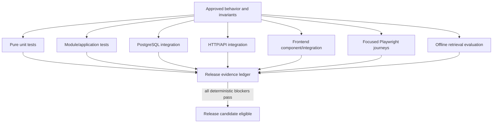
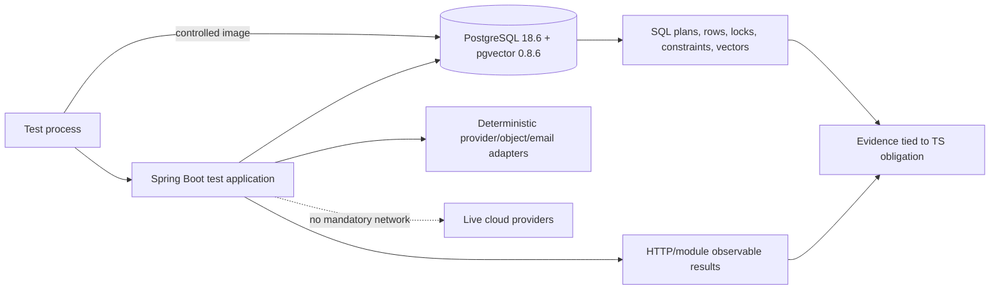
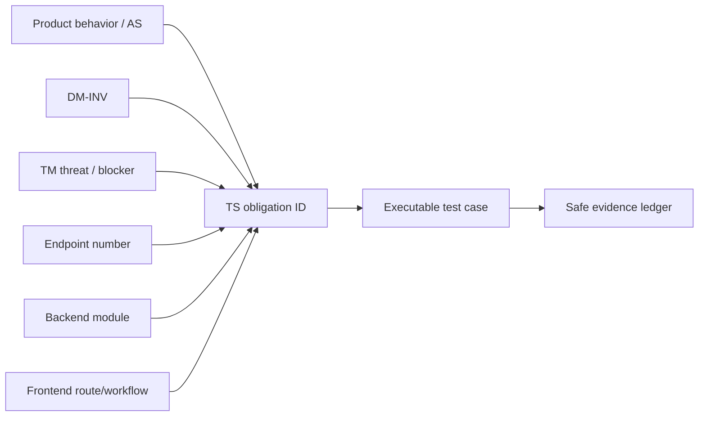
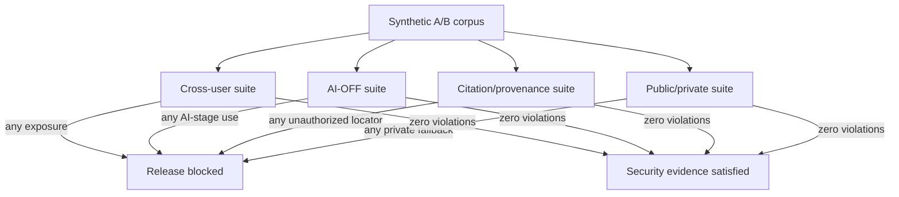
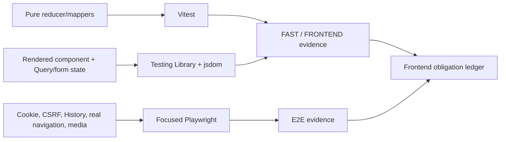

# Notes & Knowledge Workspace

# Testing Strategy

Status: Approved Baseline  
Date: 2026-09-15  
Baseline approval date: 2026-09-16

## 1. Purpose, authority, and implementation gate

This document defines the complete verification strategy for Notes & Knowledge Workspace. It consumes the twelve Approved Baselines and `PROJECT_CONTEXT_HANDOFF.md`; it does not amend them. It defines the executable evidence needed to prove product behavior, all 50 Domain invariants, every Threat Model release blocker, seven-module boundaries, all 91 API contracts, concurrency and persistence behavior, retrieval correctness, AI eligibility, cross-user isolation, private/public separation, durable asynchronous work, all 27 browser routes, accessibility-critical workflows, and degraded modes.

Correctness, isolation, and observable behavior—not line coverage—are the primary evidence. This document creates no production or test source, fixture file, package/build/configuration file, migration, OpenAPI artifact, container definition, CI workflow, deployment/Observability design, roadmap, `AGENTS.md`, or Git repository. It does not authorize implementation.

No contradiction requiring an Approved Baseline amendment was found. Any implementation discovery that makes a binding behavior untestable must stop with `REQUIRES <NAME> BASELINE AMENDMENT BEFORE IMPLEMENTATION`; a test must never silently redefine the behavior.

## 2. Testing principles and portfolio balance

1. Test externally meaningful behavior and binding boundaries, not private method shape.
2. Prefer the lowest level that proves the behavior reliably; escalate when framework, database, browser, or process behavior is the subject.
3. Use real PostgreSQL/pgvector whenever constraints, transactions, row locks, `SKIP LOCKED`, FTS, trigram, vector operators, generation fencing, partial indexes, or conditional revisions matter.
4. A mock cannot prove PostgreSQL authorization scope, locking, query semantics, or transactional truth.
5. Mandatory provider tests use deterministic in-process fake/test adapters with captured, minimized calls.
6. Mandatory suites require no internet, live Google, Gemini, Groq, email provider, cloud S3 bucket, or production Redis.
7. Cross-user exposure, AI-OFF participation in an AI stage, and unauthorized citation/provenance exposure are binary release failures.
8. Test data is synthetic, deterministic, and safe for a future public repository.
9. Concurrency uses barriers, latches, controlled transactions, fake clocks, and captured interleavings—not timing luck or `Thread.sleep`.
10. A flaky test is an engineering defect; rerunning until green does not create evidence.

The portfolio has many cheap deterministic unit, module/application, and frontend component tests; substantial PostgreSQL and HTTP integration coverage; a small high-value Playwright suite; and dedicated offline retrieval/evaluation suites. Database/API integration is intentionally stronger than in a CRUD tutorial because owner scope, PostgreSQL search, pgvector, durable claims, fencing, and ETag concurrency are product and security behavior.



## 3. Approved test technology boundary

| Area | Approved technology and baseline | Permitted role |
|---|---|---|
| Backend test foundation | JUnit Jupiter 6.0.3 through Spring Boot 4.1.1 test support | Unit, application, HTTP, parameterized, and concurrency tests. |
| Test doubles | Mockito 5.23.0 only when Boot supplies it and isolation is useful | Narrow collaborator doubles; never database/locking proof. |
| Module verification | Spring Modulith 2.1.1 test support and `ApplicationModules.verify()` | Seven-module graph, named interfaces, module-focused tests. |
| Real integration services | Testcontainers 2.0.5 | Reproducible PostgreSQL/pgvector and only conditionally exercised infrastructure. |
| Database | PostgreSQL 18.6 with pgvector 0.8.6 | Authoritative SQL, transaction, search, vector, and durable-work evidence. |
| Frontend runner | Vitest 5.0.0 with jsdom 30.0.1 | Pure frontend and component/integration tests. |
| Frontend interaction | Testing Library React 16.3.3, DOM 10.4.1, user-event 14.6.7, jest-dom 7.0.1 | User-observable DOM behavior and accessibility semantics. |
| Browser | Playwright 1.63.0 | Real browser/session/CSRF/navigation critical paths. |

No Cypress, Selenium, Pact, WireMock, REST Assured, Karate, jqwik, direct ArchUnit dependency, mutation-testing tool, snapshot-testing library, browser-mocking framework, hosted testing SaaS, or additional AI-evaluation product is selected. Spring Modulith may use its own internals, but project tests do not import a separately selected ArchUnit API. The Backend LLD fitness outcomes are implemented through approved Spring Modulith/JUnit mechanisms; if a direct new dependency later proves indispensable, implementation must report `REQUIRES TECHNOLOGY BASELINE AMENDMENT BEFORE IMPLEMENTATION`.

## 4. Test layers

| Layer | Owns | Must not claim |
|---|---|---|
| Pure unit | Domain values/rules, state machines, policies, codecs, ETag parsing/construction, classifiers, deterministic extraction, backoff, frontend reducers/mappers. | Framework wiring, SQL truth, browser behavior. |
| Module/application | Use-case orchestration, owner APIs, consumer SPI/provider adapter collaboration, authorization decisions, module-specific behavior. | Real PostgreSQL constraints unless backed by the database layer. |
| PostgreSQL integration | Constraints, indexes with behavioral meaning, transactions, FTS, `pg_trgm`, exact pgvector, row locks, `SKIP LOCKED`, generations, durable work, uniqueness, conditional revisions. | Provider or browser correctness. |
| HTTP/API integration | Sessions, CSRF, RFC 9457, DTOs, statuses, ETags, headers, enumeration-safe behavior, range/content contracts, every endpoint. | Full browser UX. |
| Frontend component/integration | State ownership, forms, Query cache, auth gates, ETag UX, Markdown safety, accessible interactions. | Backend authorization or real cookie transport. |
| Browser E2E | Small critical flows requiring browser cookies, CSRF, routing, focus/navigation, and frontend/backend composition. | Exhaustive endpoint permutations or retrieval benchmarking. |
| Offline evaluation | Frozen synthetic corpora, relevance/evidence judgments, task metrics, deterministic provider captures, model/provider comparisons. | Security authorization, which remains deterministic and zero-tolerance. |



## 5. Suite categories and execution meaning

| Suite | Meaning | Infrastructure | Typical contents |
|---|---|---|---|
| `FAST` | Rapid deterministic developer feedback. | No external services; no Docker unless the behavior truly requires it. | Pure Java, module policy, frontend reducers/components, codecs, fake-provider orchestration. |
| `DATABASE` | PostgreSQL-specific truth. | Testcontainers PostgreSQL/pgvector. | Constraints, FTS/trigram/vector, transactions, locks, claims, generations, relation behavior. |
| `API` | External HTTP contract. | Spring Boot test application; real PostgreSQL where state matters. | All 91 endpoints, Problem Details, session/CSRF, ETags, pagination, range. |
| `SECURITY` | Deterministic boundary and release-blocker evidence. | Composition of module, DB, API, frontend, and selected E2E tests. | Cross-user, AI-OFF, citations, public/private, auth/MFA, XSS, logging. |
| `RETRIEVAL` | Functional retrieval correctness and isolation. | Real PostgreSQL/pgvector; deterministic corpus/adapters. | Lexical, fuzzy, exact vector, hybrid, extraction, provenance. |
| `FRONTEND` | DOM/state/cache behavior. | Vitest/jsdom/Testing Library. | Route gates, editor, ViewerCacheScope, Markdown, accessibility semantics. |
| `E2E` | Focused real-browser journeys. | Playwright plus local deterministic stack. | Critical identity, Notes, media, Ask, publishing, moderation paths. |
| `EVALUATION` | Slower quality/regression benchmarks. | Frozen synthetic corpus and deterministic harness. | Task-specific metrics and like-for-like provider/model comparison. |

Each test has one primary execution class and may contribute to several traceability obligations. CI/CD will decide workflow topology, triggers, caching, and merge gates; this strategy owns only suite meaning and pass/fail evidence.

## 6. Traceability and evidence ledger

Every executable test records a stable Testing Strategy obligation ID and, where applicable, Product behavior/acceptance scenario, Domain invariant, Threat ID, endpoint number, backend module, frontend route/workflow, and evidence type.



### 6.1 Obligation catalog

| Obligation family | Scope |
|---|---|
| `TS-AUTH-001..010` | Identity, session, CSRF, OIDC, MFA, recovery, recent-auth, Account lifecycle, security email. |
| `TS-ISO-001..004` | Cross-user private isolation, AI-OFF isolation, citation/provenance isolation, public/private separation. |
| `TS-NOTE-001..008` | Note creation/default, explicit Save, commands/lifecycle, versions, ETags, races, saved-state boundary. |
| `TS-FILE-001..005` | Four modalities, staging/validation, authorized delivery/range, deletion, public-copy separation. |
| `TS-PROF-001..003` | Private Profile, handle/avatar rules, explicit public projection. |
| `TS-AI-001..006` | Permit gates, provider capture, disable/enable races, output safety, degradation, processing status. |
| `TS-RET-001..008` | Ordinary search, exact vectors, hybrid/RRF, focused fact, semantic extraction, deterministic extraction, multimodal, provenance. |
| `TS-PUB-001..006` | Preview/checkpoint, snapshot, update/unpublish/republish, public media, immediate denial, Account/moderation consequences. |
| `TS-DISC-001..004` | Explore/search/profile lists, Like/idempotency/counts, views, Reports. |
| `TS-MOD-001..004` | Live capability, begin/terminal transitions, consequence atomicity, no private access. |
| `TS-JOB-001..005` | Claim/lease/reclaim, fencing, retry/backoff, generation/current-state revalidation, crash recovery. |
| `TS-MODL-001..004` | Exactly seven modules, acyclic named boundaries, consumer SPI inversion, persistence isolation. |
| `TS-API-001..091` | One obligation per numbered external endpoint. |
| `TS-FE-001..027` | One obligation per browser route plus shared cache/editor/security behavior. |
| `TS-OPS-001..005` | Safe logging, deterministic time/data, dependency degradation, migration evidence, performance/load boundary. |

### 6.2 Product requirement-family coverage

The Product baseline contains 234 functional and 47 non-functional requirements. The future evidence ledger records each stable requirement ID; this compact family routing prevents duplication here while ensuring none is orphaned.

| Requirement families | Primary obligation families |
|---|---|
| `FR-ID`, `FR-MFA`, `FR-SEC`, `FR-SESSION` | `TS-AUTH-*`, `TS-ISO-*`, `TS-API-001..032`, identity/security browser routes. |
| `FR-PROFILE` | `TS-PROF-*`, `TS-API-033..039`, routes 16/17/24. |
| `FR-NOTE` | `TS-NOTE-*`, `TS-API-040..059`, routes 10–12. |
| `FR-ATTACH` | `TS-FILE-*`, `TS-API-060..065`, Note editor/media workflows. |
| `FR-SEARCH`, `FR-RETR`, `FR-AI`, `FR-MM` | `TS-RET-*`, `TS-AI-*`, `TS-ISO-*`, `TS-API-044/065..72`, routes 12/13. |
| `FR-PUB` | `TS-PUB-*`, `TS-API-073..082`, owner/public Publication routes. |
| `FR-EXPLORE`, `FR-ENGAGE` | `TS-DISC-*`, `TS-API-038/039/081..087`, public routes. |
| `FR-MOD` | `TS-MOD-*`, `TS-API-087..091`, moderation routes. |
| `NFR-SEC`, `NFR-PRIV`, `NFR-REL`, `NFR-AI`, `NFR-SEARCH` | Zero-violation security, database/concurrency, retrieval/evaluation, degradation, and privacy-log suites. |
| `NFR-PERF`, `NFR-COST`, `NFR-DEGRADE` | Bounded workload/provider cases and later representative load evidence. |
| `NFR-ACC` | Component/E2E automation plus required manual assistive-technology review. |
| `NFR-MAINT`, `NFR-TEST`, `NFR-OBS`, `NFR-AUDIT`, `NFR-REPO` | Module fitness, deterministic suites, safe evidence/diagnostics, public-safe fixtures, and downstream CI/Observability gates. |

### 6.3 Product acceptance grouping

| Product evidence | Primary obligations |
|---|---|
| AS-01..04, AS-21..22 | `TS-NOTE-*`, `TS-FE-*`, ETag and persistence evidence. |
| AS-05..13, AS-23..30, AS-34 | `TS-ISO-*`, `TS-RET-*`, `TS-AI-*`, `TS-FILE-*`. |
| AS-14..15, AS-31 | `TS-PUB-*`, `TS-FILE-*`, public-denial tests. |
| AS-16..17 | `TS-AUTH-*` and browser session flows. |
| AS-18 | `TS-AI-005`, `TS-OPS-003`. |
| AS-19 | `TS-DISC-*`. |
| AS-20 | `TS-MOD-*`. |
| AS-32..40 | `TS-NOTE-001`, `TS-AI-*`, default/per-Note/bulk-state tests. |

## 7. Domain invariant coverage matrix

Levels: `U` unit, `M` module/application, `DB` real PostgreSQL integration, `API` HTTP integration, `FE` frontend component, `E2E` Playwright. “DB/concurrency” identifies required non-mock evidence.

| Invariant | Owner | Primary level / obligation | Positive evidence | Negative or violation evidence | DB/concurrency |
|---|---|---|---|---|---|
| DM-INV-001 | Identity | M+DB+API / `TS-AUTH-001` | Immutable UserId drives owner authority. | Email/handle/client locator cannot substitute. | Immutable key and owner queries. |
| DM-INV-002 | Identity/Profile | M+API / `TS-PROF-001` | Email/handle mutate as contact/presentation. | Mutation never changes authorization subject. | Unique normalized values. |
| DM-INV-003 | Identity | M+DB+API / `TS-AUTH-004` | Issuer+subject resolves link. | Matching email, wrong issuer/subject, duplicates fail. | Transactional uniqueness/race. |
| DM-INV-004 | Identity/all | API+E2E / `TS-AUTH-002` | Eligible full session accesses protected path. | Anonymous, pre-MFA, suspended/deleted sessions denied. | Live eligibility under concurrent suspension. |
| DM-INV-005 | Identity/cross | M+DB+API / `TS-AUTH-010` | Deletion establishes auth/public/AI denial before 204. | Cleanup lag cannot restore access. | Joined transaction and race tests. |
| DM-INV-006 | Identity | API+E2E / `TS-AUTH-005` | MFA follows either primary method. | Pre-MFA cannot access private shell/API. | Session rotation/state transition. |
| DM-INV-007 | Identity | U+DB+API / `TS-AUTH-006` | Purpose/expiry/single-use accepted once. | Replay, superseded, wrong-purpose, expired proof fails. | Parallel conditional consumption. |
| DM-INV-008 | Identity | DB+API+E2E / `TS-AUTH-003` | One/other/all session revocation and rotation work. | Old/current revoked session cannot authorize. | Concurrent request/revoke. |
| DM-INV-009 | Identity | M+DB+API / `TS-AUTH-007` | Recent-auth/MFA and audit accompany sensitive change. | Stale recent-auth or missing evidence fails. | Atomic change/consequence/audit. |
| DM-INV-010 | Identity/Moderation | M+DB+API / `TS-MOD-001` | Explicit capability grants bounded action. | Self-grant/private-note/super-admin path absent. | Live revoke during session. |
| DM-INV-011 | Notes | DB+API / `TS-NOTE-001` | New Account resolves future default OFF. | Missing preference cannot become ON. | Creation/backfill/default behavior. |
| DM-INV-012 | Notes | M+DB+API / `TS-NOTE-001` | Default initializes later creates only. | Preference change never mutates existing Notes. | Mixed existing/new rows. |
| DM-INV-013 | Notes | DB+API / `TS-ISO-001` | Note has one immutable owner. | Owner reassignment/cross-user access fails. | FK/conditional owner predicate. |
| DM-INV-014 | Notes | API / `TS-ISO-001` | Server derives owner from session. | Supplied owner/ID/handle grants nothing. | A/B endpoint matrix. |
| DM-INV-015 | Notes | M+DB+API+FE / `TS-NOTE-002` | Successful explicit Save commits and advances ETag. | Failure leaves committed state and draft base unchanged. | Conditional write/fault injection. |
| DM-INV-016 | Notes | DB+API+FE / `TS-NOTE-006` | Current revision writes succeed. | Stale write returns 412 without overwrite. | Two-client barrier. |
| DM-INV-017 | Notes | M+DB+API+FE / `TS-NOTE-003` | Commands persist independently and advance core ETag. | Command never silently saves draft. | Same-tab dirty A→command B. |
| DM-INV-018 | Notes | M+DB+API / `TS-NOTE-004` | Legal lifecycle and confirmed deletion transitions succeed. | Illegal/current-unconfirmed transitions return conflict. | Logical denial before cleanup. |
| DM-INV-019 | Notes | DB+API / `TS-NOTE-005` | Retained versions immutable, owner-scoped, policy-bounded. | Update/cross-owner/unheld retention violation fails. | Constraints/hold-aware deletion. |
| DM-INV-020 | Notes | DB+API+FE / `TS-NOTE-005` | Restore creates a new current revision. | Checkpoint is not mutated or lost silently. | Transaction/checkpoint provenance. |
| DM-INV-021 | Notes | M+DB+API / `TS-AI-001` | Every Note owns independent ON/OFF after create. | Later default cannot override it. | Mixed-state persistence. |
| DM-INV-022 | Notes | DB+API / `TS-AI-002` | Explicit bulk changes selected applicable Notes only. | Default/unselected/ineligible Notes unchanged. | Bulk/editor Save race. |
| DM-INV-023 | Notes/Knowledge | M+DB+API / `TS-NOTE-008` | Note-scoped tags and confirmed proposal mutation. | Hierarchy/global tag/auto-apply absent; stale proposal fails. | Normalized uniqueness/source revision. |
| DM-INV-024 | Notes | U+API / `TS-FILE-001` | Image, audio/voice, bounded video, PDF accepted. | Fifth modality/invalid bounds rejected. | Media-kind check. |
| DM-INV-025 | Notes | DB+API / `TS-FILE-003` | Attachment authorization derives through owning Note. | Direct ID/object key/cross-user lookup fails. | Composite owner FKs/A-B tests. |
| DM-INV-026 | Notes/Knowledge | M+API / `TS-AI-001` | Attachment follows parent AI state plus gates. | Independent attachment AI permission cannot arise. | Parent toggle/worker race. |
| DM-INV-027 | Notes | M+DB+API+FE / `TS-FILE-002` | Stored Attachment remains usable after AI failure. | Processing failure cannot mark stored bytes unavailable. | Separate state persistence. |
| DM-INV-028 | Notes/Knowledge | API+DB / `TS-ISO-002` | AI-OFF remains editable/searchable/deterministically extractable. | Deterministic functionality is not incorrectly blocked. | Owner lexical/full scan. |
| DM-INV-029 | Knowledge | M+DB+API / `TS-ISO-002` | AI-OFF yields zero AI-stage participation. | Any embedding/candidate/model/media processing is failure. | Provider capture and source queries. |
| DM-INV-030 | Notes/Knowledge | M+DB+API / `TS-AI-001`, `TS-ISO-002` | Owner-authorized Note may persist AI ON independently; AI-dependent work becomes eligible only after all current processing gates pass. | Missing acknowledgement, provider/task policy, authority, source-state, or lineage gate yields zero AI provider calls and zero usable AI-dependent representation, but does not silently turn `aiEnabled` OFF. | Persist AI ON without current acknowledgement and observe blocked processing; later acknowledgement may permit or schedule current-generation work when all remaining gates pass, without changing the independent Note AI state. |
| DM-INV-031 | Notes/Knowledge | DB+API / `TS-AI-003` | Disable makes old representation/work immediately ineligible. | Late worker cannot reactivate it. | Generation-fenced race. |
| DM-INV-032 | Knowledge | DB / `TS-RET-002` | Derived row records source/version/scope/generation/lineage. | Missing/mismatched lineage is unusable. | Checks/current uniqueness. |
| DM-INV-033 | Knowledge/all | DB+API / `TS-ISO-003` | Evidence/citations/cache/object locators inherit source scope. | Indirect locator cannot broaden access. | Composite scope FKs and A/B resolution. |
| DM-INV-034 | Knowledge | DB+API / `TS-ISO-004` | Private-owner and active-public queries use distinct paths. | Public query never starts from private candidates. | Separate relation/query inspection. |
| DM-INV-035 | Knowledge | M+DB / `TS-JOB-004` | Work intent stores references and requested work only. | Queue row cannot authorize copied private content. | Revalidation after state change. |
| DM-INV-036 | Knowledge/Identity | DB / `TS-JOB-004` | Every sensitive effect revalidates current state before use. | Stale/superseded/old-generation claim becomes obsolete. | Barrier at claim/effect/activation. |
| DM-INV-037 | Knowledge | M+API+FE / `TS-AI-004` | Output/suggestions remain visible untrusted proposals. | No automatic Note/tag/publication/security/moderation mutation. | Captured adapter plus state assertion. |
| DM-INV-038 | Publishing | M+DB+API / `TS-PUB-001` | Publication is separate snapshot aggregate. | Private Note visibility flag/live projection absent. | Separate relation/DTO path. |
| DM-INV-039 | Publishing/Notes | DB+API / `TS-PUB-001` | Stable Publication owns snapshot from authorized NoteVersion. | Snapshot has no independent identity; wrong checkpoint fails. | Hold/checkpoint transaction. |
| DM-INV-040 | Publishing | DB+API+E2E / `TS-PUB-002` | Explicit update replaces current snapshot. | Private Save/tag/Attachment change leaves public copy unchanged. | Save/update concurrency. |
| DM-INV-041 | Publishing/cross | DB+API+E2E / `TS-PUB-005` | Unpublish/deletion/moderation immediately denies public eligibility. | Physical remnants/caches/index cannot serve. | Joined denial and concurrent reads. |
| DM-INV-042 | Publishing/Notes | DB+API / `TS-PUB-004` | Only selected approved copied media becomes public. | Private object/ID or unselected media unavailable. | Generation/media scope. |
| DM-INV-043 | Profile | DB+API+FE / `TS-PROF-003` | Explicit projection contains allowlisted fields. | Private edits/fields do not auto-publish. | Handle uniqueness/generation. |
| DM-INV-044 | Discovery/Publishing | DB+API / `TS-DISC-001` | Public reads/search/engagement use active generation only. | Inactive/stale generation excluded. | Scope-first queries/index eligibility. |
| DM-INV-045 | Discovery | DB+API+FE / `TS-DISC-002` | Like/unlike repeated intent succeeds. | Duplicate/concurrent PUT creates at most one relation. | Unique pair/concurrent inserts. |
| DM-INV-046 | Discovery | M+API / `TS-DISC-003` | Approximate privacy-conscious views never block reads. | Tracking failure/raw viewer ledger cannot become authority. | Failure injection/count reconciliation. |
| DM-INV-047 | Moderation | DB+API / `TS-MOD-002` | Report targets public representation. | Report ID grants no private source access. | Public-only FK/DTO A-B tests. |
| DM-INV-048 | Identity/Moderation | M+API+E2E / `TS-MOD-001` | Live narrow review/enforce capability permits only scope. | Private Notes/media/search/secrets remain inaccessible. | Mid-session revoke. |
| DM-INV-049 | Moderation | DB+API / `TS-MOD-003` | Material decision is attributable/reasoned/auditable and bounded. | Missing reason/actor, duplicate terminal, failed consequence cannot succeed. | Atomic consequence/decision. |
| DM-INV-050 | All modules | Modulith+DB / `TS-MODL-001..004` | Seven owners collaborate through named APIs/SPIs. | Cycles, repository/entity/SQL shortcuts and broker implication fail. | Module verification and persistence ownership. |

All 50 identifiers, `DM-INV-001` through `DM-INV-050`, appear exactly once in this matrix and remain binding.

## 8. Zero-violation security suites



- **`TS-ISO-001` Cross-user isolation:** for every private read, write, version, Attachment, operation, search, vector, answer, and citation path, User B receives zero data from User A. Tests inspect candidate/provider inputs as well as final DTOs.
- **`TS-ISO-002` AI exclusion:** AI-OFF Notes remain present only in approved deterministic non-AI paths and produce zero embeddings, semantic candidates, model context, multimodal derivation, or AI suggestion input.
- **`TS-ISO-003` Citation/provenance:** every evidence locator is reauthorized; an unauthorized source produces zero citation, snippet, count, object key, operation handle, or timing-dependent existence signal.
- **`TS-ISO-004` Public/private separation:** public controllers, DTOs, caches, search, media, Profiles, Reports, and moderation evidence never fall through to private Note/Attachment/Knowledge storage.

One failure blocks release. No percentage or probabilistic threshold applies.

## 9. Threat Model release-blocker matrix

The Threat Model contains 55 stable rows. The following 15 rows explicitly carry release-blocking disposition or validation language; each has mandatory executable evidence. Other threat rows remain binding and are covered by the additional matrix below.

| Threat ID | Primary obligations | Mandatory executable evidence |
|---|---|---|
| TM-OIDC-03 | `TS-AUTH-004` | Same-email/different issuer-subject never auto-links; link/relink/unlink uniqueness races fail safely. |
| TM-AUTHZ-01 | `TS-ISO-001`, `TS-API-*` | User A/B matrix covers Note read/write/delete/version/tag/lifecycle and guessed IDs with zero exposure. |
| TM-AUTHZ-02 | `TS-ISO-001/003`, `TS-FILE-003` | Cross-user Attachment, object, job, operation, vector, derivative, and citation locators grant nothing. |
| TM-AUTHZ-04 | `TS-MODL-*`, `TS-ISO-*` | Modulith boundary verification plus every alternate route/job/provider path rechecks current authority. |
| TM-RETR-01 | `TS-RET-002`, `TS-ISO-001` | Multi-user adversarial near-duplicate corpus proves owner/current filters occur before exact vector candidate exposure. |
| TM-RETR-02 | `TS-RET-001/003/005/006`, `TS-ISO-001` | FTS, trigram, hybrid, aggregation, exhaustive, and media candidate sets never mix owners. |
| TM-RETR-04 | `TS-RET-002`, `TS-JOB-004` | Wrong-owner write injection and delete/unpublish/AI-disable/rebuild races cannot make stale derived data usable. |
| TM-AI-01 | `TS-ISO-002`, `TS-AI-001/003` | Instrumented fake provider records zero AI-OFF text/media through every source-bearing route and race. |
| TM-FILE-03 | `TS-FILE-003`, `TS-ISO-001` | Cross-user direct ID/key/download/replace attempts fail; no public bucket/object key becomes authority. |
| TM-FILE-04 | `TS-FILE-004`, `TS-PUB-004/005` | Only selected safe public media is available; replacement/delete/unpublish races deny stale derivatives. |
| TM-WEB-01 | `TS-FE-*`, `TS-FILE-001`, `TS-AI-004` | Stored/reflected/DOM payload suite spans private/public Markdown, reports, errors, media, and AI output; no execution. |
| TM-PUB-01 | `TS-PUB-001/002` | Save-versus-publish, wrong owner/version, selected-media, fingerprint, and preview parity tests prevent involuntary exposure. |
| TM-MOD-01 | `TS-MOD-001/004`, `TS-ISO-004` | Moderator can review/enforce approved public scope only and cannot reach private Notes, media, retrieval, or secrets. |
| TM-JOB-01 | `TS-JOB-001..005` | Duplicate/replay/crash plus disable/unpublish/delete/generation races cannot activate wrong-context effects. |
| TM-DATA-01 | `TS-ISO-001`, `TS-RET-*`, `TS-OPS-001` | Injection corpus, parameterization/query-shape review, and owner-scoped SQL tests block injection and missing predicates. |

### 9.1 Rule-based release-blocker coverage

The Threat Model's global rule also blocks release for any proven violation in these classes, regardless of whether an individual row's disposition literally says “release blocker”:

| Blocker class | Threat trace | Executable obligations |
|---|---|---|
| Cross-user isolation | TM-AUTHZ-01/02/04, TM-RETR-01..04, TM-FILE-03 | `TS-ISO-001/003`, A/B API/DB/provider/citation/object tests. |
| Authentication bypass | TM-AUTH-01..04, TM-OIDC-01..04 | `TS-AUTH-001..004`, fixation/replay/protocol/session tests. |
| Authorization bypass | TM-AUTHZ-01..04, TM-DATA-01/02 | `TS-ISO-*`, `TS-MODL-*`, every protected endpoint/job owner test. |
| MFA bypass | TM-OIDC-04, TM-MFA-01..03 | `TS-AUTH-005/006`, password and OIDC pre-MFA negative matrix. |
| Private/public isolation | TM-PUB-01/02, TM-FILE-04, TM-WEB-01 | `TS-ISO-004`, `TS-PUB-001..005`, public DTO/media/render tests. |
| AI-state boundary | TM-AI-01/02, TM-RETR-04, TM-JOB-01 | `TS-ISO-002`, `TS-AI-001/003`, generation/provider capture races. |
| Authorization-after-retrieval leak | TM-RETR-01..04, TM-AI-03 | `TS-ISO-001/003`, pre-candidate scope and context/citation inspection. |

### 9.2 Additional required threat coverage

| Threat families / IDs | Evidence |
|---|---|
| TM-AUTH-01..04 | Rate/Argon2 load boundaries, blind recovery behavior, verifier format, fixation, rotation, theft/replay, revocation, stale privilege. |
| TM-OIDC-01, -02, -04 | Deterministic invalid issuer/audience/time/nonce/state/PKCE/redirect tests; provider tokens absent from React/logs; MFA still gates OIDC. |
| TM-MFA-01..03 | Guess/replay/window, encrypted-seed failure, enrollment proof, recovery single-use/regeneration, reset/session consequences. |
| TM-AUTHZ-03 | Narrow assignment, CSRF/recent-auth/MFA, audit, mass-action bounds, moderator-private negatives. |
| TM-RETR-03 | Cross-user cache warming, viewer cache epochs, counts/snippets/timing, and citation reauthorization. |
| TM-AI-02..06 | Default/bulk/attachment state, minimized captured context, no silent fallback, injection corpus, typed/untrusted output and citation validation. |
| TM-FILE-01..02 | Spoof/polyglot/malformed/active fixtures plus size, duration, pages, quota, parser and concurrent upload budgets. |
| TM-WEB-02..03 | CSRF across unsafe families; CORS/host/proxy/redirect/header/cache expectations reserved for deployment-profile verification. |
| TM-PUB-02..03 | Immediate unreachability, projection minimization, Like uniqueness, approximate views, report/scraping/load abuse boundaries. |
| TM-MOD-02 | Compromised moderator, report payload rendering, CSRF, rate/mass-action, immutable audit/consequence failure. |
| TM-JOB-02..03 | Typed/minimal payloads, safe diagnostics, poison work, bounded retry/backpressure, provider outage, interactive-resource protection. |
| TM-DATA-02..04 | Runtime/migration privilege separation, module persistence boundaries, restore review, cache isolation/poison/outage/fail-safe behavior. |
| TM-OPS-01..05 | Secret/built-asset inspection, canary log tests, dependency/configuration gates, security-email race/replay/outage. |
| TM-DOS-01..03 | Authentication, retrieval/AI, upload/parser/job/connection-pool representative load and cancellation evidence. |
| TM-PRIV-01..02 | Disclosure/provider policy tests, public DTO minimization, analytics/log/deletion-retention review. |
| TM-SSRF-01 | Static and runtime capture proves deterministic URL extraction and Markdown rendering perform zero remote fetches. |

## 10. Identity, OIDC, sessions, CSRF, MFA, and recovery

### 10.1 Identity and application-state coverage

`TS-AUTH-*` covers registration, verification, password login, blind resend/reset request, reset confirmation/replay, enumeration resistance, logout, revoke one/others/all, Account ineligibility, password/email changes, OIDC login/account creation, explicit link/unlink, recent authentication, and Account deletion. Protocol tests are separate from Account/session-state tests so a fake “valid provider response” cannot bypass application eligibility, linking, or MFA.

Blind `202` tests compare status, body, headers, externally visible timing class, and absence of polling location for known, unknown, ineligible, and rate-limited identities. Eligible work must still be durable before success; unknown targets create no fake authoritative capability or delivery work.

### 10.2 Deterministic OIDC adapter

Mandatory suites never call Google. The Identity protocol boundary deterministically produces valid issuer/subject and failures for signature/issuer, audience/authorized party, expiry/not-before/clock skew, nonce, state, PKCE, redirect transaction, duplicate subject, already-linked identity, and matching email with different issuer/subject. It captures whether provider tokens escape the bounded server-side protocol flow. Live-provider qualification, if later required, is optional/manual, synthetic, secret-safe, and never the only correctness evidence.

### 10.3 Session and CSRF

- Protected APIs require the opaque cookie session; the browser never reads the HttpOnly cookie.
- Safe reads need no CSRF; every unsafe cookie-authenticated family rejects missing/stale proof.
- Password primary login, OIDC primary login, MFA elevation, logout, current-session revocation, and other authority-changing replacements discard the old frontend CSRF proof and bootstrap a new one.
- Fixation tests prove session rotation; replay tests prove logout, one/other/all revocation, password-reset invalidation, suspension, and deletion take effect.
- Pre-MFA authority can complete MFA or logout only; it cannot load private product data.

### 10.4 MFA and recovery

Tests cover enrollment generation, proof before activation, invalid/boundary-window TOTP, atomic same-code replay protection, recovery-code hashed one-time use, concurrent use, regeneration invalidation, disable/reset consequences, challenge expiry/loss, and memory-only frontend continuation. Secret absence is proven with synthetic canaries in logs/DTOs; tests do not print secret material.

## 11. Durable Identity security-email testing

Relation 38, `identity.security_email_delivery`, receives dedicated `DATABASE`, `API`, and `SECURITY` coverage:

- eligible registration/verification/reset/email-change requests commit authoritative capability, audit, and durable work atomically before blind `202`;
- unknown Account behavior is externally indistinguishable and creates no fake eligible work;
- the one-way capability verifier alone is authority; encrypted delivery material never authorizes action;
- superseded, expired, consumed, revoked, wrong-purpose, or Account-ineligible capabilities are not sent;
- notices cover password-reset completion, both email-change recipients, MFA disabled/reset, and Google linked/unlinked;
- ready claim and expired-lease reclaim use fresh lease tokens; duplicate claim and stale finalization fail;
- retry-wait, submitted, failed, and obsolete transitions are fenced and terminal states clear recoverable material;
- provider I/O occurs outside the database transaction; a crash after authoritative mutation does not lose intent;
- ambiguous provider acceptance may duplicate email but never capability authority or corrupt state;
- A→B followed by B→C proves event 1 retains protected A/B recipients and event 2 retains B/C;
- encrypted envelopes, tokens, plaintext recipients, rendered messages, and provider payloads never enter logs or Knowledge/AI capture.

## 12. Notes, versions, and optimistic concurrency

Tests cover Create Note, absent/present optional AI override, future default initialization, explicit Save, pin, tags, archive/return, trash/restore, permanent delete, checkpoint/list/read/restore, published-source confirmation, and bulk AI changes. Every authoritative Note-core mutation advances revision/strong ETag; endpoint 65 and background processing do not.

```mermaid
sequenceDiagram
    participant C1 as Client 1
    participant C2 as Client 2
    participant API as Notes API
    participant DB as PostgreSQL
    C1->>API: GET Note
    C2->>API: GET Note
    API-->>C1: ETag A
    API-->>C2: ETag A
    C1->>API: PUT Save If-Match A
    API->>DB: owner + revision A conditional update
    DB-->>API: revision B committed
    API-->>C1: 200 + ETag B
    C2->>API: PUT Save If-Match A
    API->>DB: owner + revision A conditional update
    DB-->>API: zero rows
    API-->>C2: 412; committed B unchanged
```

Required concurrent cases are:

| Case | Evidence |
|---|---|
| Two saves from A | First produces B; second returns 412 and never overwrites. |
| Missing `If-Match` | Required command returns 428. |
| Current ETag, illegal transition | Returns 409, distinguishing domain conflict from stale precondition. |
| Dirty editor A → pin | Pin produces B; draft is preserved; later Save uses B successfully. |
| Bulk AI versus editor | Bulk mutation advances revision; old editor Save returns 412. |
| Dirty external B | Frontend does not adopt B silently; exact draft survives reconciliation. |
| Transient Save failure | Exact draft remains and explicit retry is possible. |
| Saved-state features | Dirty editor blocks endpoints 71, 72, and 73; after Save they use the new ETag. |

## 13. Attachment and Profile coverage

### 13.1 Attachments

`TS-FILE-*` tests exactly image, audio/voice, bounded video, and PDF. The selected initial upload flow is: authorize the current Note → stage unreachable bytes → stream and boundedly validate outside a database transaction → reauthorize the current Note → create the stored/accepted Attachment in a short transaction → optionally coordinate eligible Knowledge work → commit → return `201 Created` with `Location`, the authoritative Attachment core, and its strong ETag as defined by the approved contract.

Required cases prove that no authoritative Attachment row exists merely because byte upload began; invalid, malformed, or oversized content never becomes available; a database failure after staging leaves bytes unreachable; and an accepted `201` Attachment remains accessible even if later AI processing fails. Upload validation state and endpoint 65 AI-processing state remain separate, and no durable Notes validation-work row is invented. Tests also cover unsupported kind; MIME/extension spoof; malformed/polyglot/active input; size/duration/page/metadata bounds; owner authorization; ETag delete; Range `200/206`, `Content-Range`, invalid range `416`; private deletion; and no automatic removal of copied public media. Frontend upload progress and AI-processing state are independently driven and asserted.

The API's permitted future tracked-`202` evolution is not exercised by the initial Backend implementation. If a future approved Backend design introduces a Notes-owned durable validation mechanism, this Testing Strategy must be amended with corresponding tracked-`202` evidence. Asynchronous Knowledge AI processing after upload is not Attachment validation.

No real cloud bucket is required: module/application and HTTP tests use approved narrow deterministic object-store adapters, while deployment-specific S3 conformance remains downstream. Tests stream bounded fixtures rather than buffering large objects unnecessarily.

### 13.2 Profiles

Tests cover private Profile update, avatar validation, normalized unique handle, a private-only Account without a handle, handle requirement before public activation/publication, explicit projection activation, private changes not auto-publishing, validated public avatar only, and public DTO exclusion of email, authentication identity, MFA, session, and moderation internals.

## 14. Publication, public media, Discovery, and moderation

### 14.1 Publication and public media

`TS-PUB-*` covers preview, opaque fingerprint, stable Publication identity, explicit media selection, immutable checkpoint provenance, private Save isolation, source drift and endpoint 77, update, stale-preview rejection, unpublish, republish, confirmed source retirement, Account deletion, and moderation removal. After successful logical denial, public GET, media, Explore/search, and author listings fail or exclude immediately even if physical bytes or stale work remain.

Public media tests require current active snapshot/generation, reject stale/superseded media, deny immediately after unpublish, distinguish private Attachment IDs from public media IDs, and prove object references grant no authority. Range behavior mirrors the approved `200/206/416` contract.

### 14.2 Discovery

Tests cover Latest; the Trending contract only after its formula is separately frozen; public q/tag search; tag navigation; public Profile Publication lists; Like/unlike uniqueness and idempotency; concurrent duplicate Like; count reconciliation; approximate views whose failure cannot block reads; and bounded Report submission. No personalized recommendation test exists because the product has none.

### 14.3 Moderation

Queue/detail/begin-review require live `moderation.review`; terminal action requires live `moderation.enforce`, recent-auth/MFA/CSRF as applicable, and supported consequences only. Tests prove Open→UnderReview→Dismissed/Actioned, idempotent already-under-review handling, immutable terminal decisions, public removal, optional responsible Account suspension, and rollback/truthful failure when a mandatory consequence cannot be established. Capability revocation takes effect during the same browser session. Moderator self-assignment, private Note/Attachment/search/RAG access, and broad user administration remain impossible.

## 15. Module and persistence boundary testing

Spring Modulith verification proves exactly seven business modules—Identity, Profile, Notes, Publishing, Discovery, Knowledge, Moderation—an acyclic approved graph, named interfaces, and no eighth business module. Module/application tests prove consumer-owned SPI interfaces and provider-owned implementations for:

- `Knowledge.PrivateKnowledgeSource` ← Notes implementation;
- `Knowledge.PrivateLexicalSearch` ← Notes implementation;
- `Profile.ActiveAuthorPublications` ← Discovery implementation;
- `Notes.SourceRetirementPublicationConsequence` ← Publishing implementation.

JUnit/Modulith fitness tests reject consumer imports of provider internals, cross-module repository access, cross-module JPA associations, another module's SQL/table access, controller-to-repository shortcuts, and domain dependencies on Spring/JPA/web/provider types. No broker behavior is assumed.

### 15.1 All 38 relations

Real PostgreSQL tests account for the authoritative catalog without redefining it:

| Module | Count | Relations covered | Primary database evidence |
|---|---:|---|---|
| Identity | 11 | `account`, `external_identity_link`, `identity_capability`, `security_email_delivery`, `mfa_configuration`, `mfa_recovery_code`, `privilege_assignment`, `security_audit_fact`, `application_session_descriptor`, `spring_session`, `spring_session_attributes` | Identity uniqueness, single-use/replay, session lifecycle, append evidence, durable email fencing. |
| Profile | 3 | `profile`, `public_profile_projection`, `avatar_asset` | Handle uniqueness, allowlisted generation, validated avatar state. |
| Notes | 6 | `note_preferences`, `note`, `note_version`, `note_version_hold`, `note_tag`, `attachment` | Owner scope, revision predicates, lifecycle checks, immutable/held versions, tag/media constraints. |
| Knowledge | 8 | `processing_policy`, `processing_policy_acknowledgement`, `private_derived_representation`, `private_derived_segment`, `public_derived_representation`, `public_derived_segment`, `knowledge_work_intent`, `organization_suggestion` | Policy uniqueness, scope-safe child FKs, current lineage/generation, claim/retry state, proposal provenance. |
| Publishing | 4 | `publication`, `publication_snapshot_tag`, `publication_public_media`, `publication_audit_fact` | Stable identity/current snapshot, atomic replacement, selected media, append evidence. |
| Discovery | 3 | `publication_projection`, `publication_like`, `publication_view_aggregate` | Active generation, unique Like, nonnegative approximate counts. |
| Moderation | 3 | `report`, `moderation_decision`, `moderation_audit_fact` | Public-only target, one coherent terminal decision, append-oriented evidence. |

The `DATABASE` suite verifies relevant unique/FK/check/partial constraints, lifecycle shapes, revision predicates, generation state, owner-scoped search, transactional invariants, and work-eligibility indexes. Tests never share mutable database state in an order-dependent way.

## 16. Synthetic retrieval and AI evaluation corpus

The future evaluation corpus is synthetic, deterministic, versioned with the eventual tests, and generated from a recorded seed. It contains multiple reserved/example users, hundreds or more Notes, near duplicates, distractors, shorthand, typos, aliases, repeated and conflicting facts, stale checkpoints, AI-ON/OFF states, Active/Archived/Trashed states, private/public boundaries, and all four media kinds. Expected relevance sets, evidence spans, occurrence records, and authorized scopes are reviewed independently of a model response. No real user, employer, client, credential, email, URL history, or production data appears.

Small functional fixtures stay separate from the larger frozen evaluation corpus. Every provider/model comparison uses the same corpus, benchmark queries, relevance judgments, seeds, and task metrics; cherry-picked corpora are prohibited.

## 17. Ordinary search, exact vector, hybrid, and focused-fact evaluation

| Query task | Required experiment | Primary metrics / assertions |
|---|---|---|
| Ordinary lexical/fuzzy | PostgreSQL English FTS plus simple-token and `pg_trgm` behavior, tags, lifecycle, owner scope, AI-OFF inclusion; include `goohle` with a reasonable path to `Google`. | Recall@K, MRR/NDCG where ranked, exact filter/isolation assertions, representative latency later. No model call. |
| Exact private vector | Exact pgvector scan over owner/current/eligible scope, current revision/generation/lineage, attachment validation, deterministic tie rule. | Recall@K, Precision@K, candidate-scope zero violations, repeatability. No HNSW/IVFFlat test initially. |
| Hybrid/RRF | Same queries under lexical-only, vector-only, candidate union, approved RRF; optional approved reranking as a separate treatment. | Recall@K, Precision@K, MRR, NDCG, latency/cost when measured; improvement and regression by task class. |
| Focused fact | Shorthand, misspelling, conflicting candidates, stale versions, similar names, insufficient evidence. | Evidence retrieval, answer correctness, citation precision/recall, abstention correctness. |

Authorization/current-state predicates must constrain candidate generation before score exposure. Tests inspect SQL parameters/query structure and captured candidates, not only final answers.

## 18. Corpus-wide semantic and deterministic extraction

Semantic extraction evaluates arbitrary categories such as movies, restaurants, libraries, people, or tools scattered through the corpus. It is one generic semantic behavior, not category-specific product tables. Metrics are corpus coverage, item precision/recall/F1 where meaningful, deduplication correctness, occurrence/provenance retention, and truthful uncertain classification. Complete corpus inspection does not imply perfect semantic classification.

Deterministic extraction (initially URLs and other approved deterministic patterns) scans the complete authorized corpus, includes AI-OFF Notes, preserves every occurrence and source location, and may deduplicate display only while retaining occurrences. The synthetic oracle requires complete authorized occurrence coverage and zero unauthorized occurrences. Network-capture adapters prove zero DNS/HTTP/provider fetches: saved URLs remain text. This suite is distinct from top-K search and semantic classification.

## 19. Multimodal and provider testing

Synthetic image, audio/voice, bounded video, and PDF fixtures cover text-to-media retrieval, media-grounded answers, Attachment/segment provenance, AI-OFF exclusion, and cross-user isolation. Retrieval quality (whether the right media/evidence was found) is measured separately from understanding/answer quality. A weak model result cannot silently remove a committed modality.

Deterministic provider adapters return controlled success, timeout, rate limit, malformed structured output, refusal/unavailable, partial result, citation mismatch, retryable failure, and non-retryable failure. They capture only the exact minimized request so tests can assert source scope, AI state, policy acknowledgement, provider/task policy, lineage, and absence of secrets. Mandatory CI correctness never depends on a live model. Optional quality qualification is an offline/manual concern with synthetic data.

## 20. AI eligibility and race coverage

For source-bearing AI, `TS-AI-001` removes each permit prerequisite independently:

`eligible Account + authorized owner/public scope + eligible Note lifecycle + Note AI ON + current validated Attachment (when applicable) + current processing-policy acknowledgement + permitted provider/task policy + current generation/lineage = permit`.

Each missing prerequisite yields zero provider calls and zero usable representation. A queued work row is never authorization; every retry obtains a fresh permit.

The following cases make the independence of Note AI state and effective processing eligibility explicit. They trace jointly to DM-INV-021, DM-INV-030, DM-INV-031, `TS-AI-001`, `TS-ISO-002`, API endpoints 55, 65, 66, and 67, and the Frontend processing-policy behavior.

| Case | Given / when | Required evidence |
|---|---|---|
| AI ON without current acknowledgement | An eligible owner has a current Note with `aiEnabled=false` and has not acknowledged the current processing policy; the owner enables AI through endpoint 55. | The Note persists `aiEnabled=true`; its core revision and strong ETag advance; the command is not rejected solely for missing acknowledgement; provider capture records zero calls; zero AI-dependent representation becomes usable; endpoint 65 reports the truthful blocked/waiting condition allowed by the API contract. The Frontend may request acknowledgement separately, and the backend never silently toggles the Note OFF. |
| Acknowledgement later | A Note already persists `aiEnabled=true` without current acknowledgement; the user obtains the exact current policy through endpoint 66 and deliberately acknowledges it through endpoint 67. | The Note remains `aiEnabled=true`; acknowledgement does not toggle Note AI state; current-generation work may become eligible or be scheduled only when every remaining gate passes; no stale generation becomes usable. |
| Processing-policy version change | A Note persists `aiEnabled=true`, policy version A was acknowledged, and the current policy becomes version B. | The Note remains `aiEnabled=true`; version-A evidence does not satisfy version B; provider capture records zero new processing while current acknowledgement is missing; version B requires deliberate acknowledgement; no automatic acknowledgement or silent rewrite to AI OFF occurs. Endpoint 65 remains truthful about blocked processing. |
| AI OFF with valid acknowledgement | The current policy is validly acknowledged, but the Note has `aiEnabled=false`. | Provider capture and stored-state assertions prove zero AI-dependent processing, embeddings, semantic AI candidates, model context, multimodal AI processing, AI organization-suggestion input, or provider calls for that source. Acknowledgement is a processing prerequisite, not an alternative AI-enable switch. |

| Race | Required outcome |
|---|---|
| AI ON → queued → OFF before claim | Worker rechecks; no provider processing. |
| Representation exists → OFF | Logical eligibility ends immediately; retrieval cannot use it while cleanup may lag. |
| OFF → ON | Current-generation work may be scheduled after all gates pass. |
| Old-generation completion arrives late | Conditional activation fails; stale output cannot reactivate. |
| Attachment deleted during derivation | Fresh source validation fails; no usable segment/result. |
| Account suspended/deleted during work | Current permit fails before effect/activation. |

Provider outage or malformed output degrades AI only. Notes editing, ordinary Search, stored Attachment access, and AI settings remain available.

## 21. Durable Knowledge work and general concurrency

```mermaid
sequenceDiagram
    participant W1 as Worker 1
    participant DB as PostgreSQL work row
    participant W2 as Worker 2
    participant P as Deterministic provider
    W1->>DB: claim ready row with SKIP LOCKED
    DB-->>W1: lease token L1 + expected generation G
    W1->>P: external effect outside DB transaction
    Note over W1,DB: L1 expires under controlled clock
    W2->>DB: reclaim with fresh token L2
    DB-->>W2: owns L2
    W2->>DB: revalidate + conditional activate G/L2
    DB-->>W2: committed
    W1->>DB: late finalize with L1
    DB-->>W1: rejected; cannot overwrite
```

Real PostgreSQL concurrency tests cover bounded claim batches, `FOR UPDATE SKIP LOCKED`, lease ownership/heartbeat/expiry/reclaim, fresh tokens, retry scheduling, generation comparison, deduplication, poison work, current-state revalidation, conditional activation, crash/restart, and stale completion. RabbitMQ and exactly-once assumptions are absent.

The concurrency catalog includes Note stale Save; bulk AI versus editor Save; duplicate Like; Publication update versus unpublish; source retirement versus public update; moderator double decision; Account suspension versus active request; AI disable versus indexing; security-email lease reclaim; capability replay; A→B→C email events; and Attachment deletion versus Knowledge processing. Tests use deterministic barriers at state transitions and external-effect boundaries.

## 22. Time, idempotency, errors, content, and migration evidence

### 22.1 Time-dependent behavior

Approved injected clocks control capability/session/recent-auth expiry, MFA windows, retry schedules, lease expiry, polling bounds, and—after its formula is frozen—Trending windows. Wall-clock sleeps are not evidence, and no new time library is selected.

### 22.2 Idempotency

Repeated Like, Unlike, processing-policy acknowledgement, and already-UnderReview begin-review intent produce the approved effective success and one durable state. Blind security requests preserve safe replay behavior subject to throttling/supersession policy. Idempotency never enables blanket automatic mutation retry.

### 22.3 RFC 9457 and ETag contracts

Relevant endpoint tests assert HTTP status, stable safe code/type, title, field-validation structure, absence of stack/secret detail, and enumeration-safe handling across 401, 403, 404, 409, 412, 413, 415, 422, 428, 429, and 503. Frontend behavior branches on typed codes, not English strings.

Reusable Note/Attachment/Publication ETag contracts prove: GET returns a strong ETag; required missing `If-Match` yields 428; stale yields 412; current valid mutation succeeds with a new ETag; current illegal transition yields 409. Endpoint 65 and endpoint 77 volatility never changes a core ETag.

### 22.4 Content and Range

Private Attachment and public media tests cover authorized current-state GET, approved Range behavior, `206`, correct `Content-Range`, invalid `416`, streaming without whole-large-fixture assertions, immediate revocation/unpublish, and private/public identifier separation. HEAD is tested only if the API baseline later approves it.

### 22.5 Future migration tests

No migration exists now. When implementation is authorized, Flyway evidence must prove zero-to-current migration, forward-only history/checksums, required schemas/extensions/constraints/indexes, a representative prior-schema upgrade once such a version exists, and no production Hibernate schema generation. No Flyway file is created by this strategy.

## 23. Frontend component and security testing

Vitest and Testing Library own deterministic session bootstrap, Anonymous/MFA/Authenticated gates, no pre-MFA private fetch, CSRF attachment/rotation, blind acceptance copy, `AuthContinuationState`, fragment capture/scrub, MFA challenge loss, editor reducer/Save/failure/412/same-tab advancement/dirty refetch, endpoint 65 separation, Attachment upload versus processing, Ask polling, Publication preview, endpoint 77, destructive confirmations, typed moderation 403, hardened Markdown, and DOM-testable responsive/accessibility behavior. Tests use roles, labels, focus, visible state, and user-event interaction rather than internal component instances.

Frontend security tests prove no browser JWT or auth-cookie read; no sensitive local/session storage or IndexedDB; no security token in Query keys; no private Search/Ask in URLs; raw Markdown HTML disabled; arbitrary external Markdown images and saved URLs cause no network request; public components cannot consume private DTOs; capability loss clears moderation only; and session loss clears all authenticated private state.

### 23.1 ViewerCacheScope

Mandatory cases are:

1. Anonymous Publication load → login → fresh authenticated scope; anonymous Like state is not reused.
2. User A loads `liked=true` → logout → anonymous view does not inherit it.
3. User A logout → User B login → new epoch; B cannot inherit A.
4. Like optimistic update changes only current scope.
5. Rollback changes only current scope.
6. Viewer-neutral Explore, Search, and Profile-list DTOs remain unkeyed by session while their approved shapes remain viewer-neutral.

The epoch is memory-only, identity-free, non-secret, and non-authoritative.

### 23.2 Editor matrix

| Sequence | Required frontend evidence |
|---|---|
| Load A → edit → Save | Response B becomes baseline/ETag; state becomes Clean. |
| A → dirty → pin → B | Draft preserved; command field and ETag B adopted; later Save uses B. |
| A → dirty → external B | B not silently adopted; Save/reconcile exposes 412 and preserves draft. |
| Endpoint 65 churn | Processing view changes; core ETag and draft do not. |
| Network/503 Save failure | Exact draft and explicit Retry remain. |
| Dirty → Related/Suggestion/Preview | Endpoints 71/72/73 not called; contextual Save guidance remains. |
| Save then derived action | Action uses new saved ETag and server content. |
| Navigation away | Accessible warning; no draft persistence is invented. |



## 24. Playwright critical paths

The focused local E2E set uses deterministic providers/infrastructure:

1. Register → verify → login → create and explicitly save Note.
2. MFA-enabled login → challenge → private Notes.
3. Concurrent stale Save → visible exact-draft conflict preservation.
4. Upload Attachment → stored content usable → independent processing state.
5. Ask My Knowledge → grounded citations/insufficient evidence as fixture dictates.
6. Publish → public view → later private edit does not mutate public copy.
7. Update public copy through a fresh preview.
8. Unpublish → immediate public/media unavailable.
9. Authenticated Like with viewer-scoped cache behavior.
10. Current/other session revocation consequences.
11. Moderator begin-review/decision using public evidence only.
12. Moderator capability revoked while ordinary browser session remains.

The browser suite stays small because browser tests are slower and broader in failure surface; permutations belong at component/API/DB levels.

## 25. Accessibility and representative browsers

Automated component/E2E checks prove semantic labels, keyboard operability for major flows, dialog focus entry/restore, error association, live status, page headings, no div-buttons, and accessible destructive confirmation. Automation does not prove complete accessibility. Manual review remains required for screen-reader quality, focus sequence, responsive touch ergonomics, reduced motion, media usability, and real assistive-technology experience. No new accessibility dependency is selected.

Chromium is the primary automated Playwright path. Cross-browser validation uses only capabilities already supplied by approved Playwright; the exact modern support statement remains downstream and makes no legacy-browser promise.

## 26. Degraded modes, logging, and privacy

| Failure | Required observable behavior |
|---|---|
| PostgreSQL unavailable | State-dependent operations fail safely with truthful 503; no fabricated success. |
| Object storage unavailable | Upload/media operation fails or degrades safely; unrelated Notes behavior remains bounded. |
| AI provider unavailable/malformed/rate-limited | AI feature reports degraded state; editor, ordinary Search, stored Attachment access, and AI settings continue. |
| Email provider unavailable | Capability authority and durable intent remain correct; blind API reveals no delivery state. |
| Redis unavailable when enabled | Never loses authoritative sessions/Notes/Likes/publication state; sensitive controls follow approved fail-safe policy. |
| View tracking fails | Public Publication read still succeeds. |
| Partial asynchronous failure | Durable operation exposes truthful state and never activates partial/stale output. |

Capture-based tests seed unique synthetic canaries and assert their absence from logs/telemetry: Note title/body, private Search, Ask question/answer, prompt/model payload, email where avoidable, password, TOTP/recovery, CSRF, cookie/session ID, capability token, security-email envelope, private bytes, and arbitrary saved URL content. Safe diagnostics may contain fixture IDs, obligation ID, module, endpoint number, expected/actual bounded state, sanitized error class, and deterministic seed.

## 27. Retrieval evaluation pipeline and quality metrics

```mermaid
flowchart LR
    C[Frozen synthetic corpus + relevance/evidence oracle] --> L[Lexical only]
    C --> V[Exact vector only]
    C --> H[Hybrid RRF]
    C --> F[Focused fact]
    C --> S[Semantic corpus extraction]
    C --> D[Deterministic complete extraction]
    C --> M[Multimodal]
    L & V & H --> R[Recall@K / Precision@K / MRR / NDCG]
    F --> A[Answer, citation, abstention correctness]
    S --> P[Precision / recall / F1 / item recall]
    D --> X[Complete authorized occurrence coverage + zero fetch]
    M --> Q[Cross-modal recall + grounded evidence quality]
    R & A & P & X & Q --> G[Regression evidence on same corpus]
```

- **Recall@K** asks how much relevant material appears in the first K; **Precision@K** asks how much of those K items is relevant.
- **MRR** rewards placing the first relevant result early; **NDCG** evaluates graded relevance and rank quality.
- Focused answers require separate evidence, answer, citation, and abstention scores.
- Semantic extraction requires precision and recall because complete inspection can still misclassify.
- Deterministic exhaustive extraction is not top-K search: it checks every authorized occurrence and proves no remote fetch.
- Exact vectors make the initial candidate set reproducible and avoid ANN recall confounding.
- Key non-security retrieval/semantic tasks may target at least 90% on an appropriate justified metric before being called mature. This is neither a universal metric nor a current result. Security remains zero violations.
- Evaluation may compare lexical, embedding, hybrid, query expansion, reranking, verification, second-pass verification, and provider/model alternatives using the same corpus and reporting measured cost/latency later.

## 28. Fixture, determinism, and flaky-test policy

Fixtures are synthetic, public-repository safe, deterministic, and small except for the separate evaluation corpus. Reserved/example identities replace real people; no credentials, private Notes, client/employer data, infrastructure, or secret/API key appears. Future module-scoped builders such as `AccountFixture`, `NoteFixture`, `AttachmentFixture`, `PublicationFixture`, `KnowledgeFixture`, and `ReportFixture` make ownership explicit; no universal fixture object becomes a production API.

Tests control time, generated IDs where feasible, provider output, corpus seed, polling, retry outcome, and concurrency interleavings. Failures record the seed. Global shared mutable state, unordered assumptions, live-provider dependency, unrecorded randomness, and arbitrary sleeps are rejected.

A flaky test is fixed or quarantined with explicit owner/reason. Quarantine does not satisfy a release blocker, and “rerun until green” is prohibited. CI/CD will define exact quarantine mechanics.

## 29. Performance/load, CI/CD, Observability, and manual boundaries

This strategy records later evidence needs, not a load platform: ordinary search latency at representative corpus size, exact-vector behavior, durable backlog throughput, pagination, bounded upload, polling, and session/security rate-limit behavior. Exact SLOs, production profiles, and tooling belong to Deployment/Operations and Observability.

Testing defines what must run and pass. CI/CD owns jobs, triggers, branch rules, artifact upload, caches, and merge gates. Testing may assert already-required safe logs/metrics but does not select dashboards, alerts, metrics backend, or log vendor.

Manual verification is appropriate for visual polish, real screen-reader and touch behavior, cross-browser media playback, OAuth qualification, production email rendering, and provider privacy/quality qualification. It never replaces executable isolation, authorization, or release-blocker evidence.

## 30. Complete API coverage matrix

Legend: `A` anonymous, `M` pre-MFA challenge, `U` fully authenticated owner/user, `R` recent-auth (and MFA where policy requires), `Mod-R/Mod-E` live review/enforce capability. All unsafe cookie-authenticated requests include CSRF negatives. `DB` means real PostgreSQL evidence is required; `API` means HTTP integration. Each row is the primary plan; threat and invariant matrices add cross-cutting cases.

| # | Endpoint | Owner; level; auth | Happy path | Required negative/security/property |
|---:|---|---|---|---|
| 1 | `GET /api/auth/csrf` | Identity; API; A/M/U | 200 fresh proof, no-store. | Dependency failure safe; token not logged/persisted. |
| 2 | `GET /api/auth/session` | Identity; API+FE; A/M/U | Exactly anonymous/mfaRequired/authenticated. | No fourth ineligible DTO; no secrets; 503 safe. |
| 3 | `POST /api/auth/registrations` | Identity; API+DB; A | Generic 202; eligible capability/work atomic. | Validation/rate/provider outage; no enumeration/poll resource. |
| 4 | `POST /api/auth/email-verification/requests` | Identity; API+DB; A | Generic 202 and eligible supersession/work. | Known/unknown externally equivalent; bounded abuse. |
| 5 | `POST /api/auth/email-verification/confirmations` | Identity; API+DB; A | Single consume → 204. | Wrong/expired/superseded/replayed token; no raw token logs. |
| 6 | `POST /api/auth/login/password` | Identity; API+E2E; A | 200 full or 202 MFA; rotated session. | Bad credential generic, throttle, no fixation; CSRF. |
| 7 | `POST /api/auth/mfa/challenges/{challengeId}/totp` | Identity; API+DB+E2E; M | Proof → full rotated session. | Guess/replay/expiry/wrong challenge; no private pre-MFA. |
| 8 | `POST /api/auth/mfa/challenges/{challengeId}/recovery-code` | Identity; API+DB; M | Atomic one-time proof → full session. | Concurrent replay/old set/expiry; no private pre-MFA. |
| 9 | `POST /api/auth/logout` | Identity; API+FE+E2E; A/M/U | 204, session/CSRF/client state cleared. | Stale cookie cannot authorize; viewer scope resets; CSRF. |
| 10 | `POST /api/auth/oidc/google/authorizations` | Identity; API; A | 200 bounded transaction/start target. | Unsafe return/duplicate/rate; state+nonce+PKCE created; CSRF. |
| 11 | `GET /api/auth/oidc/google/callback` | Identity; API; OIDC txn | Valid protocol → full/MFA safe result. | Issuer/audience/time/state/nonce/PKCE/replay/mix-up failures. |
| 12 | `POST /api/auth/password-reset/requests` | Identity; API+DB; A | Generic 202; eligible capability/work durable. | Enumeration/timing/mail abuse; no polling disclosure. |
| 13 | `POST /api/auth/password-reset/confirmations` | Identity; API+DB; A | One consume, password update, sessions revoked, notice → 204. | Replay/expiry/supersession; atomic rollback on failure. |
| 14 | `POST /api/auth/reauth/password` | Identity; API; U | 204 establishes recent-auth. | Wrong password/rate/stale session; CSRF; no payload persistence. |
| 15 | `POST /api/auth/reauth/oidc/google/authorizations` | Identity; API; U | Start bound recent-auth transaction. | Unsafe return/invalid session/rate; CSRF. |
| 16 | `GET /api/auth/reauth/oidc/google/callback` | Identity; API; OIDC+U | Valid callback establishes recent-auth. | Protocol mismatch/replay; does not change browser auth model. |
| 17 | `GET /api/me/security` | Identity; API; U | 200 safe summary, no-store. | 401 after revocation/ineligibility; no verifier/seed/session token. |
| 18 | `PUT /api/me/security/password` | Identity; API+DB; U+R | 204 change plus session/audit consequences. | Missing R/MFA, validation, old session; CSRF; atomicity. |
| 19 | `POST /api/me/security/email-change/requests` | Identity; API+DB; U+R | 202 capability/link work durable. | Uniqueness/validation/rate; generic safe response; CSRF. |
| 20 | `POST /api/me/security/email-change/confirmations` | Identity; API+DB; U+R | 204 A→B plus sessions/audit/two notices. | Replay/stale/reused address; A→B→C event race; CSRF. |
| 21 | `POST /api/me/security/mfa/totp/enrollments` | Identity; API+DB; U+R | 201 pending setup data once. | Already pending/active, missing current proof; secret redaction; CSRF. |
| 22 | `POST /api/me/security/mfa/totp/enrollments/{enrollmentId}/confirmation` | Identity; API+DB; U+R | 200 active MFA + recovery codes once. | Wrong/replayed TOTP, stale enrollment; atomic session rotation; CSRF. |
| 23 | `DELETE /api/me/security/mfa/totp` | Identity; API+DB; U+R | 204 disable, sessions/audit/notice. | Missing proof/recent-auth, illegal state; CSRF. |
| 24 | `POST /api/me/security/mfa/recovery-codes` | Identity; API+DB; U+R | 200 one-time new set. | Old codes invalid atomically; response/log secrecy; CSRF. |
| 25 | `POST /api/me/security/oidc/google/link-authorizations` | Identity; API; U+R | 200 deliberate link transaction. | Self-conflict/unsafe return/rate; no email auto-link; CSRF. |
| 26 | `GET /api/auth/oidc/google/link-callback` | Identity; API+DB; bound U txn | 204/safe redirect links issuer+subject. | Duplicate/already-linked/wrong Account/protocol/replay; atomic uniqueness. |
| 27 | `DELETE /api/me/security/oidc-links/{linkId}` | Identity; API+DB; U+R | 204 unlink with usable login method retained. | Cross-user/last-method/revoked link; safe 404; CSRF. |
| 28 | `GET /api/me/security/sessions` | Identity; API; U | 200 safe descriptors/current marker. | No raw session primary/token; 401 on lost authority. |
| 29 | `DELETE /api/me/security/sessions/{sessionHandle}` | Identity; API+DB; U+R | 204 one-session revocation. | Forged/cross-user/stale handle; current consequences; CSRF. |
| 30 | `POST /api/me/security/sessions/revoke-others` | Identity; API+DB+E2E; U+R | 204 all except current revoked. | Missing live authority/R; concurrency; CSRF. |
| 31 | `POST /api/me/security/sessions/revoke-all` | Identity; API+DB+FE; U+R | 204 including current; client clears. | Old sessions/proofs unusable; CSRF. |
| 32 | `DELETE /api/me/account` | Identity/cross; API+DB+E2E; U+R | 204 only after required current Account/session authority, Public Profile, Publication/public, and AI eligibility denial consequences are established. | Missing confirmation/R or consequence failure rolls back; logical unreachability is true before success; physical content/object/derived cleanup may lag and remains policy-bound or best-effort/reconciled where approved state exists. |
| 33 | `GET /api/me/profile` | Profile; API; U | 200 private Profile. | 401/404 safe; no Account/security leakage. |
| 34 | `PUT /api/me/profile` | Profile; API+DB; U | 200 updated fields/handle. | Validation/unique conflict/cross-user/mass assignment; CSRF. |
| 35 | `PUT /api/me/profile/avatar` | Profile; API; U | 200 validated avatar metadata. | Spoof/size/type/storage failure; old eligibility; CSRF. |
| 36 | `DELETE /api/me/profile/avatar` | Profile; API; U | 204 private avatar removed. | Public projection not silently rewritten; CSRF. |
| 37 | `PUT /api/me/public-profile` | Profile; API+DB+FE; U | 200 deliberate allowlisted projection. | Handle/account/avatar eligibility, private-field leak; targeted cache invalidation. |
| 38 | `GET /api/public/profiles/{handle}` | Profile; API; A | 200 active allowlisted Profile. | Inactive/unknown 404, bounded rate; no internal/private IDs. |
| 39 | `GET /api/public/profiles/{handle}/publications` | Profile/Discovery; API; A | 200 bounded active publications page. | Bad cursor/handle; inactive/stale/public-only scope. |
| 40 | `GET /api/me/note-preferences` | Notes; API; U | 200 future default. | 401; no existing-Note mutation side effect. |
| 41 | `PUT /api/me/note-preferences` | Notes; API+DB; U | 200 replaces future default. | Malformed/unauthorized; existing Notes unchanged; CSRF. |
| 42 | `POST /api/notes` | Notes; API+DB+FE; U | 201 with preference or optional override, ETag as applicable. | Invalid override/size; immutable owner; CSRF. |
| 43 | `GET /api/notes` | Notes; API; U | 200 owner page with bounded cursor. | Cross-user/invalid filters/cursor; lifecycle isolation. |
| 44 | `POST /api/notes/search` | Notes; API+DB; U | 200 lexical/fuzzy owner results including AI-OFF. | Injection/owner/lifecycle/corpus limits; query absent from URL/logs; CSRF. |
| 45 | `GET /api/notes/{noteId}` | Notes; API; U | 200 owner Note + strong ETag N. | User B/guessed ID → safe 404; no indirect leak. |
| 46 | `PUT /api/notes/{noteId}` | Notes; API+DB+FE; U | 200 explicit Save + new ETag. | 428 missing, 412 stale, validation/size, cross-user; draft preserved; CSRF. |
| 47 | `PUT /api/notes/{noteId}/pin` | Notes; API+DB+FE; U | 200 idempotent ON + new ETag. | 428/412/409/cross-user; no hidden draft Save; CSRF. |
| 48 | `DELETE /api/notes/{noteId}/pin` | Notes; API+DB+FE; U | 200 idempotent OFF + new ETag. | 428/412/409/cross-user; no hidden draft Save; CSRF. |
| 49 | `POST /api/notes/{noteId}/archive` | Notes; API+DB; U | 200 Active→Archived + new ETag. | 428/412/409/safe 404; CSRF. |
| 50 | `POST /api/notes/{noteId}/return-from-archive` | Notes; API+DB; U | 200 Archived→Active + new ETag. | 428/412/409/safe 404; CSRF. |
| 51 | `POST /api/notes/{noteId}/trash` | Notes/Publishing; API+DB+E2E; U | 200 trash; confirmed active source unpublishes synchronously. | 409 consequence required, 412/428; no keep-public option; CSRF. |
| 52 | `POST /api/notes/{noteId}/restore` | Notes; API+DB; U | 200 policy-resolved restore + ETag. | 409 illegal/unrecoverable, 412/428/cross-user; CSRF. |
| 53 | `DELETE /api/notes/{noteId}` | Notes/Publishing; API+DB; U+R | 204 after confirmed logical Note deletion and required Publication/Knowledge denial consequences are established. | Confirmation/R/412/428; logical unreachability is true before success; physical private cleanup may lag; no delete polling resource; CSRF. |
| 54 | `PUT /api/notes/{noteId}/tags` | Notes; API+DB; U | 200 normalized set + ETag. | 412/428/invalid/stale suggestion/cross-user; no auto-apply; CSRF. |
| 55 | `PUT /api/notes/{noteId}/ai-access` | Notes/Knowledge; API+DB; U | 200 independent ON/OFF + ETag/generation. | 412/428; OFF immediate eligibility; acknowledgement remains separate; CSRF. |
| 56 | `POST /api/notes/ai-access-bulk` | Notes/Knowledge; API+DB; U | 200 selected applicable summary. | Missing scope confirmation/limits/partial retry; default unchanged; CSRF. |
| 57 | `GET /api/notes/{noteId}/versions` | Notes; API+DB; U | 200 bounded immutable checkpoint page. | Cross-user/cursor/safe 404; current corpus not inferred. |
| 58 | `GET /api/notes/{noteId}/versions/{versionId}` | Notes; API+DB; U | 200 immutable owner checkpoint. | Cross-user/wrong Note/expired retention → safe 404. |
| 59 | `POST /api/notes/{noteId}/versions/{versionId}/restore` | Notes; API+DB+FE; U | 200 new current revision + ETag. | Confirmation/412/428/wrong owner/version; checkpoint unchanged; CSRF. |
| 60 | `POST /api/notes/{noteId}/attachments` | Notes; API+DB+FE; U | 201 accepted image/audio/video/PDF after bounded synchronous validation; `Location` plus authoritative Attachment core/strong ETag as defined by the approved contract. | Type/spoof/size/malformed/quota/owner/storage; no authoritative pre-byte pending row or current validation `202`; CSRF. |
| 61 | `GET /api/notes/{noteId}/attachments` | Notes; API; U | 200 owner metadata page. | Cross-user/cursor/safe 404; no keys/private bytes. |
| 62 | `GET /api/notes/{noteId}/attachments/{attachmentId}` | Notes; API; U | 200 current metadata + strong ETag A. | Cross-user/wrong Note/deleted → safe 404. |
| 63 | `GET /api/notes/{noteId}/attachments/{attachmentId}/content` | Notes; API; U | 200/206 authorized stream. | Cross-user/deleted/invalid range 416; no object-key authority. |
| 64 | `DELETE /api/notes/{noteId}/attachments/{attachmentId}` | Notes; API+DB; U | 204 private logical removal + cleanup. | 428/412/cross-user; existing public snapshot unchanged; CSRF. |
| 65 | `GET /api/notes/{noteId}/ai-processing` | Knowledge/Notes; API+FE; U | 200 volatile no-store projection. | Cross-user/safe 404; no ETag authority/core mutation. |
| 66 | `GET /api/ai/processing-policy` | Knowledge; API; U | 200 current disclosure/need. | 401/503; no implicit Note AI mutation. |
| 67 | `POST /api/ai/processing-policy/acknowledgements` | Knowledge; API+DB; U | 204 idempotent exact-policy evidence. | Stale policy 409/invalid; AI state remains independent; CSRF. |
| 68 | `POST /api/knowledge/query` | Knowledge; API+DB+FE; U | 200 sync or 202 tracked operation. | Owner/AI/policy/size/rate; safe Location; no client-selected plan/provider; CSRF. |
| 69 | `GET /api/knowledge/operations/{operationId}` | Knowledge; API+DB; U | 200 owner current/terminal result. | Cross-user/stale/unknown safe 404; source revalidation; bounded poll. |
| 70 | `DELETE /api/knowledge/operations/{operationId}` | Knowledge; API+DB; U | 202/204 supported cancellation. | Cross-user/terminal conflict; never resubmit original query; CSRF. |
| 71 | `POST /api/notes/{noteId}/related` | Knowledge; API+DB+FE; U | 200 current owner semantic relatives. | Dirty client blocked; 428/412/AI gates/cross-user; current lineage; CSRF. |
| 72 | `POST /api/notes/{noteId}/organization-suggestions` | Knowledge; API+DB+FE; U | 200/202 untrusted proposals. | Dirty/412/428/AI gates; no automatic mutation; CSRF. |
| 73 | `POST /api/notes/{noteId}/publication-preview` | Publishing; API+FE; U+R | 200 transient preview + fingerprint from clean saved state. | Dirty client blocked; 412/428/media/owner/R; not public; CSRF. |
| 74 | `POST /api/notes/{noteId}/publication` | Publishing; API+DB+E2E; U+R | 201 stable Publication from exact preview/profile. | Stale fingerprint/ETag, no profile, wrong media/owner; atomic switch; CSRF. |
| 75 | `GET /api/me/publications` | Publishing; API; U | 200 bounded owner summaries. | Cross-user/cursor; no public/private DTO confusion. |
| 76 | `GET /api/me/publications/{publicationId}` | Publishing; API; U | 200 owner core + strong ETag P. | Cross-user/safe 404; endpoint 77 volatility excluded. |
| 77 | `GET /api/me/publications/{publicationId}/source-status` | Publishing/Notes; API+FE; U | 200 volatile no-store drift/readiness. | Cross-user/safe 404; no ETag/precondition role. |
| 78 | `PUT /api/me/publications/{publicationId}` | Publishing; API+DB+E2E; U+R | 200 explicit snapshot update + new ETag. | 428/412/stale fingerprint/wrong media; old public generation unreachable; CSRF. |
| 79 | `POST /api/me/publications/{publicationId}/unpublish` | Publishing; API+DB+E2E; U+R | 200 immediate public denial + ETag. | 428/412/cross-user; public/media/search/cache inaccessible before success; CSRF. |
| 80 | `POST /api/me/publications/{publicationId}/republish` | Publishing; API+DB; U+R | 200 approved current preview reactivation + ETag. | 428/412/stale fingerprint/profile/media; generation fencing; CSRF. |
| 81 | `GET /api/public/publications/{publicationId}` | Publishing/Discovery; API+FE+E2E; A/U | 200 active public DTO; current Like when authenticated. | Inactive 404; no private provenance; ViewerCacheScope isolation; view failure nonblocking. |
| 82 | `GET /api/public/publications/{publicationId}/media/{publicMediaId}/content` | Publishing; API; A | 200/206 current public media stream. | Stale/unpublished/wrong ID 404, invalid range 416; no private/object key. |
| 83 | `GET /api/public/explore` | Discovery; API+FE; A | 200 Latest/Trending active page. | Invalid cursor/sort/rate; stale generation/private fields absent. |
| 84 | `GET /api/public/search` | Discovery/Knowledge; API+DB+FE; A | 200 bounded q/tag active-public results. | Invalid query/cursor/rate; no private candidates; no URL fetch. |
| 85 | `PUT /api/public/publications/{publicationId}/like` | Discovery; API+DB+FE; U | 204 idempotent effective liked state. | 401/inactive 404/rate; duplicate race one relation; current viewer cache only; CSRF. |
| 86 | `DELETE /api/public/publications/{publicationId}/like` | Discovery; API+DB+FE; U | 204 including already unliked. | 401/inactive 404/rate; current viewer cache only; CSRF. |
| 87 | `POST /api/public/publications/{publicationId}/reports` | Moderation; API; A/U | 201 bounded public-target Report. | Inactive 404, invalid/duplicate/rate, payload rendering; no private target; CSRF for browser. |
| 88 | `GET /api/moderation/reports` | Moderation; API+FE+E2E; Mod-R | 200 bounded queue. | Live revoke, recent-auth/MFA distinct, 403 typed; no private evidence. |
| 89 | `GET /api/moderation/reports/{reportId}` | Moderation; API+FE; Mod-R | 200 report/public evidence only. | Live revoke/reauth/safe 404; no private Note/Attachment access. |
| 90 | `POST /api/moderation/reports/{reportId}/begin-review` | Moderation; API+DB; Mod-R+R | 200 Open→UnderReview or approved idempotent state. | Terminal reopen/forged actor/revoked capability; attributable audit; CSRF. |
| 91 | `POST /api/moderation/reports/{reportId}/decisions` | Moderation/cross; API+DB+E2E; Mod-E+R | 201 only after terminal decision and required consequences commit. | Double decision, failed removal/suspension rollback/truthful 409/503; no private access; CSRF. |

Exactly 91 sequential endpoints, 1 through 91, are represented. `TS-API-001..091` is complete.

## 31. Complete frontend route coverage matrix

`C` means Vitest/Testing Library component/integration coverage; `P#` references the Playwright journey list in section 24. Every route tests loading, empty where meaningful, error/unavailable, and success plus its listed specialized states.

| # | Route / gate | Component/integration focus | Playwright | States and responsive/accessibility evidence |
|---:|---|---|---|---|
| 1 | `/`; Public | Session-aware entry and safe public navigation. | P1 entry | Loading/error-safe; heading/landmark; single column. |
| 2 | `/signup`; AnonymousOnly | Form labels/validation/blind accepted/rate error. | P1 | Submitting/accepted/error; keyboard compact form. |
| 3 | `/verify-email`; Public | Fragment capture→memory→scrub, lost/expired/resend. | P1 | Pending/success/conflict; focus/status; compact. |
| 4 | `/login`; AnonymousOnly | Password/OIDC start, MFA routing, typed failures. | P1/P2 | Submitting/error; labels; compact. |
| 5 | `/mfa`; PreMfa | Memory-only challenge, TOTP/recovery, reload loss. | P2 | Invalid/expired/missing; no private shell; focused layout. |
| 6 | `/forgot-password`; Public | Blind request and no enumeration copy. | — | Submitting/accepted/error; accessible compact form. |
| 7 | `/reset-password`; Public | Fragment scrub, confirmation, token loss/replay. | — | Lost/invalid/expired/success; focus/status. |
| 8 | `/auth/complete`; Public | Session/CSRF refresh and full/MFA/anonymous branching. | P1/P2 | Loading/error transient page; no provider token. |
| 9 | `/reauth`; Full | Password/OIDC method, safe in-memory return intent. | P10/P11 | Submitting/cancel/error; dialog focus/restore. |
| 10 | `/notes`; Full | Notes pages, filters/search, empty/error, no pre-MFA fetch. | P1 | List/results/offline; desktop split vs phone list. |
| 11 | `/notes/new`; Full | Preference initialization, optional override, local draft/create failure. | P1 | Draft/submitting/error; full accessible editor. |
| 12 | `/notes/{id}`; Full | Editor reducer, Save/412, commands, media, versions, endpoint 65, clean gates. | P3/P4/P6 | Dirty/saving/conflict/processing/unavailable; split/single-pane keyboard flow. |
| 13 | `/ask`; Full | Policy, 200/202 operation, poll/cancel, citations/insufficient/degraded. | P5 | Idle/running/complete/error; evidence headings/collapsible phone. |
| 14 | `/publications`; Full | Owner paging and empty/error navigation. | P6/P7 | List/detail; responsive actions. |
| 15 | `/publications/{publicationId}`; Full | Owner core ETag vs endpoint 77; preview/update/unpublish/republish. | P7/P8 | Current/drifted/conflict; accessible confirmation/action layout. |
| 16 | `/settings/profile`; Full | Private Profile/avatar forms and field errors. | — | Loading/saved/error; stacked phone sections. |
| 17 | `/settings/public-profile`; Full | Explicit projection preview/activation and cache invalidation. | Journey matrix | Inactive/active/conflict; projection disclosure and focus. |
| 18 | `/settings/security`; Full | Summary, email-change fragment, password/email/OIDC, reauth. | P10 | Loading/token loss/error; section navigation. |
| 19 | `/settings/security/mfa`; Full | Enroll/confirm/disable/regenerate; one-time codes. | P2 | Setup/verify/codes/error; secure focus and no persistence. |
| 20 | `/settings/security/sessions`; Full | Descriptors, revoke one/others/all, current marker. | P10 | Loading/empty/error; responsive row/card actions. |
| 21 | `/settings/privacy`; Full | Future default, bulk AI, disclosure acknowledgement independence. | — | Loading/confirmation/error; labels and explanatory text. |
| 22 | `/explore`; Public | Latest/Trending paging, active-public DTOs. | P6/P8 | Loading/empty/rate/error; responsive card grid. |
| 23 | `/explore/search`; Public | Canonical bounded q/tag URL state and public-only results. | — | Loading/no matches/error; filter keyboard/stacked phone. |
| 24 | `/profile/{handle}`; Public | Allowlisted Profile and active Publication list. | Journey matrix | Unavailable/empty/list; heading/avatar semantics. |
| 25 | `/publication/{publicationId}`; Public | Public DTO/media, ViewerCacheScope Like, Report, Markdown safety. | P6/P8/P9 | Loading/unavailable/media/error; readable layout/native controls. |
| 26 | `/moderation/reports`; Moderation | Queue, live capability, typed reauth vs capability loss. | P11/P12 | Loading/empty/403/error; table→cards and headings. |
| 27 | `/moderation/reports/{reportId}`; Moderation | Public evidence, begin/decision, live revoke, consequence errors. | P11/P12 | Conflict/permission loss; accessible reason form/focus. |

Exactly 27 routes, 1 through 27, are represented. `TS-FE-001..027` is complete. Backend OIDC callbacks remain backend routes, not extra React routes.

## 32. Critical user-journey matrix

| Journey | Primary evidence levels | Obligations |
|---|---|---|
| New Account and verification | API+DB+FE+E2E | `TS-AUTH-001/006`, endpoints 3–6, routes 2–4. |
| Verified login | API+FE+E2E | `TS-AUTH-002/003`, endpoints 1–2/6/9. |
| MFA login | DB+API+FE+E2E | `TS-AUTH-005/006`, endpoints 7–8, route 5. |
| Note create/edit | DB+API+FE+E2E | `TS-NOTE-001..003`, endpoints 42/45–48. |
| Stale conflict | DB+API+FE+E2E | `TS-NOTE-006`, endpoint 46. |
| Attachment upload/read | API+FE+E2E | `TS-FILE-001..003`, endpoints 60–65. |
| Ordinary Search | DB+API+FE | `TS-RET-001`, endpoint 44. |
| Ask | DB+API+FE+E2E+evaluation | `TS-AI-*`, `TS-RET-003..008`, endpoints 66–70. |
| Publish | DB+API+FE+E2E | `TS-PUB-001/002/004`, endpoints 73–77. |
| Update public copy | DB+API+FE+E2E | `TS-PUB-002`, endpoint 78. |
| Unpublish | DB+API+FE+E2E | `TS-PUB-005`, endpoints 79/81/82. |
| Like | DB+API+FE+E2E | `TS-DISC-002`, endpoints 81/85/86. |
| Public Profile activation | DB+API+FE | `TS-PROF-003`, endpoints 37–39. |
| Security settings | DB+API+FE | `TS-AUTH-007`, endpoints 17–27. |
| Session revoke | DB+API+FE+E2E | `TS-AUTH-003`, endpoints 28–31. |
| Account deletion | DB+API+FE | `TS-AUTH-010`, endpoint 32 plus public/AI denial probes. |
| Report | API+FE | `TS-DISC-004`, endpoint 87. |
| Moderation review/decision | DB+API+FE+E2E | `TS-MOD-001..004`, endpoints 88–91. |

## 33. Release acceptance

A release candidate cannot pass when any of the following is true:

- any explicitly release-blocking Threat test fails;
- any cross-user isolation, AI-OFF, unauthorized provenance, or public/private separation case fails;
- any required Domain invariant evidence fails;
- the real PostgreSQL/schema migration integration suite fails;
- a mandatory API contract or critical Playwright journey fails;
- a deterministic retrieval regression exceeds its approved task-specific threshold;
- a flaky/quarantined test is the only evidence for a blocker;
- mandatory implementation-time technology compatibility smoke tests have not passed.

No current benchmark result is claimed by this design.

## 34. Practical engineering explainability

- **Unit vs integration vs E2E:** unit tests isolate rules, integration tests prove collaborating framework/database boundaries, and E2E proves a few browser-to-system journeys. Using all three avoids making slow browser tests prove every branch.
- **Why Testcontainers:** the product depends on PostgreSQL 18/pgvector semantics; a controlled real database makes local and future CI evidence comparable.
- **Why a mock cannot prove `SKIP LOCKED`:** locking, visibility, isolation, planner, and concurrent update behavior belong to PostgreSQL, not a Java interface.
- **Why security is zero tolerance:** one unauthorized Note, candidate, provider payload, or citation is a disclosure; averaging it into 99% would hide a breach.
- **Probabilistic quality vs deterministic authorization:** model relevance may vary and needs metrics; whether a user/source is permitted must always be exact.
- **Why metrics differ:** ranked lookup, first-hit fact finding, corpus extraction, citations, and cross-modal retrieval optimize different outcomes.
- **Recall@K vs Precision@K:** recall measures how much relevant material was recovered; precision measures how much returned material is relevant.
- **MRR/NDCG:** MRR emphasizes the first useful result; NDCG scores the quality of an ordered list with graded relevance.
- **Exhaustive deterministic extraction:** a full authorized URL scan is not a semantic top-K query and has an exact occurrence oracle plus a no-fetch invariant.
- **Semantic extraction:** even after scanning every Note, classification can miss or over-include items, so both precision and recall matter.
- **Citation metrics:** a plausible answer can cite the wrong source; evidence/citation correctness therefore has independent precision/recall.
- **Deterministic provider adapters:** CI must reproduce success and failures and inspect exact context without internet/provider drift.
- **Why exact vectors initially help:** exact search removes ANN recall variability, making candidate security and relevance easier to isolate.
- **Why E2E stays small:** browser tests are valuable for composition but slower and harder to diagnose than focused lower-level tests.
- **Why 100% line coverage is insufficient:** executed lines do not prove correct predicates, locks, failure semantics, or absence of disclosure.
- **Controlled concurrency:** barriers establish a known interleaving; sleep only guesses that an interleaving occurred.
- **Flakiness is a defect:** unreliable evidence cannot gate release and usually signals uncontrolled state, time, or dependency behavior.
- **One comparison corpus:** using the same frozen inputs prevents a model/provider from winning because it received easier examples.

## 35. Explicitly rejected testing patterns

- unit-test-only confidence or mocked-database authorization/locking proof;
- live cloud/provider dependency in mandatory CI;
- real user/private/employer data or secrets in fixtures;
- 100% line coverage as the quality target;
- one global “AI accuracy” metric or security expressed as a percentage;
- post-filter-only retrieval isolation tests or UI-toggle-only AI-OFF tests;
- testing publication through private Note state rather than the public snapshot;
- `Thread.sleep` races, rerun-until-green, or unrecorded randomness;
- a giant all-in-one E2E suite;
- snapshot testing of dynamic private content as primary evidence;
- component tests coupled to implementation internals;
- browser localStorage authentication tokens;
- public/private DTO conflation;
- benchmarking different models on different corpora.

## 36. Deferred details

Deferred: exact Java package/test class names, exact fixture counts, timeout values, CI parallelism/job topology, final browser support statement, load tool, production-provider qualification schedule, and final retrieval thresholds needing benchmark evidence.

Not deferred: cross-user and AI-OFF isolation, invariant and Threat-blocker traceability, all 91 endpoint obligations, all 27 route obligations, controlled concurrency, ETags, durable fencing, retrieval metric families, deterministic corpus, ViewerCacheScope, dirty-editor tests, public/private separation, and moderation live revocation.

## 37. Human review checklist

- [ ] Status is Approved Baseline, original date is 2026-09-15, and baseline approval date is 2026-09-16.
- [ ] Only approved JUnit/Spring Boot/Modulith/Mockito-when-needed/Testcontainers/PostgreSQL/pgvector/Vitest/Testing Library/jsdom/Playwright technologies are used.
- [ ] Mandatory tests require no live Google, AI, email, S3, Redis, or internet service.
- [ ] All 50 Domain invariants are mapped exactly once and remain binding.
- [ ] All 55 threats remain binding and all 15 explicitly release-blocking rows have executable obligations.
- [ ] Zero-violation cross-user, AI-OFF, citation/provenance, and public/private suites exist.
- [ ] All 38 relations are accounted for by module with real PostgreSQL where behavior requires it.
- [ ] Exactly 91 sequential API endpoints are mapped.
- [ ] Exactly 27 frontend routes are mapped.
- [ ] Identity/session/CSRF/OIDC/MFA/recovery and relation-38 security email are covered.
- [ ] Note ETag, Attachment, Publication/public media, moderation, and durable-work races use controlled evidence.
- [ ] Ordinary, exact-vector, hybrid, fact, semantic, deterministic, and multimodal evaluations have distinct metrics.
- [ ] ViewerCacheScope, dirty editor, private storage, and Markdown no-fetch frontend tests exist.
- [ ] Playwright is focused; accessibility automation/manual responsibilities are distinct.
- [ ] Flaky tests cannot satisfy blockers.
- [ ] There are eight focused Mermaid diagrams.
- [ ] All twelve Approved Baselines and handoff remain unchanged.
- [ ] No source/test/package/configuration/migration/OpenAPI/CI/downstream artifact or Git repository was created.

## 38. Review gate

This Testing Strategy is an Approved Baseline. It defines future executable evidence but creates no tests and does not authorize implementation, source, fixtures, build/configuration, migrations, OpenAPI, CI/CD, or Git initialization. The next authorized design document is Deployment & Operations, which must be created only in a separately authorized task.
